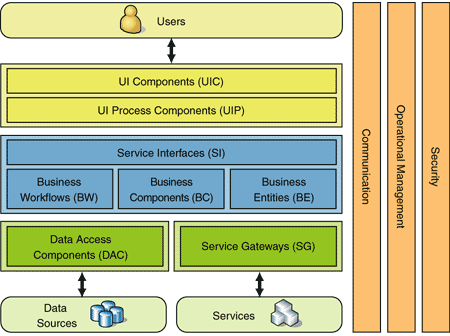
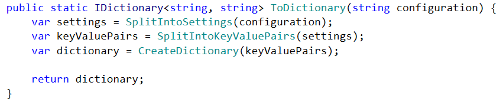
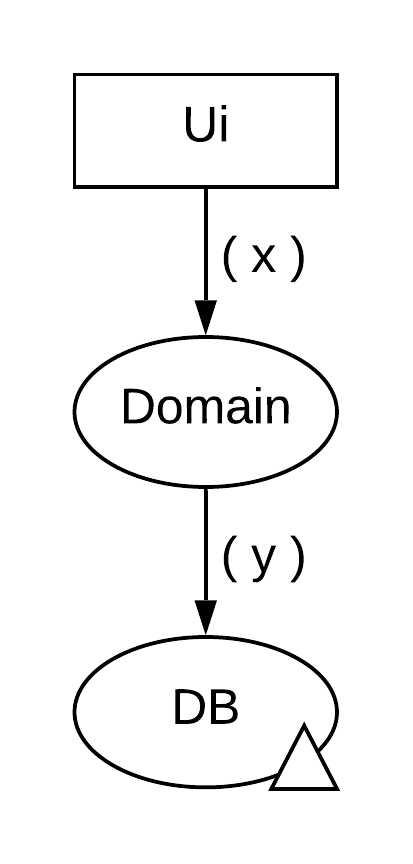
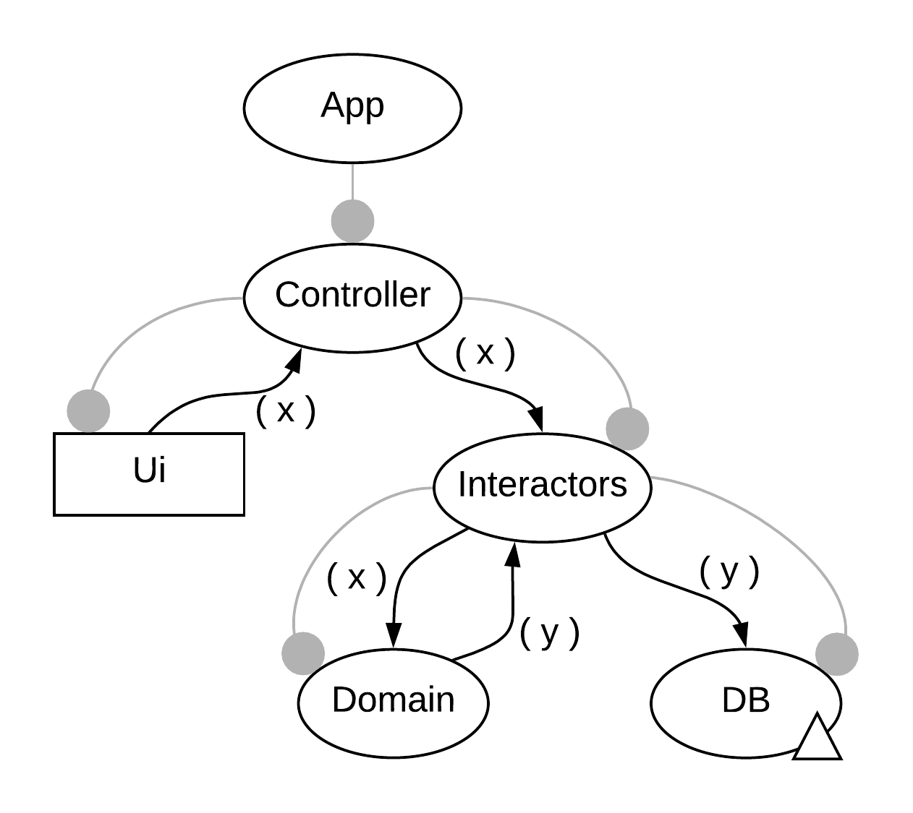
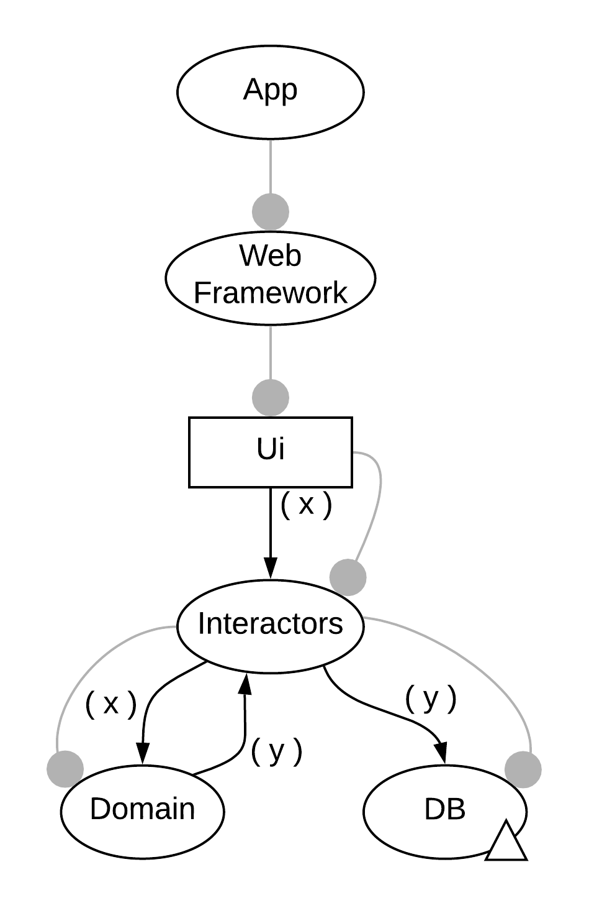
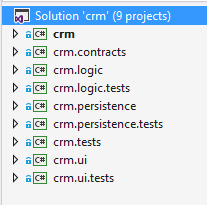
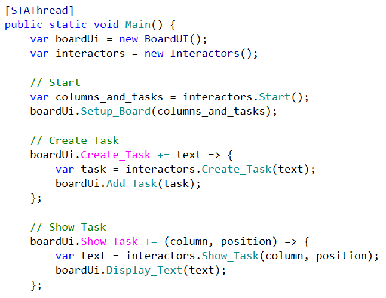
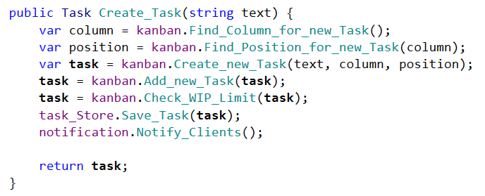
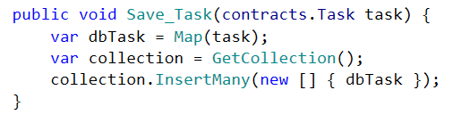

<!-- Page 1 of 61 -->

Softwareentwicklung
ohne
Abhängigkeiten
Stefan Lieser
stefan@lieser-online.de
http://refactoring-legacy-code.net

---

<!-- Page 2 of 61 -->

https://flow-design.info/buch
Vorabveröffentlichung
- E-Book (PDF, mobi, epub)
- Inhalt vollständig (400 Seiten)
- Endgültige Version im Preis enthalten
- Sonderpreis 19,95 EUR

---

<!-- Page 3 of 61 -->

---

<!-- Page 4 of 61 -->

Korrektheit

---

<!-- Page 5 of 61 -->

Korrektheit
&
Wandelbarkeit

---

<!-- Page 6 of 61 -->

Typische Struktur von
Abhängigkeiten

---

<!-- Page 7 of 61 -->

Typische Struktur von
Abhängigkeiten
= Funktionseinheit (Methode, Klasse, etc.)
A B = Abhängigkeit (A ist abhängig von B)

---

<!-- Page 8 of 61 -->

Typische Struktur von
Abhängigkeiten

---

<!-- Page 9 of 61 -->

Typische Struktur von
Abhängigkeiten
Änderungen

---

<!-- Page 10 of 61 -->

Typische Struktur von
Abhängigkeiten
=>
Keine Domänenlogik,
nur Daten

---

<!-- Page 11 of 61 -->

Domänenlogik
Logik, die das Thema
der Anwendung betrifft.

---

<!-- Page 12 of 61 -->

Typische Struktur von
Abhängigkeiten

---

<!-- Page 13 of 61 -->

Typische Struktur von
Abhängigkeiten
Änderungen

---

<!-- Page 14 of 61 -->

Typische Struktur von
Abhängigkeiten
Keine Domänenlogik,
nur Integration
=>

---

<!-- Page 15 of 61 -->

Integrationstests
erforderlich!!!

---

<!-- Page 16 of 61 -->

---

<!-- Page 17 of 61 -->

Unit Tests einfach, da keine Abhängigkeiten

---

<!-- Page 18 of 61 -->

Unit Tests aufwändig, Einsatz von Attrappen

---

<!-- Page 19 of 61 -->

Knoten = Integration
Blätter = Operationen = Domänenlogik

---

<!-- Page 20 of 61 -->

Integration Operation
Segregation Principle (IOSP)

---

<!-- Page 21 of 61 -->

Systemtests (E2E)
Integrationstests
Unittests

---

<!-- Page 22 of 61 -->

Systemtests (E2E)
Integrationstests
Unittests

---

<!-- Page 23 of 61 -->

Integration
Operation
Data
API
Integration Operation
Data API (IODA)

---

<!-- Page 24 of 61 -->

IOSP

---

<!-- Page 25 of 61 -->

Motorische Endplatte
Nervenzelle
Muskelzelle

---

<!-- Page 26 of 61 -->

Motorische Endplatte
Nervenzelle
Muskelzelle

---

<!-- Page 27 of 61 -->

Motorische Endplatte
Nervenzelle
Acetylcholin
Muskelzelle

---

<!-- Page 28 of 61 -->

Motorische Endplatte
Nervenzelle
Acetylcholin
Muskelzelle

---

<!-- Page 29 of 61 -->

Principle of Mutual
Oblivion (PoMO)
Prinzip der
gegenseitigen
Nichtbeachtung

---

<!-- Page 30 of 61 -->

PoMO

---

<!-- Page 31 of 61 -->

f1 f2 f3 f4
( a ) ( x ) ( y ) ( z ) ( b )

---

<!-- Page 32 of 61 -->

f1 f2 f3 f4
( a ) ( b )
( x ) ( y ) ( z )

---

<!-- Page 33 of 61 -->

PoMO verletzt
(Principle of Mutual Oblivion)
-> f1 ist abhängig von f2
f1 f2 f3 f4
( a ) ( b )
( x ) ( y ) ( z )

---

<!-- Page 34 of 61 -->

IOSP verletzt
(Integration Operation Segregation Principle)
-> f1 enthält Domänenlogik und integriert f2
f1 f2 f3 f4
( a ) ( b )
( x ) ( y ) ( z )

---

<!-- Page 35 of 61 -->

f
f1 f2 f3 f4
( a ) ( x ) ( y ) ( z ) ( b )

---

<!-- Page 36 of 61 -->

f
IOSP
f1 f2 f3 f4
( a ) ( x ) ( y ) ( z ) ( b )
PoMO

---

<!-- Page 37 of 61 -->

Flow Design:
Datenflussdiagramme
( x ) ( y )
f
( x ) ( z ) ( y )
f1 f2
= Funktionseinheit (Methode, Klasse, etc.)
( x )
A B = Datenfluss (ein x fließt von A nach B)
= Verfeinerung

---

<!-- Page 38 of 61 -->

Mit Abhängigkeiten (FALSCH!!)
( x ) ( y )
f
( x ) ( z ) ( y )
f1 f2
Y f(X x) { Y f1(X x) { Y f2(Z z) {
return f1(x); var z = …. var y = …
}
return f2(z); return y;
} }

---

<!-- Page 39 of 61 -->

Mit Abhängigkeiten (FALSCH!!)
( x ) ( y )
f
( x ) ( z ) ( y )
f1 f2
Y f(X x) { Y f1(X x) { Y f2(Z z) {
return f1(x); var z = …. var y = …
}
return f2(z); return y;
} }
Integration Integration + Operation
Operation

---

<!-- Page 40 of 61 -->

Ohne Abhängigkeiten
( x ) ( y )
f
( x ) ( z ) ( y )
f1 f2
Y f(X x) { Z f1(X x) { Y f2(Z z) {
var z = f1(x); var z = …. var y = …
var y = f2(z);
return y; return z; return y;
} } }

---

<!-- Page 41 of 61 -->

Ohne Abhängigkeiten
( x ) ( y )
f
( x ) ( z ) ( y )
f1 f2
Y f(X x) { Z f1(X x) { Y f2(Z z) {
var z = f1(x); var z = …. var y = …
var y = f2(z);
return y; return z; return y;
} } }
Integration Operation Operation

---

<!-- Page 42 of 61 -->

---

<!-- Page 43 of 61 -->

Typischer Datenfluss

---

<!-- Page 44 of 61 -->

Typische Abhängigkeiten
Desktop

---

<!-- Page 45 of 61 -->

Typische Abhängigkeiten
Web

---

<!-- Page 46 of 61 -->

Korrekte Abhängigkeiten
Desktop

---

<!-- Page 47 of 61 -->

Korrekte Abhängigkeiten
Web

---

<!-- Page 48 of 61 -->

Projektstruktur

---

<!-- Page 49 of 61 -->

Projektstruktur
Application
Integration
.exe Projekt
maximale
Abhängigkeiten
Referenziert alle anderen
Projekte. Startet die
Anwendung in der Main
Methode.

---

<!-- Page 50 of 61 -->

Projektstruktur
Kontrakte
Interfaces, Datentypen
.dll Projekt
keine Abhängigkeiten

---

<!-- Page 51 of 61 -->

Projektstruktur
Komponenten
Logik, UI, Ressourcen,
etc.
.dll Projekte
Keine Abhängigkeiten,
referenziert lediglich
die Kontrakte.
Tests referenzieren
zugehörige Impl.

---

<!-- Page 52 of 61 -->

crm
crm.persistence
crm.logic crm.ui
crm.contracts

---

<!-- Page 53 of 61 -->

---

<!-- Page 54 of 61 -->

---

<!-- Page 55 of 61 -->

---

<!-- Page 56 of 61 -->

---

<!-- Page 57 of 61 -->

Integration Operation
Segregation Principle (IOSP)

---

<!-- Page 58 of 61 -->

Principle of Mutual
Oblivion (PoMO)
Prinzip der
gegenseitigen
Nichtbeachtung

---

<!-- Page 59 of 61 -->

Quellcode Beispiele
https://github.com/slieser/flowdesignbuch

---

<!-- Page 60 of 61 -->

Das nächste Webinar
30.06.2020 - 18:00
Flow Design am Beispiel
https://stefanlieser.webinarninja.com/live-webinars/365899/register
https://flow-design.info/buch

---

<!-- Page 61 of 61 -->

http://refactoring-legacy-code.net
https://twitter.com/StefanLieser
http://xing.com/profile/stefan_lieser
http://linkedin.com/in/stefanlieser

