<!-- Page 1 of 493 -->

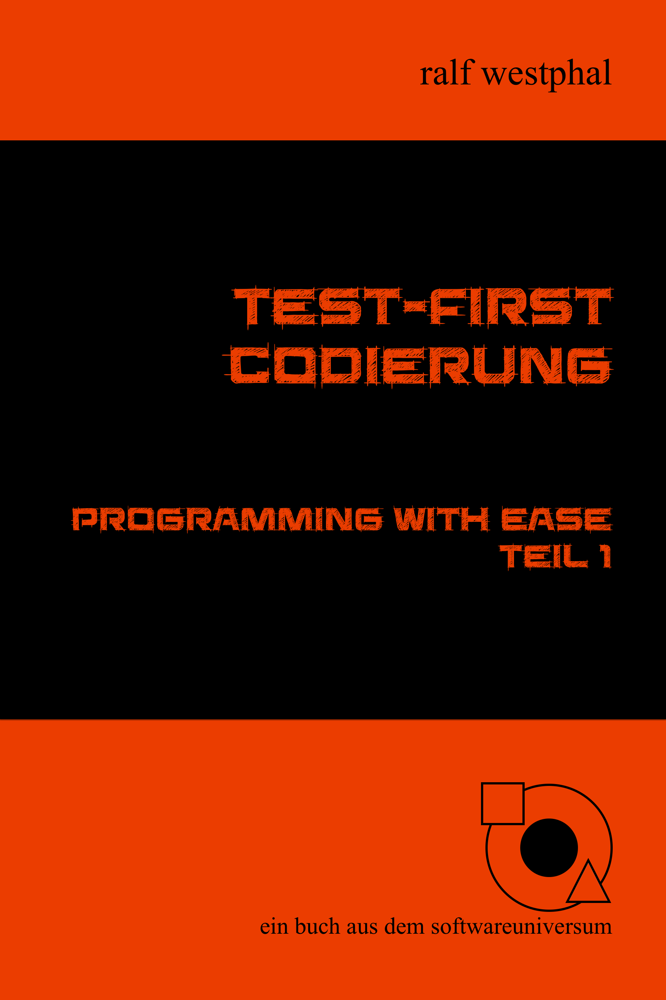

---

<!-- Page 2 of 493 -->

Test-first Codierung
Programming with Ease - Teil 1
Ralf Westphal
Dieses Buch wird verkauft unter http://leanpub.com/test-first-codierung
Diese Version wurde veröffentlicht am 2021-12-14
Dies ist ein Leanpub-Buch. Leanpub bietet Autoren und Verlagen, mit
Hilfe von Lean-Publishing, neue Möglichkeiten des Publizierens. Lean
Publishing bedeutet die wiederholte Veröffentlichung neuer
Beta-Versionen eines eBooks unter der Zuhilfenahme schlanker
Werkzeuge. Das Feedback der Erstleser hilft dem Autor bei der
Finalisierung und der anschließenden Vermarktung des Buches. Lean
Publishing unterstützt den Autor darin ein Buch zu schreiben, das auch
gelesen wird.
© 2020 - 2021 Ralf Westphal

---

<!-- Page 3 of 493 -->

Ebenfalls von Ralf Westphal
Softwareentwurf mit Flow-Design
Software Anforderungsanalyse mit Slicing
Die IODA Architektur im Vergleich
Arbeiten im Office mit System
Produktiver und zufriedener im Office

---

<!-- Page 4 of 493 -->

Inhaltsverzeichnis
Zum Geleit . . . . . . . . . . . . . . . . . . . . . . . . . . . . . . . 1
Motivation . . . . . . . . . . . . . . . . . . . . . . . . . . . . . . . 4
Programming with Ease . . . . . . . . . . . . . . . . . . . . . . 5
Das Softwareuniversum . . . . . . . . . . . . . . . . . . . . . . 9
Einleitung . . . . . . . . . . . . . . . . . . . . . . . . . . . . . . . 12
Anforderungskategorien . . . . . . . . . . . . . . . . . . . . . . 12
It’s the productivity, stupid! . . . . . . . . . . . . . . . . . . . . 13
Produktivitätskiller . . . . . . . . . . . . . . . . . . . . . . . . . 15
Fehlende Korrekheit . . . . . . . . . . . . . . . . . . . . . . 17
Fehlender Wert . . . . . . . . . . . . . . . . . . . . . . . . . 19
Fehlende Ordnung . . . . . . . . . . . . . . . . . . . . . . . 21
Zusammenfassung . . . . . . . . . . . . . . . . . . . . . . . . . 24
Die Methode
. . . . . . . . . . . . . . . . . . . . . . . . 28
01 - Die Anforderung-Logik Lücke . . . . . . . . . . . . . . . . . 29
Logik - Der Stoff aus dem Verhalten entsteht . . . . . . . . . . . 29
Funktionalität . . . . . . . . . . . . . . . . . . . . . . . . . . 32
EffizienzI-EffizienzdurchAlgorithmenundDatenstrukturen 33
Effizienz II - Effizienz durch Verteilung . . . . . . . . . . . . 34
Zusammenfassung . . . . . . . . . . . . . . . . . . . . . . . 36
Von den Anforderungen zur Logik . . . . . . . . . . . . . . . . 37
Logik schwer definierbar . . . . . . . . . . . . . . . . . . . . 37
Die Phasen der Programmierung . . . . . . . . . . . . . . . 42
Zusammenfassung . . . . . . . . . . . . . . . . . . . . . . . 47
Übungsaufgaben . . . . . . . . . . . . . . . . . . . . . . . . . . 49

---

<!-- Page 5 of 493 -->

INHALTSVERZEICHNIS
02 - Vorläufig codieren im Chaos . . . . . . . . . . . . . . . . . . 53
Das Nein der Codierung . . . . . . . . . . . . . . . . . . . . . . 53
Prototyping to the Rescue . . . . . . . . . . . . . . . . . . . . . 55
Die Schwierigkeit der Umsetzung einstufen . . . . . . . . . . . . 60
Zusammenfassung . . . . . . . . . . . . . . . . . . . . . . . . . 62
03 - Sofort codieren in der Trivialität . . . . . . . . . . . . . . . . 64
Trivialität als Gegenteil von Chaos . . . . . . . . . . . . . . . . 64
Vorsicht vor Selbstüberschätzung! . . . . . . . . . . . . . . . . . 66
04 - Schrittweise codieren in der Einfachheit . . . . . . . . . . . . 68
Trittsteine legen . . . . . . . . . . . . . . . . . . . . . . . . . . . 68
Pear Programming . . . . . . . . . . . . . . . . . . . . . . . 73
Die Kunst der Problemskalierung . . . . . . . . . . . . . . . . . 74
Sichtbarkeit von Variationsdimensionen . . . . . . . . . . . 76
Variationen ordnen . . . . . . . . . . . . . . . . . . . . . . . 79
Am Beispiel . . . . . . . . . . . . . . . . . . . . . . . . . . . . . 82
Zusammenfassung . . . . . . . . . . . . . . . . . . . . . . . . . 88
Übungsaufgaben . . . . . . . . . . . . . . . . . . . . . . . . . . 89
05 - Komplementär codieren in der Kompliziertheit . . . . . . . . 93
Zerlegung in komplementäre Teilprobleme . . . . . . . . . . . . 95
Funktionen repräsentieren Lösungen . . . . . . . . . . . . . 98
Integration Operation Segregation Principle . . . . . . . . . . . 101
Zerlegungsbeispiel I . . . . . . . . . . . . . . . . . . . . . . . . 105
Leitfragen für die Zerlegung . . . . . . . . . . . . . . . . . . 106
Analyse & Entwurf . . . . . . . . . . . . . . . . . . . . . . . 106
Codierung . . . . . . . . . . . . . . . . . . . . . . . . . . . 107
Reflexion . . . . . . . . . . . . . . . . . . . . . . . . . . . . 114
Buddelschiff Programmierung . . . . . . . . . . . . . . . . . . . 116
Zerlegungsbeispiel II . . . . . . . . . . . . . . . . . . . . . . . . 118
Bottom-up Codierung . . . . . . . . . . . . . . . . . . . . . 120
Reflexion . . . . . . . . . . . . . . . . . . . . . . . . . . . . 127
Zusammenfassung . . . . . . . . . . . . . . . . . . . . . . . . . 128
Übungsaufgaben . . . . . . . . . . . . . . . . . . . . . . . . . . 130
06 - Tests als Treiber der Modularisierung . . . . . . . . . . . . . 136
Akzeptanztests . . . . . . . . . . . . . . . . . . . . . . . . . . . 137
Triviale Probleme . . . . . . . . . . . . . . . . . . . . . . . . 140
Einfache Probleme . . . . . . . . . . . . . . . . . . . . . . . 141

---

<!-- Page 6 of 493 -->

INHALTSVERZEICHNIS
Komplizierte Probleme . . . . . . . . . . . . . . . . . . . . . 142
Gerüsttests . . . . . . . . . . . . . . . . . . . . . . . . . . . . . 143
Gerüsttestfälle erhalten I - Akzeptanztests . . . . . . . . . . 147
Gerüsttestfälle erhalten II - Modultests . . . . . . . . . . . . 149
Zusammenfassung . . . . . . . . . . . . . . . . . . . . . . . . . 155
Übungsaufgaben . . . . . . . . . . . . . . . . . . . . . . . . . . 157
07 - Testbarkeit steigern mit Surrogaten . . . . . . . . . . . . . . 160
Logik dynamisch binden . . . . . . . . . . . . . . . . . . . . . . 163
Statische Bindung . . . . . . . . . . . . . . . . . . . . . . . 164
Dynamische Bindung mit Funktionszeigern . . . . . . . . . 167
Dynamische Bindung mit Objekten . . . . . . . . . . . . . . 168
Zusammenfassung . . . . . . . . . . . . . . . . . . . . . . . 173
Surrogate in Tests einsetzen . . . . . . . . . . . . . . . . . . . . 174
Extraktion einer Klasse und Abstraktion mit Interface . . . . 175
Injektion einer Objektfabrik . . . . . . . . . . . . . . . . . . 176
Surrogate unterschieben . . . . . . . . . . . . . . . . . . . . 178
Reflexion . . . . . . . . . . . . . . . . . . . . . . . . . . . . 181
IOSP over Surrogates . . . . . . . . . . . . . . . . . . . . . . . . 184
Extraktion eines Belangs . . . . . . . . . . . . . . . . . . . . 188
Refactoring to Functional Core . . . . . . . . . . . . . . . . 191
Schritte in die Objektorientierung . . . . . . . . . . . . . . . 193
Zusammenfassung . . . . . . . . . . . . . . . . . . . . . . . . . 195
Übungsaufgaben . . . . . . . . . . . . . . . . . . . . . . . . . . 197
08 - Experimentell codieren in der Komplexität . . . . . . . . . . 201
Experimentelles Vorgehen im Testcode . . . . . . . . . . . . . . 203
TDD as if you meant it (TDDaiymi) . . . . . . . . . . . . . 204
Beispiel #1: FromRoman revisted . . . . . . . . . . . . . . . . . 206
Inkrement 1 . . . . . . . . . . . . . . . . . . . . . . . . . . . 207
Inkrement 2 . . . . . . . . . . . . . . . . . . . . . . . . . . . 207
Inkrement 3 . . . . . . . . . . . . . . . . . . . . . . . . . . . 208
Inkrement 4 . . . . . . . . . . . . . . . . . . . . . . . . . . . 209
Inkrement 5 . . . . . . . . . . . . . . . . . . . . . . . . . . . 210
Inkrement 6 . . . . . . . . . . . . . . . . . . . . . . . . . . . 211
Reflexion . . . . . . . . . . . . . . . . . . . . . . . . . . . . 214
Beispiel #2: Eine ruhige Bowlingkugel schieben . . . . . . . . . . 217
Analyse . . . . . . . . . . . . . . . . . . . . . . . . . . . . . 220
Codierung . . . . . . . . . . . . . . . . . . . . . . . . . . . 222
Reflexion . . . . . . . . . . . . . . . . . . . . . . . . . . . . 235

---

<!-- Page 7 of 493 -->

INHALTSVERZEICHNIS
Zusammenfassung . . . . . . . . . . . . . . . . . . . . . . . . . 235
Übungsaufgaben . . . . . . . . . . . . . . . . . . . . . . . . . . 238
09 - Test-first refaktorisieren . . . . . . . . . . . . . . . . . . . . . 241
Frustrierende Lektüre . . . . . . . . . . . . . . . . . . . . . . . . 244
Fehlende Bedeutung . . . . . . . . . . . . . . . . . . . . . . 244
Fehlende Zusammenhänge . . . . . . . . . . . . . . . . . . . 246
Fehlende Testbarkeit . . . . . . . . . . . . . . . . . . . . . . 248
Warum refaktorisieren? . . . . . . . . . . . . . . . . . . . . . . 249
Softwarewartung erhält Ordnung proaktiv . . . . . . . . . . 250
Schrittweise aufräumen I . . . . . . . . . . . . . . . . . . . . . . 254
Bestimme das System-to-Refactor (S2R) . . . . . . . . . . . 254
Refactor to Test-First . . . . . . . . . . . . . . . . . . . . . . 268
Schrittweise aufräumen II . . . . . . . . . . . . . . . . . . . . . 275
Refactor to IOSP . . . . . . . . . . . . . . . . . . . . . . . . 275
Refactor to Modules . . . . . . . . . . . . . . . . . . . . . . 295
Dokumentieren . . . . . . . . . . . . . . . . . . . . . . . . . 306
Reflexion . . . . . . . . . . . . . . . . . . . . . . . . . . . . 308
Zusammenfassung . . . . . . . . . . . . . . . . . . . . . . . . . 309
Übungsaufgaben . . . . . . . . . . . . . . . . . . . . . . . . . . 312
10 - Finale mit Testmatrix . . . . . . . . . . . . . . . . . . . . . . 316
Anhang - Musterlösungen
. . . . . . . . . . .325
Musterlösung: 01 - Die Anforderung-Logik Lücke . . . . . . . . . 327
Aufgabe 1 - Gründe für automatisiertes Testen . . . . . . . . . . 327
Beispielhafte Gründe für die Testautomatisierung . . . . . . 327
Beispielhafte Gründe für test-first Testautomatisierung . . . 328
Aufgabe 2 - Eine Anwendung test-first entwickeln . . . . . . . . 330
Analyse . . . . . . . . . . . . . . . . . . . . . . . . . . . . . 330
Entwurf der Persistenz . . . . . . . . . . . . . . . . . . . . . 331
Codierung . . . . . . . . . . . . . . . . . . . . . . . . . . . 332
Musterlösung: 04 - Schrittweise codieren in der Einfachheit . . . 335
Aufgabe 1 - Einschätzung des Schwierigkeitsgrades . . . . . . . 335
Mathematischen Ausdruck berechnen . . . . . . . . . . . . 335
Game-of-Life . . . . . . . . . . . . . . . . . . . . . . . . . . 341
NQueen . . . . . . . . . . . . . . . . . . . . . . . . . . . . . 342

---

<!-- Page 8 of 493 -->

INHALTSVERZEICHNIS
Binärzahlenkonvertierung . . . . . . . . . . . . . . . . . . . 343
Aufgabe 2 - Römische Zahlen in Dezimalzahlen wandeln . . . . 345
Verständnis dokumentieren . . . . . . . . . . . . . . . . . . 345
Inkrementelle Testfälle definieren . . . . . . . . . . . . . . . 345
Test-first codieren . . . . . . . . . . . . . . . . . . . . . . . 346
Reflexion . . . . . . . . . . . . . . . . . . . . . . . . . . . . . . 350
Musterlösung:05-KomplementärcodiereninderKompliziertheit351
Aufgabe 1 - Römische Zahlen kompliziert wandeln . . . . . . . 351
Zerlegung für Lösungsansatz 1 . . . . . . . . . . . . . . . . 351
Zerlegung für Lösungsansatz 2 . . . . . . . . . . . . . . . . 352
Reflexion . . . . . . . . . . . . . . . . . . . . . . . . . . . . 353
Aufgabe 2 - Game of Life . . . . . . . . . . . . . . . . . . . . . 354
Verständnis dokumentieren . . . . . . . . . . . . . . . . . . 354
Schrittweise zerlegen . . . . . . . . . . . . . . . . . . . . . . 355
Akzeptanztests . . . . . . . . . . . . . . . . . . . . . . . . . 362
Teilprobleme bottom-up lösen . . . . . . . . . . . . . . . . . 364
Reflexion . . . . . . . . . . . . . . . . . . . . . . . . . . . . 382
Musterlösung: 06 - Tests als Treiber der Modularisierung . . . . 385
Analyse . . . . . . . . . . . . . . . . . . . . . . . . . . . . . . . 385
Inkrementelle Teilprobleme . . . . . . . . . . . . . . . . . . 385
Zerlegung der Inkremente inkl. Codierung . . . . . . . . . . . . 387
Akzeptanztest . . . . . . . . . . . . . . . . . . . . . . . . . . 387
Inkrement I . . . . . . . . . . . . . . . . . . . . . . . . . . . 387
Inkrement II . . . . . . . . . . . . . . . . . . . . . . . . . . 389
Inkrement III . . . . . . . . . . . . . . . . . . . . . . . . . . 391
Inkrement IV . . . . . . . . . . . . . . . . . . . . . . . . . . 394
Inkrement V . . . . . . . . . . . . . . . . . . . . . . . . . . 398
Reflexion . . . . . . . . . . . . . . . . . . . . . . . . . . . . 399
Refaktorisierung mit nachträglicher Modularisierung . . . . . . 401
Zusammenfassung . . . . . . . . . . . . . . . . . . . . . . . . . 403
Musterlösung: 07 - Testbarkeit steigern mit Surrogaten . . . . . . 405
Aufgabe 1 - CSV-Daten tabellieren . . . . . . . . . . . . . . . . 405
Analyse . . . . . . . . . . . . . . . . . . . . . . . . . . . . . 405
Planung . . . . . . . . . . . . . . . . . . . . . . . . . . . . . 406
Umsetzung . . . . . . . . . . . . . . . . . . . . . . . . . . . 406
Reflexion . . . . . . . . . . . . . . . . . . . . . . . . . . . . 413
Aufgabe 2 - Game-of-Life . . . . . . . . . . . . . . . . . . . . . 418

---

<!-- Page 9 of 493 -->

INHALTSVERZEICHNIS
Analyse . . . . . . . . . . . . . . . . . . . . . . . . . . . . . 418
Planung . . . . . . . . . . . . . . . . . . . . . . . . . . . . . 418
Umsetzung . . . . . . . . . . . . . . . . . . . . . . . . . . . 418
Reflexion . . . . . . . . . . . . . . . . . . . . . . . . . . . . 425
Zusammenfassung . . . . . . . . . . . . . . . . . . . . . . . . . 428
Musterlösung: 08 - Experimentell codieren in der Komplexität . 430
Analyse . . . . . . . . . . . . . . . . . . . . . . . . . . . . . . . 430
Planung . . . . . . . . . . . . . . . . . . . . . . . . . . . . . . . 430
Zerlegung in Teilprobleme . . . . . . . . . . . . . . . . . . . 430
Inkrementelle Testfälle für die komplexen Probleme . . . . . 431
Codierung . . . . . . . . . . . . . . . . . . . . . . . . . . . . . . 432
Akzeptanztests . . . . . . . . . . . . . . . . . . . . . . . . . 432
TDDaiymi - Lange Worte zerschneiden . . . . . . . . . . . . 433
TDDaiymi - Zeilen zusammensetzen . . . . . . . . . . . . . 440
Triviale Probleme lösen . . . . . . . . . . . . . . . . . . . . 447
Integration . . . . . . . . . . . . . . . . . . . . . . . . . . . 448
Refaktorisierung in Module . . . . . . . . . . . . . . . . . . 450
Reflexion . . . . . . . . . . . . . . . . . . . . . . . . . . . . . . 453
Zurückhaltung als Tugend . . . . . . . . . . . . . . . . . . . 455
Musterlösung: 09 - Test-first refaktorisieren . . . . . . . . . . . . 457
Abgrenzung des System to Refactor (S2R) . . . . . . . . . . . . . 457
Characterization Test . . . . . . . . . . . . . . . . . . . . . . . . 457
S2R Entry Point testbar machen . . . . . . . . . . . . . . . . 458
Console kapseln . . . . . . . . . . . . . . . . . . . . . . . . 458
Characterization Test aufsetzen . . . . . . . . . . . . . . . . 460
Verantwortlichkeiten identifizieren . . . . . . . . . . . . . . . . 462
Entwurf der neuen Codestruktur . . . . . . . . . . . . . . . . . 465
Funktionen extrahieren . . . . . . . . . . . . . . . . . . . . . . 466
Kommandozeilenanalyse . . . . . . . . . . . . . . . . . . . . 466
HexDump I - Entzerrung der Logik . . . . . . . . . . . . . . 466
HexDump II - Refactor to IOSP . . . . . . . . . . . . . . . . 472
Refactor to Modules . . . . . . . . . . . . . . . . . . . . . . . . 473
Bonus Verbesserungen . . . . . . . . . . . . . . . . . . . . . . . 477
Auflösung einer logischen Abhängigkeit . . . . . . . . . . . 477
Fehlerkorrektur in der Ausgabe . . . . . . . . . . . . . . . . 480
Zusammenfassung . . . . . . . . . . . . . . . . . . . . . . . . . 483

---

<!-- Page 10 of 493 -->

Zum Geleit
Hallo, lieber Leser! Mein Name ist Ralf Westphal und ich bin dein Guide
bei der Erkundung des Thematest-first Codierung. Mir liegt es als ein zen-
traler Aspekt für saubere, nachhaltige Programmierung sehr am Herzen.
Deshalb habe ich mich nach Jahren des Denkens, Tüftelns, Anwendens,
Diskutierens und Unterrichtens entschieden, meine Sicht darauf einmal
in einem Buch zusammenzufassen. Das, was vorher über viele Blog-
Artikel und Konferenzvorträge verteilt und nur unvollständig nachlesbar
manifestiert war, habe ich nun gesammelt und mit Übungsaufgaben
versehen. Ich hoffe, damit gebe ich dir einen soliden Handlauf für das
Selbststudium.
Gleichzeitig ist dieses Buch wie die anderen in der Reihe Programming
with Ease aber auch Grundlage für meine interaktiven Trainings. Infor-
mationen zu denen findest du auf meiner Homepage: https://ralfw.de/
Und wer bin ich, dass ich mir zugetraut habe, dieses Buch zu schreiben?
• Seit 1986 bin ich selbstständig in der Softwarebranche tätig. Von
1988 bis 1998 als Co-Geschäftsführer einer Entwicklungsfirma für
Standardsoftware in einer Handwerksbranche.
• 1998 habe ich mich dann mehr meiner Leidenschaft “Forschung
und Entwicklung” hingegeben, indem ich Chefredakteur der VB-
Fachzeitschrift BasicPro geworden bin (bis 2001). Mir lag es am
Herzen, über spannende Softwaretechnologien zu berichten und
andere dabei anzuleiten. Seit Anfang der 1980er hatte ich immer
mal wieder in Fachmagazinen etwas beigetragen, doch nun sollte
“das Weitersagen” mein Beruf werden.
• Ab 2000 war ich viele Jahre sehr in der Microsoft-Community
unterwegs als sog. Regional Director und dann Most Valued Pro-
fessional. Ich habe auf vielen Konferenzen in Deutschland und den
USA gesprochen und auch Entwicklerveranstaltungen mit organi-
siert. Gleichzeitig habe ich weiter über Technologien und zuneh-
mend Softwarearchitekturthemen geschrieben und Projektberatun-
gen und Trainings durchgeführt.

---

<!-- Page 11 of 493 -->

ZumGeleit 2
• 2008 schließlich war das Jahr, in dem Stefan Lieser und ich an-
gefangen haben, eine deutsche Clean Code Community aufzubau-
en. Angefangen haben wir mit einem Wiki - https://clean-code-
developer.de/ -, in dem wir Prinzipien und Praktiken für saubere
Programmierung weiterentwickelt um die Basis eines Wertesys-
temsdokumentierthaben.IndenFolgejahrenhabenwirvieleClean
Code Developer Trainings gemacht und die Grundlagen dafür
zusammengetragen, was du in diesem Buch liest. Wir haben uns
intensiv und kritisch mit dem Thema Clean Code auseinanderge-
setzt.
• Irgendwann vielleicht ab 2018 schien mir dann der Begriff “Clean
Code” zwar etabliert, doch nicht mehr ausreichend, um das zu
beschreiben, wohin sich mein Denken entwickelt hatte. Aus der
Clean Code Praxis der Jahre davor hatte sich schon Flow-Design
herausgeschält als eigenständiger Ansatz zum Entwurf von sau-
berem Code - siehe auch das gleichnamige Buch in dieser Reihe
-, d.h. einem Denkwerkzeug für die Entwicklungsarbeit vor der
eigentlichen Codierung. Doch auch dieser Begriff war noch nicht
umfassend genug. Zu dem, worum es seit 2008 gegangen war -
nämlich einer nachhaltigen Softwareentwicklung - gehört einfach
noch mehr.
• 2020 schließlich habe ich mich entschieden, die drei Säulen, die sich
für nachhaltige Softwareentwicklung als notwendig und tragend
bewehrt hatten, unter dem Titel Programming with Ease zusam-
menzufassen und in einer Buchreihe zu dokumentieren.
Du siehst, mein Weg hat sich vom Anwender von Softwaretechnologien
über den Autor, der ihre Anwendung beschreibt, und den Trainer, der den
Entwurf ihrer Anwendung vermittelt, an einen Punkt geschlängelt, wo
ichnunmotivierenmöchtebeiderganzenAnwendungdieNachhaltigkeit
nicht zu vergessen.
Weil Nachhaltigkeit so wichtig ist und aus verschiedenen Gründe sehr an
grundlegenden Überzeugungen und Gewohnheiten der Softwareentwick-
lung und ihres Management rührt, erlaube ich mir auch den persönlichen
Ton, in dem ich dich hier schon anspreche. Der mag für dich in einem
Buch ungewohnt sein und eher zu Blog-Artikeln passen, doch mir liegt
das Thema so am Herzen, dass ich glaube, mit einer direkteren, weniger
gestelzten Ansprache es besser rüberzubringen.

---

<!-- Page 12 of 493 -->

ZumGeleit 3
Dazu kommt, dass ich damit von Anfang den Eindruck verwischen
möchte, es handle sich hier um letzte Weisheiten, absolute Wahrheiten
undobjektiveFakten.Nein,leiderkannichalldasnichtbietenunderlaube
mir sogar die Behauptung, kein Autor, den du zum Thema liest, kann das,
egal wie sein Name lauten oder sein Schreibstil sein mag.
Mehr als “informierte Erfahrungen im Fluss” kann ich dir nicht bieten.
Was du hier lesen wirst, ist ein Schnappschuss meines Denkens. Deshalb
habe ich auch lange gezögert, überhaupt ein Buch darüber zu schreiben;
das Format suggeriert ein größeres Gewicht des Inhalts, als er verdient.
Doch jetzt scheint mir ein Plateau in meinem Erkenntnisgewinnungspro-
zess erreicht, der eine solch umfängliche Aufzeichnung doch rechtfertigt.
Wenn ich dir damit helfen kann, in deinem Denken weiterzukommen,
freue ich mich. Nur um Weiterkommen, nicht um Ankommen geht es.
Ich wünsche dir Erkenntnisgewinn und auch Spaß bei der Lektüre!
-Ralf Westphal

---

<!-- Page 13 of 493 -->

Motivation
Der Softwareentwicklung fehlt etwas. Was fehlt, ist eine Form von Klar-
heit und vor allem Gelassenheit. So ist zumindest mein Gefühl, wenn ich
Softwareentwickler in meinen Clean Code Trainings oder auch an ihrem
Arbeitsplatz beobachte.
Wo Klarheit und Gelassenheit sind, da ist der Tritt sicher, da ist die
Zuverlässigkeit hoch, da stimmt die Qualität von vornherein umfassend
und die Stimmung ist entspannt. Leider scheint mir das aber nicht die
AtmosphäreindenmeistenSoftwareentwicklungsteamszusein.Oderwie
empfindest du es in deinem Team?
Stattdessen herrscht oft Verwirrung angesichts dessen, was der Kunde
will, es sind die Backlogs voll mit Bugs und das sprichwörtliche “What
the fuck?!” ist ständig hinter den Monitor-Triptychons im Team Room zu
hören (oder zumindest auf den Gesichtern der Entwickelnden zu lesen).
Was mögen die Gründe dafür sein? Es gibt sicher viele. Ein ganz grund-
legender scheint mir jedoch dieser: Die Softwareentwicklung ist ins
Ungleichgewicht gekommen. Sie erfüllt nicht in gleicher Weise sys-
tematisch und kompetent alle Anforderungen des Auftraggebers. Sie
starrtaufdieeinenundlässtdabeieinenblindenFleckfürdieanderen
entstehen. Das führt früher oder später zu einem für den Auftraggeber
sehr spürbaren Qualitätsdefizit, dessen Ausgleich schwerer und schwerer
wird. Das Kind ist tief im Brunnen. Es fehlt einfach an Nachhaltigkeit.
Gelassenheit ist in solcher Situation nicht mehr möglich, wenn Klarheit
über so lange Zeit so eklatant gefehlt hat. Programmierung mit Leichtig-
keit sieht anders aus.
Mehr Technologie, mehr Infrastruktur ist darauf keine Antwort. Vielmehr
ist - horribile dictu! - ein Kulturwandel nötig. Ohne grundsätzliches
Umdenken geht es nicht. Die Grundhaltung ist zu verändern: Es braucht
einBewusstseindafür,dassauchsoetwasimmaterielleswieSoftware,
Nachhaltigkeit braucht.

---

<!-- Page 14 of 493 -->

Motivation 5
Wenn in deinem Team schon agil gearbeitet wird, hast du eine Ahnung,
was Kultur und Kulturwandel bedeutet. Doch leider ist Agilität nicht
genug für nachhaltige Softwareentwicklung. Sie ist zwar notwendig für
die Nachhaltigkeit, die ich meine, aber nicht hinreichend.
Wie wichtig Nachhaltigkeit ist, weiß zwar schon lange jeder Koch und
jeder Chirurg - doch die Softwareentwicklung hinkt leider noch hinterher.
Die oberste Priorität haben bei Ersteren Sauberkeit und Hygiene; ohne
sie sind Erfolge nur von kurzer Dauer. Wer eine Küche am Ende des
Tages mit dreckigem Geschirr und voller Abfall zurücklässt, beschädigt
die Grundlage für die Arbeit morgen. Wer heute Operationsbesteck nicht
sterilisiert und am Ende einer Operation nicht zählt, riskiert Komplikatio-
nenmorgen.SauberkeitundHygienesindderRahmen,indemdasKochen
und chirurgische Eingriffe stattfinden.
Ich bin überzeugt, dass für die Softwareentwicklung ein Nachhaltigkeits-
rahmen erst noch solide aufgespannt werden muss. Korrektheit und
Ordnung sind noch nicht in gleicher Weise als Grundanforderungen
in der Softwareentwicklung anerkannt wie Sauberkeit und Hygiene
in anderen Branchen. Das ist die fehlende Klarheit, die die Entwicklung
von Gelassenheit verhindert.
Diese Situation verbessern zu helfen, ist mein Anliegen. Ich möchte dir
helfen, klarer und gelassener zu programmieren. Weniger Stress durch
mehr Nachhaltigkeit für deine Softwareentwicklung ist das Ziel. Wie das
erreicht werden kann, damit habe ich mich in den vergangenen 15 Jahren
intensiv auseinandergesetzt. Ich hoffe, du empfindest das, was ich hier
nun “an einem Ort” zusammentrage, als Hilfe in deinem Entwickleralltag.
-Ralf Westphal, 2020, Bansko (BG) / Hamburg (DE)
Programming with Ease
Nachhaltigere Softwareentwicklung in Klarheit und Gelassenheit umfasst
für mich mehr, als ich dir in diesem Buch vorstellen kann. Mit ein paar
Tipps&Tricks ist es nicht getan. Es geht durchaus ans Eingemachte: an
deine Glaubenssätze und Gewohnheiten.
DievielfachfehlendeNachhaltigkeitinderSoftwareentwicklungisteinso
tiefliegendesProblem,dasseinigeAnstrengungennötigsind,dieSituation

---

<!-- Page 15 of 493 -->

Motivation 6
zu ändern. Du wirst Zeit brauchen, anders wahrzunehmen, zu denken
und dann zu handeln. Dein Team wird Zeit brauchen, denn in der
Zusammenarbeit muss sich einiges ändern. Und schließlich wird sich
sogar dein Management und dein Auftraggeber ebenfalls ändern müssen
in den Erwartungen an dich und dein Team.
Das klingt nach einigem Aufwand, oder? Ja, stimmt. Leider kann ich dir
den nicht ersparen. Das Wurzelproblem von “schwer wartbarer Software”
liegt zu tief, als dass es dafür eine schnelle Lösung gäbe. Wenn du aber
dran bleibst… dann bin ich gewiss, dass sich die Mühe lohnt.
Vermitteln möchte ich dir - und deinem Team - Programming with Ease
als umfassende Herangehensweise an die Softwareentwicklung, die dich
abholt bei der Konfrontation mit Anforderungen und begleitet bis zur
Ablieferung von hochqualitativem Code.
UmmoderneTechnologienundtechnischeFeinheitengehtesnicht.React,
NoSql,GraphQL,Docker,Kubernetes,Kafka…alldasistdarinkeinThema.
Oder wenn, dann nur indirekt in Form von Prinzipien und Konzepten, die
dir helfen sollen, solche Technologien einzuordnen.
StattdessengehtesumPrinzipienundPraktikenderSoftwareentwicklung.
Das hört sich zwar nach “theoretischem Kram” an, doch sei gewiss,
mir ist es sehr, sehr wichtig, dass die Theorie in der Praxis gegründet
ist. Theoretische Überlegungen müssen zu praktisch hilfreichen Effekten
führen. Deshalb kann ich es dir nicht früh genug mit auf den Weg geben:
Welche Empfehlungen du auch immer hier lesen magst, egal wie sehr
ich sie begründe, sie stehen nie höher als der Zweck. Wenn du in einer
bestimmten Situation also meinst, einem Zweck nachhaltig besser dienen
zu können, als durch Befolgung einer Empfehlung… dann - by all means -
weiche von der Empfehlung ab. Allerdings: Du solltest schon wissen, was
dudatust.HabealsoeinebelastbareBegründungparat-wennschonnicht
mir gegenüber, dann aber für deine Teamkollegen.
Das Gesamtthema Programming with Ease ist also umfangreich. Wie ich
es dir nahebringe, habe ich lange überlegt. Am Ende habe ich mich dann
für 3 Bücher entschieden, die 1+3 Themenblöcke behandeln.
Test-first Codierung ist der erste Themenblock, auch wenn Codierung die
letzte Hürde ist, die du in der Programmierung nehmen musst. Dennoch
macht dieses Buch den Anfang in der Trilogie, weil es thematisch dir
als Entwickler wahrscheinlich am nächsten liegt. Codierung ist praktisch,

---

<!-- Page 16 of 493 -->

Motivation 7
Codierung ist nötig, Codierung hat technisch-technologischen Reiz… Ich
hoffe, dort kann ich dich am besten abholen, wenn es schon so ans
Eingemachte geht.
Im ersten Band geht es darum, dass Codierung aus meiner Sicht eben
ausschließlich test-first stattfinden sollte. Das zu akzeptieren und dann
auch zu leben, ist die erste Herausforderung auf dem Weg zu nachhaltiger
Programmierung. Ich hoffe, dass ich dir die Gründe dafür im ersten
Band ausführlich genug darlege und dir diese Praxis mit verschiedenen
Problemlösungsansätzen auch schmackhaft machen kann.
Softwareentwurfmit Flow-Design istder zweiteThemenblock, auchwenn
Entwurf als Planung von Code der Codierung vorausgehen sollte. Weil
“Planung” sich für dich aber vielleicht nicht so attraktiv anhört, wollte ich
das Thema nicht im ersten Band der Reihe behandeln, auch wenn ich es
für das wichtigste der drei Themen halte.
Ja, tatsächlich, ich hänge dem Glauben an, dass wir in der Program-
mierung mehr denken sollten. Mehr denken vor dem Codieren, ist der
Nachhaltigkeit absolut zuträglich. Nicht, dass nicht gedacht würde - doch
mein Eindruck ist, dass gewisse Themen dabei unberücksichtigt bleiben.
Es wird z.B. viel über den rechten Einsatz von Technologien und Infra-
struktur nachgedacht. Es wird auch viel über Agilität nachgedacht oder
über DevOps. Und das ist alles gut und richtig. Doch es bleibt ein blinder
Fleck. Um den dreht es sich bei Programming with Ease im Allgemeinen
und bei Flow-Design im Speziellen.
Der letzte Themenblock unter dem Bogen, den Programming with Ease
spannt, ist dann die Software Anforderungsanalyse mit Slicing. Damit
gehe ich noch einen Schritt vor den Entwurf und möchte dir empfehlen,
AnforderungendurcheinespezielleEntwicklerbrillezubetrachten.Durch
die Brille der Agilität siehst du Anforderungen als User Stories, Story-
boards, Epics oder gar Event Storms. Auch das ist alles wunderbar. Du
sollst davon nichts aufgeben. Doch in meiner Erfahrung ist auch durch
diese Brille etwas nicht sichtbar, das dir das Programmiererleben aber
leichter machen würde.
Der agilen Herangehensweise fehlt eine gewisse technische Sicht. Das
findeichganzverständlich,allemaldasichinzwischenScrumundKanban
als Vorgehensmodelle etabliert haben und von XP nur noch wenig zu

---

<!-- Page 17 of 493 -->

Motivation 8
hören ist.¹ Damit haben die “Softwarelaien” gewonnen, so dass Anfor-
derungen von ihnen definiert werden, wie es für sie nachvollziehbar ist.
Das soll natürlich auch so sein - nur darf eine Sichtweise, die dir als
Programmierer dient, deshalb nicht vernachlässigt werden. Das scheint
mir jedoch der Fall, so dass folgende Phasen in der Programmierung dir
schwerer Fallen als nötig.
Insgesamt wird durch die Dominanz der “Softwarelaien” sogar man-
gelnder Qualität und Unzuverlässigkeit Vorschub geleistet. Ja, du liest
richtig: Real existierende Agilität führt durchaus noch zu suboptimalen
Ergebnissen.Daswirdauchnichtbesser,wenndudieZähnenochtieferin
das agile Manifest schlägst. Es braucht einfach verschiedene Perspektiven.
Agilitätistdieeine.Das,wasich dirinProgrammingwithEase vermitteln
will, ist eine zweite.
Codierung, Entwurf, Anforderungsanalyse sind die drei großen Themen-
blöcke in Programming with Ease. Damit verrate ich dir noch nicht zuviel
an dieser Stelle. Ausführlicher begründet wird das in einem kleineren,
übergreifenden Themenblock. Den umfasst die Einleitung und das erste
Kapitel. Beides wiederhole ich in allen Büchern, um dir zu ermöglichen,
sie doch in einer anderen Reihenfolge zu lesen, als der hier vorgestellten.
Zwar habe ich mir bei der Ordnung etwas gedacht - doch auch dafür gilt:
zu eng solltest du das nicht sehen.
Einleitung und erstes Kapitel liefern den Hintergrund, vor dem ich die
anderen Themen entfalte. Sie werden ganz grob in einem Zusammenhang
entwickelt, damit du weißt, wie sie miteinander verbunden sind. Danach
kommt die blockweise Vertiefung, bei der du diesen Hintergrund im
Hinterkopf haben solltest.
Insgesamt ergibt sich hoffentlich für dich ein Gesamtrahmen, in dem du
dich gut aufgehoben fühlst. Einfach(er) soll dir die Programmierung ja
werden.
¹Vielleicht kann man Software Craftsmanship als einen Arm der Entwicklung von
XP verstehen. Der andere ist dann z.B. Scrum. Damit wären zwei Belange getrennt, die
XP ursprünglich in XP vereint waren. Software Craftsmanship würde in dem Fall für die
technischeSeitevonXPstehen.EinblinderFleckbliebejedochausmeinerSicht.InXPwie
in Software Craftsmanship findet sich schlicht zu wenig Methode. Beide sind Sammlungen
von Bausteinen, zwischen denen kein roter Faden gespannt ist, an dem du dich konkret
voranarbeitenkönntest.Umgenaudengehtesmiraber.

---

<!-- Page 18 of 493 -->

Motivation 9
Das Softwareuniversum
WennProgrammingwithEaseeinBogenist,denichüberdeinenSoftware-
entwicklungsprozess spannen möchte, also ein Bogen in der Zeit, dann ist
das Softwareuniversum der dazugehörige Raum für Softwarestrukturen
In diesem Raum spielt sich für mich alle Softwareentwicklung ab. Darin
bewegst du dich mal langsamer mal schneller, mal in die eine Richtung,
mal in die andere.
Allerdings ist der Raum des Softwareuniversums kein dreidimensionaler,
sondern ein vierdimensionaler. Er besteht aus vier Dimensionen, die
jede Logik auf eine andere Weise in Container fassen und zu Strukturen
verbinden.
Was Logik ist, verrate ich dir in der Einleitung. An dieser Stelle nur soviel:
sie ist die Essenz von Software. Dass du Logik in hoher Qualität schreibst,
ist für den Kunden daher von höchster Wichtigkeit. Du kannst sie also
nicht einfach “hinklieren”, sondern musst sie sorgfältig schneiden und
verpacken.
1. Zunächstmusstdudas,wasdieLogikleistensoll,inmöglichstfeine
Anforderungsscheiben schneiden beim Slicing. Darum geht es im
dritten Band von Programming with Ease.
2. Dannmusstdudirüberlegen,wieduvorallemfunktionaleAnforde-
rungen mit Logik so erfüllst, dass du sicher sein kannst, dass deine
Lösung korrekt ist. Du musst dabei aus unzähligen fremden und
eigenen Bausteinen Kompositionen herstellen, die du testen kannst.
Das geschiehtmitFunktionen undist Themades erstenBandesund
auch des zweiten Bandes.
3. Um nicht den Überblick über deine Komposite zu verlieren, teilst
du sie in zweckvolle Gruppen auf mehreren Ebenen ein, die Zusam-
mengehöriges aggregieren und von anderem entkoppeln; das sind
die Module deiner Software. Darum geht es vor allem im zweiten
Band, aber auch schon im ersten.
4. Und schließlich musst du dich leider noch einigen Anforderungen
widmen, die du auch mit sorgfältiger Komposition von Logik nicht
lösen kannst. Es bleibt dir nichts anderes übrig, als Logik auf ver-
schiedene Hosts zu verteilen. Darum geht es vor allem im zweiten
Band, aber auch im dritten.

---

<!-- Page 19 of 493 -->

Motivation 10
Zweck des Softwareuniversums ist es, die Strukturelemente, die du im
Grunde schon aus deiner Programmierpraxis kennst - Beispielsweise
Klasse, Thread, Service, Message, Funktion -, in einen Zusammenhang
zu stellen. Sie bekommen alle einen klaren Zweck im Hinblick auf die
umfassenden Anforderungen des Auftraggebers. Vor allem möchte ich dir
jedoch zeigen, welche Rolle sie spielen in Bezug auf die Nachhaltigkeit.
GrobeSkizzedesSoftwareuniversums
Jede Zeile Logik, jeder Tropfen Essenz deiner Software, lässt sich im
Softwareuniversum als Punkt im vierdimensionalen Raum verorten, da
Logik immer gleichzeitig Teil einer Funktion in einem Modul in einem
Host in einem Slice ist.
Das muss dir im Moment abstrakt vorkommen. Es fehlen ja auch noch
viele Definitionen von Begriffen. Dennoch wollte ich dir das Software-
universum als Ausblick nicht vorenthalten. Als ich es das erste Mal
erblickt habe, war es für mich ein wenig wie beim Overview Effect²: Ich
konnte nun von außen sehen, wovon ich vorher immer nur Teile gesehen
hatte. Das hat mein Verständnis von Softwareentwicklung grundlegend
²https://en.wikipedia.org/wiki/Overview_effect

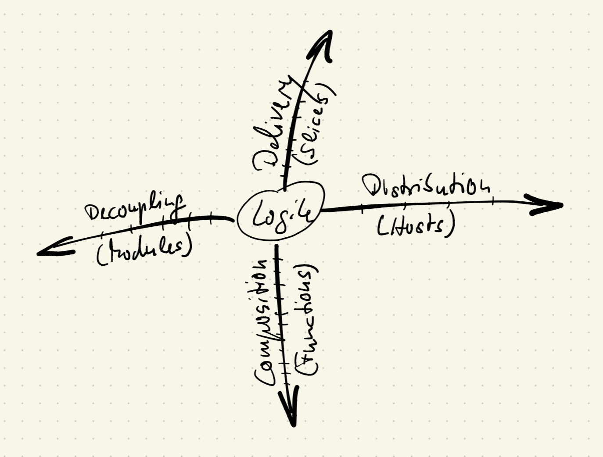

---

<!-- Page 20 of 493 -->

Motivation 11
verändert.
Deshalb gehören die Bände von Programming with Ease zu einer umfas-
senderen Reihe, die alle irgendwie “im Softwareuniversum spielen”.

---

<!-- Page 21 of 493 -->

Einleitung
Bevor ich dir konkrete “Tipps&Tricks” für die nachhaltige Softwareent-
wicklung gebe, möchte ich dir ein big picture skizzieren. Zu oft habe ich
gehört und gelesen, dass einzelne Prinzipien und Praktiken empfohlen
werden, ohne einen Kontext, ohne eine “Herleitung”. Bei aller Richtigkeit
dieser Empfehlungen werden sie dann aber leicht missverstanden oder
eben eingesetzt, wenn der Kontext nicht passt. Das führt zu Frustration.
Die möchte ich dir ersparen, so weit es mir möglich ist.
Es ist schwer genug, all das in Worte, auch noch lineare zu fassen, was ich
dirvermittelnwillfürnachhaltigeSoftwareentwicklung.Eswirdmirauch
nur bruchstückhaft gelingen. Dass du mich missverstehst, ist für mich
vorhersehbar und unvermeidbar. Doch ich will mich bemühen, das zu
minimieren. Und eine auf der Hand liegende Maßnahme dafür ist, dass
ich etwas aushole, um einen Rahmen aufzuspannen, in dem das konkrete
Thema dieses Buches eingehängt werden kann.
Deshalb: Halte einen Moment durch, bis es losgeht mit der Codierung.
Keine Sorge, du wirst davon genug zu sehen bekommen.
Und nun geht’s los. Wo sonst als am Anfang jedes Softwareprojektes, bei
den Anforderungen:
Anforderungskategorien
Softwareentwicklung hat Anforderungen in drei Kategorien zu erfüllen,
um ihr Geld wert zu sein:
• Zunächst muss Softwareentwicklung funktionierende Software lie-
fern. Auftraggeber haben funktionale Anforderungen an Soft-
ware, die sie erfüllt sehen wollen. Nur dann hat die Funktionalität
von Software hohe Qualität. Das ist so natürlich, dass es kaum der
Rede wert ist - dennoch müssen wir da noch genauer hinschauen,
auch wenn ich denke, mit diesen Anforderungen bist du bestens
vertraut. Sie treiben dir genug Schweiß auf die Stirn.

---

<!-- Page 22 of 493 -->

Einleitung 13
• Funktionalität allein ist allerdings nicht genug - auch das ist dir
klar - und noch nicht einmal der Grund für die Beauftragung von
Softwareentwicklung. Software soll vor allem nicht-funktionale
Anforderungen erfüllen! Sie soll Funktionalität besser (Kompara-
tiv!) anbieten als die Alternative (z.B. bisherige Software oder der
Mensch). Software soll z.B. schneller oder einfacher oder skalier-
barer oder sicherer funktionieren als die Alternative. Dann hat die
EffizienzvonSoftwarehoheQualität.Dasistebensonatürlich,dass
es kaum der Rede wert ist - aber diese Anforderungen bereiten dir
womöglich noch mehr Kopfschmerzen als die funktionalen.
Funktionale und nicht-funktionale Anforderungen zusammen sind Ver-
haltensanforderungen an Software. Der Auftraggeber kann durch Aus-
führung der Software überprüfen, ob die geforderte Qualität hergestellt
wurde. Dieser Oberbegriff ist wichtig, wie du im Weiteren sehen wirst.
Vielleicht überraschend für dich, sehe ich Korrektheit darin noch nicht
subsummiert. Korrektheit ist keine explizite weitere Anforderung an
Software,sondernistimpliziertinderErwartung,dassspezifizierteAnfor-
derungen tatsächlich durch gelieferte Software erfüllt werden. Software
ist also in dem Maße korrekt, in dem sie die Spezifikation erfüllt.
Mach dir an dieser Stelle keinen Kopf über den Begriff Spezifikation.
Ich will damit keine Norm heraufbeschwören, sondern verstehe darunter
lediglicheineirgendwiegearbeiteteListevongewünschtenEigenschaften.
ObdieaufeinerServiettestehenoderineinem500seitigenBuchgebunden
sind,isteinerlei.DerKundekannzurLaufzeitdieseListeabhakenundden
Erfüllungsgrad seiner Wünsche messen. Korrektheit liegt vor, wenn der
Erfüllungsgrad 100% ist. Fehlt allerdings ein Wunsch in der Spezifikation
und ist deshalb nicht implementiert, ist das Verhalten der Software nicht
inkorrekt, selbst wenn der Kunde bei der Überprüfung das Verhalten
vermisst.
It’s the productivity, stupid!
Über die Verhaltensanforderungen hinaus hat der Auftraggeber noch eine
weitere Anforderung, die jedoch selten ausdrücklich formuliert oder gar
vertraglich festgehalten wird. Das ist nun ein ganz wesentlicher Punkt;

---

<!-- Page 23 of 493 -->

Einleitung 14
passauf,dennesgehtumdichunddeinTeam!HierkommtdieMotivation
für Agilität und Clean Code Development:
• Die Softwareentwicklung soll stets zügig funktionale wie nicht-
funktionale Anforderungen erfüllen. Auftraggeber haben also auch
noch einen Anspruch an die Produktivität der Softwareentwick-
lung.
Verhaltensanforderungen werden unmittelbar durch Code erfüllt. Die
Produktivitätsanforderung hingegen ist eine an die herstellende Or-
ganisation.
Wie Funktionalität mittels Code hergestellt wird, ist eine Sache von
Programmiersprachen, Bibliotheken und Frameworks. Diese Fähigkeit
ist die primäre, die du als Softwareentwickelnde(r) erwirbst und stetig
verfeinerst.
Wie Effizienzen mittels Code hergestellt werden, ist ebenfalls zunächst
eine Sache von Programmiersprachen, Bibliotheken und Frameworks.
Diese Fähigkeit wird gewöhnlich später erworben, ist letztlich jedoch die,
auf die sich viele Entwickelnde konzentrieren. Bücher wie “Algorithmen
und Datenstrukturen” beschäftigen sich mit diesem Thema.
Nicht immer jedoch lässt sich damit das geforderte Qualitätsniveau errei-
chen. Performance oder Skalierbarkeit brauchen oft Unterstützung durch
Verteilung von Code zur Laufzeit auf verschiedene Threads im selben
BetriebssystemprozessoderinverschiedenenodergaraufmehrerenRech-
nern oder in unterschiedlichen Netzwerken. Damit beschäftigt sich tra-
ditionell die Softwarearchitektur. Hier warten große Herausforderungen!
Hier kannst du der Held so mancher Infrastrukturtechnologie werden.
FürdenAuftraggebergibtesalsozwei“Laufzeiten”:dieSoftware-Laufzeit
und die Team-Laufzeit. An beide (!) hat er Anforderungen. Die Software
soll performen, das Team aber auch. Letzteres setzt der Auftraggeber
allerdingsmehroderwenigervoraus.DafürschreibterkeineSpezifikation.
Er glaubt einfach, dass du professionell arbeitest. Dazu gehört für ihn,
dass du stets “flott dabei bist” und dir kein Bein stellst. Leider ist das oft
nicht der Fall. Softwareentwicklung fällt immer wieder über die eigenen
Füße; sie merkt sozusagen nicht, dass sie mit zusammengebundenen
Schnürsenkeln läuft.

---

<!-- Page 24 of 493 -->

Einleitung 15
Aber wie kann das sein? Ich denke, dafür gibt es viele Gründe. Neben
historischen gibt es jedoch einen immer wieder ganz akuten: Druck. Die
SoftwareentwicklungwirdvomAuftraggeberoftsehrmitDeadlinesunter
Druck gesetzt (und lässt sich auch unter Druck setzen), so dass man meint,
nie Zeit zu haben, die Schnürsenkel ordentlich zu binden. Lieber stolpert
sie dahin, stets willig, dem Kunden Verhaltensanforderungen grob zu
erfüllen, als dass sie sich “sauber aufstellt” und “fit hält”.
WasderAuftraggeberwill:DieKategorienderAnforderungen
Produktivitätskiller
Der Auftraggeber der Softwareentwicklung schaut gewöhnlich vor allem
auf die Erfüllung von Verhaltensanforderungen. Das ist für ihn am ein-
fachsten. Das merkst du jedes Mal, wenn Abnahme ist. Darum drehen
sich dann die Diskussionen. Über den Herstellungsprozess, wie es zum
präsentierten Verhalten gekommen ist, wird nicht diskutiert. Jedenfalls
nicht direkt. Dafür fehlt ja eine Spezifikation. Was aber eben nicht heißt,
dass der Kunde zur Team-Performance keine Meinung hätte.

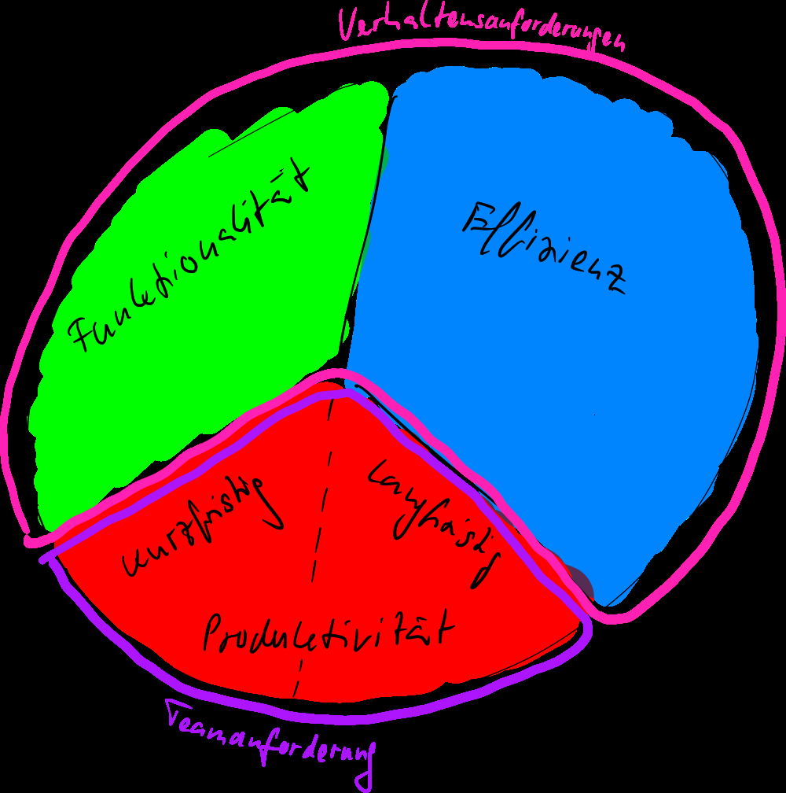

---

<!-- Page 25 of 493 -->

Einleitung 16
Hohe Produktivität von dir und deinem Team wird einfach vorausgesetzt.
Wie die Erfahrung jedoch zeigt, ist es eine naive Erwartung, dass hohe
Produktivität nach einem vielleicht anfänglich guten Start “einfach so”
erhalten bliebe. Die Produktivitätskurve sink vielmehr relativ schnell auf
einen bedauerlich niedrigen Wert. Hier eine typische Darstellung der
Entwicklung (Quelle³):
Produktiv sind Entwickelnde nicht einfach, weil sie gerade codieren. Nur
weil du dich gestresst fühlst beim Programmieren, performst du nicht
automatisch im Sinne des Auftraggebers. Das mag enttäuschend klingen,
ist aber die Realität. Solange es da ein Missverständnis zwischen dir und
dem Auftraggeber gibt, sind Konflikte unvermeidlich.
Nicht jede geschriebene/veränderte Codezeile trägt zur Produktivität bei,
wie der Auftraggeber sie sich wünscht. Produktiv ist die Softwareent-
wicklung nur, wenn sie neue Anforderungen erfüllt, d.h. an Features
arbeitet. Das kann durch Codierung geschehen oder durch andere, vorge-
lagerte Tätigkeiten.
Je öfter du Features lieferst, d.h. Erweiterungen, Verbesserungen - keine
Bug Fixes (!) - und die auch noch korrekt lieferst, desto produktiver bist
du aus Sicht des Auftraggebers.
Wenn du also auch die (unausgesprochenen) Anforderungen des Auf-
traggebers an deine Produktivität erfüllen willst, tust du gut daran, alles
³https://blogs.sap.com/2018/05/02/introducing-agile-software-engineering-in-
development/

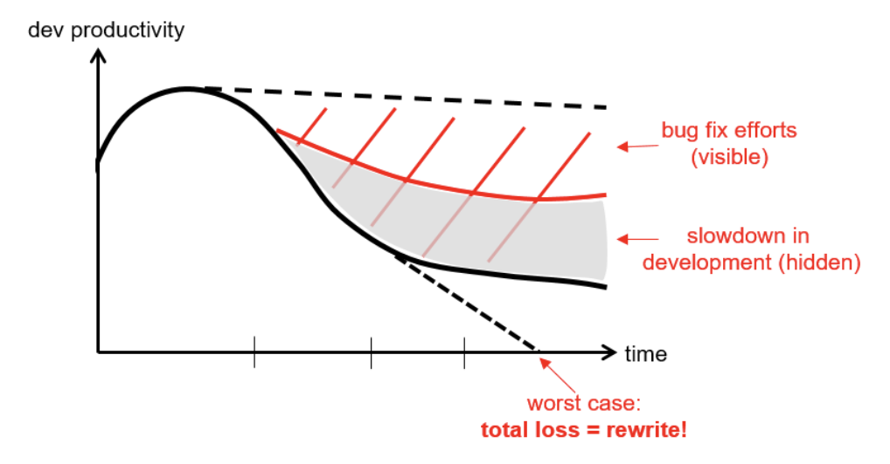

---

<!-- Page 26 of 493 -->

Einleitung 17
was dabei hinderlich sein könnte, zu vermeiden. Wenn du während des
Kochens eines Abendessens merkst, dass dir eine Zutat fehlt und du
losrennst, um sie zu kaufen, bricht deine Produktivität ja auch ein. Dito,
wenn du mit dem Kochen beginnen willst und findest die Spüle voll mit
dreckigen Töpfen. Dito, wenn du dich zum Date fertigmachen willst und
feststellen musst, dass deine beste Hose noch in der Wäsche ist. Wann
immer also etwas fehlt, das du brauchst, um das zu tun, was du eigentlich
tun willst, stehst du einem Produktivitätskiller gegenüber.
Vorausgesetzt, dass du technisch und fachlich kompetent bist - auch
daran hat ein Auftraggeber Interesse -, sehe ich vor allem noch drei
Produktivitätskiller, die du ausschalten musst:
Fehlende Korrekheit
Die Softwareentwicklung kann sehr geschäftig codieren, ohne produktiv
zu sein. Das ist immer der Fall, wenn sie Bug Fixing betreibt.
Bugs sind Inkorrektheiten, d.h. Qualitätsmängel durch
Nichterfüllung der Spezifikation.
BugszufixenistNacharbeit(re-work).NacharbeitoderAusbesserungvon
Defekten ist eine der Verschwendungsarten in der Lean “Philosophie”⁴.
Aus Sicht des Kunden vertust du deine Zeit mit Dingen, die schon lange
hätten erledigt sein sollen. Statt Bugs zu fixen, wäre es dem Auftraggeber
lieber, dass du schon wieder an neuem Verhalten arbeitest.
Jede Stunde, die du mit Bug Fixing verbringst, fehlt dir für die Feature-
Produktion.DasBugFixingzubegrenzen,selbstwennnochBugsbekannt
sind, ist daher eine notwendige Maßnahme, um produktiv zu bleiben⁵.
Besser jedoch, wenn die Softwareentwicklung gar nicht erst in diese Ver-
legenheit kommt. Warum nicht Bugs von vornherein einfach vermeiden?
Fehlende Korrektheit ist der Produktivitätskiller Nummer
1.
⁴http://www.lean-production-expert.de/lean-production/7-verschwendungsarten.
html
⁵Siehedazuz.B.Zero-BugSoftwareDevelopment

---

<!-- Page 27 of 493 -->

Einleitung 18
Um die Produktivitätsanforderung des Kunden zu erfüllen, muss Korrekt-
heit die oberste Priorität haben.[^klarheitsprämisse]
[^klarheitsprämisse]: Prämisse hierbei ist, dass klar ist, welches Verhalten
die Software überhaupt haben soll. Korrektheit meine ich nur auf das,
was klar spezifiziert ist. Wo Klarheit fehlt - allemal unwissentlich -, sind
überraschende Qualitätsmängel unvermeidbar.
Korrektheit ergibt sich allerdings nicht einfach, sondern muss systema-
tisch hergestellt und erhalten werden.
• ZunächstistbeiderFeature-Produktion(undauchbeimBugFixing)
Korrektheit in Form von Reife zu erreichen. Zu jedem Zeitpunkt
bzw. spätestens vor Präsentation/Auslieferung eines Softwarestan-
des musst du prüfen, ob deine Software schon korrekt ist gem.
der Spezifikation. Haben deine Anstrengungen zur Herstellung
gewünschter Qualitäten schon ausreichenden Erfolg gehabt? Wenn
du keine Differenz mehr siehst zwischen spezifiziertem und realem
Verhalten, dann ist dein Code reif für die Präsentation beim Auf-
traggeber.
• Darüber hinaus ist allerdings stets sicherzustellen, dass bei der
Feature-ProduktionvorhererreichteKorrektheitnichtzerstörtwird.
Es darf keine Regression stattfinden, d.h. kein Rückfall auf ein
früheres, niedrigeres Korrektheitsniveau. Der Auftraggeber erwar-
tet Stabilität der Software in Bezug auf die Korrektheit. Während
der Veränderung von Code bzw. spätestens vor Präsentation/Aus-
lieferung eines Softwarestandes musst du deshalb immer wieder
überprüfen, ob deine Software noch korrekt ist gem. der Spezifikati-
on. “Verschlimmbesserung” ist eines der größten Risiken in der
Softwareentwicklung.
Maßnahmen für die Korrektheit umfassen z.B. den Abnahmetest, eine
Beta-Test-Phase,dieBeschäftigungvonTestern,dieDefinitioneinesDone-
Zustands inkl. Akzeptanzkriterien, automatisierte Tests, eine Continuous
Build/Integration Pipeline oder die Codierung nach Test-Driven Develop-
ment (TDD).
Produktivität braucht Sorgfalt. Es sind “die Dinge richtig zu tun”. So wird
landläufig auch Effizienz beschrieben. Man weiß, was zu tun ist - und tut
es dann auch so, wie es getan werden sollte. Die Verhaltensanforderungen

---

<!-- Page 28 of 493 -->

Einleitung 19
sind klar, die Softwareentwickelnden sind kompetent, das Ergebnis ist
korrekte Software. So sollte es zumindest sein. Das ist die Erwartung des
Auftraggebers. Doch so einfach ist es nicht…
Überlege selbst, welche der obigen (oder auch weiteren) Maßnahmen in
deinemTeamverlässlichgetroffenwerden,umhoheKorrektheitzuliefern
und zu erhalten.
Fehlender Wert
Aberwas,wenndieSoftwareentwicklungnichtweiß,waszutunist?Was,
wenn Unklarheit herrscht? Die Voraussetzung dafür, “die Dinge richtig zu
tun” ist, dass man überhaupt “die richtigen Dinge tut”. So wird landläufig
Effektivität beschrieben. Effektivität kann es nur geben, wenn Klarheit
herrscht.
SolangedieSoftwareentwicklungaberimUnklarendarüberist,wasgenau
die Verhaltensanforderung ist oder solange der Auftraggeber selbst sich
noch nicht ganz klar darüber ist, wie für ihn hohe Verhaltensqualität
aussieht, kann Codeproduktion nicht effektiv sein. Und ohne Effektivität
keine Produktivität.
Leider ist das der natürliche Zustand von Softwareprojekten:
• Der Auftraggeber hat eine nur unvollständige Vorstellung davon,
was er braucht.
• Der Auftraggeber kann seine Vorstellungen nur unvollständig for-
mulieren.
• Die Softwareentwicklung versteht die formulierten Anforderungen
nur unvollständig.
• Die Softwareentwicklung setzt ihr Verständnis der Anforderungen
nur unvollständig um.
• Der Auftraggeber hat in der Zeit von der Spezifikation bis zur
Abnahme ihrer Umsetzung⁶ seine Meinung geändert; seine Anfor-
⁶Der Begriff Spezifikation mag sich für dich hier schwergewichtig anhören. Wo bleibt
da die Agilität? Aber ich meine ihn ganz neutral. Er soll einfach nur ausdrücken, dass
ein Auftraggeber in unmissverständlicher Weise irgendwie beschrieben hat, welche Ver-
haltensanforderungen der Code, den du entwickelst, erfüllen soll. “Irgendwie” bedeutet,
dass ich nicht suggerieren will, in welcher Sprache, mit welchem Medium, in welchem
Umfang eine Spezifikation vorliegt. Ebensowenig will ich mitschwingen lassen, wie häufig
derAuftraggebereineSpezifikationvorlegt;daskannallepaarWochenseinoderjedenTag.
Iterativ-inkrementellesVorgehenistfürmichmitdemBegriffalsoabsolutvereinbar.

---

<!-- Page 29 of 493 -->

Einleitung 20
derungen sehen nun anders aus. Selbst eine korrekte Umsetzung
derursprünglichenSpezifikationpasstdahernurunvollständigzum
neuen Stand der Bedürfnisse des Auftraggebers.
Das ist die Erkenntnis der Agilität in der 1990ern gewesen, die zur Min-
destforderungeinesiterativ-inkrementellenSoftwareentwicklungspro-
zesses geführt hat.
Als Produktivitätskiller hatte sich herausgestellt, dass immer wieder über-
raschend bei der Abnahme von Software nicht der erwartete Wert ge-
liefert wurde. Selbst spezifikationsgemäße Lieferung hatte nicht die im
praktischen Einsatz erforderlichen Nutzen.⁷
Das Missverständnis von Auftraggebern und Softwareentwicklung bis in
die 1990er war (und ist leider auch heute noch in einigen Projekten), dass
Verhaltensanforderungen sich in einem mehr oder weniger länglichen
Prozess einmalig vor Beginn der Umsetzung festzurren lassen könnten
(Stichwort “Wasserfall”).
Diese Vorstellung hat zu Spezifikationen geführt, die große, unvermutete
Missweisungen enthielten, die in Software gegossen große negative Über-
raschungen ausgelöst haben. Umfangreiche Nacharbeiten waren nötig,
nicht wegen Inkorrektheit, sondern wegen Wertlosigkeit. Auch korrekt
implementierte Spezifikationen haben zum Lieferzeitpunkt nichts oder zu
wenig genützt.
Dem hat die Agilität die Desillusionierung entgegen gesetzt. Nicht noch
bessere, umfangreichere, längere Anforderungsanalyse soll die Produk-
tivität steigern, sondern das Gegenteil: eine radikale Verkürzung bei
gleichzeitiger Vervielfachung von Analyse, Spezifikation und Umsetzung.
In der Agilität gibt es weiterhin eine Spezifikation und insofern eine
Erwartung an hohe Korrektheit (Stichwort “Definition of Done”). Doch
es wird nicht mehr angenommen, dass diese Spezifikation schon “die
letzte Wahrheit” sei. Stattdessen soll die Softwareentwicklung bestrebt
sein, nur schmale Ausschnitte eines Gesamtverhaltens zu spezifizieren
⁷WertistalsonichteinfachgleichhochqualitativeSoftware.ZumWertgehörtnatürlich,
dassSoftwarehoheQualitäthat,d.h.derSpezifikationmöglichstgenauentspricht.Darüber
hinaus muss diese hohe Qualität allerdings auch noch nützlich sein in dem Moment, wo
siegeliefertwird.Darausergibtsich,dassQualitätsproduktionundWertproduktionzweizu
unterscheidendeProzessebraucht.FürErsterenbistdualsSoftwareentwicklerzuständig,für
Letzerenz.B.inScrumaberderProductOwner!

---

<!-- Page 30 of 493 -->

Einleitung 21
(auch Inkremente genannt), die zügig umgesetzt werden können, um
vom Auftraggeber Feedback zu bekommen. Wert kann man sich nur
schrittweise annähern, nicht, weil Auftraggeber oder Softwareentwick-
lung inkompetent sind, sondern weil es in der Natur der Sache komplexer
Anforderungenliegt;daistkeingeradlinigerWegzuhohemWertsichtbar.
Man bekämpft beim interativ-inkrementellen Vorgehen die Ineffekti-
vität dadurch, dass man ihr den Zahn der Überraschung zieht. Denn
nur die Überraschung macht aus mangelndem Wert frustrierende Nachar-
beit.IstmangelnderWertjedochzuerwarten,ja,geradezudieNorm,dann
ist die nächste Iteration keine Nacharbeit, keine Verschwendung, sondern
ein erwartetes Inkrement und insofern produktiv - auch wenn man gern
schneller vorangehen würde.
Softwareentwicklung wie Auftraggeber hegen beim agilem Vorgehen
nicht mehr den Glauben, dass wertvolle Software “in einem Rutsch”
entstehen kann. Vielmehr muss man sich hohem Wert experimentierend
mit hochqualitativen Inkrementen annähern. Das ist keine Last, das ist
eine Tugend, weil unvermeidbar.
Wie steht es mit diesem Verständnis in deinem Team? Geht ihr iterativ-
inkrementell vor? Versteht der Auftraggeber die Vorläufigkeit seiner An-
forderungen und eurer Lösungen?
Fehlende Ordnung
Auch wenn fehlende Korrektheit der naheliegende und greifbare Produk-
tivitätskillerist,gingihmgeschichtlichfehlenderWertinderBewusstwer-
dung der Softwareentwicklung voraus, denke ich.
Nicht genau zu wissen, was der Auftraggeber wirklich will, was für ihn
Wert darstellt, für das Geld, das er auszugeben bereit ist, war zunächst
ein größeres Problem. Erst als eine Verbesserung des Vorgehensmodells in
den 1990ern hier mehr Klarheit gebracht hatte und dadurch die Zahl der
Softwarelieferungen zur Feedback-Generierung, die potenziell inkorrekt
sein konnten, gestiegen war, trat der Produktivitätskiller Inkorrektheit
deutlich(er) zutage. Beleg ist aus meiner Sicht dafür die späte Erfindung
automatisierter Tests. Erst Ende der 1990er bekam das Thema breite
Sichtbarkeit.

---

<!-- Page 31 of 493 -->

Einleitung 22
Wenn man weiß, was das Richtige ist (Wert), lohnt es, das auch richtig zu
tun (Korrektheit). Wenn man es kann.
UnddastecktschließlichderdritteProduktivitätskiller,denichdirvorstel-
len möchte: die Unordnung. Solange du nicht bewusst darauf achtest,
OrdnungimCodeherzustellen,hastduesimmerschwer,dasRichtige
auch richtig zu tun.
Für langfristig hohe Produktivität muss das Richtige or-
dentlich richtig getan werden.
Code, der sich mit jedem neuen Feature, mit jedem Bug Fix weniger leicht
verändern lässt, wird zum Morast, in dem deine Softwareentwicklung
alsbald steckenbleibt. Oder wenn nicht steckenbleibt, dann zumindest
nur noch schwerfällig vorankommt. Das ist nicht, was Auftraggeber sich
wünschen.
CodeisteineRessource,mitundanderSoftwareentwicklungarbeitet.
Wie andere Ressourcen kann sie pfleglich behandelt werden - oder
man treibt an ihr Raubbau. Ohne weitere Maßnahmen geschieht Letzte-
res.
Für den Auftraggeber sind Inkorrektheit und Wertarmut von Code noch
vergleichsweise leicht zu spüren. Beide zeigen sich als mangelnde Quali-
täten im Verhalten.
Unordnung jedoch entzieht sich der direkten und zeitnahen Wahrneh-
mung des Auftraggebers. Deshalb hat sie Zeit, sich hinter der Fassade des
Verhaltens aufzubauen. Wenn sie dann indirekt über deutlich sinkende
Produktivität auch für den Auftraggeber spürbar wird, ist es jedoch
eigentlich schon zu spät. Deshalb musst du ständig ein Auge auf die
Ordnung haben!
Die dann nötigen “Aufräumarbeiten” sind meist zu umfangreich, als dass
sie sich rechnen würden. Und sie ließen sich auch kaum dem Kunden
gegenüber verheimlichen. Also schleppt sich die Softwareentwicklung
weiter durch den selbst verschuldeten Sumpf. Denn selbst verschuldet ist
er, da der Kunde sich Unordnung nicht gewünscht hat. Sie ist mangels Be-
wusstsein und/oder mangels Fähigkeit und/oder wider besseren Wissens

---

<!-- Page 32 of 493 -->

Einleitung 23
“auf Befehl” (Ignoranz) und/oder in naivem Glauben an baldige Korrektur
(so genannte Technische Schuld) entstanden.
Nicht, dass fehlende Ordnung eine neue Ursache für Produktivitäsabnah-
me wäre. Sie wurde schon in den 1960ern oder gar früher identifiziert. Die
Strukturierte Programmierung (structured programming⁸) ist aus dieser
Erkenntnis entstanden. Man könnte wohl auch sagen, dass Objektorien-
tierung von ihr ursprünglich inspiriert war. Ebenso das structured design⁹
und der Begriff des Moduls.
Wer mit Code zu tun hat, erwartet, ordentlichen Code vorzufinden,
d.h. Code, der nicht unnötig behindert, ihn zu verstehen (“easy to
reason about”), und der nicht unnötig behindert, ihn zu verändern.
Denn darum geht es letztlich ja immer: Code wird nur betrachtet, um ihn
neuen Anforderungen anzupassen oder zu korrigieren. Dass du Code aus
SpaßamprasselndenKaminfeuerstudierst,passiertwahrscheinlichselten,
oder?
Nach Jahrzehnten des mehr oder weniger latenten Bewusstseins der
Branche, dass Ordnung eine Qualität ist, auf die es ebenfalls zu achten
giltbeiderSoftwareentwicklung,hatdannimJahr2008derBegriff Clean
Code dem Thema neue Sichtbarkeit gegeben.
Dass Robert C. Martin von sauberem Code und nicht von ordentlichem
spricht,magdemvonMartinFowlerimZusammenhangmitseinemBuch
Refactoring geprägten Begriff code smell geschuldet sein. Was sauber ist,
riecht nicht.
DochletztlichistSauberkeitalsBildzuschwachfürdienötigeEigenschaft,
die Code haben muss, um deine Softwareentwicklung nicht schwerfällig
zu machen. Was sauber ist, kann immer noch unordentlich, d.h. unüber-
schaubar bis zu Unbrauchbarkeit sein.
Wenn du dir jetzt aber Ordnung vorstellst, denkst du sehr wahrscheinlich
nicht nur an Sauberkeit als Selbstzweck, sondern auch noch an Eignung
für weitere Nutzung. Sauberkeit schützt vor Schaden.
Ordnung hat als Zweck Befähigung!
⁸https://en.wikipedia.org/wiki/Structured_programming
⁹https://www.amazon.de/Structured-Design-Fundamentals-Discipline-Programme/
dp/0138544719

---

<!-- Page 33 of 493 -->

Einleitung 24
Und genau darum geht es, wenn ich hier von ordentlichem Code, von
Ordnung im Code spreche. Code soll ordentlich sein, um zu zügiger
Veränderung zu befähigen.
Zusammenfassung
Auftraggeber wollen Software, die umfassend tut, was sie tun soll; sie soll
funktional und effizient sein. Diese Qualitäten sollst du in der Software-
entwicklung stets zügig liefern; du sollst produktiv sein und bleiben.
UnglücklicherweiseistschondieHerstellungvonfunktionalemundeffizi-
entem Code eine Sache, die sehr komplex ist. Ich denke, davon kannst du
ein Lied singen. Sich mit all den Technologien und Produkten und Ansät-
zen auszukennen, die zur Herstellung von funktionalem und effizientem
Code zur Verfügung stehen, ist eine Kunst für sich.
Und nun soll die Herstellung von Code, der hochqualitatives Verhalten
zeigt, auch noch stets zügig stattfinden, obwohl dieser Code ständigen
Änderungen unterliegt und die Anforderungen an ihn notorisch unklar
sind? Das steigert die Komplexität der Softwareentwicklung erheblich!
Wie es für die Herstellung von Verhaltensanforderungen Werkzeuge gibt,
so gibt es zum Glück aber auch Werkzeuge, die dir helfen, hohe Produkti-
vität zu produzieren.
• Agilität
• Automatisierte Tests
• Prinzipien und Praktiken des Clean Code Development

---

<!-- Page 34 of 493 -->

Einleitung 25
VoraussetzungenfürProduktivität
Du musst diese Werkzeuge kennen und auch einsetzen. Sie sind nicht neu,
sie sind womöglich noch nicht einmal schwierig zu beherrschen - doch
sie haben eines gemeinsam: sie gehen ans Eingemachte. Damit du sie
konsequent benutzt, musst du eine passende Grundhaltung entwickeln;
die Kultur der Softwareentwicklung in deinem Team und darüber hinaus
muss darauf ausgerichtet sein. Das braucht Zeit.
Die Agilität hat es inszwischen geschafft, breit ins Bewusstsein (oder
zumindest auf die Lippen) der Branche zu dringen. Auf die eine oder an-
dere Weise wird also in vielen Softwareentwicklungsteams versucht, die
Wertproduktion hoch zu halten durch iterativ-inkrementelles Vorgehen.
Mit der Korrektheit und der Ordnung hingegen, steht es weniger gut. Das
liegt daran, dass das eine vom anderen abhängig ist: ohne Ordnung ist es
schwer, Korrektheit zuverlässig und nachvollziehbar herzustellen und zu
überprüfen. Aber gerade die Ordnung hat es in sich. Nicht umsonst ist sie
geschichtlich der letzte Produktivitätskiller, für den breites Bewusstsein
geschaffen werden musste.
So verständlich es war, dass der Fokus von der Steigerung der Produk-
tivität in Bezug auf den Wert von Software (in den 1990er Jahren) zur
Steigerung der Produktivität durch Erhöhung der Korrektheit (in den

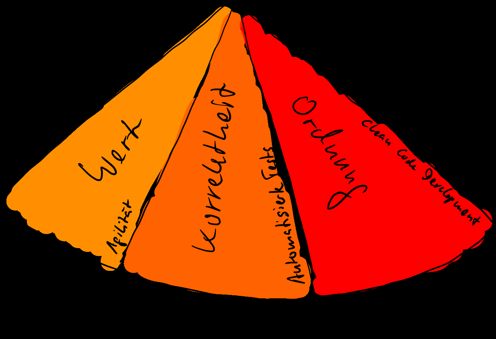

---

<!-- Page 35 of 493 -->

Einleitung 26
2000er Jahren) gewandert ist - so ist es andererseits auch verständlich,
dass die Produktivitätssteigerung dann gegen eine gläserne Decke stoßen
musste. Erst durch einen weiteren Wechsel des Fokus zur Ordnung (in
den 2010er Jahren) kann nämlich die Behinderung aus dem Weg geräumt
werden, die mehr Korrektheit und auch zügigerer Wertherstellung im
Wege stand.
Dauerhaft hohe Produktivität braucht…
• eine Organisation, die ihr höchste Priorität zuweist, um langfristig
wettbewerbsfähig zu bleiben,
• ein Verständnis dafür, was Ordnung im Code bedeutet, wie er stets
wandlungsfähig gehalten werden kann,
• den Willen zur Produktion von stabil korrektem Code, um die
Kapazität für die Erweiterung von Code maximal zu halten,
• den Mut, nur auf der Basis von unzweideutigen Spezifikationen
Code zu produzieren
• und schließlich die Einsicht, dass Unklarheit und Volatilität ständi-
ge Begleiter der Softwareentwicklung sein werden, so dass Vorläu-
figkeit auf allen Ebenen akzeptiert werden muss.
Leider ist es in der Softwareentwicklung so, wie es der Buddha für das
Leben konstatiert hat:
“Frische Milch braucht Zeit zum Sauerwerden, / Unheilsames
Handeln braucht Zeit zum Reifen, / So schwelen im Toren die
Folgen seines Handelns, / Wie unter der Asche verborgene
glühende Kohlen.”, Dhammapada - Die Weisheitslehren des
Buddha, Munish B. Schiekel
Die negativen Auswirkungen deines heutigen Handelns zeigen sich nicht
immer sofort. Sie wachsen unsichtbar und schleichend an – bis du sie
irgendwann und oft zu spät deutlich spürst.
Deshalb ist es wichtig, die Produktivität als im Grunde höchstes Gut,
als wichtigste Anforderung zu verstehen und die Softwareentwick-
lung dahingehend zu organisieren. Das ist nachhaltige Softwareent-
wicklung.

---

<!-- Page 36 of 493 -->

Einleitung 27
Maßnahmen zur korrekten Wertproduktion in Ordnung müssen einen
Rahmen aufspannen, in dem konkrete funktionale und nicht-funktionale
Anforderungen umgesetzt werden. Derzeit geschieht es vielfach noch
umgekehrt: Verhaltensanforderungen werden “irgendwie” realisiert und
insbesondere Korrektheit und Ordnung sind nachrangig.
Alles, was ich dir im Folgenden präsentiere, darfst du vor diesem Hinter-
grundverstehen.IchmöchtedireinmethodischesRahmenwerkvorstellen,
mit dem du systematisch für höhere Korrektheit und Ordnung in deinem
Code sorgen kannst. Mich treibt die eigene leidvolle Erfahrung an, dass
darauf einfach zu wenig und zu spät geachtet wird. Mir ist das früher
auch oft passiert - weil ich es nicht besser wusste. Dir möchte ich diese
Erfahrungersparen.DirmöchteicheineGuidelineandieHandgeben,mit
der du während der Codierung deinen Weg findest. Keine Angst mehr vor
dem blinkenden Cursor, der dich auffordert, vor allem Funktionalität zu
produzieren. Mit ein bisschen System, gutem Willen und Übung wirst du
es schaffen, Funktionalität und daherhaft hohe (oder zumindest höhere)
Produktivität herzustellen.

---

<!-- Page 37 of 493 -->

Die Methode

---

<!-- Page 38 of 493 -->

01 - Die Anforderung-Logik
Lücke
Um die Softwareentwicklung vom Kopf auf die Füße zu stellen, d.h. ihr
einen Rahmen für Nachhaltigkeit zu geben, ist es hilfreich, wenn wir ihr
Produkt genauer betrachten. Woraus bestehen “die Maschinen”, die du in
der Softwareentwicklung produzierst, von denen sich der Auftraggeber so
viel Hilfe verspricht?
Logik - Der Stoff aus dem Verhalten
entsteht
Die offensichtlichen Anforderungen des Auftraggebers sind die Verhal-
tensanforderungen an Software. Verhalten wird durch Code hergestellt -
aber nicht der gesamte Code ist dafür verantwortlich.
Hier als Beispiel eine Software, die eine Datei als Hex Dump ausgeben soll
wie in diesem Bild dargestellt (Quelle: C# von Kopf bis Fuß¹⁰):
¹⁰https://www.amazon.de/gp/product/B06XDVW33W

---

<!-- Page 39 of 493 -->

01-DieAnforderung-LogikLücke 30
Der C#-Code dafür sieht im Ausschnitt so aus:
1 using System;
2 using System.IO;
3 using System.Text;
4
5 namespace hexdump
6 {
7 // source: "C# von Kopf bis Fuß"
8 class MainClass
9 {
10 public static void Main (string[] args)
11 {
12 if (args.Length != 1) {
13 Console.Error.WriteLine ("Usage: hexdump <dateiname>");
14 Environment.Exit (1);
15 }
16
17 if (!File.Exists(args[0])) {
18 Console.Error.WriteLine("No such file: {0}", args[0]);
19 Environment.Exit(2);
20 }
21
22 using (var input = File.OpenRead (args [0])) {
23 int position = 0;
24 var buffer = new byte[16];
25
26 while (position < input.Length) {
27 var charsRead = input.Read (buffer, 0, buffer.Length);
28 if (charsRead > 0) {
29 Console.Write ("{0}: ", string.Format ("{0:x4}", position));
30 position += charsRead;
31
32 for (int i = 0; i < 16; i++) {
33 if (i < charsRead) {
34 var hex = string.Format ("{0:x2}", buffer [i]);
35 Console.Write (hex + " ");
36 } else {
37 Console.Write (" ");

---

<!-- Page 40 of 493 -->

01-DieAnforderung-LogikLücke 31
38 }
39 ...
Erkennst du, welche Zeilen des Code verhaltensrelevant sind? Die Verän-
derung welcher Zeilen würde für einen Anwender spürbar sein?
Könnte using System gelöscht werden, ohne dass sich das Programm-
verhalten ändert?¹¹ Nein, das Programmverhalten würde sich nicht än-
dern.
Sind die Leerzeilen oder der Kommentar relevant für das Programmver-
halten? Nein.
Spürt ein Anwender, ob es die Funktion Main() gibt? Nein.¹²
Aber wenn eine Zeile mit Console.Error.WriteLine(...) fehlen
würde, dann würde der Anwender das (in manchen Fällen) bemerken.
OderwenndieZeileif (i < charsRead)fehlenwürdeoderdarindas
< durch ein > ersetzt würde, dann würde das zu einem anderen Verhalten
des Programms führen.
Code ist also nicht gleich Code. Mancher Code/manche Codezeilen sind
für das Verhalten relevant, manche nicht.
Die für das Verhalten relevanten Codezeilen stellen die
Logik von Software dar.¹³
Logik besteht aus
• Transformationen/Operatoren, z.B. <, ++, args.Length
¹¹Vorausgesetzt die dadurch syntaktischen/semantischen Probleme im Quellcode wür-
dendurchweitereEingriffekompensiert.
¹²Dass Main() in C# nötig ist, um ein Programm ausführbar zu machen, ist unwe-
sentlich. In anderen Programmiersprachen sind keine Klassen wie MainClass und keine
MethodewieMain()nötig,umeinProgrammübersetzenundlaufenzulassen.
¹³So nenne ich diesen Teil des Code jedenfalls im Weiteren, weil ich keinen anderen
Namendafürkenne.Wenndueinenbesserenweißtodereinenschonetablierten,dannlass
ihnmichwissen.Statementsfindeichzuwenig,weildamitimGrundeallesgemeintist,was
in C# (und anderen Sprachen) mit einem ; abgeschlossen wird. Dazu gehört, wie du bald
lesenwirst,aberauchCode,derkeineLogikist.

---

<!-- Page 41 of 493 -->

01-DieAnforderung-LogikLücke 32
• Kontrollstrukturen, z.B. if-else, for, try-catch
• I/O-bzw.allgemeinerAPI-Calls,z.B.Console.Write(),File.OpenRead()
Wenn nun das für Auftraggeber so wichtige Verhalten - Funktionalität
+ Effizienz - nur durch Logik hergestellt wird, stellt sich die Frage, was
der übrige Code für Zweck hat. Welche Anforderungen hilft er erfüllen?
Warum solltest du irgendetwas anderes codieren als Logik?
Nicht-Logik Code dient der Herstellung von Produktivität.
Einige Beispiele:
• Namespaces reduzieren das Rauschen im Code, das lange Namen
mit redundanten Anteilen verursachen. Sie erhöhen die Ordnung.
• Leerzeilen strukturieren den Code vertikal, indem sie unterschied-
liche inhaltliche Kohäsion anzeigen. Sie erhöhen die Ordnung.
• Funktionen integrieren Logik zu Funktionseinheiten, die Aspekte
eines Verhaltens unter einem Namen zusammenfassen. Sie erhöhen
die Ordnung und die Testbarkeit.
• Klassen aggregieren Funktionen (und Daten) und stellen damit
zweckvolle Einheiten zusammen. Sie erhöhen die Ordnung.
Funktionalität
Die erste Kunst bei der Herstellung (oder Entwicklung) von Logik ist,
sie so zu wählen, dass sie die gewünschte Funktionalität hat. Das lernst
du auf alle Fälle in jedem Buch einer Programmiersprache oder einem
Programmierkurs.
Logik, die die Zahlen in einem Array summiert, sieht dann z.B. so aus:

---

<!-- Page 42 of 493 -->

01-DieAnforderung-LogikLücke 33
1 static int Sum(int[] numbers) {
2 var sum = 0;
3 foreach(var n in numbers)
4 sum += n;
5 return sum;
6 }
Logik, die die Zahlen in einem Array sortiert, sieht hingegen z.B. so aus:
1 // Quelle: https://www.geeksforgeeks.org/bubble-sort/
2 static void BubbleSort(int []arr)
3 {
4 int n = arr.Length;
5 for (int i = 0; i < n - 1; i++)
6 for (int j = 0; j < n - i - 1; j++)
7 if (arr[j] > arr[j + 1])
8 {
9 int temp = arr[j];
10 arr[j] = arr[j + 1];
11 arr[j + 1] = temp;
12 }
13 }
Welche Logik-Bausteine du aus den von deiner Programmiersprachen,
deinen Bibliotheken und Frameworks angebotenen auswählst und wie du
sieinBeziehungsetzt,machtdenUnterschied,obdaseineoderdasandere
Verhalten entsteht.
Auch Code, der nur aus Logik besteht, hat insofern eine Struktur.
Effizienz I - Effizienz durch Algorithmen und
Datenstrukturen
Logik so zu strukturieren, dass sie die gewünschte Funktionalität hat,
ist jedoch nicht alles. Sie soll auch z.B. performant sein. Logik über die
Funktionalität hinaus auch noch mit Effizienzen auszustatten, ist die
zweite Kunst, die du lernen musst, wenn du programmieren willst.
HiereinBeispieldafür,wieandersLogikaussehenkann,nurweilsiemehr
Effizienz bieten soll. Bubblesort ist ein bekanntermaßen imperformanter
Sortieralgorithmus. Radixsort soll diesen Makel beseitigen:¹⁴
¹⁴Die Funktionalität ist dieselbe, die Logik-Struktur ist aber eine völlig andere, weil an-
dereEffizenzanforderungenerfülltwerden.Docheskommtnochschlimmer:Sogardieselbe
Funktionalität mit denselben Effizienzanforderungen kann zu sehr unterschiedlicher Logik
führen. Unter anderem das macht es dir so schwierig, aus Logik herauszulesen, welches
Verhaltensieeigentlicherzeugt.

---

<!-- Page 43 of 493 -->

01-DieAnforderung-LogikLücke 34
1 // Quelle: https://www.geeksforgeeks.org/radix-sort/
2 static void Radixsort(int[] arr, int n)
3 {
4 int mx = arr[0];
5 for (int i = 1; i < n; i++)
6 if (arr[i] > mx)
7 mx = arr[i];
8
9 for (int exp = 1; mx/exp > 0; exp *= 10)
10 {
11 int[] output = new int[n];
12
13 int i;
14 int[] count = new int[10];
15
16 for(i = 0; i < 10; i++)
17 count[i] = 0;
18
19 for (i = 0; i < n; i++)
20 count[ (arr[i]/exp)%10 ]++;
21
22 for (i = 1; i < 10; i++)
23 count[i] += count[i - 1];
24
25 for (i = n - 1; i >= 0; i--)
26 {
27 output[count[ (arr[i]/exp)%10 ] - 1] = arr[i];
28 count[ (arr[i]/exp)%10 ]--;
29 }
30
31 for (i = 0; i < n; i++)
32 arr[i] = output[i];
33 }
34 }
Logik (und zugehörige Datenstrukturen) für Effizienz-Anforderungen
passend zu wählen, erfordert also mehr als die Kenntnis von Logik-
Bausteinen. Dass du dir z.B. der algorithmischen Komplexität¹⁵ deiner
Logik bewusst bist, gehört dazu, wenn du mit Logik den Auftraggeber
erfreuen willst. Es kommt auf die Auswahl und Zusammenstellung der
Logik-Bausteine an, auf ihre Komposition.
Effizienz II - Effizienz durch Verteilung
PerformanceundSkalierbarkeitoderauchandereEffizienzanforderungen
lassen sich allerdings nicht immer durch Auswahl und Anordnug von Lo-
gik erfüllen. Dann ist zusätzlich Verteilung gefragt, d.h. die Ausführung
von Logik verteilt auf mehrere Threads gefragt.
Als simples Beispiel mag die Sortierung von zwei Arrays dienen. Eine
Lösung nur mit Logik kann das auch mit dem schnelleren Algorithmus
nur sequenziell bewerkstelligen:
¹⁵https://www.bigocheatsheet.com/

---

<!-- Page 44 of 493 -->

01-DieAnforderung-LogikLücke 35
1 Radixsort(arr1, arr1.Length);
2 Radixsort(arr2, arr2.Length);
Die Gesamtlaufzeit ist dann die Summe der Laufzeiten der einzelnen
Aufrufe der Funktion, die die Sortier-Logik kapselt.
Wenn die Sortierung jedoch parallel, d.h. auf zwei Threads (verschiedener
Prozessorkerne) stattfinden kann…
1 var t1 = Task.Factory.StartNew(() => Radixsort(arr1, arr1.Length));
2 var t2 = Task.Factory.StartNew(() => Radixsort(arr2, arr2.Length));
3 Task.WaitAll(new[] {t1, t2});
…dannentsprichtdieGesamtlaufzeit(ungefähr)nurderdesFunktionsauf-
rufs, der länger gebraucht hat.
Logik mit mehr Effizienz auszustatten durch Verteilung ist traditionell ein
Teil der Disziplin Softwarearchitektur. Sie kannst du als die dritte Kunst
der Softwareentwicklung ansehen.
Hierarchie der Hosts
Softwarearchitektur verteilt Logik, indem sie sie in Hosts ausführt. So
nenne ich geschachtelte Laufzeit-Kontexte/Container, die mit mehr oder
weniger Infrastruktur aufgesetzt, betrieben und in Verbindung gebracht
werden.
• Thread: Multithreading ist der erste Schritt, um Latenz zu ver-
bergen oder zu verringern oder den Durchsatz zu erhöhen. Die
Kommunikation schon zwischen Logik auf verschiedenen Threads
ist aber nicht mehr direkt, d.h. langsamer als die zwischen Logik
auf demselben Thread. Vorsicht ist geboten, wenn Threads auf die
selben Daten zugreifen.
• Process: Logik parallel in verschiedenen Betriebssystemprozessen
zu betreiben, entkoppelt sie stärker, was zur Robustheit beiträgt.
Dass es keinen gemeinsamen Hauptspeicher mehr gibt, reduziert
das Risiko von Fehlern. Allerdings ist die Kommunikation deutlich
aufwändiger zwischen Prozessen.

---

<!-- Page 45 of 493 -->

01-DieAnforderung-LogikLücke 36
• Machine: Logik in mehreren Threads verteilt auf mehrere Prozesse
auf verschiedenen (physischen oder virtuellen) Maschinen auszu-
führen, ermöglicht ein scale-out oder auch die Ansiedelung von
Logik näher an Ressourcen. Allerdings ist die Kommunikation zwi-
schen Maschinen noch langsamer als zwischen Prozessen, so dass
sehr auf Häufigkeit und Granularität der Nachrichtenübermittlung
geachtet werden muss.
• Network: Logik auf Maschinen in verschiedenen Netzwerken zu
verteilen, ist allemal unvermeidbar, wenn Speicher- und Prozessor-
ressourcen flexibel genutzt werden sollen (Stichwort “Cloud Com-
puting”). Der Nutzen bei der Skalierbarkeit ist mit den Gefahren
für die Sicherheit abzuwägen. Und die Kommunikationsgeschwin-
digkeit sinkt abermals.
Effizienz durch Verteilung steigern zu müssen, ist oft unvermeidbar.
Simpel ist das jedoch nicht. Die Zahl der hilfreichen Technologien nimmt
jeden Tag zu und erfordert von dir ein fleißiges Studium, wenn du mithal-
ten willst. Vorsicht ist dennoch weiterhin ganz grundsätzlich gegenüber
den fallacies of distributed computing¹⁶ geboten.
Im Weiteren spielen Hosts als Container für Logik jedoch keine größere
Rolle mehr. Die Darstellungen hier drehen sich nicht um die Herstellung
von Effizienzen, sondern vor allem um die Qualitäten Wert, Korrektheit
und Ordnung für die Anforderung Produktivität. Du wirst es mit Struktu-
ren zu tun bekommen, aber keinen Strukturen bestehend aus Hosts.
Zusammenfassung
Logik und ihre Verteilung ist das, was für den Auftraggeber unmittelbar
spürbar ist. Mit Logik und Verteilung Verhalten herzustellen, sind die
grundlegenden Künste der Programmierung. In ihnen können Software-
entwickelnde ständig reifen; für sie werden ständig neue Paradigmen,
Technologien und Produkte entwickelt.
Logik und Verteilung in hoher Qualität herzustellen, ist auch bei guten
Spezifikationen ein komplexes Unterfangen. Umso naheliegender sollte es
sein, dass du diese Transformation systematisch betreibst.
¹⁶https://en.wikipedia.org/wiki/Fallacies_of_distributed_computing

---

<!-- Page 46 of 493 -->

01-DieAnforderung-LogikLücke 37
Von den Anforderungen zur Logik
Angesichtsdesgroßen,bewusstenundverständlichenBedarfsanSoftware-
Verhalten, den Auftraggeber haben, ist es kein Wunder, dass sie großen
Druck auf die Logik-Produktion ausüben. Du sollst möglichst schnell
Features mit Logik umsetzen - alles andere ist dem Kunden wenn schon
nichtegal,danndochmeistensnurwenigbewusst.Aufallesandereachtet
er insofern wenig oder kann es sogar nicht einmal.
Logik schwer definierbar
Doch leider “ergibt sich” Logik nicht “einfach so”. Sie liegt nicht auf der
Hand.FunktionaleundeffizienteLogikzufinden,istfürdichauchmitviel
Erfahrung eine komplexe Angelegenheit. Schon eine sehr simple Aufgabe
macht das deutlich:
Iteration 1: Hello, World!
SchreibeeinProgramm,dassaufderConsole“Hello,World!”ausgibt.
Das Ergebnis soll von der Ausgabe her so aussehen:
EineBeispielausgabealsSpezifikation
Welche Logik ist dafür nötig?
Diese Frage wirst du für deine Programmiersprache sicher aus dem Stand
beantworten können. In C# sieht sie so aus:¹⁷
¹⁷Für weitere 599 Programmiersprachen kannst du dir hier die Antworten anschauen.
AberAchtung:VieleenthaltennichtnurLogik,sondernauchsprachnotwendiges“Rauschen”
drumherum.

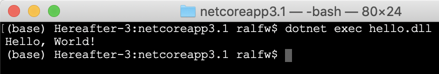

---

<!-- Page 47 of 493 -->

01-DieAnforderung-LogikLücke 38
1 Console.WriteLine("Hello, World!");
Das Programm selbst ist umfangreicher, weil noch eine Klasse und eine
Funktion drumherum erforderlich sind, aber die reine Logik ist so trivial.
Auf zur nächsten Iteration:
Iteration 2: Persönliche Begrüßung
Das Programm aus Iteration 1 soll erweitert werden. Der Auftragge-
ber sagt dir:
“Bitte bauen Sie das Programm so um, dass User dem Programm
ihren Namen mitteilen, um damit persönlich begrüßt zu werden.
AnwenderinJaninewirdnichtmehrmit“Hello,World!”,sondernmit
“Hello, Janine!” begrüßt. Kriegen Sie das hin?”
Welche Logik brauchst du dafür?
Auch diese Frage wirst du wahrscheinlich aus dem Stand beantworten
können,wennauchvielleichtmiteinwenigUnsicherheit,wofürsolchein-
fache Problemstellungen gut sein sollen. Ein Verhalten wie das Folgende
zu erzeugen, ist nun wirklich kein Hexenwerk:
Natürlich ist das keine große Herausforderung an deine Kunst, Logik für
Funktionalität zu finden.
Aber was, wenn dieses Verhalten nicht den Qualitätsanforderungen in
puncto Benutzbarkeit entspricht? Das stellt der Auftraggeber fest, wenn
du ihm deine neue Lösung vorstellst. Eine Anwenderin kann zwar dem
Programm den Namen “mitteilen”, muss dazu aber wissen, dass das auf
der Kommandozeile zu geschehen hat. Das hatte der Auftraggeber nicht
im Sinn mit seiner obigen Spezifikation; wie selbstverständlich hatte er

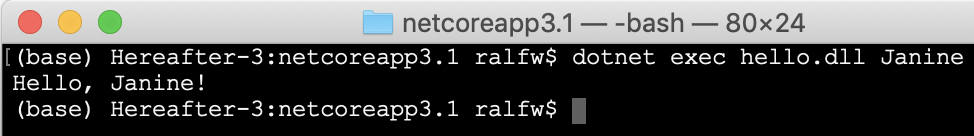

---

<!-- Page 48 of 493 -->

01-DieAnforderung-LogikLücke 39
gedacht,dasseineAnwenderinnatürlichnachihremNamengefragt wird,
um ihn dann mitzuteilen.¹⁸
“Gedacht” hatte sich der Auftraggeber ein solches Verhalten:
DaspasstgenausozurverbalenSpezifikation.DieLogikdafürsiehtjedoch
ganz anders aus als für die erste Implementation!
1 // Variante 1
2 Console.WriteLine("Hello, {0}!", args[0]);
3
4 // Variante 2
5 Console.Write("Name: ");
6 var name = Console.ReadLine();
7 Console.WriteLine($"Hello, {name}!");
Und damit ist die Lösung immer noch nicht in trockenen Tüchern! Denn
wasgeschieht,wenneinAnwenderkeinenNameneingibtundnurENTER
drückt? Dann passiert dies bei Variante 2:
Ist das ein erwünschtes Verhalten aus Sicht des Auftraggebers? Nein.
Der hatte sich bei der Formulierung “mitteilen … kann” gedacht, dass
ohne Name weiterhin mit “Hello, World!” begrüßt wird. Es gilt aller-
dings: “Gedacht ist nicht gemacht!” Auftraggeber müssen mehr, als sich
Anforderungen denken oder darauf vertrauen, dass du “als Fachmann”
schon weißt, was gemeint sein könnte. Sieh durch den Honig durch,
den dir solche Formulierungen um den Bart schmieren: “Sie haben doch
¹⁸Ichhabedichhiereinwenighereingelegt.IndererstenIterationwardieBildschirmaus-
gabe die Spezifikation. In der zweiten eine rein verbale, auf die ich sofort einen Screenshot
habefolgenlassen.Derhatdirvielleichtsuggeriert,dassdasdarinzusehendeVerhaltendas
spezifizierteist.Abermitnichten!EswarschoneineInterpretationderverbalenSpezifikation.
Dusiehst,esistsoeineSachemitdenAnforderungen…Welchegelten,wannliegensievor,
welcheFormsolltensiehaben,damitduihnenvertrauenkannst?Dazuspätermehr.

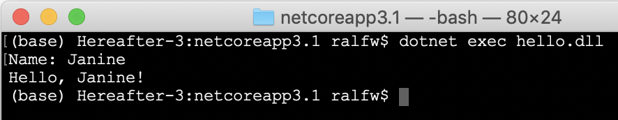

---

<!-- Page 49 of 493 -->

01-DieAnforderung-LogikLücke 40
Erfahrung. Sie wissen doch, wie man das macht und was ich meine.” Nein,
weiß du nicht! Du kannst dir zwar eine Menge denken - nur bedeutet das
nicht, dass es dasselbe ist, was sich der Auftraggeber denkt oder was ihm
am Ende gefällt, was Wert darstellt. Wenn du hörst “Sie als Fachmann”,
ist Gefahr im Verzug! Dann musst du die Anstrengungen verdoppeln, den
Kunden aus der Unklarheit zu locken - oder ihm ganz klar sagen, dass du
nur Vorläufiges programmieren kannst.
Eine oder drei oder auch fünf Zeilen Logik zu finden, ist in diesem
Szenario nicht das Problem. Doch schon bei dieser Größenordnung fehlt
es eben an Klarheit, was überhaupt Wert für den Auftraggeber darstellt.
Mit iterativem Vorgehen lässt sich der Schaden jedoch begrenzen. Wenn
du dem Auftraggeber nicht vorgaukelst, dass du seine Wünsche direkt
umsetzenkannst,sondernFeedback-Schleifenbenötigst,führenKontraste
zwischenWunschundLieferungnichtzuKonflikten,sondernzuInforma-
tionen. Motto: “Gut, dass wir darüber gesprochen haben!”
Nach zwei Iterationen kann die Lösung dann so aussehen:
Und die Logik hat dir natürlich keine Probleme gemacht. Wenn klar ist,
was gewünscht ist, ergibt sie sich quasi von selbst und sieht z.B. so aus:
1 Console.Write("Name: ");
2 var name = Console.ReadLine();
3 if (string.IsNullOrWhiteSpace(name)) name = "World";
4 Console.WriteLine($"Hello, {name}!");
Vielmehr war es der Kunde mit der unklaren Spezifikation, der zu einem
Umweg geführt hat. Garbage in, garbage out: Das gilt auch bei der
Softwareentwicklung.

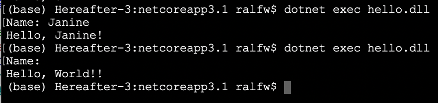

---

<!-- Page 50 of 493 -->

01-DieAnforderung-LogikLücke 41
Iteration 3: Party time!
Das Programm aus Iteration 2 soll nun abermals erweitert werden,
um zur Begrüßung auf Partys eingesetzt zu werden. Der Auftragge-
ber sagt dir:
“IchbinVeranstaltervon2-3PartysproWoche,dievon50-100Gästen
besucht werden. Solche Partys veranstalte ich in 20-25 Wochen pro
Jahr in den nächsten 1-2 Jahren. Die neue Version des Programms
möchte ich auf meinem Laptop am Eingang der Partys laufen lassen.
JederGastsolldarinseinenNameneingebenundpersönlichbegrüßt
werden. Wenn z.B. Roger das erste Mal eine dieser Partys besucht,
wirdermit“Hello,Roger!”begrüßt.KommterzumzweitenMal,heißt
es aber “Welcome back, Roger!” Ab dem dritten Besuch lautet die
Begrüßung “Hello my good friend, Roger!”. Und ist Roger schließlich
das 25. Mal auf einer Party, ist einmalig der Zusatz auszugeben
“Congrats! You are now a platinum guest!
Ich erwarte, dass ich während der Nutzungsdauer des Programms
immer denselben Laptop verwende. Der wird vor Party-Beginn hoch-
gefahren, das Programm wird einmalig gestartet für den Abend und
am Ende mit CTRL-C beendet. Eine Internetverbindung besteht am
Veranstaltungsort leider nicht verlässlich.
Können Sie das Programm in dieser Weise erweitern?”
Was nun? Sind die Anforderungen wieder unklar? Eher nicht. Es ließen
sich zwar noch ein paar Fragen stellen, wie sich das Programm verhal-
ten soll, wenn verschiedene Gäste denselben Namen haben. Doch diese
Restunklarheit ist bei dieser Iteration nicht das Problem. Vertrau mir.
Bei dieser Iteration liegt vielmehr die Logik selbst bei klaren Anforderun-
gennichtmehraufderHand.SiemagamEnde10oder20Zeilenumfassen
- viel wäre das allerdings immer noch nicht. Dennoch wirst du bei dieser
Iteration eine deutlich größere Unsicherheit verspüren. Du siehst keinen
geraden Weg mehr zur Logik; sie springt dir nicht vor dein geistiges Auge.
Deine Gedanken kreisen… du kannst jetzt nicht einfach codieren, sondern
musst zuerst nachdenken.

---

<!-- Page 51 of 493 -->

01-DieAnforderung-LogikLücke 42
Die Funktionalität selbst stellt jetzt schon ein Problem dar, obwohl das
Szenario immer noch trivial ist. Und deshalb wird auch die Korrektheit
relevant.Dennwounklarist,welcheLogikdiepassendeist,istsehrschnell
auch unklar, ob die ausgewählte tatsächlich die Anforderungen erfüllt.
Darüber hinaus aber kommst du nicht mehr ohne Ordnung im Code
aus. Deine kreisenden Gedanken suchen nicht nur die Logik für das
Verhalten, sondern auch nach einer ordentlichen Struktur, in der du die
Logik aufhängen kannst, um deine eigene Lösung zu verstehen.¹⁹
Diese Struktur wird jedoch nicht durch die Logik gebildet, es geht also
nicht um den Algorithmus. Vielmehr geht es um einen Rahmen um Logik
herum, also um Nicht-Logik Code. Wenn du dabei an Funktionen und
Klassen (oder allgemeiner: Module) denkst, hast du die richtige Intuition.
Die Phasen der Programmierung
Zwischen den Anforderungen des Auftraggebers und der Logik, die
zumindest die spürbaren Verhaltensanforderungen erfüllt, klafft eine ge-
waltige Lücke: die Anforderung-Logik Lücke. Schon in sehr simplen
Szenarien wie dem vorgestellten liegt Logik nicht auf der Hand, sondern
will gewissenhaft erarbeitet werden.
Wie die Iterationen des Beispiels zeigen sollten, geschieht das in drei Pha-
sen, die strickt aufeinander folgen. Immer. Auch bei dir. Selbst, wenn du
das nicht wahrnimmst oder nicht glaubst. Und sie iterativ, also mehrfach
durchlaufen werden, tut das dem Vorhandensein und der Reihenfolge der
Phasen keinen Abbruch.
1. Phase: Analyse
Konfrontiert mit Anforderungen ist die Softwareentwicklung aufgerufen,
zunächst eine für sie relevante Analyse zu machen. Diese Analyse hat als
¹⁹Ich habe das Experiment genügend oft live mit Entwicklergruppen gemacht, um zu
wissen wovon ich rede. Während bei den ersten beiden Iterationen die Logik herausge-
sprudelt wird, hängen Probanden dieses Experiments bei Iteration 3 und “stammeln sich
etwaszusammen”.SiekönnendieLogiknicht“herunterbeten”,sonderndrehengedankliche
Schleifen auf unterschiedlichen Ebenen. Meistens wollen sie mir etwas auf dem Level von
PseudocodeerzählenodernennenmirGliederungspunkte.KonkreteLogikistdasallesaber
nicht.Unddaskannauchnichtsein.DafüristselbstdiesesBeispielzugroß.EsimKopfund
geradlinigzulösen,könnennurdieallerbestenaufAnhieb-undauchdasnichtverlässlich.

---

<!-- Page 52 of 493 -->

01-DieAnforderung-LogikLücke 43
Ziel, Verständnis zu erzeugen. Nur wenn du wirklich verstanden hast,
solltest du dich auf den Pfad der Code-Entwicklung machen. Ansonsten
ist zu befürchten, dass das Resultat keinen Wert hat und/oder inkorrekt
ist.
Verständnis drückt sich ausschließlich zweifelsfrei in Kön-
nen aus.
Das weiß jeder, der eine Mathematik-Prüfung (aus eigenen Kräften)
bestanden oder auch nicht bestanden hat.
Ein konkreteres Beispiel: Wer versteht, wie Fibonacci-Zahlen berechnet
werden, der kann die Folge 1, 1, 2, 3, 5, 8 beliebig fortsetzen. Der weiß,
welche Zahl auf 8 folgt, der weiß, welche Zahl auf 21 folgt; der weiß auch,
ob 35 eine Fibonacci-Zahl ist oder nicht.
Der unzweideutige formale Ausdruck von Verständnis besteht deshalb in
“Beispielaufgaben” für dich als Entwickler bzw. für die von dir zu entwi-
ckelnde Software. Nur Software, die diese “Beispielaufgaben” fehlerfrei
löst, kann als anforderungskonform und korrekt akzeptiert werden.
Vorgelegt werden die “Beispielaufgaben” natürlich in Form von automa-
tisierten Testfällen. Andernfalls ist nicht zu erwarten, dass sie verlässlich
und nachvollziehbar und personenunabhängig überprüft werden.
Wenn Produktivität nicht durch Inkorrektheit behindert
werden soll, muss Software auf Reife und Stabilität stets
automatisiert mit relevanter Codeabdeckung getestet wer-
den.
Automatisierte Tests sind die erste Bastion im Kampf gegen den Morast
der schleichend wachsenden Unwandelbarkeit, der deine Produktivität in
die Knie zwingt.
Der automatisierte Test hat allerdings eine Voraussetzung: Es muss auch
klar sein, wie ein Test “an Logik angelegt” werden kann. Wie bekommt
der Test Zugang zur zu testenden Logik? Das geschieht vor allem durch
Aufruf von Funktionen.

---

<!-- Page 53 of 493 -->

01-DieAnforderung-LogikLücke 44
Das gewünschte Verhalten wird durch mindestens eine
FunktioninseinerGänzerepräsentiert(API-Funktion).Die
FunktionoderandereunterhalbihrimAufrufbaumenthal-
ten die Logik, die im Test getriggert wird.
Verständnis als Resultat der Analyse drückt sich also aus in einer
Reihe von Tupeln der Form (Testfall, Funktion).
Für das Beispiel der Fibonacci-Zahlen könnte das so aussehen:
• Funktion: int[] Fib(int n)
• Testfälle:
– Input: n=0, erwartetes Resultat: []
– Input: n=1, erwartetes Resultat: [1]
– Input: n=4, erwartetes Resultat: [1,1,2,3,]
Daraus folgt:
Softwareentwicklung, die nachhaltige Produktivität ernst
nimmt als Anforderung, ist grundsätzlich test-first Pro-
grammierung.
Das Ergebnis der Analyse sind Akzeptanztests für die zu entwickelnde
Logik. Ohne Erfüllung ihrer Akzeptanztests ist Logik nicht reif; Akzep-
tanztests sind die Reifetests “an der Außenhaut” von Software. Und ohne
unausgesetzte Erfüllung bisheriger Akzeptanztests ist Logik nicht stabil.
Beides ist inakzeptabel im Sinne dauerhaft hoher Produktivität.
Der zweiten Iteration des obigen Programms fehlte es an formalem,
dokumentiertem Verständnis. Deshalb ist die Entwicklung in die falsche
Richtung gelaufen und hat auch noch den Eindruck der Inkorrektheit
gemacht.

---

<!-- Page 54 of 493 -->

01-DieAnforderung-LogikLücke 45
2. Phase: Entwurf
Die dritte Iteration im Beispiel hat natürlich auch noch unter einem
Mangel an dokumentiertem Verständnis gelitten. Darüber hinaus waren
die Anforderungen aber so umfangreich, dass sich auch gutes Verständnis
nicht mehr “einfach so” in Logik hat umsetzen lassen.
Das Nachdenken über Code vor der Codierung in der IDE, das die dritte
Iteration erzwungen hat, ist das, was ich Design oder Entwurf nenne.
DiesePhaseistdiezentraleProvokationderSoftwareentwicklung,scheint
mir. Ihr müssen sich alle Entwickelnden stellen, hier ist echte Kreativität
gefragt. Und hier gibt es den größten Widerstand seit Anfang der 2000er.
Entwurf scheint überflüssig, hinderlich, verlangsamend. Meine Erkennt-
nis ist allerdings gegenteilig: Ich sehe, dass die Produktivität leidet, weil
Entwicklungsteams einen Entwurf vernachlässigen.
Im Entwurf wird eine Lösung für das Problem gefunden,
das die Anforderungen aufwerfen. Das ist allerdings nur
eine konzeptionelle Lösung, ein Lösungsansatz. Der mani-
festiert sich in Code erst in der nächsten Phase.
Entwurf findet immer statt. Du kannst ihn sehr bewusst oder ganz
unbewusst durchführen. Erfolgt er bewusst, ist er allerdings noch nicht
notwendig auch systematisch. Deshalb lässt die Ordnung der “entworfe-
nen” Strukturen oft zu wünschen übrig.
Entwurf ist per definitionem deklarativ.
Das heißt, im Entwurf steht keine Logik zur Verfügung. Entwurf liefert
keine Algorithmen, sondern plant ein Modell.
Das Modell als Ergebnis des Entwurfs besteht aus einer Reihe von Funk-
tionen die in Tupeln der Form (Funktion1, Funktion2, Beziehungen) ver-
bunden sind.
BeispielhafteBeziehungenzwischenFunktionenfundgdesModellssind:

---

<!-- Page 55 of 493 -->

01-DieAnforderung-LogikLücke 46
• f ruft g auf (Abhängigkeit)
• g folgt auf f (Sequenz)
• f spezialisiert g (Vererbung)
• fundghabeninhaltlichetwasgemeinsam(sieverfolgendenselben
Zweck)
• f und g benutzen gemeinsamen Zustand
Das mag abstrakt klingen und Modelle müssen auch nicht in Form
von 3-spaltigen Excel-Blättern geliefert werden. Ein Klassendiagramm,
ein Datenfluss, eine Zustandsmaschine… das und mehr sind hilfreiche
Ausdrucksformen für Modelle - die sich allerdings alle auf die obige sehr
allgemeine Definition zurückführen lassen.
Zentral beim Entwurf eines Modells ist, dass es ganz bewusst von kon-
kretem Code abstrahiert. Die Feinheiten einer Programmiersprache oder
eines Framework und der Detailreichtum von Logik stehen nicht zur
Verfügung. Der Lösungsansatz ist “mit einfacheren Mitteln” zu finden.
Diese freiwillige Selbstbeschränkung hat mehrere Gründe:
• Weniger Details erlauben eine schnellere Lösungsfindung - auf
hohem Abstraktionsnivau in Form eines Durchstichs.
• Eine deklarative Lösung erlaubt die einfachere visuelle Darstellung
und damit Kommunikation zwischen Teammitgliedern. Mentale
Modelle lassen sich externalisieren.
• Visuelle, abstrakte Lösungsansätze lassen sich in größerer Vielfalt
gegenüberstellen, was der Findung besserer Lösungen dient.
• Einen Lösungsansatz zu finden erfordert andere geistige Aktivität/-
Fähigkeit als die Codierung eines Lösungsansatzes. Die explizite
Modellierung vor einer Codierung dient mithin der Entzerrung des
Entwicklungsprozesses; es wird ermüdendes, verlangsamendes und
fehlerträchtiges Multitasking vermieden.
Ein bewusster und systematischer Entwurf stellt ein Modell her,
das nicht nur die Lösung der Verhaltensanforderungen repräsentiert,
sondern auch noch der Forderung nach Ordnung genügt.
Wo die Analyse eine Bastion gegen Wertarmut und Inkorrektheit ist, da
ist der Entwurf eine Bastion gegen Unordnung.

---

<!-- Page 56 of 493 -->

01-DieAnforderung-LogikLücke 47
3. Phase: Codierung
DieCodierungschließlichsetztdenEntwurfuminCode.Duübersetztein
ModellmiteinerProgrammierspracheinFunktionen,diedumitkonkreter
Logik ausfüllst.
Ist das Modell gut, kann dieser Phase durchaus eine gewisse Langeweile
anhaften.DasProblemistja(theoretisch)gelöst.DieSpannungistrausaus
denAnforderungen.InsofernistmeinZielmitProgrammingwithEase,dir
die Codierung etwas zu verleiden. Du sollst sie am Ende als mechanische
Arbeit auffassen, bei der nur noch relativ wenig Kreativität nötig ist. Ok,
vielleicht übertreibe ich ein wenig, aber so ungefähr stelle ich mir das vor,
weil ich es selbst so erfahren habe. Je leichter ich mir die Programmierung
gemacht habe, desto unspannender wurde die Codierung.
Nachlässigkeit darf sich deshalb jedoch nicht einschleichen. Die Codie-
rung hat ihre eigenen Probleme, die noch gelöst werden wollen. Hier
schlägt die Stunde des Handwerkers, der seine Technologien beherrscht.
Das Ergebnis der Codierung ist - wie sollte es anders sein - Code. Aber
nicht irgendein Code, sondern Code, der erstens der Ordnung des Modells
folgt und zweitens in den Detail-Ebenen unterhalb des Modells ebenfalls
Ordnung walten lässt.
Darüber hinaus ist die Codierung die Phase, in der du die automatisierten
Prüfungen der Korrektheit implementierst.
Codierung stellt Produktionscode und Testcode paarweise
test-first her.
OrdnungundKorrektheitdürfenbeiderCodierungaufdenletztenMetern
nicht kompromittiert werden. Das ist kein kleines Kunststück unter dem
beständig herrschenden Druck von Lieferterminen. Und genau darum
geht es in den weiteren Lektionen.
Zusammenfassung
Die Übersetzung von Anforderungen in Code ist eine komplexe Tätigkeit,
die nur systematisch verlässlich alle Qualitäten herstellt: Wert in Form
von Funktionalität + Effizienz, Korrektheit und Ordnung.

---

<!-- Page 57 of 493 -->

01-DieAnforderung-LogikLücke 48
Die minimale Systematik, die ich dir mit Programming with Ease insge-
samt vermitteln will, besteht darin, für gegebene Anforderungen eine für
dich als Entwickler relevante Analyse durchzuführen, die nachvollzieh-
bares Verständnis nicht nur dokumentiert, sondern auch automatisiert
überprüfbar macht.
Ausgehend von diesem Verständnis wird dann im nächsten Schritt ein
Lösungsansatz modelliert, der von den Feinheiten der Codierung bewusst
abstrahiert für mehr Überblick, bessere Kommunizierbarkeit und größere
Flexibilität.
Erst nach diesen Vorarbeiten kann alles bereit sein, um das zu tun, was
man gemeinhin als die vordringliche Aufgabe von Softwareentwicklung
sieht: die Codierung.
EineBrückeüberdieAnforderung-LogikLücke
Analyse → Entwurf → Codierung (AEC): Dieser Prozess ist unver-
brüchlich, gar unvermeidbar. Daran glaube ich fest; das zu verstehen, hat
mir die Softwareentwicklung erheblich erleichtert.
Dasbedeutetjedochnicht,dassSoftwareentwicklungdeshalb“imWasser-
fall”odernachBDUF(BigDesignUp-Front)verlaufenmüsste.DiePhasen
AEC können beliebig häufig und beliebig schnell durchlaufen werden. Sie
sollten lediglich dem Umfang und Schwierigkeitsgrad der anliegenden
Anforderungen entsprechen.
Auf diese Weise wird die Lücke zwischen Anforderungen und Code
systematisch und nachvollziehbar und teamfähig überwunden.

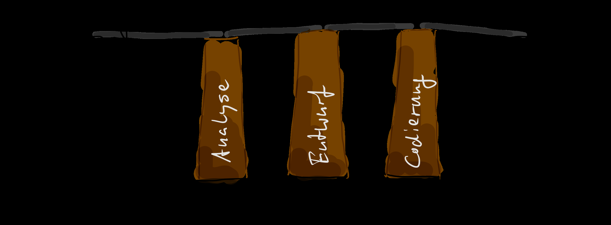

---

<!-- Page 58 of 493 -->

01-DieAnforderung-LogikLücke 49
Übungsaufgaben
ÜbungmachtdenMeister!Deshalbgibteszu(fast)jedemKapitelÜbungs-
aufgaben, die du in deiner Geschwindigkeit lösen kannst. Kein Druck,
keine Anprüche, die andere dabei an dich haben könnten. Mach es dir
gemütlich damit.
Zu allen Übungsaufgaben findest du im Anhang auch Musterlösungen.
Mit denen möchte ich dir das Selbststudium erleichtern; versuche also
nicht zu luschern, während du die Übungsaufgaben löst. Und bitte ver-
stehe die Musterlösungen auch nicht als Abkürzung, mit denen du dir die
eigene Lösung der Übungsaufgaben (er)sparst.
Wenn du wirklich, wirklich daran interessiert bist, zu lernen, d.h. deine
Gewohnheiten zu verändern, dann brauchst du eigene Praxis. Du musst
nach dem Lesen etwas tun mit dem Gelesenen. Gern kannst du natürlich
die Anwendung in deinem Projektalltag versuchen; früher oder später
musst du diesen Sprung ja ohnehin machen. Aber erstens sind die Pro-
bleme in deinem Projektalltag weniger überschaubar, so dass dir weniger
klar ist, wie und wo mit dem Transfer des Gelesenen du anfangen kannst.
Zweitens wirst du durch Anwendung des Neuen erstmal langsamer,
weil du noch unsicher bist; das kann dir schnell scheele Blicke von den
Kollegen einbringen und du fällst in alte Gewohnheiten zurück. Drittens
kann ich dir keinerlei Feedback geben, noch nicht einmal in Form einer
monologischen Musterlösung. Feedback ist aber extrem wichtig, wenn du
eine neue Fähigkeit erwirbst.
Deshalb empfehle ich dir sehr, die Übungen zu machen als erste Anwen-
dung des Lernstoffs “in einer Sandkiste”. Die Aufgaben sind überschaubar,
keiner redet dir rein und macht druck und mit den Musterlösungen
bekommst du zumindest eine gewisse Form von Feedback bzw. Kontrast
zum Nachdenken.
Um deine Lösungen der Übungsaufgaben zu dokumentieren, lege für dich
ein Git-Repository an, in dem du all deine Arbeitsergebnisse speicherst.
Committe häufig und vergiss am Ende das Push nicht.²⁰
²⁰Wenn du noch nicht so viel mit Git gearbeitet hast, kannst du einen der bequemen
visuellenGit-Clientsbenutzenwiez.B.denkostenlosenvonGitHub.EineÜbersichtfindest
duhier.

---

<!-- Page 59 of 493 -->

01-DieAnforderung-LogikLücke 50
Ein Git-Repository ist das unterste und einfachste Sicherheitsnetz, das du
für deine Programmierung spannen kannst. Never code without it.²¹
Reflexionsaufgabe
Bitte formuliere eine Frage oder eine Erkenntnis zum Kapiteltext.
• Wo bist du gedanklich hängengeblieben, was ist dir unklar,
was passt für dich irgendwie nicht zusammen, wozu würdest
du dir noch etwas mehr Erklärung wünschen? Steht irgendet-
waszudeinerbisherigenPraxisimWiderspruchunddufragst
dich, warum du etwas ändern solltest?
• Oder: Wann hast du einen Aha-Moment gehabt, was ist
diralsbemerkenswert,spannend,ausprobierenswertaufgefal-
len? Hat irgendetwas “in dir Klick gemacht”, weil dir nun ein
Zusammenhang aufgegangen ist? Oder versteht du jetzt aus
deiner bisherigen Praxis irgendetwas besser?
Am besten formulierst du Frage bzw. Erkenntnis schriftlich. Indem
du deine Gedanken aufschreibst, wirst du dir ihrer bewusster. Bei
einer Frage kommst du dadurch vielleicht schon einer Antwort aus
dir selbst heraus näher. Bei einer Erkenntnis fällt dir vielleicht schon
etwas ein, das du ab jetzt anders machen kannst.
Aufgabe 1 - Nachdenken
Geschätzte Bearbeitungsdauer: 10min
1. Stelle eine Liste zusammen mit allen Gründen, die für die
Automatisierung von Tests sprechen.
²¹Aber nicht nur den Codeanteil deiner Lösungen solltest du in Repository legen. Alle
Artefakte sind es wert, aufbewahrt zu werden. Vielleicht schreibst du Analysen in einem
.txt/.docx Dokument auf oder machst eine Zeichnung in Visio oder hast eine Skizze auf
Papier(diedufotografierenkannst),danncommittealldasebenfalls.Soschaffstdudireine
DokumentationderkomplettenLösungsentwicklung.

---

<!-- Page 60 of 493 -->

01-DieAnforderung-LogikLücke 51
2. Stelle eine zweite Liste zusammen mit allen Gründen, die
dafürsprechen,automatisierteTestsvordemProduktionscode
zu schreiben. Was spricht also für ein test-first Vorgehen?
Beide Listen kannst du in einer Textdatei im Repo speichern.
Aufgabe 2 - Entwickeln
Anforderungen
Entwickle das Programm zur Begrüßung von Party-Gästen wie in
Iteration 3 spezifiziert.
TODO: Vorgehen
1. AnalysieredieAnforderungenwiebeiderAnforderung-Logik
Lücke beschrieben:
Geschätzte Bearbeitungsdauer: 10min
1. Definiere naheliegende Akzeptanztestfälle. (Versuche
nicht perfekt/vollständig oder speziell smart zu sein. Es
geht nicht darum, dass du jeden edge case abdeckst,
sondern dir überhaupt Gedanken machst darüber, wie
das Verhalten mit formalisierten Beispielen getestet
werden kann.)
2. Finde eine API-Funktion, auf die du die Akzeptanz-
testfälle automatisiert anwenden kannst. Sie sollte so
viel Logik umfassen/repräsentieren, wie möglich - aber
gleichzeitigkeineübergroßenSchwierigkeitenbeimTest
bereiten.
2. Setze deinen Code mit “zwei Seiten” auf: auf der einen Seite
steht der Testcode, auf der anderen der Produktionscode.
Beide soll physisch getrennt sein.
Geschätzte Bearbeitungsdauer: 10min

---

<!-- Page 61 of 493 -->

01-DieAnforderung-LogikLücke 52
1. Schreibe zuerst den Code für die Akzeptanztests (unter
Nutzung eines Testframeworks für deine Programmier-
plattform, z.B. JUnit (Java) oder xUnit (.NET), Cpp-
Test), die du definiert hast. Wenn darin die Funktion
noch von der IDE als nicht vorhanden markiert ist,
macht das nichts. Du kannst sie am Ende (hoffentlich)
mit einem Refactoring-Befehl der IDE automatisch ge-
nerieren lassen (und verschiebst sie dann auf die Seite
des Produktionscodes).
3. Nachdem du die Akzeptanztests geschrieben hast, entwickle
den Produktionscode.
Geschätzte Bearbeitungsdauer: 20min
1. Strebe zuerst an, dass die Akzeptanztests “grün” sind.
Konzentriere dich also auf die Logik hinter der API-
Funktion aus Schritt 1.2.
2. Wenn die Logik für die API-Funktion reif ist, fülle
“drumherum” im Produktionscode die fehlende Logik
hinzu, damit alles zusammen als Programm von der
Kommandozeile aufrufbar ist.
Speichere deinen Code im Repo.
https://en.wikipedia.org/wiki/List_of_unit_testing_frameworks

---

<!-- Page 62 of 493 -->

02 - Vorläufig codieren im
Chaos
Mit der Codierung beginnst du erst, wenn du Klarheit über einen Lö-
sungsansatzhast.DasisteinederwichtigstenFolgerungenausdenPhasen
zur Überwindung der Anforderung-Logik Lücke. Codierung ist also nicht
gleichzusetzen mit Programmierung, sondern nur ein Teil davon.
Der Lösungsansatz wird in Form eines Modells vom Entwurf geliefert,
das in Beziehung gesetzte Funktionen enthält. Dazu kommen Testfälle
für diese Funktionen, zu denen ja auch als Ausgangspunkt die API-
Funktionen der Analyse gehören.
Konkret bedeutet das in den meisten Fällen: Die Codierung bekommt
Klassen (allgemeiner: Module) und Funktionen vorgelegt, die sie in eine
Programmiersprache übersetzen und dann mit Logik füllen soll.²²
Das Nein der Codierung
Eigentlich sollte der Startpunkt deiner Codierungsphase jedenfalls so
aussehen. Eigentlich solltest du konkret mit einer Funktion(signatur) und
zugehörigenTestfälleninderHandvordemblinkendenCursordeinerIDE
sitzen. Nicht weniger Informationen solltest du haben.
Es kann jedoch sein, dass dir die Analyse der Anforderungen kein forma-
lisiertes Verständnis geliefert hat, was dein Auftraggeber will. Vielleicht
fehlen konkrete Testfälle, vielleicht sind zwar Nutzungsbeispiele grob
dokumentiert und besprochen, aber es fehlt noch eine Vorstellung über
deren Repräsentation im Code durch API-Funktionen. Die Unklarheit
²²Das mag jetzt etwas abstrakt klingen, weil ich nicht näher beschrieben habe, wie
Analyse und Entwurf aussehen. Aber das Wie ist hier auch nicht so wichtig. In diesen
Lektionen geht es nur um die anschließende Codierung. Es genügt für den Moment, dass
duweißt,wasModule/KlassenundFunktionensind.

---

<!-- Page 63 of 493 -->

02-VorläufigcodierenimChaos 54
kann viele Formen und Ursachen haben. Wichtig ist, dass du dir ihrer
bewusst bist!
Vor der Codierung kannst du also auf zwei sehr unterschiedlichen Stufen
stehen:
• Mit (Akzeptanz-)Testfällen und zugehörigen Funktionen
• Ohne Testfälle und/oder zugehörige Funktionen
Diese Unterscheidung ist wichtig, denn Produktionscode, d.h. der aus-
zuliefernde Code, sollte nur geschrieben oder angefasst werden in
größtmöglicher Klarheit. Es besteht sonst die Gefahr unnötiger Verän-
derungen, die eine Belastung für die Produktionscodestruktur darstellen.
Wenn du in Unklarheit den Produktionscode erst in die eine Richtung
zerrst und negatives Feedback bekommst, ihn dann in eine andere richtig
drückst und wieder negatives Feedback bekommt und dann nochmal
durch die Mangel drehst… dann verbessert sich seine Struktur dabei
nicht. Im Frust wirst du Abkürzungen nehmen und wenig geneigt sein,
aufzuräumen.
Sobald du einen Lösungsansatz in Code “gießt”, verhärtet er. Code, auch
wenn er nur aus programmiersprachlichem Text besteht, ist schwer zu
verändern. Wenn du ihn also anfasst, solltest du dir sehr sicher sein, dass
und wie das nötig ist.
Ein guter Teil der Unordnung in Code, die die Produktivität so negativ
beeinträchtigt, hat als Ursache “vorzeitige Codierung”. Die kann als eine
Art von premature optimization angesehen werden, also einer Variante
der Wurzel allen Übels nach Donald Knuth²³.
WermitderHerstellung/VeränderungvonProduktionscodebeginnt,ohne
ausreichend sicher zu sein, dass Struktur und Logik so und nicht anders
sein sollten, der zielt auf schnelle Lieferung ab. Das ist eine Optimierung
auf Feedback oder Wert hin – aber auch das kann selbst in einem agilen
Vorgehen vorzeitig geschehen. Um dem entgegen zu wirken, lautet die
klare wie pauschale Empfehlung:
Produktionscode darf nur geschrieben werden, wenn für
dasanliegendeIssue(FeatureoderBugFix)mindestensein
relevanter roter (Akzeptanz)Test existiert.
²³https://en.wikiquote.org/wiki/Donald_Knuth

---

<!-- Page 64 of 493 -->

02-VorläufigcodierenimChaos 55
EinsolcherTestsetztvoraus,dassBeispieldatenvorliegenundmindestens
eine Funktion existiert, die den Funktionsbaum repräsentiert, in dem
Logik verändert werden muss.
Sind diese Voraussetzungen für ein Issue nicht erfüllt, darfst keinen
Produktionscode schreiben. Es ist schlicht nicht wirklich klar, wie das
gewünschte Verhalten aussehen soll.
Deshalb musst du spätestens jetzt Nein zu einer Veränderung von Produk-
tionscode sagen!
Ich weiß, das ist sehr schwer. Der Druck vom Auftraggeber, nach all den
Gesprächen über Anforderungen endlich zu beginnen ist groß. Sollte ein
iterativ-inkrementelles Vorgehen nicht die Risiken von Unklarheiten auch
schon genug minimieren? Ich glaube, nein. Es gibt Unklarheit, die so groß
ist, dass du sie nicht in einer “normalen” Iteration aus der Welt schaffen
kannst, bei der du etwas mit Produktionscode ausprobierst. Und das
Kriterium ist für mich die Existenz von codierbaren Akzeptanzkriterien.
Da, so glaube ich, solltest du eine Linie ziehen und sagen “Bis hierher
und nicht weiter!” Entweder, du hast mit dem Auftraggeber genügend
Klarheit hergestellt in Form von Akzeptanztestfällen und API-Funktion
- oder eben nicht. Wenn es dem Auftraggeber so wichtig ist, dass du
produktiv wirst, d.h. Produktionscode erweiterst, dann muss er sich eben
anstrengen, für sich Klarheit herzustellen, was er denn von dir will. Falls
das klappt, beginnst du gern die Arbeit am Produktionscode. Falls aber
nicht…
Prototyping to the Rescue
FallskeinekonkretenAkzeptanzkriterienvorliegen,bedeutetdasnatürlich
nicht, dass du dich trotzig auf die Hinterbeine stellst und nichts tust.
Mit Codierung kannst du dem Auftraggeber auch in dieser Situation der
Unklarheit zu Diensten sein - nur eben nicht mit Produktionscode.
DukannstaufandereWeiseversuchen,demAuftraggeberetwaszugeben,
was ihn zu Feedback anregt. Jetzt schlägt die Stunde des Prototypen! Pro-
totypen sind Werkzeuge zur Informationsgenerierung. Mit ihnen kitzelst
du Klarheit aus dem Auftraggeber (und auch aus dir) heraus.
Prototypencode kann jede erdenkliche Form haben, ist aber strickt ge-
trenntvomProduktionscode.SelbstverständlichkannprototypischerCode

---

<!-- Page 65 of 493 -->

02-VorläufigcodierenimChaos 56
jedoch Elemente des Produktionscodes benutzen. Es zahlt sich also aus,
den Produktionscode so zu strukturieren, dass er in Bausteinen vorliegt,
die in Prototypen “wiederverwendbar” sind. Die Notwendigkeit von Pro-
totypen angesichts immer wieder herrschender Unklarheit, sollte mithin
eine Motivationsquelle für die Modularisierung von Produktionscode
sein.
Modularisierung sei an dieser Stelle pauschal und vereinfachend verstan-
den als eine Zusammenfassung von Logik in Funktionen in Klassen. Eine
genauere Definition des Begriffs Modul gehört zu den Erläuterungen der
Entwurfsphase.
Die Natur von Prototypen im Allgemeinen und prototypischem Code
im Besonderen ist die Vorläufigkeit! Prototypen haben keine lange Le-
bensdauer, so dass bei ihrer Herstellung Korrektheit und Ordnung keine
spezielle Rolle spielen. Beim Prototypen geht es allein darum heraus-
zufinden, was genau Wert für den Auftraggeber bedeutet.
Hier ein Beispiel für einen Prototypen für Iteration 2 des Begrüßungspro-
gramms aus Lektion 1:
Der Prototyp ist nur eine Skizze der Bedienung des Programms. Er
besteht aus etwas Text, nicht einmal Code ist nötig. Aber das reicht aus,
um dem Auftraggeber Feedback zu entlocken: “Haben Sie sich so die
Bedienung des Programms vorgestellt? Meinten Sie, dass der Name auf
der Kommandozeile mitgeteilt werden soll?”
UndeszeigteineKerneigenschaftvonPrototypen:siesindleichtgewichtig.
Wo Unklarheit herrscht, soll ohne Ballast Klarheit geschaffen werden. In
Unklarheit sind Ordnung und Korrektheit noch nicht wichtig.
Unklarheit in Bezug auf die Bedienung einer Software ist ein häufi-
ger Grund für schlechte Anforderungen. Die wachsende Zahl an UI-

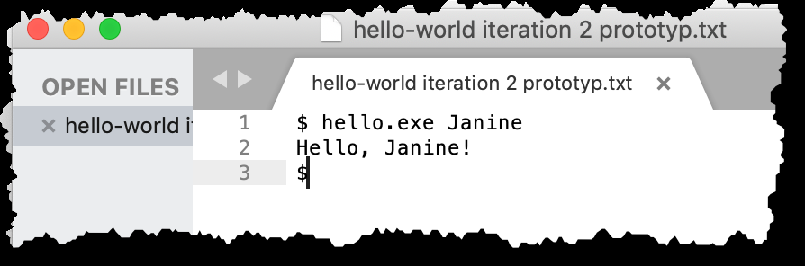

---

<!-- Page 66 of 493 -->

02-VorläufigcodierenimChaos 57
Prototyping Werkzeugen bezeugt das. Doch diese Unklarheit in Bezug auf
die Form sollte nicht verwechselt werden mit einer Unklarheit in Bezug
auf den Inhalt, d.h. die Funktionalität. Nur, weil der Auftraggeber nicht
recht weiß, wie die Bedienung genau aussehen/sich anfühlen soll, können
keine Beispiele für die grundlegend geforderten Transformationen formu-
liert werden? Hier ist die Softwareentwicklung gefordert, differenziert
hinzuschauen und auch den Auftraggeber herauszufordern.
In Bezug auf Iteration 2 könnte das bedeuten, dass du mit dem Auftrag-
geber auch bei Unklarheit in Bezug auf die Benutzerschnittstelle schon
Klarheit in Bezug auf das grundlegende Verhalten erzielen kannst. Dafür
ist nicht die Darstellung wichtig, sondern die Datenverarbeitung, die
Übersetzung von Input in Output. Das könnte z.B. so aussehen:
Denn daraus kannst du zumindest schon eine API-Funktion ableiten,
z.B.string Greet(string name).MiteinemsolchenVorgehenwäre
die Unklarheit zurückgedrängt. Nicht alles ist unklar, sondern “nur” die
Bedienung der Software. Du könntest also mit Produktionscode für die
Übersetzung schon beginnen, während du bei der Benutzerschnittstelle
noch im Prototypenmodus arbeitest.
In jedem Fall sind Prototypen kurzlebige Werkzeuge zur Generierung
von Feedback in Bezug auf sehr spezifische Aspekte von Software,
egal, ob es sich um die Benutzerschnittstelle oder Funktionalität handelt.
Es sind Sonden, die “an den Auftraggeber angelegt werden”, um seine
Reaktion zu messen. Es ist hinlänglich bekannt, dass Auftraggeber nur
schwersagenkönnen,wassiewollen-dochsiekönnensehrguterkennen,
was sie nicht wollen, wenn man ihnen Alternativen vorlegt. Du kennst
sicher die Reaktion von Auftraggebern “Nein, doch nicht so! Das geht gar
nicht!”, wenn du ihnen etwas präsentierst, was du nach ihren unklaren
Vorstellungen mit viel Mühe erarbeitet hast. Auftraggeber sind sehr, sehr

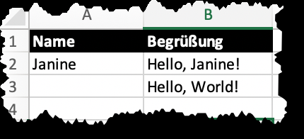

---

<!-- Page 67 of 493 -->

02-VorläufigcodierenimChaos 58
gut darin, Differenzen zu ihren Vorstellungen zu erkennen - auch wenn
sie ihre Vorstellungen nicht artikulieren können.
EinText-PrototypfürdieBenutzerschnittstellemitzweiAlternativen
In Situationen der Unklarheit hilft es daher, zügig dem existierenden
Zustand S einen Zustand T nebenzuordnen und zu fragen, “Ist das
besser? War es so gemeint?” Damit wird einerseits klar gemacht, was
die Softwareentwicklung bisher meint verstanden zu haben (dass T vom
Auftraggebergewünschtseinkönnte);andererseitskannderAuftraggeber
etwas sehen/fühlen, statt sich nur etwas vorzustellen, was es ihm leicht
macht zu erkennen, ob es noch einen Kontrast zu seiner bisher schwam-
migen Qualitätserwartung gibt.²⁴
Prototypen bauen einen Sandkasten auf, in dem du Softwareentwicklung
spielerisch “austoben” kannst. Du kannst Feedback vom Auftraggeber ge-
nerieren. Du kannst aber auch nur für dich persönlich Spikes²⁵ herstellen,
²⁴“Aus Fehlern lernen” ist ein beliebter Spruch. Ich finde den Begriff “Fehler” aber sehr
belastet und glaube nicht, dass wir zum Lernen Fehler willkommenheißen sollten. Sie sind
vielleichtnichtkomplettvermeidbarundwennsieentstehen,kannmanauchdarauslernen.
Viel wichtiger finde ich, das was den Fehler ausmacht: den Kontrast. Wie nützlich bewusst
hergestellteKontrastefürdasLernensind,habeichineinemBlogartikelbeleuchtet.
²⁵https://en.wikipedia.org/wiki/Spike_(software_development)

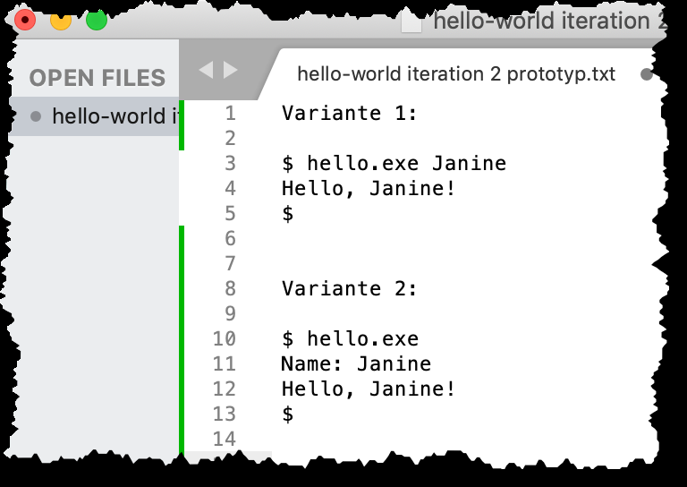

---

<!-- Page 68 of 493 -->

02-VorläufigcodierenimChaos 59
umzueruieren,ob/wieTechnologiengenutztoderLösungsansätzecodiert
werden könnten.
Unklarheit kann also außen wie innen herrschen. In beiden Fällen solltest
du dringend mit Prototypen forschen, bevor du Produktionscode anfasst.
Dass dann prototypischer Code wesentliche Qualitäten von Produktions-
code vermissen lässt, liegt in seinem Zweck. Es verbietet sich daher,
prototypischen Code “einfach so” in Produktionscode umzumünzen oder
ohne weitere Nacharbeit dorthin zu kopieren.
Code aus einem Prototypen muss auf dem Weg in den Produktions-
code in puncto Korrektheit und Ordnung auf das notwendige Niveau
für langfristig hohe Produktivität gehoben werden. Angemessene
Tests sind einzurichten, angemessene Strukturen sind zu entwerfen und
zu implementieren.
Ziel des Prototypen ist es, nachzubessern, wo die Analyse
bis dahin zu kurz gesprungen ist.
Nach einem Prototypen soll klar sein, wie Testfälle für eine Anforderung
auszusehen haben und welche Funktionen ihnen gegenüberstehen sollen.
Prototyping ist insbesondere eine Unterstützung der Analyse durch
Codierung. Die Softwareentwicklung ist nicht untätigt - doch sie muss
klar machen, dass ihre Arbeit keinen Produktionscode erzeugt, sondern
“nur” ein vorläufiges Analysehilfsmittel.
Mit diesem Nein gegenüber dem Auftraggeber schützt du deine Kapazität
für die Herstellung von Features im Produktionscode. Würdest du das
nicht tun und vorzeitig mit der Veränderung von Produktionscode be-
ginnen, wären später verschwenderische Nacharbeiten in Form von Bug
Fixing und Refaktorisierungen die Folge.
DieSoftwareentwicklunghatdieVerantwortung,dievonihrbetreute
Ressource Produktionscode zu schützen. Dazu gehört ein klares Nein
in Unklarheit, was Verständnis von Anforderungen oder auch Tech-
nologien angeht.

---

<!-- Page 69 of 493 -->

02-VorläufigcodierenimChaos 60
Die Schwierigkeit der Umsetzung
einstufen
Die an der Codierung anliegenden Anforderungen bzw. ihre Lösungs-
ansätze sind unterschiedlich schwierig umzusetzen mit Code im Allge-
meinen und Logik im Speziellen. Mehr oder weniger schwierig bedeutet,
dass die Herstellung des Ergebnisses mehr oder weniger lange braucht
und/oder mehr oder weniger punktgenau die gewünschte Qualität haben
wird.
Anforderungen, die nicht schwierig sind, können schnell und verlässlich
mit allen Qualitäten codiert werden. Anforderungen, die hingegen sehr
schwierig sind, brauchen mehr, gar viel mehr Zeit oder sogar unbekannt
lange, bis sie womöglich nur mit unvollständiger Qualität geliefert wer-
den.
Wie schwierig ist aber eine bestimmte Anforderung (z.B. formuliert als
User Story) umzusetzen? Die Agilität lässt Entwickelnde das oft mittels
einer Story Point Schätzung grob beurteilen. Damit bekommt der Scrum
Product Owner als Auftraggeber einen Eindruck davon, wie viel Mühe
eine Umsetzung machen könnte. Diese Angabe kann er dann in Bezug
setzen zum Wert, den er einer User Story beimisst, um ihr eine Priorität
in der Entwicklungsreihenfolge zu geben oder über eine weitere Verfeine-
rung (Granularität) zu entscheiden.
In der Agilität dient die Einstufung des Umsetzungsschwierigkeitsgrades
von Anforderungen der Steuerung der Entwicklung. In der Codierung
hingegen,wennschonentschiedenist,dasseineAnforderungumzusetzen
ist, dient sie der Wahl der Methode, wie die Umsetzung betrieben werden
soll.
Das Kriterium “Verständnis liegt dokumentiert durch Testfälle und Funk-
tionen vor” dient einer ersten groben Einschätzung des Schwierigkeits-
grades. Wird das Kriterium nicht erfüllt, ist der Schwierigkeitsgrad im
Grunde unbekannt hoch.
Problemschwierigkeit ist für mich ein Kontinuum. Das reicht von trivial
bisunbekannt.DiesesKontinuumwirddurchdasKriteriummithininmin-
destens zwei Bereiche geteilt: Anforderungen, für die keine codierbaren
Akzeptanzkriterien vorliegen, liegen darin pauschal im Chaos.

---

<!-- Page 70 of 493 -->

02-VorläufigcodierenimChaos 61
Die Bezeichnung “chaotisch” ist dem Cynefin Framework²⁶ entlehnt. Sie
soll darauf hinweisen, dass im Angesicht von Chaos die angemessene
Reaktion das unverzügliche Tun ist. “Taten statt Warten” ist angezeigt.
Mit unverzüglichem Tun meine ich natürlich nicht Aktionismus. Wildes
Flügelschlagen ist kontraproduktiv. Vielmehr soll das, was getan wird, ge-
gründet sein in einem Wertesystem. Das bedeutet, es gibt ein Fundament
an Regeln und Prinzipien, die der Ordnung der Welt dienen. Nur wenn
einesolcheOrdnungherrscht,istsichergestellt,dassZieleerreichtwerden
können.
Für das gesellschaftliche Leben gehört zum Wertesystem z.B. Ehrlichkeit
oder Rechtsstaatlichkeit. Wo Menschen im Miteinander nicht mehr er-
warten können, dass ihr Gegenüber ebenfalls diese Werte schätzt und
beherzigt, herrscht Chaos. Und umgekehrt, wo gesellschaftliches Chaos
herrscht, besteht die unverzügliche Tat darin, ehrlich und rechtsstaatlich
zu handeln.
²⁶https://en.wikipedia.org/wiki/Cynefin_framework

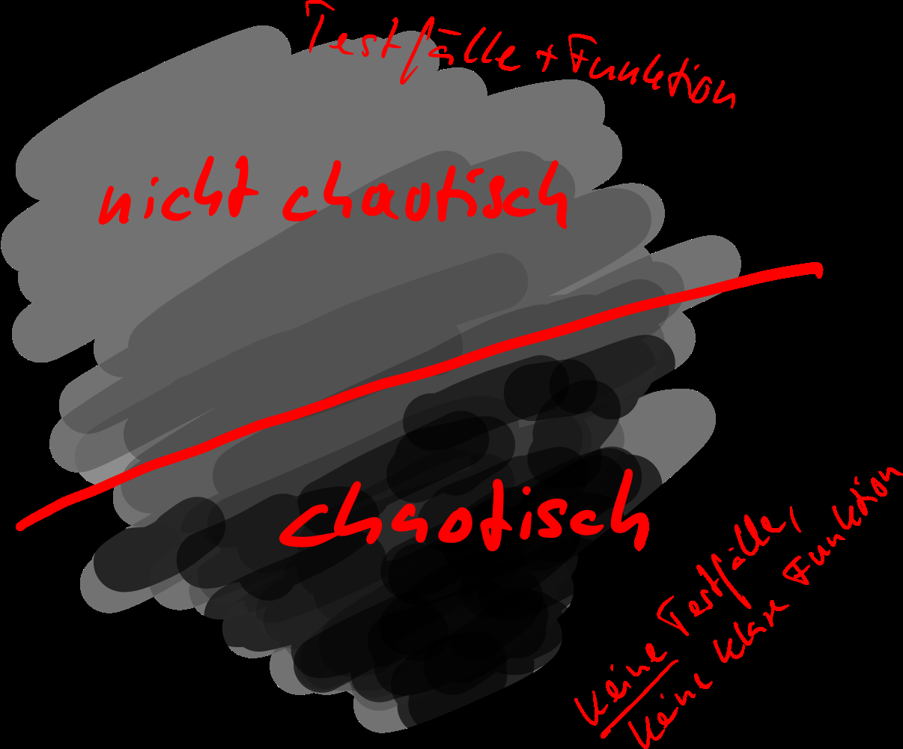

---

<!-- Page 71 of 493 -->

02-VorläufigcodierenimChaos 62
InderCodierung,wiehiervorgestellt,giltalsWert“Produktionscodesteht
hinter einer Funktion unter automatisiertem Test”. Ist das nicht der Fall,
herrscht eben Chaos. In der Literatur wird diese Form von Code auch
Legacy Code²⁷ genannt:
“Michael Feathers introduced a definition of legacy code as
code without tests, which reflects the perspective of legacy
code being difficult to work with in part due to a lack of
automated regression tests.”
Produktionscode ohne automatisierte Tests “als Gegengewicht” bzw.
“Sicherheitsnetz” ist chaotisch nicht aufgrund seiner Struktur, son-
dern aufgrund der fundamentalen Unsicherheit, was passiert, wenn
man ihn verändert. Ob man den Effekt erzielt, den man erzielen will,
kann nicht zügig, nachvollziehbar und personenunabhängig festgestellt
werden. Es besteht keine klare Grenze zwischen korrekt und inkorrekt.
Automatisierte Tests ziehen eine klare Grenze zwischen
korrekt und inkorrekt.
Wenn automatisierte Tests ausgeführt werden, ist unzweideutig klar, ob
Produktionscode diesseits oder jenseits dieser Grenze steht.
Zusammenfassung
Automatisierte Tests lassen in der Softwareentwicklung mit ihrer Grenze
eine fundamentale Dualität entstehen: Korrektheit vs. Inkorrektheit. Sie
ist genauso fundamental wie die von Tag und Nacht, Himmel und Erde,
Gut und Böse.
DieEinführungvonDualitätenlasseninSchöpfungsgeschichtenOrdnung
aus Chaos entstehen. Dasselbe leisten automatisierte Tests. Ihr Vorhan-
densein grenzt chaotische von nicht-chaotischen Umsetzungssituationen
²⁷https://en.wikipedia.org/wiki/Legacy_code

---

<!-- Page 72 of 493 -->

02-VorläufigcodierenimChaos 63
ab. Das ist eine erste wesentliche Unterscheidung und damit eine Ent-
scheidung für eine Methode: im Chaos ist Prototyping die Methode der
Wahl.
Wenn du Korrektheit und Ordnung herstellen willst, musst du zuerst
erkennen, ob dafür überhaupt schon die Grundbedingungen gegeben sind.
Im Chaos ist das nicht der Fall. Deshalb diese deutliche Grenzziehung,
dieseskategorischeNeinzurArbeitamProduktionscode,solangeTestfälle
mit zugehörigen Funktionen fehlen.
Das ist der erste methodische Pfeil in deinem Köcher für die Codierung:
Fange gar nicht erst mit ihr an, wenn die Anforderungen nicht ein
Mindestmaß an Qualität haben. Dieses Mindestmaß besteht im Vorhan-
densein von automatisierbaren Akzeptanzkriterien. Punkt. Das musst du
deinem Auftraggeber immer wieder klar machen. Weniger geht gar nicht
- zumindest was Produktionscode betrifft. Du bist ja willig, mit ihm
Unklarheit auszuräumen; um dabei Produktionscode zu verändern, hast
duabereinengewissenprofessionellenAnspruchandeinVerständnisund
an die Überprüfbarkeit der Korrektheit deiner Eingriffe.
Ein Akzeptanztest steht mithin für Arbeit am Produktionscode immer am
Anfang. So viel test-first muss sein: Erst der Akzeptanztestcode, dann der
Produktionscode. Und wenn das nicht geht, dann eben ein Prototyp der
einen oder anderen Art.

---

<!-- Page 73 of 493 -->

03 - Sofort codieren in der
Trivialität
Wenn du ein Modell (oder Anforderungsanalyseergebnis) mit Testfällen
und zugehörigen Funktionen vorliegen hast, bist du zumindest nicht in
einer chaotischen Situation. Du musst nicht (unbedingt) den Umweg über
einen Prototypen nehmen, um dem Kunden etwas zu liefern.
Aber auf welcher Schwierigkeitsstufe liegen die zu implementierenden
Funktionen? Ist diesseits des Chaos “ois isi” (wie es im Bayerischen
heißt²⁸)? Sicher nicht!
Trivialität als Gegenteil von Chaos
Eine Situation sehe ich hier per definitionem als chaotisch an, wenn
keine Klarheit über das herzustellende Ergebnis herrscht. Dann ist als
erstes mit Prototypen grundlegende Klarheit in engen Feedback-Schleifen
herzustellen - ohne den Produktionscode in Mitleidenschaft zu ziehen.
Sobald jedoch Klarheit herrscht, also du mindestens eine zu codierende
Funktion mit zugehörigen Testfällen in der Hand hast, stellt sich die Frage:
“Liegt die Logik für diese Funktion auf der Hand?” Denn wenn du die
Logik “einfach so runtercodieren kannst”… dann gibt es keinen Grund,
das nicht auch einfach so zu tun.
Das Problem ist in diesem Fall trivial. Während Chaos die höchste
Schwierigkeitsstufe darstellt, ist Trivialität die niedrigste.
Trivialitätherrscht,wennfürgegebeneTestfällesonnenklar
ist, mit welcher Logik sie erfüllt werden können.
²⁸https://www.work-in-bavaria.de/arbeitnehmer/bayern-kennenlernen/land-
leute/sprachfuehrer-bayerisch/

---

<!-- Page 74 of 493 -->

03-SofortcodiereninderTrivialität 65
Die Frage, ob die Logik auf der Hand liege, scheidet das weite Feld der
nicht-chaotischen Situationen wiederum in zwei Bereiche: triviale und
nicht-triviale Probleme.
Ein Beispiel für eine triviale Problemstellung ist (oder sollte zumindest
sein) die…
Summation der Zahlen in einem Array
• Testfälle
– Input: [1,2,3], erwartetes Ergebnis: 6
– Input: [], erwartetes Ergebnis: 0
– Input: [3,-1], erwartetes Ergebnis: 2
• Funktion: int Sum(int[] numbers)
Die Logik für triviale Probleme ist so naheliegend, dass alles danach
drängt, sie schnell in den Produktionscode zu schreiben: “Just add the
f*****g logic!”. Das ist verständlich - doch dem Impuls solltest du wider-
stehen! Auch in triviale Logik können sich Fehler einschleichen, die dann
schwer zu finden sein können, wenn sie nur einen Beitrag innerhalb einer

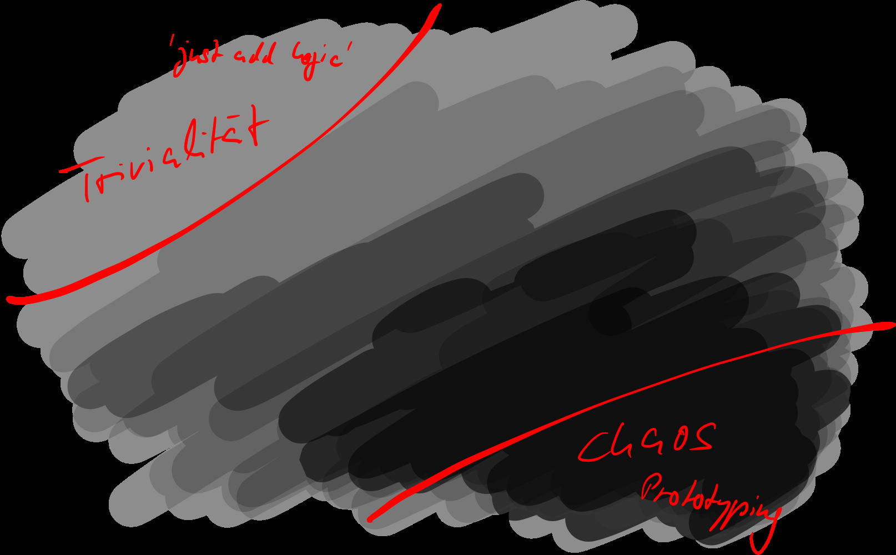

---

<!-- Page 75 of 493 -->

03-SofortcodiereninderTrivialität 66
größeren Menge von Logik liefert.
Auch in der Trivialität gilt es deshalb test-first zu codieren: zuerst
die Akzeptanztests (oder allgemeiner: die Reifetests) für das Triviale,
dann den Produktionscode.
Für eine Implementation in C# mit dem Testframework xUnit kann das so
aussehen:
1 [Theory]
2 [InlineData(new[] {1, 2, 3}, 6)]
3 [InlineData(new int[0], 0)]
4 [InlineData(new[]{3,-1}, 2)]
5 public void Sum_tests(int[] numbers, int expectedResult) {
6 Assert.Equal(expectedResult, Sum(numbers));
7 }
Alle Testfälle werden auf einmal codiert. Eine schrittweise Annäherung
wieimklassischenTest-DrivenDevelopment(TDD)üblich,istnichtnötig.
Es handelt sich ja um ein triviales Problem, dessen komplette Logik dir
bereits bekannt ist (oder zumindest “konkret vorschwebt”).
Anschließend wird dem Test dann der Produktionscode gegenübergestellt.
Der kann z.B. so aussehen
1 static int Sum(int[] numbers) {
2 var sum = 0;
3 foreach(var n in numbers) sum += n;
4 return sum;
5 }
oder so
1 static int Sum(int[] numbers) => numbers.Sum();
Vorsicht vor Selbstüberschätzung!
Was allerdings für dich ins Reich der trivialen Lösungen fällt, ist eine
persönliche Einschätzung. Ist es eine Zeile Logik oder sind es sieben?
Das Kriterium ist, dass alle Zeilen der Logik “in einem Rutsch”, d.h. ohne
Zögern und Umwege hingeschrieben werden können und die Tests sofort
erfolgreich sind. Für eine gegebene Funktion magst du das können, aber
deine Kollegin nicht. Trivialität ist sehr subjektiv. Und ob du richtig

---

<!-- Page 76 of 493 -->

03-SofortcodiereninderTrivialität 67
gelegen hast mit deiner Einschätzung, weißt du erst hinterher. Da kannst
du schon auf die Nase gefallen sein.
Natürlich sinkt die Wahrscheinlichkeit, dass eine Lösung wirklich trivial
ist mit der Zahl der Zeilen Logik, die du für nötig hältst. 1, 4, 10
Zeilen magst du im Kopf überblicken; dass eine Lösung, die du mit 50
Zeilen Logik abschätzt, jedoch als trivial eingestuft werden sollte, ist zu
bezweifeln. Entwickelnde sind zu einer realistischen Selbsteinschätzung
aufgerufen! Hier wie auch sonst im Leben gilt: “Übermut tut selten gut!”
Überschätzung bezahlst du schnell mit Frust, unerwarteten Verzögerun-
gen oder gar Bugs.
DennochistdieguteNachrichtfürdasCodieren:EsgibttrivialeProbleme.
Die solltest du nicht schwieriger denken als nötig und deshalb auch nicht
umständlicher implementieren als nötig.
Aus diesem Blickwinkel ist Codierung ohne test-first und “einfach drauf-
los” im Produktionscode meistens schlicht leichtsinnig. Die meisten Pro-
bleme sind - allemal ohne systematische Vorarbeit - eben nicht trivial. Es
ist also kein Wunder, dass es so viele Umwege, so viele Konflikte und so
viel unsauberen Code gibt. Drauflos programmierter Code, der nicht gut
funktioniert, wird mit weiterem drauflos programmiertem Code tiefer in
die Inkorrektheit, zumindest Unordnung gezogen. Diese Spirale dreht sich
unter dem Druck des Auftraggebers, schnell Verhalten zu liefern, immer
enger, je weiter präsentierter Code neben seinen Erwartungen liegt und
je näher die Deadline rückt.
Für mich sind Fehleinschätzungen von Problemschwierigkeitsgraden in
der Entwicklungspraxis an der Tagesordnung. Chaotische Situationen
werden nicht erkannt und zu häufig nimmt man an, dass etwas trivial im
hiesigen Sinn ist (und sogar nicht einmal test-first implementiert werden
sollte).
Sei ab jetzt also sensibler, bewusster, schlauer als die meisten!

---

<!-- Page 77 of 493 -->

04 - Schrittweise codieren
in der Einfachheit
Probleme, die schwieriger als trivial sind, nenne ich einfach (oder simpel).
Während dir in der Trivialität noch sonnenklar ist, wie die Logik einer
Funktion aussieht, zu der es Testfälle gibt, ist das in der Einfachheit eben
leider nicht mehr der Fall.²⁹
Trittsteine legen
In einfachen Situationen beschreiben die schon vorliegenden Testfälle,
wie eine umfassend hochqualitative Lösung sich verhalten soll. Reifetests
spannen den gesamten Problemraum auf. Das Ziel ist damit klar. Es gibt
ja Reifekriterien für die Logik, die zu codieren ist.
Darüber hinaus ist jedoch noch etwas anderes klar:
Codierung in der Einfachheit ist dadurch gekennzeichnet,
dass schrittweise schwierigere Testfälle allein aus dem
Verständnis der Anforderungen abgeleitet werden können,
ohne schon die Lösung/Logik zu kennen.
Einfach ist ein Problem also, wenn du dir deinen Weg zum Ziel mit
Trittsteinen selbst pflastern kannst.
²⁹Triviale oder einfache Probleme gehören für mich beide zur Kategorie, wo die Logik
noch naheliegend (obvious) ist. Sie zu finden, ist kein großes Ding, wenn sie auch bei
einfachenProblemennichtmehraufderHandliegtunddusiedirerarbeitenmusst.

---

<!-- Page 78 of 493 -->

04-SchrittweisecodiereninderEinfachheit 69
Das Gesamtproblem lässt sich in der Einfachheit “herunterskalieren”.
Statt einen großen Sprung machen zu müssen hin zur Logik für die
Gesamtlösung, sind inkrementelle “Baby Steps” möglich. Ein Beispiel
mag das verdeutlichen:
Überprüfung einer Zahl auf Fröhlichkeit
Eine Zahl ist fröhlich, wenn die Summe der Quadrate ihrer Ziffern
„auf die Dauer“ 1 ergibt. Näheres inkl. Beispiele bei Wikipedia.
• Funktion: bool IstFröhlich(int zahl)
• Akzeptanztestfälle:
– Input: 19, erwartetes Ergebnis: true
– Input: 4, erwartetes Ergebnis: false
https://de.wikipedia.org/wiki/Fröhliche_Zahl
Das ist wahrscheinlich für dich kein triviales Problem. Aber es ist eines,
das sich noch als einfach einstufen lässt, da sich schrittweise schwierigere
Testfälle konstruieren lassen:
1. Input: 1, erwartetes Ergebnis: true - Dieser Testfall ist einfacher

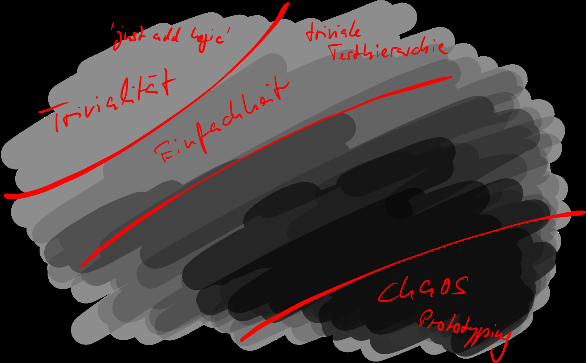

---

<!-- Page 79 of 493 -->

04-SchrittweisecodiereninderEinfachheit 70
als die 19, weil hier nur einmal eine Zahl quadriert werden muss
und schon liegt das Urteil vor. Aus 1 wird sofort 1.
2. Input: 10, erwartetes Ergebnis: true - Dieser Testfall ist ein biss-
chen schwieriger als der vorhergehende, weil es sich um zwei
Ziffern handelt, aber deren Summe sofort 1 ergibt und somit das
Urteil vorliegt. Aus 10 wird sofort 1.
3. Input: 13, erwartetes Ergebnis: true - Dieser Testfall ist wiederum
ein bisschen schwieriger als der vorhergehende, weil es nun ein
Zwischenergebnis gibt: aus 13 wird 10 und das Ergebnis für 10
wurde im vorherigen Schritt schon korrekt hergestellt.
4. Akzeptanztest, Input: 19, erwartetes Ergebnis: true - Der erste
Akzeptanztest erscheint jetzt nur noch wenig schwieriger als der
vorhergehende.HiermüssenmehrereZwischenergebnisseverarbei-
tet werden.
5. Akzeptanztest, Input:4, erwartetes Ergebnis:false - Sobald fröhli-
che Zahlen verlässlich erkannt werden können, erscheint es ein nur
kleiner Schritt, traurige Zahlen ebenfalls zu erkennen.
Jedes der Teilprobleme ist ein “vollwertiges” im Sinne der Anforde-
rungen. Logik, die eines der Teilprobleme löst, befriedigt eine echte
Untermenge der Gesamtanforderungen.
1. Mit der Logik für den ersten Testfall könnten einziffrige Zahlen, die
sofort zum abschließenden Urteil führen, überprüft werden. Dass
das nur auf die 1 zutrifft, ist Pech.
2. Mit der zusätzlichen Logik auch noch für diesen Testfall können
zwei- oder allgemeiner vielziffrige Zahlen überprüft werden, deren
SummationderQuadraturderZiffernsofortdasEndergebnisliefert.
Das sind z.B. 10, 100, 1000.
3. Mit der zusätzlichen Logik auch noch für diesen Testfall können
vielziffrigeZahlenüberprüftwerden,diemiteinemZwischenergeb-
nis zum Ergebnis führen. Dazu zählen z.B. 13, 31, 301.
4. Mit der zusätzlichen Logik dieses Testfalls können nun endlich alle
fröhlichen Zahlen erkannt werden. Was bei der Überprüfung von
traurigen geschieht, ist ungewiss.
5. Und schließlich ist nur noch etwas mehr Logik nötig, um auch die
traurigen Zahlen verlässlich zu erkennen.

---

<!-- Page 80 of 493 -->

04-SchrittweisecodiereninderEinfachheit 71
Ziel der schrittweisen Annäherung ist im Grunde die Trivialisie-
rung des Einfachen: Beim einfachen Problem ist die Logik nicht klar,
deshalb wird das Problem ausgehend von den Akzeptanztests so weit
herunterskaliert, bis klare Logik erkennbar wird. Sobald die geschrieben
und der herunterskalierte Test befriedigt ist, wird der Schwierigkeitsgrad
gesteigert.Aber nurein wenigundso weit,dassdie nunzusätzliche Logik,
umauchnoch diesenTestfallzubefriedigen,wiederum aufderHand liegt.
Und so weiter und so fort, bis auch die ursprünglichen Akzeptanztestfälle
befriedigt sind. Dann ist die Logik definitionsgemäß reif. Das Ziel wurde
schrittweise erreicht.
Einfach ist ein Problem also, wenn es sich in geschachtelte Teil-
probleme zerlegen lässt, die jedes für sich trivial im Lichte schon
existierender Logik ist.
Als geschachtelt bezeichne ich diese Teilprobleme, weil jedes ein voll-
wertiges im Sinne der Anforderungen ist; es liegt innerhalb des Rah-
mens, den das Ausgangsproblem aufspannt. Jedes Teilproblem ist für
den Auftraggeber verständlich und relevant – auch wenn es nicht sehr
realistisch/alltagsrelevant sein mag. Der Auftraggeber könnte sogar nach
jedem Testinkrement die Codierung stoppen mit der Begründung, dass es
erstmal reiche, nur eine gewisse Menge an Teilproblemen zu lösen. Die
bis dahin realisierte Logik wäre auslieferungsfähig und funktional - nur
eben in einem kleineren als dem ursprünglich gewünschten und mit den
Akzeptanztests abgesteckten Umfang.

---

<!-- Page 81 of 493 -->

04-SchrittweisecodiereninderEinfachheit 72
Die Menge der Akzeptanztests/Reifetests beschreibt das Gesamtproblem.
Und innerhalb jedes einfachen Reifetests kann es eine Hierarchie von
trivialenTeilproblemengeben,fürdiesichwiederumTestfälleformulieren
lassen, deren Lösung mit Logik auf der Hand liegt. Genauer: Wo die
Differenz zwischen der vorhandenen Logik und der für den nächsten
Testfall nötigen so klein ist, dass sie auf der Hand liegt. Wo das möglich
ist, ist das Gesamtproblem einfach. Das ist die hiesige Definition von
Einfachheit,mitderichEinfachheitausdemSubjektiven,demGefühligen
herausholen möchte.
• Trivialist, wenn du Testfällebefriedigen kannst, indem du “einfach
so” Logik im Produktionscode schreibst. Schaffst du das nicht, ist
das Problem schlicht nicht trivial - im Sinne der hiesigen Definition.
• Einfach ist, wenn du Testfälle nicht “einfach so” mit Logik befriedi-
gen, aber ihnen eine Hierarchie von trivialen Testfällen “einschrei-
ben” kannst. Schaffst du das nicht, ist das Problem schlicht nicht
einfach - im Sinne der hiesigen Definition.
Ob du die (in ihrer Differenz!) trivialen Testfälle alle vor dem Beginn der
Codierung der Produktionslogik bestimmst bzw. bestimmen kannst oder
obsiesicherstnachundnachergeben,istfürdengrundsätzlichenSchwie-
rigkeitsgraddesGesamtproblemsunerheblich.InkrementellsindTestfälle,

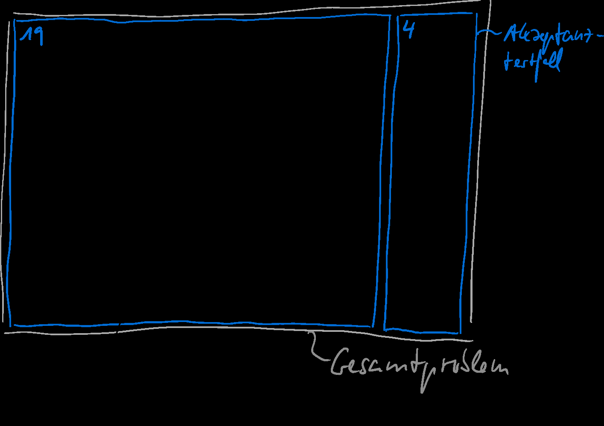

---

<!-- Page 82 of 493 -->

04-SchrittweisecodiereninderEinfachheit 73
wennsieeinestrengeTotalordnung³⁰inBezugaufdenSchwierigkeitsgrad
darstellen.
Allerdingsscheint mir dieEinstufung eines Problemsalseinfach riskanter,
wenndieZerlegungindietrivialeTestfallhierarchienichtschonzuBeginn
möglich ist.
Pear Programming
EinfacheProblemehabennocheineNebenbedingung.Dieistdirvielleicht
nicht aufgefallen, sie scheint ja auch so natürlich:
Die Logik zur Lösung einfacher Probleme wird nur durch
die im Modell definierte Funktion getestet.
BeieinfachenProblemensindalleTestsabhängigvonder“Wurzelfunktion”,diediekomplet-
teLösungrepräsentiert
Alle Tests, die pauschalen Reifetests wie die inkrementellen Tests, liegen
an derselben ursprünglichen Funktion an; im Beispiel oben wäre das
IstFröhlich(). Ob darunter weitere Funktionen schon existieren oder
während der Codierung durch Extraktion von Logik entstehen (Refaktori-
sierung), hat darauf keinen Einfluss.
Mankönntealsosagen,dieLogikwächstandenAnforderungen,diedurch
den “Flaschenhals” der Funktionssignatur einfließen. Sie ähnelt damit
³⁰https://de.wikipedia.org/wiki/Ordnungsrelation#Strenge_Totalordnung

---

<!-- Page 83 of 493 -->

04-SchrittweisecodiereninderEinfachheit 74
einer Williams-Christ-Birne³¹, die in einer Flasche reift. Die Codierung
der Logik zu einfachen Anforderungen ließe sich also bildlich als “pear
programming” beschreiben.³²
Unnötig zu sagen, dass dabei selbstverständlich der
Testcode dem Produktionscode vorhergeht. Auch ein-
fache Probleme werden test-first codiert.
Die
Kunst der Problemskalierung
Wie kommst du nun aber von einigen umfassenden
Reifetests zu vielen kleinen inkrementellen Tests? Der
Weg von einem schwierigen Problem zu einer Menge
von weniger schwierigen, gar in ihrer Differenz trivia-
len Problemen führt über die Steuerung der abgedeckten Variationsbreite.
Variationen innerhalb eines Gesamtproblems sind möglich
• in der Vielgestaltigkeit (Kategorien) und
• in der Menge.
Das Beispiel der fröhlichen Zahlen zeigt beide Seiten:
• Schon im Ansatz ist das Gesamtproblem geteilt in zwei Testfälle,
die für grundsätzlich verschiedene Situationen stehen: Kategorie A)
eine Zahl ist fröhlich und Kategorie B) eine Zahl ist traurig. Das
Ausgangsproblem ist also vielgestaltig.
• Und auf der Seite der fröhlichen Zahlen wachsen die Testfälle im
Hinblick auf zwei Mengen:
– von außen erkennbar: die Menge der Ziffern in der zu katego-
risierenden Zahl
– vonaußen nicht erkennbar: die Menge der Iterationen, die zur
Kategorisierung nötig sind.
³¹https://de.wikipedia.org/wiki/Williams_Christ
³²Bildquelle:Wikipedia

---

<!-- Page 84 of 493 -->

04-SchrittweisecodiereninderEinfachheit 75
Das Gesamtproblem wird also durch drei Dimensionen aufgespannt:
Kategorie, Ziffernzahl und Iterationenzahl.
Das erste Testinkrement konzentriert sich auf die Menge der fröhlichen
Zahlen und in der Menge auf die, die nur aus einer Ziffer bestehen, und
in der Menge auf die, die ohne Iteration zum Ergebnis führen.
Das zweite Inkrement erweitert die abgedeckte Menge der Problemsi-
tuationen etwas: nun werden auch mehrziffrig fröhliche mit nur einer
Iteration erkannt.
Das dritte Inkrement erweitert die abgedeckte Menge wiederum usw. usf.

---

<!-- Page 85 of 493 -->

04-SchrittweisecodiereninderEinfachheit 76
Die Kunst der Problemskalierung besteht darin, die Di-
mensionen zu erkennen, in denen Variationen stattfinden
können.
Sichtbarkeit von Variationsdimensionen
Einfach ist ein Problem lt. obiger Definition, wenn die Variationsdimen-
sionen “von außen”, d.h. ohne Kenntnis der Logik sichtbar sind. Das ist
für das Problem der fröhlichen Zahlen nicht komplett der Fall. Nur die
Dimensionen Kategorie und Ziffernzahl lassen sich an den Testfällen
ablesen. Darauf beschränkt könnten die Inkremente

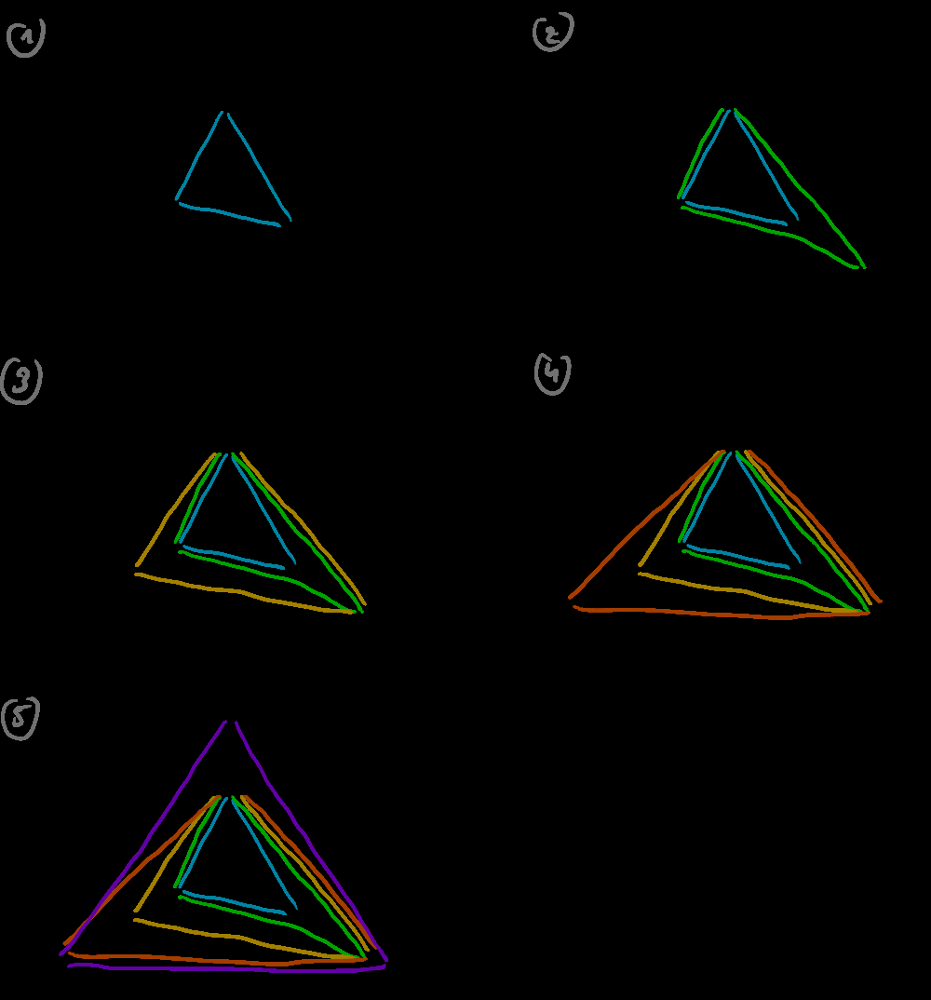

---

<!-- Page 86 of 493 -->

04-SchrittweisecodiereninderEinfachheit 77
• 1 → true, 10 → true
nicht von diesen unterschieden werden:
• 1 → true, 13 → true
Formal steigt der Schwierigkeitsgrad bei beiden in gleicher Weise an.
In der Codierung jedoch macht es einen Unterschied. Die Differenz der
Schwierigkeitsgrade zwischen dem ersten Inkrementpaar ist geringer als
die zwischen dem zweiten.
Das mag in diesem Fall nicht so gravierend sein - in realen Projekten
jedoch kann das zu unerwarteten Verzögerungen, also Unzuverlässigkeit
führen und Qualitätsmängel begünstigen.
Die Dimension Iterationenzahl wird erst sichtbar, wenn du dir Gedanken
über einen Lösungsansatz machst. (Erinnerst du dich noch daran, in wel-
cher Phase der Anforderung-Logik Lücke ein Lösungsansatz entwickelt
wird?)
Für das Problem der fröhlichen Zahlen ist der Lösungsansatz zum Glück
ebenfallsoffensichtlich,weilerzurDefinitiongehört.HiereinBeispielaus
dem Wikipedia-Artikel³³:
Dass es Iterationen gibt, d.h. die Summation der Quadratur der Ziffern
mehrfach nötig sein kann, ist Teil der Erläuterungen der Anforderungen.
Dass alle Variationsdimensionen offenliegen, ist also nicht immer der
Fall. Darauf musst du vorbereitet sein, wenn du ein Problem als einfach
einstufen willst. Die Analyse der Daten und eines ggf. vorhandenen
Lösungsansatzes solltest du sorgfältig betreiben. Die Fragen an beide
lauten:
• Was kann in der Vielfalt wachsen?
• Was kann in der Menge wachsen?
³³https://de.wikipedia.org/wiki/Fröhliche_Zahl

---

<!-- Page 87 of 493 -->

04-SchrittweisecodiereninderEinfachheit 78
Im Code spiegeln sich die Antworten darauf in Kontrollstrukturen und
Datenstrukturen wider:
• Vielfalt wird repräsentiert durch
– Daten: Strukturen (z.B. struct, Tupel, Parameterliste der
Funktion), die aus verschiedenen Teilen zusammengesetzt
sind, oder Enumerationen (z.B. bool, enum)
– Logik: Fallunterscheidungen (z.B. if, switch)
• Mengen werden repräsentiert durch
– Daten: Arrays, Listen, Iteratoren, d.h. Datenstrukturen, die
aus gleichen Teilen bestehen
– Logik: Schleifen (insb. for, aber auch Rekursion)
SolangeeinLösungsansatznochimDunkelnliegt,sinddieStrukturenvon
DatendieeinzigeQuellefürHinweiseaufVariationen.Zubetrachtensind:
• Angelieferte Daten (Input), d.h. die Daten, die die zu entwickelnde
Funktion verarbeiten muss.
• Ergebnis (Output), d.h. die Daten, die die zu entwickelnde Funktion
liefern soll.
• Zustand (State), d.h. die Daten, die die zu entwickelnde Funktion
unabhängig vom Input berücksichtigen muss.
Das Problem der fröhlichen Zahlen ist in dieser Hinsicht leider nicht sehr
ergiebig, wie oben schon gezeigt: Der Input hat einen Mengenbereich, er
kann aus einer oder mehreren Ziffern bestehen. Der Output hat eine sehr
geringe Variationsbreite. Zustand gibt es nicht.
Es ist möglich, allein aufgrund der durch Daten(struktur)analyse gefunde-
nenDimensioneneinProblemalseinfacheinzustufenundesinkrementell
zu codieren. Dabei kann es passieren, dass sich weitere Dimensionen
“unterwegs ergeben” - das ist dann ein Glücksfall. Es kann aber auch pas-
sieren, dass der Sprung im Schwierigkeitsgrad vom einen zum nächsten
Inkrement nicht mehr trivial ist - das wäre ein unschöner Konflikt.

---

<!-- Page 88 of 493 -->

04-SchrittweisecodiereninderEinfachheit 79
Variationen ordnen
Wenn du die Dimensionen der Variationenvielfalt eines Problems gefun-
den hast, dann stellt sich die Frage, welche Werte sie enthalten, welche
relevanten Variationen sie jeweils für sich darstellen. Und vor allem:
Wie können diese Werte in eine Ordnung gebracht werden, so dass sich
inkrementelle Testfälle von aufsteigendem Schwierigkeitsgrad definieren
lassen.
Der erste Testfall soll ja nur einen kleinen Teil des Gesamtproblems abde-
cken. Der nächst schwierigere noch ein bisschen mehr vom Problem - und
alle zusammen am Ende die komplette “Fläche” des Ausgangsproblems
mit all seinen Variationen.
Mengendimensionen
Bei einer Mengendimension liegt es nahe, sich von kleinen zu großen
Zahlen vorzuarbeiten. Die Schritte könnten sein:
• 0, leere Menge
• 1
• 2
• viele
VielleichtistdabeidieleereMengesogareinSonderfall,derauchamEnde
behandelt werden könnte.
Indem inkrementelle Testfälle die Mengenanforderung schrittweise stei-
gern, kann sich die Logik langsam entwickeln:
• Vielleicht fehlt für eine leere Menge jede Logik in der Dimension.

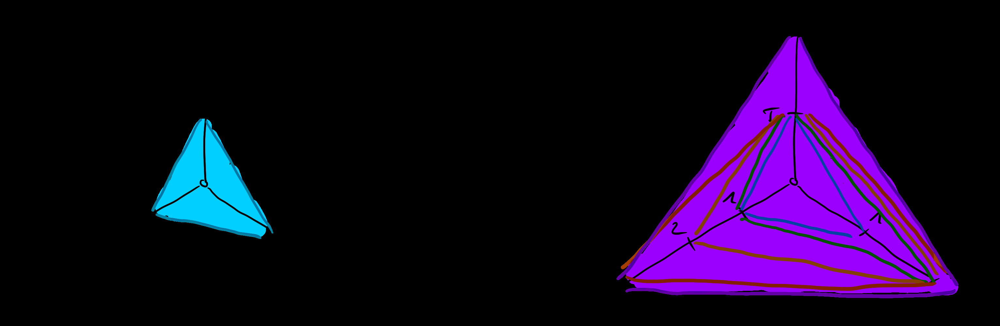

---

<!-- Page 89 of 493 -->

04-SchrittweisecodiereninderEinfachheit 80
• Bei der Menge 1 (genauer: 0 oder 1) wird die nötige Logik das erste
Mal ausgeschrieben.
• Bei der Menge 2 (genauer: 0 oder 1 oder 2) wird die nötige Logik
vielleicht nur in doppelter Ausführung mit kleiner Variation zur
Unterscheidung von 1 und 2 ausgeschrieben.
• Erst ab einer größeren Menge wird vielleicht eine Schleife einge-
führt, um die Dopplung von Logik zu eliminieren.
• Oder es kommt alternativ Rekursion zum Einsatz, falls das eine
natürlichere Herangehensweise zur Problemlösung darstellt.
ParallelzurschrittweisenWandlungderLogikkönnensichDaten(strukturen)
entwickeln. Den Anfang kann die Nutzung von “magischen Konstanten”
machen, die in benannte Konstanten überführt werden, die sich in Va-
riablen wandeln, deren Werte schließlich von außen konfigurierbar sind.
Und einzelne Werte können in Arrays fixer Länge wandern, die sich
in variable Listen wandeln, welche zu Iteratoren unbekannten Umfangs
mutieren.³⁴
Hinter dieser Form des Wachstums steckt die Idee, dass es weniger
schwierig ist, zunächst etwas nur einmal zu tun, statt häufiger, und dass
es auch weniger schwierig ist, zunächst genau zu wissen, wie oft etwas zu
tun ist, als auf eine unbekannte Anzahl reagieren zu müssen:
1. selten, feste Menge
2. selten, variable Menge
3. häufig, variable Menge
Ob die Schritte dabei 0,1,2,3,n sind oder 0,1,n oder 1,n ist weniger wichtig.
Es geht ums Prinzip, dass die Menge einen Unterschied macht und du
durch Steuerung der Erwartung an eine Menge deine Testfälle mehr oder
weniger schwierig gestalten kannst.
Im Falle der fröhlichen Zahlen scheint die Zahl der Ziffern weniger
kritisch und springt daher von 1 auf n, als die Zahl der Iterationen.
ZumindestinderTheorie,denninderPraxiskannsichherausstellen,dass
auch die Iterationen so einfach zu realisieren sind, dass von 1 auf n erhöht
werden kann.
³⁴Mehrzudiesen“Mutationen”vonInkrementzuInkrementbeiRobertC.Martinunter
demStichwortTransformationPriorityPremise.

---

<!-- Page 90 of 493 -->

04-SchrittweisecodiereninderEinfachheit 81
Kategoriendimensionen
Mengen haben eine natürliche Ordnung: kleinere sind (wahrscheinlich)
einfacher zu handhaben als größere. Bei Alternativen/Kategorien hinge-
gen, ist es nicht so einfach, eine Ordnung zu definieren. Ist es leichter,
fröhliche Zahlen festzustellen oder traurige? Ohne Kenntnis eines Lö-
sungsansatzes kannst du das kaum entscheiden.
Nur eines scheint auf der Hand zu liegen: weniger Optionen ist weniger
schwierig als viele. Überhaupt Optionen zu erkennen und sie Test für Test
zu trennen, ist also ein wesentlicher Schritt voran.
Kategorisierung findet im Code durch Fallunterscheidungen mit if oder
switch statt. Sollte deshalb jeder Term einer Bedingung darin einen
eigenen Testfall bekommen? Nein. Um die Logik-Entwicklung zu triviali-
sieren, geht es vor allem erstmal darum, “die offensichtlichen” Kategorien
zu identifiziert, zu benennen und von einander zu trennen. Offensichtlich
sind z.B. die Kategorien fröhlich und traurig im obigen Beispiel; sie
lassen sich aus den Datenstrukturen für Input/Output (und ggf. Zustand)
herauslesen.
Kategorien zu erkennen ist besser, als sie nicht zu erkennen. Allerdings
kann es dir auch passieren, dass du zwei Kategorien unterscheidest – und
sich beim Test für die zweite herausstellt, dass du zu dessen Befriedigung
keine weitere Logik hinzufügen musst. Der Fall kann auch bei einer lang-
samen Mengensteigerung eintreten. Aus welchen Gründen auch immer
gehören dann zwei Tests zur selben Äquivalenzklasse.
Das ist kein Beinbruch, wenn auch vielleicht etwas frustrierend. Aber du
kannst es positiv ummünzen zu einem Anlass zur Reflexion: Wie konnte
es dazu kommen, dass du zwei Fälle “in der Theorie” so unterschiedlich
bewertet hast, wo sie in der Praxis doch keinen Unterschied zu machen
scheinen? Lag ein geringeres als angenommenes Verständnis der Anforde-
rungen vor? Oder ist die Logik bei der Implementation der Lösung für den
ersten Testfall über das Ziel hinausgeschossen? Oder gibt es immer noch
ein potenzielles Missverständnis, dass mit dem Auftraggeber zu klären
wäre?
Umgekehrt kann es sein, dass der Schritt von einer Kategorie zur nächs-
ten größer ist als du es in deiner Theorie vorausgesehen hattest. Du
kannst dich bei der Schwierigkeitsdifferenz zwischen Inkrementen in

---

<!-- Page 91 of 493 -->

04-SchrittweisecodiereninderEinfachheit 82
beide Richtungen verschätzen! Wenn widererwarten die Logik für ein
Inkrement nicht trivial ist, tritt einen Schritt zurück und frage dich, ob du
es noch weiter verkleinern kannstoder zuerst in einer anderen Dimension
vorangehen solltest - oder ob das Gesamtproblem vielleicht doch nicht
einfach ist.
Am Beispiel
“The proof is in the pudding”, heißt es. Was ich dir hier vorgestellt habe
anhand des Problems der fröhlichen Zahlen ist theoretisch schön und gut
- aber funktioniert es auch? Wie sieht das aus, wenn du danach vorgehst?
Ich will dir deshalb eine Implementation in Test-Produktionscode oder
red-green Schritten nicht vorenthalten.
Akzeptanztest
Zuerst die Akzeptanztests. Ich lege sie als datengetriebene Tests aus,
deshalb die Attribute über der Testmethode mit den Input- und Output-
Werten:
1 [Theory]
2 [InlineData(19,true)]
3 [InlineData(4,false)]
4 public void Akzeptanztests(int zahl, bool expected)
5 {
6 zahl.IstFröhlich().Should().Be(expected);
7 }
Ihnen gegenüber steht zunächst eine “leere” Produktionscode-Methode:
1 class Stimmungsbarometer {
2 public static bool IstFröhlich(this int zahl) {
3 throw new NotImplementedException();
4 }
5 }
Die Methode lege ich als sog. extension method aus, d.h. sie erweitert
(scheinbar) den Typ int, so dass sie als Methode auf einer Zahl aufgerufen
werden kann, z.B. 42.IstFröhlich(). Das geht in einigen Sprachen,
z.B. auch Kotlin, aber in vielen nicht. Wenn deine Sprache das nicht
hergibt, dann kann so eine Funktion natürlich auch gewöhnlich benutzt
werden, hier z.B. so Stimmungsbarometer.IstFröhlich(42).

---

<!-- Page 92 of 493 -->

04-SchrittweisecodiereninderEinfachheit 83
Testinkrement 1
Der Akzeptanztest ist die Latte,über die der Produktionscode irgendwann
springen soll. Aber das will geübt sein. Darauf soll er sich in kleinen
Schritten vorbereiten. Jetzt definiere einen ersten inkrementellen Test,
der natürlich angesichts der bisherigen Logik in der Produktionscode-
Funktion rot ist.
1 [Fact]
2 public void Eine_Ziffer_keine_Summation() {
3 1.IstFröhlich().Should().Be(true);
4 }
Wie kann der Test “begrünt werden”? Was ist die einfachste Logik? Ich
wähle diese:
1 public static bool IstFröhlich(this int zahl) {
2 if (zahl == 1) return true;
3 return false;
4 }
Es ginge noch einfacher, z.B. mit return true;, doch diese Art “dege-
nerierter Antwort” mag ich nicht. Damit würde ich einer Problemlösung
ausweichen.Ichkönnteesvielleichtsoformulieren:Ichziehedieeinfachs-
te und halbwegs realistische Logik vor.
Das ist hier der Fall, weil ich den Input-Wert benutze und darauf eine
relevante Prüfung durchführe.
Testinkrement 2
Nach einem grünen Test der nächste, ein kleinwenig herausforderndere
rote Test:
1 [Fact]
2 public void Zwei_Ziffern_eine_Summation() {
3 10.IstFröhlich().Should().Be(true);
4 }
Jetzt muss die Logik schon etwas mehr tun. Zwei Ziffern sind zu betrach-
ten, so dass auch eine Summation von Quadraten dazu kommt.

---

<!-- Page 93 of 493 -->

04-SchrittweisecodiereninderEinfachheit 84
1 public static bool IstFröhlich(this int zahl) {
2 var ziffer = zahl % 10;
3 var quadrat = ziffer * ziffer;
4 var summe = quadrat;
5
6 zahl = zahl / 10;
7 ziffer = zahl % 10;
8 quadrat = ziffer * ziffer;
9 summe += quadrat;
10
11 return summe == 1;
12 }
Ich bemühe mich, den Code simpel zu halten, indem ich noch keine
Schleifeeinführe,sondernerstmalschaue,wasdaeigentlichgetanwerden
muss,wennaufeinzelneZiffernzuschauenist:eineZiffermussbestimmt
werden und dann die nächste in der Zahl.³⁵
Testinkrement 3
Im 3. Inkrement wird die Schraube wieder etwas fester angezogen. Nicht
mehr Ziffern, aber intern braucht es jetzt “zwei Runden”, um das Ergebnis
zu bestimmen:
1 [Fact]
2 public void Zwei_Ziffern_zwei_Summationen() {
3 13.IstFröhlich().Should().Be(true);
4 }
GlücklicherweisekommtmirdieIdee,dasProblemmiteinerRekursionzu
lösen. Eine Schleife hätte es auch getan, aber irgendwie habe ich gedacht,
dass ich am Ende, falls summe nicht schon 1 ist, einfach nur nochmal
dasselbe tun müsste. Also rufe ist die Funktion aus sich heraus auf der
noch ungenügenden Summe als neue Ausgangszahl auf.
³⁵Das tue ich mathematisch, aber ich hätte auch den Umweg über eine String-
Repräsentation der Zahl wählen können. Das ist wohl eine Geschmackssache - oder hier
eineSachederDidaktik.DennbeidemString-Ansatzwäreichindiemap-reduceBibliothek
von C# reingerutscht (Linq), die Abstraktionen bietet, die in vielen anderen Sprachen nicht
(soeinfach)zurVerfühgungstehen.DashättesichbeidiesemBeispieleinwenigwieMogelei
angefühlt.

---

<!-- Page 94 of 493 -->

04-SchrittweisecodiereninderEinfachheit 85
1 public static bool IstFröhlich(this int zahl) {
2 var ziffer = zahl % 10;
3 var quadrat = ziffer * ziffer;
4 var summe = quadrat;
5
6 zahl = zahl / 10;
7 ziffer = zahl % 10;
8 quadrat = ziffer * ziffer;
9 summe += quadrat;
10
11 if (summe == 1) return true;
12 return summe.IstFröhlich();
13 }
Mit so einer simplen Lösung habe ich nicht gerechnet, als ich oben die
Testfälle erarbeitet habe. Ein glücklicher Zufall.
Testinkrement 3.1
Eigentlich wäre jetzt der erste Akzeptanztest (19) als nächstes Inkre-
ment dran. Die Steigerung bestünde darin, dass mehrere Quadratur-
/Summation-Runden zu drehen wären. Aber jetzt, da ich meine Lösung
sehe, fühle ich mich mit diesem Sprung nicht wohl. Weiß ich, ob während
dieser Runden nicht vielleicht Zwischenlösungen mit mehr als zwei
Ziffern entstehen? Überhaupt sollte ich mal die Ziffernbehandlung von
Duplikaten befreien und dabei verallgemeinern. Ich stelle also fest, dass
ich in meinem Testinkrementplan einen Test vergessen habe: einen für
mehr als zwei Ziffern und unbestimmt viele Zwischenschritte.
1 [Fact]
2 public void Drei_Ziffern_zwei_Summationen() {
3 103.IstFröhlich().Should().Be(true);
4 }
BeidiesemTestseheichvorallem,dassesgleichamAnfangmitmehreren
Ziffern losgeht. Und ich kann überblicken, dass es nur zwei Schritte sein
werden (falls das noch wichtig sein sollte).
Die Schleife zur Behandlung mehrerer Ziffern ist natürlich schnell ge-
macht. Für sich genommen also wieder ein trivialer Schritt.

---

<!-- Page 95 of 493 -->

04-SchrittweisecodiereninderEinfachheit 86
1 public static bool IstFröhlich(this int zahl) {
2 var summe = 0;
3 while (zahl > 0) {
4 var ziffer = zahl % 10;
5 var quadrat = ziffer * ziffer;
6 summe += quadrat;
7
8 zahl /= 10;
9 }
10
11 return summe == 1 || summe.IstFröhlich();
12 }
Jetzt fühle ich mich sicherer für das Akzeptanztest-Inkrement.
Testinkrement 4
Und schon wieder habe ich Glück! Der Akzeptanztest für die19 ist bereits
grün. Ich muss nichts weiter tun. Irgendwo habe ich “zuviel” gemacht im
Sinne des KISS-Prinzips (Keep It Simple, Stupid³⁶).
Natürlich weiß ich, wo das passiert ist: bei der Rekursion. Die war nicht
auf zwei Zwischenschritte begrenzt, sondern ganz allgemein (solange die
Zwischenergebnisse auch nur zwei Ziffern hatten).
Aber warum hätte ich mich da beschränken sollen? Die Logik lag zu sehr
auf der Hand. Das Problem war trivial. So habe ich Glück gehabt - aber
ich hätte auch Pech haben können. Dann hätte ich das ebenfalls später
bemerkt. Das wäre nicht schlimm gewesen.
Jedenfalls ist die erste Latte übersprungen.
Testinkrement 5
Zum Abschluss der Akzeptanztest für die 4. Der ist noch nicht “einfach
so” grün geworden. Im Gegenteil: er ist nicht einmal rot, sondern führt zu
einer nicht enden wollenden Rekursion. Arrghhh!
Doch auch hier ist die Logik-Differenz, die ich einbringen muss, trivial.
Die Regel für die Erkennung von traurigen Zahlen ist schlicht: Wenn
bei den Zwischenschritten eine Zahl auftaucht, die schonmal bearbeitet
wurde, liegt ein Zyklus und damit eine traurige Zahl vor.
Mein Lösungsansatz dafür ist, dass sich die Rekursion merkt, welche
Zahlen schon behandelt wurden. Dazu wird eine Liste mit übergeben.
³⁶https://en.wikipedia.org/wiki/KISS_principle

---

<!-- Page 96 of 493 -->

04-SchrittweisecodiereninderEinfachheit 87
Die ist am Anfang leer und wird bei jedem Aufruf um die anliegende
Zahl erweitert. Dadurch gibt es am Anfang eine Indirektion: die API-
Funktion ruft eine “Hilfsfunktion” auf, die die Arbeit leistet und die Liste
als Parameter hat. So ist der bei Clients nicht zu sehen.
1 public static bool IstFröhlich(this int zahl)
2 => IstFröhlich(zahl, new HashSet<int>());
3
4 private static bool IstFröhlich(int zahl, HashSet<int> schonGeprüft) {
5 if (zahl == 1) return true;
6 if (schonGeprüft.Contains(zahl)) return false;
7 schonGeprüft.Add(zahl);
8
9 var summe = 0;
10 while (zahl > 0) {
11 var ziffer = zahl % 10;
12 var quadrat = ziffer * ziffer;
13 summe += quadrat;
14
15 zahl /= 10;
16 }
17
18 return IstFröhlich(summe, schonGeprüft);
19 }
Die Logik ist im Wesentlichen gleich geblieben. Aber ich habe die Prüfun-
gen alle nach vorn gezogen, so dass sie dort einen “Abbruch-Block” bilden.
Die Rekusion läuft damit zwar eine Runde zu weit, aber das macht nichts
für die Performance. Ich denke, es ist so einfacher zu verstehen.
Damit ist die zweite Latte auch übersprungen.
Reflexion
Daswareinfach.DerPlanistaufgegangen.Logik,dieichamAnfangnicht
hättehinschreibenkönnen,beiderichmich“durchgewurschtelt”hätte,ist
durch die inkrementellen Testfälle Schritt für Schritt trivial gewesen.
Etwas Nachdenken am Anfang hat nicht geschadet, sondern die Sache
beflügelt.
Dass ich dann unterwegs vom Plan angewichen bin, ist nicht schlimm. Er
hat mich geleitet, ohne mich zu zwingen. So soll es sein mit Plänen. Es
geht nicht um Einhaltung, sondern einen flüssigen Weg zum Ergebnis.
AndemCodeließesichnunnochetwassäubern.Dochdasisthiererstmal
noch nicht das Thema. Dafür sollst du im nächsten Kapitel erst noch ein
wichtiges Prinzip kennenlernen.

---

<!-- Page 97 of 493 -->

04-SchrittweisecodiereninderEinfachheit 88
Zusammenfassung
Probleme sind einfach, wenn sich ohne (nähere) Kenntnis eines Lösungs-
ansatzes inkrementelle Testfälle aus den Anforderungen ableiten und
in eine “aufsteigende Ordnung” bringen lassen, so dass die Lösung des
jeweils nächsten Testfalls trivial ist.
Dukannstallerdingsnichterwarten,dassalleProblemtrivialodereinfach
sind. Es mir also ausdrücklich nicht darum, dir zu empfehlen, alle
Codierungsprobleme mit inkrementellen Tests anzugehen!
Sei sensibel! Wenn dir nicht relativ zügig hilfreiche Testinkremente einfal-
len, um die Logik schrittweise auf das geforderte Niveau zu heben, dann
ist das Problem eben nicht einfach. Das ist kein Beinbruch, hänge dich
also nicht zu sehr an dieses Vorgehen. Es ist nur eines von mehreren, das
du in deinem Methodenköcher haben solltest.
Zu diesem Problemlösungsansatz ließe sich auch noch einiges aus der
Sicht des classical³⁷ Test-Driven Development (cTDD)³⁸ sagen, dem es
nahesteht. Was ist denn mit der Refaktorisierung? Von den cTDD Schrit-
ten red-green-refactor wurden nur zwei durchlaufen. Ist das zulässig oder
fahrlässig?
Diese Fragen sollen sich jedoch im weiteren Verlauf der Darstellung von
selbst beantworten. An dieser Stelle möchte ich deshalb nochmal betonen:
Inkrementelles Vorgehen ist nur eine Methode für einfache Probleme.
Das, was schwieriger als einfach ist, solltest du anders angehen!
³⁷“Classical”nenneichhierdas TDD,vondemduwahrscheinlichschongehörthast;es
istdasursprüngliche,dasweithinbekannte.AberauchwennesvonagilenEntwicklernund
SoftwareCraftsmenstarkpropagiertwird,seheichseinenNutzenrechtbegrenzt.Darinliegt
ein Grund für dieses Buch. cTDD ist für meinen Geschmack zu pauschal in seiner Heran-
gehensweise an Codierungsprobleme.Es betrachtet Schwierigkeitsgradenicht systematisch
und lässt einen Entwurf ganz außer Acht. Selbst wenn es inzwischen um cTDD herum
verschiedeneSchulen/Stilrichtungengibt,herrschtnocheinfürmichdeutlichesDefizit.Mir
fehlt eine Guidance, wie ich sie dir hier vermitteln möchte. Mehr zu meiner Motivation
findest du auch unter dem Stichwort Hamburg Style TDD in meinem Blog. Zurest habe
ich mein Vorgehen “TDD 2.0” in Anlehnung an cTDD genannt. Doch der Gewinn an
AnschlussfähigkeitwarmiramEndezugeringimVergleichzumKonfliktpotenzial,dasdarin
steckt, weil cTDD beim hier gesagten nur einen kleinen Teil einnimmt. Der gemeinsame
NenneristamEndeebendietest-first Heransgehensweisegeworden.
³⁸https://en.wikipedia.org/wiki/Test-driven_development

---

<!-- Page 98 of 493 -->

04-SchrittweisecodiereninderEinfachheit 89
Übungsaufgaben
Reflexionsaufgabe
Bitte formuliere eine Frage oder eine Erkenntnis zum Kapiteltext.
• Wo bist du gedanklich hängengeblieben, was ist dir unklar,
was passt für dich irgendwie nicht zusammen, wozu würdest
du dir noch etwas mehr Erklärung wünschen? Steht irgendet-
waszudeinerbisherigenPraxisimWiderspruchunddufragst
dich, warum du etwas ändern solltest?
• Oder: Wann hast du einen Aha-Moment gehabt, was ist
diralsbemerkenswert,spannend,ausprobierenswertaufgefal-
len? Hat irgendetwas “in dir Klick gemacht”, weil dir nun ein
Zusammenhang aufgegangen ist? Oder verstehst du jetzt aus
deiner bisherigen Praxis irgendetwas besser?
Am besten formulierst du Frage bzw. Erkenntnis schriftlich. Indem
du deine Gedanken aufschreibst, wirst du dir ihrer bewusster. Bei
einer Frage kommst du dadurch vielleicht schon einer Antwort aus
dir selbst heraus näher. Bei einer Erkenntnis fällt dir vielleicht schon
etwas ein, das du ab jetzt anders machen kannst.
Aufgabe 1
Geschätzte Bearbeitungsdauer: 15min
Klassifiziere folgende Problemstellungen als trivial, einfach oder
chaotisch. Denke dich einen Moment ein in die Problemstellungen
mit möglichen Lösungsansätzen, aber löse die Probleme nicht voll-
ständig. Es geht ja darum, ohne Lösung ein Gefühl für unterschiedli-
che Schwierigkeitsgrade zu bekommen:
• Berechne das Ergebnis eines einfachen mathematischen Aus-
drucks, der positive ganze Zahlen und die Operatoren +, -,

---

<!-- Page 99 of 493 -->

04-SchrittweisecodiereninderEinfachheit 90
*, /enthaltenkann,z.B."2 + 30 * 400".Esgeltenkeine
Operatorpräzedenzen, so dass das Ergebnis für das Beispiel
12800 ist.
• Bestimme die nächste Generation für die “Lebewesen” in
einem Game-of-Life, bei dem “die Welt” durch bool[,]
repräsentiert ist.
• Finde eine Lösung für das NQueen-Problem: Für ein gegebe-
nes N (1..20) platziere N Damen auf einem NxN Schachbrett
so, dass sie sich nicht gegenseitig schlagen können.
• Wandle eine Binärzahl in ihr dezimales Äquivalent um, z.B.
würde 13 der Binärzahl 1101 entsprechen.
https://en.wikipedia.org/wiki/Conway’s_Game_of_Life
https://en.wikipedia.org/wiki/Eight_queens_puzzle
Aufgabe 2
Anforderungen
Wandle eine römische Zahl in ihre dezimales Äquivalent um, z.B.
würde aus MCMLXXXIV die Dezimalzahl 1984.
Die Funktion wird nur mit gültigen römischen Zahlen aufgerufen.
TODO: Dokumentiere dein Verständnis
Geschätzte Bearbeitungsdauer: 10min
1. Der erste Akzeptanztest steckt in der Anforderungsbeschrei-
bung. Finde für einen zweiten Akzeptanztest die römische
Zahl zur Dezimalzahl 1492.
2. Überlege dir eine Signatur für die Funktion, die das Problem
löst.
TODO: Inkrementelle Codierung

---

<!-- Page 100 of 493 -->

04-SchrittweisecodiereninderEinfachheit 91
Ichnehmemalan,dassdudasProblemnichtfürtrivialhältstunddie
Logik“einfachso”hinschreibst.AndererseitssinddieAnforderungen
klar, so dass das Problem nicht chaotisch ist.
1. Testfälle finden
Geschätzte Bearbeitungsdauer: 15min
Fasse das Problem daher als einfach auf. Finde eine Reihe von inkre-
mentellen Tests, die schwieriger und schwieriger werden. Überlege,
ob und welche Variationsdimensionen es gibt.
2. Test-first codieren
Geschätzte Bearbeitungsdauer: 30min
Implementiere dann wie folgt:
1. Codiere die Akzeptanztests und lege dabei die Produktion-
funktion mit ihrer Signatur leer an.
2. Codiere den ersten inkrementellen Test.
3. Codiere die Logik in der Produktionsfunktion, um den inkre-
mentellen Test zu befriedigen.
4. Codiere den nächsten inkrementellen Test und danach die
nötige Produktionslogik.
5. FahreindiesemRhythmusfort,bisdieFunktionreifimSinne
der Akzeptanztests ist.
Gehe also wieder test-first vor. Schreibe aber nicht zuerst alle Tests
hin, sondern wechsle Tests und Produktionscode ab. Nur die Akzep-
tanztests legst du dir einmal zu Anfang als Latte auf, über die du
ultimativ springen willst.
Gehe also im Sinne der üblichen Testwerkzeuge im red-green Wech-
sel vor. cTDD fordert dich nach green zwar noch auf, über eine
Refaktorisierung nachzudenken, doch das ist jetzt noch nicht das
Thema.
Versuche beim Codieren nach jedem Schritt an ein Commit auf
deinem Code-Repository zu denken. Wenn du willst, lege für die
ÜbungeinenpersönlichenBranchan,sodassimReviewdieCommits
sichtbar bleiben, auch wenn andere auf dem Repository gearbeitet
haben sollten.

---

<!-- Page 101 of 493 -->

04-SchrittweisecodiereninderEinfachheit 92

---

<!-- Page 102 of 493 -->

05 - Komplementär
codieren in der
Kompliziertheit
„Usefulthinkingmustalwaysprecedeusefulaction.“,Stephen
King
Triviale und einfache Probleme werden beide in der Kategorie Nahelie-
gendes zusammengefasst. Die Lösung in Form von Logik liegt entweder
sofort auf der Hand oder kann schrittweise “durch den Flaschenhals”
der einen anliegenden Funktion entwickelt werden (“pear programming”).
Akzeptanztests(oderallgemeiner:Reifetests)zeigendiran,wanndudamit
Erfolg hast.
Wenn nun aber die Logik nicht naheliegend ist… dann ist der Schwierig-
keitsgrad eines Problems höher. Dann liegt das Problem mindestens im
Reich der Kompliziertheit - selbstverständlich solange immer noch Rei-
fetests und zugehörige Funktion gegeben sind, also klare Anforderungen
herrschen.

---

<!-- Page 103 of 493 -->

05-KomplementärcodiereninderKompliziertheit 94
Als komplizierte Probleme will ich hier solche bezeichnen, bei denen du
auf eine Lösung durch Nachdenken kommst:³⁹
Mit Nachdenken können Probleme in der Kompliziertheit
schrittweise in weniger komplizierte und schließlich einfa-
che oder gar triviale Probleme zerlegt werden.
Mit Nachdenken sollst du dich aus einer Situation, in der du das Problem
nicht codierend bewältigen kannst, in viele andere bewegen, in denen du
das mit den bisherigen Ansätzen kannst. Mit dem Nachdenken fächerst
du zuerst das eine (komplizierte) Problem auf in viele (naheliegende), um
später die Lösungen für die vielen Teile, wieder zu einer für das Ganze
zusammenzuführen.
Solch eine schrittweise Verfeinerung ist eine ehrwürdige Methode in der
Softwareentwicklung, wie das Paper Program Development by Stepwise
Refinement von Niklaus Wirth aus dem Jahr 1971⁴⁰ belegt.
³⁹Ja, ich weiß, dass das in Zeiten der Agilität vielleicht merkwürdig klingt. Aber ich
halte Nachdenken, also nicht (gleich) codieren, für eine unterschätze und vernachlässigte
Aktivität. Bessere Resultate erziele ich immer, wenn ich mir Zeit zum Nachdenken gönne,
statt(vor)schnellindieTastenzuhauen.
⁴⁰https://pdfs.semanticscholar.org/1d2c/e8f0c129985fcf2dea5cac6823bfcac90938.pdf

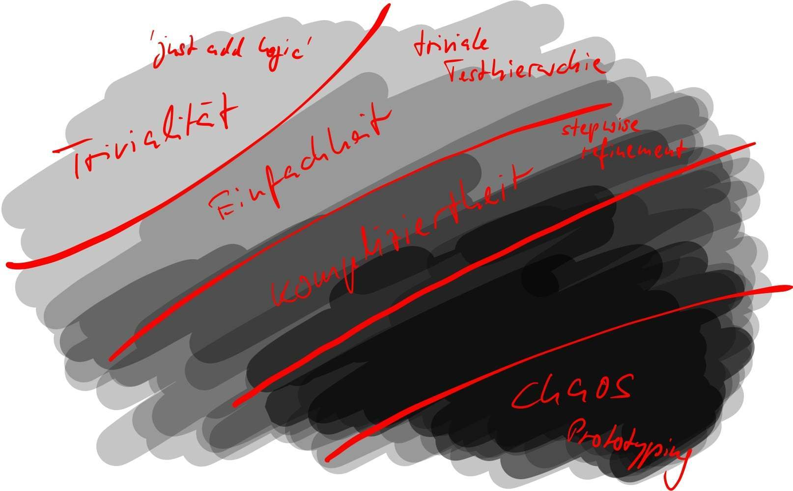

---

<!-- Page 104 of 493 -->

05-KomplementärcodiereninderKompliziertheit 95
Aber die Zeit ist auch an stepwise refinement nicht vorbeigegangen. Der
Ansatz, den ich dir hier vorstelle ist sozusagen eine Version 2.0: stepwise
refinement with a twist. Dadurch soll dir nicht nur bei der Problemlösung
(insb. Funktionalität) geholfen werden, sondern auch bei der Testbarkeit
und Ordnung.
Zerlegung in komplementäre
Teilprobleme
Schrittweise Verfeinerung ist ein rekursiver Prozess.
1. Im Fokus ist ein nicht naheliegendes Ausgangsproblem definiert
durch Reifetests und Funktionssignatur.
2. Für dieses Ausgangsproblem suchst du 2 oder mehr Teilprobleme,
die zusammen genommen, das Ausgangsproblem darstellen. 3-5
Teilprobleme sind typisch und noch übersichtlich. Weitere Teilpro-
bleme deuten jedoch darauf hin, dass du die Abstraktionsebene
zumindest für einige Teilprobleme zu tief gewählt hast.⁴¹
3. Für jedes Teilproblem stellst du die Frage, ob es schon ein nahelie-
gendes ist.
1. Wenn ja, kannst du mit der Zerlegung dort aufhören.
2. Wenn nein, machst du mit der Zerlegung bei diesem Teilpro-
blem weiter bei Schritt 1; du steigst also rekursiv eine Ebene
tiefer.
DieAnnahmehinter diesemVorgehen:EtwasGroßesbestehtwahrschein-
lich aus Teilen und Teile für sich genommen sind wahrscheinlich leichter
zu handhaben als das, was aus ihnen zusammengesetzt ist.
Das Bild zeigt einen Baum von Teilproblemen entstanden aus der Zerle-
gung eines Ausgangsproblems p1:
⁴¹Duwirstmerken,dasseseinegewisseÜbungerfordert,einerseitsnichtzugrobzusein,
in der Zerlegung, andererseits aber auch nicht zu fein. Eine zu grobe Zerlegung bringt dich
nurlangsamvoranundhältdieTeilproblemegroß/schwierig;dasZielistjaaber,trivialeoder
einfache Teilproblem zu identifizieren. Bei einer zu feinen Zerlegung hingegen verlierst du
irgendwanndieÜbersicht;esfehltdieAbstraktion,sodassdasRisikosteigt,dassdudichim
Technischen verlierst und dir die Domäne aus dem Blick rutscht. Dann ist deine Zerlegung
bedeutungsarm und schwer nachzuvollziehen, selbst wenn sie das gewünschte Verhalten
erzeugt.

---

<!-- Page 105 of 493 -->

05-KomplementärcodiereninderKompliziertheit 96
p1.1 und p1.2 machen z.B. als Teilprobleme der ersten Ebene das Gesamt-
problem p1 aus, genauso wie p1.2.1 und p1.2.2 wiederum das Teilproblem
p1.2 konstituieren.
Komplementär sind diese Teilprobleme, weil jedes für sich ausdrücklich
nicht das ganze Problem darstellt, wie es bei einfachen Problemen der Fall
ist.⁴² Vielmehr ergänzen sich die Lösungen der Teilprobleme wie Puz-
zleteile zu einem Gesamtbild auf jeder Ebene des Zerlegungsbaumes:
⁴²Erinnerstdudichnochdaran,wieinkrementelleTeilproblemeineinandergeschachtelt
waren? Sie stecken alle ineinander wie russische Matrjoschka-Puppen. In jeder Größen-
ordnung (bzw. mit jedem Schwierigkeitsgrad) sehen die Teilprobleme dort gleich aus, nur
eben mehr oder weniger “detailreich”. Das ist bei komplementären Teilprobleme ganz
anders! Sie sehen eben nicht gleich aus, sondern komplett verschieden. Komplementäre
Teilprobleme sind keine Inkremente, in denen etwas wächst, sondern “Bauteile” aus denen
etwaszusammengesetztwird.

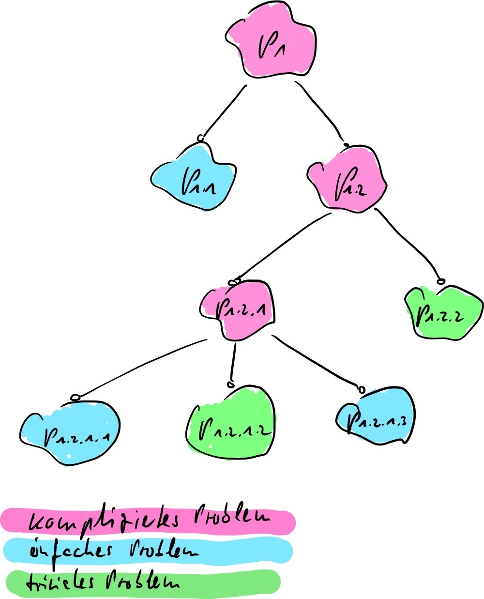

---

<!-- Page 106 of 493 -->

05-KomplementärcodiereninderKompliziertheit 97
TeilproblemebeieinfachenProblemensindwiedasAusgangsproblem,nur
eben nicht so schwierig. Das Gesamtproblem der fröhlichen Zahlen kann
in weniger schwierigere Teilprobleme zerlegt werden, z.B.1 → true und
10 → true . Beide sind “richtige” fröhliche-Zahlen-Probleme.
Teilprobleme bei komplizierten Problemen sind hingegen ganz anders
als das Ausgangsproblem! Im Gesamtproblem der fröhlichen Zahlen ste-
cken z.B. komplementäre Teilprobleme wie “Beurteilung der Fröhlich-
keit” (Beispiele: 1,[] → fröhlich, 68,[19,82] → unentschieden,
4,[4,..,20] → traurig) oder “Quadrieren” (Beispiele: 1 → 1, 19 →
82). Keines der Teilprobleme bei komplizierten Ausgangsproblemen
sieht allerdings aus wie das Ausgangsproblem.
Bei komplizierten Problemen müssen daher alle Teilprobleme tiefer im
Baum zuerst gelöst werden, um anschließend daraus die Lösung für das
Ausgangsproblem im Baum darüber zusammenzusetzen. Lösungen für
Teilprobleme sind echte Bausteine für etwas Größeres.
Schrittweise Zerlegung verläuft tendenziell von oben nach unten,
vom Ganzen zum Teil, also top-down; die Implementation des da-
durch entstehenden Problembaums hingegen erfolgt bottom-up, von
den Teilen zum Ganzen hin.

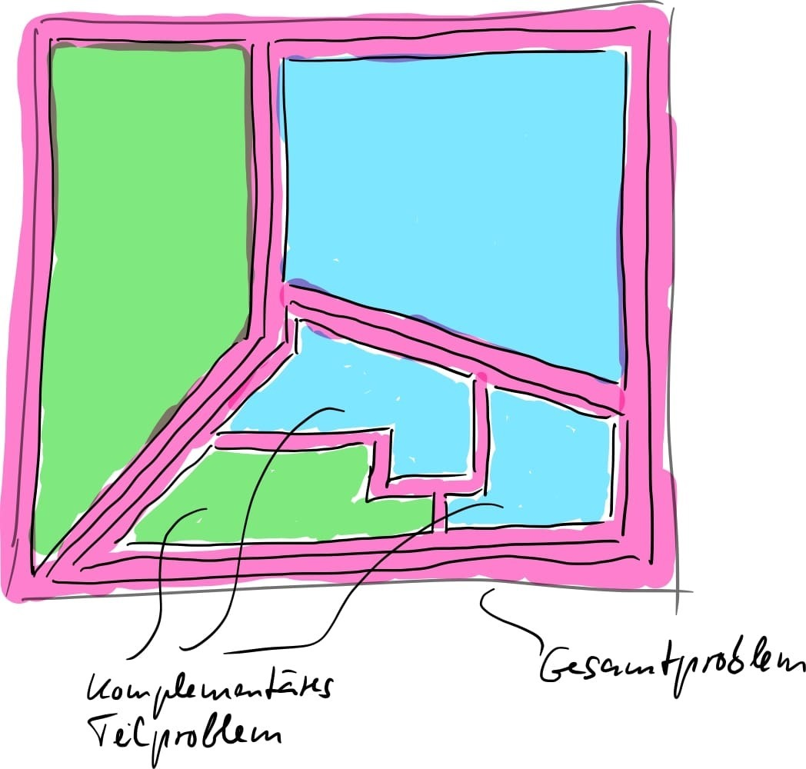

---

<!-- Page 107 of 493 -->

05-KomplementärcodiereninderKompliziertheit 98
Funktionen repräsentieren Lösungen
Die Blätter im Zerlegungsbaum sind (Teil)Probleme, die als trivial oder
einfacheingestuftwerden.BeiihnenhörtdieZerlegungauf.DieProbleme
im Baum darüber sind kompliziert, deshalb sind darunter weitere Äste
ausgetrieben.
Schon bisher hatten triviale und einfache Probleme im Code ihr Pendant
in Form einer Funktion. Das ändert sich mit der schrittweisen Verfeine-
rung nicht. Die identifizierten Teilprobleme auf jeder Ebene des Zerle-
gungsbaumes bekommen im Code eine Funktion gegenübergestellt.
Problem → Funktion → Logik: das ist die grundlegende
Transformationsleistung der Programmierung. Probleme
werdenimCodedurchFunktionenrepräsentiertunddurch
Logik gelöst.
Ein Problemzerlegungsbaum führt mithin zu einem Funktionsbaum im
Code. Dadurch werden Problemlösungen auf jeder Ebene für sich genom-
men testbar. Das dient der Korrektheit.
Der “twist” beim stepwise refinement 2.0 besteht nun darin, Logik aus-
schließlichindenBlätterndesZerlegungsbaumesanzusiedeln!Dieses
Ideal steht hinter der Formulierung “zusammen genommen”: Teilproble-
me sollen in Summe wirklich vollständig das jeweilige Ausgangsproblem
darstellen. Die Summe der Logik in den Funktionen p(), s() und t()
im nächsten Bild löst das Problem p1.2.1 repräsentiert durch Funktion
k() vollständig. Keine weitere, so genannteDark Logic⁴³ soll in k() nötig
sein.
⁴³Dark Logic ist Logik, die nicht in den Blatt-Funktionen steckt, sondern als Kleber
zwischen Aufrufen von Funktionen in darüber liegenden dient. Das klingt nicht schlimm,
ist es in der Praxis aber, weil Dark Logik nur schwer testbar ist. Sie macht funktionale
Abhängigkeitaus.AberdazumehrineinemspäterenKapitel.Hiernursoviel:MitDarkLogic
musst du kompensieren, wenn deine Teilprobleme nicht vollständig ein Ausgangsproblem
lösen.Meistenserkennstdudasdaran,dassdieSignaturenderTeilproblem-Funktionennicht
zusammenpassenbzw.nichtzurSignaturderFunktiondesAusgangsproblems.

---

<!-- Page 108 of 493 -->

05-KomplementärcodiereninderKompliziertheit 99
Die Implikationen dieses “twist” mögen dir noch nicht sofort klar sein,
doch sie sind weitreichend. Ich erlaube mir zu sagen: It makes all the
difference! Für die Korrektheit und die Ordnung hat es profunde Auswir-
kungen, wenn Logik ausschließlich in Blattfunktionen vorkommt.
1. Der erste Effekt des stepwise refinement 2.0 ist, dass aus einem
komplizierten Problem mehrere naheliegende werden: die Blätter
im Problembaum. Nur für diese überschaubareren Probleme ist
Logik zu finden.
2. Daraus folgt als zweiter Effekt, dass die Codierung der Funktionen,
die die immer noch komplizierten Probleme oberhalb der Blätter
repräsentieren,selbsttrivialzucodierensind^trivialeintegrationen]
Wirklich schwierig in der Codierung ist ja die Entwicklung von Logik.
Die ist nach der Zerlegung aber nur noch in den Blättern zu finden.
Also ist auch nur noch dort der Schwierigkeitsgrad wirklich relevant.
Funktionen oberhalb der Blätter enthalten keine Logik, deshalb ist der
Schwierigkeitsgrad nicht erwähnenswert; ihre Funktionen sind deshalb
ebenfalls trivial.

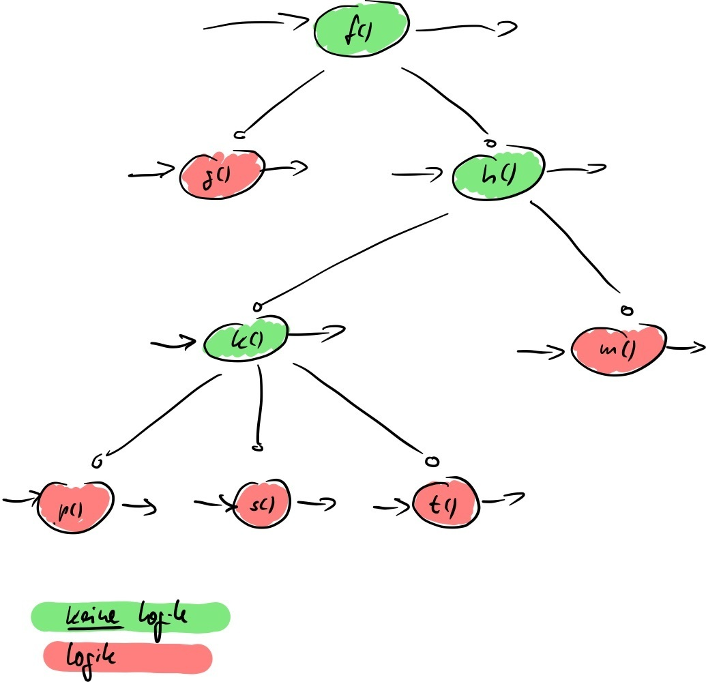

---

<!-- Page 109 of 493 -->

05-KomplementärcodiereninderKompliziertheit 100
GenaugenommenistamEndenatürlichnurdieLogikderBlattfunktionen
und die Ausgangsfunktion als Repräsentant des Gesamtproblems nötig,
um das geforderte Verhalten zu erzeugen. Alle anderen Funktionsrümpfe
werden eigentlich überflüssig und sind von außen auch nicht sichtbar. Sie
waren nur Trittsteine auf dem Weg zur Logik.
Dennoch werden die meisten dieser “inneren” Funktionen erhalten blei-
ben:
• Sie dienen der Verständlichkeit, weil jeder Funktionsname eine
Abstraktion des Inhalts darstellt.
• SiedienenderTestbarkeit,weildarüberAusschnittevonLogik(Teil-
probleme/Teillösungen als Ast des Zerlegungsbaumes) zugänglich
sind.
• Sie machen prinzipiell die durch sie repräsentierte Logik an anderer
Stelle leicht nutzbar.

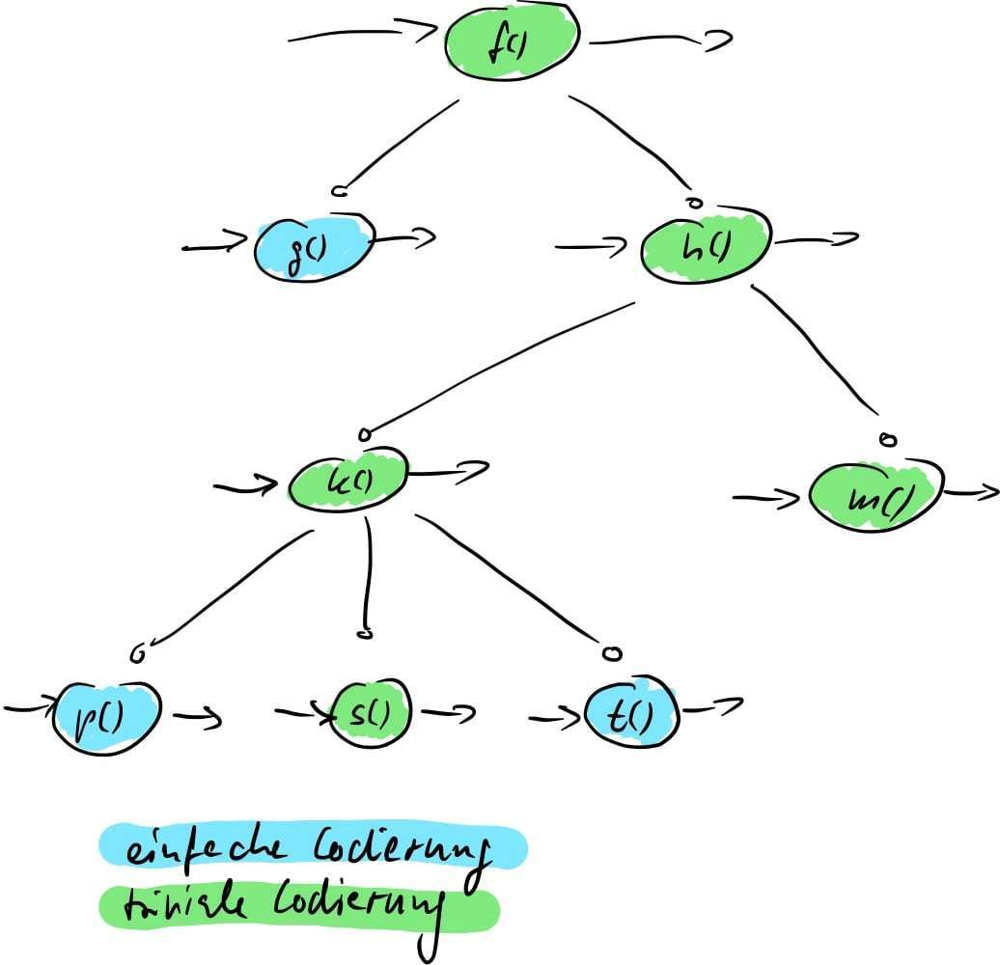

---

<!-- Page 110 of 493 -->

05-KomplementärcodiereninderKompliziertheit 101
Integration Operation Segregation
Principle
Der “twist” im stepwise refinement 2.0 ist so wichtig für die Korrektheit
und Ordnung von Software, dass ich finde, er verdient eine Formulierung
als Prinzip:
Integration Operation Segregation Principle (IOSP):
Funktionen sollen entweder Logik enthalten - dann sind
sie Operationen - oder sie sollen keine Logik enthalten und
lediglich andere Funktionen des eigenen Produktionscode
aufrufen - dann sind sie Integrationen.
Integration wie auch Operation leisten beide Komposition (composition):
sie fügen Verschiedenes zusammen zu etwas Neuem. Komplementäres ist
der Baustein von etwas Ganzem.
• Operationen“komponieren”(tocompose)ausverschiedenenLogik-
Bausteinen eine Gesamtfunktionalität.
• Integrationen “komponieren” aus verschiedenen Funkionen des
Produktionscodes als Bausteine eine Gesamtfunktionalität.
Funktionen fassen Logik also entweder direkt zusammen (Operation)
oder indirekt über Funktionen, die sie aufrufen, von denen sie also
abhängig sind (Integration).
Ohne IOSP enthalten Funktionen meistens eine Mischung aus Logik und
Funktionsaufrufen. Ein Beispiel dafür ist die folgende Main()-Funktion,
die eine Teillösung zur Iteration 3 des Hello-World-Beispiels darstellt:

---

<!-- Page 111 of 493 -->

05-KomplementärcodiereninderKompliziertheit 102
1 class Program
2 {
3 static void Main(string[] args) {
4 var backend = new HelloBackend("guests.txt");
5
6 while (true) {
7 Console.Write("Name: ");
8 var name = Console.ReadLine();
9 if (string.IsNullOrWhiteSpace(name)) continue;
10
11 var greeting = backend.Greet(name); // funktionale Abhängigkeit!
12
13 Console.WriteLine(greeting);
14 }
15 }
16 }
Main()selbstenthältLogik(z.B.Zeilen7,9)-ruftaberebenfallsdieFunk-
tion Greet() auf, die weitere Logik enthält. Greet() ist eine Operation,
Main() ist jedoch weder eindeutig Operation noch Integration, sondern
ein Hybrid.
HybrideFunktionenenthaltenLogikundrufenandereFunktionenauf,die
ebenfallsmittelbaroderunmittelbarLogikenthalten.HybrideFunktionen
sind funktional abhängig.
Hybride Funktionen operieren und integrieren gleichzeitig; sie überneh-
men zwei Aufgaben. Das ist ein Widerspruch zum Single Responsibility
Principle (SRP)⁴⁴. Der hat Konsequenzen für die Produktivität:
• Die Hybrid-eigene Logik kann für sich genommen nur getestet
werden, wenn Logik aus Funktionen, von denen der Hybrid abhän-
gig ist, ausgeblendet wird durch eine Form von Attrappe⁴⁵.⁴⁶ Das
erzeugt zusätzliche Komplexität in Test und Produktionscode.
• Teile der Hybrid-eigenen Logik vor oder nach einem Funktionsauf-
rufkönnengarnichtgezieltgetestetwerden.JeumfänglicherdieLo-
gikineinemHybriden,destoschwierigerdieProblemlokalisierung/-
behebung auch unter Einsatz von Attrappen. Das ist umso behin-
⁴⁴http://www.principles-wiki.net/principles:single_responsibility_principle
⁴⁵https://martinfowler.com/articles/mocksArentStubs.html
⁴⁶Darauf gehe ich einem späteren Kapitel noch ausführlich ein. Ich benutze dabei die
Begriffe Attrappe und Surrogat synonym. Von einem Mock oder Fake etc. - Begriffe, die
dirvielleichtgeläufigersind-sprecheichnurinspeziellenZusammenhängen.Zunächstist
mir erstmal nur die Idee wichtig, dass Logik überhaupt irgendwie im Test ersetzt wird, um
andereLogikbessertestenzukönnen.

---

<!-- Page 112 of 493 -->

05-KomplementärcodiereninderKompliziertheit 103
dernder, je mehr Logik Hybride enthalten.⁴⁷
Integrationen sind zwar per definitionem abhängig von anderen Funk-
tionen im Produktionscode, aber nicht funktional abhängig, weil sie
selbst keine Logik enthalten. Operationen auf der anderen Seite sind per
definitionem ganz unabhängig; sie rufen keine Funktionen des Produkti-
onscodes auf. Sie sind die Blätter im Funktionsbaum.
⁴⁷Ich behaupte sogar, dass Hybride schuld daran sind, dass es in Codebasen häufig
lange, gar sehr lange, manchmal extrem lange Funktionen gibt. 500 Zeilen, 5000 Zeilen in
einer Funktion sind nicht nur möglich, sondern verbreitet. Solche Funktionen lassen sich
natürlichnurextremschwerverstehenundnochschwerertesten.IneinemspäterenKapitel
bekommst du davon einen Eindruck. Dennoch existieren sie - und zwar, so glaube ich,
weil sich Entwickelnde funktionale Abhängigkeiten erlauben. Solange hybride Funktionen
normal sind, solange gibt es nämlich keinen formalen Grund, nicht zu 100 Zeilen weitere
50 hinzuzufügen und vielleicht 20 in eine Funktion auszulagern. Das Ergebnis 130 Zeilen.
Beim nächsten Mal 40 neue Zeilen und 10 augelagerte. Das Ergebnis 160 Zeilen. Usw. usf.
Es gibt keine Wachstumsgrenze für hybride Funktionen, weil man bei Unwohlsein etwas
scheinbar Gutes tun kann durch Extraktion von etwas Logik. Das Ergebnis hat scheinbar
größere Ordnung - in Wirklichkeit aber nicht, denn das SRP wird immer weniger bedacht
und weil dem SLA widersprochen wird und weil das Ergebnis noch schlechter testbar ist.
Dass in der mainstream Literatur funktionale Abhängigkeiten immer noch hingenommen
werden,halteichfüreinengroßenÜbelstandinSachenOrdnung.

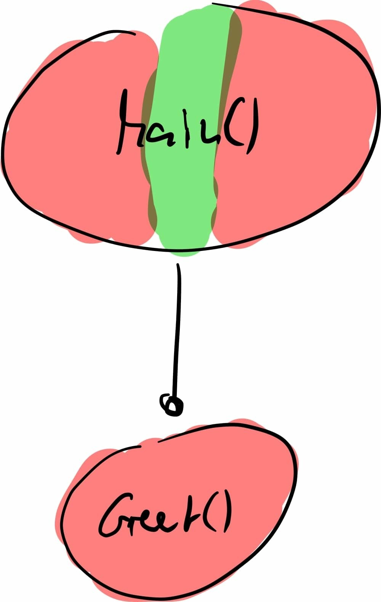

---

<!-- Page 113 of 493 -->

05-KomplementärcodiereninderKompliziertheit 104
Das Bild von Code, der nicht dem IOSP folgt, ist also bunt, sehr bunt. Er
besteht aus vielen, vielen Ebenen mit hybriden Funktionen, die “rot und
grün” sind, weil sie Logik und Funktionsaufrufe enthalten. Funktionale
Abhängigkeit ist darin als unhinterfragte Notwendigkeit die Norm.
SolchehybridenHierarchiensindderüblicheZustandvonCodebasenmit
den üblichen negativen Konsequenzen für die Produktivität:
• schlechte Testbarkeit, die zu Unlust in Bezug auf automatisierte

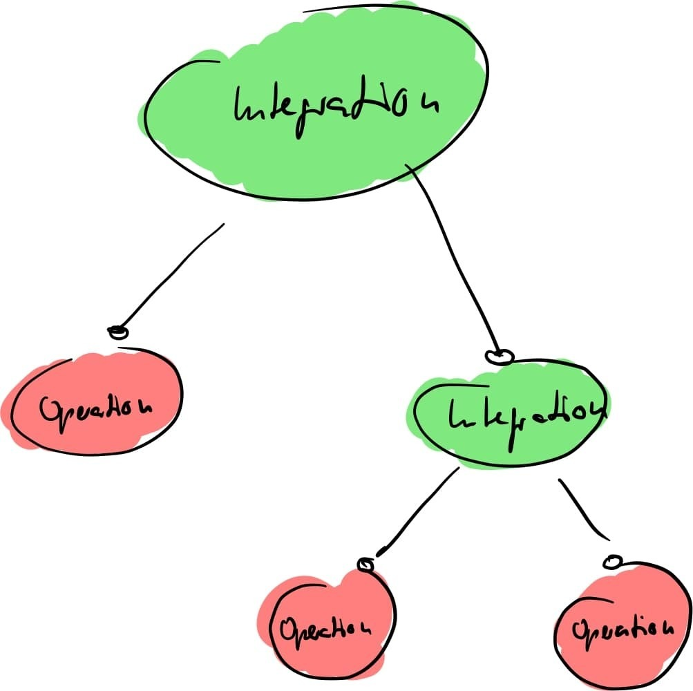

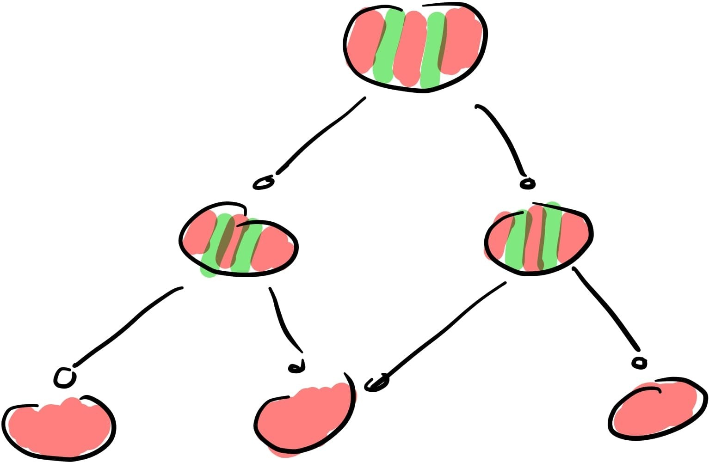

---

<!-- Page 114 of 493 -->

05-KomplementärcodiereninderKompliziertheit 105
Tests führt, die wiederum zu geringer Testabdeckung und damit zu
hohem Risiko von Regressionen führt. Manuelle Tests und lange
Debugging-Sitzungen sind weitere Symptome.
• geringe Ordnung, die sich ausdrückt durch
– mangelhafte Übersichtlichkeit aufgrund sehr langer Funktio-
nen (tausende Zeilen Logik sind keine Seltenheit)
– stolperndes Verständnis aufgrund uneinheitlichen Abstrak-
tionsniveaus (Logik und Funktionsaufrufe wechseln sich ab);
einWiderspruchgegendasPrinzipSingleLevelofAbstraction
(SLA)⁴⁸
Das IOSP räumt mit diesen Zuständen radikal auf.
Das IOSP definiert eine sehr simple, klare Struktur für das Ergebnis einer
schrittweisen Zerlegung komplizierter Probleme. Code, der dem IOSP
folgt,hatinsoferneine“Grundsauberkeit”,sodassvonvornhereinweniger
Refaktorisierungsbedarf besteht.
Zerlegungsbeispiel I
Die Theorie des stepwise refinement 2.0 hört sich komplizierter an, als sie
ist. Das zeigt dir hoffentlich schon das nächste Beispiel:
Dezimalzahlen in römische Zahlen umwandeln
ZueinerDezimalzahl,z.B.1984,solldierömischeZahl,hier:MCMLXXXIV,
mit der Funktion string ToRoman(int decimalNumber) er-
mittelt werden.
Die Anforderungen sind klar. Die Domäne ist dir von der Übungsaufgabe
“Römische Zahlen wandeln” grundsätzlich bekannt.
Ist die Problemlösung für dich naheliegend, wirklich naheliegend? Viel-
leicht. Hier soll die Aufgabe jedoch mindestens übungshalber als kompli-
ziertes Problem behandelt werden. Lässt sich also durch Nachdenken eine
⁴⁸http://www.principles-wiki.net/principles:single_level_of_abstraction

---

<!-- Page 115 of 493 -->

05-KomplementärcodiereninderKompliziertheit 106
Zerlegung des Gesamtproblems in Teilprobleme finden, deren Schwierig-
keitsgrad geringer ist?
Leitfragen für die Zerlegung
Leitfrage bei der Zerlegung kann sein: “Welcher Aspekt der Aufgabe ist
besondersschwer/leichtundstichtdeshalbheraus?” Findestdudaraufeine
Antwort, ist das Gesamtproblem zumindest in zwei Teilprobleme zerlegt:
ein schweres/leichtes und „den Rest“.
Oder die Zerlegung beginnt am Anfang mit dem bekannten Input, hier:
eine Dezimalzahl. Was kann mit dem getan werden im Sinne des “Wert-
stroms” in Richtung Output - ohne den Output schon zu erzeugen?
Umgekehrt genauso: Was ist am Ende sicher nötig, um den Output zu
erzeugen, ohne dass klar wäre, wie es zu dem Input kommt, der dafür
nötig ist?
Analyse & Entwurf
Was bei diesem Beispielproblem ins Auge sticht, sind die römischen
Ziffern. Woher kommen die? Woher kann die Logik wissen, dass ein M
am Anfang des Output stehen muss? M steht für 1000 - und diese 1000
müssen irgendwie im Input stecken. Dasselbe gilt für das darauf folgende
CM für 900.
• Damit liegt ein Teilproblem auf dem Tisch: die Umwandlung von
„Faktoren“ in römische Ziffern, z.B. [1000, 900, 50, ...] →
[„M“, „CM“, „L“, ...] Nach kurzer Analyse der Bildungs-
gesetze römischer Zahlen stellt sich zum Glück heraus, dass es
nur eine Handvoll solcher „Faktoren“ gibt, weil auch kleinere vor
größeren römischen Ziffern nicht beliebig platziert werden dürfen:
1, 4, 5, 9, 10, 40, 50, 90, 100, 400, 500, 900, 1000.
• Das wesentliche vorgelagerte Restproblem ist dann die Überfüh-
rung des Input in eine Liste von Faktoren: 14 → [10, 4]
• Und das unwesentliche nachgelagerte Restproblem ist das „Ver-
schweißen“ der zugehörigen römischen Ziffern (oder „Silben“) zu
einer Zahl: [„M“, „CM“] → “MCM“

---

<!-- Page 116 of 493 -->

05-KomplementärcodiereninderKompliziertheit 107
Der Schwierigkeitsgrad ist beim letzten Problem trivial. Beim ersten
Problem ist er ebenfalls trivial, scheint mir. Keine weitere Zerlegung ist
nötig.
Das zweite Teilproblem ist hingegen nicht trivial, sondern einfach. Die
Variationsdimension ist die Zahl der „Faktoren“, in die eine Zahl zerlegt
werdenkann.Außerdemkönntenochunterschiedenwerden,obmehrfach
derselbe „Faktor“ vorkommt. Schließlich bilden die verschiedenen Fakto-
ren eine weitere Variationsdimension.
Inkrementelle Testfälle könnten sein:
• 5 → [5]
• 9 → [9]
• 19 → [10,9]
• 24 → [10,10,4]
Da alle Teilprobleme trivial oder einfach sind, ist die Zerlegung abge-
schlossen. Die Codierung kann nach Aufsetzen der Reifetests für die
Ausgangsfunktion bei jedem Teilproblem beginnen.
Codierung
Die Codierung von Lösungen für komplizierte Probleme beginnt wieder
an der Wurzel mit einem Akzeptanztest:

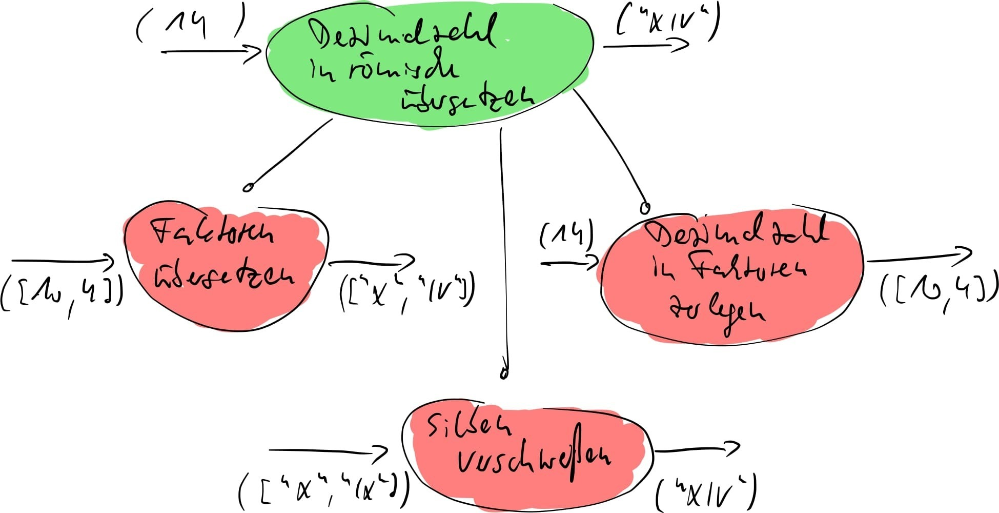

---

<!-- Page 117 of 493 -->

05-KomplementärcodiereninderKompliziertheit 108
1 [Theory]
2 [InlineData(1984, "MCMLXXXIV")]
3 [InlineData(1492, "MCDXCII")]
4 public void AcceptanceTest(int decimalNumber, string expectedRomanNumber)
5 {
6 RomanConverter.ToRoman(decimalNumber).Should().Be(expectedRomanNumber);
7 }
AnschließendkönnendieTeilproblemeinbeliebigerReihenfolgeangegan-
gen werden, z.B.
Teilproblem “Verschweißen”
DastrivialsteBlatt-ProblemdesZerlegungsbaumesscheintdasVerschwei-
ßen der “römischen Silben” zu sein.
1 [Fact]
2 public void Fuse_test() {
3 RomanConverter.Fuse(new[] {"A", "BC", "DEF"}).Should().Be("ABCDEF");
4 }
Die Testdaten haben allerdings nichts “Römisches” an sich, weil die
Funktionalität selbst unabhängig ist von römischen Ziffern. Fuse() wird
nur “zufällig” im Zusammenhang mit römischen Zahlen eingesetzt.
1 public static string Fuse(IEnumerable<string> syllables)
2 => string.Join("", syllables);
Mit einer bequemen Zeichenkettenfunktion wie Join() in C# ist die
Implementation dann wahrlich trivial. Aber auch wenn der resultierende
String manuell hätte zusammengesetzt werden müssen, wäre das kein
schwierigeres Problem.
Teilproblem “Übersetzen”
Oder ist die Übersetzung der Faktoren in ihre “römischen Silben” das
trivialste Problem? Vielleicht - allerdings ist dafür mehr Code nötig.
Deshalb steht es an zweiter Stelle.

---

<!-- Page 118 of 493 -->

05-KomplementärcodiereninderKompliziertheit 109
1 [Fact]
2 public void Map_test() {
3 RomanConverter
4 .Map(new[] {1, 4, 5, 9, 10, 40, 50, 90,
5 100, 400, 500, 900, 1000})
6 .Should().BeEquivalentTo(new[]{"I", "IV", "V", "IX", "X",
7 "XL", "L", "XC", "C", "CD", "D",
8 "CM", "M"});
9 }
1 public static IEnumerable<string> Map(IEnumerable<int> factors)
2 => factors.Select(f => f switch {
3 1 => "I",
4 4 => "IV",
5 5 => "V",
6 9 => "IX",
7 10 => "X",
8 40 => "XL",
9 50 => "L",
10 90 => "XC",
11 100 => "C",
12 400 => "CD",
13 500 => "D",
14 900 => "CM",
15 1000 => "M"
16 });
Teilproblem “Zerlegung”
Schließlich die Zerlegung der Dezimalzahl in ihre “Faktoren”. Hier erfolgt
die Annäherung an die Logik schrittweise…
Iteration 1
Zunächst soll eine Dezimalzahl einem Faktor entsprechen:
1 [Theory]
2 [InlineData(5, new[]{5})]
3 public void Decompose_test(int decimalNumber, int[] expectedFactors) {
4 RomanConverter.Decompose(decimalNumber).Should().BeEquivalentTo(expectedFactors);
5 }
1 public static IEnumerable<int> Decompose(int decimalNumber) {
2 if (decimalNumber == 5) yield return 5;
3 }
DieLösungistzwarsehrspezifischaufdasersteTestinkrementzugeschnit-
ten, aber sie stellt sich nicht dumm. Sie benutzt den Input und arbeitet
auch mit dem Faktor: sie vergleicht ihn mit der Dezimalzahl und liefert
ihn, falls er “darin enthalten ist”.

---

<!-- Page 119 of 493 -->

05-KomplementärcodiereninderKompliziertheit 110
IEnumerable<int> ist in C# ein Iteratortyp, der hier statt eines Array
oder einer Liste benutzt wird, um eine unnötig spezifische Ergebnisda-
tenstruktur zu vermeiden. Mit yield return können die Teilergebnisse
einzeln zurückgeliefert werden und sehen beim Aufrufer aus wie eine
Collection.
Iteration 2
Das zweite Testinkrement soll die Unterscheidung von Faktoren in der
Logik manifestieren.
1 [Theory]
2 [InlineData(5, new[]{5})]
3 [InlineData(9, new[]{9})]
4 public void Decompose_test(int decimalNumber, int[] expectedFactors) {
5 RomanConverter.Decompose(decimalNumber).Should().BeEquivalentTo(expectedFactors);
6 }
1 public static IEnumerable<int> Decompose(int decimalNumber) {
2 if (decimalNumber == 9) yield return 9;
3 if (decimalNumber == 5) yield return 5;
4 }
Der Zuwachs an Logik ist minimal. Viel weiter ist die Lösung damit
nicht gekommen. Aber es erschien bei der Planung der Testinkremente
irgendwie ein hilfreicher Schritt. Wie hilfreich, wird sich wohl erst im
nächsten Inkrement zeigen.
Iteration 3
Bisher ging es um die kategoriale Variationsdimension der Faktorenwerte.
Nun wechselt die Variationsdimension zur Menge der Faktoren.
1 [Theory]
2 [InlineData(5, new[]{5})]
3 [InlineData(9, new[]{9})]
4 [InlineData(19, new[]{10,9})]
5 public void Decompose_test(int decimalNumber, int[] expectedFactors) {
6 RomanConverter.Decompose(decimalNumber).Should().BeEquivalentTo(expectedFactors);
7 }
Wenn mehrere Faktoren enthalten sein können, dann liegt eine Schleife
auf der Hand. Und die zu prüfende Zahl muss sich mit jedem Faktor, der
inihrgefundenwurde,verändern-biskeineFaktorenmehrenthaltensein
können.
Ein bestimmter Faktor ist noch enthalten, solange die Dezimalzahl noch
größer oder gleich dem Faktor ist.

---

<!-- Page 120 of 493 -->

05-KomplementärcodiereninderKompliziertheit 111
1 public static IEnumerable<int> Decompose(int decimalNumber) {
2 while (decimalNumber > 0) {
3 var factor = 0;
4 if (decimalNumber >= 10) factor = 10;
5 else if (decimalNumber >= 9) factor = 9;
6 else if (decimalNumber >= 5) factor = 5;
7 yield return factor;
8
9 decimalNumber -= factor;
10 }
11 }
Im Moment ist die Lösung nur funktional. Das ist das erste Ziel beim
inkrementellenVorgehen.Ichwillnichtüber“schönen”Codenachdenken,
sondern das Problem einfach nur irgendwie gelöst bekommen.
Refaktorisierung
Aber in diesem Entwicklungsstand der Logik fallen nun Wiederholungen
deutlichauf.DiesolltenimmerTriggersein,genauerhinzuschauen,obdie
Ordnung durch eine Refaktorisierung erhöht werden kann. Wiederholun-
gen (duplication) sind in der ursprünglichen cTDD-Darstellung von Kent
Beck⁴⁹ der Treiber für Refaktorisierungen.
• “Horizontal” (in derselben Zeile) wiederholen sich die Faktoren
• “Vertikal” wiederholen sich die Vergleiche für die einzelnen Fakto-
ren
Die zweite Wiederholung klingt nach Schleife. Die erste nach Zusammen-
ziehen an einem Ort.
1 public static IEnumerable<int> Decompose(int decimalNumber) {
2 var factors = new[] {10,9,5};
3
4 while (decimalNumber > 0) {
5 var factor = 0;
6 foreach (var f in factors) {
7 factor = f;
8 if (decimalNumber >= factor) break;
9 }
10 yield return factor;
11
12 decimalNumber -= factor;
13 }
14 }
Iteration 4
Und abschließend sollen noch mehrere gleiche Faktoren erkannt werden.
⁴⁹https://www.amazon.de/Test-Driven-Development-Example-Signature/dp/
0321146530

---

<!-- Page 121 of 493 -->

05-KomplementärcodiereninderKompliziertheit 112
1 [Theory]
2 [InlineData(5, new[]{5})]
3 [InlineData(9, new[]{9})]
4 [InlineData(19, new[]{10,9})]
5 [InlineData(24, new[]{10,10,4})]
6 public void Decompose_test(int decimalNumber, int[] expectedFactors) {
7 RomanConverter.Decompose(decimalNumber).Should().BeEquivalentTo(expectedFactors);
8 }
1 public static IEnumerable<int> Decompose(int decimalNumber) {
2 var factors = new[] {10,9,5,4};
3
4 while (decimalNumber > 0) {
5 var factor = 0;
6 foreach (var f in factors) {
7 factor = f;
8 if (decimalNumber >= factor) break;
9 }
10 yield return factor;
11
12 decimalNumber -= factor;
13 }
14 }
Durch die Refaktorisierung ist dieses Teilproblem interessanterweise im
Grunde nun schon gelöst; lediglich die 4 musste als Faktor hinzugefügt
werden.
Eigentlich sollen Refaktorisierungen das Verhalten nicht betreffen, hier
jedoch ist das überraschend, wenn auch angenehm geschehen. Diesem
geschenkten Gaul schaue ich nicht näher ins Maul.
Integration
Die komplementären Teilprobleme sind durch eigene Funktionen - Ope-
rationen im Sinne des IOSP - gelöst. Was bleibt, ist Codierung der
Funktion für das Ausgangsproblem, der Integration. Logik ist dafür nicht
nötig. Lediglich die bisher implementierten Funktionen müssen zu einer
Komposition zusammengefügt werden. Die Gesamtlösung wächst damit
bottom-up.
1 public static string ToRoman(int decimalNumber) {
2 var factors = Decompose(decimalNumber);
3 var syllables = Map(factors);
4 return Fuse(syllables);
5 }
Wenn die Akzeptanztests jetzt ausgeführt werden, zeigt sich jedoch eine
Lücke. Es fehlen noch “Faktoren” für die Dekomposition. Die können ja
aber leicht nachgerüstet werden. Dank Einhaltung des SRP ist der Ort
dafür offensichtlich:

---

<!-- Page 122 of 493 -->

05-KomplementärcodiereninderKompliziertheit 113
1 public static IEnumerable<int> Decompose(int decimalNumber) {
2 // vollständige Faktorenliste
3 var factors = new[] {1000,900,500,400,100,90,50,40,10,9,5,4,1};
4
5 while (decimalNumber > 0) {
6 var factor = 0;
7 foreach (var f in factors) {
8 factor = f;
9 if (decimalNumber >= factor) break;
10 }
11 yield return factor;
12
13 decimalNumber -= factor;
14 }
15 }
Das hätte in einem weiteren inkrementellen Test für Decompose()
auffallen können. Aber bei der Integration ist das in diesem Fall auch kein
Beinbruch.
Refaktorisierung
Das Ausgangsproblem ist gelöst. Dennoch ist der Code noch nicht ganz
“in Ordnung”. Wieder gibt es offensichtliche Wiederholungen. In der
Übersicht fallen sie dir auch ins Auge:
1 public static IEnumerable<string> Map(IEnumerable<int> factors)
2 => factors.Select(f => f switch {
3 1 => "I",
4 4 => "IV",
5 5 => "V",
6 9 => "IX",
7 10 => "X",
8 40 => "XL",
9 50 => "L",
10 90 => "XC",
11 100 => "C",
12 400 => "CD",
13 500 => "D",
14 900 => "CM",
15 1000 => "M"
16 });
17
18 public static IEnumerable<int> Decompose(int decimalNumber) {
19 var factors = new[] {1000,900,500,400,100,90,50,40,10,9,5,4,1};
20
21 while (decimalNumber > 0) {
22 var factor = 0;
23 foreach (var f in factors) {
24 factor = f;
25 if (decimalNumber >= factor) break;
26 }
27 yield return factor;
28
29 decimalNumber -= factor;
30 }
31 }
Die Liste der Faktoren findet sich zweimal im Code. Das leistet In-
konsistenzen Vorschub. Eine Refaktorisierung ist angezeigt, die beide
Faktorenlisten zusammenführt und die Codemenge reduziert.

---

<!-- Page 123 of 493 -->

05-KomplementärcodiereninderKompliziertheit 114
Mit einer indizierten Liste von Name-Wert-Paaren (ein Dictionary in
C#) können beide Nutzer der Faktoren befriedigt werden:
• Map() liest für jeden Faktor die zugehörige Silbe aus
• Decompose() durchläuft lediglich die sortierte Liste der Faktoren,
ohne ihre Übersetzungen zu berücksichtigen
1 public class RomanConverter
2 {
3 static readonly Dictionary<int, string> FACTORS = new Dictionary<int, string> {
4 {1,"I"},{4,"IV"},{5,"V"},
5 {9,"IX"},{10,"X"},{40,"XL"},{50,"L"},
6 {90,"XC"},{100,"C"},{400,"CD"},{500,"D"},
7 {900,"CM"},{1000,"M"}
8 };
9
10 public static string ToRoman(int decimalNumber) {
11 var factors = Decompose(decimalNumber);
12 var syllables = Map(factors);
13 return Fuse(syllables);
14 }
15
16 public static IEnumerable<int> Decompose(int decimalNumber) {
17 while (decimalNumber > 0) {
18 var factor = 0;
19 foreach (var f in FACTORS.Keys.OrderByDescending(f=>f)) {
20 factor = f;
21 if (decimalNumber >= factor) break;
22 }
23 yield return factor;
24
25 decimalNumber -= factor;
26 }
27 }
28
29 public static IEnumerable<string> Map(IEnumerable<int> factors)
30 => factors.Select(f => FACTORS[f]);
31
32 public static string Fuse(IEnumerable<string> syllables)
33 => string.Join("", syllables);
34 }
Reflexion
Die Logik der finalen Lösung ist nicht umfänglich. Im Grunde sieht sie
trivial aus. Aber das ist eine Rückspiegelweisheit. Vor der Umsetzung war
die Logik nicht so klar. Oder hättest du sie runterschreiben können?
Klar hingegen waren drei komplementäre Teilprobleme. Die waren trivial
bis einfach und konnten zügig gelöst werden. Und am Ende war damit
auch das Ausgangsproblem durch Integration trivial zu lösen.
In der Form unterscheiden sich die Funktionen sehr deutlich:

---

<!-- Page 124 of 493 -->

05-KomplementärcodiereninderKompliziertheit 115
• Decompose() enthält sehr auffällig Logik. Die lässt sich bei aller
Einfachheit nicht so leicht verstehen. Ihre Interpretation verlangt
einem Leser einigen mentalen Aufwand ab. Aber zum Glück sind
es nur wenige Teilen, die durch die zugehörigen Tests auch noch
erklärt werden.
• ToRoman() hingegen enthält keinerlei Logik, sondern nur Funk-
tionsaufrufe. Diese Sequenz lässt sich im Vergleich zu Logik sehr
leicht verstehen, ist sehr übersichtlich und gut lesbar.
Das Abstraktionsniveau in allen Methoden ist einheitlich: in den Opera-
tionen ist es niedrig, in der Integration ist es hoch. Verständnis kann sich
beim Lesen “ohne Holpern” gut entwickeln.
Dass alle Funktionen kurz sind, ist typisch für Code, der dem IOSP
folgt!
• Lange Integrationen (> 5-7 Funktionsaufrufe) können zwar ent-
stehen, lassen sich aber schlecht lesen und werden daher schnell
refaktorisiert, weil das ganz einfach ist. Es muss nicht Logik aus
anderer Logik extrahiert werden, sondern aufeinander folgende
Funktionsaufrufe werdenschlicht zusammenin eine neue Funktion
ausgelagert.
• Lange Operationen (> 30-50 Zeilen Logik) können zwar entstehen,
erschwerendannjedochzunehmenddasVerständnis.Eswächstder
WunschzurExtraktionvoneinigenZeilenLogik.Sobaldeinesolche
Extraktion jedoch vorgenommen wird und eine Operation nun die
extrahierteFunktionaufruft,istsieeinHybrid-undmusslautIOSP
ineineIntegrationumgewandeltwerden.Diegesamteverbleibende
Logik muss also ebenfalls ausgelagert werden in weitere Funktio-
nen. Das “Wesen” der Funktion kippt von Operation zu Integration.
Die Funktionen der Teilprobleme stehen unter Test. Dafür müssen sie
sichtbar sein, obwohl das ihrem Charakter eigentlich widerspricht. Funk-
tionen, die durch das Zerlegen des Gesamtproblems entstehen, sind De-
tails,dienichtveröffentlichwerdensollten.DieeinzigeöffentlicheMetho-
de sollte allerdings ToRoman() sein. Testbarkeit und Entkopplung (durch
Minimierung des Interface eines Moduls) stehen noch in einer unschönen
Spannung. Die gilt es noch aufzulösen: im nächsten Kapitel.

---

<!-- Page 125 of 493 -->

05-KomplementärcodiereninderKompliziertheit 116
Dass die Lösung mit statischen Funktionen umgesetzt ist, mag dich be-
fremden. Statische Funktionen sind zumindest in der Objektorientierung
nicht gut gelitten. An dieser Stelle ist ihre Wahl jedoch unerheblich
für das Vorgehen. Bei gegebener Funktion - hier: ToRoman() - ist der
grundsätzliche Schwierigkeitsgrad nicht davon abhängig, ob die Funktion
statisch sein soll oder nicht.
Allerdings folgt aus dem IOSP eine gewisse Rehabilitierung der statischen
Funktionen in objektorientierten Sprachen. Die Testbarkeit ist durch Be-
folgung des Prinzips so hoch, dass zusätzliche Komplexität durch expli-
zite Interfaces und die Anwendung von Dependency Inversion Principle
(DIP)⁵⁰ und Inversion of Control (IoC)⁵¹ und Testattrappen viel seltener
nötig ist. Logik ist schlicht nicht mehr funktional abhängig. Sie kann
feingranular Operation für Operation getestet werden. Aber auch dazu
in einem späteren Kapitel mehr.
Das IOSP legt sogar nahe, von statischen Funktionen als default auszuge-
hen, bis es gute Gründe gibt, instanziierbare Klassen (d.h. Objekte) einzu-
führen.AberdieseEntscheidungensindkeinThemaderCodierungsphase,
sondern der Entwurfsphase, die hier nicht näher Thema ist.
Buddelschiff Programmierung
Das schrittweise Vorgehen bei einfachen Problemen lässt die Logik durch
die eine Funktion wachsen, für die es Reifetests gibt. Das Bild dafür ist die
Williams-Christ Birne.
DasnachdenkendeZerlegendes
Ausgangsproblems in komple-
mentäre Teilprobleme, die dann
jeweils für sich gelöst und am
Ende bottom-up integriert wer-
den, hat ein anderes Bild.⁵²
Programmierung in der Kom-
pliziertheit folgt dem Vorgehen
⁵⁰http://www.principles-wiki.net/principles:dependency_inversion_principle
⁵¹https://en.wikipedia.org/wiki/Inversion_of_control
⁵²FotovonCrissyJarvisbeiUnsplash

---

<!-- Page 126 of 493 -->

05-KomplementärcodiereninderKompliziertheit 117
beim Bau eines Flaschenschiffs. Das wird ja eben nicht durch den Fla-
schenhals gebaut, sondern außerhalb der Flasche Teil für Teil bearbeitet
und zusammengesetzt. Erst am Ende wird es durch den Flaschenhals in
die Flasche geschoben und aufgerichtet.⁵³
• Die rekursive Zerlegung des Gesamtproblems in Teilprobleme ent-
spricht der Planung eines Buddelschiffs. Es entsteht eine Liste von
Bauteilen.
• Die Funktionen für die Blatt-Probleme des Zerlegungsbaums test-
firstzucodieren,d.h.dieOperationenzuprogrammieren,entspricht
der Herstellung von Teilen des Buddelschiffs.
• Blatt-Funktionen in der darüber liegenden Funktion zu integrieren,
entspricht einem Zusammenbau von Teilen zu größeren Einheiten
des Buddelschiffs.
• Und schließlich die Integration in der Ausgangsfunktion entspricht
dem Einschieben des Buddelschiffs in die Flasche inkl. Aufrichtung
der Masten.
Wenn du absolut willst, kannst du versuchen, ein
Flaschenschiff auch in der Flasche zusammenzubau-
en. Das soll es geben. Doch es scheint mir ungleich
schwieriger - jedenfalls wenn es nicht nur eine simple
“Nussschale”seinsoll.KomplizierteSchiffewerdenau-
ßerhalb gebaut und dann nur noch hineingeschoben.
Dasselbe solltest du mit komplizierten Problemen ma-
chen: Mach es dir einfach und baue sie Teil für Teil “auf einer Werkbank”
bottom-upzusammen.ZerlegedasGesamteüberhauptinTeile,dieseparat
gebautwerdenkönnen.UndbauedieseTeiledort,wodu“vonallenSeiten
an sie herankommen kannst”.
Test-first Vorgehenlebt davon, dass es auch einfach ist, Tests zu schreiben;
dafür sorgen die vielen Logik-kapselnden Operationen. Wo das nicht der
Fall ist, zögerst du und lässt die Tests womöglich ganz sein. Das leistet
dann Regressionen Vorschub, selbst wenn es dir im Moment irgendwie
bequemer scheint. Das dicke Ende kommt schon noch, keine Sorge.
⁵³Wenndichdasinteressiert,schaudirdocheinmaldieseAnleitungan:HowtoBuilda
ShipinaBottle

---

<!-- Page 127 of 493 -->

05-KomplementärcodiereninderKompliziertheit 118
Bei manchen Problemen, ist es ausreichend, Tests nur “von außen” an-
zulegen. Das sind die Reifetests der trivialen Probleme und zusätzlich
die inkrementellen Tests der einfachen Probleme. Doch solche Probleme
sind die Ausnahme, meine ich, bzw. müssen erst in einem Prozess der
Zerlegung hergestellt werden. Initial bist du meistens mit komplizier-
ten Problemen konfrontiert. Und bei deren Lösung hilft der rekursive
Zerlegungsprozess mit dem Ziel, eine IOSP-Funktionshierarchie aufzu-
spannen. Denn die ist sehr verständlich und gut testbar. Anschließend
implementierst du die auf deiner Werkbank und “schiebst sie am Ende in
die Flasche”, d.h. integrierst.
Zerlegungsbeispiel II
Als zweites Beispiel für ein kompliziertes Problem soll das Szenario
zur Begrüßung von Gästen dienen. Erinnerst du dich noch an die 2.
Übungsaufgabe zum ersten Kapitel?
Solltest du die Musterlösung zur Hand haben, findest du darin schon eine
Analyse dazu mit Akzeptanztest für eine API-Funktion. Lass das nochmal
auf dich wirken, wenn du kannst. Aber auch ohne stell dir die Frage:
Welchen Schwierigkeitsgrad würdest du dem Problem geben?
Chaotischistesnicht,weileinAkzeptanztestundeineFunktionvorliegen.
Ist es trivial, weil du die Logik “einfach so” hinschreiben könntest? Sehr
unwahrscheinlich (auch wenn ich dich nicht unterschätzen will).
Oder ist es einfach, könntest du dich also mit inkrementellen Tests an die
Logikheranarbeiten?BeigegebenerAPI-Funktionstring Greet(string
name) könntest du schrittweise schwierigere Tests finden. Die würden
sich an der Kategoriendimension der Besuchsanzahl entlang entwickeln.
Aber würde das einen großen Vorteil bringen? Denn vom ersten, spätes-
tens vom zweiten Test an müsstest du den persistenten Zustand im Blick
haben. Dafür müsstest du also ohnehin eine Idee für den Zugriff darauf
haben. Ich glaube also nicht, dass du hier “pear programming” betreiben
willst.
Warum also nicht das Begrüßungsproblem gleich als kompliziert betrach-
ten? Darin können sicher weniger schwierigere Probleme gefunden und
separat gelöst werden.

---

<!-- Page 128 of 493 -->

05-KomplementärcodiereninderKompliziertheit 119
Stepwise refinement 2.0
string Greet(string name) ist das API- und Ausgangsproblem für
die Zerlegung. Es soll für einen Gast (repräsentiert durch seinen Namen)
die passende Begrüßung unter Berücksichtigung bisheriger Besuche ge-
funden werden.
• Das offensichtliche komplementäre Teilproblem darin ist die Er-
mittlung der Begrüßungsvorlage für eine bestimmte Anzahl von
Besuchen: string Select_template(int n). Beispiele dafür
sind 1 → "Hello, {0}!" oder 3 → "Hello my good fri-
end, {0}!", wobei {0} der Platzhalter für den Namen ist. (C#
machtes damit einfach, in die Vorlageden Namen “einzumischen”.)
Aus dem ersten offensichtlichen Teilproblem ergeben sich ganz natürlich
zwei weitere. Weder arbeitet es ja auf dem Input des Ausgangsproblems,
noch erzeugt es den Output des Ausgangsproblems.
• In die Begrüßungsvorlage muss anschließend noch der Name ein-
getragen werden, z.B. string Fill_out(string template,
string name). Ein Beispiel dafür könnte sein ("X{0}","Y")
→ "XY". Beachte, wie “lebensfern” das Beispiel im Sinne des
Gesamtproblems ist. Damit ist es umgekehrt jedoch konzentriert,
auf das, was wirklich geschehen soll.
• UndvorheristdieAnzahlderBesuchefüreinenGastzubestimmen:
int Count_visits(string name). Dabei kommt der persis-
tente Zustand ins Spiel. Es stellt sich deshalb die Frage, ob die
Zerlegung hier enden soll - oder ob dieses Teilproblem selbst noch
kompliziert ist (wenn auch weniger kompliziert als das Ausgangs-
problem)? Inkrementelle Teilprobleme liegen hier zwar auf der
Hand entlang der Mengendimension Besuchsanzahl. Dennoch hat
das Problem zwei Aspekte: die Persistenz und einen Rest. Es soll
daherfürdenhiesigenZweckalskompliziertangenommenwerden.
– Vor dem Hintergrund des Entwurfs des Persistenzformats in
der Musterlösung ergibt sich als erstes Teilproblem die Re-
gistrierung des Namens in der wachsenden Liste der Gäste:
void Register(string name). Diese Funktion allein zu
testen, ist allerdings nicht so ganz leicht. Es lohnt sich auf die
nächste zu warten…

---

<!-- Page 129 of 493 -->

05-KomplementärcodiereninderKompliziertheit 120
– Für das zweite komplementäre Teilproblem stellt sich die
Frage, wie viel Logik in der Persistenz stecken soll. Soll sie
nur pauschal speichern und laden, sich also auf den Umgang
mit File I/O konzentrieren? Wenn ja, dann wäre die zu Re-
gister() einfachste komplementäre Funktion string[]
Load(), um alle bisher registrierten Namen zu laden. Ein
Test dieser Funktion allein ist wieder nicht ganz so leicht.
Doch im Paar mit Register() wird es leichter.
– Der Input von Count_visits() wird mit den Persistenz-
funktionen verarbeitet, der Output fehlt allerdings noch. Was
bleibt, ist die Ermittlung der Besuchsanzahl für den anlie-
genden Gast: int Count(string[] visitors, string
name). Hier ist die Angabe von Testfällen wieder einfach, z.B.
(["X","A","Y","a"], "A") → 2.
Schrittewisetop-downEntwicklungderZerlegung
Bottom-up Codierung
Die Codierung beginnt auch bei diesem komplizierten Problem test-first
mit dem Reifetest, dem Akzeptanztest für die API-Funktion. Der ist in der
Musterlösung⁵⁴ zu finden und soll hier nicht wiederholt werden.
Anschließend ist die Reihenfolge der Codierung der Lösungen für die
Teilprobleme quasi beliebig.
Domäne I - Zählung der bisherigen Besuche
Mit der Zählung der Besuche zu beginnen ist ein Griff nach low hanging
fruits. Kein Zustand ist involviert, keine Persistenz.
⁵⁴Na, habe ich dein Interesse geweckt? Jetzt wurde eine Musterlösung schon mehrfach
erwähnt. Die gibt es für alle Übungsaufgaben in einem separaten Arbeitsbuch. Die Mus-
terlösungenbestehenabernichtnurausCode,sondernweiterenErklärungen.Eslohntsich
bestimmt,wenndudieauchnochstudierst.

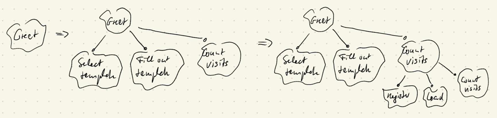

---

<!-- Page 130 of 493 -->

05-KomplementärcodiereninderKompliziertheit 121
1 [Fact]
2 public void Count_test() {
3 HelloBackend.Count(new[] {"X", "A", "Y", "a"}, "A").Should().Be(2);
4 }
1 public static int Count(IEnumerable<string> visitors, string name)
2 => visitors.Count(v => v.Equals(name, StringComparison.InvariantCultureIgnoreCase));
Insbesondere mit der Power von C# Linq ist die Lösung ein trivialer
Einzeiler. Aber auch eine explizite Schleife über die visitors würde die
Lösung nicht viel schwieriger machen.
Dass in den Testdaten keine Namen stehen, sondern nur Buchstaben,
soll helfen, auf das Wesentliche zu fokussieren. Es geht bei der Zählung
nicht wirklich um Namen, d.h. um Zeichenketten mit einer bestimmten
Bedeutung (für einen Benutzer), sondern lediglich darum, Zeichenketten
“derselben Form” zu zählen - wobei hier “A” und “a” als formgleich
angesehenwerden.MitpraxisnahenZeichenkettenwürdedieForminden
Hintergrund treten. Es könnte wichtig erscheinen, dass es sich um Namen
handelt - was es nicht ist.
Domäne II - Vorlage wählen
Ebenfalls trivial ist die Auswahl einer Vorlage für die Begrüßung.
1 [Theory]
2 [InlineData(1, "Hello, {0}!")]
3 [InlineData(2, "Welcome back, {0}!")]
4 [InlineData(3, "Hello my good friend, {0}!")]
5 [InlineData(4, "Hello my good friend, {0}!")]
6 [InlineData(25, "Hello my good friend, {0}! Congrats! You are now a platinum guest!")]
7 [InlineData(26, "Hello my good friend, {0}!")]
8 public void Select_template_test(int numberOfVisits, string expectedTemplate) {
9 HelloBackend.Select_template(numberOfVisits).Should().Be(expectedTemplate);
10 }

---

<!-- Page 131 of 493 -->

05-KomplementärcodiereninderKompliziertheit 122
1 public static string Select_template(in int numberOfVisits)
2 => numberOfVisits switch {
3 1 => "Hello, {0}!",
4 2 => "Welcome back, {0}!",
5 25 => "Hello my good friend, {0}! Congrats! You are now a platinum guest!",
6 _ when numberOfVisits >= 3 => "Hello my good friend, {0}!"
7 };
DieseMethodeistdasHerzderGesamtlösung.DeshalbsinddieTestsauch
so ausführlich, obwohl alle Fälle auch schon im Akzeptanztest abgedeckt
sind.
Domäne III - Vorlage ausfüllen
1 private static string Fill_out(string template, string name)
2 => string.Format(template, name);
Das Ausfüllen der Vorlage ist so trivial, dass nicht einmal ein Test nötig
erscheint. Eine schon getestete Standardfunktion übernimmt die Arbeit
vollständig.
Dennoch ist dieser Aspekt herausgezogen in eine eigene Funktion, um
dem Aufruf der Standardfunktion eine Bedeutung innerhalb der Domäne
zu geben. Damit wird die Logik auf das Abstraktionsniveau der anderen
Aspekte gehoben. Und sie wird testbar, sollte sich doch herausstellen, dass
daran etwas zu verändern ist.
Persistenz
Auch wenn die Persistenz zunächst in zwei Teilprobleme zerlegt wurde,
kann diese Entscheidung bei der konkreten Codierung revidiert werden.
Das separate Testen der Lösungen für die Teilprobleme schien ohnehin
umständlich,alsolageingemeinsamerTestvonLesenundSchreibennahe.
Und nun scheint auch die Trennung der beiden Aspekte umständlich. Sie
können auch in einer Funktion zusammengefasst werden, allemal, da ihre
Implementation mit C# jeweils nur eine Zeile Logik umfasst.

---

<!-- Page 132 of 493 -->

05-KomplementärcodiereninderKompliziertheit 123
1 [Fact]
2 public void Update_test() {
3 const string TEST_DB = "test_visitors.txt";
4 File.Delete(TEST_DB);
5
6 HelloBackend.Update_visitor_list(TEST_DB, "X")
7 .Should().BeEquivalentTo(new[] {"X"});
8 HelloBackend.Update_visitor_list(TEST_DB, "Y")
9 .Should().BeEquivalentTo(new[] {"X","Y"});
10 HelloBackend.Update_visitor_list(TEST_DB, "X")
11 .Should().BeEquivalentTo(new[] {"X","Y","X"});
12 HelloBackend.Update_visitor_list(TEST_DB, "y")
13 .Should().BeEquivalentTo(new[] {"X","Y","X","y"});
14 }
1 public static IEnumerable<string> Update_visitor_list(string filepath, string name) {
2 File.AppendAllLines(filepath, new[]{name});
3 return File.ReadAllLines(filepath);
4 }
Der Test involviert jetzt eine Ressource, die Datei mit der Liste der
Gäste.⁵⁵ Das kann nicht vermieden werden, auch wenn er damit ein
wenig umständlicher wird. Es ist ein Anfangszustand auf der Festplatte
herzustellen, der in mehreren Testschritten ausgebaut wird. Ein solcher
kleiner Szenariotest scheint einfacher zu sein, als mehrere einzelne Tests,
die auf unterschiedlichen Anfangszuständen arbeiten.
Außerdem muss bei diesem Vorgehen nicht bekannt sein, wie das “Da-
tenbankformat” aussieht. Wenn es sich verändern sollte, hat das keine
Auswirkung auf den Test. Anders wäre es, wenn er auf einer “Beispiel-
datei” mit vorgegebenem Inhalt aufsetzen würde. Die müsste dem Format
entsprechen, das Update_visitor_list() erwartet.
Integration
Inder top-downZerlegung war dasTeilproblemder Zählungder Besuchs-
anzahlvordemHintergrundderGästelisteeinhilfreicherZwischenschritt.
Inderbottom-upImplementationhingegenkannesübersprungenwerden.
Um angesichts des insgesamt sehr überschaubaren Problems zügig zur
Reife zu gelangen, können die nun vorliegenden Lösungen der Blatt-
Probleme sofort in der Wurzel-Funktion integriert werden:
⁵⁵NunverrateichdochetwasausderMusterlösung:fürdiePersistenzwurdealsFormat
eineListeallerGästenameninderReihenfolgeihrerRegistrierunggewählt.Immerwennsich
ein Gast anmeldet, wird der Name stumpf am Ende der Liste angefügt. Namen tauchen in
der“Datenbank”alsomehrfachauf.IchhattemichgegeneineSpeicherungvonName-Wert-
Paare entschieden, wo bei jedem Namen eines Gastes die Zahl seiner Besuche gespeichert
wird.

---

<!-- Page 133 of 493 -->

05-KomplementärcodiereninderKompliziertheit 124
1 public string Greet(string name) {
2 var visitors = Update_visitor_list(_filepath, name);
3 var numberOfVisits = Count(visitors, name);
4 var template = Select_template(numberOfVisits);
5 return Fill_out(template, name);
6 }
Solche Integration ist trivial und muss in den meisten Fällen nicht einmal
getestet werden. Denn zu testen wäre ja nicht, ob die Logik in den
aufgerufenen Funktionen korrekt ist, sondern ob die Funktionen in
der richtigen Reihenfolge mit den richtigen Parametern aufgerufen
werden. Das jedoch sollte allermeistens trivial sein.
Eine Ausnahme macht aber natürlich die API-Funktion, die Funktion,
die das Ausgangsproblem darstellt. Sie muss immer gegen ihre Reifetests
gehalten werden.
Da die schon angelegt wurden, lässt sich nach Ausfüllen von Greet()
sofortfeststellen,ob“dieTheorie”,diehinterderZerlegungsteht,zueinem
praktischen Erfolg führt. “Die Theorie” der Zerlegung lautet immer:
“WennalleBlatt-Problemegelöstundkorrektimplementiertsindund
wenn diese Lösungen korrekt integriert werden, dann ist auch das
Ausgangsproblem korrekt gelöst.”
Mit noch ein wenig Infrastrukturcode dazu
1 public class HelloBackend
2 {
3 private readonly string _filepath;
4
5 public HelloBackend(string filepath) {
6 _filepath = filepath;
7 }
8 ...
zeigt sich, dass die Theorie korrekt war.
Refaktorisierung
Auch wenn die Komposition in Greet() sehr übersichtlich ist, ließe sich
die Verständlichkeit vielleicht noch durch etwas mehr Struktur erhöhen.
Allemal aus didaktischen Gründen soll das hier geschehen um dir zu
zeigen, wie einfach es ist, Integrationen zu refaktorisieren.
Mit Leerzeilen (vertical whitespace) können Alternativen der Gruppie-
rung von Funktionsaufrufen einfach durchgespielt werden. Überleg mal,
welche Funktionsaufrufe für dich inhaltlich näher zusammen gehören
würden?

---

<!-- Page 134 of 493 -->

05-KomplementärcodiereninderKompliziertheit 125
1 // Variante 1
2 public string Greet(string name) {
3 var visitors = Update_visitor_list(_filepath, name);
4 var numberOfVisits = Count(visitors, name);
5
6 var template = Select_template(numberOfVisits);
7 return Fill_out(template, name);
8 }
9
10 // Variante 2
11 public string Greet(string name) {
12 var visitors = Update_visitor_list(_filepath, name);
13
14 var numberOfVisits = Count(visitors, name);
15 var template = Select_template(numberOfVisits);
16 return Fill_out(template, name);
17 }
18
19 // Variante 3
20 public string Greet(string name) {
21 var visitors = Update_visitor_list(_filepath, name);
22
23 var numberOfVisits = Count(visitors, name);
24
25 var template = Select_template(numberOfVisits);
26 return Fill_out(template, name);
27 }
Für etwas mehr Verständlichkeit könnte es ausreichen, zwischen die
Funktionsaufrufe einfach nur Leerzeilen einzuziehen, um Blöcke höherer
Kohäsion von einander zu trennen. Das Auge des Lesers erkennt dann
zumindest getrennte Bedeutungseinheiten, auf die es sich konzentrieren
kann bei der Analyse.
AberdieGründefürdieFavorisierungdereinenVariantestattderanderen
können vielfältig und subjektiv sein. Sie können sich auch über die Zeit
ändern. Ein Anhaltspunkt ist in jedem Fall aber, wie leicht es fällt, eine
Gruppierung “mit einem Titel zu versehen”.
In einem nächsten Schritt können diese Blöcke deshalb mit einem Kom-
mentar versehen werden, um dem Leser Analysearbeit zu ersparen. Er
muss dann nicht aktiv deuten, was eine Gruppe von Funktionsaufrufen
leistet, sondern kann es “auf einen Blick” dem Kommentar entnehmen,
z.B.

---

<!-- Page 135 of 493 -->

05-KomplementärcodiereninderKompliziertheit 126
1 // Variante 1
2 public string Greet(string name) {
3 // Increment persistent number of visits for visitor
4 var visitors = Update_visitor_list(_filepath, name);
5 var numberOfVisits = Count(visitors, name);
6
7 // Compose greeting for visitor depending on his/her number of visits
8 var template = Select_template(numberOfVisits);
9 return Fill_out(template, name);
10 }
Aber noch besser ist die Einfassung von solchen Sinnabschnitten in
wiederum eigene Funktionen:
1 public string Greet(string name) {
2 var numberOfVisits = Increment_number_of_visits(name);
3 return Compose_greeting(name, numberOfVisits);
4 }
5
6 private int Increment_number_of_visits(string name) {
7 var visitors = Update_visitor_list(_filepath, name);
8 return Count(visitors, name);
9 }
10
11 private static string Compose_greeting(string name, int numberOfVisits) {
12 var template = Select_template(numberOfVisits);
13 return Fill_out(template, name);
14 }
Das hat mindestens drei Vorteile:
• Die Ausgangsfunktion wird übersichtlicher, da in ihr die Zei-
lenzahl schrumpft. Wo durch Leerzeilen und evtl. Kommentare
der Umfang noch gewachsen ist, ist er durch die Extraktion zu-
rückgegangen. Du kannat beim Lesen die Bedeutung nun schneller
ermitteln.ZweiProblemlösungsschrittesindbesserzuverstehenals
vier.
• Es sind Teillösungen entstanden, die sich wiederum bei Bedarf
leicht testen lassen. Das ist hilfreich, falls die Reife noch zu wün-
schen übrig lässt. Dann können weitere Tests an diese Funktionen
angelegt werden, um den Bug einzugrenzen.⁵⁶
• AspektederLösungsindbequemzusammengefasstundkönnenggf.
in anderen Zusammenhängen ebenfalls benutzt werden.
⁵⁶Der Griff zum Debugger mag dir näher liegen, doch zieht sich Debugging oft lange
hin,hinterlässtabervorallemkeineSpuren.Erkenntnisgewinnewerdennichtdokumentiert.
Außerdem können Tests bei späteren Veränderungen für neue Features hier nachträglich
angelegtwerden.

---

<!-- Page 136 of 493 -->

05-KomplementärcodiereninderKompliziertheit 127
Reflexion
Dieses Beispiel war weniger “algorithmisch” als das vorherige. Hier ging
es nicht nur um Domänenlogik, sondern auch um Infrastruktur (Persis-
tenz). Diese Mischung kann als Hilfe bei der Einschätzung des Schwierig-
keitsgrades angesehen werden: Liegt eine solche Mischung von Belangen
(concerns) vor, solltest du das Problem sofort als kompliziert auffassen.
Domänenlogik und “andere Logik” sollte nicht zusammen mit inkremen-
tellen Tests entwickelt werden. Gemischte Probleme sind nie naheliegend.
Gleichzeitig liefern gemischte Belange Hinweise auf Teilprobleme. Sie
können als Zerlegungs- und Strukturierungshilfsmittel angesehen wer-
den.
Die Zerlegung in Teilprobleme macht dann das Gesamtproblem handhab-
bar. Der top-down wachsende Problembaum bildet einen Plan für die
bottom-up Codierung. Wie jeden Plan solltest auch diesen aber nicht als
Dogma betrachten. Nur weil bei der Zerlegung etwas sinnvoll erschien,
muss es bei der Codierung nicht auch so umgesetzt werden. Beispiele
dafür waren in diesem Szenario das Teilproblem der Besuchszählung und
die Persistenz.
Bottom-upCodierungderLösung
Und umgekehrt kann es sich später als verständnissteigernd erweisen, die
Teillösungen nochmal anders zu gruppieren, wie es in der Refaktorisie-
runggeschehenist.WarumwurdewährendderZerlegungnichtschonein
Teilproblem für die Funktion Compose_greeting() erkannt, sondern
stattdessen sofort zu den darunter liegenden Teilproblemen gesprungen?
Eine Antwort auf solche Fragen lässt sich nicht immer finden und ist auch
nicht immer wichtig. Solange die Teilprobleme trivial bis einfach waren,
hatte die Zerlegung ihren Zweck erfüllt.
In der Analysephase (Zerlegung) ist dein Mindset ein anderes als in der
Synthesephase (Implementierung). Der Wechsel zwischen den Blickwin-
keln enthüllt manchmal Probleme oder Lösungen, die du vorher nicht
gesehenhast.Insofernistdasstepwiserefinement2.0 keineEinbahnstraße.

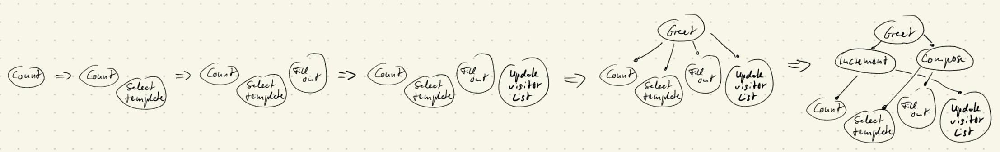

---

<!-- Page 137 of 493 -->

05-KomplementärcodiereninderKompliziertheit 128
DieLösungenderkomplementärenTeilproblemepassenhorizontalwieSchlüsselundSchlös-
serzusammen.
Zusammenfassung
Auch wenn es noch eine Lücke zwischen komplizierten Problemen und
dem Chaos gibt, behaupte ich: die meisten Probleme sind kompliziert.Die
Methode der schrittweisen Zerlegung solltest du deshalb als default
ansehen. Sie ist das erste Werkzeug, mit dem du versuchen solltest,
Codierungsprobleme anzugehen, nachdem du erkannt hast, dass du
nicht vor einem Chaos stehst.
Wenn du bei der Zerlegung feststellen solltest, dass das vorliegende
Problem insgesamt doch nur einfach oder gar trivial ist, ist das nicht
schlimm. Du hast keine Zeit verschwendet. Anders herum jedoch kann
dein Codierungserlebnis schnell frustrierend werden. Wenn du kom-
plizierte Probleme als einfach missverstehst, läufst du Gefahr, dir die
Codierung schwerer als nötig zu machen.
Außerdemliefertstepwiserefinement2.0 durchdasPrinzipIOSP“ausdem
Stand” sehr verständlichen und testbaren Code.
Wenn du eine Lösung mit der Methode für einfache Probleme gefunden
hast, bleibt gewöhnlich noch ein größerer Refaktorisierungsaufwand. Der
soll zwar durch ein strenges Vorgehen nach classical TDD vermieden
werden, dessen Schritte red-green-refactor lauten - doch die Praxis zeigt,
dass die Refaktorisierung “unterwegs” oft übersprungen wird. Und selbst

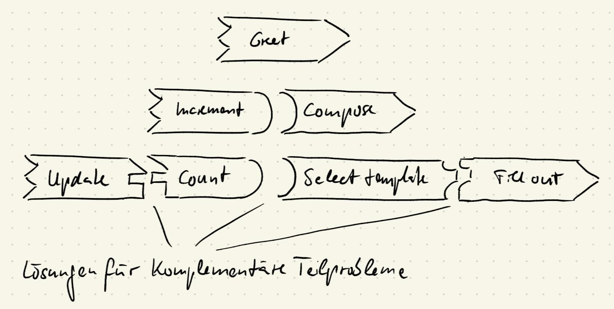

---

<!-- Page 138 of 493 -->

05-KomplementärcodiereninderKompliziertheit 129
wenn nicht, entstehen durch das “pear programming” Lösungen, die
womöglich schwieriger zu refaktorisieren sind.
Classical TDD hat sein Einsatzgebiet - nur lautet hier meine Empfehlung,
mit stepwise refinement 2.0 zu beginnen, um von vornherein einen bes-
seren Überblick zu bekommen, die eigentliche Problemlösung nicht zu
vertagen auf die Erfüllung der inkrementellen Tests und von vornherein
eine saubere Hierarchie von vielen kleinen, gut testbaren Methoden
herzustellen.

---

<!-- Page 139 of 493 -->

05-KomplementärcodiereninderKompliziertheit 130
Übungsaufgaben
Reflexionsaufgabe
Bitte formuliere eine Frage oder eine Erkenntnis zum Kapiteltext.
• Wo bist du gedanklich hängengeblieben, was ist dir unklar,
was passt für dich irgendwie nicht zusammen, wozu würdest
du dir noch etwas mehr Erklärung wünschen? Steht irgendet-
waszudeinerbisherigenPraxisimWiderspruchunddufragst
dich, warum du etwas ändern solltest?
• Oder: Wann hast du einen Aha-Moment gehabt, was ist
diralsbemerkenswert,spannend,ausprobierenswertaufgefal-
len? Hat irgendetwas “in dir Klick gemacht”, weil dir nun ein
Zusammenhang aufgegangen ist? Oder verstehst du jetzt aus
deiner bisherigen Praxis irgendetwas besser?
Am besten formulierst du Frage bzw. Erkenntnis schriftlich. Indem
du deine Gedanken aufschreibst, wirst du dir ihrer bewusster. Bei
einer Frage kommst du dadurch vielleicht schon einer Antwort aus
dir selbst heraus näher. Bei einer Erkenntnis fällt dir vielleicht schon
etwas ein, das du ab jetzt anders machen kannst.
Aufgabe 1 - Römische Zahlen kompliziert
wandeln
Geschätzte Bearbeitungsdauer: 15min
Anforderungen
Wandle eine römische Zahl in ihr dezimales Äquivalent um, z.B.
würde aus MCMLXXXIV die Dezimalzahl 1984.
Die Funktion wird nur mit gültigen römischen Zahlen aufgerufen.
TODO: Zerlege in komplementäre Teilprobleme

---

<!-- Page 140 of 493 -->

05-KomplementärcodiereninderKompliziertheit 131
Das Problem der Wandlung römischer Zahlen in dezimale ist dir
schon bekannt. Anders als in der früheren Übung zur Wandlung
römischer Zahlen, löse es jetzt jedoch mittels stepwise refinement
2.0. Verstehe das Problem als kompliziert und finde komplementäre
Teilprobleme, die das Gesamtproblem konstituieren.
• Finde für jedes Teilproblem eine Funktionssignatur
• Beschreibe dein Verständnis jedes Teilproblems mit mindes-
tens einem Testfall, der zur Funktionssignatur passt.
Eine Implementation der Funktionen ist nicht nötig!
Aufgabe 2 - Game of Life
Geschätzte Bearbeitungsdauer: 120min
Entwickle ein Programm, das die nächsten N Generationen einer
Game-of-LifeWeltberechnet.EineausführlicheDarstellungderIdee
von Game-of-Life findest du bei Wikipedia.
Oberfläche
Das Programm soll auf der Kommandozeile aufgerufen werden
können wie folgt:
1 $ gol 3 world.txt
2 ...
3 $
DasErgebnissindindiesemFallDateienmitdenNamenworld-1.txt,
world-2.txt, world-3.txt mit den berechneten Generation im
selben Format wie die Eingangsdatei.
Für jede Generation gibt das Programm einen Punkt als Fortschritts-
indikator aus.
Dateiformat

---

<!-- Page 141 of 493 -->

05-KomplementärcodiereninderKompliziertheit 132
Eingabe- und Ergebnisdateien bestehen aus Textzeilen, in denen
leere/tote Zellen durch ein . repräsentiert werden und lebendige
durch ein X. Für
Blinker
wäre der Dateiinhalt
1 .....
2 .....
3 .XXX.
4 .....
5 .....
Alle Zeilen in einer Datei sind gleich lang. Die Zahl der Zeilen muss
aber nicht der Zeilenlänge entsprechen. “Welten” müssen also nicht
quadratisch sein.
Akzeptanzkriterien
Funktionssignatur
Die Lösung soll am Ende ein Programm sein. Als Ganzes ist das
jedoch schwer zu testen. Deshalb wird eine API-Funktion herausge-
zogen, für die das leichter fällt:
1 void Evolve(int numberOfGenerations,
2 string seedWorldFilename,
3 Action onGeneration)
DieseFunktionerzeugtfürdieEingangsdateilediglichdieGeneratio-
nendateien und macht dabei selbst keine Fortschrittsanzeige.
• numberOfGenerations : die Zahl der zu berechnenden
Generationen (>0)
• seedWorldFilename : Name der Eingangsdatei mit der
Welt, deren Entwicklung simuliert werden soll. Aus dem
Namen werden die Namen der Ergebnisdateien abgeleitet.

---

<!-- Page 142 of 493 -->

05-KomplementärcodiereninderKompliziertheit 133
• onGeneration : Über diesen Parameter wird der Funktion
ein Event Handler übergeben, d.h. ein Zeiger auf eine ande-
re Funktion, hier mit der Form void f(). Diese Funktion
soll immer dann aufgerufen werden, wenn eine Generation
berechnet und gespeichert wurde. So kann “das Umfeld”,
in dem Evolve() aufgerufen wird, eine Fortschrittsanzeige
vornehmen.
Beispielnutzung:
1 Evolve(3, "world.txt",
2 () => Console.WriteLine(".")
3 );
Akzeptanzkriterium 1
Input
• numberOfGenerations: 1
• seedWorldFilename: block.txt - mit folgendem Inhalt
(Download hier):
1 ....
2 .XX.
3 .XX.
4 ....
Output
• Der Event Handler soll 1x aufgerufen worden sein.
• EswurdedieDateiblock-1.txtgeschrieben,diedenselben
Inhalt hat wie die Eingangsdatei.
Akzeptanzkriterium 2
Input
• numberOfGenerations: 2
• seedWorldFilename: blinker.txt - mit folgendem In-
halt (Download hier):

---

<!-- Page 143 of 493 -->

05-KomplementärcodiereninderKompliziertheit 134
1 .....
2 .....
3 .XXX.
4 .....
5 .....
Output
• Der Event Handler soll 2x aufgerufen worden sein.
• EswurdendieErgebnisdateienblinker-1.txt,blinker-2.txt
geschriebenmitfolgendemInhalt(Downloadhierundhier):
1 .....
2 ..X..
3 ..X..
4 ..X..
5 .....
1 .....
2 .....
3 .XXX.
4 .....
5 .....
Akzeptanzkriterium 3
Input
• numberOfGenerations: 1
• seedWorldFilename: blinker.txt
Output
• Der Event Handler soll nur 1x aufgerufen worden sein.
• Es existiert nur die Ergebnisdatei blinker-1.txt wie im
2. Beispiel! Eine eventuell vorher generierte Ergebnisdatei
blinker-2.txt existiert nicht mehr.
TODO 1: Zerlegen
Zerlege das Ausgangsproblem schrittweise in komplementäre Teil-
probleme inkl. Ideen für Testfälle. Versuche dabei das IOSP so weit
wie möglich einzuhalten. Merke dir, wo du meinst, dass das IOSP
nicht einzuhalten ist.
Die Zerlegung sollte nicht in der IDE stattfinden, sondern auf Papier
oder in einem normalen Texteditor. Du sollst dich voll darauf kon-
zentrieren können und nicht durch eine IDE abgelenkt werden.

---

<!-- Page 144 of 493 -->

05-KomplementärcodiereninderKompliziertheit 135
TODO 2: Implementieren
Implementiere deine Zerlegung test-first bottom-up. Nur die Akzep-
tanztestsschreibstdueinmalamAnfang;alleweiterenTestsimPaar
mit den jeweiligen Funktionen, die du implementierst.
https://en.wikipedia.org/wiki/Conway’s_Game_of_Life
https://gitlab.com/programming-with-ease-books/test-first-
codierung/-/blob/master/%C3%9Cbungsaufgaben%2005/block.txt
https://gitlab.com/programming-with-ease-books/test-first-
codierung/-/blob/master/%C3%9Cbungsaufgaben%2005/blinker.txt
https://gitlab.com/programming-with-ease-books/test-first-
codierung/-/blob/master/%C3%9Cbungsaufgaben%2005/blinker-1-
goldmaster.txt
https://gitlab.com/programming-with-ease-books/test-first-
codierung/-/blob/master/%C3%9Cbungsaufgaben%2005/blinker-2-
goldmaster.txt

---

<!-- Page 145 of 493 -->

06 - Tests als Treiber der
Modularisierung
Ordnung herzustellen durch Modularisierung, sollte dir so wichtig sein,
dass du das nicht bis zur Codierung aufschiebst. Wie deine Logik am
besteninModulezusammengefasstwird,bedenkstduambestenwährend
einer expliziten Entwurfsphase vor der Codierung. Erinnere dich an die
Anforderung-Logik Lückeund wiedie in dreiSchritten überwundenwird.
Die Codierung ist darin nur der letzte Schritt.
WenndumitderCodierungbeginnst,solltealsoklarsein,welcheFunktio-
nen du in welchen Modulen implementierst. Diesen “Plan” beschreibt das
Modell. Den arbeitest du Funktion für Funktion ab und überprüfst dabei
jede, welchem Schwierigkeitsgrad sie angehört. Dem angepasst wählst du
dann die Variante eines test-first Vorgehens.
Was die Modellierung liefert, sind hoffentlich nur triviale und einfache
Probleme, aber es kann auch passieren, dass du vor einem komplizierten
oder gar schwierigeren stehst.
Falls du aber noch keine Übung in der Modellierung hast, beginnst du mit
der Codierung womöglich mit einer begrenzten Vorstellung von sinnvol-
len Modulen. Oder trotz rechtschaffender Modellierung gewinnst du bei
derCodierungweitereErkenntnisse,diedievorgedachteModularisierung
in einem neuen Licht dastehen lassen.
TDDstehtursprünglichfürTest-DrivenDevelopment.Esgibtjedochauch
die Übersetzung Test-Driven Design, also testgetriebener Entwurf. Die
Vorstellung, dass ein test-first Vorgehen Hinweise auf die Strukturierung
von Code, auf seine Modularisierung liefern kann, ist mithin nicht neu.
Die Idee dahinter ist, dass Tests “Druck ausüben” auf Logik. Unter dem
soll sie sich so formen, dass sie zumindest gut testbar ist, wenn nicht sogar
leicht verständlich, also in Summe korrekt und ordentlich.

---

<!-- Page 146 of 493 -->

06-TestsalsTreiberderModularisierung 137
Akzeptanztests
DerDruckderTestsaufdieStrukturvonSoftwarebeginntschonwährend
der Anforderungsanalyse. Deren Ziel ist es, eine Liste von Funktionen mit
zugehörigen Testfällen zu produzieren. Die Gesamtlogik einer Software
wird damit grundsätzlich “vertikal” geteilt in Durchstiche, der jeder für
sich ein Inkrement darstellt. Dadurch entstehen Untermengen an Logik,
die getrennt zur Reife gebracht werden können. Dadurch entstehen au-
ßerdem verschiedene Perspektiven auf die Logik für Regressionstests.
Diese Strukturierung wird von außen durch Ansprüche an die Benut-
zerschnittstelle und andere nicht-funktionale Anforderungen (z.B. Ska-
lierbarkeit) getrieben. Selbst ohne nachfolgende Modellierung wäre die
Codierung also schon nur noch mit einzelnen Funktionen - den API-
Funktionen der Akzeptanztests - konfrontiert, die eine nach der anderen
implementiert werden kann.
Allerdingsistanzunehmen,dassdiedurchdievonderAnalysegelieferten
API-Funktionen repräsentierte Logik zu umfangreich ist, als dass du sie
direkt mit der Codierung angehen solltest. Einen Entwurf vorzuschalten,
kann ich dir nur wärmstens empfehlen.
FehlensolcheFunktionenmitAkzeptanztestfällen(allgemeiner:Nutzungs-
beispielen), ist die Situation deshalb noch als chaotisch anzusehen. Der
WunschnachautomatisierbarenAkzeptanztestsistderWunsch,Ordnung
ins Chaos zu bringen. Jede Funktionssignatur mit zugehörigen Testfällen
ist ein Schnitt durchs Chaos, mit dem wieder ein Bereich von gewisser
Ordnung demarkiert wird.
Ein Beispiel:
Entwickle eine Software zur Verwaltung eines Aktiendepots. Sie soll
Aktienkäufe und -verkäufe aufzeichnen und Kurse durch Abfrage
eines online Dienstes aktualisieren.
Mit dieser Problembeschreibung wirst du ins Chaos katapultiert. Du
magst dir darunter etwas vorstellen können, weil du Ähnliches auf der

---

<!-- Page 147 of 493 -->

06-TestsalsTreiberderModularisierung 138
Homepage deiner Bank oder in einer Smartphone-App gesehen hast, doch
aus der Perspektive der Codierung stehst du bis zum Hals im Chaos.
Sobald jedoch auch nur eine Funktion identifiziert wurde, ändert sich die
Situation:
Eine Übersicht des aktuellen Depotbestandes wird nach Aufruf der
folgenden Funktion angezeigt. Dafür wird der online Dienst konsul-
tiert, um die aktuellen Kurse zu liefern. Die Software speichert das
Depot auf der lokalen Festplatte.
1 Depoteintrag[] Aktueller_Depotbestand()
2
3 class Depoteintrag {
4 public string WKN;
5 public string Bezeichnung;
6
7 public DateTime Kaufdatum;
8 public decimal Kaufkurs;
9 public int Stückzahl;
10 public decimal Kaufwert;
11
12 public decimal AktuellerKurs;
13 public decimal AktuellerWert;
14 }
Akzeptanzkriterien:
1 # Input
2 keiner
3
4 # Zustand
5 ## Lokal: Depotbestand
6 WKN;Bezeichnung;Kaufdatum;Kaufkurs;Stückzahl
7 A14TK6;PowerCell Sweden;12.3.20;17,00;10
8 552484;Netflix;15.11.19;275,00;12
9
10 ## Remote: Aktuelle Werte vom online Service
11 WKN;AktuellerKurs
12 A14TK6;22,92
13 552484;380,60
14
15 # Output
16 ## Erwartete Depoteinträge wie von der Funktion zurückzugeben:
17 WKN;Bezeichnung;Kaufdatum;Kaufkurs;Stückzahl;Kaufwert;AktuellerKurs;AktuellerWert
18 A14TK6;PowerCell Sweden;12.3.20;17,00;10;170,00;22,92;229,20
19 552484;Netflix;15.11.19;275,00;12;3300,00;380,60;4567,20
Jetzt herrscht Klarheit! Das Chaos ist vertrieben. Nicht, dass du nun keine
Fragen mehr hättest, aber es gibt einen klaren Ansatzpunkt für Entwurf
und Codierung.
Von der insgesamt für die Software zu schreibenden Logik liegt noch alles
im Dunkeln. Doch es zeichnet sich eine erste grobe Struktur ab: da ist die
Logik, die den Depotbestand berechnet - und es gibt den noch nicht näher

---

<!-- Page 148 of 493 -->

06-TestsalsTreiberderModularisierung 139
beschriebenen Rest. Das Ganze besteht also aus mindestens zwei Teilen
die auch noch irgendwie zusammenhängen.
Der Akzeptanztest (und potenziell weitere) hat einen klaren Ansatzpunkt,
über den er die Logik zuerst auf Reife und später auf Stabilität prüfen
kann.
NureinTeildesGesamtproblemswurdebishersokonkretisiert,dassesdurcheineFunktion
mitAkzeptanztestsverständlichbeschriebenist.DerRest“liegtnochimChaos”.
Weitere Funktionen mit eigenen Akzeptanztests werden dazu kommen
und daneben gestellt werden, bis das ganze Problem bzw. die zu seiner
Lösung nötige Logik durch sie zugänglich und abgedeckt sind:

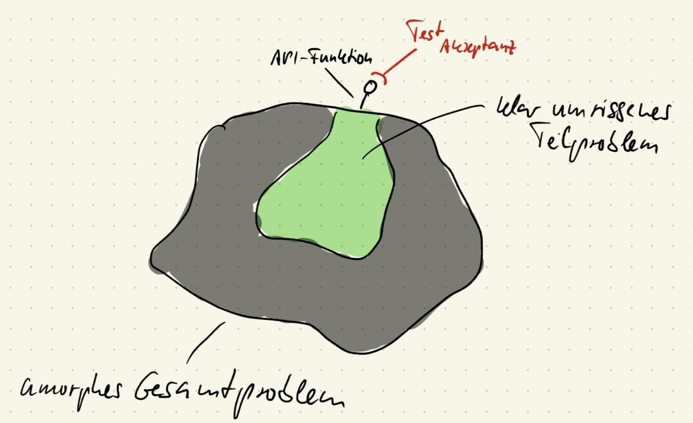

---

<!-- Page 149 of 493 -->

06-TestsalsTreiberderModularisierung 140
Das gesamte Problem ist abgedeckt durch inkrementelle Teilprobleme repräsentiert durch
FunktionenundAkzeptanztests.
Ob all diese von der Analyse spezifizierten API-Funktionen demselben
Modul angehören, sei an dieser Stelle dahingestellt. Das ist eine Sache
des Entwurfs. Zumindest aber haben Tests überhaupt zu einer ersten
Strukturierunggeführt;derEntwurfistaufgerufen,mitweiterenModulen
zu präzisieren.
Durch Akzeptanztests wird von Logik erstmalig gefordert, überhaupt
testbar zu sein. Der Wunsch nach klar umrissenen Beispielen führt dazu,
dass Funktionen als testbare Ansatzpunkte in eine ansonsten noch amor-
phe, unbekannte Codemasse eingeprägt werden. Testfälle üben Druck auf
Logik aus wie ein Hammer mittels Punze auf ein Stück Metall.
Triviale Probleme
Triviale Probleme sind solche, denen nur Akzeptanztests/Reifetests gegen-
überstehen und deren Lösung du aus dem Stand in der zu testenden API-
Funktion codiert kannst; du arbeitest gleich am Produktionscode. Von
trivialen Problemen ist zunächst nicht zu erwarten, dass Tests zu einer
weiteren Strukturierung führen.

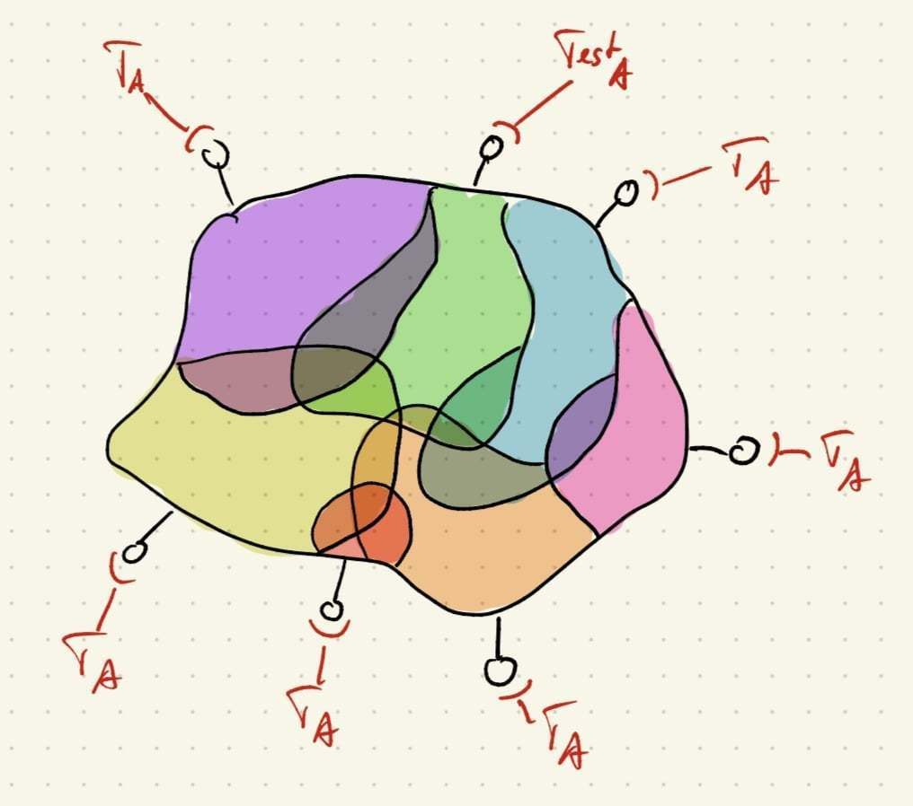

---

<!-- Page 150 of 493 -->

06-TestsalsTreiberderModularisierung 141
Einfache Probleme
Bei einfachen Probleme treten zu den Akzeptanztests noch inkrementelle
Testshinzu.DieLösung/dieLogikistdirzunächstunbekannt;duwillstsie
mit den Tests schrittweise entwickeln. Dabei kannst du weitere Erkennt-
nissegewinnen,dieeineVerfeinerungderStrukturnahelegen.Insbesonde-
re cTDD empfiehlt eine Überprüfung auf Refaktorisierungspotenzial nach
jedem inkrementellen Test, der erfolgreich “begrünt” wurde. Leitfrage ist
dabei “Lassen sich Dopplungen im Code erkennen, die zusammengeführt
werden können?”
DieLösungeineseinfachenProblemswirdschrittweisedurchmehrundmehrinkrementelle
Tests vorangetrieben, die alle auf der ursprünglichen Funktion ansetzen, auch wenn durch
zwischenzeitlicheRefaktorisierungweitereFunktionenentstehen.
Funktionen, die durch Refaktorisierung mittels Extraktion entstehen, wer-
den dabei nicht selbst unter Test gestellt. Alle Tests laufen durch die
ursprüngliche Funktion (oder andere öffentliche, die daneben gestellt
werdenmüssen),Stichwort“pearprogramming”.DashatdenVorteil,dass
die Struktur unterhalb der Wurzel-Funktion sich jederzeit ändern kann,
ohne dass die Tests davon beeinflusst würden.

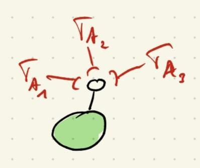

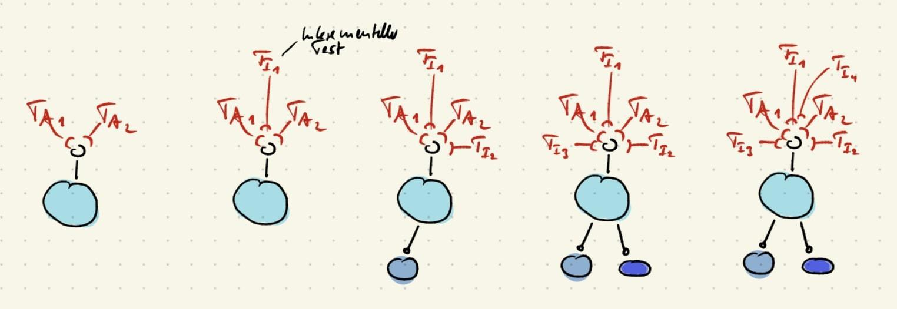

---

<!-- Page 151 of 493 -->

06-TestsalsTreiberderModularisierung 142
Komplizierte Probleme
KomplizierteProblemeführenausgehendvonderAPI-Funktionmitihren
Akzeptanztests zunächst zu weiteren, darunter hängenden Funktionen als
Repräsentanten für weniger schwierigere Teilprobleme.
Tests finden sich in diesem vorausgedachten Funktionsbaum oben auf
der integrierenden Wurzel-Funktion sowie auf den Blatt-Funktionen, den
Operationen. Manche davon sind trivial, andere einfach.
Ein kompliziertes Problem zerlegt in komplementäre Teilprobleme, deren Lösungen aber
nur dort getestet werden, wo Logik das Verhalten herstellt: in den trivialen oder einfachen
Operationen.
Anders als bei einfachen Problemen gibt es hier also Tests auf Funktionen,
die als Details angesehen werden könnten. Das hat aber den Vorteil,
dass du Logik sehr gezielt überprüfen kannst. Aber es hat auch einen
Nachteil: Sollte sich die Zerlegungsstruktur verändern müssen, müssen
auch Tests nachgezogen werden. Die Logik ist wunderbar testabgedeckt,
aberauchineinemTestkorsettfesteingeschnürt.FürhoheTestbarkeitund
Verständlichkeit zahlst du einen Preis in herabgesetzter Wandelbarkeit.

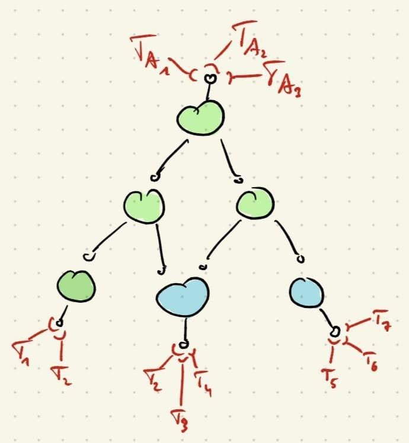

---

<!-- Page 152 of 493 -->

06-TestsalsTreiberderModularisierung 143
Gerüsttests
Tests, die nur “an der Oberfläche ansetzen” wie bei cTDD, sind unemp-
findlich gegenüber strukturellen Veränderungen hinter der Fassade der
Funktion, die für eine Gesamtlösung steht. Das ist auch der Fall bei
Akzeptanztests. Ihr Anspruch ist langfristige Relevanz zum Zwecke der
StabilitätssicherungdesVerhaltens.IhrAnspruchistnicht,einebesonders
hohe Testabdeckung zu gewährleisten. Akzeptanztests sind Tests von
Integrationen, mithin Integrationstests.⁵⁷
Logik allein mittels Akzeptanztests durch die API-Funktionen eines Pro-
blems hindurch zu entwickeln (“pear programming”), ist aus mehreren
Gründen nicht praktikabel. Das ist nur bei einem sehr überschaubaren
Umfang machbar, wie ihn maximal einfache Probleme haben. Wird
es schwieriger, muss eine Zerlegung in komplementäre Teilprobleme
vorgenommen werden, die weitere Ansatzpunkte für Tests liefern. Das
ist in der Praxis immer der Fall für die von der Analyse produzierten
Anforderungsausschnitte mit ihren API-Funktionen und Akzeptanztests.
Folgt man dabei dem IOSP, sammelt sich testwürdige Logik in den
Operationen “am Boden” des Zerlegungsbaumes und wird mit sehr nahen
und spezifischen Tests zur Reife geführt - die anschließend ein Klotz am
Bein sind:
• Diese Tests auf Operationen zwingen die Funktionen dazu, öffent-
lich zu sein, also Teil der Schnittstelle des Moduls, zu der die
Ausgangsfunktion an der Wurzel gehört.
• DieseTestsmachenVeränderungenandenDetailsschwer,weilUm-
strukturierungen des Produktionscodes in den Tests nachgeführt
werden müssen.
Als Beispiel mag die Musterlösung im Arbeitsbuch für das Game-of-Life
dienen:
⁵⁷Ich verstehe den Begriff hier sehr allgemein als Test von integrierender Leistung. Ob
dabei Infrastrukturnutzung im Spiel ist, halte ich für nebensächlich. Integrationstests über-
prüfenfürmichgrundlegendausschließlich,obBausteinewiegewünschtzusammengesteckt
wurden,umeinGesamtverhaltenzuerzeugen.

---

<!-- Page 153 of 493 -->

06-TestsalsTreiberderModularisierung 144
TestsaufOperationenzwingendiese“indieÖffentlichkeit”,weilsiesonstnichttestbarwären.
DieOberflächederLösungistdamitgrößeralsnötig;Strukturdetailssindsichtbar,dieNutzer
derLösungeigentlichnichtinteressierensollten.
Dieses Dilemma lässt sich jedoch leicht auflösen, wenn eine Prämisse
hinterfragt wird, die Testansätzen wie cTDD unterliegt: dass einmal
geschriebene Tests bestehen bleiben müssen.
Vorausgesetzt, dass der gesamte Code unter Versionsverwaltung wie z.B.
mit Git gehalten wird, kann diese Prämisse aufgegeben werden. Die be-
hindernden Tests kannst du löschen, ohne sie zu verlieren. Anschließend
kannst du allen Operationen die passende Sichtbarkeit geben und spätere
Umstrukturierung wird durch kein Testkorsett mehr behindert.
Tests der Blätter eines Zerlegungsbaumes sind flüchtig. Sie dienen der
Entwicklung von Reife der Operationen bis hinauf zur Ausgangsfunktion
- und werden danach entfernt. Wie ein Gerüst am Bau unterstützen sie
die Arbeit in einer entscheidenden Phase, um nach Fertigstellung zu
verschwinden. Ich nenne sie deshalb Gerüsttests (scaffolding tests).
Gerüsttests sind nur Reifetests, keine Regressionstests! Sobald die
Reife der Lösung für das Gesamtproblem mit seinem ganzen Zerlegungs-
baum durch bestandene Akzeptanztests attestiert ist und ein Codereview
die Lösung als ordentlich abgenommen hat, haben die Gerüsttests ihre
Schuldigkeit getan. Die Gerüsttests können gehen.

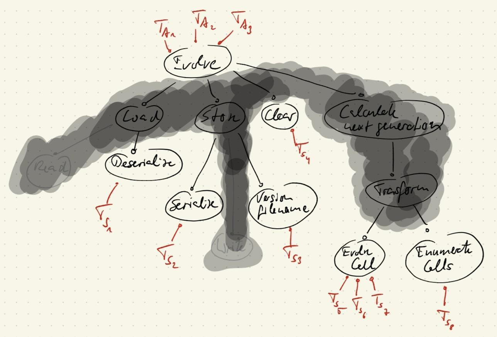

---

<!-- Page 154 of 493 -->

06-TestsalsTreiberderModularisierung 145
Von Gerüsttests überprüfte Funktionen verlieren ihre Korrektheit ja nicht,
nur weil die Gerüsttests gelöscht werden. Solltest du einen Gerüsttest
wieder benötigen, kannst du ihn in einem früheren Commit des Code-
Repository nachgeschlagen.
Die wesentlichen Merkmale einer Lösung stehen anschließend unter
permanenter “Aufsicht” der Akzeptanztests an der Wurzel. Für Nutzer
einer Lösung ist deren Oberfläche nun wieder minimal.
Ohne Gerüsttests ist eine Lösung frei, ihre Struktur zu ändern, ohne dass Tests nachgeführt
werden müssten. An der Oberfläche sind nach ihrem Abbau nur noch die API-Funktionen
zu sehen, an denen Akzeptanztests ansetzen. Funktionen, die für Gerüsttests noch public
waren,sindnunauf privategesetzt.
Akzeptanztests sind zunächst Reifetests und später permanente Regres-
sionstests. Gerüsttests sind anders: Sie sind ausschließlich temporäre
Reifetests. Das Konzept der Gerüsttests löst damit zwei Probleme, die
Entwickelnde oft plagen, die test-first oder gar nach classical TDD au-
tomatisiert testen wollen:
• Die Unzugänglichkeit von Logik verschwindet. Gerüsttests werden
dort angesetzt, wo sie möglichst punktgenau Logik testen, die das
braucht.EsbestehtkeinZwang,durcheinebestimmteFunktionhin-
durch Logik in tieferliegenden, verborgenen Funktionen zu testen.
Für Gerüsttests dürfen alle Funktionen öffentlich gemacht werden;
diese eigentlich unerwünschte Sichtbarkeit ist ja nur temporär.

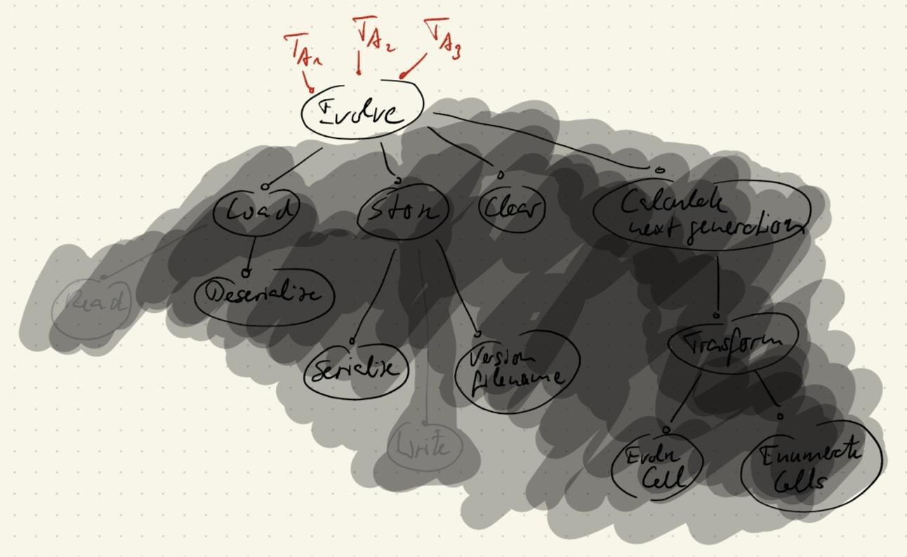

---

<!-- Page 155 of 493 -->

06-TestsalsTreiberderModularisierung 146
• Die Einschnürung von Logik verschwindet. Gerüsttests werden am
Ende wieder abgebaut. Ganz bewusst wird Code gelöscht, um nicht
zukünftig eine Last darzustellen. Zu wenige Tests sind nicht gut,
zu viele Tests aber auch nicht. Produktionscode-Logik kann nach
Abbau frei atmen, um sich wandelnden Anforderungen strukturell
anzupassen.
Code zu schreiben im Wissen, ihn später wieder zu löschen, lässt jetzt
in dir vielleicht Widerstand aufkommen. Die Vorstellung, dadurch Zeit
zu verschwenden, sitzt tief. Das ist eine verständliche, doch letztlich
unbegründete Angst:
• ErstenslässtsichjedergelöschteTestauseinemQuellcode-Repository
wieder zurückholen, wenn wirklich Bedarf sein sollte. Das Commit
bei dem Gerüsttests gelöscht werden, kannst du dafür mit einem
Tag kennzeichnen.
• Zweitens ist es weithin üblich, für allerlei Ergebnisse, die erzielt
werden sollen, Hilfestellungen zuerst auf- und später wieder ab-
zubauen. Gerüste an Gebäuden, die den Gerüsttests ihren Namen
gegebenhaben,sinddasoffensichtlicheBeispiel.Alsweiteremögen
dienen: eine Zeitung auslegen für den Schuhputz, einen Tapeziers-
tisch aufbauen bei der Renovierung oder eine Baustelle absperren.
Das alles ist zusätzlicher Aufwand, von dem im Endergebnis nichts
mehr zu sehen ist. Der wird nicht leichtfertig getrieben, man mini-
miertihn,dochletztlichwirddamitdieVerfolgungdeseigentlichen
Zwecks erleichtert oder sogar erst ermöglicht.
Und schließlich: Der Schaden, den zu viele Tests anrichten können, wird
regelmäßig unterschätzt - bis man sich in einem Testkorsett wiederfindet,
das Veränderungen schmerzhaft macht. Es kann eben auch zu viel des
Guten geben.
Auf der anderen Seite… Es kann sich beim Review von Code nach
Fertigstellung herausstellen, d.h. wenn alle Akzeptanztests erfolgreich
durchlaufen, dass einzelne Gerüsttests doch wichtiger sind, als zunächst
angenommen:
• In Gerüsttests können Verhaltensfälle abgedeckt sein, die Akzep-
tanztests auslassen.

---

<!-- Page 156 of 493 -->

06-TestsalsTreiberderModularisierung 147
• In Gerüsttests kann “Dokumentationskraft” stecken, die Akzeptanz-
tests nicht haben.
• Durch Gerüsttests kann Logik getestet sein, von der anzunehmen
ist, dass sie anfälliger für Veränderungen ist. Eine höhere Testab-
deckung als durch Akzeptanztests kann dann wünschenswert sein.
Oder du willst Tests darauf erhalten, weil du ahnst, dass du sie bald
ohnehin wieder aus dem Repository wieder hervorkramen würdest.
• MitGerüsttestskannLogikunterTeststehen,diegezieltnurschwer
über Akzeptanztests erreichbar ist.
Bei allem, was dafür spricht, Gerüsttests aufzubauen und wieder abzubau-
en, kann es also Gründe geben, sie zu erhalten. Dann ist zu entscheiden,
wie mit diesen Testfällen umzugehen ist.
Gerüsttestfälle erhalten I - Akzeptanztests
Eine erste Möglichkeit, um Verhalten permanent unter Test zu bringen
auch nach Abbau von Gerüsttests, ist, dafür einen bestehenden Akzep-
tanztest zu erweitern oder weitere hinzuzufügen.
Beispiel Game-of-Life: Die Gerüsttests auf EvolveCell() scheinen er-
haltenswert, weil sie den Kern der Domänenlogik betreffen. Sie dokumen-
tieren die Regeln so spezifisch und ausführlich, wie es die Akzeptanztests
bisher nicht tun.
1 [Fact]
2 public void Evolve_surving_cell() {
3 GameOfLifeEvolution.Evolve(true, new[] {false, true,
4 false, true}).Should().BeTrue();
5 GameOfLifeEvolution.Evolve(true, new[] {true, true,
6 false, true}).Should().BeTrue();
7 }
8
9 [Fact]
10 public void Evolve_dead_cell() {
11 GameOfLifeEvolution.Evolve(false,
12 new[] {true, true}).Should().BeFalse();
13 GameOfLifeEvolution.Evolve(false,
14 new[] {true, true,
15 true, true}).Should().BeFalse();
16
17 GameOfLifeEvolution.Evolve(false,
18 new[] {true, true, true}).Should().BeTrue();
19 }
20
21 [Fact]
22 public void Evolve_dying_cell() {
23 GameOfLifeEvolution.Evolve(true,
24 new[] {true}).Should().BeFalse();
25 GameOfLifeEvolution.Evolve(true, new[] {true, true,
26 true, true}).Should().BeFalse();
27 }

---

<!-- Page 157 of 493 -->

06-TestsalsTreiberderModularisierung 148
Die Akzeptanztests decken zwar nahezu die gesamte Logik der Musterlö-
sung ab (und der fehlende Teil ist unwesentlich):
TestabdeckungnurdurchAkzeptanztests
Doch für das Verständnis der Regeln, für ihreWirkung mag das auf Dauer
zu wenig sein. Immerhin geht es hier um den Kern der Anwendung.
Gerade da sollte maximale Klarheit herrschen.
Deshalb könnte es eine gute Entscheidung sein, die detaillierten Ge-
rüsttests der Regel-Logik nicht einfach zu löschen, sondern in weitere
Akzeptanztests zu überführen, die die Regeln deutlich widerspiegeln. Das
kann beispielsweise so aussehen:
Akzeptanztestszenarien,diejeweilsmöglichstnureineRegelvariantederbisherigenGerüst-
testsfürdie EvolveCell()Funktionabbilden.
Für jeden Testfall gäbe es eine Ausgangsdatei und eine Goldmaster-Datei
für den Vergleich mit dem Resultat der Berechnung einer Generation:

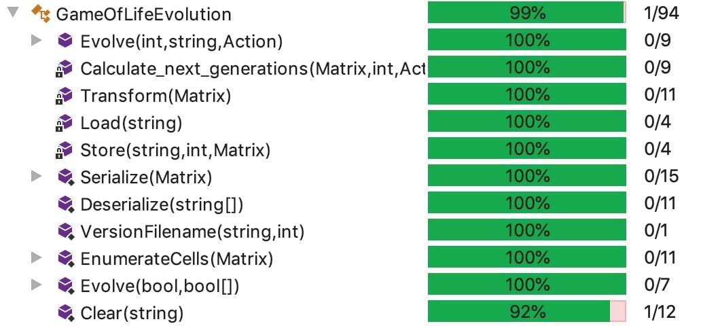

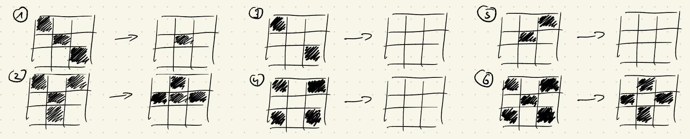

---

<!-- Page 158 of 493 -->

06-TestsalsTreiberderModularisierung 149
Mit solch spezifischen Akzeptanztests könnte sogar überlegt werden, den
einen oder anderen bisherigen Akzeptanztest aufzugeben. Andererseits
bindendiedieLösungandieBeschreibungenbeiWikipediaanundzeigen
damit, dass die Lösung auch einer unabhängigen Beispielquelle genügt.
Widerstand gegen das Löschen von Gerüsttests ist verständlich, sollte der
Bereinigung jedoch nicht leichtfertig im Wege stehen. Wenn es allerdings
wirklich gute Gründe gibt, Testszenarien nicht aufzugeben, dann ist ihre
Überführung in Akzeptanztests ein probates Mittel, das sogar ohne weite-
re Umstrukturierung mehr Dokumentation und mehr Regressionsschutz
bietet.
Gerüsttestfälle erhalten II - Modultests
Nicht in allen Fällen kannst du Gerüsttests in Akzeptanztests ummünzen.
Akzeptanztests als Integrationstests können z.B. nicht immer realistische
SzenarieninvollerGrößedurchspielen.SiesinddanneherRepräsentanten
einer “Testgemeinde”, die sich unterhalb der API-Funktionen formieren
muss.
Oder es ist schwer, mit Variationen in Akzeptanztestdaten punktgenau
die Logik in der nötigen Bandbreite anzusprechen, deren Gerüsttests als
erhaltenswürdig erachtet werden.
Das ist die Stunde der Refaktorisierung! In solchen Fällen ist es angezeigt,
dass du die Operation mit ihren Gerüsttests in ein eigenes Modul ausla-
gerst.
Nochmal als Beispiel EvolveCell(): Wenn die Funktion z.B. als sta-
tische Methode einer eigene Klasse öffentlich wäre, dann wäre eine
Erhaltung ihrer Gerüsttests verzeihlich. Es ist anzunehmen, dass die

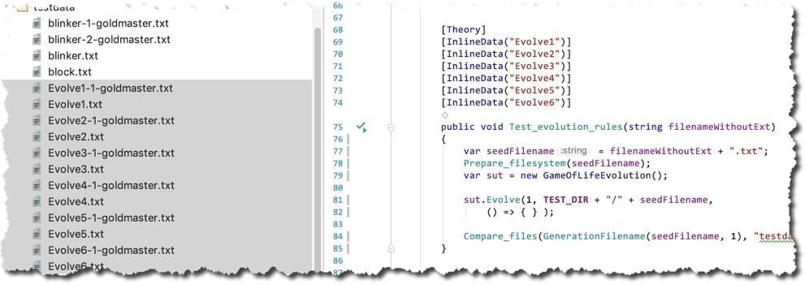

---

<!-- Page 159 of 493 -->

06-TestsalsTreiberderModularisierung 150
Schnittstelle eines Moduls stabiler ist als seine Interna. Zu den Interna
gehört die Funktion jedoch, solange sie innerhalb des bisherigen Moduls,
dessen einzige öffentliche Funktion Evolve() ist, nur ein Zerlegungsde-
tail darstellt.
Aus den Gerüsttests sind Modultests geworden, da EvolveCell() jetzt eine öffentliche
MethodederSchnittstelleeineseigenenModulsist.
Aus einem temporären Gerüsttest wird dadurch ein semipermanenter
Modultest.
Semipermanent sind solche Modultests für mich, weil sie einerseits dau-
erhafter sind als Gerüsttests: sie überdauern die Fertigstellung dessen,
was zu codieren war. Andererseits sind sie nicht so permanent wie
Akzeptanztests, weil das Modul nicht vom Kundenwunsch getrieben
entworfen wurde, sondern ad hoc während der Codierung durch Refak-
torisierung entstanden ist. Es ist letztlich ebenfalls nur ein Detail, das
wieder verschwinden kann, wenn sich die Anforderungen ändern. Das
SignalfürdieAufgabevonModultestskannz.B.ihrZusammenbruchnach
einer Refaktorisierung sein. Statt sie “zu reparieren”, löschst du sie. Falls
dann einzelne besonders wertvoll erscheinen, kann natürlich über ihre
Erhaltung nachgedacht werden. Der default sollte jedoch die Löschung
sein.

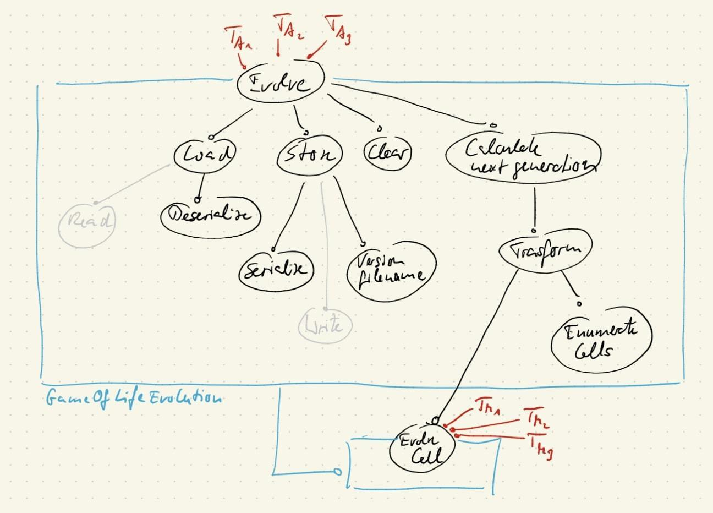

---

<!-- Page 160 of 493 -->

06-TestsalsTreiberderModularisierung 151
Besonders wichtige Modultests können z.B. dadurch erhalten werden,
dass ihr Modul durch Extraktion in ein anderes auf höherer Ebene geadelt
wird. Aus einer Klasse in der selben Bibliothek wie ihr Client könnte
eine Klasse in einer eigenen Bibliothek inklusive Interface werden. Aus
Modultests werden dann Komponententests mit der Erwartung, dass die
Schnittstelle, die sie überprüfen, noch stabiler als bisher sein wird.⁵⁸
Die Extraktion nur einer Operation in ein eigenes Modul, um ihre Tests zu
erhalten, ist aber wohl meistens ein zu großer Aufwand und wird der Be-
deutung der einen Operation nicht gerecht. Angemessener scheint die Ex-
traktion eines Sub-Baumes der Zerlegungshierarchie. Im Beispiel Game-
of-Life könnte der Sub-Baum bei der Funktion Calculate_next_ge-
neratio() als Wurzel beginnen.
In dem Fall würden die Gerüsttests zu Modultests auf dieser neuen
öffentlichen Funktion. Tatsächlich bleibt also die Operation unsichtbar,
doch die Testfälle lassen sich immer noch recht dicht an ihr und damit
sehr spezifisch formuliert anbringen.
ModultestsaufeinerIntegrationdichtoberhalbeinerOperationkönneneseinfachermachen,
Testfällezuerhalten,alswennsieaufAkzeptanztestebeneverlagertwerdenmüssten.
Eine Extraktion in diesem etwas größeren Umfang wirkt sich sehr vorteil-
haft auf die Codestruktur aus. Die Ausgangsklasse GameOfLifeEvolu-
⁵⁸DieHierarchiederModuleerkläreichausführlichimzweitenBuchderProgramming
withEase Reihe.

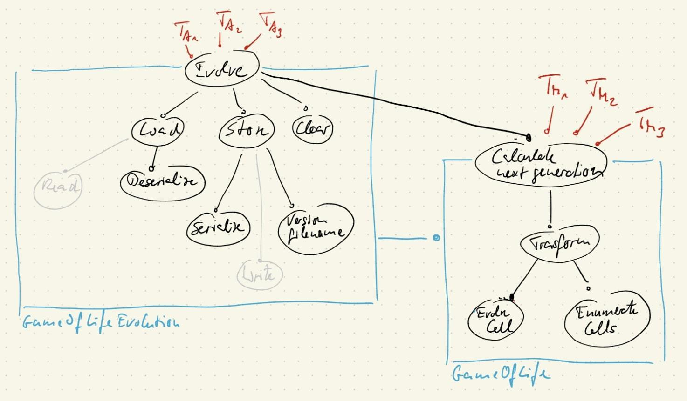

---

<!-- Page 161 of 493 -->

06-TestsalsTreiberderModularisierung 152
tion schrumpft und wird überschaubarer:
Und die extrahierte Klasse ist ebenfalls überschaubar und fokussiert auf
einen nun engeren Zweck:
Die bisherigen Gerüsttests auf EvolveCell() laufen nun als Modultests
und weiterhin in-memory, z.B.

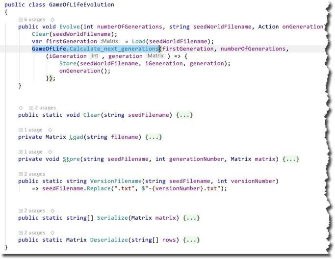

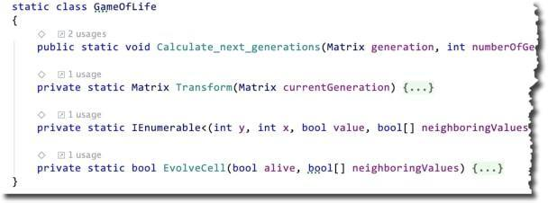

---

<!-- Page 162 of 493 -->

06-TestsalsTreiberderModularisierung 153
1 [Fact]
2 public void Let_living_cell_survive_with_2_alive_neighbors() {
3 Matrix result = null;
4 Matrix matrix = new Matrix(3, 3) {
5 [0, 0] = true,
6 [1, 1] = true,
7 [2, 2] = true
8 };
9
10 GameOfLife.Calculate_next_generations(matrix, 1,
11 (_, nextMatrix) => result = nextMatrix);
12
13 result.Should().BeEquivalentTo(new Matrix(3, 3) {
14 [1, 1] = true
15 });
16 }
Der Aufwand ist damit geringer als beim Ummünzen in Akzeptanztests.
Durch Modultests werden Akzeptanztests entlastet. Sie können nicht
immer wirklich umfänglich sein und sie müssen es auch nicht. Ihre
Hauptaufgabe ist, das big picture abzudecken und vor allem zu “bewei-
sen”, dass die Integration verschiedener Teillösungen zu einer korrekten
Gesamtlösung führt.
Sobald ein Modul wie GameOfLife herausgelöst ist, können Akzeptanz-
test daher auch überdacht werden. Sind sie wirklich in der bisherigen
Weisenötig?OderkönnenAspekte,diesieabdecken,tieferimZerlegungs-
baum nun auf einer Modulschnittstelle überprüft werden?
Als Beispiel mag die Erzeugung mehrerer Generationen dienen. Sie kann
nun viel einfacher direkt auf Calculate_next_generations() getes-
tet werden, z.B.
1 [Fact]
2 public void Generate_several_generations()
3 {
4 var blinker0 = new Matrix(5, 5) {
5 [2, 1] = true,
6 [2, 2] = true,
7 [2, 3] = true
8 };
9 var blinker1 = new Matrix(5, 5) {
10 [1, 2] = true,
11 [2, 2] = true,
12 [3, 2] = true
13 };
14
15 var results = new List<(int i, Matrix matrix)>();
16
17 GameOfLife.Calculate_next_generations(blinker0, 3,
18 (i, nextMatrix) => results.Add((i, nextMatrix)));
19
20 results[0].Should().BeEquivalentTo((1,blinker1));
21 results[1].Should().BeEquivalentTo((2,blinker0));
22 results[2].Should().BeEquivalentTo((3,blinker1));
23 results.Count.Should().Be(3);
24 }

---

<!-- Page 163 of 493 -->

06-TestsalsTreiberderModularisierung 154
Damit ist der Test auch dichter an der Dark Logic der Funktion dran.
Fehler in ihr können leichter lokalisiert werden.
Der bisherige Akzeptanztest
1 [Fact]
2 public void Akzeptanztest2()
3 {
4 const string SEED_WORLD_FILENAME = "blinker.txt";
5 Prepare_filesystem(SEED_WORLD_FILENAME);
6 var sut = new GameOfLifeEvolution();
7
8 var nResultGenerations = 0;
9 sut.Evolve(2, TEST_DIR + "/" + SEED_WORLD_FILENAME,
10 () => nResultGenerations++ );
11
12 nResultGenerations.Should().Be(2);
13 Compare_files(TEST_DIR + "/" + SEED_WORLD_FILENAME,
14 "testdata/" + SEED_WORLD_FILENAME);
15 Compare_files(GenerationFilename(SEED_WORLD_FILENAME, 1),
16 "testdata" + "/blinker-1-goldmaster.txt");
17 Compare_files(GenerationFilename(SEED_WORLD_FILENAME, 2),
18 "testdata" + "/blinker-2-goldmaster.txt");
19 }
kann entfallen. Er hatte einen guten Dienst getan, doch ist der Aufwand
höher, da dort um die Logik zur Erzeugung mehrerer Generationen
herum auch noch Persistenzlogik benötigt wird. Außerdem ist er nicht
so übersichtlich, weil Testcode und Testdaten nicht zusammen liegen; die
Testdaten befinden sich in Dateien.
Akzeptanztests sind wichtige Ausgangs- und Stützpunkte für die Codie-
rung. Dort beginnt die Implementation test-first. Getrieben durch den
WunschnachErhaltvonGerüsttestsmagesjedochvorteilhaftsein,später
weitereModulemiteigenenTestsauszuprägen,dienichtnurAufgabender
Gerüsttestsübernehmen,sondernauchAkzeptanztestsentlasten.Testfälle
werden sozusagen von unten dorthin heraufgeholt bzw. von oben herun-
tergezogen.
Diese Modultests sind dann quasi Akzeptanztests für die Module auf
deren öffentlichen Funktionen. Das können wie die API-Funktionen der
Akzeptanztests ebenfalls Integrationen sein.
Dem Zerlegungsbaum der Funktionen steht mithin ein Zerlegungsbaum
von Modulen gegenüber. In dem haben Module öffentliche Funktionen,
die ebenfalls unter Test stehen können. Ob sie das tun sollten, hängt
von ihrer Entstehungsgeschichte ab. Wenn sie das Ergebnis von Refak-
torisierungen einer korrekten Lösung sind, müssen nicht zwangsläufig
Modultests angesetzt werden. Aber Modultests dürfen angesetzt werden
und dürfen sogar die Treiber der Modularisierung sein.

---

<!-- Page 164 of 493 -->

06-TestsalsTreiberderModularisierung 155
Bei der Modularisierung ist eine Balance zu finden zwischen Testbarkeit
und “Verschwiegenheit”: Die Testbarkeit darf nicht so weit getrieben
werden,dassnahezualleFunktionen,insbesondereOperationenöffentlich
sind, um sie gut direkt testen zu können. Module würden damit einen
guten Teil ihres Zwecks verlieren und zu Namensräumen degenrieren.
AndererseitssolltenModulenichtsogrobundgroßgehaltenwerden,dass
Logik nur über lange Weg und kaum spezifisch durch ihre Schnittstellen-
funktionen getestet werden kann.
Diese Balance herzustellen, ist ein Teil der Kunst sauberer Programmie-
rung. Ihr Ziel ist Code von hoher Ordnung und hoher Korrektheit. In der
Codierung ist es für solches Austarieren jedoch eigentlich zu spät. Vor
allemistdasdeshalbvorherinderEntwurfsphasezuleisten.Währendder
Implementation sollte nur nachgezogen werden, wenn sich überraschend
neue Erkenntnisse ergeben.
Zusammenfassung
Tests dürfen eine bewusst begrenzte Lebensdauer haben. Sie müssen nicht
“ewig”bestehen,nurweileinmalAufwandinsiegeflossenist.Vorsichtvor
der sunk cost fallacy⁵⁹!
Bei komplizierten Problemen betrifft das die Tests der Operationen unten
im Zerlegungsbaum. Ihre Tests sind wichtig während der Entwicklung
der Logik - und danach störend. Denn wenn diese Tests erhalten blieben,
frieren sie den Zerlegungsbaum in seiner Struktur ein, was es schwer
macht, ihn an neue Anforderungen morgen anzupassen. Außerdem erfor-
derten solche Tests, dass seine Oberfläche, d.h. die Menge der sichtbaren
Funktionen, unnötig und ungewollt groß ist; nur öffentliche Funktionen
können unter Test stehen.
Deshalb sei mutig und werfe diese Gerüsttests weg! Sobald du eine
komplizierteFunktionerfolgreichimplementierthast,d.h.ihreAkzeptanz-
tests keine Fehler mehr melden, werden die Tests auf den Operationen
überflüssig.
Es sei denn… du entscheidest dich dafür, doch den einen oder anderen
zu erhalten. Vielleicht ist dir erst bei der Codierung klar geworden, wie
⁵⁹https://en.wikipedia.org/wiki/Sunk_cost

---

<!-- Page 165 of 493 -->

06-TestsalsTreiberderModularisierung 156
wichtig manche Teile der Lösung sind. Dann lohnt sich der Erhalt ihrer
Tests.
Du kannst Testfälle in Akzeptanztests herausziehen - oder du prägst
ModulemitSchnittstellenaus,durchdiedudieGerüsttestsdirektaufoder
zumindest nah an die Operationen in Form von Modultests legen kannst.
Test-first bei komplizierten Problemen bedeutet also:
1. LöseLogikmöglichstklarumrissen(Stichwort:SRP)inOperationen
alsBlättereinesnachIOSPzerlegtenBaumesheraus.IhreTestssind
Gerüsttests.
2. Wenn du Operationen längerfristig unter Test halten willst, löse sie
bzw. auch darüber liegende Teile des Zerlegungsbaums heraus in
ein eigenes Modul. Die Tests darauf sind Modultests.

---

<!-- Page 166 of 493 -->

06-TestsalsTreiberderModularisierung 157
Übungsaufgaben
Reflexionsaufgabe
Bitte formuliere eine Frage oder eine Erkenntnis zum Kapiteltext.
• Wo bist du gedanklich hängengeblieben, was ist dir unklar,
was passt für dich irgendwie nicht zusammen, wozu würdest
du dir noch etwas mehr Erklärung wünschen? Steht irgendet-
waszudeinerbisherigenPraxisimWiderspruchunddufragst
dich, warum du etwas ändern solltest?
• Oder: Wann hast du einen Aha-Moment gehabt, was ist
diralsbemerkenswert,spannend,ausprobierenswertaufgefal-
len? Hat irgendetwas “in dir Klick gemacht”, weil dir nun ein
Zusammenhang aufgegangen ist? Oder verstehst du jetzt aus
deiner bisherigen Praxis irgendetwas besser?
Am besten formulierst du Frage bzw. Erkenntnis schriftlich. Indem
du deine Gedanken aufschreibst, wirst du dir ihrer bewusster. Bei
einer Frage kommst du dadurch vielleicht schon einer Antwort aus
dir selbst heraus näher. Bei einer Erkenntnis fällt dir vielleicht schon
etwas ein, das du ab jetzt anders machen kannst.
Anforderungen
Beispiele
Realisiere eine Funktion, die CSV-Daten in eine benutzerfreundliche
ASCII-Darstellung übersetzt. Beispiel (Download hier):
1 Name;Strasse;Ort;Alter
2 Peter Pan;Am Hang 5;12345 Einsam;42
3 Maria Schmitz;Kölner Straße 45;50123 Köln;43
4 Paul Meier;Münchener Weg 1;87654 München;65
Die erste Zeile des Textes enthält die Bezeichnungen für die Felder

---

<!-- Page 167 of 493 -->

06-TestsalsTreiberderModularisierung 158
der folgenden Datensätze.
Die weiteren Zeilen des Textes enthalten Datensätze bestehend aus
mehreren Feldern, deren Werte durch das Trennzeichen ; separiert
sind. Alle Datensätze haben dieselbe Anzahl Felder in derselben
Reihenfolge, wie sie in der ersten Zeile definiert sind. Falls in einem
Datensatz ein Feld keinen Wert hat, dann bleibt der Platz zwischen
den Trennzeichen leer, z.B.
1 Bruce Wayne;;Gotham City;36
(Dass das Trennzeichen innerhalb eines Wertes für ein Feld vor-
kommt, muss nicht berücksichtigt werden.)
Die ASCII-Darstellung soll Feldbezeichnungen und Datensätze als
Tabelle zeigen. Beispiel für die obigen Daten inkl. des zusätzlichen
Datensatzes (Download hier):
1 Name |Strasse |Ort |Alter|
2 -------------+----------------+-------------+-----+
3 Peter Pan |Am Hang 5 |12345 Einsam |42 |
4 Maria Schmitz|Kölner Straße 45|50123 Köln |43 |
5 Paul Meier |Münchener Weg 1 |87654 München|65 |
6 Bruce Wayne | |Gotham City |36 |
Die Breite der Spalten richtet sich nach dem längsten Wert für ein
Feld; der kann auch der Name des Feldes sein.
Funktionssignatur
Die CSV-Daten sollen als Zeichenkette angliefert und die ASCII-
Darstellung als Zeichenkette zurückgegeben werden:
1 string Tabellieren(string csv)
TODO 1: Inkrementelle Teilprobleme
Die Beispieldaten beschreiben einen Akzeptanztestfall. Finde zu-
nächst inkrementelle Teilprobleme, mit denen du dich einer Lösung
schrittweise annähern kannst.
TODO 2: Komplementäre Teilprobleme

---

<!-- Page 168 of 493 -->

06-TestsalsTreiberderModularisierung 159
1. Erachte das erste inkrementelle Teilproblem als kompliziert:
Finde nur für das dieses Teilproblem eine Zerlegung in kom-
plementäre Teilprobleme.
2. ImplementieredieLösungfürdasersteinkrementelleTeilpro-
blem bottom-up.
Speichere den Code in einem Git-Repository und committe ihn
zumindest nach jedem gelösten Teilproblem.
TODO 3: Nähere dich der Gesamtlösung
iterativ an
WiederholedieSchritteausTODO2fürdieweitereninkrementellen
Teilprobleme. Konzentriere dich in jeder Iteration darauf, wirklich
nureineZerlegungfürdaseineinkrementelleTeilproblemzufinden.
Es kann dabei passieren, dass du Knoten des bisherigen Zerlegungs-
baums weiter zerlegst. Es kann aber auch passieren, dass du eine
Operation während der Zerlegung unverändert lässt und nur in
der Codierung um Logik erweiterst. Oder es kann auch aus einer
Operation eine Integration werden.
Markiere das Commit ins Repository über seinen Titel oder ein Tag,
mit dem du eine Iteration abschließt.
TODO 4: Lösche die Gerüsttests - oder
wandle sie um
Nachdem du die gesamte Aufgabe gelöst hast, überlege, ob es Ge-
rüsttests gibt, die du für erhaltenswert erachtest. Wenn ja, dann
erweitere/ergänze Akzeptanztests und/oder extrahiere die Funktion
(ggf. mit weiteren zusammenhängenden) in ein eigenes Modul.
https://gitlab.com/programming-with-ease-books/test-first-
codierung/-/blob/master/%C3%9Cbungsaufgaben%2006/personen.csv
https://gitlab.com/programming-with-ease-books/test-first-
codierung/-/blob/master/%C3%9Cbungsaufgaben%2006/personentabelle.txt

---

<!-- Page 169 of 493 -->

07 - Testbarkeit steigern
mit Surrogaten
Korrektheit ist so wichtig als Grundlage für dauerhaft hohe Produktivität,
dass du alles daran setzen werden musst, ihre Voraussetzung Testbarkeit
herzustellen - und die dann natürlich auch mit Tests auszunutzen.
Die erste Maßnahme in dieser Hinsicht ist ein test-first Vorgehen. Mit
test-first bist du der erste Nutzer deines Codes und willst es dir auch noch
so einfach machen wie möglich, ihn überhaupt zu testen. Der Lohn der
Mühe sind erstens Reifetests, die dir schnellstmöglich anzeigen, dass du
einen guten Job beim Produktionscode gemacht hast. Zweitens sind es
Stabilitätstests, die unter dir ein Sicherheitsnetz aufspannen, über dem
du gefahrlos Produktionscode verändern kannst, ohne in Regressionen
hineinzuschlittern.
Testen willst du einerseits Logik im Zusammenhang. Dafür sind Akzep-
tanztests da; sie zeigen dir, ob alles passt und du dein Ziel erreicht hast.
ErstderAkzeptanztest,danndieAnforderungmitLogikerfüllen.
Andererseits willst du nicht zu viel Logik auf einmal testen. Sonst hast du
es schwer, im Fehlerfall den Teil zu lokalisieren, wo der Bug sitzt. Dabei
helfen inkrementelle Tests, mit denen du Logik “Schüppchen für Schüpp-
chenaufhäufst”.Wennetwas schiefgeht,kannes ja eigentlichnur andem

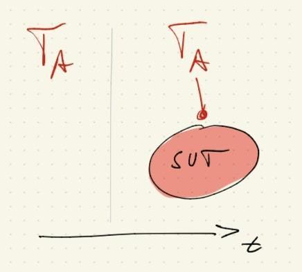

---

<!-- Page 170 of 493 -->

07-TestbarkeitsteigernmitSurrogaten 161
geringenZuwachsanLogikseitdemvorhergehendeninkrementellenTest
gelegen haben.
DieLogikwächstunterdenanderSchnittstelleanliegendeninkrementellenTestsSchrittfür
Schritt.
Sobald es jedoch nicht mehr nur um einfache Probleme geht, deren
Lösung in einem sehr begrenzten Umfang von Logik besteht, hilft dir das
inkremenelle Testen leider nur begrenzt. Mit inkrementellen Tests “von
außen” (pear programming) kommst du schlicht nicht dicht genug an die
fragliche Logik heran. Inkrementelle Tests sind ja auch eine Variante von
Akzeptanztests.
Deshalb wendest du als zweites Mittel zur Reduktion der Logik, die du
auf einmal testen willst, eine Zerlegung des Problems nach dem IOSP an.
Damit sammelst du Logik in überschaubaren Funktionen ohne funktiona-
le Abhängigkeiten. An diese Operationen legst du direkt Testsonden und
lässt darüber triviale Integrationen zur Wurzel wachsen.

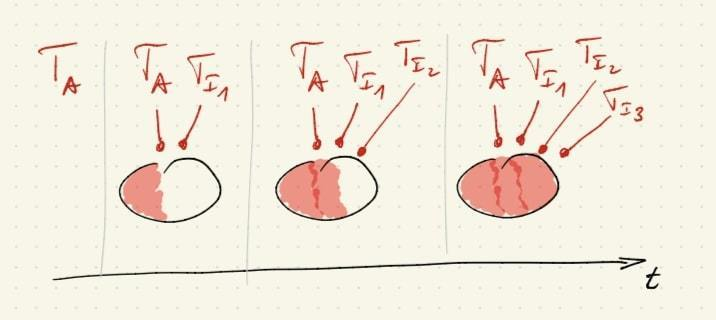

---

<!-- Page 171 of 493 -->

07-TestbarkeitsteigernmitSurrogaten 162
Die Logik wächst im Zerlegungsbaum unten Operation für Operation und wird zur Wurzel
hinintegriert.
Und wenn du später bemerkst, dass dir wichtige Testbarkeit verlorengeht,
weil Gerüsttests wegbrechen, sobald du Operationen auf private setzt,
dann refaktorisierst du deinen Produktionscode und ziehst Modulgrenzen
ein, die du unter grobgranularere Modultests stellst. Testbarkeit als Wert
ist wie jeder Wert abzuwägen gegen andere Werte.
Gerüsttests können durch Extraktion ihrer Operationen in eigene Module bewahrt werden.
SiewerdendannzuModultestsdaraufoderaufdarübergelagertenIntegrationen.
Das sind gute Maßnahmen im Sinne der Testbarkeit! Damit kommst du
schon sehr weit bei der Korrektheit. Allerdings läuftst du früher oder
später doch in das Problem von “zu viel Logik auf einmal”, die mit einem
Test abgedeckt würde. Das merkst du daran, dass der Test länger läuft, als
es dir lieb ist oder dass bei einem Fehler dessen Lokalisierung schwierig
wird.
Was du dann brauchst, ist ein Mittel, um dich während eines Tests

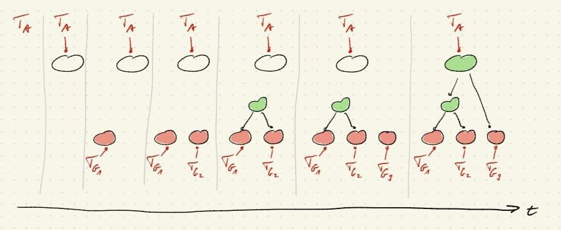

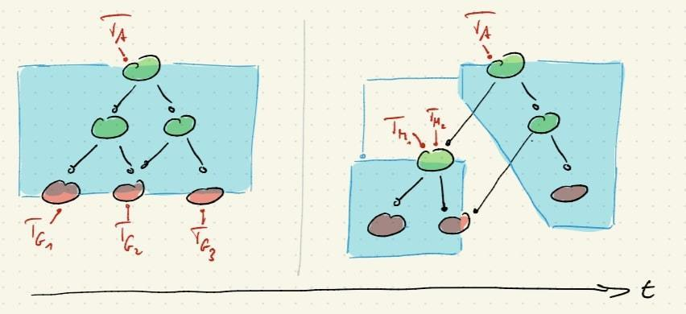

---

<!-- Page 172 of 493 -->

07-TestbarkeitsteigernmitSurrogaten 163
weiter oben in einem Funktionsbaum auf bestimmte Teile der darunter
hängenden Logik konzentrieren zu können. Uninteressante Logik soll
für den Moment einfach keine Rolle spielen. Wie kannst du das aber
erreichen?
Logik dynamisch binden
Bisher habe ich in meiner Darstellung wenig Wert auf Objektorientierung
gelegt. Vielleicht ist dir das aufgefallen und du hast dich gefragt, was das
soll. Der Grund ist einfach: Korrektheit hat zunächst einmal nichts mit
Objektorientierung zu tun. Korrektheit bezieht sich auf Logik. Und Logik
ist aus Tests über Funktionsaufrufe ansprechbar.
Testlogik ist ganz bewusst funktional abhängig von Produktionslogik. Ob
diese Produktionslogik in statische Funktionen verpackt ist, in einem
Modul steckt oder im Test zuerst ein Objekt zu instanziieren ist, macht
keinen Unterschied. Die bisherigen Herangehensweisen haben etwas mit
Problemschwierigkeitsgraden zu tun; Objektorientierung ist demgegen-
über ein technisches Detail.
Bis jetzt. Denn Objektorientierung kann einen Unterschied bei der Test-
barkeit machen . Dann wird sie relevant für die Anforderungskategorie
Korrektheit.⁶⁰
Objektorientierung ist kein Selbstzweck. Bestimmte Aspekte der Objekt-
orientierung sind auch kein Selbstzweck. Auch Funktionale Program-
mierung ist kein Selbstzweck. Keine Technologie, kein Paradigma, keine
Methode ist Selbstzweck, sondern immer nur Mittel. Die Frage, die du dir
deshalb immer wieder stellen solltest ist: Zu welchem Zweck ist das, was
du einsetzen willst, das Mittel? Und: Ist für den Zweck, den du gerade ver-
folgst, etwas das geeignete Mittel? Dogmen und Pauschalisierungen und
(gut gemeinte) Vereinfachungen gibt es viele. Deshalb sei immer bereit
zum Hinterfragen. Das trifft natürlich auch auf meine Darstellungen hier
zu.
Test-first, IOSP, Schwierigkeitsgrade, inkrementelle Tests usw. usf. sind
ebenfalls immer nur Mittel. Auch wenn ich sie dir ans Herz lege, solltest
⁶⁰Inwiefern Objektorientierung auch noch für die Anforderungskategorien Wert und
Ordnung relevant ist, ist eine ganz andere Sache. Das werde ich im zweiten und dritten
BuchmeinerReiheProgammingwithEase näherbetrachten.

---

<!-- Page 173 of 493 -->

07-TestbarkeitsteigernmitSurrogaten 164
du ihren Einsatz stets abwägen. Auch wenn du hier Erklärungen und
Begründungenfindest,musstdufürdichselbsteinVerständnisentwickeln
und das ins Verhältnis zu deiner jeweils eigenen, konkreten Situation
setzen. Du kommst um deine Verantwortung der Einschätzung nicht
herum. Bei allem, was ich hier anführe für test-first, IOSP usw. in Bezug
auf Zwecke wie Korrektheit und Ordnung, steht das doch immer in einem
Spannungsverhältnis zu anderen Zwecken, die du auch verfolgen musst
oder willst.
Deshalb findest du erst im Folgenden eine explizite Erwähnung der
Objektorientierung. Weil der Zweck, den sie verfolgt, bisher irrelevant
war für den Zweck, den ich mit test-first usw. verfolge.
Statische Bindung
Logik,dieeineAufgabeerfüllt,hatimmermehrereAspekte.Darinstecken
verborgen die Entscheidungen des Auftraggebers. Entscheidungen ste-
hen für das, was der Auftraggeber will. Er hat sich entschieden, das zu
wollen, was er dir in Anforderungen mitteilt, statt etwas anderem. Es gibt
immervieleAlternativen,dochermöchteinjedemAspektgenaudas,was
er dir nennt, nichts anderes.⁶¹ Als Beispiel ein kleines Szenario:
Es ist eine Funktion zu entwickeln, die Textdateien analysiert und
das Ergebnis in eine CSV-Datei schreibt. Die Analyse besteht darin,
dieAnzahlderWorteunddieAnzahlderZeichenindenTextdateien
zu bestimmen. Im Ergebnis stehen diese Zahlen zusammen mit dem
jeweiligen Dateinamen.
• DieFunktionssignatur:int Analysieren(string pfad)
– Der pfad verweist auf ein Verzeichnis, in dem Textda-
teien mit Typ .txt stehen. Der Rückgabewert ist die
Zahl der analysierten Dateien.
⁶¹Entscheidungen des Auftraggebers erkennst du daran, dass etwas ist, wie es ist und
nicht anders. Du denkst vielleicht, “Warum ist das so?” und hast schon eine Entscheidung
identifiziert. Bei Entscheidungen geht es also immer um ein “versus” oder “statt”. Wie
der Auftraggeber es formuliert, ist egal. Was er meint ist: “Ich will A statt B (oder C
oder D)!” oder “Wenn es um A vs B geht, dann wähle ich A!” Misslich ist, dass dir der
Auftraggeber seine Entscheidungen nicht in einer langen Liste mitteilt. Du musst sie aus
seinenAnforderungsbeschreibungenherausklauben.DasisteinerechteKunst!

---

<!-- Page 174 of 493 -->

07-TestbarkeitsteigernmitSurrogaten 165
– Die Ergebnisdatei wird im pfad unter dem Namen
ergebnis.csvabgelegt.IhrAufbauanhandeinesBei-
spiels. Der Dateiname wird darin relativ zum Wurzel-
verzeichnis angegeben, das pfad bezeichnet.
• Beispiel für eine Ergebnisdatei:
1 Dateiname;Zeichenanzahl;Wortanzahl
2 gedicht.txt;256;34
3 belletristik/roman.txt;283923;51924
Einige Entscheidungen, die in diesen Anforderungen stecken, sind:
• Dass es um Textdateien geht (und nicht XML-Dateien oder PDF-
Dateien).
• Dass die Endung der Textdateien .txt ist (und nicht auch noch
.md).
• Dass die Analyse darin besteht, Worte und Zeichen zu zählen (und
nichtdieSatzlängezubestimmenodermehrfachbenutzteWortezu
identifizieren).
• Dass das Ergebnis in eine Datei geschrieben wird (und nicht auf die
Console).
• Dass das Ergebnis im CSV-Format gespeichert wird (und nicht im
JSON-Format oder XML-Format).
Von Logik, die die Anforderungen erfüllt, ist zu erwarten, dass sie diese
Entscheidungen honoriert. Das tut die Logik in der folgenden Funktion:
1 public static int Analysieren(string pfad) {
2 var ergebnisdateiname = Path.Combine(pfad, "ergebnis.csv");
3 File.WriteAllLines(ergebnisdateiname,
4 new[]{"Dateiname;Zeichenzahl;Wortanzahl"});
5 var dateinamen = Directory.GetFiles(pfad, "*.txt",
6 SearchOption.AllDirectories);
7 foreach (var dateiname in dateinamen) {
8 var text = File.ReadAllText(dateiname);
9 var zeichenzahl = text.Length;
10 var worte = text.Split(new[] {' ', '\\n', '\\r', '\\t'},
11 StringSplitOptions.RemoveEmptyEntries);
12 var wortanzahl = worte.Length;
13 File.AppendAllLines(ergebnisdateiname,
14 new[]{$"{dateiname};{zeichenzahl};{wortanzahl}"});
15 }
16 return dateinamen.Length;
17 }

---

<!-- Page 175 of 493 -->

07-TestbarkeitsteigernmitSurrogaten 166
Sie ist funktional im Rahmen der Entscheidungen, sie tut ihren Job. Sie
ist als Ganzes auch testbar, was für diesen Umfang ausreichen mag. Doch
“prinzipiell gesehen” und “durch die didaktische Brille gesehen”, ist sie
nicht ordentlich und zu wenig testbar.
Von ordentlicher Logik ist vielmehr zu erwarten, dass sie die Entscheidun-
genleichterkennbarcodiert.OrdentlicheLogikwirddeshalbeineStruktur
aufweisen, in denen sich diese Entscheidungen widerspiegeln. Zumindest
für einige Entscheidungen sollte das bedeuten, dass ihre Logik in speziel-
len Funktionen zusammengefasst wird. Das könnte z.B. so aussehen:
1 public static int Analysieren(string pfad) {
2 var ergebnisdateiname = Path.Combine(pfad, "ergebnis.csv");
3 File.WriteAllLines(ergebnisdateiname,
4 new[]{"Dateiname;Zeichenzahl;Wortanzahl"});
5 var textdateien = new Textdateien(pfad);
6 foreach (var dateiinhalt in textdateien.Dateiinhalte) {
7 var ergebnis = TextAnalysieren(dateiinhalt.Text);
8 File.AppendAllLines(ergebnisdateiname,
9 new[]{$"{dateiinhalt.Dateiname};{ergebnis.Zeichenzahl};{ergebnis.Wortanzahl}"});
10 }
11 return textdateien.N;
12 }
DieTextanalyseunddieDateibeschaffungsindausgelagert,einmalineine
Funktion, einmal sogar in eine Klasse mit zwei Methoden.
Ist das ordentlich? Nein, noch nicht wirklich. Nur ein bisschen ordentli-
cher. Es ist vor allem noch nicht wirklich besser testbar, auch wenn es dir
als hybride Funktion normal erscheinen mag.
Für die Testbarkeit ist natürlich schon nachteiligt, dass die Logik nicht
komplett in Operationen steckt, also das IOSP nicht befolgt wurde. Aber
wenndudavoneinenMomentabsiehst,danngibtesnocheinanderesPro-
blem: Die verbliebene Logik in Analysieren() ist für sich genommen
nicht testbar, auch weil die Logik, von der sie funktional abhängig ist, fest
mit ihr verbunden ist; sie ist statisch eingebunden.
Analysieren() kennt TextAnalysieren() und ruft genau diese
Funktion in ihrer Logik auf. Ebenso kennt Analysieren() die Klasse
Textdateien, instanziiert genau sie und ruft dann darauf genau die
Funktionen Dateiinhalte und N auf.
DieLogikinAnalysieren()istfixiertaufdieLogikinganzspezifischen,
ihr zur compiletime bekannten anderen Funktionen.

---

<!-- Page 176 of 493 -->

07-TestbarkeitsteigernmitSurrogaten 167
Dasistsichernormal,weilesindenmeistenCodebasensoaussieht,undes
istauchperformant.FürdieProduktionslaufzeitistdasausreichend.Doch
für Tests sind solche statischen Bindungen unschön. Sie erlauben es eben
nicht,dieaufgerufeneLogikimTestfall“abzuklemmen”(Service),umsich
auf den aufrufenden Code zu konzentrieren (Client). Die Logik nur in
Analysieren() kann wegen statischer Bindung an andere Funktionen
nicht allein getestet werden.
Dynamische Bindung mit Funktionszeigern
Bei statischen Bindungen kennt der aufrufende Code genau den aufzuru-
fenden. Abstrakter und etwas konstruiert sieht das so aus:
1 public void Client(string input) {
2 var reversed = new string(input.Reverse().ToArray()); // Logik
3 Service(reversed); // statische funktionale Abhängigkeit
4 }
5
6 public void Service(string input) {
7 Console.WriteLine(input); // Logik
8 }
Um nur die Logik in Client() zu testen, müsste die Logik in Ser-
vice() ausgeblendet werden. Ein Test müsste Client() temporär von
Service() entkoppeln.
Dazu muss die starre Bindung ersetzt werden durch eine lose. Eine
Indirektionmusseingeführtwerden.Client()darfzwarweiterhinHilfe
von einer anderen Funktion erbitten, doch welche das konkret ist, muss
Client() unbekannt bleiben. Die aufzurufende Funktion, der Service
muss variabel sein.
Das kann sehr einfach mit einem Funktionszeiger erreicht werden (sofern
deine Programmiersprache das unterstützt). In C#, Ruby, C++ oder Spra-
chen der Funktionalen Programmierung wie F# oder Scala ist das kein
Problem. Java ist da leider nicht so gut aufgestellt.

---

<!-- Page 177 of 493 -->

07-TestbarkeitsteigernmitSurrogaten 168
1 public void Run() {
2 _someService = Service;
3 ClientV2("regal");
4 }
5
6 private Action<string> _someService;
7
8 public void ClientV2(string input) {
9 var reversed = new string(input.Reverse().ToArray());
10 _someService(reversed); // dynamische funktionale Abhängigkeit
11 }
Wo vorher Service() statisch eingebunden war, kann nun irgendein
Service aufgerufen werden, der “von der Form her” passt, also die nötige
Signatur hat. Der ist durch die Funktionszeiger-Variable _someService
repräsentiert. Die enthält die Adresse einer Funktion, zu der zur Laufzeit
gesprungen wird. Der Compiler “backt” die Service-Adresse nicht mehr in
die aufrufende Funktion ein; stattdessen wird die Adresse zur Laufzeit aus
derVariablen_someServiceausgelesen.DasistmitIndirektiongemeint:
derUmwegzurLogikineinerFunktionführtüberdasNachschlagenihrer
Adresse in einer Variablen.
DamitistdieVerbindungzwischenClient()undeinerService-Funktion
nicht mehr statisch, d.h. zur compiletime festgelegt, sondern dynamisch,
d.h. während der runtime einstellbar.
Ob die Variable wie oben global ist oder ein Parameter der Funktion, ist
für das Verfahren unerheblich. Es könnte also auch so gehen:
1 public void Run() {
2 ClientV3("lager", Service);
3 }
4
5 public void ClientV3(string input, Action<string> someService) {
6 var reversed = new string(input.Reverse().ToArray());
7 someService(reversed);
8 }
Das kann parameter injection genannt werden, weil die konkrete Lauf-
zeitabhängigkeit über einen Funktionsparameter “in die Funktion injiziert
wird”.
Dynamische Bindung mit Objekten
Nur weil Objekte im Spiel sind, heißt das nicht, dass Bindungen zwischen
einemClientundeinemServicedynamischsind.Selbstwenndaskonstru-
ierte Beispiel wie folgt aussehen würde, muss noch von einer statischen
Bindung gesprochen werden:

---

<!-- Page 178 of 493 -->

07-TestbarkeitsteigernmitSurrogaten 169
1 public void Client(string input) {
2 var reversed = new string(input.Reverse().ToArray());
3
4 var o = new DoSomething();
5 o.Service(reversed);
6 }
7
8 class DoSomething {
9 public void Service(string input) {
10 Console.WriteLine(input);
11 }
12 }
Es kennt der Client ja genau die Klasse, deren Instanz und darauf deren
Methode, wo ihm zur Laufzeit Logik Hilfe leistet. Objekte allein bringen
also noch keinen Vorteil für die Testbarkeit.
Duck Typing
IneinigenProgrammiersprachenistderkonkreteDatentypjedochnichtso
wichtig. In dynamischen Sprachen muss ein Client nicht wissen, welchen
Typ ein Objekt hat, dessen Methode er um Hilfe bittet. Es muss nur seiner
Annahme entsprechen, dass es überhaupt so eine Methode hat. Das nennt
man Duck Typing⁶²: “If it walks like a duck and it quacks like a duck, then
it must be a duck.”
Um die statische Bindung zu einem Service aufzulösen, muss dem Client
nun jedoch die Kontrolle entzogen werden, das Service-Objekt selbst zu
instanziieren (Inversion of Control (IoC)⁶³). Sonst wäre er ja weiterhin an
einen speziellen Datentyp gebunden. Stattdessen bekommt er ein Service-
Objekt übergeben (“injiziert”), z.B. über den Konstrutor (constructor injec-
tion).
1 public void Run() {
2 var c = new UseSomething(
3 new DoSomething() // injection
4 );
5 c.Client("reittier");
6 }
7
8 class UseSomething
9 {
10 private readonly dynamic _o;
11
12 public UseSomething(dynamic o) => _o = o;
13
14 public void Client(string input) {
15 var reversed = new string(input.Reverse().ToArray());
16 _o.Service(reversed); // let the duck quack
17 }
⁶²https://en.wikipedia.org/wiki/Duck_typing
⁶³https://en.wikipedia.org/wiki/Inversion_of_control

---

<!-- Page 179 of 493 -->

07-TestbarkeitsteigernmitSurrogaten 170
18 }
19
20 class DoSomething {
21 public void Service(string input) {
22 Console.WriteLine(input);
23 }
24 }
In C# muss eine Variable mit dynamic gekennzeichnet sein, um dieses
Verfahren anwenden zu können. Ist das der Fall, prüft der Compiler
zur compiletime nicht, ob eine Methode (hier: Service()) tatsächlich
zu einem Objekt (hier: _o) passt. Erst zur Laufzeit wird versucht, eine
Methode mit der geforderten Signatur auf dem Objekt zu lokalisieren.
Ist das erfolgreich, wird sie aufgerufen, andernfalls wird eine Ausnahme
geworfen.
Der Vorteil solcher dynamischer Programmierung: Flexibilität. Der Nach-
teil: keine Typsicherheit zur compiletime und geringere Performance
durchdenLokalisierungsaufwand(dynamischeBindung)zurLaufzeit.Ob
und wo dynamische Programmierung Sinn macht, ist mithin abzuwägen.
Für die Testbarkeit kann sie allerdings einen Gewinn darstellen. Dem
System Under Test (SUT) kann damit ein Surrogat für einen zu nutzenden
Service untergeschoben werden:
1 [Fact]
2 public void Test() {
3 var c = new UseSomething(
4 new DoNothing()
5 );
6 c.Client("reittier");
7 }
8
9 class DoNothing {
10 public void Service(string input) {}
11 }
Der Client UseSomething ist unverändert. Das Gesamtverhalten ist nun
jedoch ein anderes: Es findet keine Ausgabe auf der Console mehr statt.
Nur noch Logik in Client() wird ausgeführt. Der ruft zwar auch eine
Service()-Methode auf - nur tut die nichts und beeinflusst daher das
Gesamtverhalten auch nicht mehr. Logik wurde ausgeblendet, so dass die
abhängige Logik im Fokus stehen kann.
Vererbung
Nicht alle objektorientierten (OO) Sprachen bieten Features für dynami-
sche Programmierung. Was OO Sprachen jedoch bieten, ist Vererbung.

---

<!-- Page 180 of 493 -->

07-TestbarkeitsteigernmitSurrogaten 171
Mit ihr kannst du einem Client ebenfalls verschiedene Varianten eines
Service unterschieben.
Auf der Basis einer Service-Basisklasse kann der Client z.B. so formuliert
werden:
1 abstract class Doing {
2 public abstract void Service(string input);
3 }
4
5 class UseSomething
6 {
7 private readonly Doing _o;
8
9 public UseSomething(Doing o) => _o = o;
10
11
12 public void Client(string input) {
13 var reversed = new string(input.Reverse().ToArray());
14 _o.Service(reversed);
15 }
16 }
Er ist jetzt typsicher an “Dienstleister” gebunden, die ihm zur Laufzeit in-
jiziert werden können. Diese müssen lediglich von Doing als Basisklasse
erben.
Für die Service-Klassen für Produktion und Test sieht das z.B. so aus:
1 class DoSomething : Doing {
2 public override void Service(string input) {
3 Console.WriteLine(input);
4 }
5 }
6
7 class DoNothing : Doing {
8 public override void Service(string input) {}
9 }
Jetzt kann der Compiler feststellen, ob bei der Injektion ein passender Typ
instanziiert wird. Es besteht insofern keine Gefahr eines Laufzeitfehlers
mehr.
Vorteil: Typsicherheit und höhere Performance; Nachteil: für den Zweck
höherer Testbarkeit wird die Vererbungshierarchie “missbraucht”, die
eigentlich der Domäne zur Verfügung stehen soll; es entsteht über die
Injektion hinaus auch noch weitere Komplexität durch einen zusätzlichen
Datentyp.

---

<!-- Page 181 of 493 -->

07-TestbarkeitsteigernmitSurrogaten 172
Interfaces
Der Kollision mit einer schon vorhandenen Vererbungshierarchie und
überhaupt den Nachteilen von Vererbung kannst du zum Glück aus dem
Weg gehen, indem du ein anderes Mittel der Objektorientierung einsetzt:
Interfaces. Mit ihnen machst du die Schnittstelle einer Klasse explizit, so
dasssievonverschiedenenKlassenimplementiertwerdenkann,ohnedass
dadurch eine Klassenhierarchie entstünde.
Abstrakte Klassen sind schon Abstraktionen, die durch Vererbung kon-
kretisiert werden. Und Interfaces gehen noch einen Schritt weiter. Ihnen
haftet keine Implementation mehr an; sie sind sozusagen noch abstrakter.
Auch, weil sie sich in ganz unterschiedlicher Weise kombinieren lassen.
Klassen können beliebig viele Interfaces implementieren, während die
Mehrfachvererbung in den meisten OO Sprachen heutzutage nicht mehr
erlaubt ist.
Nicht umsonst gibt es das Interface Segregation Principle (ISP)⁶⁴: Mit
Interfaces kann das Angebot einer Klasse typsicher sehr feingranular
gestaltet werden. Das geht bis hinunter zu einer Methode pro Interface,
um maximale Kombinierbarkeit von Serviceangeboten zu erreichen.
1 interface IDoing {
2 void Service(string input);
3 }
4
5 class UseSomething
6 {
7 private readonly IDoing _o;
8
9 public UseSomething(dynamic o) => _o = o;
10
11
12 public void Client(string input) {
13 var reversed = new string(input.Reverse().ToArray());
14 _o.Service(reversed); // letting the duck quack
15 }
16 }
Der Unterschied gegenüber der Vererbung ist formal gering. Der Client
weiß nur, dass ein Service, den er zur Laufzeit aufruft, einer bestimmten
Form entspricht, die das Interface vorgibt. _o wird eine Methode der
Signatur void Service(string) haben.
⁶⁴http://www.principles-wiki.net/principles:interface_segregation_principle

---

<!-- Page 182 of 493 -->

07-TestbarkeitsteigernmitSurrogaten 173
1 class DoSomething : IDoing {
2 public void Service(string input) {
3 Console.WriteLine(input);
4 }
5 }
6
7 class DoNothing : IDoing {
8 public void Service(string input) {}
9 }
Der Client bindet sich nicht an einen konkreten Typen, sondern an
eine Abstraktion: das Interface. Die konkreten Typen fleischen dessen
Formvorgabe nach ihrem Gutdünken aus.
Die Indirektion zur Laufzeit besteht im Nachschlagen der spezifischen
Service()-Adresse in einer Tabelle des Objektes.
Zusammenfassung
Der default für Verbindungen zwischen Funktionen ist die statische Bin-
dung. Um aber Teile eines Funktionsbaumes zur Laufzeit ausblenden zu
können, musst du diese Teile dynamisch binden.
Auch wenn das Duck Typing dafür am einfachsten aussieht, ist es zumin-
dest für die Sprachen Java, C++ und C# nicht wirklich zu empfehlen oder
nicht einmal möglich.
Funktionszeiger auf der anderen Seite sind wegen der Typsicherheit ein
durchaus probates Mittel, wenn auch sehr feingranular; gegen sie spricht
jedoch, dass Funktionen immer noch nicht in allen mainstream Sprachen
first class citizens sind, so dass es sein kann, dass du damit auch nicht so
weit kommst.
Das am weitesten verbreitete Mittel, um Code in Client-Funktionen dyna-
misch von Code in Service-Funktionen abhängig zu machen, ist deshalb
das Interface. Wenn ein Client ein Interface kennt statt der implementie-
renden Klasse, wenn er also von einer Abstraktion abhängig ist statt vom
Konkreten, dann können ihm in Tests Surrogate untergeschoben werden.
Dein Produktionscode folgt auf diese Weise dem Dependency Inversion
Principle (DIP)⁶⁵.
⁶⁵http://www.principles-wiki.net/principles:dependency_inversion_principle

---

<!-- Page 183 of 493 -->

07-TestbarkeitsteigernmitSurrogaten 174
Surrogate in Tests einsetzen
Wie kannst du nun dynamische Bindung einsetzen, um den Beispielcode
besser testbar zu machen? Zur Erinnerung die Variante mit den funktio-
nalen Abhängigkeiten:
1 public static int Analysieren(string pfad) {
2 var ergebnisdateiname = Path.Combine(pfad, "ergebnis.csv");
3 File.WriteAllLines(ergebnisdateiname,
4 new[]{"Dateiname;Zeichenzahl;Wortanzahl"});
5 var textdateien = new Textdateien(pfad);
6 foreach (var dateiinhalt in textdateien.Dateiinhalte) {
7 var ergebnis = TextAnalysieren(dateiinhalt.Text);
8 File.AppendAllLines(ergebnisdateiname,
9 new[]{$"{dateiinhalt.Dateiname};{ergebnis.Zeichenzahl};{ergebnis.Wortanzahl}"});
10 }
11 return textdateien.N;
12 }
Der Funktions- oder Zerlegungsbaum dafür sieht so aus:
Analysieren() als Hybrid ist funktional abhängig und schwer zu
testen.
Um ausschließlich die in Analysieren() verbliebene Logik testen zu
können - durch Rot symbolisiert -, musst du die statischen funktionalen
Abhängigkeiten - durch Grün symbolisiert - auftrennen und dynamisch
machen. Dabei sind zwei Schwierigkeiten zu überwinden:
1. TextAnalysieren() ist eine Methode derselben Klasse, zu der
auchAnalysieren()gehört.EineInjektionistalsozunächstnicht
über eine Objektinstanz möglich.

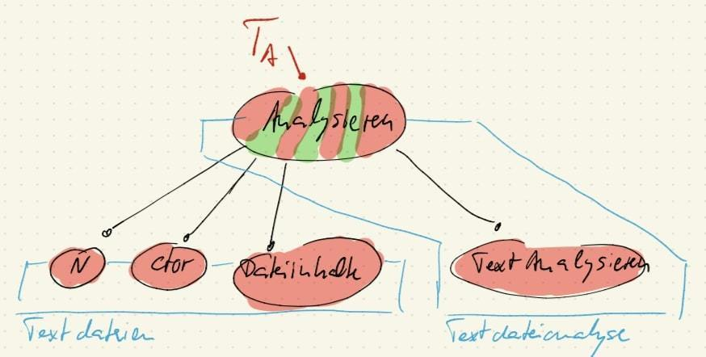

---

<!-- Page 184 of 493 -->

07-TestbarkeitsteigernmitSurrogaten 175
2. Nicht nur kennt Analysieren() die Klasse Textdateien, die
Funktion instanziiert sie auch noch mit einem Parameter, d.h.
Analysieren() braucht eine speziell für den Moment konfigu-
rierte Instanz. Damit fällt eine Injektion einer Instanz über den
Konstruktor aus.
Extraktion einer Klasse und Abstraktion mit
Interface
Zur Lösung des ersten Problems ist die Extraktion von TextAnalysie-
ren() in eine eigene Klasse nötig. Das macht auch Sinn aus einer inhaltli-
chenPerspektive:TextAnalysieren()istKern-Domänenfunktionalität,
die sicher eine eigene Klasse zur Kapselung aller damit zusammenhängen-
den Entscheidungen verdient.
1 public interface ITextanalyse {
2 (int Zeichenzahl, int Wortanzahl) Analysieren(string text);
3 }
4
5 public class Textanalyse : ITextanalyse {
6 public (int Zeichenzahl, int Wortanzahl) Analysieren(string text) {
7 var zeichenzahl = text.Length;
8 var worte = text.Split(new[] {' ', '\\n', '\\r', '\\t'},
9 StringSplitOptions.RemoveEmptyEntries);
10 var wortanzahl = worte.Length;
11 return (zeichenzahl, wortanzahl);
12 }
13 }
SolässtsichdiedateibasierteTextanalysemiteinerkonkretenTextanalyse
konfigurieren:
1 public class Textdateianalyse {
2 private readonly ITextanalyse _analyse;
3
4 public Textdateianalyse(ITextanalyse analyse) {
5 _analyse = analyse;
6 }
7
8 public int Analysieren(string pfad) {
9 var ergebnisdateiname = Path.Combine(pfad, "ergebnis.csv");
10 File.WriteAllLines(ergebnisdateiname,
11 new[]{"Dateiname;Zeichenzahl;Wortanzahl"});
12 var textdateien = new Textdateien(pfad);
13 foreach (var dateiinhalt in textdateien.Dateiinhalte) {
14 var ergebnis = _analyse.Analysieren(dateiinhalt.Text);
15 File.AppendAllLines(ergebnisdateiname,
16 new[]{$"{dateiinhalt.Dateiname};{ergebnis.Zeichenzahl};{ergebnis.Wortanzahl}"});
17 }
18 return textdateien.N;
19 }
20 ...

---

<!-- Page 185 of 493 -->

07-TestbarkeitsteigernmitSurrogaten 176
Die Extraktion fand hier also nicht statt, um Gerüsttestfälle zu behalten -
auchwenndasSinngemachthätte-,sondernumdieaufrufendeFunktion
besser testbar zu machen.
Injektion einer Objektfabrik
Beim zweiten Problem liegt schon eine Klasse vor, Textdateien. Die
müsste eigentlich nur mit einem Interface versehen werden, um eine
Instanz zu injizieren und die Bindung dynamisch zumachen. Dagegen
spricht die Konfiguration dieser Instanz zur Laufzeit. Sie soll mit dem
aktuellen Pfad arbeiten, der erst am bisherigen Konstruktionsort bekannt
ist.
In der Client-Funktion Analysieren() muss also weiterhin die Objekt-
konstruktion stattfinden - allerdings ohne Kenntnis der konkreten Klasse.
So ein Problem kannst du zum Glück mit einer Objektfabrik⁶⁶ lösen.
Statt eine Instanz einer Implementation (Klasse) einer Abstraktion (Inter-
face) zu injizieren, wird eine Indirektion injiziert: eine Funktion, die eine
Implementation für eine Abstraktion konstruiert.
Zunächst die Abstraktion und die konkrete Klasse:
1 public interface ITextdateien {
2 IEnumerable<(string Dateiname, string Text)> Dateiinhalte { get; }
3 int N { get; }
4 }
5
6
7 class Textdateien : ITextdateien {
8 private readonly string[] _dateinamen;
9
10 public Textdateien(string pfad) {
11 _dateinamen = Directory.GetFiles(pfad, "*.txt",
12 SearchOption.AllDirectories);
13 }
14
15 public IEnumerable<(string Dateiname, string Text)> Dateiinhalte {
16 get {
17 foreach (var dateiname in _dateinamen)
18 yield return (dateiname, File.ReadAllText(dateiname));
19 }
20 }
21
22 public int N => _dateinamen.Length;
23 }
Dann die Client-Klasse, in der nur die Abstraktion bekannt ist - und eine
FabrikzuProduktioneinerImplementation.HierwirdeinFunktionszeiger
als zweiter Parameter des Konstruktors injiziert:
⁶⁶https://en.wikipedia.org/wiki/Factory_method_pattern

---

<!-- Page 186 of 493 -->

07-TestbarkeitsteigernmitSurrogaten 177
1 public class Textdateianalyse
2 {
3 private readonly ITextanalyse _analyse;
4 private readonly Func<string, ITextdateien> _textdateienFabrik;
5
6 public Textdateianalyse(ITextanalyse analyse,
7 Func<string,ITextdateien> textdateienFabrik) {
8 _analyse = analyse;
9 _textdateienFabrik = textdateienFabrik;
10 }
11
12
13 public int Analysieren(string pfad) {
14 var ergebnisdateiname = Path.Combine(pfad, "ergebnis.csv");
15 File.WriteAllLines(ergebnisdateiname,
16 new[]{"Dateiname;Zeichenzahl;Wortanzahl"});
17 var textdateien = _textdateienFabrik(pfad); // Aufruf der Fabrik
18 foreach (var dateiinhalt in textdateien.Dateiinhalte) {
19 var ergebnis = _analyse.Analysieren(dateiinhalt.Text);
20 File.AppendAllLines(ergebnisdateiname,
21 new[]{$"{dateiinhalt.Dateiname};{ergebnis.Zeichenzahl};{ergebnis.Wortanzahl}"});
22 }
23 return textdateien.N;
24 }
25 }
UndschließlicheinBeispielfürdieNutzungderClient-Klasse.DieLambda-
Funktion stellt lediglich eine Instanz der bisher einzigen Implementation
der Abstraktion her. Statt das in Analysieren() geschehen zu lassen,
passiert es in einer Funktion, die austauschbar ist. Damit ist die Instanzi-
ierung mit Parameter dynamisch gemacht.
1 public void Run() {
2 var ta = new Textdateianalyse(
3 new Textanalyse(), // Injektion einer Implementation
4 pfad => new Textdateien(pfad) // Injektion einer Fabrik
5 );
6
7 var result = ta.Analysieren("textdateien");
8
9 Console.WriteLine($"{result} Dateien analysiert");
10 }
In Programmiersprachen, die keine Funktionszeiger unterstützen, kann
stattdessen ein Interface mit einer Methode zum Einsatz kommen, für
das es natürlich eine Implementation geben muss, die konkret eine Text-
dateien-Instanz erzeugt. Das ist umständlicher als die Nutzung eines
Funktionszeigers, aber manchmal macht es Sinn wegen des Umfangs der
Konstruktionslogik - oder weil deine Programmiersprache Funktionszei-
ger nicht unterstützt.

---

<!-- Page 187 of 493 -->

07-TestbarkeitsteigernmitSurrogaten 178
1 interface ITextdateienFabrik {
2 ITextdateien Bauen(string pfad);
3 }
Surrogate unterschieben
Bis jetzt sind nur die Bindungen dynamisiert worden und das Beispiel
zeigt, wie der Client im Analyse-Szenario mit den ursprünglichen Imple-
mentationenaufgerufenwird.WiesiehtdasaberineinemTestaus?Dafür
wurde ja der ganze Aufwand getrieben. Im Test soll nur noch die Logik in
Analysieren() unter Test stehen und der Rest ausgeblendet werden.
Dazu muss der Client zur Testlaufzeit an Implementationen seiner dyna-
mischen Abhängigkeiten gebunden werden, die die Logik in Analysie-
ren() nicht stören können und nicht davon ablenken.
Gleichzeitig muss aber natürlich auch überprüfbar sein, dass die Funktion
ihren Job macht. Der besteht sicher darin, am Ende das korrekte Resultat
zu liefern. Damit kann aber nicht nur das Funktionsergebnis gemeint sein.
Die Hauptaufgabe der Methode ist nicht, ihre Arbeit auf einen int-Wert
zu reduzieren. Vielmehr soll sie vor allem eine Resultatsdatei generieren.
Ob deren Inhalt den Erwartungen entspricht, ist das Wichtigste.
FürdieauszublendendeProduktionslogikwerdenzweiSurrogatebenötigt.
DerenLogikmussdereigentlichengegenübertrivialsein,damitdarinkein
Fehlerzuerwartenist.Ambestensindsiesogarlogikfreiundbestehennur
aus Daten. Das lässt sich für das Textdateien-Surrogat einreichten:
1 class TextdateienSurrogat : ITextdateien {
2 public readonly string Pfad;
3 public TextdateienSurrogat(string pfad) {
4 Pfad = pfad;
5 }
6
7 public IEnumerable<(string Dateiname, string Text)> Dateiinhalte {
8 get {
9 yield return (Pfad + "/foo.txt", "123");
10 yield return (Pfad + "/bar/baz.txt", "12");
11 }
12 }
13
14 public int N => 2;
15 }
Die Methoden liefern jetzt fest verdrahtete Daten, die nur minimal mit
dem pfad-Parameter konfiguriert werden. Etwas auf diesen Daten Basie-
rendes erwartet der Test am Ende in der Ergebnisdatei.

---

<!-- Page 188 of 493 -->

07-TestbarkeitsteigernmitSurrogaten 179
Die Daten selbst müssen nicht “realistisch sein”. Es geht nicht darum,
welcheDatenessind,sonderndarum,obdasErwartetemitihnenpassiert.
Die Textanalyse, in die diese Daten gespeist werden, sollte hingegen
gewisse Logik enthalten, um zu demonstrieren, dass sie aufgerufen wurde.
Aber diese Logik muss ebenfalls nicht “realistisch sein”, sondern nur
einfach zu überprüfende Erwartungen ermöglichen.
1 class TextanalyseSurrogat : ITextanalyse {
2 public (int Zeichenzahl, int Wortanzahl) Analysieren(string text) {
3 return (text.Length, text.Length * 10);
4 }
5 }
Im Test werden dann diese Surrogate instanziiert und in das SUT injiziert.
Hier siehst du IoC von außen in Aktion: der Test kontrolliert, mit welchen
Service-Instanzen ein Client arbeitet, nicht der Client selbst.
1 [Fact]
2 public void Test_mit_Surrogaten() {
3 TextdateienSurrogat textdateiensurrogat = null;
4 var sut = new Textdateianalyse(
5 new TextanalyseSurrogat(),
6 pfad => {
7 textdateiensurrogat = new TextdateienSurrogat(pfad);
8 return textdateiensurrogat;
9 });
10
11 var result = sut.Analysieren("textdateien");
12
13 result.Should().Be(2);
14 textdateiensurrogat.Pfad.Should().Be("textdateien");
15
16 File.ReadAllText("textdateien/ergebnis.csv").Trim().Should().Be(
17 @"Dateiname;Zeichenzahl;Wortanzahl
18 foo.txt;3;30
19 bar/baz.txt;2;20");
20 }
Natürlich prüft der Test auch, ob der Rückgabewert vonAnalysieren()
den Erwartungen entspricht.
Interessanter ist jedoch, dass auch überprüft wird, ob das Textdateien-
Surrogat der Pfadname erreicht hat. Das ist sinnvoll, weil damit der
korrekte Aufruf der Objektfabrik überprüft wird; die ist kein Implemen-
tationsdetail, weil sie von außen sichtbar ist.
Und schließlich noch die Überprüfung des eigentlichen Ergebnisproto-
kolls. Dazu muss weiterhin auf eine Datei zugegriffen werden; die Logik
für das Schreiben der CSV-Datei gehört zu Analysieren().

---

<!-- Page 189 of 493 -->

07-TestbarkeitsteigernmitSurrogaten 180
Damit steht die Logik in Analysieren() nun isoliert “vor der Prü-
fungskommission”.IhrefunktionalenAbhängigkeitensinddurchStümpfe
ersetzt, die keinen Schaden mehr anrichten können. Was jetzt schief läuft,
liegt in der Verantwortlichkeit von Analysieren(), des System Under
Test.
Und tatsächlich läuft etwas schief!
Die Dateinamen der zu analysierenden Textdateien werden vollständig
mit dem kompletten Pfad geliefert, z.B. textdateien/bar/baz.txt,
aber in der Ergebnisdatei, die ja im zu analysierenden Pfad abgelegt wird,
sollen nur die relativen Dateinamen stehen, z.B. bar/baz.txt. Das Pro-
blemliegtindiesemTeilderLogik$"{dateiinhalt.Dateiname};...,
wo der komplette Dateiname in die Ergebnisdatei eingetragen wird.
Die Logik für das Ergebnisprotokoll müsste wissen, welcher Pfad analy-
siert wird, und den aus dem Dateinamen herausnehmen, um ihn relativ
zu machen. Das ist in C# mit der Hilfe einiger Standardfunktionen
leicht möglich, ohne selbst Zeichenkettenvergleiche und -veränderungen
vornehmen zu müssen:
1 public int Analysieren(string pfad) {
2 var ergebnisdateiname = Path.Combine(pfad, "ergebnis.csv");
3 File.WriteAllLines(ergebnisdateiname,
4 new[]{"Dateiname;Zeichenzahl;Wortanzahl"});
5 var textdateien = _textdateienFabrik(pfad);
6 foreach (var dateiinhalt in textdateien.Dateiinhalte) {
7 var ergebnis = _analyse.Analysieren(dateiinhalt.Text);
8
9 var absoluterDateipfad = new Uri("file:///" +
10 dateiinhalt.Dateiname,
11 UriKind.Absolute);
12
13 var absoluterVerzeichnispfad = new Uri("file:///" +
14 pfad +
15 (Path.EndsInDirectorySeparator(pfad) ? "" : "/"),
16 UriKind.Absolute);
17
18 var relativerDateipfad = absoluterVerzeichnispfad.MakeRelativeUri(absoluterDateipfa\
19 d).ToString();
20
21 File.AppendAllLines(ergebnisdateiname,
22 new[]{$"{relativerDateipfad};{ergebnis.Zeichenzahl};{ergebnis.Wortanzahl}"});
23 }
24 return textdateien.N;
25 }
Nach dieser Veränderung ist der Test erfolgreich. Der Umfang der Logik
in Analysieren() ist allerdings dadurch beträchtlich (ca. 70%) gestie-
gen. Der Verständlichkeit ist das leider nicht zuträglich, auch wenn die
Testbarkeit durch die Surrogate für die Logik in dieser hybriden Funktion
nun gegeben ist.

---

<!-- Page 190 of 493 -->

07-TestbarkeitsteigernmitSurrogaten 181
Reflexion
Die gute Nachricht ist: Was an Logik nicht testbar ist, weil es sich in
hybriden Funktionen mitten in einem Funktionsbaum befindet, kann
mit Surrogaten testbar gemacht werden. Die Mittel für Polymorphie⁶⁷ in
OO Sprachen machen es möglich. Damit ist Objektorientierung für die
Herstellung von Korrektheit hilfreich relevant.
Ob es allerdings leicht ist, mittels Polymorphie die Testbarkeit zu erhöhen,
ist hingegen eine andere Frage: Mit einiger Übung bekommst du die Kom-
bination DIP+IoC natürlich in die Finger. Du legst wie selbstverständlich
zudeinenKlassenInterfacesan,machstClient-Codenurnochvonsolchen
Abstraktionen abhängig zur compiletime und injizierst konkrete Abhän-
gigkeitenzurruntime.DamiterhöhstdudieTestbarkeitganzgewiss.Doch
du erhöhst auch die Komplexität des Codes! Du treibst ja deutlich mehr
Aufwand durch die Abstraktion und Injektion, der eigentlich nicht nötig
wäre. Ist es das immer wert? Oder besser: Wann ist es das wert?
Nur weil es geht, bedeutet das nicht, dass du es auch immer tun solltest.
Es gilt abzuwägen und zu kombinieren.
Das betrifft auch die Surrogate, denn derer gibt es verschiedene Arten. Sie
werden z.B. Mock, Stub, Fake⁶⁸ oder allgemeiner Test Double⁶⁹ genannt.
Den ungewöhnlichen Begriff Surrogat habe ich hier jedoch gewählt, um
von diesen Feinheiten abzusehen. Er ist gleichermaßen einprägsam wie
unbelastet. Das Wesentliche hinter allen Varianten ist, dass sie irrelevante
Logik ausblenden, um Tests auf relevante Logik zu konzentrieren.
Dabei musst du allerdings zweierlei bedenken, was nicht dazu beiträgt,
dass dynamische Bindungen als einfach und unaufwändig zur Erhöhung
der Testbarkeit eingestuft werden sollten:
Vorsicht vor Whiteboxing
Pass erstens auf, dass durch Surrogate die Vorteile der Modularisierung
nicht zunichte gemacht werden. Modularisierung dient dem Verbergen
⁶⁷https://de.wikipedia.org/wiki/Polymorphie_(Programmierung)
⁶⁸https://stackoverflow.com/questions/346372/whats-the-difference-between-faking-
mocking-and-stubbing
⁶⁹https://blog.pragmatists.com/test-doubles-fakes-mocks-and-stubs-1a7491dfa3da

---

<!-- Page 191 of 493 -->

07-TestbarkeitsteigernmitSurrogaten 182
von Details. Eigentlich willst du von einem Modul nur eine Schnittstelle
sehen und nichts darüber wissen, wie es dahinter aussieht. Es soll und
muss dir egal sein, wie ein Modul seine Leistung erbringt, ob es viel oder
wenig Logik enthält oder von anderen Modulen abhängig ist. Deshalb
sollen ja auch die Funktionen, auf denen Gerüsttests angebracht sind, auf
private gesetzt werden. Nur so verschwinden sie aus der Schnittstelle
ihres Moduls. Dass es sie überhaupt gibt, ist ein Implementationsdetail,
das durch dein Vorgehen der komplementären Zerlegung entstanden ist.
Surrogate erzwingen durch die Injektion jedoch, dass du außerhalb eines
Moduls Kenntnis davon hast, wie es darin aussieht. Nicht nur weißt
du, dass es überhaupt und welche Abhängigkeiten hat, du musst zum
Testzeitpunkt auch wissen, wie damit umgegangen wird. Sonst kannst du
deine Surrogate nicht passend konfigurieren und überprüfen.
Der Einsatz von DIP+IoC birgt also die Gefahr, dass deine Tests zu
whiteboxoderzumindestgreyboxTestswerden,d.h.Tests,dienurfunktio-
nieren, solange auch die Struktur hinter der Fassade des SUT unverändert
bleibt. Surrogate sind ein scharfes zweischnittiges Schwert! Schnüre dich
damit nicht in ein Korsett ein, wo du dich gerade mit Akzeptanztests und
durch Löschen von Gerüsttests aus einem befreit hast.
Daraus leitet sich ab, dass die Testbarkeit nur dort mittels Dynamisierung
von Bindung und Surrogaten erhöht werden sollte, wo eine gewisse
Stabilität “in den Verhältnissen” gegeben ist.
Vorsicht vor komplexen Surrogaten
Und dann pass auf, dass dir deine Surrogate nicht über den Kopf wachsen
mit eigener Komplexität. Im Beispiel ist das noch nicht schlimm. Du
kannst den Aufwand auch mit Frameworks mindern, die dir viel Arbeit
beim Surrogatbau abnehmen. Als Beispiel hier der Surrogatbau mit dem
C# Mock-Framework NSubstitute⁷⁰:
⁷⁰https://nsubstitute.github.io/

---

<!-- Page 192 of 493 -->

07-TestbarkeitsteigernmitSurrogaten 183
1 [Fact]
2 public void Test_mit_SurrogatenV2()
3 {
4 // Arrange
5 // Surrogate aufsetzen
6 var textanalyseSurrogat = Substitute.For<ITextanalyse>();
7 textanalyseSurrogat.Analysieren("123").Returns((3, 30));
8 textanalyseSurrogat.Analysieren("12").Returns((2, 20));
9
10 var textdateiSurrogat = Substitute.For<ITextdateien>();
11 textdateiSurrogat.Dateiinhalte.Returns(new[] {
12 ("textdateien/foo.txt", "123"),
13 ("textdateien/bar/baz.txt", "12")
14 });
15 textdateiSurrogat.N.Returns(2);
16
17 // Surrogate nutzen
18 var sut = new Textdateianalyse(
19 textanalyseSurrogat,
20 pfad => textdateiSurrogat);
21
22 // Act
23 var result = sut.Analysieren("textdateien");
24
25 // Assert
26 // Ergebnisse überprüfen
27 result.Should().Be(2);
28
29 File.ReadAllText("textdateien/ergebnis.csv").Trim().Should().Be(
30 @"Dateiname;Zeichenzahl;Wortanzahl
31 foo.txt;3;30
32 bar/baz.txt;2;20");
33 }
So ein Framework enthebt dich der Notwendigkeit, eigene Surrogat-
Klassen zu codieren. Hier ist nicht einmal Logik im Spiel (nach Martin
Fowler ein Stub). Für jedes Surrogat wird definiert, bei welchen Aufrufen
mit welchen Parametern welche Resultate zurückgegeben werden sollen.
Damit ist der Test in sich geschlossen. Nirgendwo anders steht noch Logik
dafür. Wenn etwas schief läuft, kann es nur am SUT liegen oder den im
Test konfigurierten Surrogaten.
WasduschlichtvermeidenwillstsindSurrogate,diesokomplexsind,dass
du sie selbst wieder testen musst.
In Ausnahmefällen mag das freilich nötig sein. Dein Produktionscode ist
eigentlich abhängig von einem sehr komplexen und langsamen Service.
Den willst du imTestnicht immer bemühen. Alsoersetzt du ihn durchein
Surrogat. Doch leider ist die Interaktion damit im SUT so vielfältig, dass
du nicht einfach die Aufrufe vorhersehen und mit Input-Output-Paaren
einem Surrogat einschreiben kannst wie oben beim textanalyseSur-
rogat.Deshalbbistdugezwungen,einestarkabgespeckteperformantere
Version des Service zu bauen, die allerdings immer noch reichlich Logik
enthält. Auch wenn das nur für Testzwecke ist, musst du dann dieses
Surrogat - nach Martin Fowler ein Fake - für sich genommen ebenfalls

---

<!-- Page 193 of 493 -->

07-TestbarkeitsteigernmitSurrogaten 184
testen. Du baust dir selbst Testwerkzeuge, die genauso fehlerfrei sein
müssen, wie dein Produktionscode.⁷¹
Aber Vorsicht! Tests und Testwerkzeuge sind kein Selbstzweck. Damit
gewinnstdukeinenBlumentopfbeimKunden-wenndemAufwandnicht
wirklich genügend Nutzen gegenüber steht. Versuche also, den Surrogat-
Ball flach zu halten: so viel wie nötig, so wenig wie möglich.
DIP+IoC für den Zweck, Testbarkeit durch Surrogate zu erhöhen, sind ein
probates Mittel. Dieser Pfeil soll in deinem Köcher stecken. Doch bedenke
immer: Dadurch wird die Gesamtkomplexität deines Codes erhöht. Für
höhere Testbarkeit bezahlst du also einen Preis. Der sollte es wert sein.
IOSP over Surrogates
Mit Surrogaten konnte der Beispielcode zur Textanalyse inklusive seiner
funktionalen Abhängigkeiten testbar gemacht werden. Das ist die gute
Neuigkeit: dynamische Bindungen helfen.
Aber wenn du dir die finale Version der Logik noch einmal anschaust,
dannwirstduwahrscheinlichauchdenken,dassOrdnungdochirgendwie
anders aussieht:
1 public int Analysieren(string pfad) {
2 var ergebnisdateiname = Path.Combine(pfad, "ergebnis.csv");
3 File.WriteAllLines(ergebnisdateiname,
4 new[]{"Dateiname;Zeichenzahl;Wortanzahl"});
5 var textdateien = _textdateienFabrik(pfad);
6 foreach (var dateiinhalt in textdateien.Dateiinhalte) {
7 var ergebnis = _analyse.Analysieren(dateiinhalt.Text);
8
9 var absoluterDateipfad = new Uri("file:///" +
10 dateiinhalt.Dateiname,
11 UriKind.Absolute);
12
13 var absoluterVerzeichnispfad = new Uri("file:///" +
14 pfad +
15 (Path.EndsInDirectorySeparator(pfad) ? "" : "/"),
16 UriKind.Absolute);
17
18 var relativerDateipfad =
19 absoluterVerzeichnispfad.MakeRelativeUri(absoluterDateipfad).ToString();
20
21 File.AppendAllLines(ergebnisdateiname,
22 new[]{$"{relativerDateipfad};{ergebnis.Zeichenzahl};{ergebnis.Wortanzahl}"});
23 }
24 return textdateien.N;
25 }
⁷¹Eine Herz-Lungen-Maschine könnte man als ein solch komplexes Surrogat verstehen.
Es erfüllt alle essenziellen Funktionen von Herz und Lunge - aber es ist immer noch kein
vollwertigerErsatz.FüreinbegrenztesEinsatzgebietjedochisteineHerz-Lungen-Maschine
sehrnützlich;derdarinsteckendeAufwandistgerechtfertigt.

---

<!-- Page 194 of 493 -->

07-TestbarkeitsteigernmitSurrogaten 185
Das Problem mit dynamischen Bindungen (DIP+IoC) ist schlicht, dass
damit vorhandene Unordnung nicht wirklich angegangen werden muss.
Man könnte sogar sagen, dass Surrogate Unordnung mit erhöhter Testbar-
keit kaschieren.
Ab einem gewissen Grad an Unordnung wird es natürlich auch schwierig
bis unmöglich, mit Surrogaten überhaupt Logik herauszupräparieren.
Doch bis dahin kannst du viel Unordnung schon besser testbar machen.
Das ist einerseits gut, andererseits im Sinne dauerhaft hoher Produktivität
natürlich nicht genug. Dynamische Bindungen sollten daher bei der
Codierung nicht am Anfang stehen und du solltest dich mit ihnen nicht
zufrieden geben.
Nimm diesen Funktionsbaum als Beispiel. Er ist typisch für heutige
Codebasen. Viele hybride Funktionen, wenige Operationen, eine vernach-
lässigbare Zahl von Integrationen.
HybridemitfunktionalenAbhängigkeitenüberModulgrenzenhinweg…

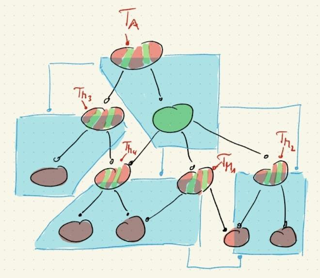

---

<!-- Page 195 of 493 -->

07-TestbarkeitsteigernmitSurrogaten 186
Wenn du hier das DIP ansetzt, um mit Surrogaten die Logik in den Hy-
briden gezielt testbar zu machen, dann erzeugst du eine Menge Rauschen
um den eigentlich nötigen Code herum:
…lassen sich durch Einführung von dynamischen Bindungen besser testen. Der Preis ist
erhöhteCodekomplexität.
LegendezurdynamischenBindung
Etwas Rauschen für mehr Ordnung und Testbarkeit ist ok und nicht zu
vermeiden. Schon jede Funktion fügt Logik einen gewissen Overhead
hinzu,dereigentlichfürdieVerhaltenserzeugungnichtnötigist.Trotzdem
willst du auf Funktionen nicht verzichten. Aber irgendwann wird es halt

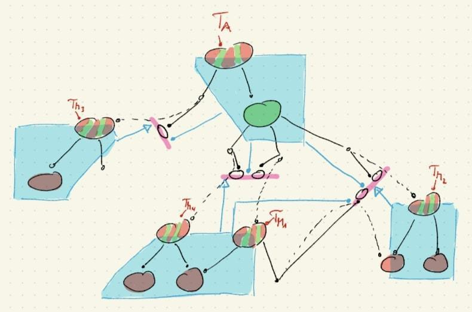

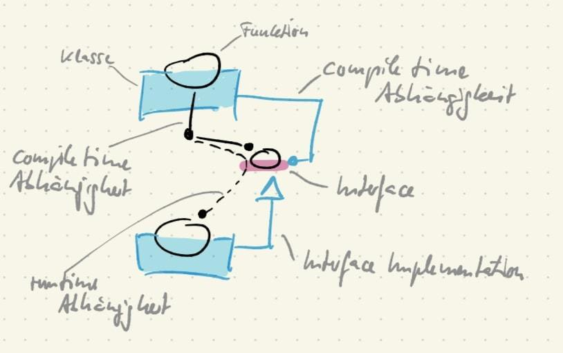

---

<!-- Page 196 of 493 -->

07-TestbarkeitsteigernmitSurrogaten 187
zu viel. Auch wenn die zusätzliche Komplexität gut gemeint ist, kann sie
mehr schaden als nützen. Da musst du aufpassen!
Vor allem aber helfen die Surrogate nicht, einzelne Logikabschnitte in
einem Hybriden gezielt zu testen. Im folgenden Bild ist mit Surrogaten
zwar die Gesamtlogik L* in der Wurzel unabhängig von der Logik in den
Services, von denen sie abhängt, testbar, doch L1 oder L2 oder L3 für sich
genommen, kannst du nicht unter Test stellen.
Funktionale Abhängigkeiten mit dynamischer Bindung zur Produktionszeit (links) und im
Test(rechts).
Je umfangreicher hybride Funktionen sind und je mehr funktionale Ab-
hängigkeiten davon ausgehen, desto größer der Overhead für das Testen
überhaupt der Logik in ihr. Im Beispiel sind es nur zwei Aufrufe um die
herum drei Logikblöcke liegen, auf die Surrogate konzentrieren helfen
sollen. Im Projektalltag sieht das anders aus, wenn Funktionen Dutzende,
gar Hunderte Zeilen Logik umfassen, dann haben sie auch an 10, 20,
50 Stellen funktionale Abhängigkeiten. Selbst wenn du die nicht alle
ausblenden willst (oder kannst), bleibt noch genug übrig, wo du Surrogate
unterschieben könntest, wenn du gewillt bist, den Overhead dafür in
Kauf zu nehmen. Und am Ende sitzt du immer noch mit Dutzenden, gar
Hunderten Zeilen Logik in der zu testenden Funktion da. Was ist dann an
Fokus wirklich gewonnen?
Deshalb lautet meine Empfehlung ganz klar:

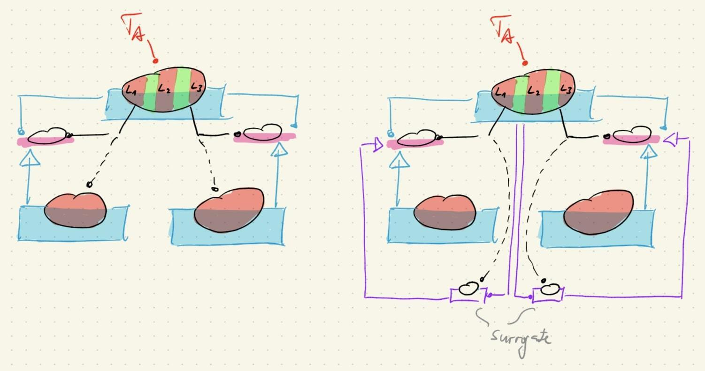

---

<!-- Page 197 of 493 -->

07-TestbarkeitsteigernmitSurrogaten 188
Zuerst Code nach IOSP so weitgehend wie irgend möglich
strukturieren.
Mit IOSP löst du die Teile der Logik in einem Hybriden heraus in eigene
Funktionen. Das mögen noch kleinere Hybride sein, aber wenn du nicht
aufgibst, dann kommst du einer sauberen IOSP-Hierarchie immer näher.
RefactoringtoIOSP
Je höher eine Funktion in einem solchen Baum steht, desto fokussierter
auf Integration sollte sie sein. Denn bei Integrationen gibt es keine Logik
mehr zu testen. Surrogate lassen sich deshalb nicht leichter einschieben,
aber es bringt mehr. Denn zwischen den Aufrufen steht keine Logik in der
Integration. Die hängt tiefer. Dort wurde sie schon getestet.
Dynamische Bindung in einer IOSP-Hierarchie bekommt dadurch einen
anderen Fokus. Es geht nicht mehr darum, Logik testbar zu machen. Die
ist schon testbar, weil sie in Operationen gesammelt ist. Vielmehr wer-
den Äste in einer IOSP-Funktionshierarchie ausgeblendet, um Logik aus
verschiedenen Bereichen im Zusammenhang testen zu können. Surrogate
helfen dem Test einer Komposition von ganz verschiedenen Teilen, von
denen einige ausgeblendet sind, um den Test z.B. zu beschleunigen oder
von einer Hardwareressource unabhängig zu machen.
In diesem Sinn sollte auch das Textanalysebeispiel refaktorisiert werden.
Extraktion eines Belangs
Analysieren() hat noch zwei Verantwortlichkeiten: es wird das Ergeb-
nisprotokoll geschrieben und es findet Komposition von Verantwortlich-

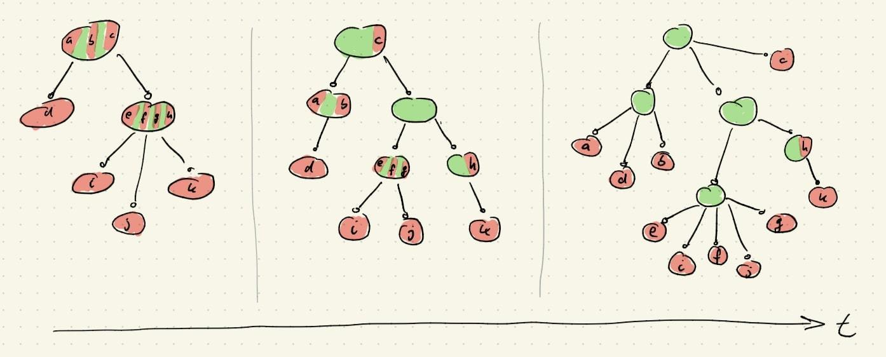

---

<!-- Page 198 of 493 -->

07-TestbarkeitsteigernmitSurrogaten 189
keiten statt (Domänenlogik, Textdateibeschaffung und Ergebnisprotokoll).
Umdie Funktion zu fokussieren,muss noch dieLogik vonVerantwortlich-
keiten extrahiert werden:
1 class Ergebnisse : IErgebnisse
2 {
3 private readonly string _ergebnisdateiname;
4
5 public Ergebnisse(string pfad) {
6 _ergebnisdateiname = Path.Combine(pfad, "ergebnis.csv");
7 File.WriteAllLines(_ergebnisdateiname,
8 new[]{"Dateiname;Zeichenzahl;Wortanzahl"});
9 AnzahlAufzeichnungen = 0;
10 }
11
12 public void Aufzeichnen(string dateiname, int zeichenzahl, int wortanzahl) {
13 File.AppendAllLines(_ergebnisdateiname,
14 new[]{$"{RelativerDateipfad()};{zeichenzahl};{wortanzahl}"});
15 AnzahlAufzeichnungen++;
16
17 string RelativerDateipfad() {
18 var absoluterDateipfad = new Uri("file:///" +
19 dateiname,
20 UriKind.Absolute);
21
22 var absoluterVerzeichnispfad = new Uri("file:///" +
23 Path.GetDirectoryName(_ergebnisdateiname) + "/",
24 UriKind.Absolute);
25
26 return absoluterVerzeichnispfad.MakeRelativeUri(absoluterDateipfad).ToString();
27 }
28 }
29
30 public int AnzahlAufzeichnungen { get; private set; }
31 }
Dabei wandert die Zählung der analysierten Dateien von der Dateibe-
schaffung auf das Ergebnisprotokoll, weil sie dort sinnvoller aufgehoben
erscheint.
Für diesen Belang wird natürlich auch ein Interface definiert:
1 public interface IErgebnisse {
2 void Aufzeichnen(string dateiname, int zeichenzahl, int wortanzahl);
3 int AnzahlAufzeichnungen { get; }
4 }
Zur dynamischen Bindung des Belangs muss in die Textdateianalyse
wieder eine Fabrik injiziert werden, weil das Ergebnisprotokoll mit dem
Pfad konfiguriert wird. Aber das kennst du ja schon:

---

<!-- Page 199 of 493 -->

07-TestbarkeitsteigernmitSurrogaten 190
1 public class Textdateianalyse
2 {
3 private readonly ITextanalyse _analyse;
4 private readonly Func<string, ITextdateien> _textdateienFabrik;
5 private readonly Func<string, IErgebnisse> _ergebnisseFabrik;
6
7 public Textdateianalyse(ITextanalyse analyse,
8 Func<string,ITextdateien> textdateienFabrik,
9 Func<string,IErgebnisse> ergebnisseFabrik) {
10 _analyse = analyse;
11 _textdateienFabrik = textdateienFabrik;
12 _ergebnisseFabrik = ergebnisseFabrik;
13 }
14
15 public int Analysieren(string pfad) {
16 var ergebnisse = _ergebnisseFabrik(pfad);
17 var textdateien = _textdateienFabrik(pfad);
18 foreach (var dateiinhalt in textdateien.Dateiinhalte) {
19 var ergebnis = _analyse.Analysieren(dateiinhalt.Text);
20 ergebnisse.Aufzeichnen(dateiinhalt.Dateiname,
21 ergebnis.Zeichenzahl,
22 ergebnis.Wortanzahl);
23 }
24 return ergebnisse.AnzahlAufzeichnungen;
25 }
26 }
Analysieren()istjetztnahezueinesaubereIntegration.Diedarinnoch
befindliche Dark Logic ist trivial und ist nicht für sich genommen test-
würdig. Wenn jetzt alle dynamischen Bindungen durch Surrogate ersetzt
werden,wirdalsonurdieIntegrationsleistungderFunktiongetestet.Spielt
alles korrekt zusammen?
1 [Fact]
2 public void Test_mit_SurrogatenV3()
3 {
4 var textanalyseSurrogat = Substitute.For<ITextanalyse>();
5 textanalyseSurrogat.Analysieren("123").Returns((3, 30));
6 textanalyseSurrogat.Analysieren("12").Returns((2, 20));
7
8 var textdateiSurrogat = Substitute.For<ITextdateien>();
9 textdateiSurrogat.Dateiinhalte.Returns(new[] {
10 ("textdateien/foo.txt", "123"),
11 ("textdateien/bar/baz.txt", "12")
12 });
13
14 var ergebnisseSurrogat = Substitute.For<IErgebnisse>();
15 ergebnisseSurrogat.AnzahlAufzeichnungen.Returns(2);
16
17 var sut = new Textdateianalyse(
18 textanalyseSurrogat,
19 pfad => textdateiSurrogat,
20 pfad => ergebnisseSurrogat);
21
22 var result = sut.Analysieren("textdateien");
23
24 result.Should().Be(2);
25 ergebnisseSurrogat.Received().Aufzeichnen("textdateien/foo.txt", 3, 30);
26 ergebnisseSurrogat.Received().Aufzeichnen("textdateien/bar/baz.txt", 2, 20);
27 }
Das Surrogat für Ergebnisse ist in diesem Fall nach Martin Fowler vor
allem ein Mock, weil es am Ende befragt wird, wie es aufgerufen wurde.

---

<!-- Page 200 of 493 -->

07-TestbarkeitsteigernmitSurrogaten 191
Eine Datei wird nicht mehr geschrieben. Ohne solchen Ressourcenzugriff
ist der Test performanter.
Refactoring to Functional Core
Die Aufgabe von Textdateianalyse ist jetzt fokussiert auf Integration
von Belangen. Alle lassen sich ausblenden, insbesondere die, die auf
Ressourcen zugreifen. Lohnt sich da denn noch ein Test von Analysie-
ren()?Durchaus.DieHypothese,dassdieKompositionallerBelangedas
gewünschte Verhalten herstellt, will überprüft werden.
Der Aufwand mit drei Surrogaten ist dafür allerdings sehr groß. Aber vor
allem wird hier Kernlogik “simuliert”, die eigentlich performancemäßig
nicht teuer ist und gut in einem Akzeptanztest mit getestet werden kann.
DerAufwandfüreinSurrogatfürTextanalyseistüberflüssig.Diereale
Domänenlogik kann injiziert werden:
1 [Fact]
2 public void Test_mit_SurrogatenV4()
3 {
4 var textdateiSurrogat = Substitute.For<ITextdateien>();
5 textdateiSurrogat.Dateiinhalte.Returns(new[] {
6 ("textdateien/foo.txt", "1 2 3"),
7 ("textdateien/bar/baz.txt", "1 2")
8 });
9
10 var ergebnisseSurrogat = Substitute.For<IErgebnisse>();
11 ergebnisseSurrogat.AnzahlAufzeichnungen.Returns(2);
12
13 var sut = new Textdateianalyse(
14 new Textanalyse(),
15 pfad => textdateiSurrogat,
16 pfad => ergebnisseSurrogat);
17
18 var result = sut.Analysieren("textdateien");
19
20 result.Should().Be(2);
21 ergebnisseSurrogat.Received().Aufzeichnen("textdateien/foo.txt", 5, 3);
22 ergebnisseSurrogat.Received().Aufzeichnen("textdateien/bar/baz.txt", 3, 2);
23 }
AllerdingsmüssennundieTestdatenangepasstwerden,weiljetztwirklich
analysiert wird. Die vorherigen Werte, die das Surrogat geliefert hat,
waren ja einer früheren viel einfacheren Surrogatlogik geschuldet.
Dass die Domänenlogik selbst schon korrekt ist, wird hier angenommen.
Da sie als Modul herausgezogen ist, gibt es dafür sicher mindestens einen
Modultest. Deshalb können die Daten im Akzeptanztest sehr simpel sein.
Es geht weiterhin um die Integration.

---

<!-- Page 201 of 493 -->

07-TestbarkeitsteigernmitSurrogaten 192
Aber warum wird nun die Domänenlogik überhaupt injiziert? Sie wird ja
nicht mehr ersetzt. Die Kompositionsklasse Textdateianalyse könnte
die Instanz selbst erzeugen. Und wenn das der Fall ist, kann die nächste
Frage lauten: Muss die Domänenlogik überhaupt in einer Methode eines
ObjekteszurVerfügunggestelltwerden,wennsienichtdynamischgebun-
den oder konfiguriert werden muss?
Tatsächlich folgt aus dem IOSP auf architektonischer Ebene eine Ver-
schiebung hin zu einer Struktur, bei der ein Domänenlogikkern näher an
der Funktionalen Programmierung steht, denn an der Objektorientierung.
Und “drumherum” werden Ressourcenzugriffe in Objekten gekapselt, um
dynamisch gebunden zu werden. Diese Strukturierung nennt sich auch
Functional Core, Imperative Shell⁷².⁷³
Konkret bedeutet das, die Domänenlogik kann als statische Funktion
ausgelegtwerdenundwirdnichtinjiziert.DieIntegrationistdaranwieder
statisch gebunden - aber das macht nichts. In Tests soll die Domänenlogik
nichtersetztwerden.UndihreeigeneTestbarkeitsteigtdurchdiestatische
Funktion sogar:
1 public class Textdateianalyse
2 {
3 private readonly Func<string, ITextdateien> _textdateienFabrik;
4 private readonly Func<string, IErgebnisse> _ergebnisseFabrik;
5
6 public Textdateianalyse(Func<string,ITextdateien> textdateienFabrik, Func<string,IErg\
7 ebnisse> ergebnisseFabrik) {
8 _textdateienFabrik = textdateienFabrik;
9 _ergebnisseFabrik = ergebnisseFabrik;
10 }
11
12 public int Analysieren(string pfad) {
13 var ergebnisse = _ergebnisseFabrik(pfad);
14 var textdateien = _textdateienFabrik(pfad);
15 foreach (var dateiinhalt in textdateien.Dateiinhalte) {
16 var ergebnis = Textanalyse.Analysieren(dateiinhalt.Text);
17 ergebnisse.Aufzeichnen(dateiinhalt.Dateiname,
18 ergebnis.Zeichenzahl,
19 ergebnis.Wortanzahl);
20 }
21 return ergebnisse.AnzahlAufzeichnungen;
⁷²https://www.destroyallsoftware.com/screencasts/catalog/functional-core-imperative-
shell
⁷³Hinter functional core stehe ich, weil es darum geht, den Kern, die Domäne mehr
aus der Perspektive der Funktionalen Programmierung zu sehen.Imperative shell hingegen
finde ich etwas unglücklich. Etwas treffender fände ich schon procedural shell, aber noch
besser wäre wohl object-oriented shell. Denn die shell wird in OO-Sprachen durch Objekte
repräsentiert,dieoftkonfigurierbarsindodereinInterfaceimplementieren,weilsieinTests
durchSurrogateersetztwerdensollen.IndiesenObjektenfindendanndieSeiteneffektestatt;
dortwirdaufRessourcenzugegriffen.Derfunctionalcorewirddurchsiedavonfreigehalten
undkannmitpurefunctions implementiertwerden.

---

<!-- Page 202 of 493 -->

07-TestbarkeitsteigernmitSurrogaten 193
22 }
23 }
24
25 class Textanalyse {
26 public static (int Zeichenzahl, int Wortanzahl) Analysieren(string text) {
27 var zeichenzahl = text.Length;
28 var worte = text.Split(new[] {' ', '\\n', '\\r', '\\t'},
29 StringSplitOptions.RemoveEmptyEntries);
30 var wortanzahl = worte.Length;
31 return (zeichenzahl, wortanzahl);
32 }
33 }
Die Komplexität des Codes sinkt: kein Interface mehr für die Domänenlo-
gik, keine Injektion, kein Surrogat.
Textanalysealsfunctionalcore,derstatischgebundenist;Ressourcenzugriffealsimperative
shell,diedynamischgebundensind.
Schritte in die Objektorientierung
Du fragst dich nun vielleicht, was denn das Kriterium sei, um echt
objektorientiert zu arbeiten, wenn es doch beim Testen scheinbar nur eine
geringe Rolle spielt.
Das IOSP und test-first legen folgende Gründe für “echte” Objektorientie-
rung nahe, also für den Einsatz von Klassen, die du instanziierst:
1. Denke zunächst gar nicht an Objektorientierung, sondern nur an
Funktionen und Module. Das Wichtigste ist, Kompositionshierar-
chien so in Module zu strukturieren, dass eine angemessene Testab-
deckung existiert mit Akzeptanztests und Modultests und Gerüst-
tests. Das IOSP soll dich dabei leiten. Wenn dabei nur statische
Funktionen auf statischen Klassen herauskommen, dann ist das
erstmal ok. Beispiel: Klasse Textanalyse mit Analysieren()
für die Domänenlogik.

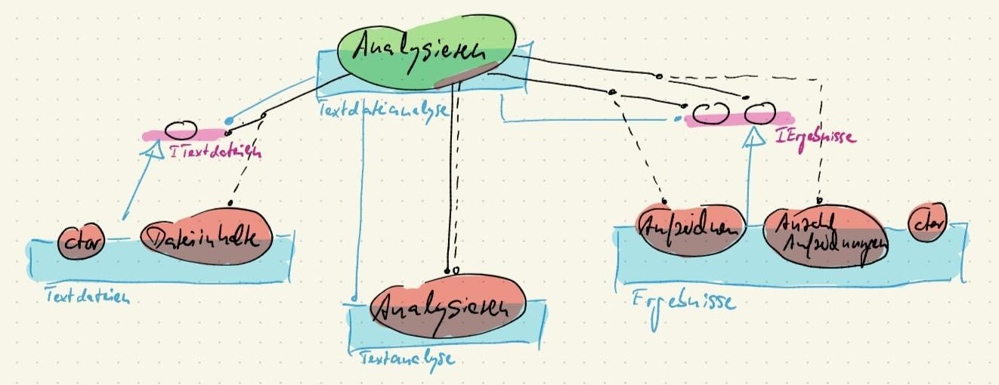

---

<!-- Page 203 of 493 -->

07-TestbarkeitsteigernmitSurrogaten 194
2. Sobald du merkst, dass Funktionen einer Klasse von einer Kon-
figuration profitieren, d.h. gemeinsame Daten haben, die ihre
Arbeit beeinflussen, mache die Klassen zu Instanzklassen und die
Funktionennicht-statisch.Beispiel:DieKlassenTextdateienund
Ergebnisse werden beide mit dem pfad konfiguriert.
3. Sobald du merkst, dass Funktionen mit vorkonfigurierten Objek-
tenarbeiten können, injiziereInstanzen(IoC)vonkonfigurierbaren
Klassen.
4. Sobalddumerkst,dassFunktionenmitganzunterschiedlichenVa-
rianten von Objekten betrieben werden sollen - typische Varianten
sind Produktionslogik vs Surrogat -, dann gib den Instanzklassen
ein Interface und mache Funktionen davon abhängig zur compi-
letime (DIP), statt von Implementationen. Beispiel: Die Klassen
Textdateien und Ergebnisse haben ein Interface, damit sie
injiziert werden können, um Tests Surrogate zu ermöglichen, die
den Umgang mit Ressourcen ersparen.
Eine Variante der konfigurierbaren Logik ist solche, die einfach auf
gemeinsamen Daten arbeitet. Dafür sind Objekte gemacht! Wenn es
also shared state gibt zwischen Methoden, dann wechsle von statischen
Klassen zu Instanzklassen.
Die Kombination von Daten und Logik liegt mit dem IOSP besonders
nahe bei Daten, die in einer Integration von Funktion zu Funktion fließen.
Wenn du nach dem IOSP zerlegst, magst du versucht sein, die Daten-
typen ganz einfach zu halten. In der Textanalyse ist dafür das Tupel
aus Dateiname und Text ein Beispiel. Das kannst du auch so machen -
nur manchmal sind gerade solche Daten gute Kristallisationskeime für
Funktionen. Daraus entstehen dann “richtige Objekte”. Du vermeidest
damit eine so genannte primitive obsession⁷⁴.
Auch wenn diese Schritte jetzt etwas abstrakt waren, sollten sie hier
einmal zumindest genannt werden, um das hiesige test-first Vorgehen
mit der Objektorientierung in Beziehung zu setzen. Eigentlich sind solche
Überlegungen aber schon Sache des Entwurfs, also der der Codierung
vorgelagerten Phase. Du erinnerst dich noch an die Anforderung-Logik
Lücke?
⁷⁴https://refactoring.guru/smells/primitive-obsession

---

<!-- Page 204 of 493 -->

07-TestbarkeitsteigernmitSurrogaten 195
Zusammenfassung
Testbarkeit als Grundlage für automatisierte Tests ist eine Sache der “Er-
reichbarkeit” von Logik. Wie punktgenau können Tests an Logik angelegt
werden?
Den Bedarf für Testbarkeit weckt ein test-first Vorgehen. Wenn du mit
Testcode beginnst, merkst du sehr schnell, ob Produktionslogik daraus
“gut zu erreichen ist”. Spätestens wenn du in Fehler läufst und dich in
längere Debugging-Sitzungen verlierst, ist das ein Zeichen dafür, dass
Logik sich einem unmittelbaren Test noch entzieht; sonst könntest du ja
an problematische Logik noch spezifischer einen weiteren Test ansetzen.
FehltnochTestbarkeit,kannstdusiemitRefaktorisierungherstellen.Dass
damit auch mehr Verständlichkeit entsteht, ist ein schöner Nebeneffekt.
Aber was ist eine wünschenswerte Zielstruktur für die Refaktorisierung?
Das IOSP macht da einen sehr simplen Vorschlag: Lasse Code entweder
die formale Aufgabe der Integration oder der Operation erfüllen. Das be-
zieht sich zunächst auf Funktionen, aber dann auch auf den Schwerpunkt
von Klassen (allgemeiner: Module).
In einer IOSP-Hierarchie ist die Testbarkeit sehr hoch, weil Logik nur in
kleinen Portionen in Operationen verpackt ist. Große Funktionen ergeben
sich bei konsequenter Anwendung des Prinzips einfach nicht, weder für
Integrationen noch für Operationen.
Trotz IOSP-Funktionshierarchie kann es jedoch “weiter oben” im Zerle-
gungsbaum Bedarf geben, nicht immer alle integrierten Äste bei einem
Modul- oder Akzeptanztest zu durchlaufen. Einige gute Gründe mögen
sein:
• Ein Ast verrichtet seine Arbeit so langsam, dass er in Tests seines
Client (in bestimmten Szenarien) mehr behindern denn nützen
würde.
• Der Testaufwand würde für die Bereitstellung und/oder Überprü-
fung von Daten sehr viel aufwändiger durch Einbeziehung des
Astes. Das kann sehr leicht der Fall sein, wenn es bei dem Ast um
Benutzerinteraktionen und Ressourcenzugriffe geht.
• Die Logik im Ast kann nicht jederzeit, wenn der Test sie braucht,
ausgeführt werden, z.B. weil eine Ressource, auf die zugegriffen
wird, nicht ständig zur Verfügung steht.

---

<!-- Page 205 of 493 -->

07-TestbarkeitsteigernmitSurrogaten 196
• Die Lokalisation eines Fehlers wäre schwieriger, wenn auch noch
die Logik im Ast am Test beteiligt wäre.⁷⁵
• FüreinenAstliegtnochgarkeineImplementationvor.Daskannder
Fall bei komponentenorientierter Entwicklung sein, wenn arbeits-
teilig gleichzeitig an Client-Funktionen wie an Service-Funktionen
auf beiden Seiten eines Kontrakts (Interface) gearbeitet wird.
• Die Verteilung von Testdaten auf Testcode und Ressourcen (z.B.
Datei) soll aufgehoben werden. Testcode allein soll aussagekräftig
sein, was die Testkonfiguration angeht.
Für diese Fälle ist es nötig, Äste während des Testlaufs ausblenden
zu können. Das ist die Stunde der Objektorientierung! Polymorphie ist
gefragt, um den Produktionscode der auszublendenden Äste zu ersetzen
durch ein Surrogat.
Zum Einsatz kommt dabei das Prinzipienpaar DIP+IoC. Dessen Nutzen
ist nicht zu verachten. Die Testbarkeit wird damit durch Flexibilisierung
erhöht. Diese Praktik solltest du in deinem Werkzeugkasten haben.
Allerdings: Diese Art der Flexibilisierung hat ihren Preis. Die Komplexität
deines Produktionscodes steigt. Deshalb solltest du Interfaces und Injek-
tionen nicht mit der Gießkanne anwenden. Nicht jede Klasse verdient ein
Interface, nicht jede Abhängigkeit muss dynamisch sein. Schau genau hin,
wo das Sinn macht - und wo nicht!
Hinweise darauf, dass du Logik in einer Instanzklasse mit Interface
verpacken solltest, sind z.B.
• Ressourcenzugriff,d.h.Dateizugriff,Netzwerkkommunikation,Zu-
griff auf Zeit oder Zufallsgenerator, Interaktion mit dem Benutzer
• GeringePerformance,d.h.Logik,diedeutlichZeitbeansprucht,so
dass Testfälle mit ihr lange laufen würden
Klassen, die Datenstrukturen repräsentieren, brauchen hingegen für Test-
zwecke keine Interfaces. Dito Logik, die bei der Performance nicht auf-
trägt; sie muss auch nicht injiziert werden, so dass sogar Instanzklassen
nicht unbedingt nötig sind.
⁷⁵SolideModultestsaufdemAstkönnendiesesRisikoallerdingsstarkreduzieren.Wenn
ein Ast als korrekt angesehen werden kann, kann eine Fehlerursache darin bei Test seines
Clientjaeigentlichausgeschlossenwerden.

---

<!-- Page 206 of 493 -->

07-TestbarkeitsteigernmitSurrogaten 197
Übungsaufgaben
Reflexionsaufgabe
Bitte formuliere eine Frage oder eine Erkenntnis zum Kapiteltext.
• Wo bist du gedanklich hängengeblieben, was ist dir unklar,
was passt für dich irgendwie nicht zusammen, wozu würdest
du dir noch etwas mehr Erklärung wünschen? Steht irgendet-
waszudeinerbisherigenPraxisimWiderspruchunddufragst
dich, warum du etwas ändern solltest?
• Oder: Wann hast du einen Aha-Moment gehabt, was ist
diralsbemerkenswert,spannend,ausprobierenswertaufgefal-
len? Hat irgendetwas “in dir Klick gemacht”, weil dir nun ein
Zusammenhang aufgegangen ist? Oder verstehst du jetzt aus
deiner bisherigen Praxis irgendetwas besser?
Am besten formulierst du Frage bzw. Erkenntnis schriftlich. Indem
du deine Gedanken aufschreibst, wirst du dir ihrer bewusster. Bei
einer Frage kommst du dadurch vielleicht schon einer Antwort aus
dir selbst heraus näher. Bei einer Erkenntnis fällt dir vielleicht schon
etwas ein, das du ab jetzt anders machen kannst.
Aufgabe 1 - CSV-Tabellierung testbarer
machen
In der vorhergehenden Übungsaufgabe zum Daten transformieren
hast du eine Funktion entwickelt, die CSV-Daten in eine ASCII-
Tabelle wandelt. Dieses Szenario soll jetzt erweitert werden.
Anforderungen
Schreibe ein Programm, das Daten in einer CSV-Datei als ASCII-
Tabelle anzeigt. Dateiname und Trennzeichen werden auf der Kom-
mandozeile angegeben.

---

<!-- Page 207 of 493 -->

07-TestbarkeitsteigernmitSurrogaten 198
Benutzungsbeispiel 1:
1 $ showcsv personen.csv
2 Name |Strasse |Ort |Alter|
3 -------------+----------------+-------------+-----+
4 Peter Pan |Am Hang 5 |12345 Einsam |42 |
5 Maria Schmitz|Kölner Straße 45|50123 Köln |43 |
6 Paul Meier |Münchener Weg 1 |87654 München|65 |
7 Bruce Wayne | |Gotham City |36 |
8 4 Datensätze
9 $
Die zugrundeliegenden Daten in personen.csv:
1 Name;Strasse;Ort;Alter
2 Peter Pan;Am Hang 5;12345 Einsam;42
3 Maria Schmitz;Kölner Straße 45;50123 Köln;43
4 Paul Meier;Münchener Weg 1;87654 München;65
5 Bruce Wayne;;Gotham City;36
Benutzungsbeispiel 2:
1 $ showcsv , population.csv
2 Country Name|Country Code|Year|Value |
3 ------------+------------+----+---------+
4 Arab World |ARB |1960|92197753 |
5 Arab World |ARB |1961|94724510 |
6 Arab World |ARB |1962|97334442 |
7 Arab World |ARB |1963|100034179|
8 ...
9 15409 Datensätze
10 $
Die zugrundeliegenden Daten können bei Github heruntergeladen
werden (477KB); hier nur ein Ausschnitt:
1 Country Name,Country Code,Year,Value
2 Arab World,ARB,1960,92197753
3 Arab World,ARB,1961,94724510
4 Arab World,ARB,1962,97334442
5 Arab World,ARB,1963,100034179
6 ...
(Die ... stehen für weitere Daten, die nicht gezeigt sind.)
Benutzungsbeispiel 3:
1 $ showcsv
2 Usage: showcsv [<Trennzeichen>] <Dateiname>
3 $
Die gesamte Funktionalität soll erreichbar sein über eine Klasse mit
Funktion wie folgt:

---

<!-- Page 208 of 493 -->

07-TestbarkeitsteigernmitSurrogaten 199
1 class Application {
2 public Application(...) {...}
3 public void Run() {...}
4 }
InnerhalbvonRun()kanndiebisherigeLösungmitTabellieren()
aufgerufen werden.
TODO 1
Auf der Funktion Run() soll ein Akzeptanztest mit den Daten aus
personen.csv laufen.
• Überlege, wie Parameter aus der Umwelt (Kommandozeile)
nach Run() hinein kommen können.
• Überlege,wiedasvariableTrennzeichenandieentsprechende
Logik unterhalb von Tabellieren() kommt.
• Überlege, wie die Konsolenausgabe überprüft werden kann.
DieSignaturvonRun()istvorgegeben.DieParameterdesKonstruk-
tors von Application kannst du selbst festlegen.
https://raw.githubusercontent.com/datasets/population/master/data/
population.csv
Aufgabe 2 - Game-of-Life testbarer ma-
chen
In der Übungsaufgabe zu Game-of-Life hast du ein Programm ent-
wickelt, das Input aus einer Datei liest und Ergebnisse in Dateien
schreibt.
TODO 1
Baue zunächst diese Lösung so um, dass es auch darin eine Klasse
wie folgt gibt:
1 class Application {
2 public Application(...) {...}

---

<!-- Page 209 of 493 -->

07-TestbarkeitsteigernmitSurrogaten 200
3 public void Run() {...}
4 }
TODO 2
StrukturieredanndenCodeso,dassdasEinlesenderinitialenMatrix
und das Speichern der Generationen und auch die Ausgabe der
Fortschrittspunkte auf der Konsole durch Surrogate ersetzt werden
kann.
Schreibe einen Akzeptanztest für Run(), der für diese I/O-Belange
Surrogate einsetzt.

---

<!-- Page 210 of 493 -->

08 - Experimentell codieren
in der Komplexität
Bei gegebener Ausgangsfunktion mit Akzeptanztests kannst du bisher
ein Problem als trivial, einfach oder kompliziert betrachten und deine
Vorgehensweise danach wählen. Aber was, wenn dir noch etwas fehlt?
Was, wenn du dich nicht einmal in der Lage siehst, mit komplementären
Teilproblemen etwas Kompliziertes bis zum Schluss anzugehen? Spätes-
tens bei einem Blatt kommst du nicht weiter und siehst weder einen
naheliegenden Weg zur Logik, noch fällt dir eine weitere Zerlegung ein.
Dann ist das Problem mehr als kompliziert, dann ist es komplex. Komple-
xe Probleme haben eine konkrete äußere Form, doch die Lösung mittels
Logik (und Struktur) liegt für dich im Nebel.
Komplexität ist dadurch gekennzeichnet, dass Nachdenken allein nicht
hilft, um einen Wunschzustand herzustellen. Du kommst mit einer Analy-
sevorabnichtzumZiel,wieesnochbeikompliziertenProblemenmöglich
ist.

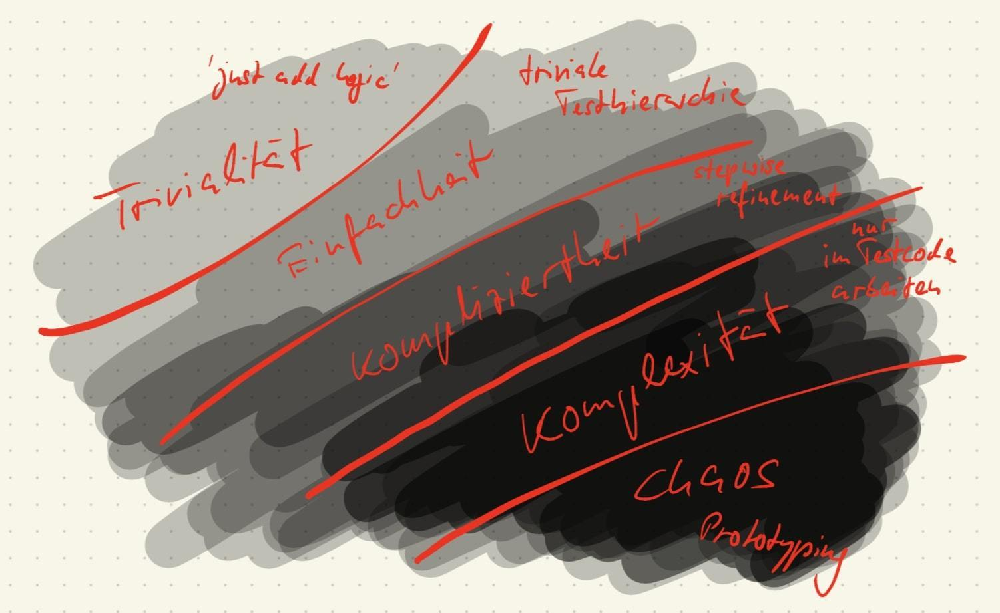

---

<!-- Page 211 of 493 -->

08-ExperimentellcodiereninderKomplexität 202
Komplexe Probleme erfordern vielmehr einen tastenden,
einen experimentellen Ansatz. Die Lösung kann nur mit
einem trial-and-error Vorgehen gefunden werden.
Verwechsel komplexe Probleme allerdings nicht mit dem Chaos! Im
Chaos weißt du nicht einmal, wie das Problem konkret aussieht.
Du hast keine klaren Anforderungen in Form von Beispielen und
Funktionssignatur. Das ist bei komplexen Problemen anders. Dort ist
das Problem klar - nur fällt dir keine Lösung ein.
Daraus folgt, dass du eine Zielmarke hast, auf die duch zu bewegen
kannst. Du weißt, wann das Problem gelöst ist. Das ist eine viel bessere
Ausgangsposition als im Chaos.
Daraus folgt aber auch, dass du dich experimentell bewegen musst -
und das tut dem Produktionscode nicht gut. Produktionscode muss ver-
ändert werden können; Wandlungsfähigkeit ist grundsätzlich wichtig.
Dafür brauchst du Testbarkeit und Verständlichkeit. Erinnere dich an
die Einleitung: Clean Code für dauerhaft höhere Produktivität. Doch
Veränderung ist kein Selbstzweck und birgt immer eine gewisse Gefahr
der “Verschlimmbesserung”.
Hier eine Analogie: Mit einem Blatt Papier kannst du ein Papierflugzeug⁷⁶
bauen. Du musst es nur an den richtigen Stellen falten. Das Papier ist
flexibel. Wenn du weißt, wo die Falten anzusetzen sind, dann nutzt du
diese Flexibilität geschickt aus.
Wenn dir jedoch nicht klar ist, welche
Veränderungen ein Blatt Papier durch-
laufen sollte, um gute Flugeigenschaf-
ten zu bekommen, dann solltest du
das nicht an dem einzigen Blatt, das
du hast, experimentell herausfinden.
DurchhäufigesFaltenanunterschiedli-
chenStellenverliertdasPapierwertvol-
le Eigenschaften für den Flugzeugbau
und das Fliegen. Aus einem am Ende
⁷⁶Quelle:Wikipedia

---

<!-- Page 212 of 493 -->

08-ExperimentellcodiereninderKomplexität 203
ziemlich zerknüllten Blatt kannst du
auch mit der besten Bauanleitung nichts Flugtüchtiges mehr herstellen.
Ein oder zweimal kannst du dich beim Falten eines Papierflugzeugs
vielleicht vertun und eine Falz korrigieren. Aber besser nicht häufiger.
Genauso ist es beim Codieren. Bei trivialen und einfachen Problemen
kannst du dich mal vertun mit der Logik. Auch die Zerlegungshierarchie
eines komplizierten Problems kannst du während der Codierung noch
etwas “gerade ziehen”. Sobald die Unsicherheit jedoch größer ist… lass
die Finger weg vom Produktionscode!
Insofern gleichen komplexe Probleme den chaotischen: Du solltest
nicht versuchen, sie im Produktionscode zu lösen.
Welches Problem du als komplex ansiehst, ist wieder ganz subjektiv. Was
für dich komplex ist, kann für jemand anderen nur kompliziert oder gar
einfachsein-undumgekehrt.Grämedichnicht,wennduNebelstatteiner
Lösung vor dir siehst. Wähle einfach nur eine andere Kraftübertragung
von deinem Entwicklerhirn auf den Code.
Experimentelles Vorgehen im Testcode
Komplexe Probleme im hiesigen Sinn, sind gewöhnlich nicht riesig. Im
Rahmen eines iterativ-inkrementellen Vorgehens mit einer entwicklerori-
entierten Anforderungsanalyse und einem systematischen Entwurf ent-
stehen Funktionen, die keine Hunderte von Zeilen Code mehr umfassen
werden. Denke an die Teilprobleme in den Blättern eines Zerlegungs-
baums:WenndudortuntenangekommenbistunddieOperationdirnicht
trivial oder einfach erscheint und dir auch keine weitere Zerlegung mehr
einfällt… dann stehst du vor einem komplexen Problem in der Codierung.
Bevor du ein Problem also endgültig als komplex klassifizierst, versuche
es zumindest als kompliziert zu betrachten und zu zerlegen. Vielleicht ist
nicht das Ganze komplex, sondern es steckt nur ein kleinerer komplexer
Kern darin.
Aber irgendwann kannst du es dann nicht mehr leugnen: Du hast ein klar
umrissenes Problem, nur fällt dir keine weitere Zerlegung mehr ein und
Logik steht dir auch nicht vor Augen. Was nun?
Die Antwort ist:

---

<!-- Page 213 of 493 -->

08-ExperimentellcodiereninderKomplexität 204
TDD as if you meant it (TDDaiymi)
TDDaiymi wurde von Keith Braithwaite aus einer Frustration mit cTDD
heraus entwickelt. Für ihn war cTDD im Grunde zu lasch; Entwickler
konnten zu leicht davon abweichen und insbesondere den wichtigen
Refaktorisierungsschritt überspringen. Seine Motivation findest du hier⁷⁷
näher beschrieben. Weitere Perspektiven darauf kannst du hier⁷⁸ und
hier⁷⁹ studieren.
Wie der Name schon sagt, ist TDDaiymi eine Variante von cTDD. Der
alles entscheidende Unterschied besteht jedoch darin, dass TDDaiymi
vollständig im Testcode betrieben wird. Eine Refaktorisierung wird
damit am Ende unausweichlich.
Die cTDD Regeln lauten:
1. red: Schreibe zuerst Testcode, der vom Testframework (und/oder
dem Compiler) natürlich als rot, d.h. nicht erfüllt angezeigt wird.
2. green:SchreibedenProduktionscode,derdasvomTestgewünschte
Verhalten erzeugt. Damit wird der Test erfüllt und vom Testframe-
work als grün angezeigt. In diesem Schritt konzentrierst du dich auf
die Herstellung von Laufzeitqualität.
3. refactor: Abschließend bringe die Qualität des Codes für dauerhaft
hohe Produktivität auf Augenhöhe mit den Laufzeitqualitäten. Stel-
le Ordnung im Code her.
Bei cTDD findet zwischen red und green/refactor ein Wechsel des Codes
statt: zuerst Testcode, dann Produktionscode, dann wieder Testcode usw.
DieseparalleleEntwicklungvonzwei“Codesträngen”istgenausowichtig
wie in Unternehmen eine doppelte Buchführung.
Der schwierigste Schritt dabei ist jedoch der letzte. Die Refaktorisierung
fällt auch vielen TDD-Enthusiasten schwer. Denn wohin soll refaktori-
siert werden? Wie sieht sauberer Code aus? Dazu macht cTDD kaum
eine Aussage. Der Code soll nach der Refaktorisierung keine Duplikate
⁷⁷https://cumulative-hypotheses.org/2011/08/30/tdd-as-if-you-meant-it/
⁷⁸https://gojko.net/2009/02/27/thought-provoking-tdd-exercise-at-the-software-
craftsmanship-conference/
⁷⁹https://www.markwithall.com/programming/2015/06/09/test-driven-development-
as-if-you-meant-it-reviewed-part-i.html

---

<!-- Page 214 of 493 -->

08-ExperimentellcodiereninderKomplexität 205
mehr aufweisen… Leider ist das Aufspüren von Duplikaten aber keine so
einfache Sache, wie es zunächst scheint. Aber andere Prinzipien dürfen
auch gern eingehalten werden, z.B. das SRP oder das SLA. Nur, wie sehen
die im Code aus?
All diese Fragen sind nicht unmöglich zu beantworten; sie fallen dem-
jenigen der mit cTDD einem größeren Ziel zustrebt allerdings ungleich
schwererzubeantwortenalsdennächstenTestzuschreibenundaufGrün
zu bekommen.
Wenn du hingegen nicht nur cTDD als Pfeil im Köcher hast und dir
erlaubst, Probleme als kompliziert zu betrachten und zu zerlegen und
dabei das IOSP einhältst, dann gehst du schon vielen Refaktorisierungs-
problemen aus dem Weg. Dein Code ist dann schon sehr ordentlich. Mit
komplementärer Zerlegung, die für cTDD nur noch einfache Probleme
übriglässt, ist cTDD also bereits entschärft. Die Not, die Keith Braithwaite
gespürt hat, solltest du nicht mehr in gleicher Weise empfinden.
Dennoch ist TDDaiymi ein wertvolles Vorgehen! Weniger wegen der
damit erzwungenen Refaktorisierung, als vielmehr für die Problemlösung
im Testcode allein. Dort kannst du dir alle möglichen Experimente leisten.
Durch keinen Umweg, durch keine Sackgasse wird dein Produktions-
code “zerknittert”. Erst am Ende, wenn du den Nebel der Komplexität
verscheucht hast und klar siehst, nimmst du eine Veränderung am Pro-
duktionscode vor. Dort materialisiert scheinbar magisch auf einmal die
korrekte Lösung.
Keith Braithwaite hat dafür die cTDD Regeln angepasst:
1. red: wie bei cTDD
2. green:wiebeicTDD,allerdings:SchreibedenCodeausschließlich
in der Testmethode aus dem ersten Schritt!
3. refactor: wie bei cTDD, achte hier jedoch wirklich zuerst auf
Duplikate. Nebenbedingungen für die Refaktorisierung sind:
1. Eine neue Methode darfst du nur einführen während der Re-
faktorisierung. In Schritt 2 ist das nicht erlaubt! Vorzugsweise
extrahierst du zuerst Code aus Schritt 2 in eine neue Methode. Falls
es nicht anders geht, kannst du aber auch Code aus Schritt 2 in eine
bestehende Methode verschieben.

---

<!-- Page 215 of 493 -->

08-ExperimentellcodiereninderKomplexität 206
2. Eine neue Klasse darfst du nur einführen während der Refak-
torisierung. Bevor du eine neue Klasse neben einer Testklasse
anlegst, sollte aber schon eine Methode in der Testklasse
existieren, die du dann dorthin bewegst.
Die grundlegenden cTDD Phasen bleiben dieselben. Wo du sie allerdings
ausführst ändert sich: ausschließlich im Testcode. Dort ist es gefahrlos.
Dort spielst du quasi in einer Sandkiste.
Beispiel #1: FromRoman revisted
Das hört sich für dich wahrscheinlich abstrakt an. Dir fehlt ein Gefühl
für die Veränderung “der Energie” beim Codieren durch dieses Vorgehen.
Deshalb hier ein erstes Beispiel:
Die Funktion int FromRoman(string roman) soll ein weiteres
Mal implementiert werden - allerdings jetzt mittels TDDaiymi. Die
dir nun schon sehr vertraute Domäne macht den Vergleich mit
anderen Vorgehen leicht.
Die Umsetzung beginnt auch bei TDDaiymi mit einem Akzeptanztest.
Was am Ende herauskommen soll, ist selbst bei komplexen Problemen ja
klar.
1 [Fact]
2 public void Akzeptanztest() {
3 var input = "MCMLXXXIV";
4
5 var result = RomanConverter.FromRoman(input);
6
7 result.Should().Be(1984);
8 }
Die Funktion im Produktionscode existiert dann schon, doch bleibt sie
leer. Der Test steht auf Rot bis ganz zum Schluss. Das weitere Vorgehen
ignoriert den Produktionscode. Bei TDDaiymi versuchst du nicht, dich an
ein Grün des Akzeptanztests im Produktionscode “heranzuwurschteln”.

---

<!-- Page 216 of 493 -->

08-ExperimentellcodiereninderKomplexität 207
Stattdessen veranstaltest du ausschließlich im Testcode Experimente, die
dich dem Ziel näherbringen. Das Vorgehen bei TDDaiymi ist wie bei
cTDD also erstmal inkrementell.
Inkrement 1
Wie kann ein ganz einfacher Test für das Problen aussehen (red)? Im
einfachsten Fall so:
1 [Fact]
2 public void Test1() {
3 var input = "I";
4
5 var result = 0;
6
7 result.Should().Be(1);
8 }
Es wird keine Funktion aufgerufen. Die Testlogik und die verhaltenserzeu-
gende Logik stehen beide im Test. Zunächst ist da aber nichts außer den
Testdaten: Was soll verarbeitet werden, wie lautet der input? Welches
Ergebnis (result) wird dafür von der Logik erwartet (1)?
Im zweiten Schritt (green) löst minimale Logik das Probleminkrement in
situ.
1 [Fact]
2 public void Test1() {
3 var input = "I";
4
5 var result = input == "I" ? 1
6 : throw new NotImplementedException();
7
8 result.Should().Be(1);
9 }
Die anliegenden Daten nutze ich dabei in sinnvoller Weise, um wirklich
einenSchritt auf dieGesamtlösung zu zumachen.var result=1; wäre
zu trivial. Damit wäre kein Erkenntnisgewinn verbunden.
Eine Refaktorisierung erscheint nach dem Inkrement noch nicht sinnvoll.
Inkrement 2
Das zweiteInkrementkannsehrleicht aufdemersten aufbauen:Der erste
Test wird kopiert und zunächst nur in Bezug auf die Testdaten angepasst:

---

<!-- Page 217 of 493 -->

08-ExperimentellcodiereninderKomplexität 208
1 [Fact]
2 public void Test2() {
3 var input = "V";
4
5 var result = input == "I" ? 1 : throw new NotImplementedException();
6
7 result.Should().Be(5);
8 }
Weil sich die Testdaten verändert haben, die Logik jedoch nicht, ist zu
erwarten, dass der Test rot ist.
Um ihn grün zu bekommen, passe ich die Logik minimal in dem neuen
Test an. Der erste Test bleibt, wie er ist, der zweite macht einen kleinen
Sprung.
1 [Fact]
2 public void Test2() {
3 var input = "V";
4
5 var result = input[0] switch {
6 'I' => 1,
7 'V' => 5,
8 _ => throw new NotImplementedException()
9 };
10
11 result.Should().Be(5);
12 }
Jetzt sind beide Tests grün - aber die Logik unterscheidet sich. Das ist gut!
DieseVervielfachungistgewünscht!DadurchkannstduMustererkennen:
Was bleibt gleich, was verändert sich?
Inkrement 3
Beim nächsten Test dasselbe Vorgehen: Vorhergehenden Test kopieren,
Testdaten verändern, Test rot.
1 [Fact]
2 public void Test3() {
3 var input = "X";
4
5 var result = input[0] switch {
6 'I' => 1,
7 'V' => 5,
8 _ => throw new NotImplementedException()
9 };
10
11 result.Should().Be(10);
12 }
Danach die Logik anpassen:

---

<!-- Page 218 of 493 -->

08-ExperimentellcodiereninderKomplexität 209
1 [Fact]
2 public void Test3() {
3 var input = "X";
4
5 var result = input[0] switch {
6 'I' => 1,
7 'V' => 5,
8 'X' => 10,
9 _ => throw new NotImplementedException()
10 };
11
12 result.Should().Be(10);
13 }
Jetzt ist klar, wie es weitergeht. Für alle römischen Ziffern ist ein Eintrag
in der switch Expression zu erwarten.
Nun kann der Kurs gewechselt werden…
Inkrement 4
Es kommen zweiziffrige römische Zahlen dran:
1 [Fact]
2 public void Test4() {
3 var input = "XV";
4
5 var result = input[0] switch {
6 'I' => 1,
7 'V' => 5,
8 'X' => 10,
9 _ => throw new NotImplementedException()
10 };
11
12 result.Should().Be(15);
13 }
Die Lösung erfolgt zunächst durch Verdopplung. Das ist billig, allemal im
Test.
1 [Fact]
2 public void Test4() {
3 var input = "XV";
4
5 var result = input[0] switch {
6 'I' => 1,
7 'V' => 5,
8 'X' => 10,
9 _ => throw new NotImplementedException()
10 };
11 result += input[1] switch {
12 'I' => 1,
13 'V' => 5,
14 'X' => 10,
15 _ => throw new NotImplementedException()
16 };
17
18 result.Should().Be(15);
19 }

---

<!-- Page 219 of 493 -->

08-ExperimentellcodiereninderKomplexität 210
Doch hier drängt sich nun eine Refaktorisierung auf. Die schnelle Lösung
per Verdopplung sollte nur überprüfen, ob damit das gewünschte Verhal-
ten erzeugt werden kann. Wenn ja, dann darf anschließend gern in Bezug
auf die Ordnung optimiert werden.
1 [Fact]
2 public void Test4() {
3 var input = "XV";
4
5 var result = Map(input[0]);
6 result += Map(input[1]);
7
8 result.Should().Be(15);
9 }
10
11 int Map(char romanDigit) => romanDigit switch {
12 'I' => 1,
13 'V' => 5,
14 'X' => 10,
15 _ => throw new NotImplementedException()
16 };
Statt zweier switch Expressions nur noch eine. Die Refaktorisierung in
eine Methode im Test war laut TDDaiymi erlaubt.
Inkrement 5
Ein weiteres Inkrement soll nun das Muster in der Mengendimension
“Ziffernanzahl” herausarbeiten:
1 [Fact]
2 public void Test5() {
3 var input = "XVI";
4
5 var result = Map(input[0]);
6 result += Map(input[1]);
7
8 result.Should().Be(16);
9 }
Wieder hilft die Kopie von Code als “quick fix”:

---

<!-- Page 220 of 493 -->

08-ExperimentellcodiereninderKomplexität 211
1 [Fact]
2 public void Test5() {
3 var input = "XVI";
4
5 var result = Map(input[0]);
6 result += Map(input[1]);
7 result += Map(input[2]);
8
9 result.Should().Be(16);
10 }
Und damit ist das Muster nun deutlich. Für jede Ziffer ist ein Mapping
nötigunddanndieAdditiondesWerteszumbisherigenResultat.Daslässt
sich leicht in einer Schleife zusammenfassen:
1 [Fact]
2 public void Test5() {
3 var input = "XVI";
4
5 var result = 0;
6 for(var i=0; i<input.Length; i++)
7 result += Map(input[i]);
8
9 result.Should().Be(16);
10 }
Inkrement 6
Die letzte Stufe der Inkrementtreppe besteht aus der Behandlung der
kleineren vor den größeren römischen Ziffern:
1 [Fact]
2 public void Test6() {
3 var input = "IV";
4
5 var result = 0;
6 for(var i=0; i<input.Length; i++)
7 result += Map(input[i]);
8
9 result.Should().Be(4);
10 }
Die bisherige Logik löst das Problem natürlich nicht, ist aber eine gute
Grundlage, in die nun eine Verfeinerung eingearbeitet werden kann:

---

<!-- Page 221 of 493 -->

08-ExperimentellcodiereninderKomplexität 212
1 [Fact]
2 public void Test6() {
3 var input = "IV";
4
5 var result = 0;
6 for (var i = 0; i < input.Length; i++) {
7 result += Map(input[i]);
8 if (i < input.Length - 1 &&
9 Map(input[i]) < Map(input[i + 1]))
10 result -= 2 * Map(input[i]);
11 }
12
13 result.Should().Be(4);
14 }
Diese Lösung ist simpel insofern, als dass sie nur etwas Logik zwischen
die bisherige schiebt. Kein weiterer Umbau findet statt, was die Stabilität
fördert. Ordentlich ist aber natürlich etwas anderes. Doch darum geht es
im Schritt zu Grün noch nicht.
Säubern kann eine nachgelagerte Refaktorisierung. Im ersten Angang
wird das mehrfache Mapping von input[i] herausgezogen:
1 [Fact]
2 public void Test6() {
3 var input = "IV";
4
5 var result = 0;
6 for (var i = 0; i < input.Length; i++) {
7 var value = Map(input[i]);
8 result += value;
9 if (i < input.Length - 1 &&
10 value < Map(input[i+1]))
11 result -= 2 * value;
12 }
13
14 result.Should().Be(4);
15 }
Im zweiten Schritt dann das komplette Mapping, weil immer noch eine
Dopplung in der Logik steht:
1 [Fact]
2 public void Test6() {
3 var input = "IV";
4
5 var values = input.ToCharArray()
6 .Select(Map)
7 .ToArray();
8
9 var result = 0;
10 for (var i = 0; i < values.Length; i++) {
11 result += values[i];
12 if (i < input.Length - 1 &&
13 values[i] < values[i+1])
14 result -= 2 * values[i];
15 }
16
17 result.Should().Be(4);
18 }

---

<!-- Page 222 of 493 -->

08-ExperimentellcodiereninderKomplexität 213
Hier könnte die Lösungssuche beendet werden. Mit einer Extraktion der
Logik in eine Funktion FromRoman() wäre das Ziel erreicht.
Aber wenn du genau hinschaust, erkennst du, dass immer noch etwas
mehrfach geschieht: die Veränderung des Resultats. An zwei Stellen wird
etwas hinzugefügt. (Auch die Subtraktion ist eine Addition, wenn auch
mit negativem Vorzeichen.)
Diese Dopplung kann aufgelöst werden durch eine Trennung der Summa-
tion von der Beachtung der Subtraktionsregel:
1 [Fact]
2 public void Test6() {
3 var input = "IV";
4
5 var values = input.ToCharArray()
6 .Select(Map)
7 .ToArray();
8
9 for(var i=0; i < values.Length-1; i++)
10 if (values[i] < values[i+1])
11 values[i] *= -1;
12
13 var result = 0;
14 for (var i = 0; i < values.Length; i++) {
15 result += values[i];
16 }
17
18 result.Should().Be(4);
19 }
Jetzt gibt es zwei (oder gar drei) Schleifen. Doch das ist eine formale
Vervielfältigung, keine inhaltliche. Damit lässt sich besser leben.
DieLeerzeilen(verticalwhitespace)zeigennachdiesemUmbauallerdings
schon an, dass da ganz verschiedene Verantwortlichkeiten aufeinander
folgen. Die können noch in eigene Methoden herausgezogen werden:
1 [Fact]
2 public void Test6() {
3 var input = "IV";
4
5 var values = Map(input);
6 ApplySubtractionRule(values);
7 var result = Sum(values);
8
9 result.Should().Be(4);
10 }
11
12 private int[] Map(string input)
13 => input.ToCharArray().Select(Map).ToArray();
14
15 private static void ApplySubtractionRule(int[] values) {
16 for (var i = 0; i < values.Length - 1; i++)
17 if (values[i] < values[i + 1])
18 values[i] *= -1;
19 }
20
21 private static int Sum(int[] values) {

---

<!-- Page 223 of 493 -->

08-ExperimentellcodiereninderKomplexität 214
22 var result = 0;
23 for (var i = 0; i < values.Length; i++) {
24 result += values[i];
25 }
26
27 return result;
28 }
Und den krönenden Abschluss bildet die Extraktion der FromRoman()
Methode, die das Ziel der ganzen Mühe war:
1 [Fact]
2 public void Test6() {
3 var input = "IV";
4
5 var result = FromRoman(input);
6
7 result.Should().Be(4);
8 }
9
10 private int FromRoman(string input) {
11 var values = Map(input);
12 ApplySubtractionRule(values);
13 return Sum(values);
14 }
Diese Funktion kann nun zusammen mit den anderen extrahierten in den
Produktionscode verpflanzt werden.
Der Akzeptanztest wird daraufhin grün. Die inkrementellen Tests können
als eine Form von Gerüsttests angesehen und abgerissen werden.
Reflexion
Dieses Beispiel war inhaltlich nicht sehr spannend. Aber genau deshalb
kannst du daran gut ablesen, was durch den Rhythmus des TDDaiymi
Vorgehens gewonnen wird.
Die wesentlichen Unterschiede zu cTDD sind:
• Die Lösung liegt stets vollständig im Test vor.
• Tests können von Inkrement zu Inkrement mit der bis dahin erar-
beiteten Lösung kopiert werden.
• Refaktorisierung wird spätestens am Ende erzwungen.
Daraus folgt nun einiges:

---

<!-- Page 224 of 493 -->

08-ExperimentellcodiereninderKomplexität 215
• Da die Lösung vollständig im Test entsteht, sind dort alle Teile
beisammen. Du musst nicht mehr springen zwischen Testcode und
Produktionscode.DaserhöhtdeinenFokus,dendudringendfürdie
Lösung komplexer Probleme brauchst.
• Mehr Fokus bekommst du auch durch die Abwesenheit von Rau-
schen. Produktionscode, der schon um die Stelle herum existiert,
wo du eine Änderung einbringen musst, würde dich ablenken.
• Indem du von Test zu Test vollständige Lösungen bewahrst, kannst
du Vergleiche zwischen den Lösungsschritten ziehen. Du kannst
visuell schnell ein Diff herstellen, das dir deine Bewegungsrichtung
deutlich macht; nicht nur siehst du Tests inkrementell wachsen,
auch der Lösungscode liegt vor dir in Inkrementen. Damit hast
du mehr Futter für eine Reflexion über deine “Theorie”, wie eine
Lösung aussehen könnte. Das ist für die Bewältigung komplexer
Problem sehr hilfreich.
• Refaktorisierungistnichtmehroptional.Dumusstzumindesteine
Funktion für deine Lösungslogik herausziehen, um etwas zu haben,
das du als Ergebnis in den Produktionscode einpflanzen kannst.
Schon so unterstützt TDDaiymi ordentlichen Code verlässlicher als
cTDD. Aber es gibt auch noch die andere Seite: Um überhaupt
ein Problem mit TDDaiymi angehen zu können, muss dein Pro-
duktionscode eine grundlegende Ordentlichkeit haben, denn sonst
kannst du erstens daraus keine Funktionen als Bausteine in der
Lösung benutzen, die du mit TDDaiymi im Testcode entwickelst.
ZweitenskönntestdukeineLogikvonüberschaubaremUmfangaus
demProduktionscodeherauslösenundals“Samenkorn”indenTest-
codeeinpflanzen,umsiemitTDDaiymianzupassen.TDDaiymiför-
dert eine feingranulare Strukturierung von Code mit Funktionen,
wie sie durch IOSP entsteht. Komplementäre Zerlegung arbeitet
einer Lösungsfindung mittels TDDaiymi allemal für Operationen
in die Hände.
Du kannst dir bei TDDaiymi den Testcode als Werkbank⁸⁰ vorstellen,
auf dem du ein Bauteil isoliert herstellst. Es ist dem Zusammenhang der
Maschine,inderessonstwirkt,entnommen.DukannstesvonallenSeiten
betrachten und bearbeiten. Wenn du dann mit der Qualität deiner Arbeit
zufrieden bist, setzt du das Bauteil in die Maschine ein.
⁸⁰Bildquelle:ThisisEngineeringRAEngbeiUnsplash

---

<!-- Page 225 of 493 -->

08-ExperimentellcodiereninderKomplexität 216
Die unterschiedlichen Vorgehen für triviale, einfache und komplizierte
ProblemekannstduvergleichenmitdenGängeneinesAutos.Wenndudie
Logik einfach hinschreiben kannst, kommst du am schnellsten voran, du
cruist im 5. Gang. Dich mit inkrementellenTestsan die Logik anzunähern,
istder4.Gang.KomplementäreZerlegungistder3.Gang.UndTDDaiymi
ist nochmal ein Gang zurückgeschaltet: Wenn es richtig schwierig wird,
wenn der Berg steil ist, den du hochfährst, dann musst du das eben im 2.
Gang tun.
NunmagdiralsFrageaufderZungeliegen:WarumnichtBranchesbenut-
zen, um Unordnung im Produktionscode zu vermeiden? Wenn komplexe
ProblemeaufeinemeigenenCode-RepositoryBranchgelöstwerden,dann
können doch im Notfall alle Änderungen einfach verworfen werden.
Das ist korrekt und so kannst du natürlich arbeiten. Das ist ein gutes
weiteres,billigesSicherheitsnetzfürProblemejedenSchwierigkeitsgrades.
Allerdings wird dadurch nicht verhindert, dass Produktionscode womög-
lichdurchunnötigeVeränderungengeht,undesentstehtkeinFokusdurch
Herauslösen des komplexen Problems in den Testcode und es wird kein
Druck ausgeübt, der zu feingranulareren Strukturen im Produktionscode
führt.
Wenn du willst, kann du dich auch weiter durch Nutzung eines Code-
Repositoryunterstützen,indemduKentBecksVorschlagzueinemtest&&
commit||revert⁸¹)Vorgehenfolgst.Gerade bei derLösungvonkomplexen
Problemen ist zu erwarten, dass ein “Logikexperiment” fehlschlägt. Wenn
ein roter Test durch deine Intervention nicht wie gewünscht grün wird,
rolle ihn einfach zurück, denke nochmal nach und fange von vorn an.
Mache reinen Tisch. Lasse dich nicht in einen Debugging-Strudel ziehen,
in dem du krampfhaft versuchst, Grün zu erzwingen.
⁸¹https://link.medium.com/tPIqJv7mE6

---

<!-- Page 226 of 493 -->

08-ExperimentellcodiereninderKomplexität 217
Bei komplexen Problemen ist experimentelles Vorgehen gefragt, weil
du keinen geraden Weg zur Lösung siehst. Vorsicht ist geboten, um
den Produktionscode nicht zu früh zu optimieren. Denn Logik für eine
Lösung in Produktionscode einsetzen, ist eine Form von Optimierung; er
funktioniertanschließendbesser.Zufrühwürdestdudastun,wenndudir
nicht im Klaren darüber bist, wie diese Optimierung eigentlich aussieht.
VondemselbenGedankenwirdauchdiekomplementäreZerlegunggetrie-
ben. Mit ihr hältst du dich zurück bei der Veränderung von Produktions-
code.Du denkstzuerstdarüber nach,wieeine Lösunggünstig strukturiert
werden könnte, indem sie nicht als Ganzes, als Monolith implementiert
wird, sondern in Form von Teillösungen für Teilprobleme.
Beispiel #2: Eine ruhige Bowlingkugel
schieben
TDDaiymi soll dir helfen, Probleme zu lösen, bei denen du zunächst
“kein Land siehst”. Die Anforderungen sind irgendwie klar - nur wie
kann die Logik zu ihrer Erfüllung aussehen? Wenn du kein Bowling-Fan
bist, dann geht es dir vielleicht mit der folgenden Aufgabe genau so. Sie
ist eine klassische Code Kata⁸², wird oft aber als sperrig empfunden im
Vergleich zu anderen Katas wie Roman Numerals⁸³ oder Game-of-Life⁸⁴.
Aber schaue selbst, wie es dir mit der Bowling Kata⁸⁵ geht…
Anforderungen
Zu entwickeln ist eine Funktion, die die Punktzahl für ein Bowling-
spiel berechnet. Sie wird gefüttert mit den Würfen, die im Spiel
gemacht wurden, und liefert die bisher erreichte Punktzahl: int
PunktzahlBerechnen(int[] würfe)
Ein Spiel besteht aus 10 Durchgängen (Frame). In jedem Durchgang
versuchteinSpieler,10Pinsmitmaximal2Würfenabzuräumen.Das
kann mit einem Wurf gelingen und wird Strike genannt. Oder es
⁸²https://en.wikipedia.org/wiki/Kata_(programming)
⁸³https://codingdojo.org/kata/RomanNumerals/
⁸⁴http://codingdojo.org/kata/GameOfLife/
⁸⁵https://codingdojo.org/kata/Bowling/

---

<!-- Page 227 of 493 -->

08-ExperimentellcodiereninderKomplexität 218
gelingtmitbeidenWürfenzusammenundwirdSpare genannt.Oder
esgelingtgarnichtundesbleibennochPinsstehen,einOpenFrame.
Je Wurf werden also 0 bis 10 Pins abgeräumt.
Die Punktzahl für jeden Durchgang ergibt sich zunächst aus der
Summe der darin abgeräumten Pins. Bei strike und spare werden
jedoch die Pins darauf folgender Würfe noch hinzugezählt:
• Die Punktzahl für einen strike Durchgang wird um die Pins
der nächsten beiden Würfe erhöht.
• Die Punktzahl für einen spare Durchgang wird um die Pins
des nächsten Wurfs erhöht.
Die Punktzahl eines Durchgangs ergibt sich also nicht unbedingt
sofortbeiAbschluss,sondernmussnochetwasoffengelassenwerden,
bis die folgenden relevanten Würfe durch sind, die zu einem oder
zwei weiteren Durchgängen gehören können.
Die Regeln am Beispiel von bowling-wissen.de. Gezeigt wird pro
Frame die kummulierte Punktzahl des Spiels:
Frame 1: Erster Wurf räumt 9 Pins ab, zweiter den verbliebenen. Ein
Spare. Eine endgültige Punktzahl lässt sich noch nicht bestimmen;
bisher sind es 10. Der nächste Wurf wird hinzugezählt.
Frame 2: Erster Wurf räumt 8 Pins ab; die werden zum ersten Frame
hinzu addiert; dessen Punktzahl ist nun 10+8=18. Zweiter Wurf
räumt verbleibende Pins ab. Wieder ein Spare und die endgültige
Punktzahl steht noch aus.

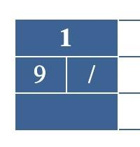

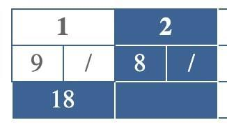

---

<!-- Page 228 of 493 -->

08-ExperimentellcodiereninderKomplexität 219
Frame3:AllePinswerdenmitdemerstenWurfabgeräumt,einStrike.
Die Pins werden dem vorherigen Spare-Frame zugerechnet; dessen
Punktzahl ist nun 10+10=20 und die bisherige Gesamtpunktzahl ist
die Summe der ersten beiden Frames: 38. Der 3. Frame “wartet” nun
als Strike auf zwei weitere Würfe.
Frame 4: Wieder ein Spare. Die Pins beider Würfe werden dem
vorherigen Strike-Frame zugerechnet: 10+9+1=20.
Frame 10: Auch wenn Frames eigentlich nur max. 2 Würfe enthalten
dürfen, können es beim letzten 3 sein, um für einen Strike oder
Spare noch die nötigen weiteren Pins zu liefern. Zu beachten ist bei
diesem Frame, dass seine ersten beiden Würfe “zurückwirken” auf
zweiStrike-Framesvorher,derenendgültigePunktzahlennochoffen
waren.
Als Akzeptanztest kann dieses Spiel dienen:
Ein komplettes Spiel mit 10 Durchgängen, 4 Spares und 4 Strikes und 2 Open
Frames.
https://www.bowling-wissen.de/regeln/grundsaetzliches/
https://www.bowling-wissen.de/regeln/punktezaehlung/frame-1-5/

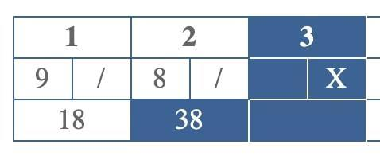

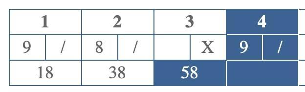

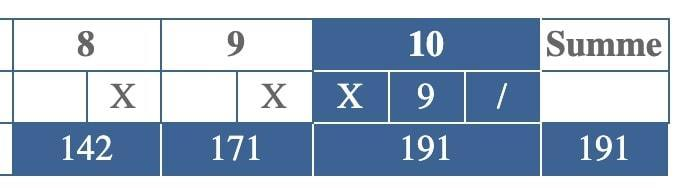

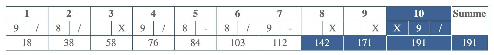

---

<!-- Page 229 of 493 -->

08-ExperimentellcodiereninderKomplexität 220
Analyse
Konfrontiert mit solchen Anforderungen ist es normal, wenn du dich
erstmal am Kopf kratzt und nur ein großes Fragezeichen auf deinem
Gesicht steht. Umso wichtiger ist es, dass du die Anforderungen nochmal
und nochmal genau liest und “auseinander nimmst”. Ziehe heraus, was
dir auffällt. Beispielsweise:
• DieFunktionkannnurdieGesamtpunktzahlfürvollständigeSpiele
berechnen. Für unvollständigeSpiele wärenicht klar,welchenWert
sie zurückliefern sollte. Wenn die bisherigen Züge nur [9,1,8,2]
wären, sollte dann die Punktzahl 28 sein? Das würde den geworfe-
nen Pins entsprechen und den Spare im ersten Frame berücksich-
tigen - aber andererseits wäre der Spare im zweiten Frame nicht
angemessen behandelt. Ohne weitere zurückgegebene Information,
dass die Gesamtpunktzahl nur vorläufig ist, macht die Anwendung
der Funktion auf unvollständige Spiele also keinen Sinn.
• Die Punktzahl eines Spiels setzt sich zusammen aus der Summe der
Pins, die geworfen wurden, plus einer unbestimmten Anzahl von
Bonuspunkten, die ebenfalls auf geworfenen Pins basieren.
• Bonuspunkte werden Frames zugeordnet, wie in den obigen Abbil-
dungen zu sehen ist.
• Ein Frame ohne Bonuspunkte hat 2 Würfe, ein Frame mit Bonus-
punkten hat 3 Würfe, die relevant für die Framepunktzahl sind.
• Es ist keine Validation der Spieldaten nötig.
Inkrementelle Testfälle
Das Problem ist sicher nicht trivial - oder könntest du die Logik einfach
hinschreiben?

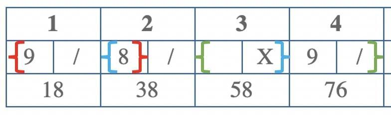

---

<!-- Page 230 of 493 -->

08-ExperimentellcodiereninderKomplexität 221
Aber ist es kompliziert? Siehst du eine Zerlegung in komplementäre Teil-
probleme?Teilproblemesindirgendwiezuerkennen,z.B.dieBestimmung
desBonus,dochgibtesdavonsoviele,dasssierestlosdasGesamtproblem
beschreiben? Es scheint, als bliebe immer eine gehörige Portion Dark
Logik irgendwo hängen.
Das Problem ist “algorithmisch” und lässt sich deshalb schwer in neben-
einanderstehendeTeilproblemezerlegen.ZwarsindVerantwortlichkeiten
zu sehen, die am Ende hoffentlich mit eigenen Funktionen repräsentiert
werden, doch die Schnittstellen dafür lassen sich up-front schwer bestim-
men. Finde zumindest ich.
Also ist es nützlich zu versuchen, das Problem mit inkrementellen Tests
anzugehen.Einfachwirddasvielleichtnicht;dennochhilftesbestimmtzu
überlegen, ob sich weitere Testfälle finden lassen, die einen schrittweisen
Aufbau von Logik zulassen.
Die Mengendimension der Zahl der Würfe gibt da nicht viel her. Es geht
immer um komplette Spiele, so dass nicht erste Tests mit nur einem oder
zwei Würfen beginnen können.
Aber als Variationsdimension bietet sich die der Bonuspunkte an. Ein
Spiel ohne Bonuspunkte kann mit einfacherer Logik behandelt werden als
eines mit Bonuspunkten. Zumindest drei Schritte drängen sich in dieser
Variationsdimension auf:
SpielohneBonuspunkte
SpielmitSpare
SpielmitStrike
Und schließlich noch eine weitere Variationsdimension: Welcher Frame

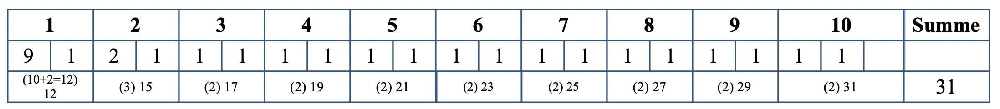

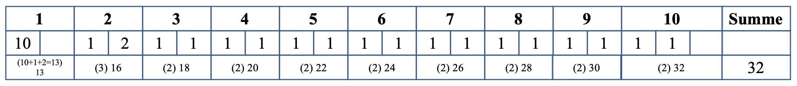

---

<!-- Page 231 of 493 -->

08-ExperimentellcodiereninderKomplexität 222
verdient einen Bonus: der letzte oder ein nicht-letzter? Bisher waren es
nicht-letzte Frames, also muss noch ein Test her für den Bonus im letzten.
Spielmiteinem“überlangen”10.Frame
Codierung
Die Codierung findet test-first wieder ausschließlich im Testcode statt. Es
gibt also immer mindestens ein Rot-Grün Paar für jeden Test.
Inkrement 1
Test rot:
1 [Fact]
2 public void Test1() {
3 var input = new[] {
4 1, 1, 1, 1, 1, 1, 1, 1, 1, 1,
5 1, 1, 1, 1, 1, 1, 1, 1, 1, 1
6 };
7
8 var result = 0;
9
10 result.Should().Be(20);
11 }
Test grün:
1 [Fact]
2 public void Test1() {
3 var input = new[] {
4 1, 1, 1, 1, 1, 1, 1, 1, 1, 1,
5 1, 1, 1, 1, 1, 1, 1, 1, 1, 1
6 };
7
8 var result = input.Sum();
9
10 result.Should().Be(20);
11 }
WieinderAnalyseerkannt,istdieBasisfürdieSpielpunktzahldieSumme
der Pins aller Würfe. Solange keine bonuswürdigen Frames vorliegen, ist
die Auswertung damit abgeschlossen.

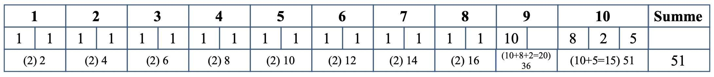

---

<!-- Page 232 of 493 -->

08-ExperimentellcodiereninderKomplexität 223
Inkrement 2
Der Test ist erstmal rot, weil ich nur die grüne Variante von Test1()
kopiert und die neuen Testdaten eingesetzt habe. Die Logik ist gleich
geblieben. So werde ich das auch im Folgenden bei jedem Inkrement
tun. Grünen Test kopieren, Testdaten anpassen, überprüfen, ob Test wie
erwartet rot ist, danndie Logik “aufmotzen”:
1 [Fact]
2 public void Test2() {
3 var input = new[] {
4 9, 1, 2, 1, 1, 1, 1, 1, 1, 1,
5 1, 1, 1, 1, 1, 1, 1, 1, 1, 1
6 };
7
8 var result = input.Sum();
9
10 result.Should().Be(31);
11 }
Test grün:
1 [Fact]
2 public void Test2() {
3 var input = new[] {
4 9, 1, 2, 1, 1, 1, 1, 1, 1, 1,
5 1, 1, 1, 1, 1, 1, 1, 1, 1, 1
6 };
7
8 var result = input.Sum();
9
10 if (input[0] + input[1] == 10)
11 result += input[2];
12
13 result.Should().Be(31);
14 }
Die Bestimmung des Bonus ist bewusst getrennt von der bisherigen
Summierung. Beides könnte zusammen in einer Schleife stattfinden, doch
dann müsste die vorherige Logik verändert werden. Eine separate Lösung
dieses Teilproblems ziehe ich vor; es geht um verschiedene Verantwort-
lichkeiten. Auch wäre in einer gemeinsamen Schleife die Behandlung nur
eines Spare nicht so trivial.
Der Zugriff auf die Würfe erfolgt mit festen Indizes, um den Code simpel
zu halten. Die Bindung an die Testdaten ist hier noch sehr hoch. Eine
Entkopplungsollbewussterstspätererfolgen,umnichtvorzeitigdieLogik
zu optimieren und womöglich in eine falsche Richtung zu laufen.
Wenn man es ganz eng sehen würde, könnte man fragen, ob das if
die simpelste Logik ist, um das Ergebnis zu erzielen. Hätte nicht die

---

<!-- Page 233 of 493 -->

08-ExperimentellcodiereninderKomplexität 224
Addition von input[2] zum result gereicht, wenn schon eine enge
Bindung an die Testdaten existiert? Wie schon bei anderen Beispielen
gesagt, wäre damit eine echte Problemlösung hinausgeschoben. Ein Spare
ist etwas anderes als die bisherigen Open Frames. Wenn also ein Spare
in den Beispieldaten vorkommt und zu erkennen ist, dann sollte auch die
Erkennung in die Logik eingang finden.
Inkrement 3
NachderErkennungeinesSpareimerstenFrameerscheintmirderSprung
zur generellen Erkennung von Spares plötzlich groß. Deshalb schiebe ich
spontan ein weiteres Inkrement ein, in dem ich zwei Spares behandle:
Zwei Spares am Anfang eines Spiels
1 [Fact]
2 public void Test3() {
3 var input = new[] {
4 9, 1, 4, 6, 5, 4, 1, 1, 1, 1,
5 1, 1, 1, 1, 1, 1, 1, 1, 1, 1
6 };
7
8 var result = input.Sum();
9
10 if (input[0] + input[1] == 10)
11 result += input[2];
12
13 result.Should().Be(52);
14 }
1 [Fact]
2 public void Test3() {
3 var input = new[] {
4 9, 1, 4, 6, 5, 4, 1, 1, 1, 1,
5 1, 1, 1, 1, 1, 1, 1, 1, 1, 1
6 };
7
8 var result = input.Sum();
9
10 if (input[0] + input[1] == 10)
11 result += input[2];
12 if (input[2] + input[3] == 10)
13 result += input[4];
14
15 result.Should().Be(52);
16 }
Jetzt kristallisiert sich langsam, ein Muster in der Logik heraus für die
Erkennung von Spares. Der zweite Test für Spares war hilfreich.

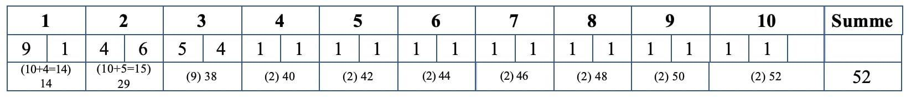

---

<!-- Page 234 of 493 -->

08-ExperimentellcodiereninderKomplexität 225
Inkrement 4
Um das Muster deutlich herauszuarbeiten noch ein dritter Test für Spares:
Zwei Spares, aber getrennt durch einen Open Frame:
1 [Fact]
2 public void Test4() {
3 var input = new[] {
4 9, 1, 5, 4, 6, 4, 1, 1, 1, 1,
5 1, 1, 1, 1, 1, 1, 1, 1, 1, 1
6 };
7
8 var result = input.Sum();
9
10 if (input[0] + input[1] == 10)
11 result += input[2];
12 if (input[2] + input[3] == 10)
13 result += input[4];
14
15 result.Should().Be(49);
16 }
1 [Fact]
2 public void Test4() {
3 var input = new[] {
4 9, 1, 5, 4, 6, 4, 1, 1, 1, 1,
5 1, 1, 1, 1, 1, 1, 1, 1, 1, 1
6 };
7
8 var result = input.Sum();
9
10 if (input[0] + input[1] == 10)
11 result += input[2];
12 if (input[2] + input[3] == 10)
13 result += input[4];
14 if (input[4] + input[5] == 10)
15 result += input[6];
16
17 result.Should().Be(49);
18 }
Jetzt ist das Muster überdeutlich und die Fallunterscheidung hat beim
zweitenFrame,demOpenFrame,guteDienstegeleistet.Dorthatsienicht
angeschlagen, kein Bonus wurde addiert.
Angesichts des klaren Musters bietet sich eine Refaktorisierung an. Ich
ersetze Duplikate durch eine Schleife:

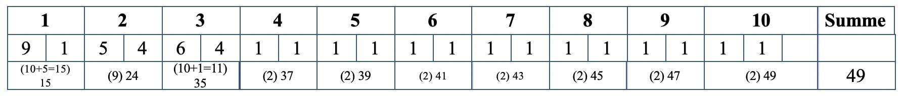

---

<!-- Page 235 of 493 -->

08-ExperimentellcodiereninderKomplexität 226
1 [Fact]
2 public void Test4() {
3 var input = new[] {
4 9, 1, 5, 4, 6, 4, 1, 1, 1, 1,
5 1, 1, 1, 1, 1, 1, 1, 1, 1, 1
6 };
7
8 var result = input.Sum();
9
10 for(var i=0; i<input.Length-2; i+=2)
11 if (input[i] + input[i+1] == 10)
12 result += input[i+2];
13
14 result.Should().Be(49);
15 }
Inkrement 5
Jetzt endlich weiter nach Inkrement-Plan. Strikes sind zu erkennen:
1 [Fact]
2 public void Test5() {
3 var input = new[] {
4 10, 1, 2, 1, 1, 1, 1, 1, 1,
5 1, 1, 1, 1, 1, 1, 1, 1, 1, 1
6 };
7
8 var result = input.Sum();
9
10 for(var i=0; i<input.Length-2; i+=2)
11 if (input[i] + input[i+1] == 10)
12 result += input[i+2];
13
14 result.Should().Be(32);
15 }
An dieser Stelle wird klar, dass eine for-Schleife für eine gemischte
Erkennung von Spares und Strikes nicht taugt. Bei Strikes enthält der
Frame nur 1 Wurf, sonst 2. Das fixe Inkrement i+=2 muss aufgeweicht
werden. Das geschieht am besten mit einer while-Schleife.
Die Refaktorisierung sollte jedoch über dem Sicherheitsnetz eines Tests
durchgeführt werden. Test5() kann das nicht sein, weil der nicht mit
der bestehenden Logik befriedigt wird. Die Refaktorisierung nehme ich
deshalb in Test4() vor…

---

<!-- Page 236 of 493 -->

08-ExperimentellcodiereninderKomplexität 227
1 [Fact]
2 public void Test4() {
3 var input = new[] {
4 9, 1, 5, 4, 6, 4, 1, 1, 1, 1,
5 1, 1, 1, 1, 1, 1, 1, 1, 1, 1
6 };
7
8 var result = input.Sum();
9
10 var i = 0;
11 while (i < input.Length - 2) {
12 if (input[i] + input[i + 1] == 10)
13 result += input[i + 2];
14 i += 2;
15 }
16
17 result.Should().Be(49);
18 }
…und kopiere die neue Logik nach Test5():
1 [Fact]
2 public void Test5() {
3 var input = new[] {
4 10, 1, 2, 1, 1, 1, 1, 1, 1,
5 1, 1, 1, 1, 1, 1, 1, 1, 1, 1
6 };
7
8 var result = input.Sum();
9
10 var i = 0;
11 while (i < input.Length - 2) {
12 if (input[i] + input[i + 1] == 10)
13 result += input[i + 2];
14 i += 2;
15 }
16
17 result.Should().Be(32);
18 }
Der Test ist immer noch rot. Mit der neuen Schleife ist nun jedoch die
Grundlage für eine Erweiterung der Logik gelegt. Um die Spares auch
weiterhin zu erkennen, muss die Strike-Erkennung allerdings leider schon
innerhalbderSchleifestattfinden.EinfacherefixeIndizessinddamitnicht
möglich. Mit der Erfahrung der Entwicklung der Spare-Erkennungslogik
sollten die Strikes allerdings ein einfaches Problem auch in der Schleife
sein.

---

<!-- Page 237 of 493 -->

08-ExperimentellcodiereninderKomplexität 228
1 [Fact]
2 public void Test5() {
3 var input = new[] {
4 10, 1, 2, 1, 1, 1, 1, 1, 1,
5 1, 1, 1, 1, 1, 1, 1, 1, 1, 1
6 };
7
8 var result = input.Sum();
9
10 var i = 0;
11 while (i < input.Length - 2) {
12 if (input[i] == 10) {
13 result += input[i + 1] + input[i + 2];
14 i += 1;
15 }
16 else {
17 if (input[i] + input[i + 1] == 10)
18 result += input[i + 2];
19 i += 2;
20 }
21 }
22
23 result.Should().Be(32);
24 }
Auch hier habe ich das Problem möglichst getrennt von der bisherigen
Logik gelöst. Zwar musste der zusätzliche Code in die Schleife eingefügt
werden; darin steht er jedoch neben dem bisherigen: entweder liegt ein
Strike vor oder ein Spare oder ein Open Frame.
Refaktorisierung I
Die Bonuserkennung scheint damit zunächst vollständig. Im Code ist zu
sehen, dass die Gesamtpunktzahlkalkulation zwei Aspekte hat; sie sind
durcheineLeerzeilegetrennt.DasAbstraktionsniveauderRepräsentation
beider Aspekte ist allerdings sehr verschieden, so dass eine Extraktion des
zweitenAspektsangezeigtist,bevordienächstenInkrementeangegangen
werden.
1 [Fact]
2 public void Test5() {
3 var input = new[] {
4 10, 1, 2, 1, 1, 1, 1, 1, 1,
5 1, 1, 1, 1, 1, 1, 1, 1, 1, 1
6 };
7
8 var result = input.Sum();
9 result += BoniErmitteln(input);
10
11 result.Should().Be(32);
12 }
13
14 private static int BoniErmitteln(int[] input) {
15 int result = 0;
16
17 var i = 0;
18 while (i < input.Length - 2) {
19 if (input[i] == 10) {
20 result += input[i + 1] + input[i + 2];
21 i += 1;

---

<!-- Page 238 of 493 -->

08-ExperimentellcodiereninderKomplexität 229
22 }
23 else {
24 if (input[i] + input[i + 1] == 10)
25 result += input[i + 2];
26 i += 2;
27 }
28 }
29
30 return result;
31 }
Jetzt besteht die Lösung aus der Integration zweier Funktionen: Sum()
und BoniErmitteln(). Das ist sehr überschaubar. Dem SLA ist gedient,
dem IOSP ist gedient.
Um die Leistungsfähigkeit der extrahierten Funktion zu überprüfen, kann
sie nun in vorherigen Tests nachgerüstet werden. Auch weniger schwieri-
ge Situationen sollten erfolgreich gemeistert werden.
Da bei TDDaiymi jeder Test seine eigene Logik hat, ist nicht automatisch
sichergestellt, dass frühere Tests ebenfalls mit Logik späterer Tests befrie-
digt werden. Ein gelegentlicher expliziter Check ist angezeigt. Nur ein
alter Test als Beispiel:
1 [Fact]
2 public void Test4() {
3 var input = new[] {
4 9, 1, 5, 4, 6, 4, 1, 1, 1, 1,
5 1, 1, 1, 1, 1, 1, 1, 1, 1, 1
6 };
7
8 var result = input.Sum() + BoniErmitteln(input);
9
10 result.Should().Be(49);
11 }
Inkrement 6
Die Bonusermittlung funktioniert grundsätzlich. Aber es gibt eine Sonder-
situation: der letzte Frame. Bei ihm liegen eventuelle Bonuswürfe nicht
außerhalb und danach darf die Punktzahlberechnung nicht weitergehen.

---

<!-- Page 239 of 493 -->

08-ExperimentellcodiereninderKomplexität 230
1 [Fact]
2 public void Test6() {
3 var input = new[] {
4 1, 1, 1, 1, 1, 1, 1, 1, 1, 1,
5 1, 1, 1, 1, 1, 1, 10, 8,2,5
6 };
7
8 var result = input.Sum();
9 result += BoniErmitteln(input);
10
11 result.Should().Be(51);
12 }
Wiesichherausstellt,decktdiebisherigeLogikdiesenFalltatsächlichnoch
nicht ab. Sie schießt über das Ziel hinaus.
Wo soll nun die Logik angepasst werden? Das kann in der Methode
BoniErmitteln() geschehen. Die “ist nicht weit weg” von der Test-
methode. Aus didaktischen Gründen soll hier jedoch konsequent mit der
Entwicklung von Logik in der Testmethode weitergemacht werden. In der
Testmethode fühlst du dich einfach freier, Veränderungen vorzunehmen,
ohne andere Tests in Mitleidenschaft zu ziehen. Deshalb wird der Metho-
denaufruf im neuen Test zuerst durch die Logik ersetzt:
1 [Fact]
2 public void Test6() {
3 var input = new[] {
4 1, 1, 1, 1, 1, 1, 1, 1, 1, 1,
5 1, 1, 1, 1, 1, 1, 10, 8,2,5
6 };
7
8 var result = input.Sum();
9
10 var i = 0;
11 while (i < input.Length - 2) {
12 if (input[i] == 10) {
13 result += input[i + 1] + input[i + 2];
14 i += 1;
15 }
16 else {
17 if (input[i] + input[i + 1] == 10)
18 result += input[i + 2];
19 i += 2;
20 }
21 }
22
23 result.Should().Be(51);
24 }
Und dann erfolgt die Ergänzung einer Frameerkennung. Frames müssen
gezählt werden:

---

<!-- Page 240 of 493 -->

08-ExperimentellcodiereninderKomplexität 231
1 [Fact]
2 public void Test6() {
3 var input = new[] {
4 1, 1, 1, 1, 1, 1, 1, 1, 1, 1,
5 1, 1, 1, 1, 1, 1, 10, 8,2,5
6 };
7
8 var result = input.Sum();
9
10 var i = 0;
11 var frameNumber = 1;
12 while (i < input.Length - 2 && frameNumber < 10) {
13 if (input[i] == 10) {
14 result += input[i + 1] + input[i + 2];
15 i += 1;
16 }
17 else {
18 if (input[i] + input[i + 1] == 10)
19 result += input[i + 2];
20 i += 2;
21 }
22 frameNumber++;
23 }
24
25 result.Should().Be(51);
26 }
Die angepasste Logik wird anschließend natürlich wieder in die BoniEr-
mitteln() Methode verschoben, um sich dann auch gegenüber allen
vorherigen Tests zu beweisen.
Akzeptanztest
JetztscheintdieZeitreiffürdenAkzeptanztest.StrikesundSpareswerden
erkannt, der 10. Frame wird korrekt behandelt - aber bisher waren die
Spielszenarien speziell für das inkrementelle Testen hergestellt. Der Ak-
zeptanztest ist “wilder”. Er nimmt keine Rücksicht auf die experimentelle
Entwicklung der Logik.
1 [Fact]
2 public void Akzeptanztest() {
3 var input = new[] {
4 9,1, 8,2, 10, 9,1, 8,0,
5 8,2, 9,0, 10, 10, 10,9,1
6 };
7
8 var result = input.Sum() + BoniErmitteln(input);
9
10 result.Should().Be(191);
11 }
Doch die Logik hält auch dieser Prüfung stand! Das Ausgangsproblem ist
grundsätzlich gelöst.
Jetzt muss ich nur noch etwas aufräumen…

---

<!-- Page 241 of 493 -->

08-ExperimentellcodiereninderKomplexität 232
Refaktorisierung II
Was gibt es an dieser Methode aufzuräumen? Oberflächlich betrachtet
ist sie ordentlich. Eine klare Operation im Sinne des IOSP, fokussierte
Verantwortlichkeit, noch recht übersichtlich mit <20 Zeilen.
1 private static int BoniErmitteln(int[] input) {
2 int result = 0;
3
4 var i = 0;
5 var frameNumber = 1;
6 while (i < input.Length - 2 && frameNumber < 10) {
7 if (input[i] == 10) {
8 result += input[i + 1] + input[i + 2];
9 i += 1;
10 }
11 else {
12 if (input[i] + input[i + 1] == 10)
13 result += input[i + 2];
14 i += 2;
15 }
16 frameNumber++;
17 }
18
19 return result;
20 }
Und dennoch… es liegt etwas in der Luft. Mit etwas Erfahrung kann man
sehen, dass dies eine Gelegenheit für eine rekursive Lösung ist. Die Logik
“frisst sich” von vorne nach hinten durch die Würfe durch. Sie betrachtet
den ersten Frame, bestimmt ggf. einen Bonus, aktualisiert das Resultat -
und macht dasselbe mit den verbleibenden Frames usw.
Dieses Vorgehen kann deutlicher mit einer Rekursion abgebildet werden:
1 private static int BoniErmitteln(int[] input)
2 => BonusErmitteln(0, input, 0, 1);
3
4 private static int BonusErmitteln(int result, int[] input, int i, int frameNumber) {
5 if (frameNumber == 10) return result;
6
7 if (input[i] == 10) {
8 result += input[i + 1] + input[i + 2];
9 i += 1;
10 }
11 else {
12 if (input[i] + input[i + 1] == 10)
13 result += input[i + 2];
14 i += 2;
15 }
16
17 return BonusErmitteln(result, input, i, frameNumber + 1);
18 }
Jetzt ist BonusErmitteln() auf den jeweils ersten Frame der restlichen
Liste der Würfe konzentriert.

---

<!-- Page 242 of 493 -->

08-ExperimentellcodiereninderKomplexität 233
Was bleibt ist darin die Logik selbst zur Erkennung von Strike und Spare.
Die ist bisher nicht für sich genommen testbar. BonusErmitteln()
hat noch zwei Verantwortlichkeiten: die Ermittlung des Bonus für den
aktuellen Frame und das Voranschreiten durch die Würfe.
Deshalb lohnt sich die Extraktion der Bonuserkennungslogik in eigene
Funktionen (inkl. einiger Bezeichneroptimierungen):
1 private static int BoniErmitteln(int[] würfe)
2 => BoniErmitteln(0, würfe, 0, 1);
3
4 private static int BoniErmitteln(int gesamtpunktzahl, int[] würfe, int i, int frameNr) {
5 if (frameNr == 10) return gesamtpunktzahl;
6 var bonus = StrikeBonus(würfe, i,
7 onNoStrike: SpareBonus);
8 return BoniErmitteln(gesamtpunktzahl+bonus.Punkte, würfe,
9 bonus.i, frameNr + 1);
10 }
11
12 static (int Punkte, int i) StrikeBonus(int[] würfe, int i,
13 Func<int[],int,(int,int)> onNoStrike) {
14 if (würfe[i] == 10)
15 return (würfe[i + 1] + würfe[i + 2],
16 i + 1);
17 return onNoStrike(würfe, i);
18 }
19
20 static (int Punkte, int i) SpareBonus(int[] würfe, int i) {
21 if (würfe[i] + würfe[i + 1] == 10)
22 return (würfe[i + 2],
23 i + 2);
24 return (0, i + 2);
25 }
BonusErmitteln() ist zu einer Integration geworden, die nur margina-
le Dark Logik enthält.
Die Erkennung eines Strike bzw. eines Spare findet getrennt und einzeln
testbar in eigenen Funktionen statt.
Dass es dafür keine spezifischen Testsonden gibt, weil nach dem “pear
programming” Verfahren die Logik letztlich durch BoniErmitteln()
hindurch entwickelt wurde, tut nichts zur Sache. Sollte sich zukünftig
an den Regeln etwas ändern oder doch eine unberücksichtigte Situation
auftauchen, dann kann bei Bedarf eine Testsonde direkt angelegt werden.
Die zu Anfang erahnten Verantwortlichkeiten, für die aber keine komple-
mentären Teilprobleme mit konkreter Signatur zu erkennen waren, sind
damit herausgearbeitet. Das ist eine Validation des Ansatzes. Tatsächlich
hätten diese Signaturen wohl kaum a priori definiert werden können.
Die Annahme, dass kein kompliziertes Problem vorlag, war gerechtfertigt.

---

<!-- Page 243 of 493 -->

08-ExperimentellcodiereninderKomplexität 234
UnddieAnnahmeeineskomplexenProblems,dasdenEinsatzvonTDDai-
ymi rechtfertigt, statt “nur” nach cTDD im Produktionscode vorzugehen,
scheint auch gerechtfertigt. Der Fokus auf die Logik war im Testcode
hilfreich größer.
Und zur Abrundung am Ende noch die Extraktion der eigentlich zu entwi-
ckelnden Methode PunktzahlBerechnen(). Angesichts der Vorarbeit
ist das eine Trivialität.
1 [Fact]
2 public void Akzeptanztest() {
3 var input = new[] {
4 9,1, 8,2, 10, 9,1, 8,0,
5 8,2, 9,0, 10, 10, 10,9,1
6 };
7
8 var result = PunktzahlBerechnen(input);
9
10 result.Should().Be(191);
11 }
12
13 private static int PunktzahlBerechnen(int[] input) {
14 return input.Sum() + BoniErmitteln(input);
15 }
Nun kann diese Funktion mit ihren “Anhängseln” in den Produktionscode
verschoben werden. Im Akzeptanztest ist die Referenz dorthin umzulen-
ken. Ob die anderen Tests bestehen bleiben sollen oder als Gerüsttests
gelöscht werden sollen, ist dann auch nochmal eine Frage.
Überraschungstest
Wenn du Anforderungen gem. Akzeptanztest erfüllst, ist dein Job eigent-
lich getan. Aber aus Spaß kannst du “noch ein Schüppchen drauflegen”.
Oder der Auftraggeber tut das, um deine Lösung zu challengen. Denn es
können sich Annahmen z.B. in Form von Konstanten oder Behandlung
von Grenzen in deinen Code eingeschlichen haben, die an der Realität
vorbeigehen.
Als Beispiel hier noch ein Testfall für die Kata aus der Literatur:⁸⁶
⁸⁶EinBowling-SpielnachRobertC.Martin,daseralsBeispielinseinerLösungverwen-
det.

---

<!-- Page 244 of 493 -->

08-ExperimentellcodiereninderKomplexität 235
1 [Fact]
2 public void Ueberraschungstest() {
3 var input = new[] {
4 1,4, 4,5, 6,4, 5,5, 10,
5 0,1, 7,3, 6,4, 10, 2,8,6
6 };
7
8 var result = Bowlingspiel.PunktzahlBerechnen(input);
9
10 result.Should().Be(133);
11 }
Wie erhofft, meistert der Produktionscode aber auch dieses Testszenario.
Reflexion
Im Rückspiegel mag die Entwicklung der Logik gar nicht so schwierig
gewesen sein. Es geht um ca. 30 Zeilen. Doch das ist nicht entscheidend
für die Einschätzung des Schwierigkeitsgrades und die Wahl der Methode.
Wie schwierig sah das Problem am Anfang aus?
Sei lieber etwas vorsichtiger bei deiner Einschätzung! Versuche zuerst
ein schwieriges Problem als kompliziert anzusehen und zu zerlegen. Und
wenn du dann bei Operationen in dem Zerlegungsbaum nicht sofort ein
gutes Gefühl hast, dann nimm sie lieber als komplex denn als einfach an.
Mit der Erfahrung wird sich deine Einschätzung verändern. Du wirst
häufiger einfachen Problemen gegenüberstehen in den Blättern eines
Zerlegungsbaumes. Doch gerade wenn du mit der test-first Codierung
beginnst, irre lieber einmal mehr auf der Seite der Komplexität.
Mit TDDaiymi verlierst du im Grunde nichts gegenüber dem inkremen-
tellen Vorgehen mit cTDD bei einfachen Problemen - aber du gewinnst
viel:
• Fokus
• Feingranularere Strukturen, d.h. höhere Testbarkeit
Zusammenfassung
Wenn du bereits in der Codierungsphase angekommen bist, dann gibt es
eigentlich keine wirklich großen komplexen Probleme mehr. Die muss ein

---

<!-- Page 245 of 493 -->

08-ExperimentellcodiereninderKomplexität 236
Entwurf aus dem Weg geräumt haben. Und dennoch unterscheiden sich
die Problemschwierigkeitsgrade.
Jede Funktion, die der Entwurf dir zur Codierung vorlegt, solltest du
beurteilen, um den passenden test-first Ansatz zu wählen.
1. Überlege, ob sich das Problem in komplementäre Teilprobleme
zerlegen lässt. Du verringerst damit den Scope, um den du dich
jeweils kümmern musst, wenn du korrekt Logik schreiben willst.
Komplizierte Probleme sind solche, bei denen du einen “Prozess”
erkennen kannst; die Transformation von Input in Output findet in
erkennbaren Schritten sequenziell (oder auch parallel) statt.
2. Für jede Operation (oder auch Hybride), die dann in einem Zer-
legungsbaum vorkommen, schätze ein, ob das verbliebene, nicht
weiter zerlegbare Problem trivial, einfach oder doch komplex ist.
Komplexe Probleme sind hier “algorithmische”. Sie sind gekenn-
zeichnetdurchzunächstundurchsichtigeFallunterscheidungenund
vor allem Schleifen. Immer wieder machen es Wiederholungen
schwer, in “Prozessen” zu denken, also komplementär zu zerlegen.
Mit TDDaiymi hast du eine Methode an der Hand, die dich furchtlos
machen soll gegenüber jedem verbliebenen Problem. Wenn du dich der
Logik im Testcode annäherst, arbeitest du quasi in einer Sandkiste. Was
soll schon schiefgehen? Du kannst alles ausprobieren und auf dem Weg
zur Lösung so viele Spähne produzieren, wie du willst, während du an der
Lösung hobelst. Auf der Werkbank deines Tests liegt die Logik von allen
Seiten gut zu sehen vor dir.
Und wenn du dann auch noch Logik von Test zu Test kopierst als
“Samenkorn” für weitere Logik, dann streust du dir sozusagen selbst
Brotkrumen auf deinem Pfad zur Lösung. Die Diffs von Repo-Commits
könnten das auch liefern, doch die liegen nicht so vor dir, wie von Test zu
Test wachsende Logik.
TDDaiymi ist eine mächtige Praktik, die in der Literatur unterrepräsen-
tiert ist. Sie ist nicht nur eine Fingerübung für ein geselliges Coding Dojo
in der Community, sondern ein vertiabler Pfeil für deinen Köcher, mit
dem du Projektprobleme erlegen kannst.
Die Softwareentwicklung kann von anderen Disziplinen lernen. Mit TD-
Daiymi lernt sie, dass die Entnahme von Teilen einer Lösung aus ihrem

---

<!-- Page 246 of 493 -->

08-ExperimentellcodiereninderKomplexität 237
Kontext zur Bearbeitung auf einer Werkbank die Zahl der Freiheitsgrade
erhöht. Und das ist gerade dann wichtig, wenn du dich einer Lösung im
trial-and-error Vorgehen nähern musst.

---

<!-- Page 247 of 493 -->

08-ExperimentellcodiereninderKomplexität 238
Übungsaufgaben
Reflexionsaufgabe
Bitte formuliere eine Frage oder eine Erkenntnis zum Kapiteltext.
• Wo bist du gedanklich hängengeblieben, was ist dir unklar,
was passt für dich irgendwie nicht zusammen, wozu würdest
du dir noch etwas mehr Erklärung wünschen? Steht irgendet-
waszudeinerbisherigenPraxisimWiderspruchunddufragst
dich, warum du etwas ändern solltest?
• Oder: Wann hast du einen Aha-Moment gehabt, was ist
diralsbemerkenswert,spannend,ausprobierenswertaufgefal-
len? Hat irgendetwas “in dir Klick gemacht”, weil dir nun ein
Zusammenhang aufgegangen ist? Oder verstehst du jetzt aus
deiner bisherigen Praxis irgendetwas besser?
Am besten formulierst du Frage bzw. Erkenntnis schriftlich. Indem
du deine Gedanken aufschreibst, wirst du dir ihrer bewusster. Bei
einer Frage kommst du dadurch vielleicht schon einer Antwort aus
dir selbst heraus näher. Bei einer Erkenntnis fällt dir vielleicht schon
etwas ein, das du ab jetzt anders machen kannst.
Anforderungen
ImplementiereeineFunktionzurUmformatierungeinesTextes.Funk-
tionssignatur:
1 string Umbrechen(string text, int maxZeilenlänge)
Ein potenziell mehrzeiliger Text soll an Wortgrenzen so umgebro-
chen werden, dass eine maximale Zeilenlänge nicht überschritten
wird.

---

<!-- Page 248 of 493 -->

08-ExperimentellcodiereninderKomplexität 239
Hier ein Beispiel für einen Text ein Auszug aus Loriots Gedicht
Advent:
1 Es blaut die Nacht,
2 die Sternlein blinken,
3 Schneeflöcklein leis hernieder sinken.
Mit einer max. Zeilenlänge von 9 würde die Funktion diesen Text
produzieren:
1 Es blaut
2 die
3 Nacht,
4 die
5 Sternlein
6 blinken,
7 Schneeflö
8 cklein
9 leis
10 hernieder
11 sinken.
Beachte, wie überlange Worte einfach abgeschnitten werden, z.B. ist
“Schneeflöcklein” länger als 9 Zeichen und wird auf zwei Zeilen mit
den Teilen “Schneeflö” und “cklein” umgebrochen.
Und mit einer max. Zeilenlänge von 14 wird dieser Text produziert:
1 Es blaut die
2 Nacht, die
3 Sternlein
4 blinken,
5 Schneeflöcklei
6 n leis
7 hernieder
8 sinken.
TODO 1
Betrachte das Problem als kompliziert. Finde als erstes eine Zerle-
gunginkomplementäreTeilprobleme.BeschreibediesenZerlegungs-
baum mit Funktionssignaturen in einer Textdatei.
TODO 2
Du bist bei der Zerlegung in TODO 1 frei bis auf eine Funktion.
DieFunktionstring[] LangeWorteZerschneiden(string[]
worte, int maxZeilenlänge) ist vorgegeben. Sie muss in dei-
nem Zerlegungsbaum einen Platz haben; passe ihn ggf. an.
IhreAufgabeistes,alleWortedaraufhinzuüberprüfen,obsielänger
als die geforderte Zeilenlänge sind - und falls ja, sie in Teile zu
zerschneiden, die in eine neue Zeile passen.

---

<!-- Page 249 of 493 -->

08-ExperimentellcodiereninderKomplexität 240
Beispiel:
• Zeilenlänge 4
• Worte: ["123", "1234", "12345", "123456789"]
• ErwartetesResultat:["123", "1234", "1234", "5", "1234",
"5678", "9"]
Betrachte dieses Teilproblem als komplex und implementiere die
Funktion mit TDDaiymi. Erhalte deine Testhistorie für diese Funk-
tion.
Achte darauf, dass du wirklich die Logik nur im Testcode schreibst.
ÜbertragesieerstamEndeindenProduktionscode.Dassollindeiner
Repo Commit-Historie nachvollziehbar sein.
TODO 3
Implementiere den Rest der Lösung wie du magst test-first. Die
anderenOperationenkönnenfürdichtrivial,einfach-oderaberauch
komplex sein. Identifiziere mindestens ein weiteres Problem, das du
als komplex ansiehst und mit TDDaiymi löst.
https://www.deingedicht.de/weihnachten/adventsgedichte/advent.
html

---

<!-- Page 250 of 493 -->

09 - Test-first
refaktorisieren
BisherhastduimRahmenderÜbungsaufgabenProbleme“aufdergrünen
Wiese” gelöst und codiert. Dabei bist du unterschiedlich vorgegangen je
nach Schwierigkeitsgrad des Problems. Aber was, wenn die Wiese nicht
mehrgrünist?Was,wennschonCodevorhandenist,mitdemduarbeiten
musst?
Wenn der vorhandene Code so aussieht, wie du ihn nach einer test-first
Implementation wie bisher beschrieben hinterlassen würdest, wäre ja
alles gut. Aber so ist es oft, gar meistens nicht, immer noch nicht. Test-
first Codierung ist noch nicht als fachgerechte Programmierung breit
akzeptiert und eingeführt. Ganz zu schweigen von dem ganzen Code, der
schon vor der Erkenntnis geschrieben worden war, dass test-first eine
Grundlage für dauerhaft hohe Produktivität ist.
Häufig ist Code, mit dem du arbeiten musst, so genannter Legacy Code.
Das ist nach Michael Feathers⁸⁷ Code, für den keine automatisierten Tests
existieren. Das passt zu einer anderen Definition von Legacy Code⁸⁸, die
damit allgemeiner Code meint, bei dem Änderungen ein hohes Risiko
für Regressionen bergen. Ohne automatisierte Tests ist das offensichtlich.
Doch es kann auch andere Gründe geben, die das Risko nach oben treiben
können, selbst wenn es automatisierte Tests geben sollte, z.B. weil diese
Tests schlecht sind oder nicht häufig genug ausgeführt werden können,
um zügig Feedback zu geben, oder das Verständnis so gering ist, dass
Änderungen eigentlich nur etwas kaputt machen können.
Letzteres ist insbesondere bei Ancient Code der Fall. So will ich Code
nennen, dessen Autor(en) nicht mehr verfügbar sind und auch sonst
niemand mehr weiß, wie der Code gemeint war. Ancient Code ist also
nicht unbedingt sehr alt, aber er ist aus sich heraus unverständlich und
⁸⁷https://www.amazon.de/Working-Effectively-Legacy-Michael-Feathers/dp/
0131177052
⁸⁸https://dzone.com/articles/defining-legacy-code

---

<!-- Page 251 of 493 -->

09-Test-firstrefaktorisieren 242
alle, die darüber etwas wissen könnten, sind schon “verstorben”. Bei
solchem Code geht es dir nicht anders als Forschern, die in den Tiefen
einer neu entdeckten Grabkammer in einem fernen sandigen Land auf
Schriftzeichen stoßen, die sie noch nie gesehen haben.⁸⁹
Als Beispiel für Legacy Code wie auch Ancient Code mag folgender Code
dienen:⁹⁰
1 using System;
2 using System.Collections.Generic;
3 using System.Linq;
4 using System.Text.RegularExpressions;
5
6 namespace ancientcode
7 {
8 class TextManagerHelper {
9 public IEnumerable<TextPart> convert(string text) {
10 var contents = "";
11 var type = TextPartType.WORD;
12 for (var i = 0; i < text.Length; i++) {
13 if (char.IsLetter(text[i])) {
14 if (type == TextPartType.WORD) {
15 contents += text[i];
16 }
17 else {
18 if (contents != "") yield return new TextPart(contents, type);
19 contents = text[i].ToString();
20 type = TextPartType.WORD;
21 }
22 }
23 else {
24 if (type == TextPartType.NONWORD) {
25 contents += text[i];
26 }
27 else {
28 if (contents != "") yield return new TextPart(contents, type);
29 contents = text[i].ToString();
⁸⁹Bildquelle:pixabay
⁹⁰DukannstC#-QuelltextundJava-Quelltextherunterladen.

---

<!-- Page 252 of 493 -->

09-Test-firstrefaktorisieren 243
30 type = TextPartType.NONWORD;
31 }
32 }
33 }
34 yield return new TextPart(contents, type);
35 }
36 }
37
38 enum TextPartType { WORD, NONWORD }
39
40 class TextPart {
41 public TextPart(string content, TextPartType type) {
42 Contents = content;
43 Type = type;
44 }
45
46 public string Contents { get; }
47 public TextPartType Type { get; }
48 }
49
50 public class TextManager {
51
52 private TextManagerHelper hlp = new TextManagerHelper();
53 private Random rnd = new Random();
54
55 public String convert(String text) {
56 string result = "";
57 var pts = hlp.convert(text).ToList();
58
59 for (int i = 0; i < pts.Count; i++) {
60 if (pts[i].Type == TextPartType.WORD
61 && rnd.NextDouble() < 0.2) {
62 if (i + 2 < pts.Count) {
63 var t = pts[i];
64 pts[i] = pts[i + 2];
65 pts[i+2] = t;
66 }
67 }
68 }
69
70 for (int i1 = 0; i1 < pts.Count; i1++) {
71 if (rnd.NextDouble() < 0.2) {
72 pts.Insert(i1, new TextPart(" ", TextPartType.NONWORD));
73 i1++;
74 String[] wds = { "and", "so", "however", "maybe" };
75 int ind = rnd.Next(wds.Length);
76 pts.Insert(i1, new TextPart(wds[ind], TextPartType.WORD));
77 i1++;
78 pts.Insert(i1, new TextPart(" ", TextPartType.NONWORD));
79 }
80 }
81
82 String result2 = "";
83
84 foreach (var prt in pts) {
85 result2 += prt.Contents;
86 }
87
88 result = result2;
89 result = Regex.Replace(result, "[\\\\?!-\\\\.,:;'\\\\(\\\\)]", "");
90
91 var result1 = "";
92
93 for (int i2 = 0; i2 < result.Split(' ').Length - 1; i2++) {
94 if (rnd.NextDouble() < 0.5) {
95 char[] chrs = { '.', ',', '!' };
96 var j = rnd.Next(chrs.Length);
97 result1 += result.Split(' ')[i2] + chrs[j];
98 } else {
99 result1 += result.Split(' ')[i2] + " ";
100 }
101 }
102 result1 += result.Split(' ')[result.Split(' ').Length - 1];
103 result = result1;
104
105 String result3 = "";

---

<!-- Page 253 of 493 -->

09-Test-firstrefaktorisieren 244
106 char[] textArray = result.ToCharArray();
107
108 foreach (var ch in textArray) {
109 if (rnd.NextDouble() < 0.3) {
110 char nch;
111 if (char.IsLower(ch)) {
112 nch = char.ToUpper(ch);
113 } else {
114 nch = char.ToLower(ch);
115 }
116
117 result3 += nch;
118 } else {
119 result3 += ch;
120 }
121 }
122
123 result = result3.Replace(" ", "");
124
125 return result;
126 }
127 }
128 }
Der Code stammt aus einer Quelle im Web⁹¹ und diente dort ebenfalls
als Abschreckung. Er ist in seinem Zweck künstlich, deshalb aber auch
überschaubarundvondergrundsätzlichenAbsichtherschnellverstanden.
Kannst du erkennen, was sein Zweck ist? Wenn nein, woran liegt das? Es
sind doch nur knapp 130 Zeilen.
Frustrierende Lektüre
Es braucht keine Tausende Zeilen von Code, damit seine Lektüre frustrie-
rend ist. Diese wenigen Zeilen enthalten alles, was nötig ist. Aber auch
wenn du den Eindruck hast, dass es an ganz Vielem fehlt, damit du mit
dem Code etwas anfangen kannst, lässt sich das Viele wahrscheinlich
auf nur wenige grundlegende Defizite zurückführen - die allerdings in
unterschiedlichen Gestalten auftreten.
Fehlende Bedeutung
Das Erste, was dich bei Ansicht des Listings überkommen hat, ich wohl
die Frage, “Was soll das?” Wenn du auf die folgende Funktion schaust,
springt dir diese Frage hingegen nicht in den Kopf. Wie kommt das?
⁹¹https://www.infoq.com/articles/natural-course-refactoring/

---

<!-- Page 254 of 493 -->

09-Test-firstrefaktorisieren 245
1 int Sum(int[] numbers) {
2 var sum = 0;
3 foreach(var n in numbers)
4 sum += n;
5 return sum;
6 }
Mehrere Dinge sind hier anders:
• Du bist mit der Problemdomäne vertraut: Grundschulmathematik.
• Du bist mit dem Lösungsansatz für das Problem vertraut: Aggrega-
tion von Werten mit einer Schleife.
• Die Codebestandteile sind in Bezug auf die Problemdomäne sinn-
voll benannt: Sum(), numbers, selbst n macht noch Sinn.
All das fehlt beim ersten Codebeispiel. Und dann kommt noch dazu, dass
niemand da ist, den du fragen kannst. Damit handelt es sich wahrlich um
Ancient Code.
Solange dir die Bedeutung von Code insgesamt oder auch nur Teilen
nicht grundsätzlich klar ist, d.h. solange dir Sinn und Zweck dafür fehlen,
solange kannst du Code nicht verstehen.
Wenn du die Bedeutung kennst, also das Was bzw. Warum, hast du einen
Rahmen, ein Skelett, das du mit dem Wie ausfleischen kannst. “Achso, um
Addition geht es? Um die Addition einer Liste von ganzen Zahlen? Jetzt
sehe ich, wie der Code das schafft. Jetzt verstehe ich!”
Für den Ancient Code fehlt dir schon das. Frustration ist unausweichlich.
Zutaten für klare Bedeutungen
Damit du Code mit Bedeutung aufladen kannst, ist es hilfreich, wenn…
• eine Zweckbeschreibung vorliegt,
• Funktionsbeispiele existieren,
• Strukturelemente zwecknah benannt sind und
• du vertraut mit der Domäne bist.

---

<!-- Page 255 of 493 -->

09-Test-firstrefaktorisieren 246
Für den obigen Ancient Code fehlt all das. Deshalb kannst du nur
Verwirrung fühlen. Du befindest dich in Bezug auf den Code im Chaos.
Du siehst zwar Codezeilen, nur gibt es darin auf den ersten Blick keine
sinnvolle Struktur.Selbstderverticalwhitespace unddieGruppierungvon
Logik in Funktionen und Klassen bringt dich erstmal nicht weiter.
Wenn es jemanden gäbe, der dir sagen könnte, was der Code soll, was
sein Zweck ist, würde das sehr helfen. Aber der Code ist ancient, da
ist also niemand, der Auskunft gibt. Es existiert auch keine Form von
Dokumentation, keine Anforderungsbeschreibung.
AußerdemistderCodelegacy,dennesfehltauchjederautomatisierteTest
als Beispiel für die Funktionalität.
Die Namen der Strukturelemente - Klassen/Datentypen, Funktionen, Va-
riablen, Konstanten - sind ebenfalls nicht hilfreich, weil sie sehr generisch
sind. Irgendwie muss es wohl um Texte gehen, weil es TextManager
und TextPart gibt. Doch solche Namen sind nicht spezifisch. Ebenso
wenig Variablennamen wie result oder textArray. Ihre Bedeutung ist
technisch.
Fehlende Zusammenhänge
Bedeutung ergibt sich nicht nur aus Bezeichnungen für Strukturelemente,
sondern auch aus ihren Beziehungen. Wie hängen Module und Funktio-
nen und Daten zusammen? Welche Abhängigkeiten gibt es? In welcher
Reihenfolge geschieht was?
Zutaten für deutliche Zusammenhänge
Es gibt zumindest zwei Strukturen, die für dich interessant sind:
• die Tiefenstruktur und
• die Prozessstruktur.
Mit der Tiefenstruktur sind Abhängigkeitsbäume gemeint. Darin hängen
Elemten übereinander in Client-Service-Beziehungen: oben braucht un-
ten, egal, ob mit oder ohne funktionale Abhängigkeiten. Das kennst du
schon von der komplementären Zerlegung.

---

<!-- Page 256 of 493 -->

09-Test-firstrefaktorisieren 247
Eine Tiefenstruktur können Module und Funktionen bilden.
Elemente weiter oben im Baum stehen dabei (idealerweise) für größere
Zusammenhänge, sie sind inhaltlich gröber, allgemeiner, abstrakter; Ele-
mente weiter unten stehen für Details und Konkretes.
Je mehr eine Tiefenstruktur dem IOSP folgt, desto einfacher lässt sie
sich von oben nach unten verstehen, weil du dich Abstraktionsebene für
Abstraktionsebene nach unten vorarbeiten kannst. Auf jeder Abstrakti-
onsebene wird das Ganze repräsentiert - nur eben in unterschiedlicher
Konkretheit bzw. mit unterschiedlichem Detaillierungsgrad.
Mit der Prozessstruktur sind die zeitlichen Beziehungen insbesondere
zwischen Funktionen gemeint. Welche wird zuerst aufgerufen, welche
anschließend? Funktionen bzw. Abschnitte von Logik arbeiten einander
zu. Das siehst du sehr deutlich in einer Integration:
1 int FromRoman(string römischeZahl) {
2 var werte = Map("XIV");
3 werte = SubtraktionsregelAnwenden(werte);
4 return Summieren(werte);
5 }
Map() bereitet Daten auf und arbeitet den folgenden Funktionen damit
zu.
Das IOSP ist mithin auch hilfreich, um deutliche Prozessstrukturen aufzu-
bauen. Integrationen stellen Datenflüsse dar, also Datentransformations-
strecken. Welche Schritte vom Input zum Output durchlaufen werden, ist
darin deutlich sichtbar.
TiefenstrukturengibtesauchbeiDaten.Diesindjedochoftleichterzuver-
folgen, weil Beziehungen in Datentypdefinitionen herausstechen. Für das
Verständnis der Funktionsweise von Code sind sie eher zweitrangig. Code
zu verstehen heißt vor allem, die Erzeugung von Verhalten nachzuvollzie-
hen. Dafür brauchst du die Zusammenhänge zwischen bedeutungsvollen
Logik-Abschnitten.
Die Zusammenhänge springen im obigen Ancient Code nicht ins Auge.
Ganz davon zu schweigen, was die Bedeutung der Elemente ist, ist nicht
klar, wie sie zusammenhängen. Wo beginnt überhaupt die Verhaltenser-
zeugung, was wäre eine Wurzel für eine Tiefenstruktur? Stellt die erste
Klasse sie dar oder die umfangreichere?

---

<!-- Page 257 of 493 -->

09-Test-firstrefaktorisieren 248
Innerhalb der Methode convert() steht zwar Logik in einer längeren
Sequenz, doch ihre Abschnitte “sind ohne Bedeutung”. Damit nützt dir
die Sequenz noch nicht viel für den Aufbau einer Prozessstruktur.
Fehlende Testbarkeit
Wenn schon unklar ist, was die identifizierbaren Codelemente bedeuten
und wie sie zusammenhängen, dann wäre es gut, wenn das Ganze sich zu-
mindest leicht testen ließe. Das wäre die Grundlage für eine Nachrüstung
von Funktionsbeispielen. Ist der Ancient Code aber leicht testbar?
Zutaten für hohe Testbarkeit
Was die Testbarkeit befördert, hast du schon kennengelernt:
• die Abwesenheit von funktionalen Abhängigkeiten,
• kleine Funktionen mit fokussierter Verantwortlichkeit,
• hohe Modularisierung und
• die Möglichkeit zur dynamischen Bindung von Teilen der Logik,
die Tests erschweren.
Leider findet sich im obigen Code keine dieser Zutaten wieder.
Es gibt funktionale Abhängigkeit, wie eine nähere Betrachtung von con-
vert() zeigt. Klein kann die abhängige Funktion convert() auch
nicht genannt werden. Darin sind viele Verantwortlichkeiten in Logik
zusammengefasst, so dass sie nicht für sich testbar sind.
Auch wenn es zwei funktionale und eine Datenklasse gibt, kann nicht
von einer hohen Modularisierung gesprochen werden. Weder sind die
Bedeutungen klar, noch wird über die Module Logik kleinteilig testbar.
ObeinedynamischeBindunghilfreichwäre,istzunächstschwerzusagen.
Bei genauerer Betrachtung zeigt sich jedoch, dass es eine Abhängigkeit
vom Zufallszahlengenerator gibt. Das ist in jedem Fall sehr hinderlich für
reproduzierbare Testergebnisse. Ausblenden kannst du die Abhängigkeit
aber nicht. Insofern fehlt etwas Wesentliches für hohe Testbarkeit.

---

<!-- Page 258 of 493 -->

09-Test-firstrefaktorisieren 249
Warum refaktorisieren?
Angesichts solch gruseligen Codes stellt sich die Frage, warum du dich
damit überhaupt beschäftigen solltest? Es gibt drei Gründe:
• Veränderung: Ein neues Feature ist zu realisieren, für das der Code
verändert werden muss, oder darin ist ein Bug zu fixen.
• Verständnis:DumusstdichgenerellmitderCodebasisvertrautma-
chen, um zukünftig daran Veränderungen vornehmen zu können.
• Wartung: Nichts Akutes liegt an, aber du willst deine Codebasis in
Punkto Korrektheit und Ordnung einfach verbessern.
Wenn eine Veränderung am Code nötig ist, kannst du dich nicht wehren.
Du musst ihn nicht nur verstehen, du musst ihn sogar modifizieren. Aber
musst du ihn dafür refaktorisieren?
Wenn du den Code “nur” verstehen willst, musst du ihn ja nicht anfassen,
schon gar nicht verändern. Oder? Aber wie weit kommst du mit dem
Verständnis, wenn du den Code nur betrachtest? Vielleicht würde es
helfen, ihn bei der Arbeit zu beobachten. Die Anatomie allein verrät dir
womöglich nicht alles. Mehr erfährst du bei Experimenten in vivo. Aber
musst du ihn dafür refaktorisieren?
In beiden Fällen lautet die Antwort: Du musst nicht refaktorisieren. Es
geht auch irgendwie ohne. Aber du solltest!
Eine ehrwürdige Regel - die Pfadfinderregel - des Clean Code Develop-
ment⁹² lautet:
HinterlassedenCodesaubereralsduihnvorgefundenhast.
Wenn du Code betrachtest und dabei Erkenntnisse gewinnst, hast du Zeit
investiert. Diese Zeit muss ein anderer Entwickler in der Zukunft weniger
investieren, wenn du deine Erkenntnis in Form von verbessertem Code
⁹²http://pragmaticcraftsman.com/2011/03/the-boy-scout-rule/

---

<!-- Page 259 of 493 -->

09-Test-firstrefaktorisieren 250
hinterlässt.SowirdderCodebeijedemBesucheinbisschenkorrekterund
ordentlicher.
Große Refaktorisierungen können damit vielleicht am Ende nicht gespart
werden, doch auch die werden einfacher, wenn der Code zwischendurch
immer schon etwas in der Qualität angehoben wurde. Gerade wenn es
Hotspots im Code gibt, d.h. Dateien, die sehr häufig angefasst werden,
lohnt sich dort die Anwendung der Pfadfinderregel.
Lasse also keine Gelegenheit verstreichen, Code zu verbessern, wenn
dir eine Verbesserung einfällt. Das kann die Umbenennung einer Varia-
blen sein oder die Extraktion einer Methode oder auch ein automatisierter
Test.Egal.HauptsacheeinkleinerSchrittinRichtungeinerordentlicheren
Struktur und höherer Testbarkeit.
Insbesondere wenn du für eine Veränderung an Code herantrittst profi-
tierst du ja auch selbst von einer Refaktorisierung. Du kannst den Code
erstmal in eine Form bringen, mit der es dir leichter fällt, die Anforderung
zu erfüllen.
Softwarewartung erhält Ordnung proaktiv
Soviel zu ad hoc Refaktorisierungen, weil du mehr oder weniger zufällig
über Code stolperst. Eine andere Sache sind geplante, systematische
Refaktorisierungen.
Der Begriff Softwarewartung macht eigentlich keinen Sinn. Wartung
ist eine Aktivität, die vermeiden soll, dass etwas kaputt geht und eine
Reparatur nötig wird. Erstens gehen Dinge meistens zur Unzeit kaputt,
nämlich gerade dann, wenn man sie braucht. Zweitens sind Reparaturen
oft teuer, sogar doppelt teuer, wenn man die unerwartete Verzögerung
einrechnet.
Mit Wartung sollen diese negativen Effekte durch Verschleiß vermieden
werden. Die Dinge sollen immer funktionieren, wenn man sie braucht,
und die Kosten für die Funktionserhaltung sollen reduziert werden. War-
tung ist ein proaktiver Eingriff, bevor etwas kaputt geht. Die Wahrschein-
lichkeit eines Defekts im falschen Moment soll damit stark reduziert
werden.
Das macht Sinn in der materiellen Welt, die geplagt ist von Erosion
und Verfall, selbst wenn die Dinge nicht benutzt werden. Das macht

---

<!-- Page 260 of 493 -->

09-Test-firstrefaktorisieren 251
aber keinen Sinn in der Softwarewelt, wo der Code keinem Verschleiß
unterliegt.CodegehtnichtkaputtdurchvielfachenGebrauch.WennCode
kaputt ist, dann ist er es, seitdem er geschrieben wurde. Er enthält einen
Bug.Wenndenjemandbemerkt,dannistderCodenichtkaputtgegangen,
sondern schon kaputt gewesen.
Deshalb kann man zur Funktionserhaltung keine Wartung bei Software
betreiben. Es gibt nichts, was proaktiv überprüft werden könnte, ob
es noch funktionstüchtig ist. Es gibt nichts, was proaktiv als Bauteil
ausgetauscht werden könnte, bevor es kaputt geht.
Deshalb ist es besser, wenn du den Begriff Softwarewartung nicht be-
nutzt. Er transportiert ein falsches Bild von Software. Software ist nicht
mit materiellen Gütern zu vergleichen. Software ist fundamental anders.
Begriffe sollten deshalb so gewählt sein, dass sie dieses anders Sein auch
kommunizieren. Sonst haben allemal Kunden und Manager eine falsche
Vorstellung davon, wie Software produziert wird, und stellen Ansprüche,
die nicht erfüllt werden können.
Statt von Wartbarkeit als wünschenswerter Eigenschaft solltest du von
Wandelbarkeit oder Evolvierbarkeit sprechen.
Soweit zur landläufigen Vorstellung von Softwarewartung.
Wenn man jedoch ganz genau hinsieht, dann hat Software tatsächliche
eine Qualität, die mit der Zeit “durch Nutzung” verschleißt oder auch
“ohne Nutzung” erodiert.
Die Qualität, die abnimmt, egal was du tust, ist die Ord-
nung. Und mit der Ordnung nimmt auch die Testbarkeit
ab.
Die Ordnung nimmt ab, wenn du Code veränderst - und dich nicht aktiv
gegen Ordnungsreduktion stemmst mit Prinzipien wie IOSP und SRP
und Praktiken wie test-first Codierung oder Pfadfinderregel. Sie nimmt
ab, weil Veränderungen zunächst verhaltensorientiert sind. Erstrangig
ist die Herstellung von Funktionalität und/oder Effizienz, alles andere
ist optional. Es bedarf also dezidiertem Energieaufwand, um dabei nicht
die Ordnung zu verringern. Ordnung braucht eine andere Struktur als
Funktionalität oder Effizienz.

---

<!-- Page 261 of 493 -->

09-Test-firstrefaktorisieren 252
Die Ordnung nimmt allerdings auch ab, wenn du Code nicht veränderst
und einfach nur liegen lässt. Schau dir ordentlichen Code nach einer
Woche, nach einem Monat, nach einem Jahr wieder an und du wirst
feststellen, dass das, was du früher für ordentlich gehalten hast, nun nicht
mehr so ordentlich ist.
Ordnungistrelativ.SieisteineFunktionderErfahrungmit
einer Codebasis, Domäne oder Technologie.
Wenn du heute Code nach bestem Wissen und Gewissen testbar und or-
dentlich schreibst, dann bleibt der Code so wie er ist, solange ihn niemand
verändert.Wassichjedochverändert,währendderCodestillsteht,dasbist
du. Die Leser von Code verändern sich, indem sie sich weiterentwickeln
oder sogar wechseln.
Du entwickelst dich weiter, weil du Entwicklungen in der Technologie
folgen musst. Beispiele: Mit Java 8 wurden Streams eingeführt. Ohne
Streams sieht sauberer Java-Code anders aus als mit Streams. Mit C# 7
und 8 wurde Pattern Matching eingeführt. Ohne Pattern Matching sieht
sauberer C# Code anders aus als mit.
Du entwickelst dich auch weiter in deinem Verständnis der Domäne, in
der Code eine Problemlösung darstellt. Indem du die Domäne weiter
durchdringst, kommst du auf andere Lösungsansätze, die deinen Code
von gestern umständlich oder unpassend erscheinen lassen. Wo zunächst
eine Schleife eine ordentliche Lösung ermöglichte, würdest du heute
eine Rekursion benutzen. Statt eines switch-Statement würdest du heu-
te Polymorphie benutzen. Du lernst die in einer Domäne verborgenen
Entscheidungen des Auftraggebers immer besser kennen und entdeckst
deshalb mehr Widersprüche gegen das SRP, wenn du auf deinen Code
blickst. Deine Fähigkeit zur Differenzierung wächst, hinter der der Code
zurückbleibt, wenn du ihn nicht ebenfalls weiter differenzierst.
Schließlich lernst du eine Codebasis immer besser kennen. Du erfährst,
wieProblemeanandererStellegelöstwurden.DusiehstMuster.Duziehst
Verbindungen. Und irgendwann denkst du vielleicht, dass gemeinsame
Funktionalität hier und extrahiert werden könnte.

---

<!-- Page 262 of 493 -->

09-Test-firstrefaktorisieren 253
Und das ist nur das, was mit dir passiert und dich von deinem eigenen
Code “entfremdet”. Deine eigene Ordnung von gestern kommt dir zuneh-
mend rückständig vor.
Noch schlimmer ist es, wenn jemand anderes auf deinen Code schaut.
Dessen Erfahrungen weichen von deinen ab und die Person hat sich nicht
einmal mit deiner aktuellen Ordnung entwickelnd auseinandergesetzt. Es
kann kaum anders sein, als dass deine Ordnung nicht der Ordnungsvor-
stellung eines fremden Betrachters entspricht.
Ordnung ist subjektiv.
Wenn du an einer ordentlichen und testbaren Codebasis interessiert bist,
musst du also kontinuierlich etwas dafür tun, dass sie ordentlich und test-
barbleibt.Esreichtnicht,neuenCodeordentlichundtestbarzuschreiben!
Das ist nur das Mindeste für den heutigen Tag. Du musst darüber hinaus
schon geschriebenen Code immer wieder auf Ordnung überprüfen. Ohne
WartungsarbeiteninBezugaufOrdnungundTestbarkeiterodierendiese
Qualitäten.
Einen Teil dieser Wartungsarbeiten kannst du mit der Pfadfinderregel
leisten, wann immer du ohnehin über Code stolperst. Doch das reicht
nicht. Du musst mit deinem Team einen Plan machen, wie auch Code,
der nicht dauernd im Fokus ist, ordentlich gehalten wird. Dazu könnt ihr
natürlich Übersichten heranziehen⁹³, die euch zeigen, wo hotspots sind,
d.h. wo es sich am meisten lohnt.
Nimm die Codewartung nicht auf die leichte Schulter. Sonst stehst du
eines Tages vor einem so großen Haufen Dreck wie oben mit dem
Ancient Code. Es gibt viele Unternehmen, die ausgedehnte Codebereiche
haben, die funktionieren, aber von denen niemand, der aktuell im Team
ist weiß, wie dieses Wunder zustande kommt. Systemkritische Bereiche
sind dort mit einem horrenden Risiko behaftet. Der Firmenerfolg hängt
entscheidendvonLegacyCodeabundistsomitprekär.Lassdasfürdeinen
Code nicht zu!
⁹³https://www.amazon.de/Software-Design-X-Rays-Technical-Behavioral/dp/
1680502727

---

<!-- Page 263 of 493 -->

09-Test-firstrefaktorisieren 254
Softwarewartung ist keine Option, sondern eine Notwendigkeit, um die
Produktivität dauerhaft hoch zu halten.
Softwarewartung ist die Aktivität, die Wandelbarkeit in
FormvonOrdnungundTestbarkeitproaktivüberprüftund
nachbessert.
Schrittweise aufräumen I
Was du bei neuem Code tun kannst, um Ordnung und Testbarkeit auf
hohem Niveau zu produzieren, hast du in den bisherigen Lektionen
erfahren. Jetzt geht es darum, wie du nachträglich diese Qualitäten in
Legacy Code oder Ancient Code erhöhst. Dabei kommt die zur Hilfe, was
du bisher gelernt hast. Du hast ein Ziel und du hast Strukturideale.
Lass dich nicht von Ancient Code überwältigen. Widersetze dich dem
Chaos mit Systematik! Ein klarer Workflow ist dafür sehr hilfreich. Er
bietet dir einen Handlauf, an dem du dich voranarbeiten kannst.
Doch geht es natürlich nicht darum, dass du dich sklavisch daran hältst.
Er soll nur eine grundsätzliche, erste Orientierung bieten. Im konkreten
Fall kannst du immer davon abweichen oder auch ganz andere Schritte
machen. Probiere den folgenden Workflow aus und entwickle davon
ausgehend deinen eigenen.
Bestimme das System-to-Refactor (S2R)
Refaktorisieren kannst du nur, wenn du weißt, was und warum du
refaktorisierenwillst.Zuerstgiltes,indieserHinsichtKlarheitzuschaffen.
Damit teilst du das Chaos in den Bereich, der für dich relevant ist und den
Rest. Du schaffst eine erste Dualität aus Amorphem.
Zweck klären
Wofür?

---

<!-- Page 264 of 493 -->

09-Test-firstrefaktorisieren 255
Die erste Frage, die sich dir eigentlich sogar schon vor Ansicht von Code
stellt, ist die nach dem Wofür. Wofür wurde der Code geschrieben, wel-
ches Problem soll er lösen? Du musst klären, welches grundsätzliche
Verhalten er zeigen soll. Neue Features oder Bug Fixes stellen dazu eine
Differenz dar. Die kannst du aber erst ermessen, wenn du das bisherige
Verhalten kennst.
Dem obigen Ancient Code bist du ohne Vorwarnung und ohne Erklärung
zu seinem Wofür begegnet. Das ist natürlich eher nicht die Alltagssituati-
on. Selbst bei Ancient Code wird es jemanden geben, der ungefähr weiß,
wofür der Code einmal geschrieben wurde. Damit weißt du allerdings
noch lange nicht, wie der Code dieses Kunststück vollbringt. Und dafür
ist dann gerade bei Ancient Code niemand mehr da, um dir zu helfen.
Um das Geheimnis in Bezug auf das Beispiel zu lüften:
DieKlasseTextManagerhatdieAufgabe,Textezuobfuskieren.Sie
macht Texte möglichst unverständlich, ohne sie zu verschlüsseln.
Das ist für Texte vielleicht wenig sinnvoll. Doch für Programmcode ist
code obfuscation⁹⁴ eine gängige Praxis, um intellectual propery zu schüt-
zen. Hier soll die Obfuskation nur als Beispiel mit einfach zu verstehender
Domäne dienen - und eine gewisse pädagogische Botschaft senden. Denn
oft geschieht Obfuskation von Code ungewollt über die Zeit, wenn nicht
explizit auf Ordnung geachtet wird. Der Zweck des obigen Codes ist
analog zu seinem aktuellen Ordnungsgrad.
Warum?
Die zweite Frage, die du dir stellen solltest ist die nach dem Warum.
Warum willst du dich überhaupt mit Legacy oder Ancient Code befas-
sen? Bist du auf einer Wartungsrunde oder gibt es einen konkreten
Anlass?
Die Antwort auf diese Frage hilft dir bei der folgenden Grenzziehung. Je
unspezifischer der Anlass, desto schwerer fällt es dir womöglich, Code zu
⁹⁴https://medium.com/better-programming/code-obfuscation-introduction-to-code-
obfuscation-part-1-93a6797349b0

---

<!-- Page 265 of 493 -->

09-Test-firstrefaktorisieren 256
identifizieren, auf den du deinen Refaktorisierungsaufwand beschränken
kannst.
Darin könnte eine Ursache für den schwachen Antrieb beim refactor-
Schritt im cTDD liegen. Der Schritt wird getan, wenn das klare Ziel einer
funktionalenAnforderungschonerreichtist.Wozujetztnochrefaktorisie-
ren?DarinliegtdochkeinpersönlicherNutzen;denspürstdunur,solange
durchdieRefaktorisierungdieErfüllungdernächstenAnforderungen,mit
der man zu tun hat, einfacher wird.
Um den refactor-Schritt mit mehr Motivation aufzuladen, sollte die cTDD
Schrittfolge nicht so definiert werden…
(red-green-refactor)(red-green-refactor)(red-green-refactor)…
…sondern so:
(refactor-red-green)(refactor-red-green)(refactor-red-green)…
Am Anfang steht nun die Refaktorisierung vor dem Hintergrund einer
noch unerfüllten Anforderung. Wenn du an Code herantrittst, um ein
Feature einzubauen oder einen Bug zu fixen, dann hat der Code sicher
eine erodierte Ordnung; womöglich bietet er noch nicht einmal einen
Ansatzpunkt für einen relevanten Test. Also beginnst du mit der Verbes-
serung der Unordnung über dem existierenden Sicherheitsnetz von Tests
(refactor) und machst dich erst anschließend daran, deinen eigentlichen
Auftrag in Bezug auf das Verhalten zu erfüllen (red-green). Und wenn du
nach einem green-Schritt noch nicht fertig bist, dann bringst du den Code
anschließend wieder in Ordnung, bevor du mit dem nächsten red-green
Inkrement weitermachst.
In Bezug auf den Beispielcode könnte ein konkreter Anlass sein ihn
“in Ordnung zu bringen”, dass zwei neue funktionale Anforderungen zu
erfüllen sind, z.B.
• 20% der Worte sollen umgedreht werden, z.B. “oder” → “redo”
• zusätzlichzuSonderzeichensollendieEmoticonswie:-)oder:-(
eingestreut werden.
Um konkret diese Anforderungen zu erfüllen, kann sich eine andere
Refaktorisierung ergeben, als wenn z.B. Obfuskationen in einer Datei
protokolliert werden sollten.

---

<!-- Page 266 of 493 -->

09-Test-firstrefaktorisieren 257
Grenzen ziehen
Je größer die Codebasis, mit der du zu tun hast, desto wichtiger ist es,
zunächst zu bestimmen, was überhaupt zu dem (Sub-)System gehört, das
du betrachten willst oder musst. Selten geht es um alles. Für Anforderun-
gen,diedugeradeumsetzensollst,wirstdusehrwahrscheinlichnureinen
kleinen Teil des Systems betrachten müssen. Welcher ist das?
TeiledesS2RverstreutüberdieCodebasiseinesGesamtsystems
Was gehört zu dem für dich relevanten Subsystem und was gehört
nicht dazu? Was liegt drin, was liegt draußen? Je mehr du “wegschnei-
den” kannst, desto besser. Alles, was nicht relevant ist, macht dir (erstmal)
keine Mühe.
Der Code teilt sich dabei in grundsätzlich drei Teile:
• eine intra-System Umwelt, d.h. Code, der zu Gesamtsystem aber
nicht zum System-to-Refactor (S2R) gehört,
• eine Peripherie oder Membran, d.h. Code, wo Kontakt mit dieser
Umwelt besteht, und
• einen Kern, d.h. Code, der keinen direkten Kontakt mit dieser
Umwelt hat.

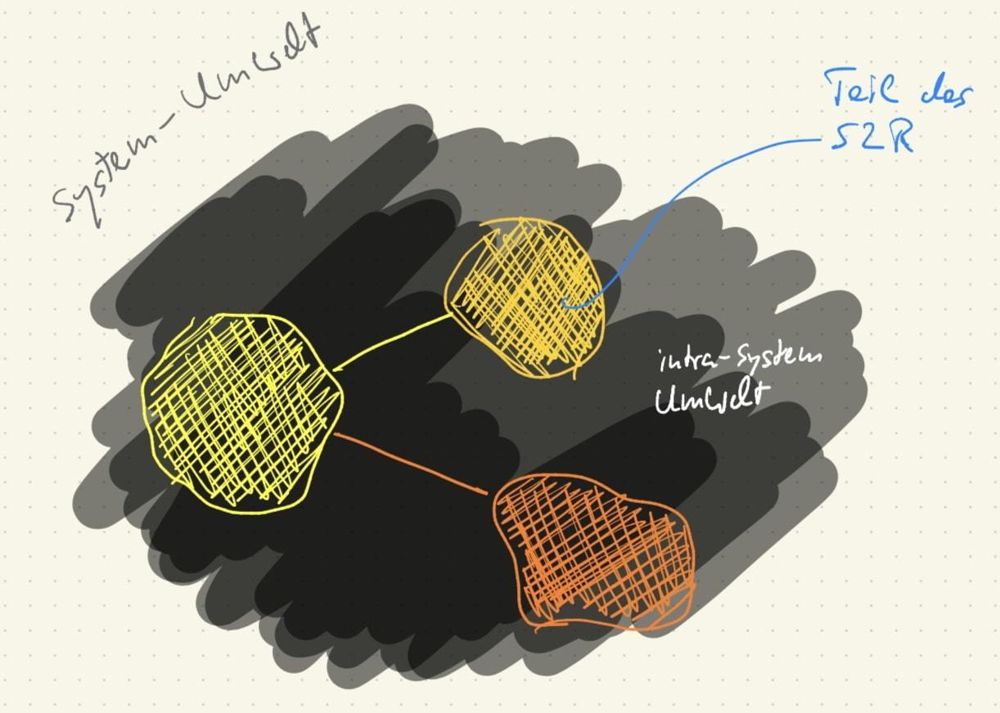

---

<!-- Page 267 of 493 -->

09-Test-firstrefaktorisieren 258
Das S2R als System im System, mit des über Schnittstellen - seine Membran - in Kontakt
steht.
Manche Module des S2R gehören zur Peripherie und kommunizieren mit der S2R-Umwelt,
anderesinddavondurchdiePeripherieisoliertundbildendenKern.
Das Eingangsbeispiel kommt dir in dieser Hinsicht entgegen. Es stellt
schon ein herauspräpariertes Subsystem bestehend aus nur drei Klassen

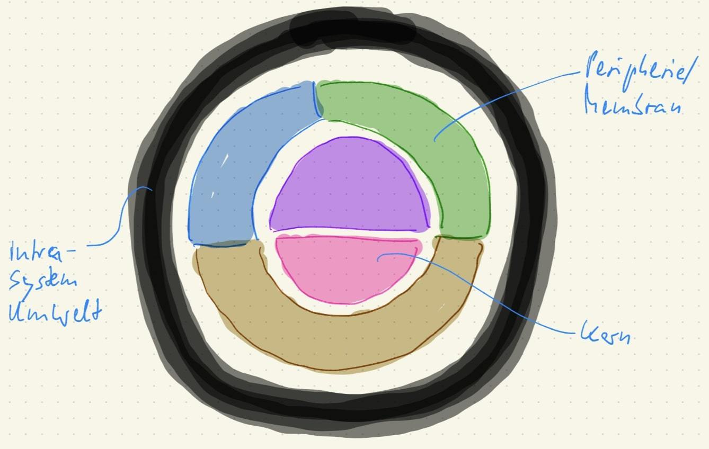

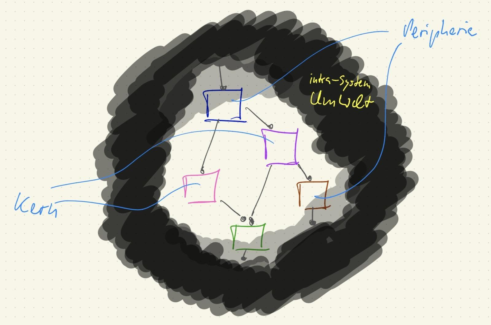

---

<!-- Page 268 of 493 -->

09-Test-firstrefaktorisieren 259
dar. Das wird von anderem Code benutzt, der nicht sichtbar ist.
Entry Points finden
Das Verhalten eines S2R wird getriggert über Entry Points. Das sind
Funktionen, die von der Umwelt aufgerufen werden. Das kann direkt
geschehen oder vermittels einer Infrastruktur, mit der das S2R betrieben
wird.
Ein Beispiel dafür sind Methoden einer MVC REST-Controller Klasse, die
von entfernten Clients nicht aufgerufen, sondern vermittels z.B. JSON-
Nachrichten an bestimmte HTTP-Endpunkte angesteuert werden. Ein
weiteres Beispiel ist die Main() Methode in C#/Java/C++ Programmen,
über die Kontrolle in den Code eintritt.
Entry Points liegen öffentlich an der Oberfläche des S2R. Sie sind Teil
seiner dem Benutzer zugewandten Peripherie.⁹⁵
Durch Entry Points wirst du später die Logik des S2R unter Test stellen,
damit du gefahrlos refaktorisieren kannst.
DieFrage,mitderduaufdasS2Rschauensolltestist:ÜberwelcheMetho-
den welcher Klassen will die Umwelt Leistungen des S2R abfordern?
Im Obfuskationsbeispiel gibt es nur einen Entry Point:
• TextManager.convert(): Die Funktion ist die einzige öffentli-
che Methode auf einer öffentlichen Klasse. Der zu obfuskierende
Text wird darüber hineingegeben und der obfuskierte Text kommt
als Ergebnis zurück.
Über Entry Points ist die Umwelt abhängig vom S2R.
⁹⁵Ichnennedasauchdieventrale Peripherie.DorthinistdasSoftwaresystemausgerich-
tet,aufseineBenutzerhin.So,wiedieVorderseitedesmenschlichenKörpers.

---

<!-- Page 269 of 493 -->

09-Test-firstrefaktorisieren 260
Eine Umwelt steht mit den Modulen des S2R über Entry Points in Kontakt und übt darüber
KontrolleüberdasS2Raus.
Abhängigkeiten aufdecken
So, wie die Umwelt abhängig ist vom S2R, so ist auch das S2R meistens
abhängig von der Umwelt. In irgendeiner Weise greift das S2R auf
Funktionalität außerhalb seiner selbst zu. Offensichtlich ist das bei I/O-
Funktionen, die es aufruft. Aber es kann auch Module geben, die du nicht
zum S2R zählst, die aber von ihm genutzt werden.
Die Frage dazu lautet: In welchen Methoden welcher Klassen werden
Funktionen aufgerufen, die nicht zum S2R gehören?
TrivialeswieSubstring()aufeinerZeichenkettemeineichdamitnicht.
Es geht vielmehr um Funktionen, die die Testbarkeit erschweren. Das tut
z.B. I/O, weil dann in Tests Ressourcen bereitgestellt und/oder überprüft
werdenmüssen.DastutaberaucheinFunktionsaufrufindieintra-System
Umwelt hinein, weil dadurch Logik ins Spiel kommt, die im engeren Sinn
nichts mit dem S2R zu tun hat; auch das kann hinderlich bei Tests sein.
Im Obfuskationsbeispiel gibt es nur eine solche Abhängigkeit:

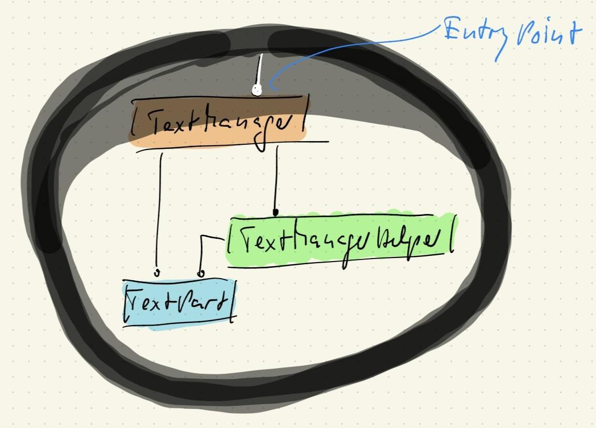

---

<!-- Page 270 of 493 -->

09-Test-firstrefaktorisieren 261
• die Klasse Random mit den Methoden Next() und NextDou-
ble(): Der Zufallsgenerator liegt eindeutig außerhalb des S2R und
ist außerdem ein großes Hindernis für wiederholbare Tests.
Für Abhängigkeiten des S2R kann es später angezeigt sein, sie dynamisch
zu machen und in Tests durch Surrogate zu ersetzen. Das hat Auswirkun-
gen auf eine Refaktorisierung.
Abhängigkeiten befinden sich wie Entry Points in der Peripherie eines
S2R.⁹⁶SiegehörenauchzurOberfläche.WährendEntryPointsjedochuser
facing sind, sind Abhängigkeiten service facing. Die Oberfläche eines S2R
ist somit asymmetrisch.
Membran-ModuledesSR2werdenvonseinerUmweltkontrolliert(userfacing)oderkontrol-
lierendieUmwelt(servicefacing).
⁹⁶IchnennedasauchdiedorsalePerpherie.SieentsprichtderRückseitedesmenschlichen
Körpers. Dort ist das Rückgrat und starke Muskeln halten und schützen den Körper. Die
dorsalePeripherieverbindeteinSoftwaresystemmitderUmwelt,vonderesabhängigist.

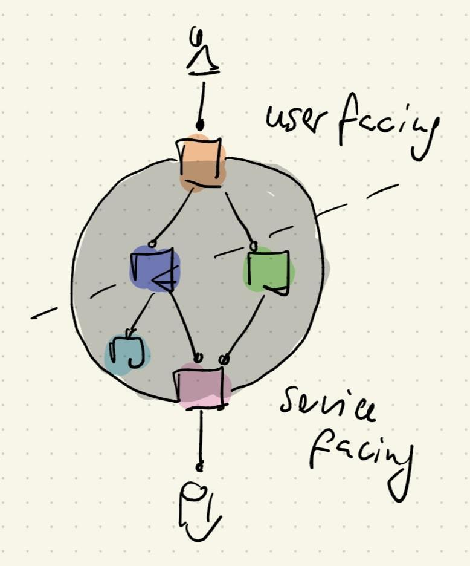

---

<!-- Page 271 of 493 -->

09-Test-firstrefaktorisieren 262
ImBeispiel-S2R ist dieselbe Klasse sowohlfür die user facing wie die service facing Kommu-
nikationzuständig.
Deutlicher wird das, wenn das S2R nicht als Kreis, sondern als Torus
dargestellt wird:
Ein Donut/Torus wird der Asymmetrie der S2R-Umwelt-Beziehungen gerechter - ist aber
schwierigerzuskalieren,wenndieStrukturenumfangreichersind.
Doch diese Darstellung skaliert schlechter, wenn mehrere System mitein-
ander verbunden werden sollen. Sie müssten geschachtelt werden. Eine
Darstellung mit Kreisen ist leichter zu zeichnen, auch wenn darin die
AsymmetriederAbhängigkeiten-vomS2R(fan-in)unddesS2R(fan-out)
- nicht ganz so deutlich rüberkommen mag.

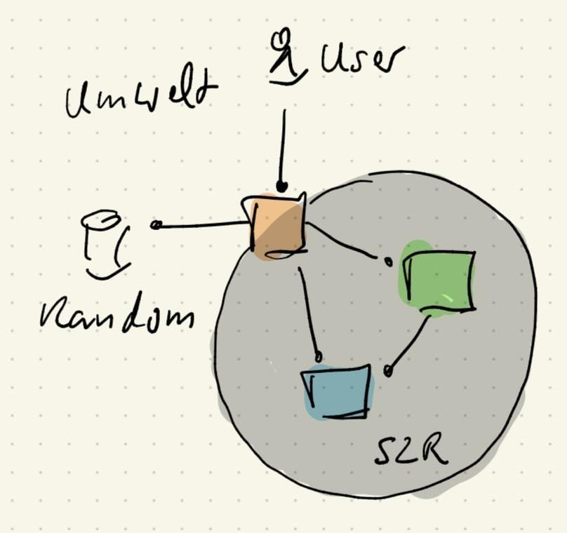

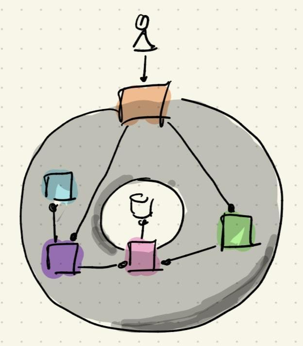

---

<!-- Page 272 of 493 -->

09-Test-firstrefaktorisieren 263
Zusammenhänge herstellen
Nach der Klärung der Abhängigkeitsverhältnisse zur Umwelt bleibt noch
die Klärung der Beziehungen zwischen den Modulen und Funktionen
innerhalb des S2R. Außenverhältnisse und Innenverhältnisse sind die
Grundlage für dein Verständnis und dann eine Umstrukturierung.
Modulzusammenhänge
Zeichne dir simple Abhängigkeitsdiagramme für Module (vor allem Bi-
bliotheken und Klassen): Welches Modul nutzt welches andere Modul?
Oder vielleicht findest du ein Tool, das das für dich tut? Für den obigen
Ancient Code kann das z.B. so aussehen:
KlassendiagrammgezeichnetmiteinemIntelliJUMLPluginfürdieJava-VersiondesAncient
Code
Oderso,wobeidudieMöglichkeithast,dasDiagrammüberdenQuelltext
zu beeinflussen. Du kannst darin sogar Erkenntnisse über Beziehungen
manuell eintragen:

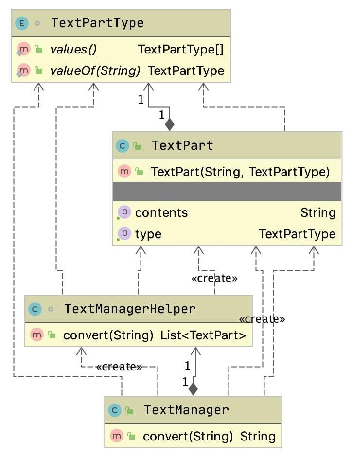

---

<!-- Page 273 of 493 -->

09-Test-firstrefaktorisieren 264
Alternatives Klassendiagramm generiert und ergänzt in IntelliJ mit PlantUML und Sketch
It!

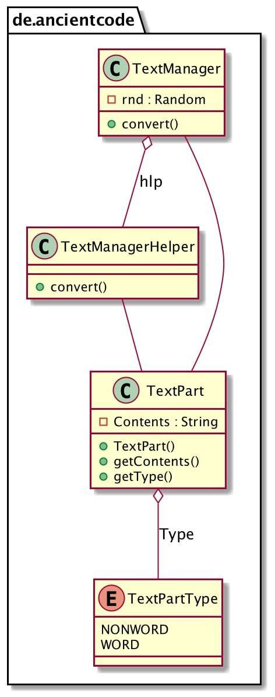

---

<!-- Page 274 of 493 -->

09-Test-firstrefaktorisieren 265
1 @startuml
2 title __ANCIENTCODE's Class Diagram__\\n
3 namespace de.ancientcode {
4 class de.ancientcode.TextManager {
5 - rnd : Random
6 + convert()
7 }
8 TextPart -- TextManager
9 }
10
11 namespace de.ancientcode {
12 class de.ancientcode.TextManagerHelper {
13 + convert()
14 }
15 TextManagerHelper -- TextPart
16 }
17
18 namespace de.ancientcode {
19 class de.ancientcode.TextPart {
20 - Contents : String
21 + TextPart()
22 + getContents()
23 + getType()
24 }
25 }
26
27 namespace de.ancientcode {
28 enum TextPartType {
29 NONWORD
30 WORD
31 }
32 }
33
34 de.ancientcode.TextManager o-- de.ancientcode.TextManagerHelper : hlp
35 de.ancientcode.TextPart o-- de.ancientcode.TextPartType : Type
36 @enduml
Hierbei kannst du auch schon grob unterscheiden zwischen Service- und
Datenklassen:
• Datenklassen “sind” Daten. Ihr Zweck ist es, Daten zu repräsentie-
renundzustrukturieren.DatenklassensindimBeispielTextPart-
Type und TextPart.
• Serviceklassen “haben” Daten. Ihr Zweck ist es, Verhalten zu
erzeugen. Wenn sie dafür Daten halten, dann ist das eine Not-
wendigkeit, aber nicht ihr Existenzgrund. Serviceklassen sind im
Beispiel TextManagerHelper und TextManager.
Eine andere Übersicht über Zusammenhänge liefert eine Dependency
Structure Matrix (DSM)⁹⁷ wie sie ebenfalls z.B. IntelliJ generieren kann.
Wenn die Zahl der Zusammenhänge steigt, ist eine DSM übersichtlicher
als ein Klassendiagramm:
⁹⁷https://www.lattix.com/solutions/dependency-structure-matrix/

---

<!-- Page 275 of 493 -->

09-Test-firstrefaktorisieren 266
Funktionen
Und dann vollziehe die Abhängigkeitsbäume der Funktionen über Modul-
grenzen hinweg nach ausgehend von den Entry Points. Wie spielt die
Logik in den Funktionen konkret zusammen? Das kannst du z.B. mit
einem Sequenzdiagramm⁹⁸ visualisieren. Dann siehst du, wie Verhalten
“in der Tiefe” entsteht.
⁹⁸https://en.wikipedia.org/wiki/Sequence_diagram

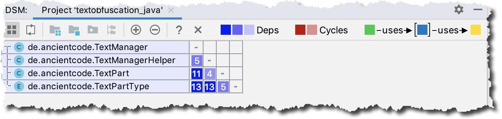

---

<!-- Page 276 of 493 -->

09-Test-firstrefaktorisieren 267
SequenzdiagrammgeneriertfürdenEntryPoint TextManager.convert().Generiertfür
denJava-QuellcodeinIntelliJ.
Oder du fängst erstmal mit einer simplen texttuellen Gliederung an, die
dir mehr Freiheitsgrade bietet als ein automatisch generiertes Diagramm.
Du kannst unwichtige Aufrufe weglassen und besonders interessante

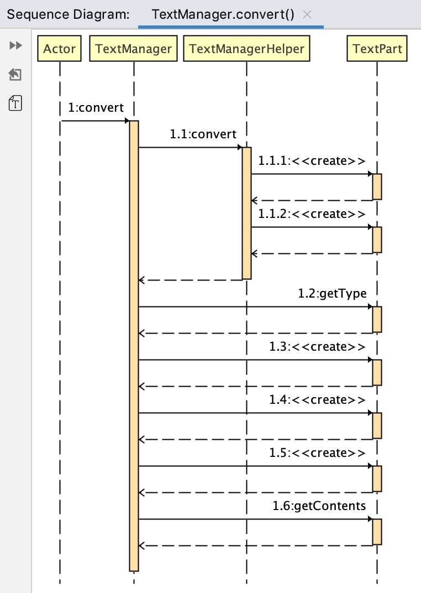

---

<!-- Page 277 of 493 -->

09-Test-firstrefaktorisieren 268
hinzunehmen, z.B. I/O-Aufrufe.
1 TextManager.convert()
2 TextManagerHelper.convert()
3 TextPart.ctor()
4 Random.NextDouble() // I/O
5 TextPart.Type
6 TextPart.ctor()
7 Random.Next() // I/O
8 TextPart.Content
Indem du dir die Zusammenhänge klar machst - was ist aggregiert im
selben Modul, was wird integriert innerhalb eines Moduls, was wird
integriertüberModulehinweg-,bekommstdueinGefühldafür,“wiealles
zusammenspielt” - und auch wo der Code schon “aufgetrennt” werden
kann und wo eben nicht. Du siehst Nähte (seams) und Potenzial für Nähte
bzw. deren Abwesenheit. Michael Feathers definiert das so:
“A seam is a place where you can alter behavior in your
program without editing in that place.”, Michael Feathers
NähtehelfendiralsobeimTesten.Sieerlaubenes,Surrogateeinzubringen.
Auffällig in Bezug auf den Ancient Code ist hier natürlich, dass eine Me-
thodedieganzeArbeitderObfuskationstemmt:TextManager.convert().
Refactor to Test-First
Du hast jetzt einen Überblick über das S2R. Genau verstehst du es
wahrscheinlich noch nicht, denn du hast die Logik noch nicht näher
angesehen. Aber das big picture steht vor dir. Du hast die Akteure in
diesem Code-Drama kennengelernt.
Bevor du nun in die Hände spuckst und den Code umgestaltest, musst
du sicherstellen, dass unter dir ein Sicherheitsnetz gespannt ist. Versuche
keineTrapezkunststückeohneSicherheitsnetz!EsgibtkeinPublikum,dass
du damit beeindrucken könntest. Im besten Fall hast du Glück und es
passiertnichts.Applausbekommstdutrotzdemnicht.Imschlechterenund
wahrscheinlicheren Fall jedoch fasst du daneben und stürzt ab. Das führt
mindestens zu Frust, wenn nicht zu Schlimmerem. Zum Helden wirst du
dadurch auch nicht. Im Gegenteil. Du handelst fahrlässig.

---

<!-- Page 278 of 493 -->

09-Test-firstrefaktorisieren 269
Nicht nur die Entwicklung von Code “auf der grünen Wiese”, nein, auch
die Arbeit am brownfield⁹⁹ sollte immer test-first stattfinden. Das ist
nach 20+ Jahren Agilität und Testautomatisierung gleichzusetzen mit
fachgerechter Arbeit. Alles andere ist amateurhaft.
Lass dein Sicherheitsnetz immer aus zwei “Lagen” bestehen:
• Zweige zuerst einen neuen Branch in deinem Code-Repository ab.
Darin kannst du Code gefahrlos verändern. Wenn dir eine neue
Struktur am Ende doch nicht zusagt, kannst du sie auch komplett
verwerfen.¹⁰⁰
• Schreibe mindestens einen Characterization Test¹⁰¹ für die Entry
Points, der eine halbwegs sinnige Codeabdeckung hat. Das ist so-
zusagen ein nachträglicher Akzeptanz-/Reife- bzw. Modultest, mit
demdutypischesVerhaltendesS2Rdokumentierst.Hiergehtesum
denIst-Zustand des S2R.Der Characterization Testsoll deshalb von
Anfangangrünsein.Achtung:BeidiesemTestgehtesnicht darum,
ob sich das S2R korrekt verhält. Er soll lediglich dokumentieren,
wie es sicht verhält. Denn während der Refaktorisierung soll sich
das Verhalten per definitionem nicht ändern. Während der Refak-
torisierung führst du keine neuen Features ein und fixt keine Bugs.
Es geht um eine Umstrukturierung ohne Verhaltensveränderung -
selbst wenn das Verhalten bekannt (oder unbekannt) inkorrekt sein
sollte.
Der Test soll sicherstellen, dass du nicht unbemerkt in Regressionen läufst.
Der Branch soll sicherstellen, dass du dich nicht in einem Refaktorisie-
rungslabyrinth verlierst und immer wieder zum Ausgang zurückkommst,
falls du es nicht hindurch zum Ziel schaffst.¹⁰²
Refactor to Testability
Das S2R vor einer Refaktorisierung mit einem Test zu versehen, stellt dich
vor zwei Probleme:
⁹⁹https://en.wikipedia.org/wiki/Brownfield_%28software_development%29
¹⁰⁰Selbst wenn in deinem Team trunk based development betrieben wird, kannst du dir
nurfürdicheinenlokalenBranchanlegen.
¹⁰¹https://en.wikipedia.org/wiki/Characterization_test
¹⁰²EinBeispieldafür,wienützlicheinRepositorywährendderRefaktorisierungist,liefert
dieMikadoMethode.Darinnähertmansichintrial-and-errorSchritteneinerZielstrukturan.
Und wann immer man in einen “error”/eine Sackgasse läuft, rollt man Änderungen wieder
zurückzumletztenbekanntensolidenCode-Stand.

---

<!-- Page 279 of 493 -->

09-Test-firstrefaktorisieren 270
• Zuerst muss das S2R überhaupt für Testcode direkt erreichbar und
aufrufbar sein.
• Und dann muss das S2R so isoliert von der Umwelt sein, dass ein
automatisierter Test es ohne zu großen Umstand wiederholt und
nachvollziehbar prüfen kann.
Der Lösung des ersten Problems steht oft eine starke Verwobenheit von
DomänencodemitBenutzerschnittstellencodeimWege.DiesesVerhältnis
muss entflochten werden. Für den Beispielcode ist das aber zum Glück
keine Hürde. Das S2R kann in einem Test direkt angesprochen werden.
1 [Fact]
2 public void Exploration() {
3 var sut = new TextManager();
4
5 var result = sut.convert("the quick brown fox jumps over the lazy dog");
6
7 Console.WriteLine(result);
8 }
Die Ausgabe ist:
1 ,mAybEThe.sOmaybE.bRown!quICkfoX,OveR.The,JUMPsLaZY!dog
Damit hat sich das S2R nun erstmalig in Aktion gezeigt. Das also ist
gemeint mit “Text-Obfuskation”? OMG! Die Worte des Ursprungstextes
sindnochirgendwiezuerkennen,dochdieReihenfolgehatsichverändert,
auseinigenkleinenBuchstabensindgroßegeworden,dieLeerzeichensind
verschwunden und Sonderzeichen sind eingestreut worden. Was noch?
Das Ergebnis ist wahrlich schwer lesbar.
Ein zweiter Durchlauf des Tests liefert allerdings eine andere Ausgabe:
1 The!BrownQuickfoxOverHowever..!andjumps,the,LAzySO!maYbedog
Spätestens jetzt ist dir also klar, dass das S2R eine Abhängigkeit hat, die
es schwer testbar macht. Schuld ist die Abhängigkeit vom Zufallszahlen-
generator Random, wie du dir denken kannst.
DaszweiteProblembestehtoftvoralleminAbhängigkeitenvonHardware-
Ressourcen, z.B. Festplatte (Dateisystem, Datenbank), Uhrzeit, Zufallszah-
len, Kommunikationsverbindungen. Die müssen ausgeräumt werden, um

---

<!-- Page 280 of 493 -->

09-Test-firstrefaktorisieren 271
überhaupt einen Characterization Test schreiben zu können - und das,
ohne schon ein Test-Sicherheitsnetz zu haben.
Um die Bedingung für einen Characterization Test zu schaffen, musst du
also ganz vorsichtig “am offenen Herzen” refaktorisieren. Verlasse sich
dabei am besten so weit es geht auf Refaktorisierungswerkzeuge deiner
IDE und den Compiler. Gehe in kleinsten Schritten in dem Refaktorisie-
rungsbranch vor.
Im Beispiel sieht das z.B. so aus:
1. Code entzerren durch Extraktion von Klassen in eigene Dateien.
Damit wird etwas Übersichtlichkeit gewonnen und die Fokussie-
rung auf einen Aspekt erleichtert. Wenn dir deine IDE dafür eine
Aktion bietet, ist das ganz einfach. Aber auch ohne ist der Aufwand
überschaubar. Der Compiler sagt dir am Ende, ob es geklappt hat.
2. Ersetzen der statischen Bindung an die Klasse Random in Text-
Manager durch eine Bindung an eine Abstraktion IRandom, die
dieselben Methoden wie Random bereitstellt.
1 interface IRandom {
2 public double NextDouble();
3 public int Next(int maxValue);
4 }
5
6 public class TextManager {
7 private TextManagerHelper hlp = new TextManagerHelper();
8 private IRandom rnd; // new Random();
9 ...
Der Compiler zeigt, ob dabei etwas schief gegangen ist, z.B. weil
eine Methode im Interface fehlt. Die Zuweisung einer Random-
Instanz ist auskommentiert, weil die Klasse das Interface nicht
implementiert. Damit ist das S2R im Augenblick nicht lauffähig!
Aber dem wird gleich abgeholfen.
3. EinführungeinesDecorator¹⁰³fürdieRandom-Klasse,derIRandom
implementiert. Der Decorator ist zwar nur ein Wrapper, der Ran-
dom nichts hinzufügt; aber er ist als Indirektion wichtig, um die
Abhängigkeit zu Random zu dynamisieren.
¹⁰³https://en.wikipedia.org/wiki/Decorator_pattern

---

<!-- Page 281 of 493 -->

09-Test-firstrefaktorisieren 272
1 class RandomWrapper : IRandom {
2 private readonly Random _rnd = new Random();
3
4 public double NextDouble() => _rnd.NextDouble();
5 public int Next(int maxValue) => _rnd.Next(maxValue);
6 }
7
8 public class TextManager {
9 private TextManagerHelper hlp = new TextManagerHelper();
10 private IRandom rnd = new RandomWrapper();
11 ...
Eine Instanz des Wrappers wird nun dort erzeugt, wo bisher Ran-
dom instanziiert wurde. Die minimale Indirektion ist damit instal-
liert. Der Compiler sagt, ob das geklappt hat. Das S2R ist wieder
lauffähig und sollte im bisherigen “manuellen” Test wieder ein
Ergebnis zeigen, das den bisherigen ähnelt.
4. Injizieren der IRandom-Instanz in das S2R.
1 public class TextManager {
2 private TextManagerHelper hlp = new TextManagerHelper();
3 private IRandom rnd;
4
5 public TextManager(IRandom rnd) {
6 this.rnd = rnd;
7 }
8 ...
Und im Test einen RandomWrapper übergeben.
1 [Fact]
2 public void Exploration() {
3 var sut = new TextManager(new RandomWrapper());
4
5 var result = sut.convert("the quick brown fox jumps over the lazy dog");
6
7 Console.WriteLine($"<<<{result}>>>");
8 }
Solange der Compiler keinen Fehler meldet, sollte die Korrektheit - genau-
er: das aktuelle Verhalten - des S2R auch hierdurch nicht beeinträchtigt
sein.
Jetzt ist alles vorbereitet, um das S2R abzuklemmen von der störenden
Abhängigkeit. Es muss ja für den RandomWrapper nur ein Surrogat
übergeben werden.
DochwiesolldasSurrogatdasOriginalimitieren?Eskönntevordefinierte
Werte statt Zufallswerte zurückgeben. Nur ist dann das Ergebnis dafür
auch korrekt? Besser ist es, das Verhalten des S2R einmal “in freier
Wildbahn” aufzuzeichnen. Dazu gehören sowohl die Werte, die Random

---

<!-- Page 282 of 493 -->

09-Test-firstrefaktorisieren 273
(versteckthinterRandomWrapper)liefertwieauchdasdamitproduzierte
Ergebnis.
Mit einem speziellen Test-Wrapper ist das kein Problem:
1 class LoggingRandomWrapper : IRandom {
2 private readonly Random _rnd = new Random();
3
4 public LoggingRandomWrapper() {
5 File.Delete("NextDouble.txt");
6 File.Delete("Next.txt");
7 }
8
9 public double NextDouble() {
10 var d = _rnd.NextDouble();
11 File.AppendAllLines("NextDouble.txt", new[]{d.ToString()});
12 return d;
13 }
14
15 public int Next(int maxValue) {
16 var i = _rnd.Next(maxValue);
17 File.AppendAllLines("Next.txt", new[]{$"{maxValue};{i}"});
18 return i;
19 }
20 }
21
22 [Fact]
23 public void Exploration() {
24 var sut = new TextManager(new LoggingRandomWrapper());
25
26 var result = sut.convert("the quick brown fox jumps over the lazy dog");
27
28 File.WriteAllText("Result_Goldmaster.txt", result);
29 }
Jetzt steht alles, was “variabel” war, in Dateien fixiert.
Die Zufallszahlen müssen nun im endgültigen Characterization Test aus
den Dateien NextDouble.txt und Next.txt gelesen, statt durch Ran-
dom generiert zu werden. Und das Ergebnis wird dann mit dem Inhalt von
Result_Goldmaster.txt verglichen.
Als “Goldmaster” wird ein vom S2R erzeugtes Resultat bezeichnet, das an-
schließend zur Überprüfung zukünftiger Verhaltensweise herangezogen
wird. Zukünftige Ergebnisse müssen diesem “Standard” genügen.
Am S2R ist dafür keine weitere Veränderung vorzunehmen. Die sind mit
der Injektion eines IRandom-Instanz abgeschlossen gewesen. Alles wei-
tere für den Characterization Test als Sicherheitsnetz passiert außerhalb
wie auch schon die Aufzeichnung der Zufallswerte.
Der LoggingRandomWrapper hat die Zufallszahlen aufgezeichnet, die
für eine Input-Zeichenkette generiert wurden. Der ReplayingRandom-
Wrapper liest diese Aufzeichnungen nun wieder ein und liefert damit die
Grundlage für exakt dieselbe Obfuskation wie bei der Aufzeichnung. Die

---

<!-- Page 283 of 493 -->

09-Test-firstrefaktorisieren 274
Erwartung des Tests am Ende wird erfüllt; der Ergebniswert entspricht
ebenfalls der Aufzeichnung. Der Test ist grün.
1 class ReplayingRandomWrapper : IRandom
2 {
3 private readonly Queue<double> _nextDoubles;
4 private readonly Queue<(int maxValue, int randomValue)> _nextIntegers;
5
6 public ReplayingRandomWrapper() {
7 var doubles = File.ReadLines("NextDouble.txt").Select(x => double.Parse(x));
8 _nextDoubles = new Queue<double>(doubles);
9
10 var integers = File.ReadLines("Next.txt").Select(x => {
11 var parts = x.Split(';');
12 return (int.Parse(parts[0]), int.Parse(parts[1]));
13 });
14 _nextIntegers = new Queue<(int maxValue, int randomValue)>(integers);
15 }
16
17 public double NextDouble() {
18 return _nextDoubles.Dequeue();
19 }
20
21 public int Next(int maxValue) {
22 if (_nextIntegers.Peek().maxValue != maxValue)
23 throw new InvalidOperationException("maxValue not matching expected value!");
24 return _nextIntegers.Dequeue().randomValue;
25 }
26 }
27
28
29 [Fact]
30 public void Exploration() {
31 var sut = new TextManager(new ReplayingRandomWrapper());
32
33 var result = sut.convert("the quick brown fox jumps over the lazy dog");
34
35 result.Should().Be(File.ReadAllText("Result_Goldmaster.txt"));
36 }
Das S2R steht jetzt unter Test. Damit ist eine erste Testbarkeit des S2R
als Ganzes hergestellt. Das Sicherheitsnetz ist gespannt. Jetzt kann die
eigentliche Refaktorisierung beginnen.
Reflexion
Diese initiale Refaktorisierung, um überhaupt einen Test unter das S2R
spannen zu können, hat bei dir vielleicht für etwas Nervenkitzel gesorgt.
Das ist leider nicht zu vermeiden. Das ist die Konsequenz einer langen
Vernachlässigung fachgerechten test-first Vorgehens.
Doch der Preis, der für diesen Test zu zahlen war, ist einmalig und klein
im Vergleich zu dem Risiko, das Veränderungen ohne Sicherheitsnetz dar-
stellen.WennduohneRegressionstestrefaktorisierstundetwasverrutscht
undduesnichtbemerkstundsichderKundespäterbeklagt,dannentsteht
viel mehr Schaden. Vertrauensverlust beim Kunden und Unterbrechung
der Feature-Entwicklung sind teuer.

---

<!-- Page 284 of 493 -->

09-Test-firstrefaktorisieren 275
Die Refaktorisierung hin zur grundsätzlichen Testbarkeit ist nervig, weil
du sehr aufpassen musst. Aber zum Glück wird einiges davon durch
Compiler und Refaktorisierungswerkzeuge unterstützt. Die Zeiträume, in
denen du wirklich ungesichert bist, sind kurz. Solange du konzentriert
bleibst, kleinschrittig vorgehst mit häufigen Commits und auf einem
eigenen Branch arbeitest, solltest du es schaffen.
DieskannaucheinguterZeitpunktsein,umesmitdemPairProgramming
zu probieren. Vier Augen sehen mehr Abhängigkeiten als zwei. Falls es
ihn gibt, darf der Refaktorisierungspartner gern auch jemand sein, der
schon Erfahrung mit dem S2R hat und etwas von seiner Geschichte und
der Funktionsweise kennt. Dann fällt auch die nächste Phase leichter.
Schrittweise aufräumen II
Refactor to IOSP
Das S2R steht nun unter Test, so dass du dich einer näheren Analyse und
Umstrukturierung widmen kannst. Feuer frei!
Es geht in der zweiten Phase ums Verstehen. Und nur ums Verstehen. Was
immer du während des Prozesses deines Verständnisaufbaus tust, soll und
darf nicht die Funktionalität des S2R beeinflussen. Wenn du Veränderun-
genvornimmst,dannlediglich,ummehrOrdnungherzustellen.Durchdie
Brille deines wachsenden Verständnisses gesehen soll das S2R ordentlich
sein.
Ausschließlich das aktuelle Verhalten ist ja durch Characterization Tests
abgesichert. Dafür wurde aufgezeichnet, was ist.
WenndunachderAnforderungsanalysezuCodierenbeginnst,gehtesum
Verhaltensänderungen. Die Akzeptanztests definieren dein Verständnis.
Deshalbbeginnstdutest-first mitrotenTests:Duweißt,wasdasSoftware-
system können soll, aber noch nicht kann. Die gewünschte Funktionalität
fehlt noch; der Code muss noch deinem Verständnis vom gewünschten
Verhalten angepasst werden. Das Rot treibt dich an. Du willst Grün
herstellen. Du betreibst engineering indem du Code entwickelst.
Bei der Refaktorisierung ist es anders. Du hast noch kein Verständnis. Der
Code kann schon, was er kann. Deshalb beginnst du test-first mit grünen

---

<!-- Page 285 of 493 -->

09-Test-firstrefaktorisieren 276
Tests. Dein Verständnis muss dem vorhandenem Code angepasst werden.
DeinmangelndesVerständnistreibtdichan.DuwillstGrünerhalten.Jetzt
betreibst du reverse-engineering, indem du Code analysierst.
Was sind Verantwortlichkeiten?
Beim reverse-engineering lautet die Frage: Welche Verantwortlichkeiten
hat der Code schon übernommen? Du sucht nach den Rs im SRP.
InsgesamthatdasS2Reineeinzige,großeVerantwortlichkeit,dieeserfüllt,
wenn man es über die Entry Points triggert. Diese Verantwortlichkeit
ist grob Dokumentiert in den Characterization Tests. Aber was stecken
darin noch für Verantwortlichkeiten? Umfassende Verantwortlichkeiten
sind zusammengesetzt aus Teilverantwortlichkeiten: Wer verantwortlich
istfürdieBewirtungvonGästen(umfassendeVerantwortlichkeit),derhat
z.B. die Verantwortung für Getränke, Menü und Snacks. Und innerhalb
dieserTeilverantwortlichkeitengibtesz.B.diefürVorspeise,Hauptgericht
und Dessert als Gänge des Menüs.
Das Single Responsibility Principle formuliert nun als Gebot, dass iden-
tifizierbare Codeeinheiten (Module, Funktionen, Variablen, Konstanten)
jeweils nur eine Verantwortlichkeit haben sollen. Die von Modulen ist
dabeiumfassenderalsdievonFunktionen.UndFunktionenhöherineiner
Aufrufhierarchie haben ebenfalls eine umfassendere Verantwortlichkeit
als tiefer liegende.
Bei der Refaktorisierung ist damit das SRP dein erster Leitstern. Du willst
anstreben, dass das S2R dem SRP entspricht.
Aber was ist eine Verantwortlichkeit?
Verantwortung übernimmt Code immer dort, wo er eine
Entscheidung des Auftraggebers oder des Entwicklers um-
setzt.
VerantwortlichkeitenrepräsentierenEntscheidungenimCode.Dabeigeht
es aber zunächst nicht um Fallunterscheidungen und Bedingungen im
Code, sondern die dahinter stehenden Entscheidungen des Auftraggebers,
die er in seinen Anforderungsbeschreibungen ausdrückt.

---

<!-- Page 286 of 493 -->

09-Test-firstrefaktorisieren 277
• Es beginnt mit der Entscheidung des Auftraggebers, ob ein Aspekt
überhaupt eine Rolle spielt oder nicht.
• ErstdiezweiteEntscheidungdrehtsichdanndarum,wiederAspekt
ausgeprägt sein soll.
Wenn die Frage nach demOb mit Ja beantwortet ist, dann greift schon das
SRP.DannsolltedieseEntscheidungimCodeaneinemundnureinemOrt
repräsentiert werden. Welches Mittel gewählt wird, um die Entscheidun-
gen zu repräsentieren, ist durchaus davon abhängig, in welcher Tiefe im
Baum der Entscheidungen des Auftraggebers sie hängt. Umfassende und
grundlegende Entscheidungen werden wohl deutlicher in der Codestruk-
tur widergespiegelt als nebensächliche Detailentscheidungen.
Nimm als Beispiel den Textumbruch aus der Übungsaufgabe. Es ist
erstaunlich, was darin für Entscheidungen stecken:
• Textewerdenumgebrochen,sodassdieZeileneinemaximaleLänge
nicht überschreiten. Das ist die Entscheidung für eine Problem-
domäne. Diese Entscheidung repräsentiert eine Klasse mit einer
Methode.
– Innerhalb dieser Entscheidung gibt es die Entscheidung dafür,
dass Zeilen aus Worten zusammengesetzt sind. Sie könnten
alternativ nur aus Zeichen bestehen.
- Innerhalb dieser Entscheidung für Worte steckt wiederum
eine Entscheidung, die Entscheidung dafür, was als Wort
erkannt wird: Eine Folge von non-Whitespace Zeichen.
- Dazu gehört die Entscheidung, dass Whitespace zwischen
Worten nicht signifikant ist und bei der Textzerlegung kom-
plett verworfen werden kann.
– Innerhalb der Entscheidung für Worte als umbruchrelevan-
te Einheiten gibt es die für den Umgang mit Worten, die
selbst länger als die max. Zeilenlänge sind. Die sollen einfach
zerschnitten werden in Stücke von max. Zeilenlänge. Der
Umgang damit könnte aber auch anders aussehen.
• Innerhalb der Domäne geht es nicht nur um Text, der durch
string-Parameterund Ergebnistyp repräsentiertist,sondern auch
um Zeilen.

---

<!-- Page 287 of 493 -->

09-Test-firstrefaktorisieren 278
– Dazu gehört eine Entscheidung, wie Zeilen in Texten getrennt
sind, z.B. durch \n Zeichen.
- Dazu gehört die Entscheidung, dass Leerzeilen nicht signifi-
kant sind. Weder im Quelltext, noch im umgebrochenen Text.
– Dazu gehört auch die Entscheidung, wie Worte in einer Zeile
angeordnet sind. Die nicht weiter ausgeführte Entscheidung
ist, dass sie linksbündig angeordnet werden.
- Dazu gehört die Entscheidung, dass Worte im umgebroche-
nen Text durch nur jeweils ein Leerzeichen getrennt sind.
Vielleicht gibt es noch weitere Entscheidungen? Vor allem natürlich viele,
die gar nicht thematisiert werden, z.B. dass Performance keine Rolle zu
spielen scheint oder die Größe der Texte.
ZumindestjedochfürdieserechteinfachzuerkennendenEntscheidungen
fordert das SRP eine eindeutige und explizite Repräsentation. Für jede soll
an einem Ort durch ein Strukturelement die Verantwortung übernommen
werden.
Ist das in deiner Lösung für die Übungsaufgabe der Fall gewesen? Hast du
Klassen, Funktionen, Variablen, Konstanten geschickt so eingesetzt, dass
jede Entscheidung durch ein Element abgedeckt ist und jedes Element nur
eine Entscheidung abdeckt?
DasIOSPsolldabeihelfen,dasSRPeinzuhalten.Estrenntselbstdieforma-
len technischen Belange Integration und Operation. Doch dabei entsteht
noch ein Nebeneffekt: Es wird Druck auf den Umfang von Funktionen
ausgeübt. Lange Integrationen sind nicht gut zu verstehen, aber einfach
zu refaktorisieren; das motiviert dich, darin nach Verantwortlichkeiten
zu suchen und sie auszulagern. Lange Operationen sind nicht gut zu
verstehen und klappen in Integrationen um, sobald du anfängst, daraus
Logik-Teile zu extrahieren. Da liegt es nahe, für jede Operation zu fragen,
für welche Entscheidung aus den Anforderungen sie verantwortlich sein
soll.
Eigentlich sollte es heißen “Refactor to SRP”. Doch inhaltliche Entschei-
dungen zu identifizieren ist schwieriger, als die formalen Verantwort-
lichkeiten Integration und Operation zu trennen. Deshalb setze dir als
erstes Ziel “Refactor to IOSP” - und wenn du dann “in Fahrt gekommen
bist”, schau genau hin, was du alles in Operationen und Integrationen

---

<!-- Page 288 of 493 -->

09-Test-firstrefaktorisieren 279
und schließlich Module separieren kannst. Die formalen, strukturellen
Verantwortlichkeiten sind ein guter Handlauf, an dem du dich zu einer
besseren Ordnung voranarbeiten kannst.
Pass 1: Verantwortlichkeiten identifizieren
Mit einer Idee davon, was Verantwortlichkeiten sind, gilt es im nächsten
Schritt, die konkret im Ancient Code aufzuspüren. Der Bezugsrahmen da-
für ist die Gesamtanforderung. Die lautet im Beispiel “Text-Obfuskation”.
Welcher Abschnitt des Quellcodes befasst sich damit? Und welche groben
anderen Verantwortlichkeiten lassen sich erkennen. Dazu ist ein Blick aus
größerer Flughöhe hilfreich. Zunächst kannst du die Module in einem
Klassendiagramm betrachten oder die Projektstruktur, die sich während
der Refaktorisierung für den Characterization Tests entwickelt hat:
DieModuleeingefärbtnachihrergrobenVerantwortlichkeit
Da ist schon eine gewisse Differenzierung zu erkennen. Die Domäne, die
Fachlichkeit wird durch drei Module repräsentiert (grün); dazu kommt
noch eine technische Klasse, die bei der Refaktorisierung für die Testbar-
keit entstanden ist (rot).
Aber warum überhaupt drei Module innerhalb der Domäne? Wie unter-
scheiden die sich in ihrer Teilverantwortlichkeit?
DifferenzierungderVerantwortlichkeiteninnerhalbderDomäne

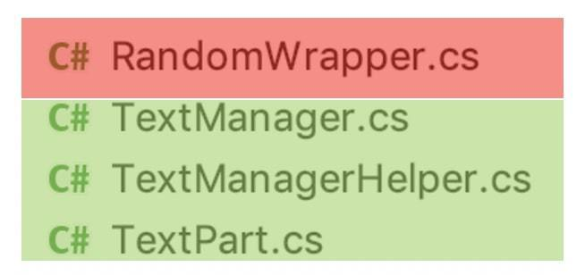

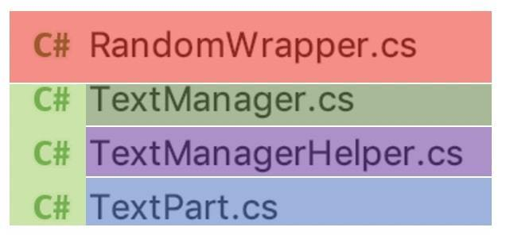

---

<!-- Page 289 of 493 -->

09-Test-firstrefaktorisieren 280
WennduVerantwortlichkeitenerstmalnurfarblichunterscheidest,befreit
dich das vom Zwang, ihnen sofort einen Namen zu geben. Du kannst sie
nach irgendwelchen Kriterien identifizieren, die du erst im Laufe deiner
Analyse langsam ausbildest und verfeinerst. Verantwortlichkeiten findest
du sozusagen in einer Co-Evolution deines Verständnisses mit der sich
veränderndern Codestruktur während der Refaktorisierung.
Reverse-engineering ist kein linearer Prozess. Du wirst durch viele Itera-
tionen gehen müssen und auch gelegentlich in Sackgassen laufen. Dein
Verständnis wird oft den Charakter eine Hypothese haben, die du durch
weitere Analyse erst noch bestätigen musst. Verantwortlichkeiten schälen
sich heraus; sie präsentieren sich dir nicht auf dem Silbertablett.
Wenn du dir dann aber ziemlich sicher bist, kannst du den Verantwort-
lichkeiten natürlich Namen geben:
VerantwortlichkeitenbrauchenpassendeBezeichnungen
Zuerst sind das nur tentative Bezeichnungen - aber wenn du dir relativ
sicherbist,etwasPassendesgefundenzuhaben,dannbenennedieModule
um.
Das Suffix “Provider” soll deutlich machen, dass es sich bei der Klasse um
einen Adapter handelt, der eine Ressource kapselt.
Die neuen Namen sind näher an den eigentlichen Aufgaben. Die Zwecke
der in den Klassen aggregierten Funktionen spiegeln sich darin besser
wider. Aber das ist nur der Anfang. Genauso muss es in den Modulen
weitergehen. Machen die Namen innerhalb der Module Sinn?

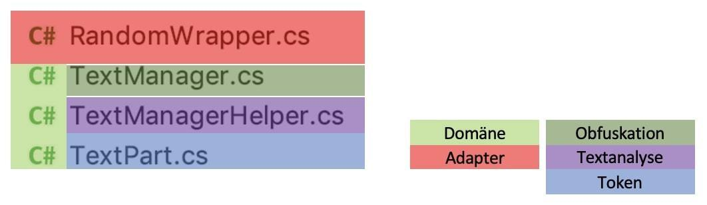

---

<!-- Page 290 of 493 -->

09-Test-firstrefaktorisieren 281
NichtalleBezeichnungenpassenoptimalzumZweckderModulebzw.ihrerTeile
Die Struktur innerhalb der Module ist bisher schwach ausgeprägt. Es
gibt nicht viel, was dort jenseits der Modulzwecke auf Zugehörigkeit zu
Verantwortlichkeiten hin analysiert werden könnte. Aber einiges dürfte
schoneinenanderenNamenerhalten,umdemZweckbesserRechnungzu
tragen.Dassichwiederholendeconvert()kannz.B.einmalanalyze()
heißenundeinanderesMalobfuscate().Contentswirdkonkreterzu
Text, weil es das ist, was in Token-Objekten zusammengefasst wird. An
IRandom wird hingegen nichts verändert, weil das Interface der darunter
liegenden Standardfunktionalität so ähnlich wie möglich sein soll.
Das sind allereinfachste Veränderungen. Die IDE hilft sicher bei der
UmbenennungmiteinemRefaktorisierungsshortcut.IndiesemSchrittder
Erkennung und Bezeichnung von Verantwortlichkeiten wird der Lösungs-
ansatz allerdings noch nicht hinterfragt. Zum Beispiel bleibt Token wie
es ist, auch wenn man der Meinung sein könnte, dass das Konzept eines
Token besser mit einer Klassenhierarchie abgebildet sein würde:

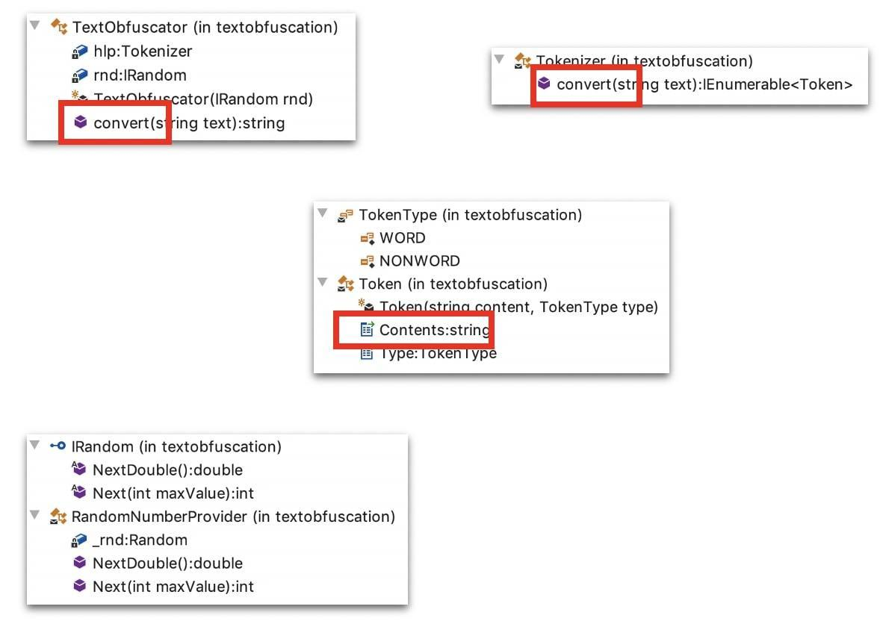

---

<!-- Page 291 of 493 -->

09-Test-firstrefaktorisieren 282
1 abstract class Token { string Text {get;} }
2
3 final class Word : Token {...}
4
5 final class NonWord: Token {...}
Wo Struktur fehlt - ein untrügliches Kennzeichen gerade von Ancient
Code - muss der Fokus bei der Erforschung der Verantwortlichkeiten
notgedrungen auf der Logik liegen. Die ist im Beispiel in zwei Funktionen
konzentriert. Die einfachere oder zumindest kürzere ist:
1 class Tokenizer {
2 public IEnumerable<Token> analyze(string text) {
3 var contents = "";
4 var type = TokenType.WORD;
5 for (var i = 0; i < text.Length; i++) {
6 if (char.IsLetter(text[i])) {
7 if (type == TokenType.WORD) {
8 contents += text[i];
9 }
10 else {
11 if (contents != "") yield return new Token(contents, type);
12 contents = text[i].ToString();
13 type = TokenType.WORD;
14 }
15 }
16 else {
17 if (type == TokenType.NONWORD) {
18 contents += text[i];
19 }
20 else {
21 if (contents != "") yield return new Token(contents, type);
22 contents = text[i].ToString();
23 type = TokenType.NONWORD;
24 }
25 }
26 }
27 yield return new Token(contents, type);
28 }
29 }
Und auch hier kannst du dich in mehreren Iteration den Verantwortlich-
keiten annähern. Versuche es z.B. zuerst wieder mit Einfärbung. Wo sind
Entscheidungen des Auftraggebers codiert?
Farben stellen nicht-textuelle Abstraktionen des textuellen Codes dar.
Damit sind sie in zweifacher Hinsicht Kommentaren überlegen:
• Du musst während der Zuordnung zu Verantwortlichkeiten keine
neuen Namen finden. Es reicht, wenn du erstmal nur ein Gefühl
hast, dass Codeteile zusammengehören oder eben nicht. Welche
Verantwortlichkeit sie genau darstellen, wie die am besten benannt
werden sollte, ist zunächst nicht wichtig. Damit verhakst du dich
nicht so schnell an einer Stelle im Code in verzweifelter Suche nach
der besten Bezeichnung für das, was dort geschieht.

---

<!-- Page 292 of 493 -->

09-Test-firstrefaktorisieren 283
• Du kannst “auf einem Blick” Muster erkennen. Sind Farben konzen-
triert oder stark verteilt? Sind viele Farben nötig oder wenige, um
die Funktionalität zu beschreiben? Wie weit auseinandergezogen
sind gleich eingefärbte Teile? Wechseln sich Farben in der selben
Zeile ab?
DieEinfärbungderTokenanalysehatsichvonderZieldatenstrukturleiten
lassen: Token besteht aus einem Typ - Wort oder nicht-Wort - und einer
textuellen Repräsentation. Wo in der Funktion werden die Werte dafür
bestimmt? Und das Ergebnis ist eine Menge von Tokens. Wo wird diese
Menge generiert?
Selbst wenn es dir schwer fällt, für jeden Teil des Codes eine oder gar
“die richtige” Farbe zu finden, hat die Einfärbung Sinn. Sie bringt dich ins
Nachdenken. Du beschäftigst dich mit dem Code eingehend, eben weil du
dir die Frage nach der passenden Farbe stellst - selbst wenn am Ende die
Antwort uneindeutig sein sollte. Nicht die Farben sind wichtig, sondern
die Erkenntnisse, die du gewinnst.
In diesem Fall lauten sie:

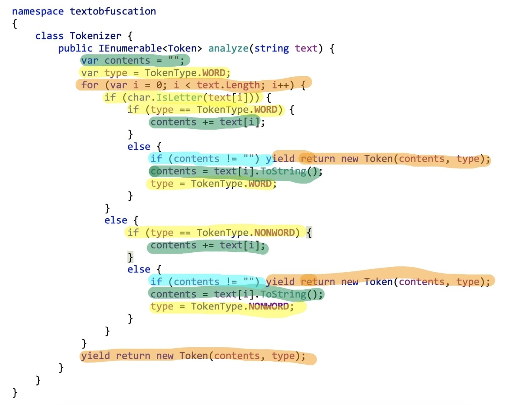

---

<!-- Page 293 of 493 -->

09-Test-firstrefaktorisieren 284
• DieAnalysegrenztQuelltextteilevoneinanderab.Dabeizähltjedes
Zeichen(siehefor-Schleife,dieüberdieeinzelnenZeicheniteriert).
Für jedes Zeichen kann die Klassifizierung (Tokentyp) wechseln.
• Wann immer der Tokentyp wechselt, wird der vorherige Abschnitt
abgeschlossen und dem Ergebnis hinzugefügt (yield return).
• Der Text eines Tokens wird immer in derselben Weise zusam-
mengestellt. Hier ist die 1:1 Wiederholung der grünen Abschnitte
kennzeichnend.
Die Schleife und die geschachtelten Fallunterscheidungen auf so engem
Raum zeigen eine sehr algorithmische Lösung an. Sequenzielle Prozess-
schritte lassen sich hier schwer von einander trennen. Wie kann der Code
dennoch durch Konzentration von Verantwortlichkeiten und Vermeidung
von Dopplungen ordentlicher werden?
Zunächst ist anzuerkennen, dass die Logik schon für sich testbar ist. Vor
einer Refaktorisierung sollte daher auch hier nach test-first Manier ein
Modultest aufgesetzt werden - zumindest wenn du dir nicht so ganz
sicher bist, dass die Refaktorisierung trivial ist. Denn wenn etwas falsch
läuft, gibt es nur den Characterization Test, um anzuzeigen, dass etwas
bei analyze() verrutscht ist. Was dann aber für dich keine so große
Überraschung sein sollte, weil du nur dort eingegriffen hast.
1 [Fact]
2 public void Module_test() {
3 var sut = new Tokenizer();
4
5 var result = sut.analyze("a bc_,1def");
6
7 result.Should().BeEquivalentTo(
8 new Token(TokenType.WORD, "a"),
9 new Token(TokenType.NONWORD, " "),
10 new Token(TokenType.WORD, "bc"),
11 new Token(TokenType.NONWORD, "_,1"),
12 new Token(TokenType.WORD, "def")
13 );
14 }
Über dem Sicherheitsnetz dieses zusätzlichen Tests kann die Refaktorisie-
rung der analyze() Logik dann z.B. so aussehen:

---

<!-- Page 294 of 493 -->

09-Test-firstrefaktorisieren 285
Der Farb-Flickenteppich ist nicht ganz verschwunden, doch zumindest ist
der Wechsel zwischen den Farben nicht mehr ganz so stark. Auch die
Schachtelungstiefe hat deutlich abgenommen.
Wieder geht es nicht darum, dass die Farben 100% korrekt gesetzt werden.
Wenn du vorher “nach Gefühl” coloriert hast, dann jetzt auch. Entschei-
dend ist, dass ein positiver Unterschied zu sehen ist.
Im Zuge der Neuentwicklung der Logik, die nicht zu umgehen war
angesichts des vorherigen Durcheinanders, sind auch noch einige Namen
verändert worden und ist etwas Funktionalität ausgelagert worden in den
Token-Datentyp.
1 class Token {
2 public Token(TokenType type) : this(type, "") {}
3 public Token(TokenType type, string text) {
4 Type = type;
5 Text = text;
6 }
7
8 public TokenType Type { get; }
9 public string Text { get; }
10
11 public bool IsEmpty => string.IsNullOrEmpty(Text);
12 }
Dass im neuen Analyseansatz ständig neue Token-Objekte erzeugt wer-
den, mag dir seltsam vorkommen. Auf diese Weise werden aber zusätzli-
che Variablen gespart, die den Code verrauscht hätten. Dass die vielen
Objekte ein Speicher- oder Performanceproblem darstellen, ist erstmal
nicht zu erwarten. Und wenn doch… dann muss das erstens bewiesen und
hierlokalisiertwerden,undzweitenswäredannderzuoptimierendeCode
sehr begrenzt.

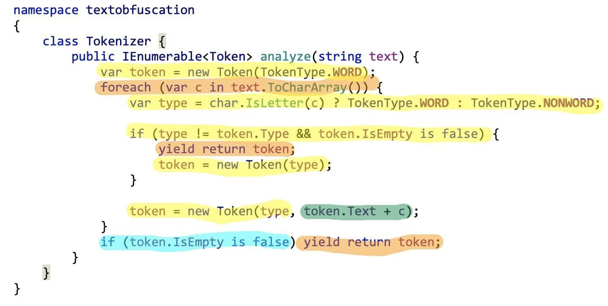

---

<!-- Page 295 of 493 -->

09-Test-firstrefaktorisieren 286
Weitere Funktionen auszulagern, um diese kleine Funktion einer Inte-
gration näher zu bringen, lohnt sich wahrscheinlich nicht. Mit lokalen
Funktionen in C# wäre aber auch das sehr leicht möglich, ohne den Zu-
sammenhang auseinander zu reißen. Dass analyze() zu einer hybriden
Funktion würde, wäre für das Verständnis nicht so nachteilig, weil die
Funktionsdefinitionen nah sind. Und weitere Testbarkeit wird nun für die
Logik in analyze() auch nicht mehr gebraucht.
1 public IEnumerable<Token> analyze(string text) {
2 var token = new Token(TokenType.WORD);
3 foreach (var c in text.ToCharArray()) {
4 var type = Determine_token_type(c);
5
6 if (Token_type_changed(type)) {
7 yield return token;
8 token = new Token(type);
9 }
10
11 token = new Token(type, token.Text + c);
12 }
13 if (token.IsEmpty is false) yield return token;
14
15
16 TokenType Determine_token_type(char c)
17 => char.IsLetter(c) ? TokenType.WORD : TokenType.NONWORD;
18
19 bool Token_type_changed(TokenType type)
20 => type != token.Type && token.IsEmpty is false;
21 }
Je nach Geschmack könnte also auf diese Weise die Verständlichkeit noch
etwas gesteigert werden.
Nach dieser Refaktorisierung zum Aufwärmen jetzt das eigentliche Ar-
beitspferd der Obfuskation: obfuscate().
Hier ist die Grundstruktur nicht algorithmisch, sondern prozesshaft. Das
Verhalten wird auf zwei Ebenen sequenziell in Schritten hergestellt.
• Auf der obersten Ebene wird zuerst mit Tokens gearbeitet (1) und
dann mit einem aus Tokens neu generierten Text (2).
• Die beiden Phasen der oberen Ebene bestehen wiederum aus meh-
reren ihnen eingeschriebenen (3) bis (6) und (7) bis (9).

---

<!-- Page 296 of 493 -->

09-Test-firstrefaktorisieren 287
DankenswerterweisewarderAncientCodeschongrobmitverticalwhite-
space so strukturiert, dass diese Verantwortlichkeiten sichtbar waren. Sie

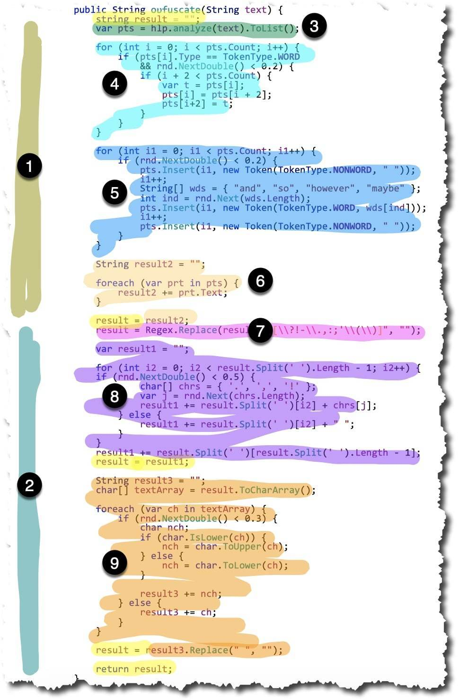

---

<!-- Page 297 of 493 -->

09-Test-firstrefaktorisieren 288
folgenkonsequentaufeinander;nurdieAktualisierungdesResultats(gelb)
ist immer mal wieder zwischengeschoben.
Dass es verschiedene Verantwortlichkeiten innerhalb von obfuscate()
gibt, ist hier nicht die Frage. Welche Verantwortlichkeiten das jedoch
sind, wie sie “kurz und knackig” beschrieben werden können, ist noch
herauszufinden.
Was bedeutet es, wenn zunächst mit den Tokens gearbeitet wird und dann
mit einem String? Wenn du das jetzt schon siehst/verstehst, dann kannst
du den groben Phasen auch schon jetzt einen Namen geben. Ansonsten
lohnt die Analyse bottom-up.
Prozessschritt (1)
Zunächst wird der Quelltext in Tokens zerlegt (3). Das geschieht durch
einen integrierenden Methodenaufruf. Das Abstraktionsniveau ist hoch.
Aber nur kurzzeitig. Denn jetzt folgt lediglich Logik… Was tun (4), (5)
und (6)?
In (4) ist das Muster eines swap zu sehen. In der Liste der Tokens werden
Einträge vertauscht.
1 var t = pts[i];
2 pts[i] = pts[i + 2];
3 pts[i+2] = t;
Außerdem ist der Zufall mit rnd.NextDouble() im Spiel.
In Summe könnte dieser Schritt als Mischen der Tokens verstanden
werden. Solch eine Erkenntnis kannst du erstmal mit einem Kommentar
im Code vermerken.
WiegenaudasMischenfunktioniert,istwenigerwichtig.Überhaupteinen
überschaubaren Bereich von Logik mit einer Bedeutung belegt zu haben,
ist viel wichtiger.
Mit der gemischten Liste der Tokens wird anschließend weitergearbeitet.
(5) tut wieder etwas zufallsgesteuert. Verräterisch ist hier, dass immer
wieder Insert() auf der Liste der Tokens aufgerufen wird.
In der Schleife werden zusätzliche Tokens zwischen die ursprünglichen
gesetzt: Leerzeichen und ein Token aus einer festen Liste ({ "and",
"so", "however", "maybe" }).

---

<!-- Page 298 of 493 -->

09-Test-firstrefaktorisieren 289
Ob es wichtig ist, dass die Leerzeichen als getrennte Tokens eingebaut
werden? Warum lauten die Tokens in der Liste nicht " and " usw., d.h.
haben schon ein Leerzeichen vor-/nachgestellt? Aber auch das ist erstmal
ein Detail, das hinter der generellen Erkenntnis zurücktritt, dass es sich
um ein Verrauschen der ursprünglichen Tokens handelt. Es wird eben
noise hinzugefügt.
Bei (6) schließlich geht es ums Verschweißen der gemischten und ver-
rauschten Tokens zu einem Text.
Und wie können diese Schritte in Summe benannt werden? Durch das
Umarrangieren und Verrauschen wird der Text grundsätzlich unverständ-
lich. Für einen Leser ist er anschließend konfuses Geschreibsel. Warum
also nicht diesen Schritt mit “Durcheinanderbringen” betiteln?
Kommentare ersetzen erstmal die Farben im Code und konkretisieren die
Verantwortlichkeiten unaufwändig.
Jetzt könntest du schon diese Erkenntnisse mit extrahierten Funktionen
dokumentieren. Doch falls sich bei der weiteren Deutung noch mehr
Einsichten einstellen sollten, könnte die Refaktorisierung voreilig sein.
Also keine Hektik. Die Kommentare halten den Stand deines Verständnis-
ses fest. Du kannst jederzeit darauf zurückkommen.
AbernichtnurKommentaresindungefährlicheCodeveränderungenwäh-
rend der Analyse. Nutze jederzeit reichlich Whitespace, um Sinneinheiten
zu trennen. Oder lösche Whitespace, um Kohäsion zu betonen, wo vorher
Trennung war. Mit Whitespace kannst du dir sozusagen ein “Operations-
feld” schaffen, auf das du dich konzentrierst.
Prozessschritt (2)

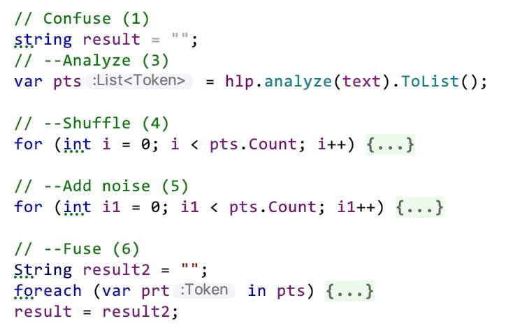

---

<!-- Page 299 of 493 -->

09-Test-firstrefaktorisieren 290
Für welche Teilverantwortlichkeit stehen die folgenden Abschnitte in der
zweiten Phase der Obfuskation? Hier zur Wiederholung etwas freigestellt
mit Leerzeichen drumherum:
In Schritt (7) werden Zeichen ersetzt; das verrät Replace(). Genauer:
Die üblichen Satzzeichen wie . oder : oder ( werden gelöscht, weil sie
durch den leeren String "" ersetzt werden.
Bei (8) kommt wieder der Zufall ins Spiel.
• Der Text wird in Abschnitte zerlegt, die durch Leerzeichen getrennt
sind: result.Split(' ').
• Diese Abschnitte werden in derselben Reihenfolge wieder zu einem
Text zusammengesetzt.
• Mit 50% Wahrscheinlichkeit wird dabei einem Abschnitt wieder
ein Leerzeichen angehängt. Mit 50% Wahrscheinlichkeit wird ihm
jedoch eines der Satzzeichen ., , oder ! nachgestellt.

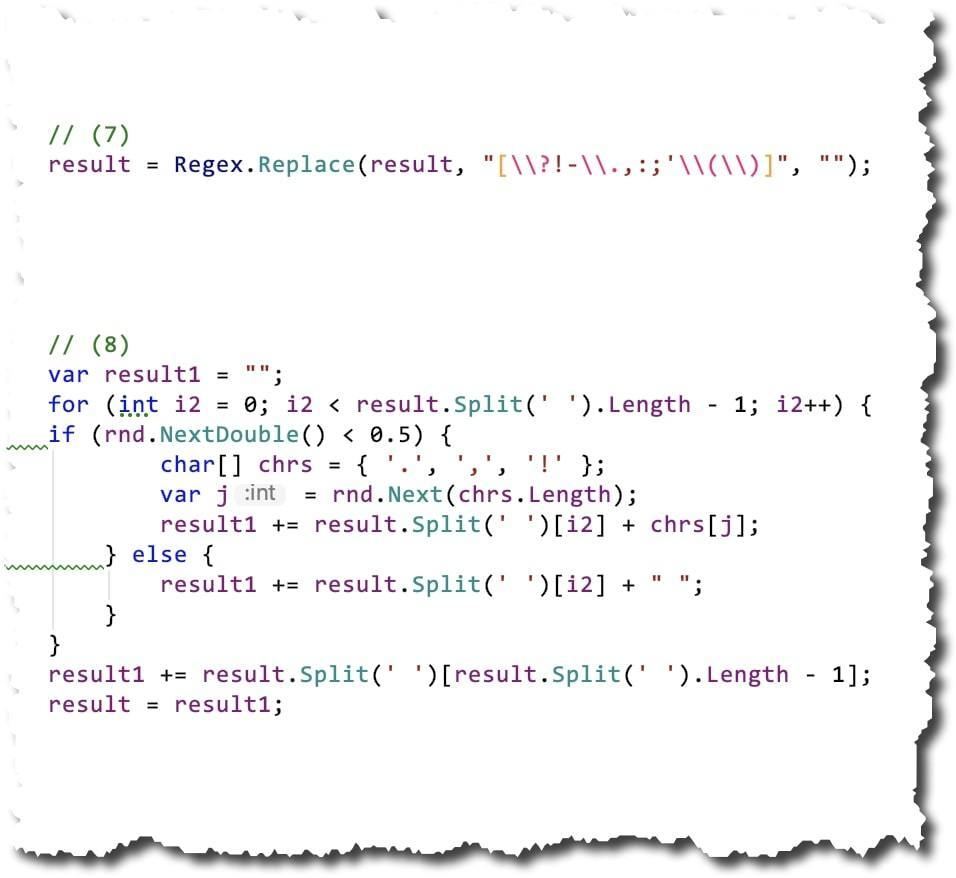

---

<!-- Page 300 of 493 -->

09-Test-firstrefaktorisieren 291
Abstrahiert bedeutet das wohl, dass die Hälfte aller Leerzeichen durch
Satzzeichen ersetzt wird. Es findet sozusagen eine “Re-Punktuierung”
statt.
Schritt (9) durchläuft den Text wieder zeichenweise. Mit einer 30%igen
Wahrscheinlichkeitwirddaranetwasverändert:dieGroß-/Kleinschreibung
wird umgekehrt.
UndganzamEndeschleichtsichnocheineweitereVerantwortlichkeitein,
die bei der Einfärbung übersehen wurde, weil sie ebenfalls auf result3
arbeitet. Es werden alle Leerzeichen im Text gelöscht.
In dieser Phase wird der Text nur noch auf Zeichenebene verändert. Die
Punktierungwirdeingeschränktundverstreut,dieGroß-/Kleinschreibung
wirdverändertund der Textkomprimiert.Ein konfuserTexterfährt damit
eine… Würzung. Das ist sicher kein perfekter Name, aber ganz so schlecht
ist er auch nicht für eine solch merkwürdige Domäne.

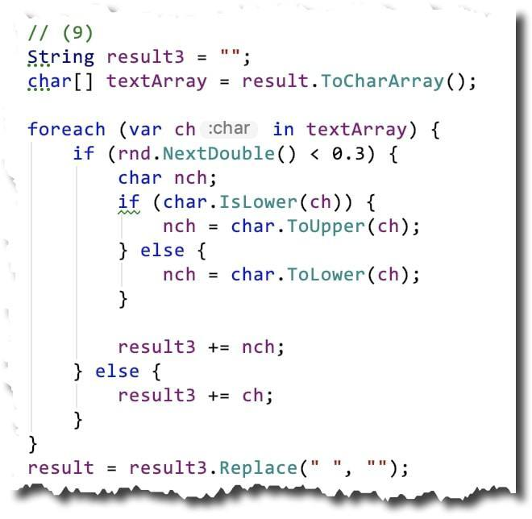

---

<!-- Page 301 of 493 -->

09-Test-firstrefaktorisieren 292
Reflexion
Verantwortlichkeiten in zwei Schritten identifizieren, ist ein Ansatz, der
deine mentale Last angesichts von Code-Chaos gering hält.
• Zuerst einfärben, um einen einfachen Überblick über die Vertei-
lungsmuster und Vielfalt von Verantwortlichkeiten zu gewinnen,
ohne dass du dich schon gleich mit Bedeutungen festlegen musst.
• Dann Bedeutungen aus der genaueren Betrachtung von möglichst
kleinen Logik-Blöcken herausdestillieren und mit Kommentaren,
Whitespace und gelegentlich auch Umbenennungen von Variablen
dokumentieren durch Benennen.
Damit ist der Code vorbereitet für den nächsten Schritt: Extraktion von
Logik, um deine Einsichten in testbare Strukturen zu verwandeln.
Wenn im Tokenizer schon die Logik refaktorisiert bzw. neu geschrieben
wurde, dann weil es dort nichts zu extrahieren gab nach Einfärbung der
Verantwortlichkeiten. Ein Zustandsautomat, wie ihn die Logik dort dar-
stellt,bestehtmusterhaftauseinerSchleifezumEinlesenvonTriggernund
Fallunterscheidungen für die Zustandsübergänge und damit zusammen-
hängenden Aktionen. Bei dem geringen Umfang des Zustandsautomaten
ist das erreichte Ergebnis gut genug.

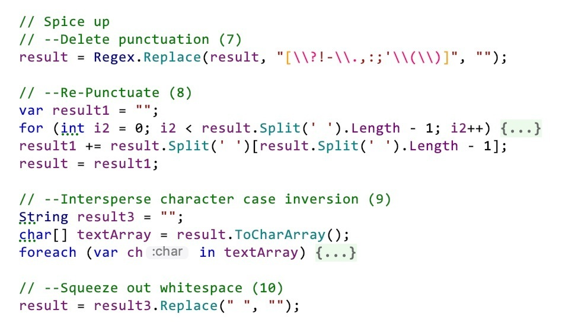

---

<!-- Page 302 of 493 -->

09-Test-firstrefaktorisieren 293
Anders bei der umfangfeichen Obfuskationslogik. Selbst wenn die nicht
schon so hübsch vorstrukturiert gewesen wäre, müssten Extraktionen
sein.
Pass 2: Extrahieren
Mit der Identifikation der groben Verantwortlichkeiten ist das Schwierigs-
te geschafft. Die Refaktorisierung mittels Extraktion ist eine mechanische
Angelegenheit, wenn dir auch nur die simpelsten Refaktorisierungsfunk-
tionen in deiner IDE zur Verfügung stehen.
Die Refaktorisierung kann wie die Bedeutungsgebung bottom-up stattfin-
den. Zuerst also die Operationen:
1 public String obfuscate(String text) {
2 // Confuse (1)
3 var pts = hlp.analyze(text).ToList();
4 Shuffle(pts);
5 AddNoise(pts);
6 var result = Fuse(pts);
7
8 // Spice up (2)
9 result = DeletePunctuation(result);
10 result = RePunctuate(result);
11 result = Intersperse_char_case_inversion(result);
12 result = SqueezeOutWhitespace(result);
13
14 return result;
15 }
Jetzt kannst du nochmal schauen, ob dir hier verschiedene Abstraktions-
niveaus auffallen. Liegt etwas höher/tiefer als etwas anderes? Könnten
Schritte, die nun knapp und klar vor dir stehen, weiter zusammengefasst
werden?
In diesem Fall drängt sich da nichts auf. Also weiter mit der Extraktion
der Integrationen. Dabei kann hier und da auch mit besseren Namen (z.B.
tokens statt pts) gewürzt werden.

---

<!-- Page 303 of 493 -->

09-Test-firstrefaktorisieren 294
1 public String obfuscate(String text) {
2 text = Confuse(text);
3 return SpiceUp(text);
4 }
5
6 private string Confuse(string text) {
7 var tokens = _tokenizer.analyze(text).ToList();
8 Shuffle(tokens);
9 AddNoise(tokens);
10 return Fuse(tokens);
11 }
12
13 private string SpiceUp(string text) {
14 text = DeletePunctuation(text);
15 text = RePunctuate(text);
16 text = Intersperse_char_case_inversion(text);
17 return SqueezeOutWhitespace(text);
18 }
Jetzt sieht die Obfuskation nicht mehr chaotisch aus! Die Verwirrung des
Quelltextes entsteht mit System. Hätte das nicht jemand von vornherein
so strukturieren können?
Leider Nein. Für solche Verständlichkeit war früher keine Zeit. Es besser
zu machen ist nun an dir! Es besser zu erhalten, ebenfalls.
Das Zwischenergebnis lässt sich sehen. Wo vorher nur eine Methode die
ganze Magie der Verhaltensherstellung in sich eingeschlossen hatte, liegt
die nun auf viele kleine Funktionen verteilt mit spezifischer Bedeutung
aufgeladen vor dir:
Die Integrationen stehen dabei am Anfang, um einem Leser schnell einen
Überblick über den Prozess zu geben.
Innerhalb der Operationen hat sich allerdings nichts verändert. Als Bei-
spiel:

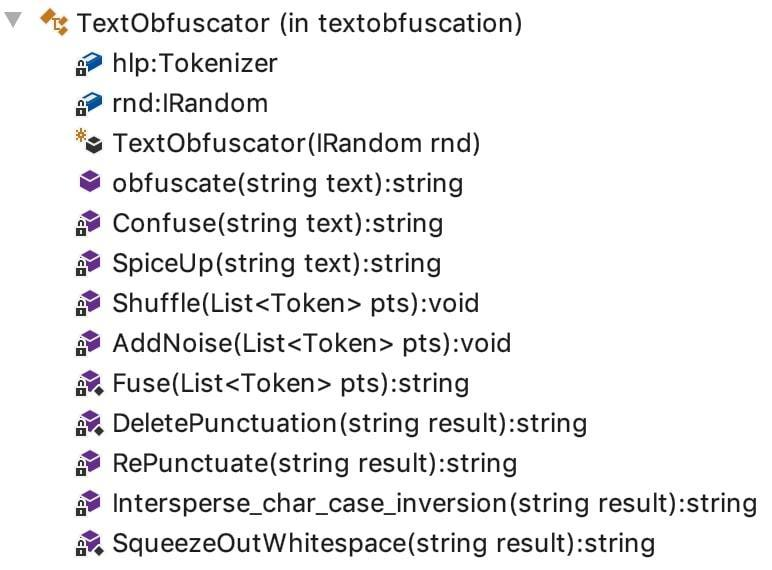

---

<!-- Page 304 of 493 -->

09-Test-firstrefaktorisieren 295
1 private void Shuffle(List<Token> pts) {
2 for (int i = 0; i < pts.Count; i++) {
3 if (pts[i].Type == TokenType.WORD
4 && _rnd.NextDouble() < 0.2) {
5 if (i + 2 < pts.Count) {
6 var t = pts[i];
7 pts[i] = pts[i + 2];
8 pts[i + 2] = t;
9 }
10 }
11 }
12 }
Die sind jetzt allerdings so klein, dass das vielleicht auch nicht mehr
so schlimm ist. Im Notall kann die Logik mit Gerüsttests gezielt testbar
gemacht werden.
Aber wenn du willst, kannst du auch hier noch liebevoll weiter säubern
im Kleinen. Zum Beispiel könnte das Mischen so aussehen:
1 private void Shuffle(List<Token> tokens) {
2 for (var i = 0; i < tokens.Count; i++)
3 if (Time_to_shuffle(i))
4 Swap(i);
5
6
7 bool Time_to_shuffle(int i)
8 => tokens[i].Type == TokenType.WORD
9 && _rnd.NextDouble() < 0.2
10 && i + 2 < tokens.Count;
11
12 void Swap(int i) {
13 var t = tokens[i];
14 tokens[i] = tokens[i + 2];
15 tokens[i + 2] = t;
16 }
17 }
Refactor to Modules
Die Zahl der Methoden ist durch die Extraktion stark gewachsen, insbe-
sondere wenn du auch noch die Operationen weiter poliert hast wie oben
beispielhaft gezeigt und keine lokalen Methoden in deiner Sprache zur
Verfügung hast.
Solche Vervielfältigung war aber auch Zweck der Refaktorisierung: mehr
und kleinere Methoden bieten mehr Testbarkeit und mehr Anhaltspunkte
für das Verständnis. Jede Funktion ist eine grundsätzlich testbare Bedeu-
tungseinheit.
Andererseits sind schon 10 Methoden in TextObfuscator eine ganze
Menge. In der Projektstruktur tauchen sie gar nicht auf und in der Struk-
turübersicht der Klasse wie oben im Bild stehen sie einfach untereinander.
Das ist nicht so hilfreich.

---

<!-- Page 305 of 493 -->

09-Test-firstrefaktorisieren 296
Die Frage ist deshalb, wie weitere Struktur in diese Masse eingezogen
werden kann. Weitere Funktionen helfen sicherlich nicht. Es muss etwas
anderes sein: Module.
Wo Funktionen integrieren, da aggregieren Module. Wo Funktionen neue
Leistung aus Verschiedenem komponieren, da fassen Module Ähnliches
unter einem gemeinsamen Zweck zusammen.
Welchen Modulen - hier: Klassen - können die vorhandenen Funktionen
sinnvoll zugeordnet werden? Passen sie zu vorhandenen Klassen oder
braucht es neue?
Mit Datenklassen gegen die Primitive Obsession
Eine Heimat für Logik können Datenklassen sein, d.h. Klassen, deren Job
es ist, Daten zu enthalten bzw. (Teil von) Datenstrukturen zu sein. Solche
Klassen sollten zwar nur minimale Logik beherbergen zum Zwecke der
Konsistenzsicherung und des Zugriffs - nichtsdestotrotz sind sie valide
Ziele, um dorthin Funktionen zu verschieben. Zu sehr auf primitive
Datentypen zu setzen und die Logik nur in Serviceklassen zu sammeln,
würde Modularisierungspotenzial verschenken.
Vorsicht allerdings: Um dem IOSP gerecht zu werden, sollte nicht nur die
Logik in Datenklassen schmal gehalten werden, sondern ihnen auch keine
Abhängigkeit von Ressourcen aufgehalst werden^keineadapter]
Das ist relevant für das hiesige Beispiele, weil damit von vornherein die
Funktionen aus dem Rennen sind, in denen der Zufall eine Rolle spielt.
Ihre Logik ist kein Kandidat für Datenklassen.
Aber welche Datenklassen gibt es überhaupt im Beispiel? Der Ancient
Code enthielt nur TextPart - jetzt Token - als Klasse, auf die die Be-
zeichnung zutrifft. Deren Objekte werden von Tokenizer als Collection
zur Verarbeitung an die Obfuskation geliefert. Diese Collection kann auch
noch als Datenklasse angenommen werden, auch wenn sie nicht mit einer
eigenen Klasse ausgeprägt wurde, sondern bisher eine generische Liste ist.
Nur innerhalb der ersten Phase, die den Text “in Konfusion stürzen” soll,
spielt Token eine Rolle. Kandidatenlogik für eine Verschiebung in die
Richtung der Datenklasse ist daher wohl beschränkt auf die Funktionen
Shuffle(), AddNoise() und Fuse().

---

<!-- Page 306 of 493 -->

09-Test-firstrefaktorisieren 297
Die ersten beiden Funktionen enthalten allerdings ein Zufallselement und
fallendamitaus.Fuse()hingegenistdeterministisch,beziehtsichjedoch
auf die Collection von Tokens. Dasselbe gilt für Swap() innerhalb von
Shuffle(). Diese Teillogik einer Funktion ließe sich auch herausziehen.
Und bei genauerem Hinsehen findet sich auch in AddNoise() Logik, die
nichts mit dem Zufall zu tun hat: grün ist dertministisch, orange ist nicht
deterministisch.
Der grüne Code kann der Collection zugeschlagen werden:
In Summe lassen sich also zwei Funktionen komplett auf die Collection
auslagern und zusätzlich noch etwas Logik aus einer anderen. Es entsteht
eine neue Datenklasse für eine Menge von Tokens:
1 class Tokens
2 {
3 private readonly List<Token> _tokens;
4 public Tokens(IEnumerable<Token> tokens) {
5 _tokens = tokens.ToList();
6 }
7
8 public Token this[int index] => _tokens[index];
9
10 public void Swap(int i, int j) {
11 var t = _tokens[i];
12 _tokens[i] = _tokens[j];
13 _tokens[j] = t;
14 }
15
16 public void Insert(int index, params Token[] tokens) {
17 for (var i = 0; i < tokens.Length; i++)
18 _tokens.Insert(index+i, tokens[i]);
19 }
20
21 public int Count => _tokens.Count;
22
23 public override string ToString() {
24 string text = "";
25 foreach (var t in _tokens) {
26 text += t.Text;
27 }
28 return text;
29 }
30 }

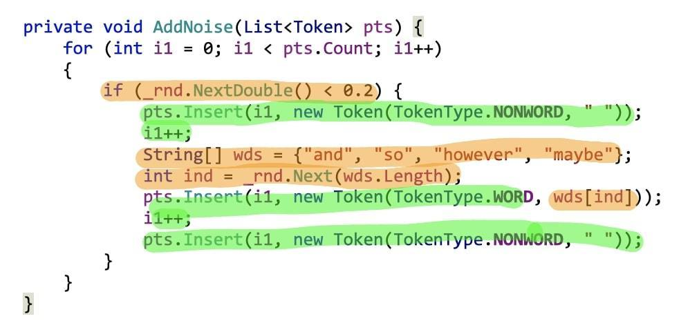

---

<!-- Page 307 of 493 -->

09-Test-firstrefaktorisieren 298
Durch ihre Einfühung als Ergebnis der Analyse muss zwar ein Modultest
für Tokenizer angepasst werden, doch das ist einfach. Der Eingriff in
die Modulstruktur ist grundsätzlich und lohnend, weil er Datenklassen
aufwertet.DenModultestanzupassen,stattwegzuwerfen,scheintdeshalb
gerechtfertigt.
Die Logik nach Tokens zu bewegen war trivial:
• Fuse() ist komplett zu ToString() geworden.
• Swap() ist erhalten geblieben, hat allerdings einen zweiten Para-
meter gewonnen. Das ist gut so, weil die Logik i+2 für j ein Detail
von Shuffle() ist.
• Insert() gab es so vorher nicht, steht nun aber für die Verallge-
meinerung dessen, was bisher in AddNoise() in getrennten Ein-
zelschritten getan wurde (siehe grüne Abschnitte in der vorherigen
Einfärbung).
Der TextObfuscator ist damit um Funktionen leichter geworden und
die Logik in zwei Funktionen fokussierter, verständlicher:
1 private void Shuffle(Tokens tokens) {
2 for (var i = 0; i < tokens.Count; i++)
3 if (Time_to_shuffle(i))
4 tokens.Swap(i, i+2);
5
6 bool Time_to_shuffle(int i)
7 => tokens[i].Type == TokenType.WORD
8 && _rnd.NextDouble() < 0.2
9 && i + 2 < tokens.Count;
10 }
11
12 private void AddNoise(Tokens tokens) {
13 string[] NOISE_WORDS = {"and", "so", "however", "maybe"};
14
15 for (int i = 0; i < tokens.Count; i++) {
16 if (!(_rnd.NextDouble() < 0.2)) continue;
17 tokens.Insert(i,
18 new Token(TokenType.NONWORD, " "),
19 new Token(TokenType.WORD, NOISE_WORDS[_rnd.Next(NOISE_WORDS.Length)]),
20 new Token(TokenType.NONWORD, " "));
21 i += 2;
22 }
23 }
In der zweiten Phase arbeitet die Obfuskation auf einer Zeichenkette.
Auch dort ist wieder der Zufall im Spiel. Lässt sich dafür ebenfalls eine
Datenklasse definieren zur Aufnahme von Logik?

---

<!-- Page 308 of 493 -->

09-Test-firstrefaktorisieren 299
Für eine Antwort sind die Funktionen der Phase näher anzuschauen und
besser zu verstehen. Das gelingt nur durch eine Vielzahl von Mikrorefak-
torisierungen über dem Sicherheitsnetz des Characterization Tests: Varia-
blen werden umbenannt, um ihre Bedeutung in der Logik der Funktionen
klarer zu machen; Anweisungen werden umgruppiert, um Kohäsion zu
betonen; Passagen werden ausgelagert in “Hilfsfunktionen”, um verblei-
bende Logik zuzuspitzen.
StattmitSchaufelundSpitzhackeHinterlassenschafteneinervergangenen
Zivilisation freizulegen - wie vielleicht die Extraktion der Funktionen
verstanden werden kann -, sind diese kleinsten Schritte eher eine Arbeit
mit dem Pinsel an einer schon gehobenen Skulptur.
Das Ergebnis lässt sich aber sehen: Verwirrende Schachtelungen in Schlei-
fen sind geglättet. Dank sei modernen Sprachfeatures aus der Funktio-
nalen Programmierung, mit denen in der Tiefe Gestaffeltes leicht in
Sequenzen gebracht werden kann.
1 private static string DeletePunctuation(string text)
2 => Regex.Replace(text, "[\\\\?!-\\\\.,:;'\\\\(\\\\)]", "");
3
4 private string Intersperse_char_case_inversion(string text) {
5 return new string(text.Select(MaybeInvertCase).ToArray());
6
7 char MaybeInvertCase(char ch)
8 => _rnd.NextDouble() < 0.3 ? InvertCase(ch) : ch;
9 char InvertCase(char ch)
10 => char.IsLower(ch) ? char.ToUpper(ch) : char.ToLower(ch);
11 }
12
13 private string RePunctuate(string text) {
14 var nonwhitespaceBlocks = text.Split(' ');
15 var blocks = Separate_by_punctuation_or_whitespace();
16 return string.Join("", blocks);
17
18 IEnumerable<string> Separate_by_punctuation_or_whitespace()
19 => nonwhitespaceBlocks
20 .Take(nonwhitespaceBlocks.Length - 1)
21 .SelectMany(block => new[] {block, Punctuation_or_whitespace()})
22 .Concat(new[] {nonwhitespaceBlocks[nonwhitespaceBlocks.Length - 1]});
23
24 string Punctuation_or_whitespace() {
25 if (!(_rnd.NextDouble() < 0.5)) return " ";
26
27 var LIMITED_PUNCTUATION = new[]{".", ",", "!"};
28 return LIMITED_PUNCTUATION[_rnd.Next(LIMITED_PUNCTUATION.Length)];
29 }
30 }
31
32 private static string SqueezeOutWhitespace(string text)
33 => text.Replace(" ", "");
Der Code ist ordentlicher, weil die Logik in nochmals kleinere Funktionen
geteil werden konnte, die mehr Bedeutung vermitteln und leichter testbar
sind.PotenzialfüreineweitereDatenklassehatsichdabeiallerdingsnicht
recht abgezeichnet.

---

<!-- Page 309 of 493 -->

09-Test-firstrefaktorisieren 300
Reflexion
Oder empfindest du den Code nicht als ordentlicher, also verständlicher
und testbarer? Das kann gut sein. Denn, wie schon gesagt, ist Ordnung
subjektivundrelativ.WersichmiteinerRefaktorisierungnichtsointensiv
beschäftigt hat wie der, der refaktorisiert, ist vom Ergebnis womöglich
nichtso überzeugt, wie der Autor.Das lässt sich nicht vermeiden. Deshalb
geht es hier in meiner Demonstration nicht darum, dass der Code genau
so hinterher aussehen sollte, sondern um grundsätzliche Schritte, die dich
von einem schlechteren zu einem besseren Zustand führen.
Code muss wie eine Gegend erkundet werden. Sich heimisch fühlen, ist
ein Prozess der Aneignung. Das braucht Mühe und Zeit. Besser gelingt
das mit einem Führer. Besser gelingt das auch durch gestaltende Eingriffe,
sozusagen eine Landnahme. Wer refaktorisiert, macht sich Code insofern
zu eigen. Wer nur zuschaut, bleibt Außenseiter.
Insofern muss eine Darstellung wie hier hinter dem Möglichen und
auch deinen Erwartungen zurückbleiben. Umso mehr, je passiver du bist.
Deshalb sind die Übungsaufgaben so wichtig.
Entscheidend ist weniger das statische Bild von Code, was dir als verbes-
sert präsentiert wird. Selbst wenn es objektive Kriterien gibt, mit denen
ich versuche, ein solches Urteil zu begründen. Etwas anderes ist viel
wichtiger: der Prozess. Dass es nämlich einen Prozess gibt, mit dem du
von weniger ordentlichem, weniger testbarem Code zu ordentlicherem
und testbarerem kommst. Die Prozessschritte überhaupt zu durchlaufen
und eine Veränderung zu sehen, will ich dir hier vermitteln. Das Ergebnis,
mit dem du nach deiner selbst durchgeführten Refaktorisierung zufrieden
bist, kann ganz anders aussehen.
Trotz einer Bandbreite, in der sich am Ende insbesondere Ordnung mit
Aspekten wie Lesbarkeit, Übersichtlichkeit oder Abstraktionsniveau be-
wegt, solltest du darauf achten, für deine Entscheidungen Begründungen
parat zu haben. Warum ist etwas für dich ordentlicher oder ordentlich
genug?Ziehedichnichtzufrühaufein“Geschmacksurteil”zurück.Damit
kommst du insbesondere bei der Arbeit im Team nicht weit. Wenn alle
sich immer nur auf Geschmäcker berufen, ist das Risiko für schwelende
Konflikte groß.
Zumindest sollte dann eine gemeinsame Arbeit am Geschmack stattfin-
den, um ihn anzugleichen. Clean Code Development ist insofern eine

---

<!-- Page 310 of 493 -->

09-Test-firstrefaktorisieren 301
ästhetische Schulung ausgehend von Argumenten basierend auf aner-
kannten Prinzipien.
Mit Serviceklassen für mehr Testbarkeit
Logik transformiert Daten. Serviceklassen arbeiten mit Datenklassen -
zumindest in objektorientierten Sprachen. Daten bearbeiten und Daten
sein sind zwei sehr grundsätzliche Verantwortlichkeiten, weil zu beiden
ganz unterschiedliche Entscheidungen gehören. Selbstverständlich gibt es
eine Schnittstelle zwischen beiden Welten: wenn Serviceklassen mit Da-
tenklassen arbeiten sollen, dann muss es eine Einigung zwischen beiden
geben, einen Kontrakt. Das ändert aber nichts an der Verschiedenheit der
Sphären.
Wenn der refaktorisierte Code nichts mehr hergibt in Bezug auf Daten-
klassen, dann wende deinen Blick den Serviceklassen zu. Wie kannst du
durch Extraktion von Funktionen in weitere Klassen die Testbarkeit und
Verständlichkeit erhöhen?
Der Tokenizer ist schon fokussiert in seiner Funktionalität und sehr
überschaubar; dort etwas zu extrahieren, scheint nicht lohnenswert. Aber
der TextObfuscator ist immer noch umfangreich.

---

<!-- Page 311 of 493 -->

09-Test-firstrefaktorisieren 302
InihmsindzweiformaleVerantwortlichkeitenvereint:Integrationund(1)
und Operation (2). Und die fachliche Verantwortlichkeit in Bezug auf den
Zweck der Klasse wird durchobfuscate() nach außen repräsentiert (3).
Die Entscheidungen dafür, was Obfuskation bedeutet, dass sie einerseits
Abschnitte eines Textes “durcheinanderbringt” (4) und andererseits auf
Zeichenebene verrauscht (5), repräsentieren wiederum zwei Funktionen,
die weitere Details verbergen.
Ist all das zurecht in einer Klasse zusammengefasst und sollte dort ver-
bleiben, weil die Kohäsion zwischen den Aspekten der Obfuskation groß
ist? Oder gibt es Linien, an denen das Ganze in Teile zerbrochen werden
sollte?
Auch hier ist das Urteil wieder subjektiv. Prinzipien können nur beratend
zur Seite stehen.
• Das IOSP legt keine weitere Aufteilung nahe. Aus seiner Sicht ist
TextObfuscator eine operierende Klasse und könnte das auch
bleiben.

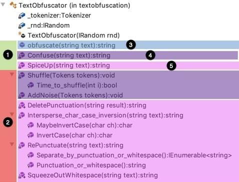

---

<!-- Page 312 of 493 -->

09-Test-firstrefaktorisieren 303
• Vom Standpunkt des SRP aus gesehen ist die Vereinigung von zwei
Teilverantwortlichkeiten noch keine große Sache. Inobfuscate()
ist das sehr übersichtlich als Integration gemacht.
• Die Testbarkeit dieser Verantwortlichkeiten jedoch, die beide vom
Zufall abhängig sind, ist nicht gegeben. Beide basieren auf einiger
Logik, die auch noch nichts miteinander zu tun hat. Es gibt keine
Schnittmenge zwischen den Funktionsbäumen von Confuse()
und SpiceUp(), die die Obfuskationsphasen repräsentieren.
Die Unabhängigkeit der Phasen und die alleinige Zugehörigkeit von
Tokenizer zur ersten scheinen nun aber doch ein Zerbrechen des
Ganzennahezulegen:fürbessereDokumentationdessen,wasObfuskation
bedeutet, und für bessere Testbarkeit. Ja, immer wieder ist Testbarkeit ein
wesentlicher Treiber.
Die Extraktion der Logik für die zwei Phasen kann in zwei Schritten
verlaufen. Zuerst wird Confuse() mit den zugehörigen Methoden aus-
gelagert.
1 class Confusion
2 {
3 private readonly Tokenizer _tokenizer;
4 private readonly IRandom _rnd;
5
6 public Confusion(IRandom rnd) {
7 this._tokenizer = new Tokenizer();
8 _rnd = rnd;
9 }
10
11 public string Create(string text) {
12 var tokens = _tokenizer.analyze(text);
13 Shuffle(tokens);
14 AddNoise(tokens);
15 return tokens.ToString();
16 }
17 ...
18 }
Da nun ein Klassenname gefunden werden muss, der zum Zweck passt,
ändert sich der Methodenname. Wenn es um Konfusion geht, sollte die
Klasse so heißen - Confusion - und eine Methode sollte sie erzeugen -
Create().

---

<!-- Page 313 of 493 -->

09-Test-firstrefaktorisieren 304
1 public class TextObfuscator {
2 private readonly IRandom _rnd;
3 private readonly Confusion _confusion;
4
5 public TextObfuscator(IRandom rnd) {
6 this._rnd = rnd;
7 _confusion = new Confusion(rnd);
8 }
9
10 public String obfuscate(String text) {
11 text = _confusion.Create(text);
12 return SpiceUp(text);
13 }
14 ...
Wenn es nun aber um Erzeugung geht, könntest du auf den Gedanken
kommen, dafür die Erzeugungsmethode der Klasse zu benutzen. Ist der
Konstruktor nicht prädestiniert dafür, allemal, da die Klasse ohnehin nur
eine öffentliche Methode hat? Das könnte so aussehen:
1 class ConfusedString
2 {
3 private readonly Tokenizer _tokenizer;
4 private readonly IRandom _rnd;
5 private readonly string _text;
6
7 public ConfusedString(IRandom rnd, string text) {
8 this._tokenizer = new Tokenizer();
9 _rnd = rnd;
10 _text = text;
11 }
12
13 public override string ToString() {
14 var tokens = _tokenizer.analyze(_text);
15 Shuffle(tokens);
16 AddNoise(tokens);
17 return tokens.ToString();
18 }
19 ...
20 }
21 ...
22 public String obfuscate(String text) {
23 return SpiceUp(new ConfusedString(_rnd, text).ToString());
24 }
Die Elegant Objects¹⁰⁴ Schule der Objektorientierung würde das wahr-
scheinlich auch favorisieren - doch sprechen SRP bzw. SLA dagegen:
• Im Konstruktor von ConfusedString würden zwei Verantwort-
lichkeiten vermischt: eine technische und eine inhaltliche. Das Ob-
jekt würde initialisiert mit einer Ressourcenabhängigkeit und dem
zu verarbeitenden Text. Das eine oder das anderewäreverständlich
- aber beides zusammen?
¹⁰⁴https://www.elegantobjects.org/

---

<!-- Page 314 of 493 -->

09-Test-firstrefaktorisieren 305
• Der Zufallszahlengenerator als technisches Detail liegt auf einem
anderenAbstraktionsniveaualsderTextalsDomänendatenbestand-
teil. Beides nebeneinander zu sehen in der Parameterliste des Kon-
struktors, ist verwirrend.
Gegen die Einführung solcher Art spezialisierter Datentypen spricht
grundsätzlich nichts - ein ConfusedString ist sehr viel spezieller als
einstring-,dochsolltezumindestvermiedenwerden,denvonweiteren
Services und vor allem Ressourcen abhängig zu machen.
DerzweiteRefaktorisierungsschrittgiltderWürzungdeskonfusenTextes.
Die Extraktion der zugehörigen Methoden ist ebenfalls trivial:
1 class Spices
2 {
3 private readonly IRandom _rnd;
4
5 public Spices(IRandom rnd) {
6 _rnd = rnd;
7 }
8
9 public string Add(string text) {
10 text = DeletePunctuation(text);
11 text = RePunctuate(text);
12 text = Intersperse_char_case_inversion(text);
13 return SqueezeOutWhitespace(text);
14 }
15 ...
Der Obfuskator selbst schrumpft damit auf wenige Zeilen:
1 public class TextObfuscator {
2 private readonly Confusion _confusion;
3 private readonly Spices _spices;
4
5 public TextObfuscator(IRandom rnd) {
6 _confusion = new Confusion(rnd);
7 _spices = new Spices(rnd);
8 }
9
10 public String obfuscate(String text) {
11 text = _confusion.Create(text);
12 return _spices.Add(text);
13 }
14 }
Die Instanziierung der Objekte für die Phasen findet jedoch weiterhin
im Konstruktor statt, um diesen Aspekt getrennt zur halten von der
Verhaltenserzeugung.
Du siehst, es gibt einige sehr formale, technische Verantwortlichkeiten,
die schon zu einer Grundstruktur von Code führen sollten, wenn man das
Separation of Concerns (SoC)¹⁰⁵ Prinzip ernst nimmt:
¹⁰⁵https://en.wikipedia.org/wiki/Separation_of_concerns

---

<!-- Page 315 of 493 -->

09-Test-firstrefaktorisieren 306
• Konstruktion vs Verhalten
• Integration vs Operation
• Service vs Daten
• Kern vs Peripherie
AbundankommtesdabeizuVermischungen,dochdasprinzipielleSollen
zeigt in Richtung Trennung: Jedes Code-Strukturelement - Funktion oder
Modul - soll sich auf eine formale Verantwortlichkeit konzentrieren.
Nach dieser Refaktorisierung ist TextObfuscator eine integrierende
Serviceklasse. Formal und inhaltlich ist sie sehr konzentriert. Die Daten,
die sie hat, sind nur Optimierungen, um die Belange Konstruktion und
Verhalten zu trennen. Ansonsten gehört Datenhaltung oder gar Daten zu
sein nicht zur Verantwortlichkeit von TextObfuscator.
DieextrahiertenKlassenfürdieObfuskationsphasenkönntennunseparat
unter Test gestellt werden mit Modultests. Das lohnt aber wohl erst,
wenn an ihnen konkret etwas verändert werden soll. Ebenso wäre eine
Dynamisierung der Abhängigkeiten möglich - aber derzeit nicht nötig.
Flexibilisierung ist auch eine Optimierung, die ohne spürbare Not nicht
vorgenommen werden sollte.
Dokumentieren
Ist nach Umstrukturierung, Umbenennung und Einrichtung von Tests
alles getan bei der Refaktorisierung? Nein. Denn Code leidet trotz all
diesem guten Willen ganz fundamental unter Bedeutungsarmut. Code
kann sich nur begrenzt selbst erklären; aus ihm lässt sich keine Antwort
auf die Frage “Warum?” ablesen. Und was er selbst erklärt, ist womöglich
immer noch nicht leicht zu verstehen, weil Bedeutungseinheiten aus
prinzipiellen Gründen auseinandergezogen wurden. Was für die Testbar-
keit und Veränderbarkeit wichtig ist, kann für das Verständnis durchaus
abträglich sein.
Deshalb sei dir empfohlen, spätestens am Ende zu überlegen, ob du
deine auf der Refaktorisierungsreise gewonnenen Einsichten explizit do-
kumentierst. Vielleicht hast du schon unterwegs hier und da Kommentare
hinterlassen, wo ein Variablen- oder Funktionsname nicht genug war, um
zu erklären, was da im Code passiert.

---

<!-- Page 316 of 493 -->

09-Test-firstrefaktorisieren 307
Darüber hinaus kannst du für ein S2R aber auch einen zentralen Ort su-
chen,woduesalsGanzesmiteinerzusammenhängendenDokumentation
versiehst. Hier ein Beispiel im Code. Aber es könnte auch eine Seite in
einem Wiki sein.
TextObfuscator ist die Wurzelklasse des S2R, deshalb scheint dort eine
Erläuterung für all das, was dadurch integriert wird, angebracht.
Auch wenn eine solche Dokumentation in Teilen redundant ist, weil sich
darin Strukturen wiederholen, die es auch im Code gibt oder in Beispielen
auftauchen, die doch auch als Tests existieren könnten, hat sie Wert.
• Erstens zieht die Dokumentation Teile des Codes zusammen. An
einem Ort findet sich kompakt das zusammengefasst, was man
sich ansonsten über die Codebasis zusammensuchen muss. Die
Dokumentation kann sogar mit Referenzen auf Codeteile versehen
werden.
• Zweitenskannstduin“Prosa”Bedeutungentatsächlichbeschreiben
undnäherausführenundmitHintergrund versehen,du kannstalso
tiefer gehen, als ein Leser von Code es mit dem selben Zeitaufwand
direkt am Code schaffen würde.

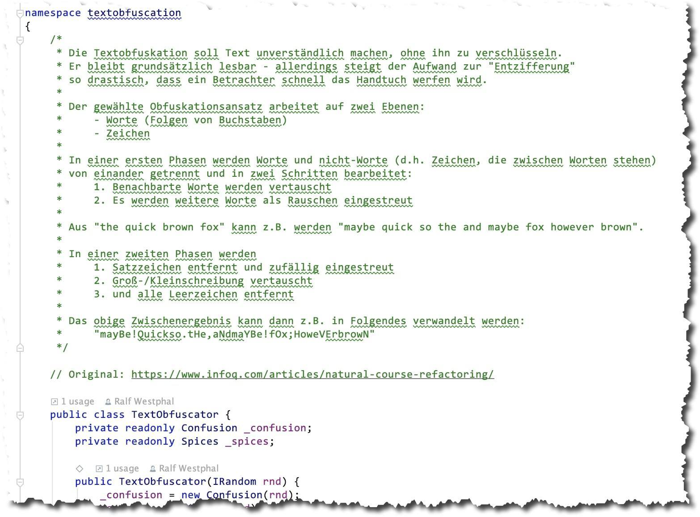

---

<!-- Page 317 of 493 -->

09-Test-firstrefaktorisieren 308
Gute Dokumentation erklärt, zieht zusammen, lässt weg, führt. Mit guter
Dokumentation ist Verständnis schneller aufgebaut, als durch bloßes
Codestudium.
Natürlich steckt die Wahrheit am Ende nur und ausschließlich im Code.
Dokumentation kann mit dieser Wahrheit aus dem Tritt kommen. Das
sprichtjedochnichtkategorialgegenDokumentation,sondernfürSorgfalt
beim Dokumentieren. Es ist die richtige Ebene zu finden, die einerseits
hilfreiche Information liefert, andererseits aber nicht zu viele Überschnei-
dungen mit Code aufweist.
Tests und Produktionscode sind gekoppelt, Dokumentation und Code
ebenfalls. Beides hat seinen Zweck im Sinne von Korrektheit und Ord-
nung. In beidem ist das rechte Maß zu finden.
Reflexion
Die finale Struktur der Obfuskation nach der Refaktorisierung:
Aus 3 Klassen sind 7 plus 1 Interface geworden. Die Logik ist von 2
Funktionen auf knapp 25 verteilt worden. Dazu kommt mindestens ein
Characterization Test.
Ist dieser Umbau ein Gewinn? Hat sich der Aufwand gelohnt? Ist das jetzt
die perfekte Struktur?

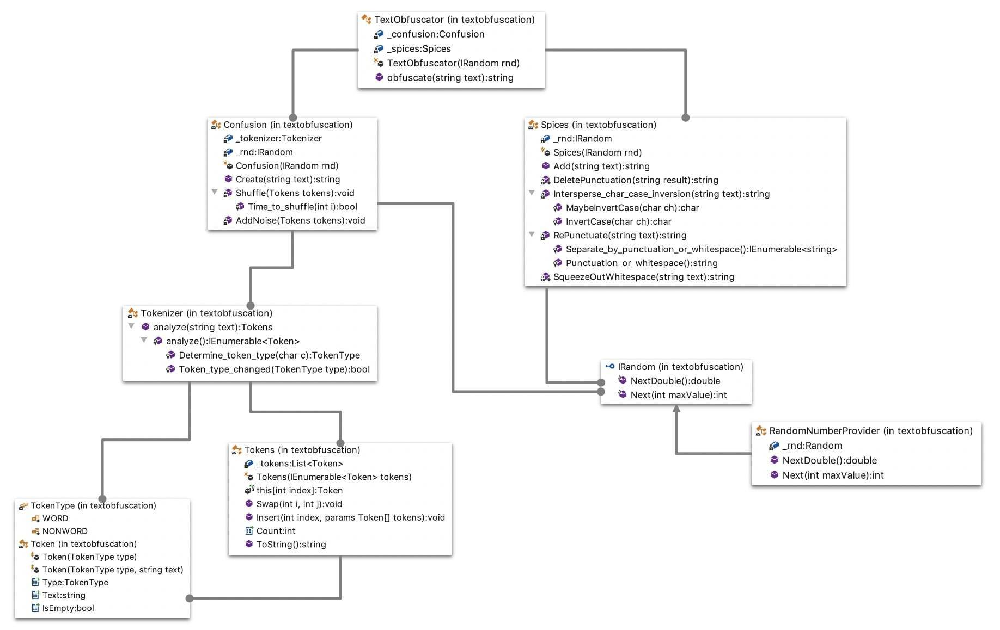

---

<!-- Page 318 of 493 -->

09-Test-firstrefaktorisieren 309
Erinnere dich, was am Anfang stand: Ancient Code. Der war ohne Test
und unverständlich.
Und was ist jetzt? Code mit Test und weiterer Testbarkeit. Aber vor allem
Verständnis.
Im Verständnis liegt der große Gewinn der Refaktorisierung. Das entsteht
vor allem im Kopf desjenigen, der die Refaktorisierung durchführt. Dass
der Code beim Aufbau des Verständnisses nicht nur gelesen wird, dass
durch den Code nicht auch noch vielleicht mit einem Debugger durchge-
schrittenwird,sonderndasserverändertwird,stelltdasgrößteHilfsmittel
für den Verständnisaufbau dar. Ein selbst entwickelter Test rundet das ab.
Refaktorisierung ist eine aktive Aneignung von Code wie das Schreiben
von Code. Der Autor von Code hat alles im Kopf in seinem mentalen
Modell und ist gar nicht so sehr auf sichtbare äußere Ordnung des Codes
angewiesen. Diesen Effekt kennst du bestimmt zur Genüge.
Wenn du aber nicht Autor von Code bist, wie baust du dir dann ein
mentales Modell auf? Solange du Code lediglich studierst, d.h. ihn lässt,
wie er ist und seine Struktur nicht veränderst, bist du darauf angewiesen,
dasselbe mentale Modell wie der Autor aufzubauen. Das ist aber maximal
schwierig, weil dein ganzer Erfahrungshorizont ein anderer ist, vor allem
wenn der Code keinen Ordnungsprinzipien folgt.
Je mehr Refaktorisierung du jedoch betreiben darfst, desto persönlicher
kann dein mentales Modell von Code sein. Und wenn du beim Refakto-
risieren anerkannte Prinzipien verfolgst, machst du es anderen einfacher,
zukünftig ihr mentales Modell vom Code zu generieren.
Das fällt dir leichter, wenn du die Refaktorisierung systematisch angehst.
Die hier verfolgten Schritte sind dafür eine gute Grundlage.
Zusammenfassung
Wenn du neugierig bist, schau dir jetzt einmal an, wie die Refaktori-
sierungsschritte bei der Quelle dieses Codebeispiels¹⁰⁶ aussehen. Findest
du Übereinstimmungen im Vorgehen oder Abweichungen? Sieht das
Ergebnis anders aus?
¹⁰⁶https://www.infoq.com/articles/natural-course-refactoring/

---

<!-- Page 319 of 493 -->

09-Test-firstrefaktorisieren 310
Wenn du Differenzen findest, wenn du selbst zu einem anderem Ergebnis
gekommen wärest, ist das für sich genommen nicht schlimm, sondern
natürlich und zu erwarten. Wesentlich ist, dass du vor Refaktorisierungen
die Angst verlierst. Jeder Zuwachs an Ordnung und Testbarkeit ist gut.
Bedeutungen von Logik wollen identifiziert und für sich genommen
zugänglich gemacht werden. Das sollte der Leitgedanke für dich bei der
Refaktorisierung sein.
WenndudirkeinenDruckmachenlässt,könnenRefaktorisierungensogar
Spaß machen. Sie haben das Zeug zu tiefer Befriedigung, weil du im
Refaktorisieren Ordnung herstellst.
Funktionale und nicht-funktionale Anforderungen zu erfüllen, ist die
ersteBefriedigungbeimProgrammieren.DabeiwollenesvieleEntwickler
belassen. Das ist ja auch naheliegend angesichts vorherrschender Anreiz-
strukturen in Projekten. Und dann das Gefühl der Kontrolle über die
Maschine…
Am Ende reicht es aber nicht aus, nur nach dieser Befriedigung zu
streben. Sie steht sich selbst eher früher als später im Weg. Deshalb ist
es vorteilhaft, wenn du lernst, auch aus dem Herstellen von Testbarkeit
und Ordnung Befriedigung zu ziehen. Du stellst dann kein Verhalten her,
aber du machst heutiges Verhalten empfänglich für die Anforderungen
von morgen. Lerne, das Gefühl von wachsender Klarheit zu schätzen!
Außerdem kannst du für dich Verständnis dabei erarbeiten, dass dich vor
anderenauszeichnet,dienochniesogenauhingeschautodermitihrerAu-
torenschaft weitergezogen sind und vergessen haben. Refaktorisierungen
können dich zu einem gefragten Experten machen!
Denk nur daran: Refaktorisierung braucht System!
• Test-first
• IOSP bzw. allgemein SoC
• Modularisierung bzw. allgemein SRP
• Dokumentation
Das sind die minimalen Bausteine eines solchen Systems. Woher du
die Inspiration nimmst, um damit Logik in diese oder jene Struktur zu
bringen… ob du dich dabei von Domain Driven Design (DDD) oder
Entwurfsmustern oder anderen Konzepten leiten lässt… das ist eine ganz

---

<!-- Page 320 of 493 -->

09-Test-firstrefaktorisieren 311
eigene Frage, die hier nicht näher thematisiert werden soll. In jedem Fall
ist ein Refaktorisierungsprozess die Grundlage.

---

<!-- Page 321 of 493 -->

09-Test-firstrefaktorisieren 312
Übungsaufgaben
Reflexionsaufgabe
Bitte formuliere eine Frage oder eine Erkenntnis zum Kapiteltext.
• Wo bist du gedanklich hängengeblieben, was ist dir unklar,
was passt für dich irgendwie nicht zusammen, wozu würdest
du dir noch etwas mehr Erklärung wünschen? Steht irgendet-
waszudeinerbisherigenPraxisimWiderspruchunddufragst
dich, warum du etwas ändern solltest?
• Oder: Wann hast du einen Aha-Moment gehabt, was ist
diralsbemerkenswert,spannend,ausprobierenswertaufgefal-
len? Hat irgendetwas “in dir Klick gemacht”, weil dir nun ein
Zusammenhang aufgegangen ist? Oder verstehst du jetzt aus
deiner bisherigen Praxis irgendetwas besser?
Am besten formulierst du Frage bzw. Erkenntnis schriftlich. Indem
du deine Gedanken aufschreibst, wirst du dir ihrer bewusster. Bei
einer Frage kommst du dadurch vielleicht schon einer Antwort aus
dir selbst heraus näher. Bei einer Erkenntnis fällt dir vielleicht schon
etwas ein, das du ab jetzt anders machen kannst.
Szenario
Es liegt ein Programm in Form von Ancient Code vor, das den
Inhalt beliebiger Dateien als Hex Dump auf der Console ausgibt. Ein
Anwendungsbeispiel sieht so aus und stammt aus der Quelle des
Codes, dem Buch “C# von Kopf bis Fuß”.

---

<!-- Page 322 of 493 -->

09-Test-firstrefaktorisieren 313
Deine Aufgabe ist es, den Code zu refaktorisieren. Halte dabei deine
Schritte mit Repo-Commits fest und arbeite auf einem separaten
Branch.
Ancient Code
1 using System;
2 using System.IO;
3 using System.Text;
4
5 namespace ancientcode
6 {
7 class MainClass
8 {
9 public static void Main (string[] args)
10 {
11 if (args.Length != 1) {
12 Console.Error.WriteLine ("Usage: hexdump <dateiname>");
13 Environment.Exit (1);
14 }
15
16 if (!File.Exists(args[0])) {
17 Console.Error.WriteLine("No such file: {0}", args[0]);
18 Environment.Exit(2);
19 }
20
21 using (var input = File.OpenRead (args [0])) {
22 int position = 0;
23 var buffer = new byte[16];
24
25 while (position < input.Length) {
26 var charsRead = input.Read (buffer, 0, buffer.Length);
27 if (charsRead > 0) {
28 Console.Write ("{0}: ", string.Format ("{0:x4}", position));
29 position += charsRead;
30
31 for (int i = 0; i < 16; i++) {
32 if (i < charsRead) {
33 var hex = string.Format ("{0:x2}", buffer [i]);
34 Console.Write (hex + " ");
35 } else {
36 Console.Write (" ");
37 }
38
39 if (i == 7) {

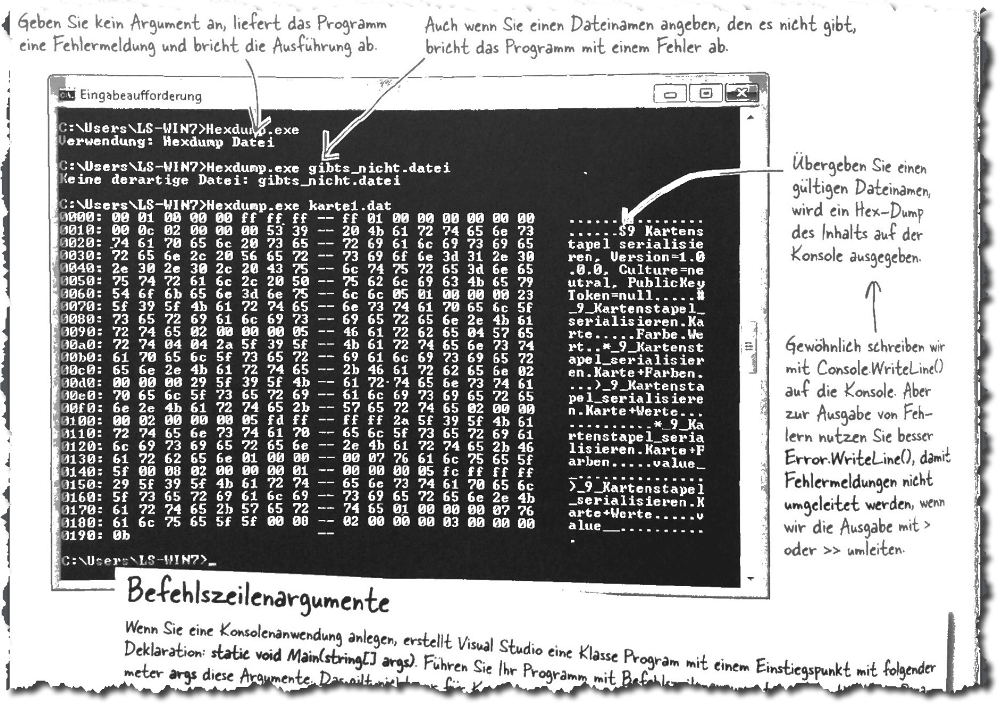

---

<!-- Page 323 of 493 -->

09-Test-firstrefaktorisieren 314
40 Console.Write ("-- ");
41 }
42
43 if (buffer [i] < 32 || buffer [i] > 250) {
44 buffer [i] = (byte)'.';
45 }
46 }
47
48 var bufferContent = Encoding.ASCII.GetString (buffer);
49 Console.WriteLine (" " + bufferContent.Substring (0, charsRead));
50 }
51 }
52 }
53 }
54 }
55 }
DukannstdenC#-Quelltext,Java-QuelltextundJavaScript-Quelltext
auch herunterladen.
TODO 1
Bringe so viel wie möglich Logik unter einen Characterization Test.
Hilfreich ist dafür eine Grobstruktur für das Programm wie in der
CSV-Übungsaufgabe (Kapitel 07) empfohlen.
• Wie definierst du den Entry Point?
• Welche Abhängigkeiten zu Ressourcen gibt es?
– Welche sollten dynamisch gestaltet und im Test durch
Surrogate ersetzt werden?
TODO 2
Färbe den Code nach Verantwortlichkeiten ein. Kannst du unter-
schiedliche Verantwortlichkeitsebenen erkennen?
Achtung: Sei nicht zu fein mit den Verantwortlichkeiten! Es sind
sicher mehr als 3, aber wohl weniger als 15.
TODO 3
Refaktorisiere die Logik gem. den identifizierten Verantwortlichkei-
ten nach IOSP.
Einsichten in die Bedeutung kannst du hier in Variablennamen und
Funktionsnamen festhalten.
TODO 4

---

<!-- Page 324 of 493 -->

09-Test-firstrefaktorisieren 315
Refaktorisiere die Funktionen in Module. Überlege, wo/ob es Sinn
macht, Datenklassen einzusetzen und sogar mit Funktionalität auf-
zuladen.
Visualisiere die finale Struktur mit einem Moduldiagramm.
TODO 5
Dokumentiere den Code mit einer Erklärungen zu Warum, Was und
grobem Wie, damit der nächste Betrachter des Codes an einem Ort
schnell einen Überblick gewinnen kann.
https://ccd-school.de/downloads/codingdojo/RefactoringKata-
Hexdump.pdf
https://gitlab.com/programming-with-ease-books/test-first-
codierung/-/blob/master/%C3%9Cbungsaufgaben%2009/hexdump.cs
https://gitlab.com/programming-with-ease-books/test-first-
codierung/-/blob/master/%C3%9Cbungsaufgaben%2009/hexdump.java
https://gitlab.com/programming-with-ease-books/test-first-
codierung/-/blob/6c9bd1bbc908dfec6d655d8bedf77d12655d1b40/%C3%
9Cbungsaufgaben%2009/hexdump.js

---

<!-- Page 325 of 493 -->

10 - Finale mit Testmatrix
Test-first Codierung, wie ich es dir hier vorgestellt habe, ist ein Weg, um
Lösungen für Problemstellungen unterschiedlichen Schwierigkeitsgrads
in Code umzusetzen, ohne die Qualitätsanforderungen Korrektheit und
Ordnung zu vernachlässigen.
Test-first Codierung ist insofern anders als classical TDD, als das es nicht
auf nur eine Vorgehensweise setzt, sondern verschiedene in sich vereinigt.
EsisteineklektischesVorgehen.EswilldireineGangschaltunggeben,mit
der du Problemberge mit ganz verschiedener Steilheit erfahren kannst.
Der Ansatz von cTDD ist gut - wo er passt. Nur passt er eben nicht
überall. Deshalb hast du eine differenziertere Sichtweise kennengelernt,
wie Probleme unterschieden und spezifisch angegangen werden können:
Die grundsätzlichste Trennlinie verläuft zwischen Problemen, für deren
Lösung du keine Akzeptanzkriterien formulieren kannst, und allen ande-
ren.

---

<!-- Page 326 of 493 -->

10-FinalemitTestmatrix 317
Ein Testfallbeschreibt die gewünschte Leistung “in der Tiefe”, eine Funkti-
onssignatur beschreibt die Oberfläche des Leistungsanbieters, der Lösung.
Solange beides nicht vorliegt, befindest du dich im Chaos.
Diesseits dieser sehr pauschalen, aber auch klaren Linie, sind Probleme
deshalb allerdings noch nicht aus gleichem Holz geschnitzt:
• für triviale Probleme schreibst du die Lösung einfach hin,
• für einfache Probleme arbeitest du dich an die Lösung in kleinen
Test-Schritten heran.
Beides findet im Produktionscode statt, unter dem du zumindest einen
Akzeptanztest gespannt hat.
• Für komplizierte Probleme nimmst du erstmal Abstand vom Pro-
duktionscode und überlegst dir, inwiefern du sie in triviale oder
einfache zerlegen kannst, wobei Logik nur in den Blättern des
Zerlegungsbaums vorkommen darf (IOSP).
Auch hier setzt du am Ende deine Lösung Teilproblem für Teilproblem
aber gleich im Produktionscode um.
• Doch falls es dir passiert, dass du “ganz unten” auf ein hartnäckig
schwieriges Problem bei der Zerlegung stößt, was weder einfach
noch trivial noch weiter zerlegbar ist… dann gehst du dieses ver-
bliebene Komplexität experimentell im Testcode an. Du setzt dich
in eine Sandkiste, in der du nichts kaputtmachen kannst, bis du
eine solide Lösung hast. Erst dann transferierst du die in den
Produktionscode.
Diese Kategorisierung ist dem Cynefin Modell¹⁰⁷ angelehnt:
¹⁰⁷https://en.wikipedia.org/wiki/Cynefin_framework

---

<!-- Page 327 of 493 -->

10-FinalemitTestmatrix 318
AuchwenndirdieKategorienalsGrenzziehungenineinerdunklenWolke
von Schwierigkeitsgraden vorgestellt wurden, um zu betonen, dass es kla-
re Kriterien braucht, die den verbliebenen Rest handhabbarer machen, ist
eine Übertragung auf das Cynefin Modell möglich und nun abschließend
auch angezeigt:

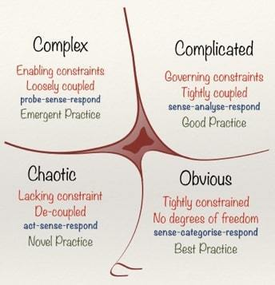

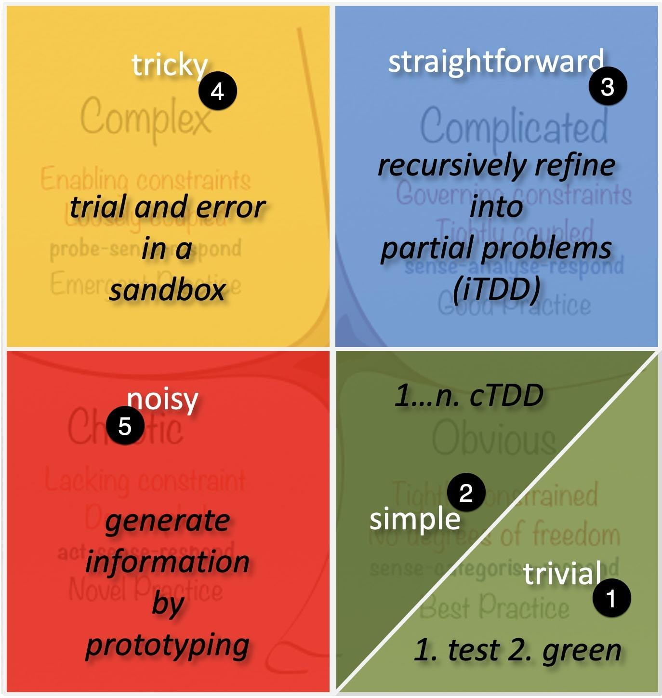

---

<!-- Page 328 of 493 -->

10-FinalemitTestmatrix 319
1. Triviale Probleme (trivial) löst du mit einem Test, dem du sofort
Produktionscode gegenüberstellst. Fertig. Der Test ist einfach grün.
Solche Probleme gibt es und dann musst du dich nicht weiter
bemühen, ein elaborierteres Vorgehen zu verfolgen.
2. Einfache Probleme (simple) löst du mit inkrementellen Tests. Bring
cTDD an den Start. red-green-refactor immer wieder im Kreis
ist passend. Zusammen mit den trivialen Problemen bilden die
einfachen die Kategorie der naheliegenden Probleme (obvious). Die
Lösung liegt einfach so nah, dass du sie geradlinig und im Produk-
tionscode angehen kannst.
3. Komplizierte Probleme sind immer noch geradlinig lösbar (straight-
forward), aber nicht sofort im Produktionscode. Hier wendest du
nicht cTDD an, sondern etwas, das ich mal iTDD (informed TDD)
genannt habe: Du informierst dich erstmal mit einem Plan/Modell
darüber, wie die Struktur deiner Lösung aussehen sollte. Du machst
dir Gedanken. Think before coding.
4. Komplexe Probleme sind tricky. Du arbeitest nicht im Produktions-
code, aber im Testcode, weil du schon ein Ziel vor Augen hast.
5. Im Chaos (noisy) siehst du das Problem und die Lösung nicht vor
lauter Rauschen. Hier musst du mit Macht Informationen sammeln,
umKlarheitzuschaffen.DazuwählstdueineUmgebung,diedirdas
möglichst einfach macht. Schon Tests können dabei behindern. Pro-
duktionscode ist tabu. Du stellst neben den Test-/Produktionscode
einen Prototypen; an dem kannst du herumschrauben, wie du
willst. Ganz ohne Ordnung und spezielle Korrektheitsmaßnahmen.
Vielleicht benutzt du dafür sogar eine andere Programmiersprache
als für den Produktionscode. Oder du arbeitest gar nicht mit Code,
sondern baust einen Papierprototypen¹⁰⁸.
Dieses Modell für die test-first Codierung schafft für dich Klarheit. Es
liefert dir Kriterien für die Wahl deines Ansatzes. Solange du noch kein
Meister im Programmieren bist, ist es gut, wenn du Guidelines hast, an
denen du dich orientieren kannst.
¹⁰⁸https://www.amazon.de/Paper-Prototyping-Interfaces-Interactive-Technologies-
ebook/dp/B006M86382

---

<!-- Page 329 of 493 -->

10-FinalemitTestmatrix 320
EsgibtProbleme,dielöstdusofortimProduktionscode…
…undesgibtProbleme,dalässtdubesserdieFingerwegvomProduktionscode.
Und wenn irgend möglich, solltest du test-first vorgehen, um Tests nicht zu vergessen und
die Oberfläche deines Produktionscode zu verbessern und überhaupt ein Sicherheitsnetz zu
spannend,überdemduarbeitest.

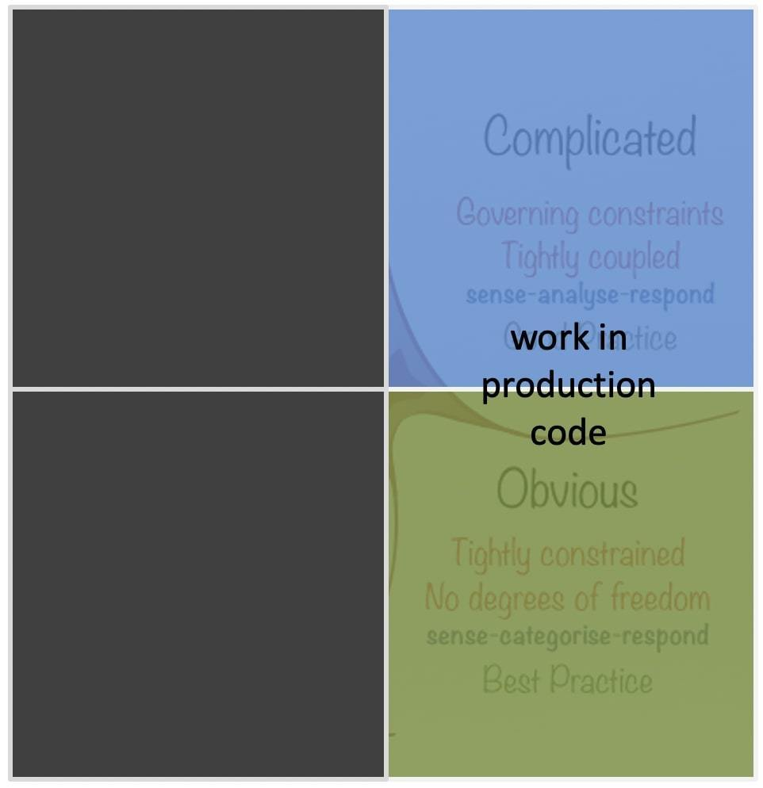

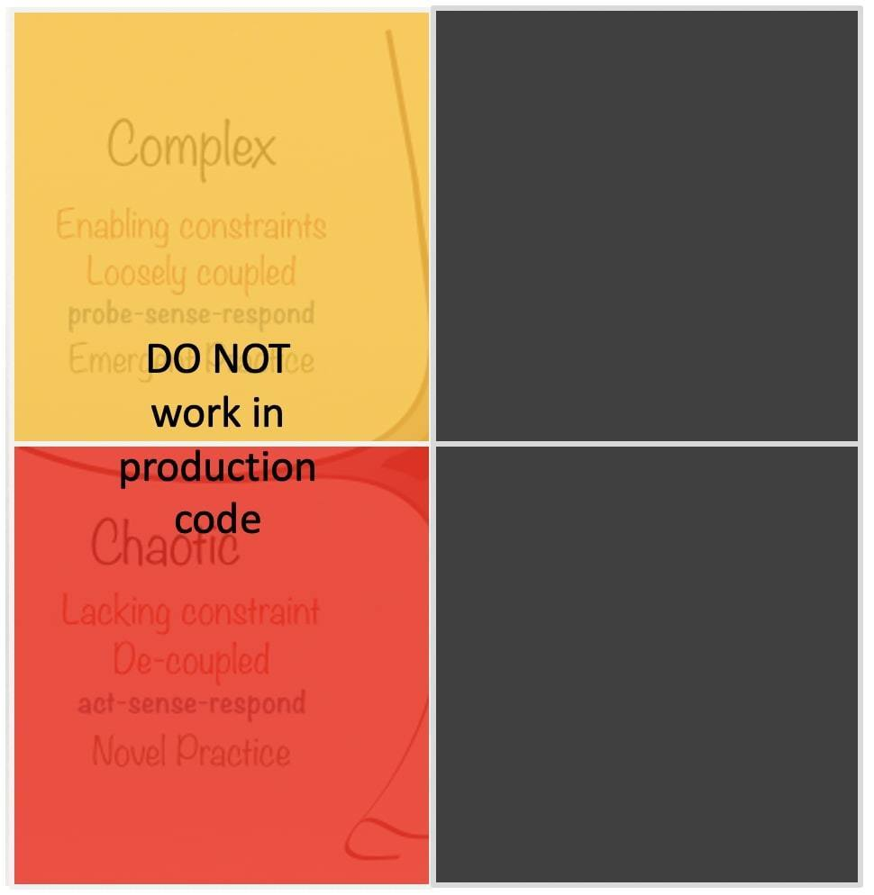

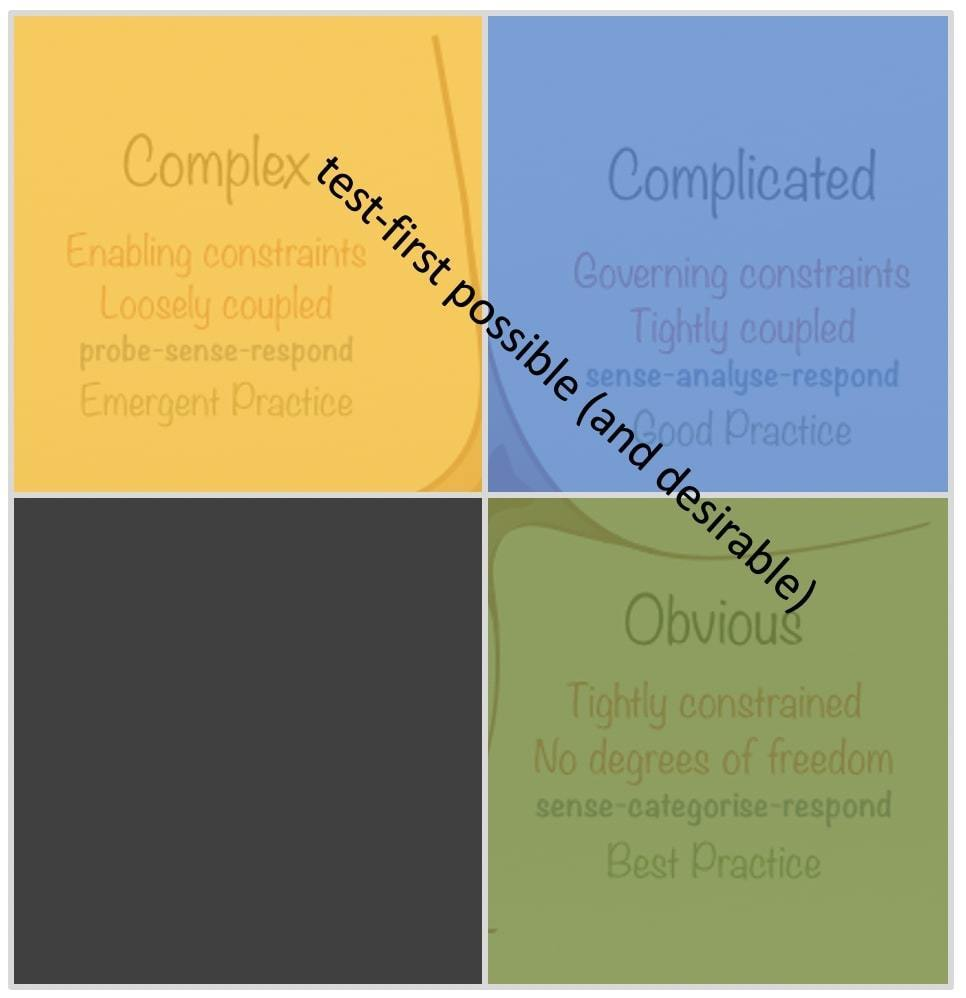

---

<!-- Page 330 of 493 -->

10-FinalemitTestmatrix 321
Diese Puzzleteile stehen aber nicht nur lose nebeneinander, sondern
bilden einen Zusammenhang. Für mich gibt es darin eine Reihenfolge.
Zusammen bilden die Ansätze ein Vorgehensmodell:
1. Beginne deinen Weg zur Codierung einer Lösung entweder mit
einem Akzeptanztest (1) - oder in Ahnungslosigkeit (1).
• Wenn du ohne Akzeptanztest ahnungslos bist, “gehe direkt
ins Chaos” und versuche mit einem Prototypen soviel Klar-
heit herzustellen, dass du zu einem Akzeptanztest und einer
Funktionssignatur kommst. Gehe dann wieder zu (1) zurück.
2. Mit einem Akzeptanztest nimm an, dass das Problem kompliziert
ist (2). Versuche es also in Teilprobleme zu zerlegen, die wiederum
noch kompliziert sind oder offensichtlich, d.h. einfach oder trivial
(3).
3. Am Ende der Zerlegung eines komplizierten Problems hast du vor
allem einfache und triviale Probleme konkret mit Code zu lösen.
Manchmal verschiebt sich dabei die Wahrnehmung des Schwierig-
keitsgrades allerdings. Was trivial erschien, ist doch “nur” einfach.
Und was einfach erschien, ist doch komplex.
4. Gelegentlich kommst du bei der Zerlegung (2) oder der Umsetzung
(3) darauf, dass die Lösung für ein Teilproblem doch auf der Hand
liegt. Du hast es zwar mit Tests umrissen, aber wie die Lösung
aussieht, ist dir einfach nicht recht klar. Dann weiche kurz auf

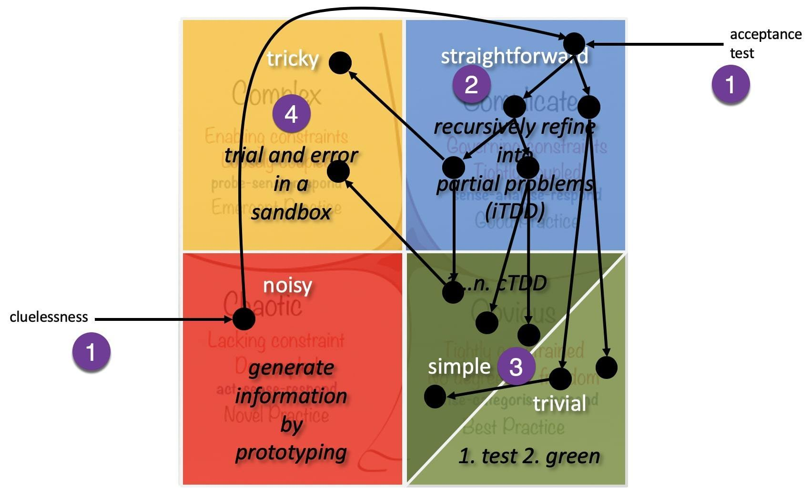

---

<!-- Page 331 of 493 -->

10-FinalemitTestmatrix 322
TDDaiymi (4) aus und löse das Problem mit trial-and-error in einer
Sandkiste.
Das Vorgehen soll hier möglichst linear aussehen. Du hast zwar den
einen oder den anderen Einstiegspunkt (1/kompliziert & 1/chaotisch),
doch eigentlich ist meine die Erfahrung, dass die meisten Probleme in der
Codierungkompliziertsind.NacheinemAkzeptanztestgehtesalsoweiter
mit der Zerlegung.
Diese Sichtweise steht der von cTDD entgegen. Nach dieser Kategorisie-
rung geht cTDD davon aus, dass Probleme vor allem einfach sind. Die
frustrierende Erfahrung vieler Entwickler ist jedoch, dass man mit dieser
Annahme oft, zu oft gegen eine Wand läuft oder das cTDD-Ergebnis
suboptimal ist. Deshalb lautet meine Annahme hier erstens anders, zwei-
tens betrachte ich Probleme differenziert nach Schwierigkeitsgraden und
drittens verorte ich in diesem Rahmen cTDD pragmatisch.
Genauso wie die Gänge beim Auto in einer Reihenfolge stehen, ihre
Benutzung während der Fahrt hingegen nur sehr begrenzt geradlinig in
dieser Reihenfolge verläuft, ist es bei der Reihenfolge der Nutzung der
Problemlösungsansätze.
Es geht nicht darum, dass du sie versuchst, konsequent in der Reihenfolge
zu durchlaufen. Zwar startest du bei (1) und “schaltest hoch” auf (2)
und dann hoffentlich höher auf (3) - doch es kann auch anders kommen.
Während du codierst, wechselst du in realen Szenarien immer wieder den
Ansatz und gehst von (3) zurück zu (2) oder springst zu (4) oder gar für
einen Moment ins Chaos, um dann zu (2) zu gehen oder zurück zu (4) und
dann wieder (2) und (3) und immer so weiter.
Die Linearität soll nur für den Anfang eine Verständnishilfe sein. Für
die Praxis sollst du dich in allen Gängen wohlfühlen und zwischen
ihnen flüssig nach Bedarf schalten. Achte nur darauf, dass du dich nicht
verschaltest!EinMotorkannzuhochtourigoderzuniedrigtouriggefahren
werden. Bei der Codierung entspräche das vielleicht einer
• Überforderung, weil du ein Problem als trivial oder einfach einge-
schätzt hast, aber es tatsächlich für dich komplex ist oder von einer
Zerlegung profitieren würde,

---

<!-- Page 332 of 493 -->

10-FinalemitTestmatrix 323
• oder einer Unterforderung, weil du noch zerlegst, wo es nichts
mehr zu zerlegen gibt, oder inkremenelle Tests schreibst, obwohl
die Lösung eigentlich schon auf der Hand liegt.
Zum flüssigen Wechsel gehört auch, dass du dich letztlich nicht zu fest
an irgendetwas hältst, was nach Regel aussieht. Denn Regeln, Ansätze,
Prinzipien sind kein Selbstzweck. Was zählt, ist allein der Effekt, der
Zweck.
Der Zweck des test-first Codieren ist angstfreie Entwick-
lung von stabilem wandlungsfähigem Code.
Regeln, Ansätze, Prinzipien sollen dir dabei helfen. Sie sollen dir Grübelei
abnehmen.DochamEndestehensieniehöheralsderEffekt.Obdererzielt
wird,bestimmstzuerstdualsAutorvonCode.DiewahrenRichterdarüber
sind jedoch die späteren Leser!
—
Zum Abschluss noch ein kleiner Spickzettel für dich, um es dir leichter zu
machen, ein Codierungsproblem systematisch anzugehen:¹⁰⁹
Ziel ist es, Korrektheit und Wandelbarkeit mittels eines test-first Vorge-
hens auf möglichst direktem Weg herzustellen.
Unterstützende Prinzipien sind dabei vor allem:
¹⁰⁹DukannstdasFlow-Chartauchhierherunterladen,umesfürdichauszudruckenund
nebendeinenArbeitsplatzzulegen.

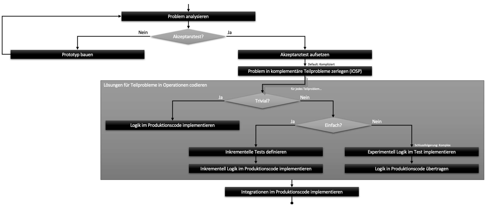

---

<!-- Page 333 of 493 -->

10-FinalemitTestmatrix 324
• IOSP: vermeide funktionale Abhängigkeiten
• DIP + IoC: dynamisiere (funktionale) Abhängigkeiten, wo es für
einfachere Tests hilfreich ist
Und etwas weiter gefasst behalte im Blick:
• DRY:vermeideDopplungen/DuplikatevonLogikoderauchWerten
• SLA: siedle insbesondere in Integrationen die Funktionsaufrufe auf
der selben Abstraktionsstufe an
• SRP: fokussiere jede Funktion und jedes Modul auf die Umsetzung
nur einer Entscheidung, die du in den Anforderungen findest (oder
aus technischen Gründen triffst)
• SoC: separiere grundlegend verschiedene Belange wie Peripherie
und Domäne, Verhalten und Daten usw.
Und vergiss nicht: Alle Sauberkeit, die du auf diesem Weg im Code
aufbaust, ist relativ, subjektiv und vergänglich. Stelle also sicher, dass
du deinen Code periodisch einer Wartung unterziehst, die immer wieder
sicherstellt, dass er noch deinen Ordnungsansprüchen genügt.
Ich glaube, jetzt habe ich das Wichtigste genügend oft gesagt. Es ist an dir!
Mach das Beste daraus.
Viel Erfolg!

---

<!-- Page 334 of 493 -->

Anhang -
Musterlösungen
Wenn du nachhaltig Software entwickeln willst, wie ich es mir vorstelle,
dann musst du dir nicht nur ein paar Tipps&Tricks merken. Es wäre
schön, wenn es so einfach wäre - doch das reicht leider nicht. Du braucht
vielmehr Übung und Experimente und Reflexion. Immerhin gilt es, einige
Gewohnheiten abzustreifen und Glaubenssätze zu verändern. Jedenfalls
ist es mir so ergangen auf meinem Weg zu Programming with Ease.
Um dich zu einer solch aktiven Auseinandersetzung mit der Methode zu
animieren, gehören zu den Kapiteln Übungsaufgaben. Vielleicht hast du
dich an der einen oder anderen schon versucht. Das wäre super, denn
dann hast du den ersten Schritt zur erfolgreichen Veränderung und zum
Kompetenzaufbau schon getan.
Der zweite Schritt besteht anschließend in der Reflexion deiner Lösungen.
Diekannstdualleinvornehmen,indemdudichamEndezurücklehnstund
überlegst, was gut und was schlecht gelaufen ist usw. Damit bewegst du
dich jedoch nur innerhalb deiner eigenen Komfortzone. Tiefer geht deine
Reflexion, wenn du sie von einem Kontrast ausgehen lässt. Den möchte
ich dir mit den Musterlösungen in diesem Band bieten.
Meine Vorstellung davon, wie die Übungsaufgaben gelöst werden könn-
ten, weicht sehr wahrscheinlich von deiner ab. “Könnten” schreibe ich
hier bewusst statt “sollten”, weil ich nicht glaube, dass es nur eine Lösung
für die Übungsaufgaben gibt. Vielmehr gibt es eine Lösungsbandbreite,
die z.B. davon bestimmt ist, wie Schwerpunkte bei der Anwendung von
Prinzipien und Praktiken gesetzt werden. Hier und da würde ich zwar
sagen, dass es “keine zwei Meinungen geben sollte”, doch allermeistens ist
das nicht so.

---

<!-- Page 335 of 493 -->

326
Die folgenden Musterlösungen sind daher nicht die Lösungen. Sie sind
nicht “richtig” und deine “falsch”, wenn sie anders aussehen. Der Wert
meiner Musterlösungen liegt nicht in einer “Wahrheit”, die sie verkörpern,
sondern vor allem in ihrer Andersheit.
DieDifferenz zwischendeinenLösungenundmeinenMusterlösungensoll
dich noch weiter anregen, darüber nachzudenken, warum du zu deinen
gekommen bist. Hattest du etwas missverstanden oder übersehen oder
sogar in gutem Willen ergänzt? Hast du einen anderen Schwerpunkt
gesetzt?
Warum meine Musterlösungen sind, wie sie sind, erkläre ich natürlich.
Meine Entscheidungen sind (hoffentlich) alle begründet und plausibel für
dich - was jedoch nicht heißt, dass man darüber nicht diskutieren könnte.
Hätte ich mich anders entschieden, wo Entscheidungsfreiheit bestand,
wäre ich zu anderen Lösungen gekommen - die vielleicht näher an deinen
liegen würden. Der Kürze wegen biete ich dir allerdings nur jeweils eine
Musterlösung pro Übungsaufgabe - und das auch nur in einem Monolog,
wie ihn ein Buch ermöglicht.
Doch eine Musterlösung ist besser als keine, würde ich sagen. Damit
kannst du deine Reflexion schonmal anregen und tiefer in den Lernstoff
eintauchen.
Für persönlicheres, konkreteres und dialogisches Feedback stehe ich dar-
über hinaus natürlich gern zur Verfügung. Melde dich jederzeit per Email
oder schaue dir auf meiner Homepage¹¹⁰ an, was ich dir ergänzend an
Trainings und Coaching bieten kann.
Viel Erfolg und Freude bei der Lösung der Übungsaufgaben und der
anschließenden Reflexion!
¹¹⁰https://ralfw.de/

---

<!-- Page 336 of 493 -->

Musterlösung: 01 - Die
Anforderung-Logik Lücke
Aufgabe 1 - Gründe für automatisiertes
Testen
Bevor du dich einlässt auf test-first Codierung, willst du sicher sein, dass
der Aufwand, den das bestimmt bedeutet, auch gerechtfertigt ist. Deshalb
habe ich dich ermuntert, selbst mal zu überlegen, welche guten Gründe es
geben könnte, sich darauf einzulassen.
WieduandenfolgendenListensiehst,findeich,dasseseineganzeMenge
solcher guten Gründe dafür gibt. Ja, ich weiß, dass test-first Vorgehen
manchmalnervt.Undmanchmal“klapptesnicht”-dochdarauswürdeich
nicht ableiten, dass es nicht das Ideal ist, dem du zustreben solltest. Test-
first ist für mich zum Standard avanciert, zur Norm. So sieht fachgerechte
Programmierung von Produktionscode einfach heute aus.
Beispielhafte Gründe für die
Testautomatisierung
Zuerst aber “nur” die Testautotmatisierung. Das ist weniger als test-first
und schließt also auch test-after ein (wenn es denn “dazu kommt”).
Warum sollte Software überhaupt automatisiert getestet werden, statt
manuell, indem du die Software aufrufst und “durchspielst”?
• Höhere Stabilität durch Detektion von Regressionen: Weil automa-
tisierteTestsjederzeit“aufKnopfdruck”ausgeführtwerdenkönnen,
besteht kein Grund auf einen Test, der schon einmal ausgeführt
wurde, zu verzichten. Die Reifetests von heute werden so zu Sta-
bilitätstests von morgen.

---

<!-- Page 337 of 493 -->

Musterlösung: 01-DieAnforderung-LogikLücke 328
• Dokumentation der Anforderungen: Tests sind ausführbare Spezi-
fikationen. Die Summe aller Tests beschreibt die Erwartungen an
Software unzweideutig.
• Dokumentation der Nutzung von Code: Testcode ist der erste
Nutzer von Produktionscode. Wie jener diesen bedient ist beispiel-
haft. Mit Tests können seltene Sonderfälle und allgemeine wie
umfassende Use Cases beschrieben werden.
• Geringere Kosten - über die Zeit: Auch wenn die Einstandskosten
für automatisierte Tests hoch sein mögen - einen Test jetzt zu
schreiben, statt das Programm nur mal eben auszuführen für eine
Reifeprüfung, macht viel mehr Arbeit -, liegt der break-even point
in nicht allzu weiter Zukunft. Das gilt für Reifeprüfungen wie die
noch wichtigeren Stabilitätsprüfungen.
• Höhere “Benutzerfreundlichkeit”: Automatisierte Tests können
von jedem Teammitglied oder gar automatisiert in einer CB/CI-
Pipeline ausgeführt werden.
• Nachvollziehbarkeit: Nur mit automatisierten Tests ist jederzeit
nachvollziehbar, was überhaupt getestet wurde und wird.
• Beobachbare Testabdeckung: Nur mit automatisierten Tests lässt
sich die Testabdeckung beobachten und damit beurteilen, ob das
Testen überhaupt schon/noch ausreichend ist.
• Größere Testumgebungsvielfalt: Automatisierte Tests lassen sich
nicht nur an den Rechnern ausführen, an denen gerade Menschen
sitzen. Sie können vielmehr ausgerollt werden auf virtuelle Maschi-
nen, die in jeder erdenklichen (und relevanten) Weise konfiguriert
sind.
• Größere Ordnung: Um automatisiert testen zu können, muss Code
in geeigneter Weise strukturiert sein; Testbarkeit ist eine Vorausset-
zung für automatisierte Tests. Testbar ist Code, wenn eine gewisse
Entkopplung von Codeteilen existiert, was die Ordnung erhöht und
den Code wandelbarer macht.
Beispielhafte Gründe für test-first
Testautomatisierung
Nach der obigen Liste sollte es keine zwei Meinungen mehr geben, hoffe
ich, dass automatisierte Tests “alternativlos” sind. Jetzt musst du sie nur
noch schreiben. Aber wann? Ich meine: konsequent test-first. Denn das
hat weitere Vorteile:

---

<!-- Page 338 of 493 -->

Musterlösung: 01-DieAnforderung-LogikLücke 329
• HöhereVerlässlichkeit:AutomatisierteTestswerdenüberhauptge-
schrieben.DennwennautomatisierteTestsnichtzuerstgeschrieben
werden,dannistspäterdieMotivationgeringunddieZeitfürsolche
“zusätzliche Arbeit” meist knapp.
• Höhere Testbarkeit: Wer den Produktionscode vom Test her denkt,
weil er den zuerst schreibt, achtet früher (oder überhaupt) darauf,
dass der Produktionscode auch einfach zu testen ist, also eine hohe
Ordnung hat.
• Bessere Schnittstellen: Schnittstellen bieten Dienstleistungen an
und sollten daher vom Nutzer aus gedacht werden. Wenn Entwi-
ckelnde zuerst in Tests die Schnittstellen ihres Produktionscodes
nutzen müssen, bevor sie sie “in Code gießen”, sind sie sensibler
dafür, was andere Nutzer später für einfach/verständlich halten
könnten. Test-first Codierung ist eine Form von “eat your own dog
food”.
Test-first geht über “nur” automatisierte Tests hinaus. Du schreibst die au-
tomatisierten Tests verlässlich vor dem Produktionscode. Aber wie? Test-
first ist noch nicht Test-Driven Development (TDD) wie du es vielleicht
kennst.
Was Gründe für TDD sein könnten, frage ich dich allerdings hier nicht.
Diese Praktik ist Thema eines eigenen Kapitels. Test-first ist für mich
wichtiger und grundlegender. Der Titel der beiden Bände ist für mich
Programm.

---

<!-- Page 339 of 493 -->

Musterlösung: 01-DieAnforderung-LogikLücke 330
Aufgabe 2 - Eine Anwendung test-first
entwickeln
Analyse
Akzeptanztestfälle
Das Programm wird mehrfach gestartet und muss daher seine “Erinne-
rung” (Zustand) an bisherige Gäste persistieren.
Die Funktionsweise kann “von außen” überprüft werden, indem nachein-
ander Gäste im Rahmen desselben Szenarios begrüßt werden.
1. System Under Test (SUT) starten.
2. Roger -> Hello, Roger!
3. Janine -> Hello, Janine!
4. SUT stoppen und wieder starten.
5. Roger -> Welcome back, Roger!
6. Roger -> Hello my good friend, Roger!
7. SUT stoppen und wieder starten.
8. Janine -> Welcome back, Janine!
9. 20x Roger
10. Roger -> Hello my good friend, Roger!
11. Roger-> Hello my good friend, Roger!Congrats! Youarenow
a platinum guest!
12. Roger -> Hello my good friend, Roger!
API-Funktion
Um das SUT inkl. Zustand einfach starten/stoppen zu können, wird die
Begrüßungfunktion einer Instanzklasse zugeordnet:

---

<!-- Page 340 of 493 -->

Musterlösung: 01-DieAnforderung-LogikLücke 331
1 class HelloBackend {
2 public string Greet(string name) {...}
3 }
Diese Funktion überspannt die gesamte Logik des Programms, außer der
für die Benutzerschnittstelle. Auf diese Weise kann maximal viel Logik im
Akzeptanztest überprüft werden.
Eine Konfiguration des Backend zumindest mit einem Pfad (connection
string) für die Persistenz, scheint allerdings hilfreich für das Rücksetzen-
/Starten im Test.
Entwurf der Persistenz
Das Programm muss sich über Starts hinweg die begrüßten Gäste merken.
Laut der Anforderungen ist mit ungefähr 3*100*25*2= 15.000 Besuchen zu
rechnen. Die Zahl der verschiedenen Gäste ist sicher geringer.
Das ist keine sehr große Zahl, so dass die persistente Zustandshaltung
sehr simpel sein kann: es genügt eine Textdatei, deren Inhalt komplett in-
memory gehalten werden könnte.
Weder ein Speicherplatz- noch ein Performanceproblem würde ich erwar-
ten.
Jeder Gast könnte mit einem Tupel (Name, Anzahl der Besuch) in der
Gästeliste vertreten sein (Option Map), z.B.
1 Roger, 3
2 Janine, 2
3 Mark, 7
4 Henry, 1
Oder die Gästeliste besteht schlicht aus einer fortgeschriebenen Liste von
Namen (Option Event Stream):

---

<!-- Page 341 of 493 -->

Musterlösung: 01-DieAnforderung-LogikLücke 332
1 Roger
2 Janine
3 Mark
4 Roger
5 Henry
6 Mark
7 Janine
Letztere Lösung scheint mir flexibler, auch wenn sie mehr Speicherplatz
benötigt. Bei der geringen Besuchszahl ist Speicherplatz jedoch kein
Problem.
Codierung
1. Akzeptanztests
1 [Fact]
2 public void Acceptance_test_scenario()
3 {
4 const string TEST_DB = "test.db";
5 File.Delete(TEST_DB);
6
7 var sut = new HelloBackend(TEST_DB);
8 sut.Greet("Roger").Should().Be("Hello, Roger!");
9 sut.Greet("Janine").Should().Be("Hello, Janine!");
10
11 sut = new HelloBackend(TEST_DB); // auf diese Weise wird vermieden,
12 // dass Zustand nur in-mem gehalten wird
13 sut.Greet("Roger").Should().Be("Welcome back, Roger!");
14 sut.Greet("Roger").Should().Be("Hello my good friend, Roger!");
15
16 sut = new HelloBackend(TEST_DB);
17 sut.Greet("Janine").Should().Be("Welcome back, Janine!");
18
19 for (var i = 1; i <= 20; i++)
20 sut.Greet("Roger");
21
22 sut.Greet("Roger").Should().Be("Hello my good friend, Roger!");
23 sut.Greet("Roger").Should().Be("Hello my good friend, Roger! Congrats! You are now a \
24 platinum guest!");
25 sut.Greet("Roger").Should().Be("Hello my good friend, Roger!");
26 }
Die Akzeptanzkriterien habe ich alle in einem Szenariotest (Use Case)
zusammengefasst. Dadurch muss ich den Zustand des System under Test
nicht für einzelne Testfälle gesondert setzen und überprüfen. Vielmehr
baut sich der Zustand natürlich durch fortschreitende Nutzung auf und
wird durch korrekte Ergebnisse in der weiteren Verarbeitung implizit
verifiziert. Lediglich am Anfang muss der persistente Zustand durch Lö-
schender“Datenbank”“aufNullgesetzt”werden,umfürjedenDurchlauf
gleiche Ausgangsbedingungen zu schaffen.
2. Produktionscode I: System under Test (SUT)

---

<!-- Page 342 of 493 -->

Musterlösung: 01-DieAnforderung-LogikLücke 333
1 public class HelloBackend
2 {
3 private readonly string _dbFilePath;
4
5 public HelloBackend(string dbFilePath) {
6 _dbFilePath = dbFilePath;
7 }
8
9 public string Greet(string name) {
10 File.AppendAllLines(_dbFilePath, new[]{name});
11 var names = File.ReadAllLines(_dbFilePath);
12
13 var n = names.Count(x => x == name);
14
15 var greeting = n switch {
16 1 => $"Hello, {name}!",
17 2 => $"Welcome back, {name}!",
18 _ => $"Hello my good friend, {name}!"
19 };
20 if (n == 25) greeting += " Congrats! You are now a platinum guest!";
21
22 return greeting;
23 }
24 }
Die komplette zu testende Logik ist in einer Klasse gekapselt. Eine weitere
Modularisierung scheint mir angesichts des geringen Schwierigkeitsgra-
des, des Abstraktionsgrades der C#-Mittel und der Wahl des Persistenz-
formates sowie des Tests im Rahmen eines Szenarios nicht nötig.
Das SUT enthält auch die Persistenzlogik, um sicherzustellen, dass die
korrekt ist. Sie nicht zu testen, wäre leichtfertig. Sie jedoch getrennt
zu testen, würde ein Zusammenspiel mit der Domänenlogik ungetestet
lassen.
Die Konfiguration des SUT mit dem Datenbanknamen findet über den
Konstruktor statt. Damit ist sie “aus dem Weg” bei der Nutzung des
Backend-Objektes. Meine Annahme dabei ist, dass während der Existenz
des Backends die Datenbank nicht gewechselt werden muss.
3. Produktionscode II: Einbettung des SUT in ein
Programm mit Benutzerschnittstelle

---

<!-- Page 343 of 493 -->

Musterlösung: 01-DieAnforderung-LogikLücke 334
1 class Program
2 {
3 static void Main(string[] args) {
4 var backend = new HelloBackend("guests.txt"); // Konfiguration
5
6 while (true) {
7 Console.Write("Name: ");
8 var name = Console.ReadLine();
9 if (string.IsNullOrWhiteSpace(name)) continue;
10
11 var greeting = backend.Greet(name); // Nutzung
12
13 Console.WriteLine(greeting);
14 }
15 }
16 }
Um das automatisiert getestete SUT siehst du jetzt natürlich weitere
Logik. Die ist nicht (einfach) automatisiert testbar. In diesem Fall ist sie
allerdings trivial; bei einem abschließenden manuellen Test würdest du
sofort merken, wenn darin ein Bug sitzt, denke ich.
Aber nimm solche Logik nicht auf die leichte Schulter. In einem späteren
Kapitel werden wir uns damit näher beschäftigen. Solche Mischungen
vonLogikundeinemFunktionsaufrufwiebackend.Greet()inMain()
sind weder gut für die Verständlichkeit noch für die Testbarkeit.

---

<!-- Page 344 of 493 -->

Musterlösung: 04 -
Schrittweise codieren in der
Einfachheit
Aufgabe 1 - Einschätzung des
Schwierigkeitsgrades
Die Einschätzung des Schwierigkeitsgrades ist weitgehend subjektiv. Ei-
nerseits. Andererseits beobachte ich eine Tendenz zur Unterschätzung.
Entwickler glauben eher, dass ein Problem weniger schwierig ist, als es
sich dann herausstellt, wenn sie erstmal mit der Codierung begonnen
haben. Das ist menschlich, finde ich, und besonders zu erwarten, wenn
im Projekt Zeitdruck herrscht, der favorisiert, dass Produktionscode statt
Testcode geschrieben wird.
Bei aller Subjektivität glaube ich daher, dass jeder Entwickler gut daran
tut, etwas bescheidener bei der Einschätzung zu sein. Lieber ein Problem
alsschwierigeransehenunddannerleichtertsein,wenneswidererwarten
flott von der Hand geht - als übermütig gegen eine Wand zu laufen.
Wie ist es dir bei der Einschätzung gegangen? Schau dir einmal meine
Einschätzungen an: Bist du zu anderen gekommen? Wenn ja, warum
wohl?
Meine Einschätzungen sind nicht “absolut richtig”, auch wenn ich Ar-
gumente für sie habe. Sie sollen dich vielmehr anregen, sensibler für
Schwierigkeitsgradeinschätzungen zu sein im Projektalltag, um dafür
dann die passenden Lösungsansätze zu wählen.
Mathematischen Ausdruck berechnen
Ist das Problem chaotisch? Nein. Es lassen sich leicht dafür Akzeptanztest-
fälle finden, einer ist schon in der Aufgabenstellung enthalten.

---

<!-- Page 345 of 493 -->

Musterlösung: 04-SchrittweisecodiereninderEinfachheit 336
Ist das Problem trivial? Sehr wahrscheinlich nicht; aber letztlich ist das
subjektiv. Wer ganz viel Selbstvertrauen hat, könnte es probieren, einen
roten Testfall wie in der Aufgabenstellung gegeben “in einem Rutsch” auf
grün zu bekommen. Wenn das dann aber doch nicht so einfach gelingt…
müsste man schon einsehen, dass es eben doch nicht trivial ist. Vorsicht
also vor Selbstüberschätzung!
Ergo: das Problem könnte einfach sein. Wenn das so ist, dann sollten sich
Variationsdimensionen bestimmen lassen, z.B.
• Mengendimension: Zahl der Operanden, z.B. 1, 2, n
• Mengendimension: Zahl der Operatoren, z.B. 0, 1, n
• Kategoriendimension: Operatoren, z.B. +, -, *, /
• Kategoriendimension: valider Ausdruck, invalider Ausdruck
Die Zahl der Ziffern der Operanden scheint jedoch unerheblich zu sein
(siehe Beispielimplementation).
Beispielimplementation
Akzeptanztest
1 [Fact]
2 public void Akzeptanztest()
3 {
4 Kalkulator.Berechnen("2+30*400").Should().Be(12800);
5 }
1 class Kalkulator
2 {
3 public static int Berechnen(string ausdruck) {
4 return 0;
5 }
6 }
Inkrementeller Test 1: Nur 1 Operand

---

<!-- Page 346 of 493 -->

Musterlösung: 04-SchrittweisecodiereninderEinfachheit 337
1 [Fact]
2 public void Ein_Operand()
3 {
4 Kalkulator.Berechnen("42").Should().Be(42);
5 }
1 class Kalkulator
2 {
3 public static int Berechnen(string ausdruck) {
4 var operand = int.Parse(ausdruck);
5 return operand;
6 }
7 }
Der Test wird auf einfachst mögliche Weise erfüllt. Das ist natürlich
noch keine wirkliche Problemlösung, doch ein erster Aspekt wird schon
klar: Im Ausdruckt stehen Zahlen als Zeichenketten und müssen für die
Berechnung gewandelt werden.
In einiger cTDD-Literatur wird an solcher Stelle empfohlen, mit return
42;zubeginnen.DaswürdezwardenTestbefriedigen,allerdingslägeaus
meiner Sicht darin keinerleiErkenntnisgewinn. Der Input würde in keiner
Weise genutzt. Deshalb empfehle ich dir diesen Ansatz nicht. Vielmehr
gilt wie beim Wohnungsumzug: “Kein Gang ohne!”, d.h. wenn schon
Produktionscode geschrieben wird, dann sollte der den Input auch in
irgendeinerWeisenutzen,umdarausOutputzuerzeugen:“KeinTestohne
[Erkenntnisgewinn]!”
Inkrementeller Test 2: 2 Operanden mit Addition
1 [Fact]
2 public void Zwei_Operanden_und_Addition()
3 {
4 Kalkulator.Berechnen("1+41").Should().Be(42);
5 }

---

<!-- Page 347 of 493 -->

Musterlösung: 04-SchrittweisecodiereninderEinfachheit 338
1 public static int Berechnen(string ausdruck)
2 {
3 // Ausdruck analysieren
4 var operanden = ausdruck.Split(new[] {' ', '+'},
5 StringSplitOptions.RemoveEmptyEntries);
6 // Ergebnis berechnen
7 var ergebnis = 0;
8 foreach (var operand in operanden) {
9 ergebnis += int.Parse(operand);
10 }
11 return ergebnis;
12 }
Die Trivialität dieses Inkrements hängt davon ab, wie leicht es ist, eine
Zeichenkette an bestimmten Zeichen/Mustern aufzuspalten. Operanden
werden als durch Leerzeichen und + getrennte Teile in einer Zeichenkette
angesehen. Mit Split() ist es in C# trivial, diese Teile zu extrahieren, in-
dem man einfach nur die Trennzeichen (delimiter) angibt, die dazwischen
stehen (und ignoriert werden sollen).
Die Anwendungder einzigenOperation auf die in dieser Weisefreigestell-
ten Operanden, ist anschließend eine Fingerübung.
Auch wenn das + nicht in der Ergebnisberechnung auftaucht, ist es doch
zumindest in der Analyse präsent. Das ist ein gutes Zeichen dafür, dass
das Problem ernst genommen wird.
Inkrementeller Test 3: Beliebig viele Operanden durch Addition
verknüpft
1 [Fact]
2 public void N_Operanden_und_Addition()
3 {
4 Kalkulator.Berechnen("1 + 2+3 + 4").Should().Be(10);
5 }
Dieses Testinkrement ist von außen gesehen konsequent - aber wie sich
herausstellt, ist der Code in Bezug darauf schon reif. Die Lösung für das
vorherige Inkrement war allgemeiner als nötig - weil sie so trivial war.
Angesichts der Einfachheit der Analyse mittels Split(), schien es um-
ständlicher als nötig, die vorherige Lösung auf nur zwei Operanden zu
beschränken. Das wäre vielleicht interessant bei noch kleinschrittigeren
Inkrementen gewesen, bei denen Operanden zunächst nur einziffrige
Zahlen sind. In dem Fall hätte das zweite Inkrement 1+2 lauten und
die Analyse direkt per Index auf Operanden zugreifen können, z.B. ope-
rand1=ausdruck[0].

---

<!-- Page 348 of 493 -->

Musterlösung: 04-SchrittweisecodiereninderEinfachheit 339
Wie sich hier zeigt: Die Einschätzung der Schwierigkeit eines Inkrements
beruht auf der Erfahrung und den Kenntnissen der Entwickelnden und
den Möglichkeiten einer Programmierplattform.
Inkrementeller Test 4: Multiplikation als weiterer Operator
1 [Fact]
2 public void N_Operanden_und_also_Multiplication()
3 {
4 Kalkulator.Berechnen("2*3+4").Should().Be(10);
5 }
Nun können die Operatoren nicht mehr “übergangen” werden. Das be-
deutet, es gibt nicht nur eine Liste von Operanden, sondern eine zweite
mit Operatoren. Und Operatoren nehmen Bezug auf zwei Operanden. Es
scheint daher nützlich, die Schleife über die Operanden so umzustellen,
dass ein wahlfreier Zugriff möglich ist. Der Umbau dahingehen ist ein
Refactoring: Die Funktionalität wird nicht verändert, aber die Struktur
der Logik. Der neue Test bleibt rot, die vormaligen bleiben grün.
1 public static int Berechnen(string ausdruck)
2 {
3 // Analyse
4 var operanden = ausdruck.Split(new[] {' ', '+'},
5 StringSplitOptions.RemoveEmptyEntries);
6 // Umgebaute Berechnung
7 var ergebnis = 0;
8 for (var i = 0; i < operanden.Length; i++) {
9 ergebnis += int.Parse(operanden[i]);
10 }
11 return ergebnis;
12 }
Anschließend ist die Implementation der Operatorenanalyse trivial, weil
analogzurOperandenanalyse.BeinOperandenentstehenn-1Operatoren,
die als binäre Operationen zwischen den Operanden stehen.
Die Berechnung des Ergebnisses muss allerdings ein wenig umgebaut
werden, um der “Zwischenschaltung” der unterschiedlichen Operatoren
zwischen die Operanden gerecht zu werden:

---

<!-- Page 349 of 493 -->

Musterlösung: 04-SchrittweisecodiereninderEinfachheit 340
1 public static int Berechnen(string ausdruck)
2 {
3 // Analyse
4 var operanden = ausdruck.Split(new[] {' ', '+', '*'},
5 StringSplitOptions.RemoveEmptyEntries);
6 var operatoren = ausdruck.Split(new[] {' ', '0', '1', '2', '3', '4',
7 '5', '6', '7', '8', '9'},
8 StringSplitOptions.RemoveEmptyEntries);
9
10 // Berechnung
11 var ergebnis = int.Parse(operanden[0]);
12 for (var i = 1; i < operanden.Length; i++) {
13 switch (operatoren[i-1]) {
14 case "+": ergebnis += int.Parse(operanden[i]); break;
15 case "*": ergebnis *= int.Parse(operanden[i]); break;
16 }
17 }
18 return ergebnis;
19 }
Das Ergebnis wird mit dem ersten Operanden initialisiert, da nicht gewiss
ist, ob der erste Operator eine Addition ist. Nur für die Addition wäre eine
0 im Ergebnis das neutrale Element, das beim allgemeinen ergebnis =
ergebnis <operator> operand kein Problem macht.
Abschließender Test mit allen Operatoren
Weitere inkrementelle Tests für die noch fehlenden Operatoren - und /
scheinen mir nun zu feingranular. Ich nehme an, dass es trivial ist, weitere
Operatoren hinzuzufügen. Deshalb zum Abschluss ein Test, in dem alle
Operatoren zum Einsatz kommen. Der kann als Akzeptanztest angesehen
werden, der im Grund schon von Anfang an hätte definiert sein können.
1 [Fact]
2 public void Alle_Operatoren()
3 {
4 Kalkulator.Berechnen("100/4*2-10+2").Should().Be(42);
5 }
Die Logik im Produktionscode dafür ist wie erwartet trivial:

---

<!-- Page 350 of 493 -->

Musterlösung: 04-SchrittweisecodiereninderEinfachheit 341
1 public static int Berechnen(string ausdruck)
2 {
3 // Analyse
4 var operanden = ausdruck.Split(new[] {' ', '+', '*', '-', '/'},
5 StringSplitOptions.RemoveEmptyEntries);
6 var operatoren = ausdruck.Split(new[] {' ', '0', '1', '2', '3', '4',
7 '5', '6', '7', '8', '9'},
8 StringSplitOptions.RemoveEmptyEntries);
9
10 // Berechnung
11 var ergebnis = int.Parse(operanden[0]);
12 for (var i = 1; i < operanden.Length; i++) {
13 switch (operatoren[i-1]) {
14 case "+": ergebnis += int.Parse(operanden[i]); break;
15 case "*": ergebnis *= int.Parse(operanden[i]); break;
16 case "-": ergebnis -= int.Parse(operanden[i]); break;
17 case "/": ergebnis /= int.Parse(operanden[i]); break;
18 }
19 }
20 return ergebnis;
21 }
Die Einschätzung des Problems als einfach hat sich im schrittweisen
Testen bewahrheitet. Allerdings ist beim zweiten inkrementellen Test
klar geworden, wie subjektiv sie auch ist. Intuition in Bezug auf den
Lösungansatz (hier: Operatoren und Ziffern als Trennzeichnen ansehen)
und Plattformkenntnis (hier: Split()) haben den Ausschlag gegeben,
dass die Lösung für Test 2 und dann Test 3 tatsächlich trivial waren.
Game-of-Life
Ist das Problemn chaotisch? Nein. Bei Wikipedia sind schon Beispiele zu
sehen.
Ist das Problem trivial? Nein.
Ist das Problem einfach? Ja, wenn sich Variationsdimensionen finden
lassen, z.B.
• Mengendimension: Es könnte naheliegen, die Größe der Matrix zu
beschränken, z.B. 1x1, NxN. Schon bei der 1x1 Matrix müsste dann
mit “Eckzellen” umgegangen werden, deren Nachbarn nicht “zur
Welt gehören”.
• Kategoriendimension: Die Regeln ließen sich in min. drei Gruppen
unterteilen
– Zelle nicht gesetzt und alle Nachbarzellen nicht gesetzt (rele-
vant für 1x1 Matrix)

---

<!-- Page 351 of 493 -->

Musterlösung: 04-SchrittweisecodiereninderEinfachheit 342
– ZellegesetztundalleNachbarzellennichtgesetzt(relevantfür
1x1 Matrix)
– Die restlichen Regeln
Ob diese Dimensionen mit ihren Variationen aber wirklich aus dem
Problem ein einfaches machen? Eine inkrementelle Annäherung scheint
irgendwie möglich - doch sie lässt zu wünschen übrig. Die Einfachheit
liegt nicht auf der Hand.
NQueen
Ist das Problem chaotisch? Nein. Bei Wikipedia ist ja schon eine Lösung
zu sehen und es gibt weitere z.B. hier im Überblick¹¹¹.
Ist das Problem trivial? Nein.
Ist das Problem einfach? Nein.
¹¹¹https://stamm-wilbrandt.de/en/xsl-list/n-queens/n-queens.xsl.xml

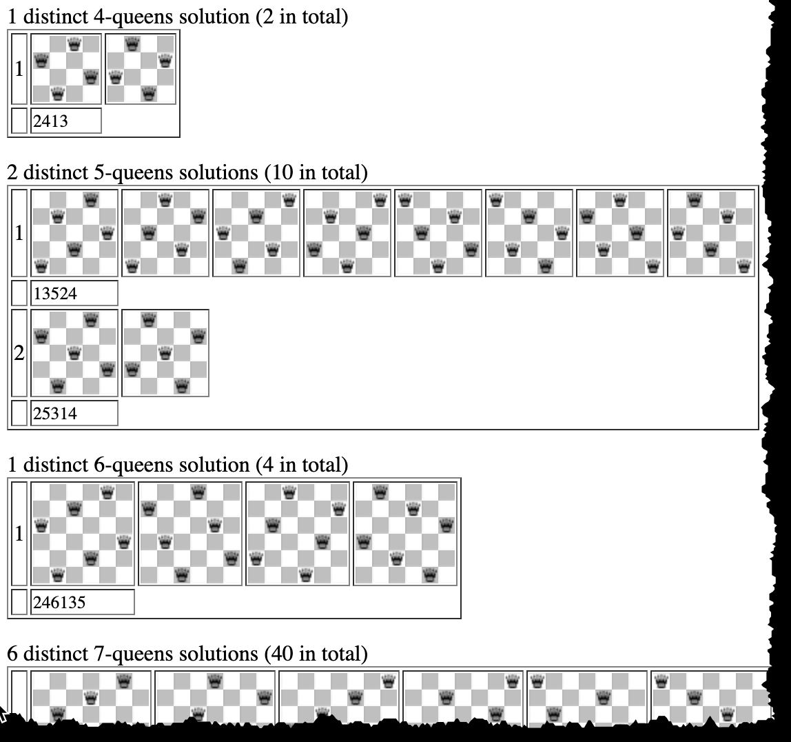

---

<!-- Page 352 of 493 -->

Musterlösung: 04-SchrittweisecodiereninderEinfachheit 343
• DieKategoriendimensionLösbarkeit (1x1:ja,trivial;2x2u3x3:nein;
ab4x4lösbar)bringtkeinewirklicheHilfebeiderFindungderLogik
für das Problem.
• Die Mengendimension Brettgröße (1x1..NxN) bringt keine Hilfe,
weil schon ab 4x4 das Problem vollständig bewältigt sein muss.
Zugegeben, das war eine Fangfrage, weil ich nicht glaube, dass das
Problem zu den Schwierigkeitsgraden passt, die ich dir bisher vorgestellt
habe. Hast du das bemerkt und geweigert, einen Schwierigkeitsgrad zuzu-
ordnen? Oder hast du dich genötigt gefühlt, es als einfach einzustufen?
Binärzahlenkonvertierung
Ist das Problem chaotisch? Nein.
Ist das Problem trivial? Ja. Zwar ist auch diese Einschätzung subjektiv,
doch für die meisten Entwickler mit etwas Erfahrung in ihrer Program-
miersprache kann Trivialität angenommen werden, glaube ich.
Beispielimplementation
Test
1 [Fact]
2 public void Akzeptanztest()
3 {
4 Binärzahlenkonvertierung.Konvertiere("1101").Should().Be(13);
5 Binärzahlenkonvertierung.Konvertiere("10011010").Should().Be(154);
6 }
Produktionscode

---

<!-- Page 353 of 493 -->

Musterlösung: 04-SchrittweisecodiereninderEinfachheit 344
1 class Binärzahlenkonvertierung {
2 public static int Konvertiere(string binärzahl) {
3 var dezimalzahl = 0;
4 var zweierpotenz = 1;
5 foreach (var d in binärzahl.ToCharArray().Reverse()) {
6 dezimalzahl += d == '1' ? zweierpotenz : 0;
7 zweierpotenz *= 2;
8 }
9 return dezimalzahl;
10 }
11 }
Trivial ist der Produktionscode, wenn der Lösungsansatz z.B. auf der
Umkehrung der Binärziffern basiert. Die kann mit dem gezeigten Rever-
se() geschehen oder mit einer for-Schleife durchgeführt werden, die
den Index von hinten nach vorne zählt.

---

<!-- Page 354 of 493 -->

Musterlösung: 04-SchrittweisecodiereninderEinfachheit 345
Aufgabe 2 - Römische Zahlen in
Dezimalzahlen wandeln
Verständnis dokumentieren
• Römische Zahlen (z.B. “XVI”) bestehen aus römischen Ziffern (z.B.
“X”, “V”, “I”).
- Römischen Ziffern als Buchstaben steht ein Zahlenwertgegenüber
(z.B. “X”=10, “V”=5, “I”=1).
• DerWerteinerrömischenZahlergibtsichimeinfachstenFalldurch
Addition der Zahlenwerte der darin enthaltenen römischen Ziffern
(z.B. “XVI” = 10+5+1 = 16).
• Steht allerdings eine Ziffer mit kleinerem Zahlenwert vor einer
Ziffer mit größerem Zahlenwert, dann wird der Wert der ersten
Ziffer von dem der zweiten abgezogen (z.B. “XIV” = 10 + (5-1) =
14).
Weiterer Akzeptanztestfall:
• MCDXCII = 1492
Funktionssignatur:
• int FromRoman(string roman)
Inkrementelle Testfälle definieren
Variationsdimensionen
• Mengendimension Ziffernzahl: 1, 2, n
• Kategoriendimen Ziffern: I, V, X, L, C, D, M
• Kategoriendimension Geradlinigkeit: zuerst: nur Addition ist nötig;
dann: auch Subtraktionen sind nötig
Testfälle

---

<!-- Page 355 of 493 -->

Musterlösung: 04-SchrittweisecodiereninderEinfachheit 346
• "I" → 1 - 1 Ziffer, nicht einmal eine Addition ist nötig
• "V" → 5 - eine weitere Ziffer, immer noch ohne Addition
• "XVI" → 16 - mehrere Ziffern, nur Addition
• "XIV" → 14 - mehrere Ziffern, mit Subtraktion
Test-first codieren
Akzeptanztests
1 public void AcceptanceTest()
2 {
3 RomanNumbers.FromRoman("MCMLXXXIV").Should().Be(1984);
4 RomanNumbers.FromRoman("MCDXCII").Should().Be(1492);
5 }
DerProduktionscodeistimerstenSchrittwiedernurprovisorisch.Eswird
keine Lösung angestrebt:
1 public static int FromRoman(string roman) {
2 return 0;
3 }
Inkrement 1
1 [Fact]
2 public void Single_digit()
3 {
4 RomanNumbers.FromRoman("I").Should().Be(1);
5 }
1 public static int FromRoman(string roman) {
2 if (roman[0] == 'I') return 1;
3 throw new NotImplementedException();
4 }
Stattnur1zurückzugeben,wieesincTDD-Tutorienimmerwiedergezeigt
wird, wird hier dem Problem nicht ausgewichen: der Input wird genutzt,
weil das früher oder später ohnehin der Fall sein muss.
TrivialundimSinnedesKISS-Prinzips¹¹²wirddieLogikdennochgehalten,
weil sie nur eine einzige Ziffer in der römischen Zahl annimmt.
Und“lösungsorientiert”istdieLogik,weildiedieseeineundeinzigeZiffer
nicht “vorhersieht”, sondern prüft und übersetzt.
¹¹²https://en.wikipedia.org/wiki/KISS_principle

---

<!-- Page 356 of 493 -->

Musterlösung: 04-SchrittweisecodiereninderEinfachheit 347
Inkrement 2
1 [Fact]
2 public void Other_single_digit()
3 {
4 RomanNumbers.FromRoman("V").Should().Be(5);
5 }
1 public static int FromRoman(string roman) {
2 if (roman[0] == 'I') return 1;
3 if (roman[0] == 'V') return 5;
4 throw new NotImplementedException();
5 }
MitdiesemInkrementsolldasMusterderZiffernübersetzungherausgekit-
zelt werden. Eine Reihe von Fallunterscheidungen ist dafür eine mögliche
Lösung. (Alternativen wären eine switch-Anweisung oder eine Map als
Datenstruktur.)
Da die Erweiterung so einfach war, liegt es nahe, die fehlenden Ziffern
mit ihren Übersetzungen auch noch hinzuzufügen. Dafür gibt es zwar
noch keine unmittelbaren Tests, doch am Ende werden die Akzeptanztest
zeigen, ob auch das gelungen ist.
1 public static int FromRoman(string roman) {
2 if (roman[0] == 'I') return 1;
3 if (roman[0] == 'V') return 5;
4 if (roman[0] == 'X') return 10;
5 if (roman[0] == 'L') return 50;
6 if (roman[0] == 'C') return 100;
7 if (roman[0] == 'D') return 500;
8 if (roman[0] == 'M') return 1000;
9 throw new NotImplementedException();
10 }
Diesen Schritt kannst du als mentale Entlastung ansehen. Das Thema
“Ziffernübersetzung” ist damit aus dem Kopf raus.
Inkrement 3

---

<!-- Page 357 of 493 -->

Musterlösung: 04-SchrittweisecodiereninderEinfachheit 348
1 [Fact]
2 public void Multiple_digits_with_addition() {
3 RomanNumbers.FromRoman("XVI").Should().Be(16);
4 }
Bei der Addition mehrerer Ziffernwerte, wird nicht mehr nur auf die
erste Ziffer zugegriffen. Es scheint daher zunächst eine Refaktorisierung
angezeigt,diedenIndex[0]beiderKlassifizierungeliminiert;dortistder
Index ein Widerspruch gegen das DRY-Prinzip¹¹³.
Die einfachste Lösung ist die Extraktion einer Funktion für die Überset-
zung, deren Parameter eine zu übersetzende Ziffer enthält:
1 public static int FromRoman(string roman) {
2 return Map(roman[0]);
3 }
4
5 private static int Map(char romanDigit) {
6 if (romanDigit == 'I') return 1;
7 if (romanDigit == 'V') return 5;
8 if (romanDigit == 'X') return 10;
9 if (romanDigit == 'L') return 50;
10 if (romanDigit == 'C') return 100;
11 if (romanDigit == 'D') return 500;
12 if (romanDigit == 'M') return 1000;
13 throw new NotImplementedException();
14 }
Nach der Refaktorisierung ist dann die neue Logik zur Befriedigung des
Tests trivial:
1 public static int FromRoman(string roman) {
2 var decimalNumber = 0;
3 for(var i=0; i<roman.Length; i++)
4 decimalNumber += Map(roman[i]);
5 return decimalNumber;
6 }
Es ist wie bei der Berechnung des Ausdrucks nur eine Schleife zur
Addition nötig.
Inkrement 4
¹¹³https://en.wikipedia.org/wiki/Don’t_repeat_yourself

---

<!-- Page 358 of 493 -->

Musterlösung: 04-SchrittweisecodiereninderEinfachheit 349
1 [Fact]
2 public void Subtraction_rule() {
3 RomanNumbers.FromRoman("XIV").Should().Be(14);
4 }
1 public static int FromRoman(string roman) {
2 var decimalNumber = 0;
3 var prevValue = int.MaxValue;
4 for (var i = 0; i < roman.Length; i++) {
5 var value = Map(roman[i]);
6
7 // Subtraktionsregel anwenden
8 if (value > prevValue) decimalNumber -= 2 * prevValue;
9 prevValue = value;
10
11 decimalNumber += value;
12 }
13 return decimalNumber;
14 }
Die Trivialität des letzten Inkrements beruht wieder darauf, ob man
die richtige Intuition in Bezug auf den Lösungsansatz hat. Bei dem
hier benutzten sind im Grunde nur zwei Zeilen Logik einzuschieben,
um den gewünschten Effekt zu erzielen. Dazu muss man sich jedoch
“trauen”, zunächst das Falsche zu tun, nämlich immer zu addieren - um
bei späterer Feststellung einer größeren nach einer kleineren Ziffer zu
korrigieren. Der Lösungsansatz beruht also auf einer “Rückschau”, denn
einer “Vorausschau”.
Wiegedacht,wardieAufgabeeinfachzulösen.Allerdingszeigtesichauch
hier, dass dazu “ein wenig Glück gehört”. Ohne zumindest eine grobe Idee
vom Lösungsansatz, wäre das letzte Inkrement womöglich nicht so trivial
gewesen, auch wenn es sich aus der Analyse der Variationsdimensionen
sehr natürlich ergeben hat.
Vielleicht könnten dem feinere Inkremente abhelfen, z.B.
• "IV" → 4 - die kleinere Ziffer steht an erster Stelle
• "XIV" → 14 - die kleinere Ziffer steht an zweiter Stelle (oder an
erster, weil der vorherige Test ja grün bleiben muss)
• "LXIV" → 64 - die kleinere Ziffer steht an beliebiger Stelle
Doch auch diese Inkremente zu sehen, ist durchaus subjektiv.

---

<!-- Page 359 of 493 -->

Musterlösung: 04-SchrittweisecodiereninderEinfachheit 350
Reflexion
MeinerBeobachtungnachunterscheidensichEntwickelndeinmindestens
viererlei Hinsicht:
• Plattformkenntnis - Welche Mittel der Logik aus Programmierspra-
che, Bibliotheken Frameworks stehen ihnen nach ihrer Erfahrung
zur Verfügung?
• Programmiererfahrung - Welche Methoden/Konzepte haben sie in
ihrem Werkzeugkoffer durch Ausbildung oder Erfahrung?
• Kreativität - Auf welche Lösungsansätze kommen sie vor dem
Hintergrund ihrer Kenntnisse und persönlichen Erfahrung?
• Sensibilität - Welche feinen Unterschiede im Hinblick auf die Va-
riationsdimensionen und ihre Werte spüren sie, um kleinschrittig
inkrementelle Testfälle zu formulieren?
Diese Unterschiede führen dazu, dass Schwierigkeitsgrade anders einge-
schätztwerdenvonEntwicklerzuEntwicklerunddieCodierungdurchaus
stark in der Dauer variiert. Ob es 10x programmers¹¹⁴ gibt, sei dahinge-
stellt. Auch im Reich der mere mortal programmers sind die Differenzen
groß genug, um Softwareentwicklung zu einer schwer abschätzbaren
Disziplin zu machen.
¹¹⁴https://softwareengineering.stackexchange.com/questions/179616/a-good-
programmer-can-be-as-10x-times-more-productive-than-a-mediocre-one

---

<!-- Page 360 of 493 -->

Musterlösung: 05 -
Komplementär codieren in
der Kompliziertheit
Aufgabe 1 - Römische Zahlen
kompliziert wandeln
Die Zerlegung des Problems hängt vom grundsätzlichen Lösungsansatz
ab. Zwei Beispiele für Lösungsansätze für diese Aufgabe könnten sein:
1. Jede Römische Ziffer (z.B. “X”) in einer Römischen Zahl wird
einzeln betrachtet und gehtmit ihremWert (z.B. 10) in das Ergebnis
ein. Manchmal wird ihr Wert allerdings vom Ergebnis abgezogen.
2. EineRömischeZahlwirdalszusammengesetztaus“Silben”betrach-
tet. Manchmal sind diese Silben einziffrig (z.B. “X”), manchmal
zweiziffrig (z.B. “IX”). Silben haben Werte (z.B. “IX”=9), die addiert
werden.
Als Ausgangsfunktion wird int FromRoman(string romanNumber)
angenommen.
Zerlegung für Lösungsansatz 1
• Zerlegung der Römischen Zahl in ihre Ziffern und deren Überset-
zung in Werte
– int[] Map(string romanNumber)
– "IMV" → [1, 1000, 5] - Dass die Römische Zahl hier
keine valide ist, ist für diese Funktion irrelevant. Nur die
grundsätzliche Struktur muss passen, d.h. in diesem Fall, die
Zeichenkette muss aus Römischen Ziffern bestehen.

---

<!-- Page 361 of 493 -->

Musterlösung: 05-KomplementärcodiereninderKompliziertheit 352
• Summation von Werten
– int Sum(int[] values)
– [7, 2, 3] → 12 - Auch hier ist es wieder irrelevant, dass
dieseWerteimRahmenderLösungnichtvorkommen,weilsie
keinen Römischen Ziffern entsprechen. Die Funktion ist auf
Summation fokussiert und soll keine Validation vornehmen.
• Gegeben die beiden vorhergehenden Funktionen, kann der Ein-
gangswert schon in ein Ergebnis transformiert werden. Damit sind
allerdings nicht alle Römischen Zahlen abgedeckt. Es fehlen noch
die, bei denen eine “kleinere Ziffer” vor einer “größeren Ziffer”
steht, z.B. “IV”. Dieses Teilproblem sollte auch separat gelöst wer-
den, d.h. ohne eine Erweiterung der Funktionalität der vorherge-
henden Funktionen. Das kann geschehen durch eine Funktion, die
die Relation von Wert-Paaren betrachtet
– int[] Adjust(int[] values)
– [3,6,11] → [-3, -6, 11] - Auch hier wieder keine
relevanten Werte, die zu Römischen Ziffern passen. Es zählt
allein das Verhältnis eines Wertes zum folgenden. Ist der
folgende größer, wird ein Wert negiert.
Zusammengenommen ergeben die Implementationen dieser komplemen-
tären Teilprobleme die Gesamtlösung. Jedes Teilproblem ist nur noch
trivial.
Zerlegung für Lösungsansatz 2
• Zerlegung der Römischen Zahl in “Silben” und deren Übersetzung
in Werte
– int[] Map(string romanNumber)
– "MXCLIV" → [1000, 90, 50, 4]
• Summation von Werten
– int Sum(int[] values)
– [7, 2, 3] → 12 - Auch hier ist es wieder irrelevant, dass
dieseWerteimRahmenderLösungnichtvorkommen,weilsie
keinen Römischen Ziffern entsprechen. Die Funktion ist auf
Summation fokussiert und soll keine Validation vornehmen.

---

<!-- Page 362 of 493 -->

Musterlösung: 05-KomplementärcodiereninderKompliziertheit 353
Zusammengenommen ergeben die Implementationen dieser komplemen-
tären Teilprobleme die Gesamtlösung. Die Zerlegung der Römischen Zahl
könnteeinfachsein,docheinweitererBlickdarauflohntsich.Vielleichtist
das Teilproblem noch kompliziert und kann von einem weiteren stepwise
refinement 2.0 profitieren:
• Erkennung von “Silben”
– string[] Recognize(string romanNumber)
– "MXCLIV" → ["M", "XC", "L", "IV"]
• Übersetzung von “Silben” in Werte
– int[] Translate(string[] syllables)
– ["IX", "M"] → [9, 1000]
Mit dieser weiteren Zerlegung ist die verbleibende Schwierigkeit auf
die Erkennung von “Silben” konzentriert. Dieses Teilproblem kann als
einfach angesehen werden, um es inkrementell anzugehen (z.B. zuerst nur
einziffrige “Silben”, dann zweiziffrige).
Reflexion
Zwei Lösungsansätze, zwei unterschiedliche Zerlegungen, zwei verblei-
bende Schwierigkeitsgrade bei den Blatt-Problemen. Beim ersten Ansatz
sind alle Blatt-Probleme trivial, beim zweiten bleibt eines noch einfach.
ObduaufdeneinenoderanderenLösungsansatzkommstodernocheinen
weiteren… das ist wohl Glück oder Erfahrung. Darin liegt die zentrale
kreative Herausforderung der Softwareentwicklung - die leider jenseits
des Rahmens dieser Darstellung liegt.
Bei gegebenem Lösungsansatz jedoch, der schon selbst von dem Wunsch
nach einer komplementären Zerlegung getrieben werden kann, ist das
stepwise refinement 2.0 dann ein hilfreicher Ansatz, um die Codierung
einfach bis trivial zu machen.
Überlege für dich, ob diese Herangehensweise an das Problem, das du
schon kanntest, ihm besser gerecht geworden ist, als die Herangehens-
weise mit den inkrementellenn Tests, die du vorher ausprobiert hattest.
Ist dieses kleine Problem nach der hiesigen Definition ein einfaches oder
doch ein kompliziertes?

---

<!-- Page 363 of 493 -->

Musterlösung: 05-KomplementärcodiereninderKompliziertheit 354
Aufgabe 2 - Game of Life
Verständnis dokumentieren
Akzeptanztests inkl. API-Funktionssignatur existieren für die Aufgabe.
Dennoch scheint es sinnvoll, einmal zu dokumentieren, wie die Struktur
einer Game-of-Life Welt (GoLW) verstanden wird.
Eine GoLW besteht aus einer Matrix von Zellen. Jede Zelle hat darin eine
Koordinate.
Zellen können zwei verschiedene Werte annehmen: sie leben (true) oder
sie sind tot (false).
Für die nächste Generation einer GoLW wird für jede Zelle ein neuer
Wert ermittelt durch Betrachtung der umliegenden Werte, d.h. ihrer
Nachbarschaft. Wikipedia¹¹⁵ definiert 3 Regeln:
1. Any live cell with two or three live neighbors survives.
2. Any dead cell with three live neighbors becomes a live
cell.
3. All other live cells die in the next generation. Similarly,
all other dead cells stay dead.
Als Nachbarschaft gelten die 3 bis max. 8 Zellen, die an die in Frage
stehende Zelle grenzen.
Liegt eine Zelle am Rand der Matrix, ist ihre Nachbarschaft reduziert.
Nicht vorhandene Nachbarn können als tot angesehen werden.
¹¹⁵https://en.wikipedia.org/wiki/Conway’s_Game_of_Life#Rules

---

<!-- Page 364 of 493 -->

Musterlösung: 05-KomplementärcodiereninderKompliziertheit 355
EinBildsagtmehrals1000Worte:EineGoLWmitdenwesentlichenDomänenbegriffen
Schrittweise zerlegen
Zur Erinnerung die API-Funktion als Wurzel für die Zerlegung:
1 void Evolve(int numberOfGenerations,
2 string seedWorldFilename,
3 Action onGeneration)
Zerlegungsebene 1
Naheliegendistes,dasThemaPersistenzgleichzuAnfangzutrennenvom
“Rest”:
- Die initiale GoLW-Datei muss gelesen werden. Dabei stellt sich die
Frage, welche interne Repräsentation eine GoLW haben sollte. Reicht es,
sie als bool[,] darzustellen? Oder ist es besser, für sie einen eigenen
Datentypen zu definieren? Diese Frage ist in der Codierung eigentlich
zu spät gestellt. Solche Entscheidungen sind eine Sache des Entwurfs
wie eigentlich auch die Zerlegung der Ausgangsproblems in Teilprobleme.
Aber es hilft nichts. Die Frage taucht jetzt auf. Um für die weitere
Zerlegung etwas mehr Freiheitsgrade zu haben, fällt die Entscheidung auf
einen eigenen Datentyp Matrix, der im einfachsten Fall quasi nur ein
Alias für bool[,] ist.

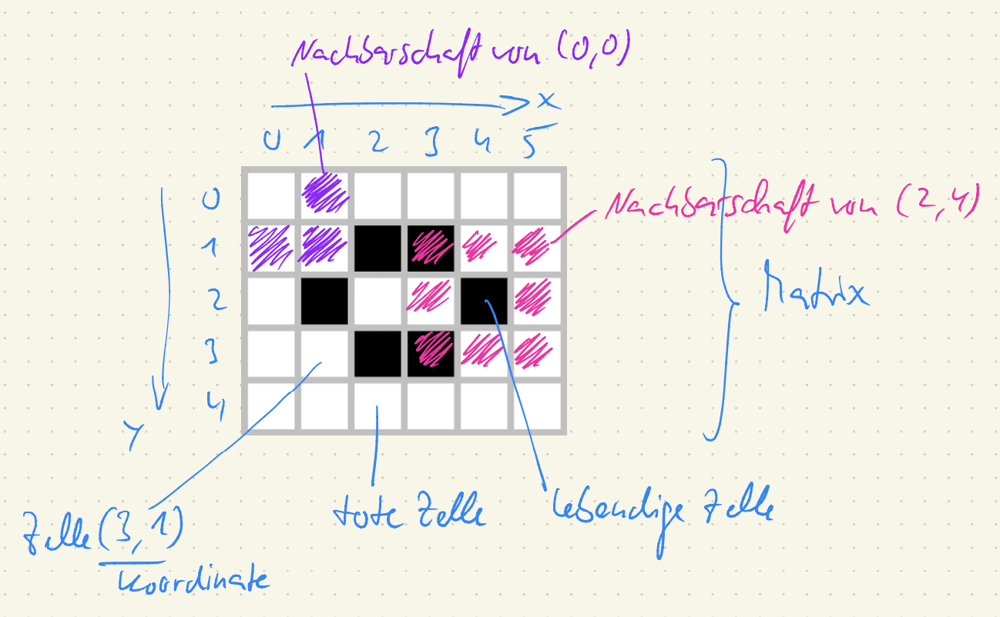

---

<!-- Page 365 of 493 -->

Musterlösung: 05-KomplementärcodiereninderKompliziertheit 356
- Matrix Load(string seedWorldFilename)
-MindestenszuTestzweckensolltedieMatrixZugriffaufdierohenZellen
geben, z.B. in der Form - Achtung: Pseudocode! - bool Matrix[int
y, int x] oder bool[,] Matrix.Cells(). Dann kann im Test der
Matrixinhalt verglichen werden mit einem erwarteten boolschen Array.
• UnddieerzeugtenGenerationenmüssengespeichertwerden.Dafür
ist ebenfalls eine Matrix der Ausgangspunkt. Sie ist der zentrale
Domänendatentyp.
• void Store(string seedWorldFilename, int generati-
onNumber, Matrix matrix)
– DerInhaltdergeschriebenenDateikannmiteinerGoldmaster-
Datei verglichen werden.
Der “Rest” ist das, was zwischen Load() und Store() stattfinden muss:
die Berechnung der Generationen. Wie das geschieht, ist auf dieser
Zerlegungsebene nicht wichtig. Es muss nur sichergestellt sein, dass die
Signatur der Funktion so gestaltet ist, dass sie komplementär zu den
bisherigen ist.
• void Calculate_next_generations(Matrix initialMatrix,
int numberOfGenerations, Action<int,Matrix> onNext-
Generation)
• Diese Funktion arbeitet rein in-memory. Sie kann daher leicht
getestet werden. Ob das angesichts eines Akzeptanztests nötig ist,
wird sich zeigen.
Mit einer Zerlegung in drei Teilprobleme scheint das Gesamtproblem auf
einer ersten, hohen Abstraktionsebene gelöst. Hier wurde die Persistenz
für den “Rest” aus dem Weg geräumt. Die Domäne arbeitet “in der Mitte”
rein in-memory. Das ist für automatisierte Tests immer eine gute Sache.
Zerlegungsebene 2
AuchwenndiegefundenenkomplementärenTeilproblemewenigerschwie-
rig sind als das Ausgangsproblem kann wohl von keinem gesagt wer-
den, dass es trivial sei. Und auch eine Klassifizierung als einfach wäre
vorschnell, solange noch weitere Zerlegungen auf der Hand liegen. Das
stepwise refinement 2.0 kann hier sehr vorteilhaft in eine zweite Runde
gehen.

---

<!-- Page 366 of 493 -->

Musterlösung: 05-KomplementärcodiereninderKompliziertheit 357
Matrix laden
• Die Matrix “von der Platte” zu lesen, d.h. die eigentliche Deper-
sistenz ist trivial mit einer Sprache wie C#. Dieses Teilproblem
herauszulösen, lohnt sich kaum, soll aber der Vollständigkeit halber
getan werden.
– string[] Read(string filename)
– Zunächst ist kein Test nötig, da die Implementation im Aufruf
einer Funktion der Standardbibliothek besteht.
• Wenn die Matrix in Rohform, d.h. im Persistenzdatenformat in-
memory ist, muss sie noch für die weitere Arbeit in den Domänen-
datentypen transformiert werden.
– Matrix DeSerialize(string[] rawMatrix)
– new[]{".X","X.","XX"} → Matrix.Cells entspricht
1 new[]{new[]{false,true}, new[]{true,false}, new[]{true,true}}
Matrix speichern
• Die Matrix “auf die Platte” zu schreiben, d.h die eigentliche Per-
sistenz, ist wiederum trivial in einer Sprache wie C#. Dennoch soll
mindestensausdidaktischenGründeneineFunktiondafürdefiniert
werden:
– void Write(string filename, string[] rawMatrix)
– Auch hier ist zunächst kein Test nötig, da die Implementation
im Aufruf einer Standardfunktion bestehen wird.
• Laden und Speichern sind komplementär, deshalb steht der Dese-
rialisierung eine Serialisierung gegenüber.
– string[] Serialize(Matrix matrix)
– Matrix mit Inhalt
1 new[]{new[]{false,true}, new[]{true,false}, new[]{true,true}}
→ new[]{".X","X.","XX"}
• Außerdem als letztes Thema im Zusammenhang mit der Persistenz:
die Erzeugung eines generationenspezifischen Dateinamens. Der
muss für jede Generation aus dem der Ausgangsdatei abgeleitet
werden.
– string VersionFilename(string seedWorldFilena-
me, int generationNumber)
– ("w.txt", 3) → "w-3.txt"

---

<!-- Page 367 of 493 -->

Musterlösung: 05-KomplementärcodiereninderKompliziertheit 358
Kalkulation der nächsten Generationen
Aus einer initialen GoLW, d.h. einer Matrix, werden alle weiteren Genera-
tionen berechnet. Eine neue Generation ist dabei der Ausgangspunkt für
die nächste. Mit jeder Generation geschieht dasselbe.
• Matrix Transform(Matrix matrix)
• Das Ergebnis für die Matrix in blinker.txt kann mit der Matrix
für blinker-1.txt verglichen werden.
Aber wie werden alle Generationen berechnet. Es gibt noch eine Passun-
genauigkeit zwischen Calculate_next_generations() und Trans-
form(). Es müssen die Generationen gezählt werden und es muss eine
nächste Generation einerseits “nach außen” gemeldet wie auch zur nächs-
ten Ausgangsgeneration gemacht werden.
Dafür ist Logik notwendig, doch diese Logik ist nicht komplementär zu
Transform(), sondern umfassend. Sie sollte in Calculate_next_-
generations() stecken. Dass das diese Funktion zu einem Hybriden
macht, ist prinzipiell nach IOSP unschön, andererseits aber nicht so
schlimm. Diese einfassende, iterierende Logik wird immer noch trivial
sein.
DasienichtexplizitineineOperationausgelagertist,wirdsieDarkLogic
genannt: sie ist dunkel wie Dunkle Materie in der Physik, weil sie etwas
bewirkt, man sie aber nicht in einem Blatt des Zerlegungsbaums sieht.
Solche Dark Logik kommt in den ordentlichsten Codebasen vor, sollte
jedochaufeinMinimumbegrenztsein.SieerzeugtHybride,woeigentlich
Integrationen sein sollten. Das reduziert die Testbarkeit und Verständ-
lichkeit. In Maßen jedoch ist Dark Logic verzeihlich. Oft tritt sie auch
musterhaft auf, wo es z.B. um die Iteration über Mengen geht (siehe
ausführlich dazu den Artikel Kontrollstrukturen in der Integration¹¹⁶).
Zerlegungsebene 3
Der Kern der Domäne ist die Funktion Transform(). Ist sie aber schon
trivial oder einfach? Das liegt nicht auf der Hand, deshalb lohnt eine
weitere Zerlegung.
¹¹⁶https://ccd-school.de/2017/02/kontrollstrukturen-in-der-integration/

---

<!-- Page 368 of 493 -->

Musterlösung: 05-KomplementärcodiereninderKompliziertheit 359
• Wichtig erscheint die Anwendung der Regeln auf eine Zelle. Dafür
ist zu wissen, wie deren Wert ist und wie die Werte ihrer Nachbarn.
– bool EvolveCell(bool value, bool[] neighboringVa-
lues)
– Für diese Funktion lassen sich leicht Testfälle aus den Regeln
bei Wikipedia¹¹⁷ ableiten.
Der Wert einer Zelle lässt sich aus der Matrix herauslesen für jede
Koordinate, z.B. bool Matrix[int y, int x]. Wenn bekannt ist,
welcheAbmessungendieMatrixhat(z.B.int Matrix.Heightundint
Matrix.Width), dann ist eine Iteration über alle Zellen leicht möglich.
• Auch die Werte der Nachbarzellen lassen sich über diesen Zugriff
auslesen. Doch es ist für die Logik, die EvolveCell() aufruft,
einfacher, die Bestimmung der Nachbarschaft der Matrix zu über-
lassen. Ein Datentyp für die Maxtrix macht jetzt wirklich Sinn.
– bool[] Matrix.Neighbors(int y, int x)
– Für diese Funktion sollten mindestens zwei Reifetests existie-
ren: einer, der die Nachbarschaft einer Zelle in der Mitte über-
prüft, und einer für eine Zelle am Rand mit unvollständiger
Nachbarschaft.
Esist nunfast allesbeisammen: Derneue Werteiner Zellekannberechnet
werden. Die dafür benötigte Nachbarschaft lässt sich beschaffen. Beides
muss allerdings noch verbunden und für alle Zellen durchgeführt werden.
Dafür ist weitere Logik nötig. Die kann als Dark Logic aus der Zerlegung
herausgehalten werden - oder wird zumindest noch zum Teil in eine
weitere Funktion verpackt für bessere Testbarkeit.
• Zur Reduktion der Dark Logic kann als weiteres Teilproblem her-
ausgezogen werden: die Beschaffung aller Zellen mit ihren Nach-
barschaften.
– (int y, int x, bool value, bool[] neighboringVa-
lues)[] EnumerateCells(Matrix matrix)
– Der Code erscheint trivial und wir durch den Test auf Trans-
form() überprüft.
¹¹⁷https://en.wikipedia.org/wiki/Conway’s_Game_of_Life#Rules

---

<!-- Page 369 of 493 -->

Musterlösung: 05-KomplementärcodiereninderKompliziertheit 360
Was bleibt, ist der Zusammenbau der Ergebnismatrix. Innerhalb der
Iteration über alle Zellen sollte dafür nach Evolve() allerdings schlicht
eine Zuweisung des neuen Wertes an eine neue Matrix nötig sein.
Als “Geschichte” zusammengefasst läuft die Transformation also so ab:
Für die aktuellen Werte aller Zellen in der Matrix (EnumerateCells())
werden die Nachbarschaften bestimmt (Matrix.Neighbors()) und da-
mitdannderWertfürdienächsteGenerationdereinerZelle(EvolveCell()).
Klingt das für dich plausibel?
Reflexion
Die Aufgabe hat schon eine etwas andere Größenordnung als die Um-
wandlung römischer Zahlen. Sie als kompliziertes Problem in der Codie-
rung präsentiert zu bekommen, ist normalerweise zu viel. Eine vorher-
gehende Entwurfsphase (siehe das Kapitel Die Anforderung-Logik Lücke
im Band Test-first Codierung) sollte schon feingranularere Funktionen in
ihrem Modell geliefert haben.
Die Zerlegung wie hier rein textuell zu betreiben, ist für diese Größenord-
nungaucheigentlichdasfalscheMittel.DerÜberblickgehtleichtverloren.
Deshalb lohnt eine Bestandsaufnahme vor dem Einstieg in die Lösung der
vielen Teilprobleme.
Das Verhalten wird durch eine Hierarchie von Funktionen hergestellt:

---

<!-- Page 370 of 493 -->

Musterlösung: 05-KomplementärcodiereninderKompliziertheit 361
Die GoLW wird als eigener Datentyp Matrix repräsentiert, um einer
primitive obsession¹¹⁸ vorzubeugen.
Zudemhatsichgezeigt,dassdasIOSPalsIdealzwareineNordsternfunkti-
on hat, allerdings nicht durchgängig eingehalten werden kann (und auch
nicht muss). In den Funktionen Evolve(), Calculate_next_genera-
tions() und Transform() wird es Dark Logic geben.
• AugenfälligistdasbeiCalculate_next_generations(),wenn
einAusgangsproblemnur1:1ineinTeilproblemzerlegtist(Transform());
das macht nur Sinn, wenn die Lösung des Teilproblems in Logik
eingebettet ist in der Funktion für das Ausgangsproblem.
• Ein weiterer Hinweis auf Dark Logic ist fehlende Passgenauigkeit
der Parametertypen der Teilprobleme zu denen des Ausgangspro-
blems. Transform() erhält und liefert eine Matrix, aber die
darunter hängenden Teilprobleme sehen nichts davon. Es muss
also Logik geben, die aus der Matrix etwas anderes macht und
schließlich aus den Ergebnissen der Funktionen für die Teilproble-
me wieder eine Matrix zusammenbaut.
Bei dieser Größenordnung eines komplizierten Problems braucht die Zer-
legung etwas Zeit. Das Feedback-liefernde Codieren wird hinausgezögert.
¹¹⁸http://wiki.c2.com/?PrimitiveObsession

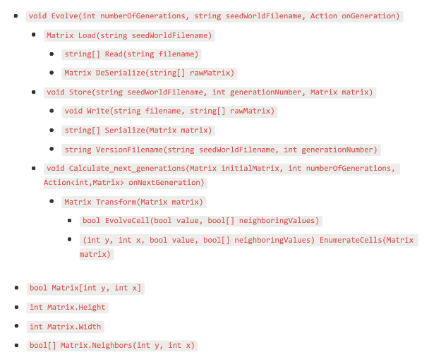

---

<!-- Page 371 of 493 -->

Musterlösung: 05-KomplementärcodiereninderKompliziertheit 362
Vielleicht fühlst du dich deshalb unsicher, ob denn eine solche Zerlegung
wirklich gut ist. Das ist verständlich, lässt sich bei schwierigeren Proble-
men ja aber nie vermeiden. Es gibt immer Probleme, die größer sind,
als dass du in 5 Minuten oder auch nur 5 Stunden endgültiges Feedback
bekommst, “ob alles passt”.
Die explizite Zerlegung wie hier gezeigt hat zumindest den Vorteil, dass
du einen Überblick gewinnst über das, was überhaupt zu tun ist. Würdest
du dich nur mit inkrementellen Tests vorarbeiten, würdest du einen
unbekannt großen Brocken vor dir herschieben. Das wäre, als würdest du
einen unbekannthohen Berg im Dunkeln hinaufwandern. Wannerreichst
du den Gipfel? Du siehst nicht einmal, ob oder wieviel du ihm näher
kommst.
Die Liste der Teilprobleme aber kannst du nun nacheinander abhaken.
Vielleicht ist das langweilig, aber zumindest ist es systematisch. Dass du
dichdabeianalles,wasundwieduzerlegthast,100%hältst,istnichtnötig.
Während der Implementation kannst du Erkenntnisse gewinnen, die dich
deinen Plan ändern lassen.
Eine Möglichkeit, um das Codieren nicht so lange hinaus zu schieben, ist
ein iteratives, mehr tiefenorientiertes Vorgehen. Oben wurde die Zerle-
gung Ebene für Ebene vorangetrieben und vollständig abgeschlossen. Sie
hätte alternativ aber auch nach Erreichen der ersten Blätter (Read() und
DeSerialize()) erst einmal beendet werden können, um einen Teil der
Persistenz inkl. Matrix zu implementieren. Danach hätte sie fortgesetzt
werden können, bis wieder Blätter erreicht worden wären.
Ob dabei zuerst die Persistenzäste des Zerlegungsbaums verfolgt würden
oder die Domäne, ist wohl eine Sache der persönlichen Präferenz. Es
ist lediglich zu bedenken, dass ohne vollständige Zerlegung womöglich
Informationen fehlen bei der Implementation eines Teils.
Der Wunsch nach Feedback ist gegen den Wunsch nach Überblick
abzuwägen.
Akzeptanztests
Vor oder nach der Zerlegung, in jedem Fall vor der bottom-up Codierung
der Lösungen zu den Teilproblemen, müssen die Akzeptanztests angelegt
werden.

---

<!-- Page 372 of 493 -->

Musterlösung: 05-KomplementärcodiereninderKompliziertheit 363
Hier beispielhaft einer dieser Tests:
1 private const string TEST_DIR = "test";
2
3 [Fact]
4 public void Test1() {
5 const string SEED_WORLD_FILENAME = "block.txt";
6 Prepare_filesystem(SEED_WORLD_FILENAME);
7 var sut = new GameOfLifeEvolution();
8
9 var nResultGenerations = 0;
10 sut.Evolve(1, TEST_DIR + "/" + SEED_WORLD_FILENAME,
11 () => nResultGenerations++ );
12
13 nResultGenerations.Should().Be(1);
14 Compare_files(TEST_DIR + "/" + SEED_WORLD_FILENAME,
15 "testdata/" + SEED_WORLD_FILENAME);
16 Compare_files(GenerationFilename(SEED_WORLD_FILENAME, 1),
17 TEST_DIR + "/" + SEED_WORLD_FILENAME);
18 File.Exists(GenerationFilename(SEED_WORLD_FILENAME, 2)).Should().BeFalse();
19 }
Der hat die übliche Arrange-Act-Assert Struktur¹¹⁹:
• Zu Anfang werden Vorbereitungen getroffen. Dazu zählt z.B. das
Löschen von Testdateien die womöglich von vorhergehenden Test-
läufen übrig geblieben sein könnten.
• Dann wird das System under Test (SUT) aufgerufen.
• Schließlichwirdüberprüft,obdieerwartetenErgebnisseproduziert
wurden.
Input und Output auf Akzeptanztestebene bestehen aus Dateien. Deshalb
ist die Einrichtung und Überprüfung etwas aufwändiger als bei anderen
Tests, bei denen das SUT nur auf in-memory Daten arbeitet.
UmdenTestcodeüberschaubarzuhalten,wurdeeinigeseinerLogiksogar
in Funktionen ausgelagert, die in mehreren Tests Verwendung finden.
¹¹⁹http://wiki.c2.com/?ArrangeActAssert

---

<!-- Page 373 of 493 -->

Musterlösung: 05-KomplementärcodiereninderKompliziertheit 364
1 void Prepare_filesystem(string seedFilename) {
2 if (Directory.Exists(TEST_DIR)) Directory.Delete(TEST_DIR, true);
3 Directory.CreateDirectory(TEST_DIR);
4 File.Copy("testdata/" + seedFilename, TEST_DIR + "/" + seedFilename);
5 }
6
7 string GenerationFilename(string seedFilename, int generation) {
8 return TEST_DIR + "/" + Path.GetFileNameWithoutExtension(seedFilename)
9 + "-" + generation.ToString() + ".txt";
10 }
11
12 void Compare_files(string filename1, string filename2) {
13 File.ReadAllText(filename1).Trim().Should().Be(File.ReadAllText(filename2).Trim());
14 }
Testcode kann im Extremfall also selbst einen Umfang haben, der seine
Korrektheit schwer einschätzbar macht. Dann müsste womöglich Test-
code selbst zunächst getestet werden…
Allemal wäre das jedoch immer noch besser, als Produktionscode ungetes-
tet zu lassen. In der Automobilproduktion gibt es ja auch Prüfstände z.B.
fürMotoren.DassindumfänglicheWerkzeuge,diehergestelltwerden,um
Produktezuüberprüfen.AlssolchemüssensieselbstebenfallsmitSorgfalt
hergestellt werden. Diese Denkweise darf sich die Softwareentwicklung
auch zueigen machen.
Teilprobleme bottom-up lösen
Um die Teilprobleme Schritt für Schritt zu lösen und dabei den Überblick
nicht zu verlieren, lohnt es sich, sie als Aufgabenliste zur Hand zu haben
und nacheinander abzuhaken. Der obige Zerlegungsbaum tut dabei gute
Dienste.

---

<!-- Page 374 of 493 -->

Musterlösung: 05-KomplementärcodiereninderKompliziertheit 365
In welcher Reihenfolge du dich durch so einen Baum arbeitest, ist dir
überlassen. Mach dir das Leben nur nicht unnötig schwer. Deshalb gehe
ich so einen Baum bottom-up an - dabei ist allerdings im Grunde jedes
Blatt recht.
Matrix I - Grundfunktionen
Die Matrix zieht sich als Domänendatenstruktur durch die ganze Lösung.
Es liegt daher nahe, sie als erstes, als Grundlage zu implementieren.
1 [Fact]
2 public void Access_to_cells() {
3 var sut = new Matrix(3,2);
4 sut.Height.Should().Be(3);
5 sut.Width.Should().Be(2);
6
7 sut[2, 1] = true;
8 sut[2, 1].Should().BeTrue();
9 sut[0, 0].Should().BeFalse();
10
11 Assert.Throws<IndexOutOfRangeException>(() => sut[3, 0]);
12 Assert.Throws<IndexOutOfRangeException>(() => sut[0, 2]);
13 }
14
15
16 public class Matrix
17 {
18 private readonly bool[,] _cells;
19
20 public Matrix(int height, int width) {
21 _cells = new bool[height,width];
22 }
23
24 public int Height => _cells.GetLength(0);
25 public int Width => _cells.GetLength(1);

---

<!-- Page 375 of 493 -->

Musterlösung: 05-KomplementärcodiereninderKompliziertheit 366
26
27 public bool this[int y, int x] {
28 get => _cells[y, x];
29 set => _cells[y, x] = value;
30 }
31 ...
Die Implementation ist trivial und schnell getan. Die ersten Probleme im
Zerlegungsbaum lassen sich damit schon abhaken. Das macht zumindest
mir ein gutes Gefühl.
Waserledigtist,streichichinmeiner“Aufgabenliste”ab.
Aber die Matrix ist damit noch nicht fertig…
Matrix II - Nachbarschaft bestimmen
Die eigentlich spannende Methode der Matrix ist die zur Bestimmung der
Nachbarschaft einer Zelle. Das ist Domänenfunktionalität, die gut zu der
Datenstruktur passt.
Mit einigen Reifetests wird das Verhalten abgesteckt. Eine schrittweise
Annäherung scheint unnötig.

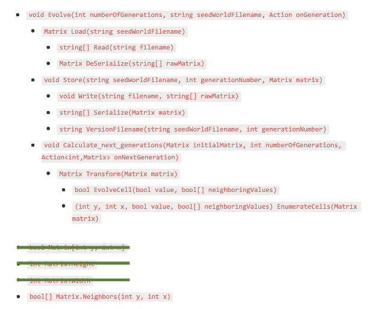

---

<!-- Page 376 of 493 -->

Musterlösung: 05-KomplementärcodiereninderKompliziertheit 367
1 [Fact]
2 public void No_neighborhood() {
3 var sut = new Matrix(1,1);
4 var result = sut.Neighbors(0, 0);
5 result.Length.Should().Be(0);
6 }
7
8 [Fact]
9 public void Regular_neighborhood() {
10 var sut = new Matrix(3,3);
11 sut[1, 1] = true; // the center cell
12
13 // the neighbors
14 sut[0,0] = true;
15 sut[1,2] = true;
16 sut[2,1] = true;
17
18 var result = sut.Neighbors(1, 1);
19 result.Length.Should().Be(8);
20 result.Count(v => v == true).Should().Be(3);
21 }
22
23 [Fact]
24 public void Corner_cell_neighborhood() {
25 var sut = new Matrix(3,3);
26 sut[0, 0] = true; // focus cell
27
28 // the neighbors
29 sut[0,1] = true;
30 sut[1,0] = true;
31
32 // not a neighbor
33 sut[2, 2] = true;
34
35 var result = sut.Neighbors(0, 0);
36 result.Length.Should().Be(3);
37 result.Count(v => v == true).Should().Be(2);
38 }
39
40
41 public class Matrix {
42 ...
43 public bool[] Neighbors(int y, int x) {
44 var neighbors = new List<bool>();
45 for(var row=y-1; row <= y+1; row++)
46 for (var col = x - 1; col <= x+1; col++) {
47 if (row >= 0 && row < this.Height &&
48 col >= 0 && col < this.Width &&
49 !(row == y && col == x))
50 neighbors.Add(_cells[row, col]);
51 }
52 return neighbors.ToArray();
53 }
54 }
DieImplementationisttrivial-allerdingsmussmandochgenauhinschau-
en, was die Bedingungen angeht, um Zellen jenseits des Matrixrandes
auszuschließenundauchdie,umderenNachbarschaftesgeht.Aberselbst
wenn das nicht auf Anhieb klappt, scheint mir eine Annäherung mit in-
krementellen Tests nicht nötig. Die Reifetests spannen ein Sicherheitsnetz
auf, durch das die Produktionslogik nicht fallen sollte.

---

<!-- Page 377 of 493 -->

Musterlösung: 05-KomplementärcodiereninderKompliziertheit 368
Immemehrdurchzustreichen,machtSpaß.IchsehemeinenFortschritt.
Serialisierung
BeimVerhaltensmodul(imGegensatzzurDatenstruktur)kannbottom-up
wieder bei jeder beliebigen Operation begonnen werden. Die Serialisie-
rung ist so gut wie jede andere, macht aber mit der Matrix weiter.
1 [Fact]
2 public void Serialize() {
3 var m = new Matrix(3, 2) {
4 [0, 0] = true,
5 [1, 1] = true,
6 [2, 0] = true
7 };
8 var result = GameOfLifeEvolution.Serialize(m);
9 result.Should().BeEquivalentTo(
10 "X.",
11 ".X",
12 "X.");
13 }
14
15
16 public static string[] Serialize(Matrix matrix) {
17 var rows = new string[matrix.Height][];
18 for (var row = 0; row < matrix.Height; row++) {
19 rows[row] = new string[matrix.Width];
20 for (var col = 0; col < matrix.Width; col++)
21 rows[row][col] = matrix[row, col] ? "X" : ".";
22 }
23 return rows.Select(r => string.Join("", r)).ToArray();
24 }
Wie die Nachbarschaftsbestimmung durchläuft die Serialsierung Zellen.

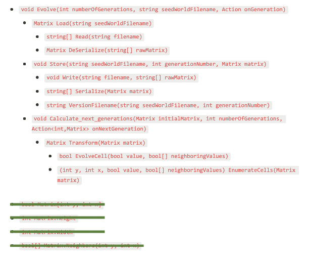

---

<!-- Page 378 of 493 -->

Musterlösung: 05-KomplementärcodiereninderKompliziertheit 369
Die geschachtelten Schleifen tauchen deshalb wieder auf. Ein bisschen Er-
fahrung aus der Matrix-Implementation kann also mitgenommen werden.
Dass die Serialisierung nicht Teil der Matrix ist, findet seine Begründung
im SRP: Die Aufgabe der Matrix ist es, Datenstruktur zu sein. Mehr
nicht. Die Aufgabe der (De)Serialisierung hingegen ist es, mit einer
Datenstruktur etwas zu tun. Wenn sich das Serialisierungsformat oder
der Algorithmus verändern, dann sollte deshalb nicht die Datenstruktur
angefasst werden müssen.
Mit einem Zerlegungsbaum als Aufgabenliste kann ich für jeden Schritt tauch den Kontext
sehen.
Deserialisierung
Es liegt nahe, die Deserialisierung der Serialisierung anzuschließen.

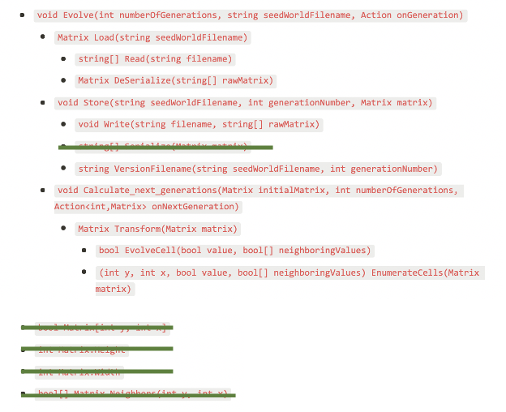

---

<!-- Page 379 of 493 -->

Musterlösung: 05-KomplementärcodiereninderKompliziertheit 370
1 [Fact]
2 public void Deserialize() {
3 var result = GameOfLifeEvolution.Deserialize(new[] {"X.", ".X", "X."});
4 result.Should().BeEquivalentTo(new Matrix(3, 2) {
5 [0, 0] = true,
6 [1, 1] = true,
7 [2, 0] = true
8 });
9 }
10
11
12 public static Matrix Deserialize(string[] rows) {
13 var matrix = new Matrix(rows.Length, rows[0].Length);
14 for (var row = 0; row < matrix.Height; row++)
15 for (var col = 0; col < matrix.Width; col++)
16 matrix[row, col] = rows[row][col] == 'X';
17 return matrix;
18 }
Dieses Funktionspaar ist trivial zu implementieren. Ist die Schleife einmal
gelungen, funktioniert sie für jede Größenordnung der Matrix.
Dateiname für eine Generation
EsmachtSinn,imBereichderPersistenzzubleiben,zuderdie(De)Serialisierung
zählt. Dann kann das Thema möglichst bald abgeschlossen werden. Als
Operation fehlt noch die Erzeugung des Namens für eine nächste Genera-
tion, in den die Versionsnummer der Generation eingearbeitet wird.

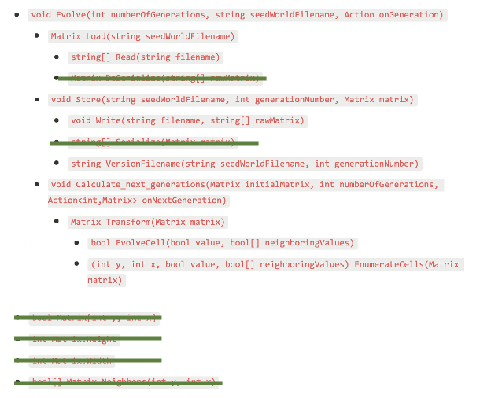

---

<!-- Page 380 of 493 -->

Musterlösung: 05-KomplementärcodiereninderKompliziertheit 371
1 [Fact]
2 public void VersionFilename() {
3 GameOfLifeEvolution.VersionFilename("d/f.txt", 42).Should().Be("d/f-42.txt");
4 }
5
6
7 public static string VersionFilename(string seedFilename, int versionNumber)
8 => seedFilename.Replace(".txt", $"-{versionNumber}.txt");
Die Annahme, dass im Dateinamen inkl. Pfad nur am Ende .txt vor-
kommt, mag etwas gewagt sein. Für die hiesige Übung soll sie aber
ausreichen. Es geht mir nicht um speziell vollständige/robuste Logik,
sondern ein Vorgehensmodell.
Persistenz
Es bleiben noch zwei Operationen für die Persistenz. Beide sind jedoch -
zumindst in C# - mit einem Einzeiler zu implementieren und unmittelbar
verständlich. Im Moment scheint es deshalb nicht besonders dringlich,
sie in eigene Methoden zu kapseln; sie müssen ja auch nicht getestet
werden. Durch den Einfluss in übergeordnete integrierende Funktionen
zur Persistenz inklusive (De)Serialisierung, wird der Testbarkeit und Ver-
ständlichkeit Genüge getan.
In diesem Inkrement werden daher Load() und Store() zusammen
umgesetzt. Beide sind trivial.

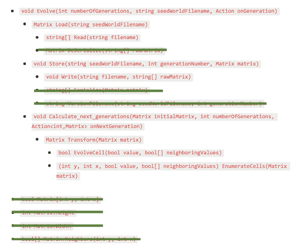

---

<!-- Page 381 of 493 -->

Musterlösung: 05-KomplementärcodiereninderKompliziertheit 372
1 private Matrix Load(string filename) {
2 var rows = File.ReadAllLines(filename);
3 return Deserialize(rows);
4 }
5
6 private void Store(string seedFilename, int generationNumber, Matrix matrix) {
7 var rows = Serialize(matrix);
8 File.WriteAllLines(VersionFilename(seedFilename, generationNumber), rows);
9 }
Zu diesen Integrationen gibt es keine Tests. Das, was der Aufruf der I/O-
Funktionen zu den schon getesteten Operationen hinzufügt, ist marginal.
Innerhalb der Akzeptanztests werden diese Methoden durchlaufen. Die
Testabdeckung ist also vorhanden. Sollte etwas schief gehen, können
gezielt Tests nachgerüstet werden.
Domäne I - Zellenaufzählung
Es bleibt nun die Domänenlogik zu codieren. Da ich mit den bisherigen
FunktionenschoneinigeErfahrunggesammelthabemitdemDurchlaufen
von Zellen, steht deshalb als nächstes deren Aufzählung für die zellenwei-
se Evolution an.

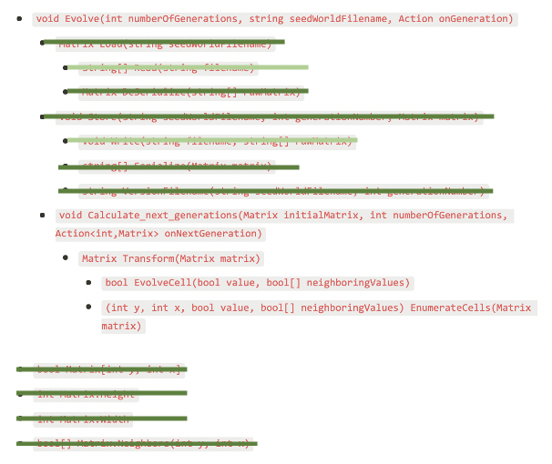

---

<!-- Page 382 of 493 -->

Musterlösung: 05-KomplementärcodiereninderKompliziertheit 373
1 [Fact]
2 public void EnumerateCells() {
3 var m = new Matrix(3, 2) {
4 [0, 0] = true,
5 [1, 1] = true,
6 [2, 0] = true
7 };
8 var result = GameOfLifeEvolution.EnumerateCells(m);
9 result.Should().BeEquivalentTo(new[] {
10 (0,0,true,new[]{false, false, true}),
11 (0,1,false,new[]{true,false,true}),
12
13 (1,0,false,new[]{true,false, true, true,false}),
14 (1,1, true, new[]{true,false, false, true,false}),
15
16 (2,0,true,new[]{false,true, false}),
17 (2,1,false,new[]{false,true, true})
18 });
19 }
20
21
22 public static IEnumerable<(int y, int x, bool value, bool[] neighboringValues)>
23 EnumerateCells(Matrix matrix) {
24 for (var row = 0; row < matrix.Height; row++) {
25 for (var col = 0; col < matrix.Width; col++)
26 yield return (row,col, matrix[row,col], matrix.Neighbors(row,col));
27 }
28 }
Dies ist eine Operation, auch wenn sie einen Funktionsaufruf enthält:
Matrix.Neighbors(). Grundsätzlich besteht zwar eine funktionale
Abhängigkeit zu Logik in dem Datentypen - doch die wird im Sinne des
IOSP “nicht gezählt”.
Das mag inkonsequent erscheinen und ist es in der reinen Theorie auch
- doch die Theorie ist weniger wichtig als der Effekt. Die Theorie soll
helfen, Testbarkeit und Verständlichkeit zu erhöhen. Wenn die durch
einen Widerspruch zur Theorie jedoch nicht (wesentlich) beeinträchtigt
werden, dann muss der Theorie nicht sklavisch gefolgt werden.

---

<!-- Page 383 of 493 -->

Musterlösung: 05-KomplementärcodiereninderKompliziertheit 374
Solange die Logik innerhalb von Datenstrukturen, die von Operationen
genutzt werden, keinen großen Umfang hat, ist sie schnell entwickelt und
stabil. Sie muss dann auch für die Tests von Operationen nicht durch
Attrappen ersetzt werden. So ein Fall liegt hier vor.
Die funktionale Abhängigkeit zwingt allerdings zu einer Codierungsrei-
henfolge: zuerst die Datenstruktur, dann die Operationen, die von ihr
abhängen. Deshalb stand die Matrix am Anfang der Codierung.
Domäne II - Den Zellenzustand der nächsten Generation
bestimmen
Was bleibt ist die Game-of-Life Funktion schlechthin. Sie bestimmt, ob
eine Zelle in der nächsten Generation lebendig oder tot ist.
Mehrere Tests sind hier angebracht. Die Logik könnte inkrementell voran-
getrieben werden. Die Variationsdimension ist die der drei Regeln.

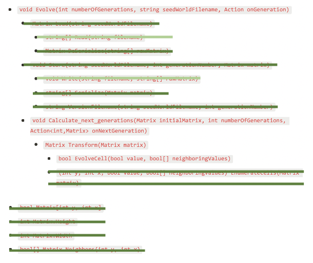

---

<!-- Page 384 of 493 -->

Musterlösung: 05-KomplementärcodiereninderKompliziertheit 375
1 [Fact]
2 public void Evolve_surviving_cell() {
3 GameOfLifeEvolution.Evolve(true, new[] {false, true, false, true}).Should().BeTrue();
4 GameOfLifeEvolution.Evolve(true, new[] {true, true, false, true}).Should().BeTrue();
5 }
6
7 [Fact]
8 public void Evolve_dead_cell() {
9 GameOfLifeEvolution.Evolve(false, new[] {true, true}).Should().BeFalse();
10 GameOfLifeEvolution.Evolve(false, new[] {true, true, true, true}).Should().BeFalse();
11
12 GameOfLifeEvolution.Evolve(false, new[] {true, true, true}).Should().BeTrue();
13 }
14
15 [Fact]
16 public void Evolve_dying_cell() {
17 GameOfLifeEvolution.Evolve(true, new[] {true}).Should().BeFalse();
18 GameOfLifeEvolution.Evolve(true, new[] {true, true, true, true}).Should().BeFalse();
19 }
20
21
22 public static bool Evolve(bool alive, bool[] neighboringValues) {
23 var numberOfLivingNeighbors = neighboringValues.Count(v => v);
24 if (alive) return numberOfLivingNeighbors == 2 || numberOfLivingNeighbors == 3;
25 return numberOfLivingNeighbors == 3;
26 }
Bei der Implementation wird dann aber schnell klar, dass die Regeln
so einfach zu prüfen sind, dass ein inkrementelles Codieren nicht lohnt.
Das Problem ist trivial, wenn erstmal die Nachbarschaft vorliegt. Dabei
helfen natürlich “Mengenfunktionen” wie Count() aus dem C# Linq-
Framework.

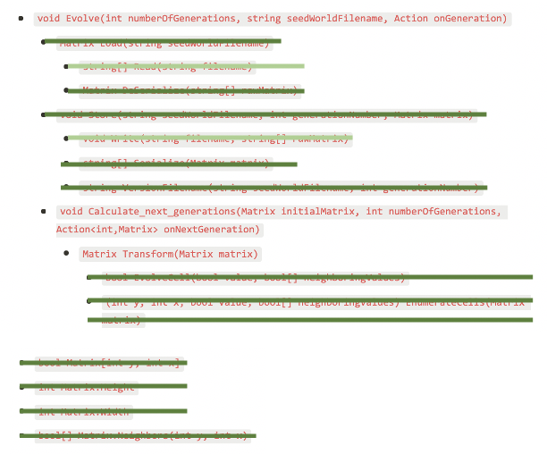

---

<!-- Page 385 of 493 -->

Musterlösung: 05-KomplementärcodiereninderKompliziertheit 376
Endspurt - Bottom-up Integration
DieverbleibendenFunktionensindIntegrationen.Diesindallesamttrivial
und brauchen keine eigenen Tests - zumindest nicht, solange die Akzep-
tanztests nicht Alarm schlagen. Die Theorie sagt, dass bei korrekten Ope-
rationen und korrekten Integrationen das Gesamtergebnis auch korrekt
sein sollte.
BeieinersogeringenTiefedesZerlegungsbaumesreichenfürdieÜberprü-
fung der Integrationen die Akzeptanztests der Ausgangsfunktion. Wächst
der Zerlegungsbaum jedoch, kann es sinnvoll sein, auch auf darunter
hängenden Integrationen die Korrekheit explizit zu überprüfen. Dann ist
die Lokalisation eines Problem bei später fehlschlagendem Akzeptanztest
einfacher.
Die Reihenfolge der Lösung der verbleibenden Probleme ist natürlich
bottom-up. Nur dann stehen die Bausteine auf jeweils höheren Ebenen
zur Verfügung:
1 Matrix Transform(Matrix currentGeneration) {
2 var nextGeneration = new Matrix(currentGeneration.Height, currentGeneration.Width);
3 foreach (var cell in EnumerateCells(currentGeneration)) {
4 nextGeneration[cell.y, cell.x] = Evolve(cell.value, cell.neighboringValues);
5 }
6 return nextGeneration;
7 }
8
9 void Calculate_next_generations(Matrix generation, int numberOfGenerations,
10 Action<int, Matrix> onNextGeneration) {
11 for (var iGeneration = 1; iGeneration <= numberOfGenerations; iGeneration++) {
12 generation = Transform(generation);
13 onNextGeneration(iGeneration, generation);
14 }
15 }
16
17 public void Evolve(int numberOfGenerations, string seedWorldFilename,
18 Action onGeneration) {
19 var firstGeneration = Load(seedWorldFilename);
20 Calculate_next_generations(firstGeneration, numberOfGenerations,
21 (iGeneration, generation) => {
22 Store(seedWorldFilename, iGeneration, generation);
23 onGeneration();
24 });
25 }
Erneut scheint ein Widerspruch zum IOSP vorzuliegen. In den Integra-
tionen tauchen Schleifen auf. Doch Praxis schlägt Theorie: Dass diese
Schleifen in den Integrationen stehen, macht sie nicht weniger trivial. Die
Integrationen müssen nicht für sich getestet werden. Dass die Schleifen
einen Fehler enthalten, ist sehr unwahrscheinlich angesichts ihrer Simpli-
zität. Was passieren soll, ist auf einen Blick verständlich.

---

<!-- Page 386 of 493 -->

Musterlösung: 05-KomplementärcodiereninderKompliziertheit 377
Der Gebrauch des Funktionszeigers in Form eines Lambda Ausdrucks in
Evolve() macht dir demgegenüber wahrscheinlich mehr Kopfschmer-
zen.
1 Calculate_next_generations(firstGeneration, numberOfGenerations,
2 (iGeneration, generation) => {
3 Store(seedWorldFilename, iGeneration, generation);
4 onGeneration();
5 });
Eine solche Schreibweise ist in objektorientierten Sprache auch 2020 noch
eher ungewöhnlich. Aber mit ein bisschen Übung lernst du, solch ein
Konstrukt genau so schnell zu verstehen, wie eine foreach-Schleife.
Der Unterschied zum Üblichen besteht in der Aufrufreihenfolge! Wenn
zwei Funktionen f() und g() gegeben sind, wie ist dann deren Aufruf-
reihenfolge in den folgenden Beispielen?
• f(g())
• f(g)
Im ersten Beispiel wird zuerst g() aufgerufen und danach f() mit dem
Ergebnis von g().
Im zweiten Beispiel hingegen wird f() aufgerufen mit g() als Parameter.
Die Funktion g() wird als Datenwert betrachtet, der an f() übergeben
wird, um dort ggf. genutzt zu werden. Diese Nutzung besteht innerhalb
der Empfängerfunktion dann im Aufruf der übergebenen Funktion.
Bei Calculate_next_generations() wird die “namenlose ad hoc
Funktion” (lambda function)
1 (iGeneration, generation) => {
2 Store(seedWorldFilename, iGeneration, generation);
3 onGeneration();
4 }
über den Parameter onNextGeneration aufgerufen

---

<!-- Page 387 of 493 -->

Musterlösung: 05-KomplementärcodiereninderKompliziertheit 378
1 for (var iGeneration = 1; iGeneration <= numberOfGenerations; iGeneration++) {
2 generation = Transform(generation);
3 onNextGeneration(iGeneration, generation);
4 }
Der Zerlegungsbaum ist damit nun vollständig implementiert. Wirklich
schwierig war das für keine Funktion. Alle komplementären Teilprobleme
waren wahrhaft trivial oder einfach. Nach der Zerlegung, die etwas
Überlegung gekostet hat, war die Codierung eher ein no-brainer, ja, schon
fast langweilig. Die größte Herausforderung bestand darin, nicht den
Überblick zu verlieren, welche Probleme noch zu lösen waren und was
dabei die beste Reihenfolge sein sollte. Dabei hat der Zerlegungsbaum als
Aufgabenliste gute Dienste geleistet:
Fertig!Allesabgehaktzuhaben,machtmireingutesGefühl.
DaserwarteteErgebnisistaucheingetreten.Akzeptanztestssindgrün.Die
Theorie hat recht behalten: Ist das Fundament der Operationen korrekt,
dann können darauf Integrationen aufgebaut werden, die an ihrer Spitze
ebenfalls zu korrekten Ergebnissen führen.
Zumindest stimmt das im Hinblick auf die Probleme, die mit der Zerle-
gung gelöst werden sollten. Denn wie sich herausstellt, sind das nicht
alle Probleme, die die Akzeptanztests beschreiben. Es sind nicht alle
Akzeptanztests grün.￿

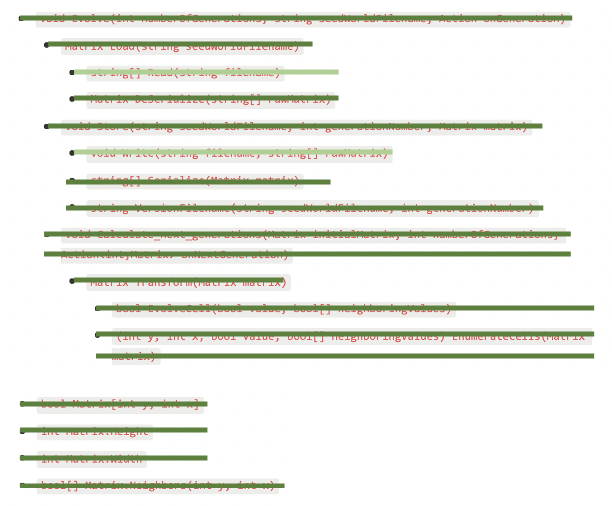

---

<!-- Page 388 of 493 -->

Musterlösung: 05-KomplementärcodiereninderKompliziertheit 379
Korrektur eines unerwarteten Fehlers
Der immer noch rote Akzeptanztest ist der, der überprüft, ob die Logik
nur die wirklich relevanten Generationendateien “für einen Auftrag”
zurücklässt. Das bedeutet, es dürfen nicht zu wenige, aber auch nicht zu
viele sein. Zu viele könnte es geben, falls dieselbe Ausgangsdatei schon
einmal durch Evolutionen gelaufen ist und mehr Generationen erzeugt
wurden als für den aktuellen Lauf angefragt sind.
1 [Fact]
2 public void Test3() {
3 const string SEED_WORLD_FILENAME = "blinker.txt";
4 Prepare_filesystem(SEED_WORLD_FILENAME);
5 var sut = new GameOfLifeEvolution();
6
7 sut.Evolve(2, TEST_DIR + "/" + SEED_WORLD_FILENAME,
8 () => {} ); // generate 2 result files
9
10 sut.Evolve(1, TEST_DIR + "/" + SEED_WORLD_FILENAME,
11 () => {} );
12
13 Compare_files(GenerationFilename(SEED_WORLD_FILENAME, 1),
14 "testdata" + "/blinker-1-goldmaster.txt");
15 File.Exists(GenerationFilename(SEED_WORLD_FILENAME, 2)).Should().BeFalse();
16 // only 1 result file should be present
17 }
Der Testcode ruft Evolve() deshalb zweimal auf: beim ersten Mal mit 2
Generationen, beim zweiten Mal nur mit einer. Die zweite Ergebnisdatei
des ersten Laufs darf nach dem zweiten Lauf nicht mehr vorhanden sein.
Dieses Teilproblem wurde bei der Zerlegung jedoch gar nicht identifiziert.
Es gibt dafür keine Funktion im Zerlegungsbaum.
So etwas kann jederzeit passieren. Auch bei aller Sorgfalt kannst du
Aspekte des Gesamtproblems übersehen. Das kann schon bei der Analyse
passieren und es fehlt dann ein Akzeptanztest. Das ist schlimmer, denn
dannstolpertersteinenachgelagertePhasederSoftwareentwicklungoder
gar erst der Kunde über diese Lücke. Sie zu schließen ist aufwändig, weil
dann der Kontext, in dem der Bug entstanden war, weniger klar ist.
OderduübersiehstetwasbeiderZerlegungangesichtsderAkzeptanztests,
wie es hier geschehen ist. Das ist nicht schön - ist aber durchaus zu
erwarten.
Die Reaktion ist darauf ein “back to the drawing board”, d.h. zurück zur
Zerlegung. Die Leitfrage lautet: Wie kann das noch ungelöste Teilpro-
blem möglichst an einer Stelle im Zerlegungsbaum nachträglich noch
eingehängt werden?

---

<!-- Page 389 of 493 -->

Musterlösung: 05-KomplementärcodiereninderKompliziertheit 380
HierlautetdieAntwort:EsfehltaneinerFunktionvoid Clear(string
seedFilename) zum Säubern des Zielverzeichnisses. Das Teilproblem
muss nur ganz zu Anfang gelöst werden, dann kann der Rest so bleiben:
1 public void Evolve(int numberOfGenerations, string seedWorldFilename,
2 Action onGeneration) {
3 Clear(seedWorldFilename);
4 var firstGeneration = Load(seedWorldFilename);
5 ...
EinweitererTestscheintfürdieseOperationnichtnötig.Sieisttrivialund
wird durch den (noch roten) Akzeptanztest abgedeckt:
1 private void Clear(string seedFilename) {
2 var seedPath = Path.GetDirectoryName(seedFilename);
3 var seedPrefix = Path.Combine(seedPath,
4 Path.GetFileNameWithoutExtension(seedFilename) + "-");
5 foreach (var filename in Directory.GetFiles(seedPath))
6 if (filename.StartsWith(seedPrefix))
7 File.Delete(filename);
8 }
Tatsächlich ist das Problem damit gelöst. Alle Akzeptanztests zeigen
Grün. Die Anforderungen an die Berechnung nächster Generationen für
eine Game-of-Life Welt sind erfüllt, so weit sie durch Akzeptanztests
beschrieben wurden.
DieneueFunktionhabeichinderAufgabenlistenachgetragen.

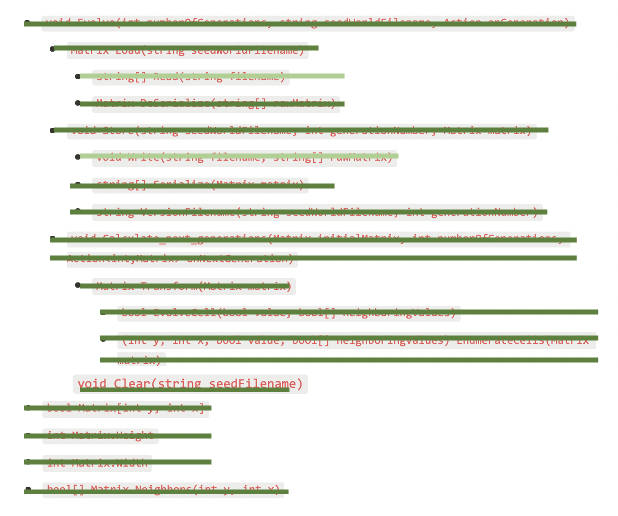

---

<!-- Page 390 of 493 -->

Musterlösung: 05-KomplementärcodiereninderKompliziertheit 381
Das Finale - Aufruf der Lösung als Programm
Der wesentliche Teil des Programms, das laut Aufgabenstellung realisiert
werden sollte, ist implementiert. Es fehlt nur noch die Nutzbarmachung
über einen Programmaufruf von der Kommandozeile. Bisher steht die
Logik lediglich über eine Funktion zur Verfügung, die Anwendern nicht
zugänglich ist.
Der fehlende Code ist zum Glück wiederum trivial.
1 static void Main(string[] args) {
2 var gol = new GameOfLifeEvolution();
3
4 var seedWorldFilename = args[0];
5 var numberOfGenerations = int.Parse(args[1]);
6
7 gol.Evolve(numberOfGenerations, seedWorldFilename,
8 () => Console.Write("."));
9
10 Console.WriteLine();
11 }
Dass der Code einen Hybriden darstellt, ist an dieser Stelle nicht schlimm,
denn automatisierte Tests finden auf dieser Ebene nicht mehr statt. Und
die Logik ist vernachlässigbar. Sie besteht aus wenigen Zeilen im Zu-
sammenhang mit der Benutzerschnittstelle, die ohnehin nicht oder nur
sehr schwer automatisiert getestet werden kann. Das Ganze ist jedoch
verständlich, würde ich sagen.
Allerdings stellt sich bei aller Trivialität bei Aufruf des Programms mit
gameoflife.exe blinker.txt 3 ein Fehler ein. Die Ausgangsdatei
liegt vor, darauf wird auch zugegriffen, dennoch wird eine Exception
im Zusammenhang mit dem Dateisystem geworfen. Die Zeile, die die
Exception auslöst, liegt in der neuen Clear() Funktion.
Wie sich nach kurzer Analyse zeigt, gibt es ein Missverständnis in Bezug
auf eine Funktion des .NET Framework:
var seedPath = Path.GetDirectoryName(seedFilename); lie-
fert eine leere Zeichenkette, wenn der Dateiname keinen Pfad hat. Die
führt dann bei Directory.GetFiles(seedPath) zu einem Fehler.
Um diese Ursache aufzudecken, braucht es nicht viel Zeit. Auch der
Bug Fix wäre schnell gemacht. Doch in einem solchen Fall solltest du
innehalten und nicht reflexartig die Lücke schließen! Stattdessen solltest
du sauber test-first vorgehen und zuerst einen fehlschlagenden, roten

---

<!-- Page 391 of 493 -->

Musterlösung: 05-KomplementärcodiereninderKompliziertheit 382
Test formulieren, der den Fehler automatisiert reproduziert. Den gibt
es bisher nicht, deshalb konnte der Bug auch bis zum manuellen Start
durchschlüpfen.
Dabei stellt sich die Frage: Wo in der Zerlegungshierarchie den Test an-
setzen? Ist das ein Akzeptanztest oder kann weiter unten geprüft werden.
Ein Akzeptanztest hat mehr Dokumentationscharakter - ist beim Setup
jedoch aufwändiger. Deshalb entscheide ich mich für einen Test direkt
auf der fehlerhaften Funktion:
1 [Fact]
2 public void Clear_without_path() {
3 File.WriteAllText("test.txt", "bar");
4 File.WriteAllText("test-1.txt", "bar");
5
6 GameOfLifeEvolution.Clear("test.txt");
7
8 File.Exists("test.txt").Should().BeTrue();
9 File.Exists("test-1.txt").Should().BeFalse();
10 }
Interessanterweise zeigt der Test, dass die Logik in Clear() bisher nicht
sogutzutestenwar.NichtnuristdieFunktionprivate,sieistaucheine
Instanzfunktion. D.h. ein Objekt müsste zuerst erzeugt werden, bevor die
Funktion aufgerufen werden kann.
WeildieFunktionaberkeineAbhängigkeitvonZustandhat,kannsieauch
statisch sein. Nach einem kleinen Umbau ist sie testbar(er) und der Bug
kann gefixt werden:
1 public static void Clear(string seedFilename) {
2 var seedPath = Path.GetDirectoryName(seedFilename);
3 if (seedPath == "") seedPath = ".";
4 ...
Reflexion
In der Codierung war das Game-of-Life Problem letztlich nicht sehr
schwierig. Dennoch war der Weg zum laufenden Programm nicht so kurz,
wie vielleicht zunächst angenommen. Das liegt an der Sorgfalt und der
Systematik, die mit stepwise refinement 2.0 ins Spiel gekommen sind.
Du hättest die Logik sicher in der halben Zeit irgendwie “runterhacken”
können. Damit wären die funktionalen Anforderungen erfüllt worden.
Doch sie wären nur “irgendwie” erfüllt worden, weil Korrektheit und
Ordnung auf der Strecke geblieben wären.

---

<!-- Page 392 of 493 -->

Musterlösung: 05-KomplementärcodiereninderKompliziertheit 383
Für den Moment scheint das egal. Doch mittel und langfristig ist es das
nicht.OhnedieSystematikeinesVorgehens,daseineverlässlicheSpurvon
automatisierten Tests zurücklässt und auch noch verständlichen Code, ist
funktionierender Code von heute ein Klotz am Bein morgen, wenn er an
neue Anforderungen angepasst werden muss.
Systematisch vorzugehen bedeutet nicht, keine Fehler mehr zu machen.
Es bedeutet aber, trittsicher zu jeder Zeit zu sein - und im Fehlerfall
nicht den Halt zu verlieren. Der Kunde kann Anforderungen übersehen,
du kannst Anforderungen übersehen: so etwas passiert. Dann muss der
Plan erweitert und unter Einhaltung der Prinzipien weiter als zunächst
gedacht gegangen werden (Beispiel: Clear()). Aber du kannst auch vom
Plan abweichen, den du dir selbst gemacht hast. Während der Planung
(Zerlegung) hast du nicht alle Informationen. Wenn du dann schon
etwas codiert hast, weißt du mehr und kannst den Weg ändern (Beispiel:
Lesen/Schreiben einer Datei nicht als eigene Funktionen ausprägen.).
DenPlanzuvisualisieren,hilftdirsicher.IndemduaufeinerListeabhakst
(oder auch etwas nachträgst), hast du ständig den Überblick. Du kannst
auch eine Pause machen und weißt später genau, wo du weitermachen
musst.KentBeck,derVatervonTDD,empfiehltdazuz.B.,miteinemroten
Test aufzuhören. Der ist dir eine Markierung für den Wiedereinstieg.
Ob du stepwise refinement 2.0 breiten- oder tiefenorientiert durchführst,
ist zu einem gewissen Grad Geschmacksfrage. Breitenorientiert erzeugst
du jedoch komplette Lösungen für das jeweilige Ausgangsproblem. Du ge-
winnst schneller Überblick, ob dein Ansatz trägt. Beim tiefenorientierten
Zerlegen besteht die Gefahr, den Baum zu weit auszutreiben und sich in
Details zu verlieren, ohne dass die Lösung als Ganzes schon sichtbar wäre.
Bisher ist die Modularisierung kein Thema gewesen. Sie ist es auch eigent-
lich nicht für die Codierung, die ein Modell voraussetzt und nur umsetzt.
Deshalb zeigt die Lösung hier nur zwei Klassen, eine für die naheliegende
Datenstruktur und eine zweite für die eigentliche Berechnungslogik. Mit
einem vorgelagerten systematischen Entwurf hätte die Codierung sicher
mit weiteren Modulen gestartet.
JemehrModuleauch,destomehröffentlicheFunktionen.ImMomentsind
die meisten Funktionen künstlich public, um die Testbarkeit herzustel-
len. Das darf nicht so bleiben, soll an dieser Stelle aber zunächst reichen.
An mehreren Stellen ist deutlich geworden: Das IOSP ist einGebot - keine

---

<!-- Page 393 of 493 -->

Musterlösung: 05-KomplementärcodiereninderKompliziertheit 384
Pflicht, kein Verbot. Es soll das Denken und die Zerlegung leiten. Es soll
dir auch ein ästhetisches Empfinden für ordentlichen Code entwickeln
helfen. Aber du musst es nicht auf Teufel komm ‘raus einhalten. Es
ist insofern eben auch keine Regel, sondern ein Prinzip. Solange Dark
Logicsich in einem überschaubarenRahmen bewegt,der Verständlichkeit
und Testbarkeit nicht beeinträchtigt, sind kleine Widersprüche zum IOSP
verträglich.

---

<!-- Page 394 of 493 -->

Musterlösung: 06 - Tests als
Treiber der
Modularisierung
Analyse
Eine Zusammenfassung der Anforderungen mit hervorgehobenen Domä-
nenbegriffen:
Eine Liste von Datensätzen wird im CSV-Format geliefert
und soll in eine ASCII-Tabelle gewandelt werden. Jede Zeile
der Tabelle entspricht einem Datensatz. Die Überschrift der
Tabelle wird aus dem ersten Datensatz gebildet, der die
Namen der Felder der Datensätze statt Daten enthält. Die
Breite der Spalten der Tabelle richtet sich nach dem jeweils
längsten Wert bzw. ihrem Feldnamen.
Die Anforderungsbeschreibung ist ansonsten insofern schon klar, als
dass zumindest ein Akzeptanztestfall und eine Funktionssignatur genannt
werden.
Inkrementelle Teilprobleme
Auch wenn das Gesamtproblem nicht einfach, sondern kompliziert ist,
lässt es sich in weniger komplizierte inkrementelle Probleme teilen. Du
siehst, ich mische hier zwei der vorgestellten Ansätze: das zerlegende und
das schrittweise Vorgehen. Weniger komplizierte Inkremente zerlegen, ist
eben weniger schwierig. Und später werden dann womöglich Blätter der
Zerlegung wieder inkrementell implementiert.
Die folgenden inkrementellen Tests sind insofern auch Akzeptanztestfälle,
alsdasssieaufderAPI-FunktionausderAnforderungsdefinitionansetzen.

---

<!-- Page 395 of 493 -->

Musterlösung: 06-TestsalsTreiberderModularisierung 386
Da sie jedoch nicht “vom Auftraggeber” kommen, sollten sie neutraler
Reifetests genannt werden. Ob sie später den Weg aller Gerüsttests gehen,
sei an dieser Stelle noch nicht entschieden.
• Inkrement I: Die CSV-Daten enthalten keine Datensätze, sondern
nur eine Zeile für die Feldnamen mit nur einem Namen. Beispiel:
1 Abc
• Inkrement II: Wie vor, aber es gibt mehrere Felder. Beispiel:
1 Abc;Defg
• Inkrement III: Die CSV-Daten enthalten auch Datensätze, aber
die Länge der Werte pro Feld entspricht immer der ihres Namens.
Beispiel:
1 Abc;Defg
2 xyz;abcd
3 123;9876
• Inkrement IV: Die CSV-Daten enthalten mehrere Datensätze, de-
ren Werte nie länger als die Feldnamen sind. Beispiel:
1 Abc;Defg
2 xy;abc
3 1;98
• Inkrement V: Es gibt keine Restriktionen mehr bzgl. der Länge der
Werte. Beispiel:
1 Abc;Defg;Hi
2 x;abcde;
3 1234;987;0
Die Inkremente sollten die Logik so weit getrieben haben, dass der
Akzeptanztest ebenfalls erfüllt ist.

---

<!-- Page 396 of 493 -->

Musterlösung: 06-TestsalsTreiberderModularisierung 387
Zerlegung der Inkremente inkl.
Codierung
Akzeptanztest
Vor Beginn der Zerlegung lohnt es sich schon, den Akzeptanztest auf-
zusetzen. Damit stimmst du dich auf die Aufgabe ein. Du erspürst die
Schnittstelle der Lösung, die du entwickeln willst. Indem du dich prak-
tisch mit den Testdaten auseinandersetzen musst, bekommst du auch ein
Gefühl für deren Struktur; daraus kannst du Vorteile bei der Suche nach
inkrementellen Testfällen ziehen.
1 public void Akzeptanztest() {
2 var csv = @"Name;Strasse;Ort;Alter
3 Peter Pan;Am Hang 5;12345 Einsam;42
4 Maria Schmitz;Kölner Straße 45;50123 Köln;43
5 Paul Meier;Münchener Weg 1;87654 München;65
6 Bruce Wayne;;Gotham City;36";
7
8 var result = CsvTabellierer.Tabellieren(csv);
9
10 result.Should().Be(@"Name |Strasse |Ort |Alter|
11 -------------+----------------+-------------+-----+
12 Peter Pan |Am Hang 5 |12345 Einsam |42 |
13 Maria Schmitz|Kölner Straße 45|50123 Köln |43 |
14 Paul Meier |Münchener Weg 1 |87654 München|65 |
15 Bruce Wayne | |Gotham City |36 |");
16 }
Inkrement I
In diesem Inkrement geht es um eine grundsätzliche Teilung von Da-
tendestrukturierung (Parsing) und Restrukturierung (Tabellenbau).
Der Tabellenbau ist klar erkennbar, selbst wenn die Daten nur einen Da-
tensatz mit einem Feld enthalten: string Formatieren(Datensatz
datensatz)
Auch wenn eigentlich für das Parsing nichts getan werden muss, weil der
“Quelltext” noch keine Struktur aufweist, erzwingt die Schnittstelle für
den Tabellenbau eine Funktion, die Datensätze produziert: Datensatz
Parsen(string csv)
Indem nur ein Datensatz produziert und konsumiert wird, stellen sich
die Funktionen zwar etwas dumm, weil es ja schon klar ist, dass es um

---

<!-- Page 397 of 493 -->

Musterlösung: 06-TestsalsTreiberderModularisierung 388
mehrere Datensätze gehen wird. Doch aus didaktischen Gründen sollen
die Datentypen so eng gehalten werden.
Der Typ Datensatz kann zunächst aus nur einem Wert bestehen: Da-
tensatz{string Wert}
Auch das ist eine Beschränkung aus didaktischen Gründen.
Der Akzeptanztest für dieses Inkrement ist leicht aufgesetzt:
1 [Fact]
2 public void Inkrement1() {
3 var csv = @"Abc";
4
5 var result = CsvTabellierer.Tabellieren(csv);
6
7 result.Should().Be(@"Abc|
8 ---+");
9 }
Anschließend stellt sich jedoch die Frage, ob weitere Tests nötig sind. Die
einfache Logik für dieses Inkrement könnte auch “einfach so” in die API-
Funktion geschrieben werden.
Insgesamt ist das Problem jedoch als kompliziert anzusehen. Deshalb
wurde es zerlegt und die Logik soll auf zwei Funktionen verteilt werden.
Sollten die mit eigenen Reifetests eingerüstet werden? Das Parsen ist hier
trivial.DasFormatierennurfürdiesesInkrementimGrundeauch,braucht
aber wohl ein paar Zeilen mehr.
Aus didaktischen Gründen könnte die Entscheidung für Gerüsttests aus-
fallen. Ganz praktisch jedoch sind sie nicht nötig. Es geht um die erste
Logik in dieser Lösung, die auch nur geringen Umfang hat. Sollte es ein
Problem bei der Umsetzung geben, wird das leicht zu lokalisieren sein.
1 private static Datensatz Parsen(string csv) {
2 return new Datensatz{Wert = csv};
3 }
4
5 private static string Formatieren(Datensatz datensatz) {
6 var tabelle = new StringWriter();
7 tabelle.WriteLine($"{datensatz.Wert}|");
8 tabelle.WriteLine($"{"".PadRight(datensatz.Wert.Length, '-')}+");
9 return tabelle.ToString().Trim();
10 }

---

<!-- Page 398 of 493 -->

Musterlösung: 06-TestsalsTreiberderModularisierung 389
Inkrement II
HiermusseinerseitsdasParsingausgebautwerden;esgilt,eineCSV-Zeile
in mehrere Felder zu zerlegen. Deshalb muss auch der Datentyp erweitert
werden: Datensatz{string[] Werte}. Eine weitere Zerlegung muss
nunschonaberRücksichtaufdasnehmen,wasbereitsalsCodevorhanden
ist.
Der Tabellenbau muss erweitert werden:
• Die mehreren Werte eines Datensatzes müssen zu einer Tabellen-
zeile verbunden werden.
• Die Unterstrichzeile muss in so viele Spalten gegliedert sein, wie es
Felder pro Datensatz gibt.
Eine weitere funktionale Zerlegung lohnt sich nur für den Tabellenbau:
• string BaueZeile(Datensatz datensatz)
• string BaueUnterstrich(int[] spaltenbreiten)
IndemBaueUnterstrich()aufeinMinimumanInput-Datenreduziert
ist - die Funktion muss ja nur die Spaltenbreiten kennen -, stellt sich
die Frage, woher diese Daten kommen. Wenn dafür keine Dark Logik
eingesetzt werden soll, muss es eine weitere Funktion geben, z.B.
• int[] SpaltenbreitenBestimmen(Datensatz datensatz)
Indem nur ein Datensatz an die Spaltenbreitenbestimmung übergeben
wird, stellt sich die Zerlegung etwas dumm. Es ist eigentlich ja schon
klar, dass für die Spaltenbreiten am Ende die Werte aller Datensätze in der
Spalte berücksichtigt werden müssen. Doch bei diesem Inkrement ist das
noch nicht relevant; aus didaktischen Gründen wird daher der Parameter
enger als ultimativ nötig gehalten.
Für dieses Inkrement ist zunächst der Datentyp zu verändern. Das führt
zurautomatischenAnzeigedurchdenCompiler,woVeränderungeninder
Logik nötig sind, um den bisherigen inkrementellen Test grün zu halten.

---

<!-- Page 399 of 493 -->

Musterlösung: 06-TestsalsTreiberderModularisierung 390
1 private static Datensatz Parsen(string csv) {
2 return new Datensatz{Werte = new[]{csv}};
3 }
4
5 private static string Formatieren(Datensatz datensatz) {
6 var tabelle = new StringWriter();
7 tabelle.WriteLine($"{datensatz.Werte[0]}|");
8 tabelle.WriteLine($"{"".PadRight(datensatz.Werte[0].Length, '-')}+");
9 return tabelle.ToString().Trim();
10 }
Anschließend sollte die bisherige Logik in Formatieren() auf die neu
eingeführten Funktionen verteilt werden. Eine weitere Refaktorisierung,
deren Gelingen der bisherige Test sicherstellt:
1 private static string Formatieren(Datensatz datensatz) {
2 var tabelle = new StringWriter();
3 tabelle.WriteLine(BaueZeile(datensatz));
4 tabelle.WriteLine(BaueUnterstrich(SpaltenbreitenBestimmen(datensatz)));
5 return tabelle.ToString().Trim();
6 }
7
8 private static string BaueZeile(Datensatz datensatz) {
9 return $"{datensatz.Werte[0]}|";
10 }
11
12 private static string BaueUnterstrich(int[] spaltenbreiten) {
13 return $"{"".PadRight(spaltenbreiten[0], '-')}+";
14 }
15
16 private static int[] SpaltenbreitenBestimmen(Datensatz datensatz) {
17 return datensatz.Werte.Select(x => x.Length).ToArray();
18 }
Wie sich herausstellt, wird Formatieren() damit zu einer hybriden
Funktion. In der Zerlegung fiel das noch nicht auf. Schlimm ist das aber
auch nicht. Die Logik ist ja trivial: es wird nur eine Datenstruktur befüllt.
Erst jetzt ist das neue Testinkrement dran:
1 [Fact]
2 public void Inkrement2() {
3 var csv = @"Abc;Defg";
4
5 var result = CsvTabellierer.Tabellieren(csv);
6
7 result.Should().Be(@"Abc|Defg|
8 ---+----+");
9 }
In welchen Funktionen ist zu seiner Befriedigung in die Logik einzugrei-
fen? Und braucht es dafür stützende Gerüsttests?
Die Erweiterung des Parsing ist trivial. Kein Gerüsttest nötig, weil ein
Fehler hier sofort auffallen würde:

---

<!-- Page 400 of 493 -->

Musterlösung: 06-TestsalsTreiberderModularisierung 391
1 private static Datensatz Parsen(string csv) {
2 return new Datensatz{Werte = csv.Split(';')};
3 }
Die Spaltenbreitenbestimmung ist schon bei der Refaktorisierung recht
allgemein angelegt worden. Dort ist kein weiterer Eingriff nötig und der
bisherige inkrementelle Tests ist grün.
Und auch die beiden anderen neuen Funktionen scheinen nicht so schwie-
rig zu erweitern - zumindest dank leistungsfähiger C#-Funktionen. Die
Entscheidung fällt daher auch hier gegen Gerüsttests, um etwas schneller
voranzukommen. Sollte sich im Übermut ein Fehler einschleichen, ist es
ja aber leicht, einen Gerüsttest einzuziehen, da die Logik schon auf sehr
spezifische Funktionen verteilt ist.
1 private static string BaueZeile(Datensatz datensatz) {
2 var spaltennamen = datensatz.Werte.Select(x => x + "|");
3 return string.Join("", spaltennamen);
4 }
5
6 private static string BaueUnterstrich(int[] spaltenbreiten) {
7 var spaltennamenunterstreichungen = spaltenbreiten.Select(x => $"{"".PadRight(x, '-')\
8 }+");
9 return string.Join("", spaltennamenunterstreichungen);
10 }
Inkrement III
Jetzterstgiltes,mehrereDatensätzezuverarbeiten.Ausdem“0-dimensionalen”
einen Feldnamen in Inkrement I ist zunächst die “1-dimensionale” Zeile
mit mehreren Feldnamen in Inkrement II geworden - und nun geht es
um die finale “2. Dimension”. Damit sind die Quelldaten vollständig
aufgespannt.
• HierzumussdasParsingausgebautwerdenundliefertnunmehrere
Datensätze zurück: Datensatz[] Parsen(string csv)
• Darausfolgt,dassdieTabellenformatierungebenfallsmitmehreren
Datensätzenumgehenmuss:string Formatieren(Datensatz[]
datensätze)
• Dasselbe kann für den Zeilenbau gesagt werden. Ist das aber eine
neue Funktion oder die bisherige “aufgebohrt” für die Verarbei-
tung mehrerer Zeilen? Besser Ersteres, weil dann die bisherige

---

<!-- Page 401 of 493 -->

Musterlösung: 06-TestsalsTreiberderModularisierung 392
BaueZeile() Funktion erhalten bleiben kann: string[] Bau-
eZeilen(Datensatz[] datensätze) Allerdings wird Baue-
Zeilen() Dark Logic enthalten, um BaueZeile() mehrfach
aufzurufen.
Bei der Codierung zunächst wieder Refaktorisierung im Hinblick auf
die veränderten Signaturen und dann auch die neue Funktion BaueZei-
len(). Die bisherigen Tests stützen diese Anpassung. Eben waren sie
noch Reifetests, jetzt wirken sie als Regressionstests “im Kleinen”.
1 private static Datensatz[] Parsen(string csv) {
2 return new[]{new Datensatz{Werte = csv.Split(';')}};
3 }
4
5 private static string Formatieren(Datensatz[] datensätze) {
6 var tabelle = new StringWriter();
7 var zeilen = BaueZeilen(datensätze);
8 tabelle.WriteLine(zeilen[0]);
9 tabelle.WriteLine(BaueUnterstrich(SpaltenbreitenBestimmen(datensätze[0])));
10 return tabelle.ToString().Trim();
11 }
12
13 private static string[] BaueZeilen(Datensatz[] datensätze)
14 => datensätze.Select(BaueZeile).ToArray();
15
16 private static string BaueZeile(Datensatz datensatz) {
17 var spaltennamen = datensatz.Werte.Select(x => x + "|");
18 return string.Join("", spaltennamen);
19 }
Interessanterweise hat sich jetzt herausgestellt, dass die befürchtete Dark
LogicinBaueZeilen()wirklichvernachlässigbarist.DieC#Linq“Men-
genfunktion” select() macht es möglich. Bei BaueZeilen() handelt
es sich ingesamt nur um ein geradliniges Mapping von Datensätzen auf
Zeichenketten: jeder Datensatz wird in eine Zeile umgewandelt.
Das Testinkrement ist anschließend schnell umgesetzt…
1 [Fact]
2 public void Inkrement3()
3 {
4 var csv = @"Abc;Defg
5 xyz;abcd
6 123;9876";
7
8 var result = CsvTabellierer.Tabellieren(csv);
9
10 result.Should().Be(@"Abc|Defg|
11 ---+----+
12 xyz|abcd|
13 123|9876|");
14 }
…und wirft wieder die Frage auf: Brauchen die nun nötigen Veränderun-
gen die Stütze durch Gerüsttests?

---

<!-- Page 402 of 493 -->

Musterlösung: 06-TestsalsTreiberderModularisierung 393
Auch dieses Mal ließe sich wohl aus einem fehlschlagenden inkremen-
tellen Reifetest noch recht genau ablesen, wo in der Logik etwas schief
gegangen ist. Liegt ein Parsing-Problem vor oder ein Formatierungspro-
blem? Zur Fehlerlokalisierung braucht es keine Gerüsttests.
Aus einem anderen Grund mag hier jedoch zumindest ein Gerüsttest
empfehlenswert sein: Feedbackgeschwindigkeit. Mit einem Gerüsttest z.B.
fürs Parsen gibt es schon Feedback zur Qualität der Logik, bevor der
Akzeptanztest anschlagen kann. Damit der greift, wäre auch noch nötig,
die Logik für das Formatieren zu schreiben.
Im Rahmen einer so kleinen Aufgabe ist eine solche Verkürzung der
Feedbackschleife natürlich vernachlässigbar. Dennoch soll sie aus didak-
tischen Gründen gewählt werden: Sie gibt Beispiel für einen weiteren
Beweggrund für Zerlegung und Gerüsttests. Der Umfang an Logik zur
Herstellung eines Inkrements, wie es der Reifetest abprüft, wird dadurch
zwar nicht verringert. Aber es werden Ansatzpunkte für Tests geschaffen,
die die Zeit verkürzen können, um zumindest für Teilprobleme gewiss zu
sein, sie schon gelöst zu haben.
Zwei Gerüsttests für Parsen() sollen zu diesem Zweck genügen:
1 [Fact]
2 public void Parsen_Geruesttest1()
3 {
4 var csv = @"Abc;Defg
5 xyz;abcd";
6 var result = CsvTabellierer.Parsen(csv);
7
8 result.Should().BeEquivalentTo(new[] {
9 new CsvTabellierer.Datensatz {Werte = new[] {"Abc", "Defg"}},
10 new CsvTabellierer.Datensatz {Werte = new[] {"xyz", "abcd"}}
11 });
12 }
13
14 [Fact]
15 public void Parsen_Geruesttest2()
16 {
17 var csv = @"A;B;C
18 1;;3
19 ; ;";
20
21 var result = CsvTabellierer.Parsen(csv);
22
23 result.Should().BeEquivalentTo(new[] {
24 new CsvTabellierer.Datensatz {Werte = new[] {"A", "B", "C"}},
25 new CsvTabellierer.Datensatz {Werte = new[] {"1", "", "3"}},
26 new CsvTabellierer.Datensatz {Werte = new[] {"", " ", ""}}
27 });
28 }
Der erste ist angelehnt an den inkrementellen Reifetest, der andere fokus-
siert auf den Sonderfall, dass Felder in Datensäzten leer sind.

---

<!-- Page 403 of 493 -->

Musterlösung: 06-TestsalsTreiberderModularisierung 394
Und tatsächlich ist dann die Logik für das Parsen gar nicht so trivial, wie
zunächst angenommen. Es stellt sich nämlich die Frage, wie die CSV-
Zeichenkette in Zeilen gelegt werden kann. Sollte dafür ebenfalls ein
Split() eingesetzt werden? Oder doch besser eine andere Funktion aus
der Standardbibliothek? Eine Variante könnte z.B. so aussehen:
1 public static Datensatz[] Parsen(string csv) {
2 var datensätze = new List<Datensatz>();
3 var reader = new StringReader(csv);
4 while (true) {
5 var csvZeile = reader.ReadLine();
6 if (csvZeile == null) break;
7
8 var datensatz = new Datensatz {Werte = csvZeile.Split(';')};
9 datensätze.Add(datensatz);
10 }
11 return datensätze.ToArray();
12 }
Zur Beruhigung zeigen die Gerüsttests sofort, ob der StringReader
korrekt benutzt wurde. Kein Warten auf Logik in Formatieren(), die
damit gar nichts zu tun hat.
Dass sich dann bei der Konzentration auf diese Funktion herausstellt, dass
nur eine Zeile Code nötig ist, um die Datensätze unterhalb der Feldnamen
zu formatieren, war nicht abzusehen:
1 private static string Formatieren(Datensatz[] datensätze) {
2 var tabelle = new StringWriter();
3 var zeilen = BaueZeilen(datensätze);
4 tabelle.WriteLine(zeilen[0]);
5 tabelle.WriteLine(BaueUnterstrich(SpaltenbreitenBestimmen(datensätze[0])));
6 zeilen.Skip(1).ToList().ForEach(tabelle.WriteLine);
7 return tabelle.ToString().Trim();
8 }
Die Gerüsttests für Parsen() werden dadurch in ihrem Nutzen nicht
geschmälert. Sie hatten ihre Dienst getan, als die Logik der Funktion
erfolgreich implementiert war. Sie hatten geholfen, die Aufmerksamkeit
zukonzentrieren.BeimWechselzuFormatieren()warkeineUngewiss-
heit mehr im Hinterkopf.
Inkrement IV
Bei diesem Inkrement müssen Feldwerte in den Tabellenzeilen nur “auf-
gefüllt” werden (padding), bis sie die Spaltenbreite erreichen. Wie schon
immer bei der Unterstreichungszeile muss die Spaltenbreite jetzt explizit

---

<!-- Page 404 of 493 -->

Musterlösung: 06-TestsalsTreiberderModularisierung 395
eingestellt werden; sie ergibt sich nicht automatisch durch die Länge des
Feldwertes.
Eine weitere Zerlegung scheint dafür nicht hilfreich. Die Veränderungen
betreffen lediglich BaueZeile(). Allerdings zieht das eine Anpassung
der Signaturen nach sich, denn die Spaltenbreiten müssen nun auch dort
bekannt sein:
• string[] BaueZeilen(Datensatz[] datensätze, int[]
spaltenbreiten)
• string BaueZeile(Datensatz datensatz, int[] spalten-
breiten)
Die Refaktorisierungen für dieses Inkrement sind einfach angebracht:
1 private static string Formatieren(Datensatz[] datensätze) {
2 var spaltenbreiten = SpaltenbreitenBestimmen(datensätze[0]);
3
4 var tabelle = new StringWriter();
5 var zeilen = BaueZeilen(datensätze, spaltenbreiten);
6 tabelle.WriteLine(zeilen[0]);
7 tabelle.WriteLine(BaueUnterstrich(spaltenbreiten));
8 zeilen.Skip(1).ToList().ForEach(tabelle.WriteLine);
9 return tabelle.ToString().Trim();
10 }
11
12 private static string[] BaueZeilen(Datensatz[] datensätze, int[] spaltenbreiten)
13 => datensätze.Select(x => BaueZeile(x, spaltenbreiten)).ToArray();
14
15 private static string BaueZeile(Datensatz datensatz, int[] spaltenbreiten) {
16 var spaltennamen = datensatz.Werte.Select(x => x + "|");
17 return string.Join("", spaltennamen);
18 }
Ins Auge fällt, dass nun die Spaltenbreitenbestimmung an den Anfang
gezogen ist, weil ihr Ergebnis mehrfach zum Einsatz kommt. Innerhalb
von Formatieren() zeigen sich zwei Verantwortlichkeiten, die klar
getrennt sind und zu einem Widerspruch zum SLA führen:
• Spaltenbreitenermittlung: hohes Abstraktionsniveau
• Tabellenbau: niedriges Abstraktionsniveau, weil aus mehreren Zei-
len Logik bestehend
Eine Refaktorisierung scheint angebracht und schnell gemacht:

---

<!-- Page 405 of 493 -->

Musterlösung: 06-TestsalsTreiberderModularisierung 396
1 private static string Formatieren(Datensatz[] datensätze) {
2 var spaltenbreiten = SpaltenbreitenBestimmen(datensätze[0]);
3 return BaueTabelle(datensätze, spaltenbreiten);
4 }
5
6 private static string BaueTabelle(Datensatz[] datensätze, int[] spaltenbreiten) {
7 var tabelle = new StringWriter();
8 var zeilen = BaueZeilen(datensätze, spaltenbreiten);
9 tabelle.WriteLine(zeilen[0]);
10 tabelle.WriteLine(BaueUnterstrich(spaltenbreiten));
11 zeilen.Skip(1).ToList().ForEach(tabelle.WriteLine);
12 return tabelle.ToString().Trim();
13 }
Formatieren() ist jetzt sehr übersichtlich - und das, was zum Bauen
einer Tabelle nötig ist, ist gut testbar herausgezogen in eine eigene
Funktion.
In dieser Funktion kann nun mit einem Blick durch die IOSP-Brille
wieder auffallen, dass es einen Widerspruch zum SLA gibt. Der ist jedoch
verschleiert durch die Erzeugung des StringWriter am Anfang.
Datenstrukturen werden gern am Anfang von Funktionen erzeugt, auch
wenn sie erst später benötigt werden. Das mag aus einer Gewohnheit
geschehen, wie sie von früheren Programmiersprachen erzwungen wur-
den. Oder es mag eine Idee von SRP dahinterstehen, das diesen Aspekt
an einem Ort bündeln will. In jedem Fall ist das eine Gewohnheit, die
manchmal die Ordnung vergrößert und manchmal verringert. Letzteres
ist hier der Fall.
Hier wird durch die Erzeugung des StringWriter am Anfang der
Aspekt des Zusammenbaus der Tabelle aus Textzeilen auseinanderge-
zogen. Das macht es schwerer, ihn zu erkennen. Und das macht eine
Refaktorisierung schwerer.
Eine kleine Veränderung in der Reihenfolge der Anweisungen macht klar,
was damit gemeint ist:

---

<!-- Page 406 of 493 -->

Musterlösung: 06-TestsalsTreiberderModularisierung 397
1 private static string BaueTabelle(Datensatz[] datensätze, int[] spaltenbreiten) {
2 var zeilen = BaueZeilen(datensätze, spaltenbreiten);
3
4 var tabelle = new StringWriter();
5 tabelle.WriteLine(zeilen[0]);
6 tabelle.WriteLine(BaueUnterstrich(spaltenbreiten));
7 zeilen.Skip(1).ToList().ForEach(tabelle.WriteLine);
8 return tabelle.ToString().Trim();
9 }
Nun sticht heraus, dass auch der Tabellenbau dem SLA widerspricht und
von einer Refaktorisierung profitieren kann:
1 private static string BaueTabelle(Datensatz[] datensätze, int[] spaltenbreiten) {
2 var zeilen = BaueZeilen(datensätze, spaltenbreiten);
3 var unterstrich = BaueUnterstrich(spaltenbreiten);
4 return ZeilenVerschweissen(zeilen, unterstrich);
5 }
6
7 private static string ZeilenVerschweissen(string[] zeilen, string unterstrich) {
8 var tabelle = new StringWriter();
9 tabelle.WriteLine(zeilen[0]);
10 tabelle.WriteLine(unterstrich);
11 zeilen.Skip(1).ToList().ForEach(tabelle.WriteLine);
12 return tabelle.ToString().Trim();
13 }
Jetzt ist dem IOSP Genüge getan. Und die Logik, die die Tabellenstruktur
auf eine Zeichenkette abbildet, ist wiederum testbar herausgezogen.
Nun zur zentralen Veränderung für dieses Inkrement an BaueZeile().
Auch hier soll mit einem Gerüsttest gestützt werden, da die Logik der
Funkion inzwischen recht tief im Funktionsbaum nach unten gewandert
ist. Nach den Refaktorisierungen, die einen weiten Blick erfordert haben,
kann ein Gerüsttest auch helfen, den Blick wieder zu fokussieren.
1 [Fact]
2 public void BaueZeile_Geruesttest() {
3 var datensatz = new CsvTabellierer.Datensatz{Werte = new[]{"A", "BB", "CCC"}};
4
5 var result = CsvTabellierer.BaueZeile(datensatz, new[]{3,3,3});
6
7 result.Should().Be("A |BB |CCC|");
8 }
Die Veränderung der Logik ist anschließend wieder nicht schwierig. Den-
nochisteshilfreich,fürihreÜberprüfungnichtAkzeptanztests“anwerfen
zu müssen”:

---

<!-- Page 407 of 493 -->

Musterlösung: 06-TestsalsTreiberderModularisierung 398
1 public static string BaueZeile(Datensatz datensatz, int[] spaltenbreiten) {
2 var spalteneinträge = datensatz.Werte.Select(Spalteneintrag_formatieren);
3 return string.Join("", spalteneinträge);
4
5 string Spalteneintrag_formatieren(string wert, int spaltenindex)
6 => wert.PadRight(spaltenbreiten[spaltenindex]) + "|";
7 }
Inkrement V
AbschließendbleibtnochdieErmittlungderSpaltenbreitenaufgrundaller
Datensätze. Bisher wurde nur die Überschrift einbezogen. Dafür ist keine
neue Funktion nötig, aber die Erweiterung einer Signatur:
• int[] SpaltenbreitenBestimmen(Datensatz[] datensät-
ze)
Zuerst Refaktorisierung über dem Sicherheitsnetz der bisherigen inkre-
mentellen Tests:
1 private static string Formatieren(Datensatz[] datensätze) {
2 var spaltenbreiten = SpaltenbreitenBestimmen(datensätze);
3 return BaueTabelle(datensätze, spaltenbreiten);
4 }
5
6 private static int[] SpaltenbreitenBestimmen(Datensatz[] datensätze) {
7 return datensätze[0].Werte.Select(x => x.Length).ToArray();
8 }
Gerüsttests? In diesem Fall definitiv Ja! Nur so kann gezielt überprüft
werden, ob die Varianten der Spaltenbreitenbestimmung abgedeckt sind:
Es kann der Feldname die Spaltenbreite determinieren oder ein Wert aus
einem Datensatz. In Akzeptanztests gehen solche Feinheiten schnell unter.
1 [Fact]
2 public void SpaltenbreitenBestimmen_Geruesttest() {
3 var datensätze = new[] {
4 new CsvTabellierer.Datensatz{Werte = new[]{"A", "BB", "CCC"}},
5 new CsvTabellierer.Datensatz{Werte = new[]{"1", "12", "1"}},
6 new CsvTabellierer.Datensatz{Werte = new[]{"1234", "1", "12"}},
7 };
8
9 var result = CsvTabellierer.SpaltenbreitenBestimmen(datensätze);
10
11 result.Should().BeEquivalentTo(new[] {4, 2, 3});
12 }
Tatsächlich ist die Logik für die Spaltenbreitenbestimmung dann nicht
ohne.Geschachtelte Schleifen und auch noch eine Fallunterscheidung nur
durch einen Akzeptanztest oder Reifetest zu überprüfen, wäre nicht sehr
punktgenau für diese Menge:

---

<!-- Page 408 of 493 -->

Musterlösung: 06-TestsalsTreiberderModularisierung 399
1 public static int[] SpaltenbreitenBestimmen(Datensatz[] datensätze) {
2 var spaltenbreiten = new int[datensätze[0].Werte.Length];
3 foreach(var datensatz in datensätze)
4 for (var i = 0; i < spaltenbreiten.Length; i++) {
5 var wertlänge = datensatz.Werte[i].Length;
6 if (wertlänge > spaltenbreiten[i])
7 spaltenbreiten[i] = wertlänge;
8 }
9 return spaltenbreiten;
10 }
Wie erwartet ist mit einem erfolgreichen Gerüsttest auch der inkremen-
telle Reifetest grün und ebenso der Akzeptanztest. Das Gesamtproblem
ist gelöst!
Reflexion
Die geschachtelte Anwendung von inkrementellen und komplementären
Tests war für dich vielleicht etwas ungewohnt, aber hat hoffentlich das
Problem für dich noch besser handhabbar gemacht. Sieh diesen Wechsel
an wie das Schalten zwischen Gängen beim Autofahren. Je nach Terrain
schaltest du hoch oder runter:
• Zunächst das Gesamtproblem inkrementell anzugehen entspricht
einem Runterschalten.
• Je Inkrement komplementär zu zerlegen, bedeutet noch weiter
runterzuschalten.
• UnddannnochGerüsttestsaufOperationenderZerlegung,schaltet
quasi in den kleinsten Gang.
Wiedugesehenhast,sinddieerstenbeidenGängeimmerimEinsatz.Aber
der “1. Gang” ist nicht immer nötig. Gerüsttests sind keine Pflicht. Sie
sind eine Hilfestellung, die du nutzen kannst, wenn es dir nötig erscheint,
weil du dich durch das sonstige Netz der Tests nicht genügend abgesichert
fühlst.
Aber nicht nur die Optionalität von Gerüsttests ist hier auffällig, sondern
auch das zwischenzeitliche Refaktorisieren. Classical TDD definiert die
Phasen red-green-refactor. Refaktorisierung steht dabei am Ende.
In der Umsetzung hier steht Refaktorisierung jedoch am Anfang und ist
auch optional.

---

<!-- Page 409 of 493 -->

Musterlösung: 06-TestsalsTreiberderModularisierung 400
• Refaktorisierung ist bei “inkrementell-komplementärem Vorgehen”
oft unnötig, weil die Zerlegung schon für gut strukturierten Code
gesorgt hat.
• Refaktorisierung steht am Anfang eines Inkrements, weil dann
klar ist, wofür und wohin refaktorisiert werden soll. Mit Blick
auf neue Anforderungen fällt es leichter zu überlegen, was eine
noch bessere Struktur sein könnte.
Die Liste der Funktionen ist am Ende umfangreich. Im folgenden Bild
stehen sie aber leider nicht in einem Aufrufzusammenhang. Die Zerle-
gungshierarchie, der Funktionsbaum ist nicht sichtbar:
StrukturansichtderKlasse CsvTabelliererinderC#IDE.
Deshalb solltest du dir das Ergebnis nochmal auf Papier oder in einem
Texteditor kurz und knapp vergegenwärtigen, z.B.

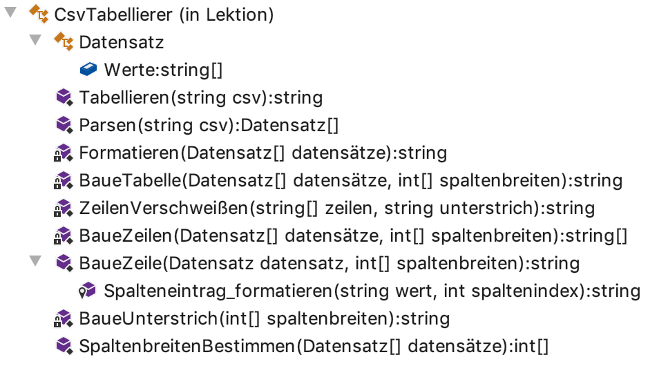

---

<!-- Page 410 of 493 -->

Musterlösung: 06-TestsalsTreiberderModularisierung 401
1 Tabellieren (Ta, Ti)
2 Parsen (Tg)
3 Formatieren
4 SpaltenbreitenBestimmen (Tg)
5 BaueTabelle
6 BaueZeilen
7 BaueZeile (Tg)
8 BaueUnterstrich
9 ZeilenVerschweißen
Ebenfalls eingetragen in dieser Übersicht ist, wo welche Tests ansetzen:
Ta=Akzeptanztests, Ti=inkrementeller Test, Tg=Gerüsttest.
Wenn du das siehst, ist die Frage: Ist die Modularisierung zufriedenstel-
lend, so dass alle Gerüsttests gelöscht werden können?
DassalleFunktionenbisherstatischsind,magfürdichauchungewöhnlich
sein in einer objektorientierten Sprache. Doch das tut der Methode keinen
Abbruch und übt auch keinen “Modularisierungsdruck” aus. Die Frage ist
imMomentallein:SindTestfälleinGerüsttestsauswelchenGründenauch
immer erhaltenswert?
Refaktorisierung mit nachträglicher
Modularisierung
ParsenundFormatierensinddiebeidenwesentlichenAspektedesGesamt-
problems. Das Parsen hängt mit dem Input-Datenformat zusammen, das
Formatieren mit dem Output-Datenformat. Das Parsen kann sich unab-
hängig vom Formatieren verändern. Zum Beispiel könnten die Daten im
JSON-Format geliefert werden, um daraus eine ASCII-Tabelle zu machen.
OderCSV-DatenkönntenineineHTML-Tabellegewandeltwerdensollen.
Solche Unabhängigkeit legt nahe, dass die zugehörige Funktionalität in
eigenen Modulen gekapselt wird. In diesem Fall ist dafür Parsen()
allemal ein Kandidat, weil darauf auch Gerüsttests definiert sind. Das
Modul wäre der CsvParser.
Innerhalb der Formatierung den Zeilenbau als eigenständig anzusehen
undauszulagern,umseinenGerüsttestzuerhalten,scheinthingegennicht
lohnend. Er hat einen guten Dienst für die Reife von BaueZeile() ge-
leistet, doch nun ist diese Logik ohne Fallunterscheidungen gut abgedeckt
durch Akzeptanztest und Testinkremente.

---

<!-- Page 411 of 493 -->

Musterlösung: 06-TestsalsTreiberderModularisierung 402
Für die Spaltenbreitenbestimmung hingegen würde es sich lohnen, die Va-
riationen dauerhauft deutlich in Tests zu dokumentieren. Dafür aber nur
dieFunktionSpaltenbreitenBestimmen()ineinModulauszulagern,
wäre nicht gerechtfertigt.
AndererseitswärenspezifischeTestfälle,diesichdieSpaltenbreitenbestim-
mung vornehmen, auf der Wurzelfunktion Tabellieren() verhältnis-
mäßig weit weg und durch die Formulierung mit CSV-Daten verrauscht.
Insofern könnte es angezeigt sein, wenn schon nicht Spaltenbreiten-
Bestimmen() so doch die darüber liegende Funktion Formatieren()
mit ihrem Ast zu extrahieren. So wäre der zweite Aspekt ebenfalls
freigestellt in einem Modul AsciiTabelle.
Als Folge dieser Entzerrung muss allerdings auch der Datentyp Daten-
satz aus seiner bisherigen Einlagerung in CsvTabellierer gelöst
werden. Er ist die Datenstruktur, die beide neuen Module verbindet.
Funktions- und Modulbaum nach der abschließenden Refaktorisierung angetrieben durch
denWunschnachErhaltvonGerüsttests.
DiebeidenGerüsttestsausParsen()werden1:1ModultestsfürCsvPar-
ser.DiebeidenanderenGerüsttestsjedochwerdenzusammengezogenin
einem Modultests für AsciiTabelle:

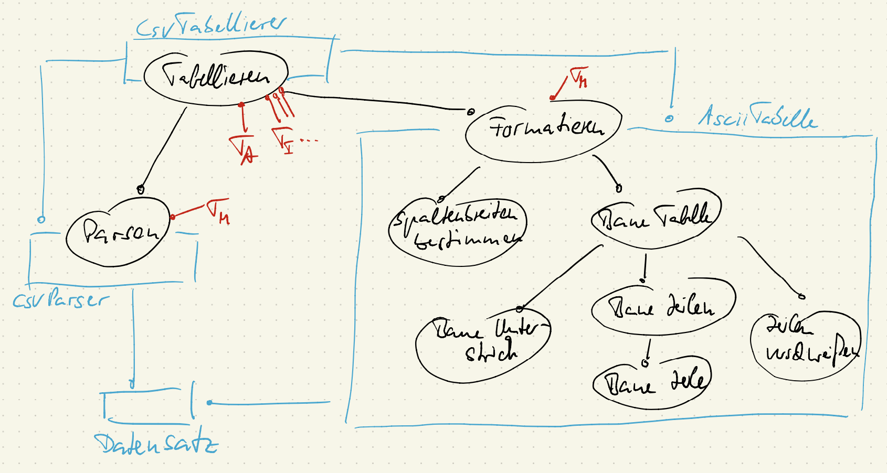

---

<!-- Page 412 of 493 -->

Musterlösung: 06-TestsalsTreiberderModularisierung 403
1 public void Formatieren() {
2 var datensätze = new[] {
3 new Datensatz{Werte = new[]{"A", "BB", "CCC"}},
4 new Datensatz{Werte = new[]{"1", "12", "1"}},
5 new Datensatz{Werte = new[]{"1234", "1", "12"}},
6 };
7
8 var result = AsciiTabelle.Formatieren(datensätze);
9
10 result.Should().Be(@"A |BB|CCC|
11 ----+--+---+
12 1 |12|1 |
13 1234|1 |12 |");
14 }
Hierin beweist sich sowohl BaueZeile() wie auch Spaltenbreiten-
Bestimmen().
CsvTabellierer enthält jetzt nur noch eine Funktion. Ist das gut, rich-
tig, ordentlich, objektorientiert? Warum nicht? Es ist für dich vielleicht
ungewöhnlich, aber wenn mehr Fokus auf langfristig hohe Produktivität
und damit Ordnung gelegt werden soll, dann ist damit zu rechnen, dass
es Ungewöhnliches zu tun gilt - jedenfalls durch die bisherige Brille
betrachtet.
CsvTabellierer ist eine ungewöhnliche, aber “ordentliche” Klasse. Ihr
Zweck ist sehr eng begrenzt, sie folgt dem SRP. Sie hat nicht nur eine
Funktion, die integriert, sondern ist selbst als Klasse Integrator. Durch
sie werden zwei verschiedene funktionale Aspekte zusammengefasst zu
etwas Neuem (composition).
Umgekehrt enthält CsvParser nicht nur eine Operation, sondern hat
selbst den Zweck nur zu operieren.
AsciiTabelle hingegen ist ebenfalls eine operierende Klasse, enthält
jedoch auch Integrationen. Das tut ihrem Zweck jedoch keinen Abbruch.
Zusammenfassung
Die Aufgabe hätte auch rein durch Zerlegung mit mehr Gerüsttests
angegangen werden können. Die Mischung mit einem inkrementellen
Vorgehen war nicht nötig, hat dir aber hoffentlich näher gebracht, dass
Regeln und Prinzipien selten ausschließlich, sondern im Verein, in einer
Mischung und abgewogen anzuwenden sind, um ein gutes Ergebnis zu
erzielen.

---

<!-- Page 413 of 493 -->

Musterlösung: 06-TestsalsTreiberderModularisierung 404
Wenn es die Inkremente einfacher gemacht haben, über eine Zerlegung
nachzudenken, dann ist viel gewonnen. Merke dir das Vorgehen:
1. Das Problem in eine Hierarchie geschachtelter Probleme zerlegen,
die schrittweise im Schwierigkeitsgrad steigen.
2. Geschachteltet Probleme mit der Zerlegung in komplementäre Teil-
probleme noch weiter im Schwierigkeitsgrad senken.
In keinem Fall ist die hier vorgestellte Lösung jedoch die Lösung. Sie ist
nicht alternativlos. Wenn du auf eine andere gekommen bist, kann die
genauso “ordentlich” sein. Allerdings solltest du deine Entscheidungen
begründenkönnen.DazudienenRegelnundPrinzipienals“Wertesystem”,
dem du zu Korrektheit und Ordnung folgst.

---

<!-- Page 414 of 493 -->

Musterlösung: 07 -
Testbarkeit steigern mit
Surrogaten
Die Lösung dieser Aufgaben ist insofern besonders, als dass vorhandener
Code weiter zu entwickeln ist. Die Lösung beginnt nicht auf der “grünen
Wiese”. Phasen der Refaktorisierung und der Erweiterung wechseln sich
deshalb ab. Ziel dabei ist, so viel wie möglich an Veränderungen über
dem Netz aus bestehenden Tests vorzunehmen, um Regressionen zu
vermeiden.
Aufgabe 1 - CSV-Daten tabellieren
Analyse
ZunächsteineAnalysederAnforderungen,umeinenÜberblickzubekom-
men, was überhaupt getan werden muss:
• Der vorhandene Code läuft bisher nur auf in-memory Daten und
muss nun in ein Programm eingebettet werden. ASCII-Tabellen sol-
len “interaktiv” für CSV-Daten in Dateien generiert und angezeigt
werden. Dazu braucht es Logik für die Belange:
– Dateizugriff: CSV-Daten aus einer Datei laden.
– Benutzerschnittstelle: ASCII-Tabelle auf der Console ausge-
ben.
– Parameter von der Kommandozeile lesen.
• Anzupassen ist der bisherige Code in Bezug auf das Parsing. Der
Parser muss mit den Trennzeichen konfiguriert werden.
• Abschließend sind alle Belange in der Klasse Application zu
integrieren
– Akzeptanztest auf Application aufsetzen.
– Application in Main() eines Programms aufrufen.

---

<!-- Page 415 of 493 -->

Musterlösung: 07-TestbarkeitsteigernmitSurrogaten 406
Planung
Die Analyse liefert Aufgaben, aber noch kein Vorgehen. In welcher Rei-
henfolge sollten die Aufgaben bearbeitet werden? Gibt es Abhängigkeiten
zwischen den Codeteilen, die erarbeitet werden müssen bzw. betroffen
sind?
1. Da schon Tests für die Domänenlogik existieren, ist ein Einstieg
dort naheliegend. Zuerst das Bestehende verändern über dem Si-
cherheitsnetz.
2. Als neuer Belang liegt anschließend die Parameterermittlung von
der Kommandozeile nahe. Die Logik arbeitet rein in-memory.
3. Die Benutzerschnittstelle ist trivial, aber kein Einzeiler. Eine dyna-
mische Bindung wird hier nötig sein, um damit Tests von anderer
Logik nicht zu erschweren.
4. Für die Application-Klasse liegt jetzt alles bereit. Das Laden der
Dateiist(inC#)einEinzeilerundmussnichtherausgezogenwerden.
Der Akzeptanztest soll auf einer Datei laufen, um möglichst viel
Logik zu testen.
5. Zum Schluss wird alles “in die Flasche geschoben” (“Buddelschiff-
Programmierung”) und Main() ausgefüllt.
Umsetzung
Domänenlogik erweitern um die
Trennzeichenkonfiguration
Die Anpassung der Logik für ein variables Trennzeichen ist trivial. Nur
eine Zeile ist im Grunde zu verändern:
1 var datensatz = new Datensatz {Werte = csvZeile.Split(trennzeichen)};
Wo vorher ein ';' fest eingetragen stand, steht nun eine Variable.
Die interessantere Frage ist deshalb: Wo wird die Variable gesetzt? Wie
kommt das Trennzeichen zum Parser, der bisher statische Klasse mit einer
statischen Methode Parsen() war?

---

<!-- Page 416 of 493 -->

Musterlösung: 07-TestbarkeitsteigernmitSurrogaten 407
Das Trennzeichen könnte als Parameter an Parsen() übergeben werden.
Ober das Trennzeichen könnte zu einem “Kontext” gehören, in dem die
Methode arbeitet. Es könnte einmal eingestellt werden und danach für
jeden Aufruf von Parsen() gelten.
Eine eindeutig richtige Entscheidung gibt es hier nicht. Ein Parameter
wäre völlig ok - doch aus didaktischen Gründen soll das Trennzeichen
zum “Kontext” gerechnet werden. Denn das hat Auswirkungen auf die
Struktur des Codes.
Konzeptionell ist das Trennzeichen damit “aus dem Weg”, dort wo CSV-
Daten geparset werden. Das macht den Code an der Stelle schlank. Der
Fokus ist weiterhin auf den Daten.
Das zieht allerdings nach sich, dass der Parser konfigurierbar wird. Dazu
muss die statische Klasse in eine Instanzklasse umgewandelt werden und
die statische Methode wird zu einer Instanzmethode. Das Trennzeichen
wird dann einmal über den Konstruktor gesetzt und steht fortan bei allen
Parsen()-Aufrufen zur Verfügung.
1 class CsvParser
2 {
3 private readonly char _trennzeichen;
4 public CsvParser(char trennzeichen) {
5 _trennzeichen = trennzeichen;
6 }
7
8 public Datensatz[] Parsen(string csv) {
9 var datensätze = new List<Datensatz>();
10 var reader = new StringReader(csv);
11 while (true) {
12 var csvZeile = reader.ReadLine();
13 if (csvZeile == null) break;
14
15 var datensatz = new Datensatz {Werte = csvZeile.Split(_trennzeichen)};
16 datensätze.Add(datensatz);
17 }
18 return datensätze.ToArray();
19 }
20 }
Ein Parser als Instanzklasse muss natürlich instanziiert werden. Wo soll
das geschehen? Im ersten Schritt kann das am Ort des Bedarfs passieren:

---

<!-- Page 417 of 493 -->

Musterlösung: 07-TestbarkeitsteigernmitSurrogaten 408
1 public static string Tabellieren(string csv) {
2 var parser = new CsvParser(';');
3
4 var datensatz = parser.Parsen(csv);
5 return AsciiTabelle.Formatieren(datensatz);
6 }
Modultests für den Parser müssen der geänderten Art der Klasse auch
nachgeführt werden. Dort ist der Parser nun zu instanziieren. Das ist ja
aber nicht zu übersehen, da der Compiler darauf hinweist.
Im nächsten Schritt ist jedoch zu überlegen, wie das Trennzeichen, dass
immer noch auf ';' fixiert ist, auch wenn der Ort dafür sich verschoben
hat, in der ganzen Domäne variabel gemacht werden kann. Wie kommt
Tabellieren() daran? Soll auch die Kompositionsklasse der Domäne
deshalb “imperativ” werden, d.h. zu einer Instanzklasse mutieren?
Die Vorteile für die Testbarkeit eines functional core für die Domäne
sollen für diese Variabilität hier aber nicht aufgegeben werden. Methode
und Klasse bleiben statisch; das Trennzeichen wird deshalb als Parameter
hineingereicht und dabei mit einem default Wert versehen:
1 public static string Tabellieren(string csv, char trennzeichen = ';') {
2 var parser = new CsvParser(trennzeichen);
3
4 var datensatz = parser.Parsen(csv);
5 return AsciiTabelle.Formatieren(datensatz);
6 }
Der bisherige Akzeptanztest muss durch die Optionalität des Parameters
nicht einmal verändert werden. Ein zweiter Akzeptanztest soll jedoch
hinzukommen, um die Domäne als Ganzes inkl. der Variabilität des
Trennzeichens zu überprüfen. Damit ist klar, dass der Parser korrekt
bedient wird:
1 [Fact]
2 public void Akzeptanztest2() {
3 var csv = "A,B";
4
5 var result = CsvTabellierer.Tabellieren(csv, ',');
6
7 result.Should().Be(@"A|B|
8 -+-+");
9 }
Kommandozeilenparameter lesen
Die Kommandozeile wird schon grundsätzlich durch die C# Runtime in
einzelne Parameter zerlegt, die dann in einem String-Array angeliefert

---

<!-- Page 418 of 493 -->

Musterlösung: 07-TestbarkeitsteigernmitSurrogaten 409
werden. Eigentlich ist der Zugriff also denkbar einfach. Die konkrete
Kommandozeilensyntax für das Programm erfordert jedoch etwas Logik,
weil ein Parameter optional ist.
Es stellt sich die Frage, wie diese Logik verpackt werden sollte. Ist sie Teil
der neuen Klasse Application? Oder gehört sie in eine eigene Klasse,
von der Application abhängig ist?
Eine eigene Klasse ist sinnvoll für diesen Belang. Die Entscheidung für die
Syntax der Kommandozeile kann sich unabhängig von anderen Belangen
jederzeit ändern. Die Details sollten in einer Klasse gekapselt werden.
Diese Klasse arbeitet in-memory; ihr Service muss nicht dynamisch
gebunden werden. Mit zwei Tests ist schnell beschrieben, welche Para-
metervarianten sie beherrschen muss:
1 [Fact]
2 public void Nur_Dateiname() {
3 var result = Commandline.Parsen(new[] {"foo.txt"});
4 result.Should().Be(("foo.txt", ';'));
5 }
6
7 [Fact]
8 public void Dateiname_und_Trennzeichen() {
9 var result = Commandline.Parsen(new[] {",", "foo.txt"});
10 result.Should().Be(("foo.txt", ','));
11 }
Die Logik dafür ist trivial - allerdings findet hier auch eine Entscheidung
darüber statt, ob das Programm überhaupt laufen soll. Falls keine Parame-
ter angegeben sind, wird es abgebrochen.
1 class Commandline {
2 public static (string Dateiname, char Trennzeichen) Parsen(string[] args) {
3 if (args.Length == 0) {
4 Console.WriteLine("Usage: showcsv [<Trennzeichen>] <Dateiname>");
5 Environment.Exit(1);
6 }
7
8 return (
9 args.Last(),
10 args.Length > 1 ? args[0][0] : ';'
11 );
12 }
13 }
Für den Fall des Abbruchs wird aber auf einen Test verzichtet; das ist ein
Sonderfall.ObdieLogikkorrektgreift,kanneineinmaligermanuellerTest
am Ende prüfen.

---

<!-- Page 419 of 493 -->

Musterlösung: 07-TestbarkeitsteigernmitSurrogaten 410
Noch sauberer wäre es gewesen, zumindest den harten Abbruch mit En-
vironment.Exit(1)ausderKlasseherauszuhaltenundihremAufrufer
oder gar Main() zu überlassen. Doch das hätte die Struktur komplexer
gemacht, was in diesem Fall nicht nötig erscheint.
Tabelle anzeigen
Die Ausgabe des Ergebnisses der Domänenlogik ist ebenfalls eine Kleinig-
keit-allerdingseine,dieeinemspäterenTestvonApplicationimWege
steht. Deshalb soll die Benutzerschnittstelle dynamisch gebunden werden.
1 public interface IUI {
2 void Anzeigen(string tabelle);
3 }
4
5 class UI : IUI {
6 public void Anzeigen(string tabelle) {
7 Console.WriteLine(tabelle);
8
9 var lines = tabelle.Split('\\n');
10 var anzahlDatensätze = lines.Length - 2; // Überschrift und Trennlinie abziehen
11 Console.WriteLine($"{anzahlDatensätze} Datensätze");
12 }
13 }
Zweierlei ist hierbei bemerkenswert:
• Es gibt keinen Test für diese Klasse. Vollständig automatisiert wäre
der vergleichsweise aufwändig, weil er die Ausgabe auf stdout
überprüfen müsste. Das ist nicht unmöglich, lohnt sich hier jedoch
nicht. Ebenfalls nicht lohnend scheint ein eigener “Prüfstand”, der
eine Kontrolle durch Augenscheinnahme ermöglicht. Ob die Logik
korrekt ist, wird sich beim ersten Start des Programms zeigen. Und
sollte sie komplizierter werden, liegt eine Extraktion nahe, die sie
vom I/O-API abkoppelt und automatisiert testbar macht.
• Die Tabelle wird mit Split() hier für die Zählung wieder in
Zeilen zerlegt, obwohl sie in der Domänenlogik schon in Zeilen-
form vorlag und am Ende “zusammengeschweißt” wurde. Das
ist doppelte Arbeit, geradezu ein Widerspruch zum DRY-Prinzip.
Dennoch wird das in Kauf genommen, weil es die Domäne von
der Benutzerschnittstelle entkoppelt. Zumindest auf die Schnelle ist
es einfacher, hier mit einem Funktionsaufruf zu zerlegen, statt die
Schnittstelle der Domäne zu ändern und Tests nachzuführen. Die
Domäne kann bleiben, wie sie ist; die Benutzerschnittstelle kann
ohne große Last damit leben, was ihr von dort gegeben wird.

---

<!-- Page 420 of 493 -->

Musterlösung: 07-TestbarkeitsteigernmitSurrogaten 411
Komposition I - Application
NunliegenalleBausteinevor,ausdenendieApplication-Klassezusam-
mengesetzt werden kann. Der geforderte Akzeptanztest beschreibt von
außen, wie der Umgang mit der Klasse aussehen soll:
1 [Fact]
2 public void Akzeptanztest() {
3 var uiSurrogate = Substitute.For<IUI>();
4 var sut = new Application(new[]{";", "personen.csv"},
5 uiSurrogate);
6
7 sut.Run();
8
9 uiSurrogate.Received().Anzeigen(@"Name |Strasse |Ort |Alter|
10 -------------+----------------+-------------+-----+
11 Peter Pan |Am Hang 5 |12345 Einsam |42 |
12 Maria Schmitz|Kölner Straße 45|50123 Köln |43 |
13 Paul Meier |Münchener Weg 1 |87654 München|65 |
14 Bruce Wayne | |Gotham City |36 |");
15 }
• Die Kommandozeile wird 1:1 an den Konstruktor übergeben.
• Die Ausgabe auf der Console wird als Surrogat übergeben, das am
Endebefragtwird,obdieerwartetenDatendortankommen,diedie
Produktionsklasse ausgeben soll.
Der Zugriff auf das Dateisystem hingegen taucht hier nicht auf. Er ist so
trivial und schnell, dass er im Test nicht ersetzt werden muss. Ganz streng
prinzipiell betrachtet mag das etwas unsauber sein; doch realistisch ist
es, sich im Einzelfall einmal so zu entscheiden. Weder Testbarkeit noch
Verständlichkeit leiden darunter.
1 class Application
2 {
3 private readonly (string Dateiname, char Trennzeichen) _kommandozeilenparameter;
4 private readonly IUI _ui;
5
6 public Application(string[] args, IUI ui) {
7 _kommandozeilenparameter = Commandline.Parsen(args);
8 _ui = ui;
9 }
10
11 public void Run() {
12 var csv = File.ReadAllText(_kommandozeilenparameter.Dateiname);
13 var tabelle = CsvTabellierer.Tabellieren(csv, _kommandozeilenparameter.Trennzeichen\
14 );
15 _ui.Anzeigen(tabelle);
16 }
17 }
Dass die Kommandozeilenparameter im Konstruktor geparset werden, ist
eine “Geschmacksentscheidung”. Sie sollen in Run() einfach schon vor-
liegen, um die dortige Integration nicht zu verrauschen. Die Applikation
wird mit ihnen konfiguriert; dafür ist der Konstruktor zuständig.

---

<!-- Page 421 of 493 -->

Musterlösung: 07-TestbarkeitsteigernmitSurrogaten 412
Komposition II - Konstruktion
Nun, da die Application als Repräsentanz des Gesamtverhaltens zu-
sammengesetzt und getestet ist, kann auch das Programm “drumherum”
gelegtwerden.Main()istjetztnurnochfürdieKonstruktionderObjekte
zuständig und startet dann die Application.
1 class Program {
2 static void Main(string[] args) {
3 var app = new Application(args,
4 new UI());
5 app.Run();
6 }
7 }
Wie zu erwarten, läuft das Programm anstandslos. Die Tests des Kerns
und der “Schale” haben das nahegelegt:
• Die Domäne als Komposition im Kern war schon getestet und ist
nur ein wenig aufgebohrt worden.
• Die Belange der Schale um den Kern herum sind weitgehend mit
Modultests abgedeckt.
• Die Applikationsschale als Komposition aller Belange hat auch
ihren Test.

---

<!-- Page 422 of 493 -->

Musterlösung: 07-TestbarkeitsteigernmitSurrogaten 413
TestsvoninnennachaußenbegleitendieErweiterung.
Reflexion
Die Aufgabe war von der Logik her nicht schwierig. Aber Bestehendes
zu verändern und Neues hinzuzufügen und zu einem größeren Ganzen
zusammenzusetzen, war vielleicht für dich nicht ganz so einfach. Deshalb
war es umso wichtiger, hier auch systematisch vorzugehen:
1. Überblick gewinnen: Was ist überhaupt zu tun?
2. Plan machen: In welcher Reihenfolge sollte was getan werden?
Dabei bottom-up vorgehen.
3. Test-first vorgehen und das vorhandene Test-Sicherheitsnetz nut-
zen.
Das IOSP bleibt hierbei leitend; alle Klassen und alle Methoden sind in
ihrer Verantwortlichkeit inhaltlich wie formal fokussiert. Dynamische
Bindung steht, wenn nötig, hilfreich zur Seite, um die Testbarkeit weiter
zu erhöhen.

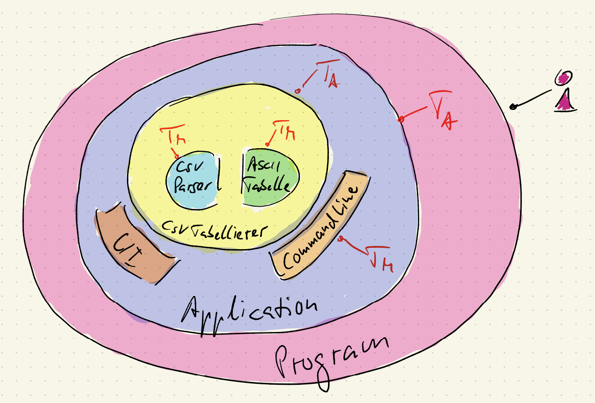

---

<!-- Page 423 of 493 -->

Musterlösung: 07-TestbarkeitsteigernmitSurrogaten 414
Säuberung der Kommandozeilenanalyse
Die Analyse der Kommandozeile istgood enough zur Lösung der Aufgabe.
Das IOSP ist erfüllt, eine dynamische Bindung war dafür nicht gefordert
und ist auch nicht nötig. Dennoch lässt sich daran noch etwas verbessern.
Mit etwas Abstand von der Codierung fällt mir das auf:
• Die Analyse findet im Konstruktor von Application statt. Die
Konstruktionkanndeshalbfehlschlagen.DasgefälltnichtallenOO-
Programmierern. Es gibt die Idee, dass im Konstruktor eigentlich
keine Logik ausgeführt werden sollte. Einerseits. Denn anderer-
seits… warum sollte eine Konstruktion nicht fehlschlagen dürfen?
Doch, das darf sie - nur bietet der Konstruktor dann nicht viele
Möglichkeiten, das zu melden. Nur eine Exception bleibt. Und das
ist schon sehr radikal und bedarf dann einer Ausnahmebehandlung,
die den Client-Code mit Logik verrauschen kann.
• Dass die Kommandozeilenanalyse das Programm hart mit einem
Exit() beendet, ist kein feiner Zug. Da maßt sie sich eigentlich zu
viel an. Solch ein Abbruch ist Sache der Application oder sogar
von Main().
Angesichts dieser “Unordnung” scheint es angezeigt, die Kommandozei-
lenanalyse sauberer aufzustellen. Das geschieht in drei Schritten:
1. Die Analyse wandert vom Konstruktor nach Run(). Im Konstruk-
tor wird nur args erinnert für die Nutzung in Run().
2. Die Analyse stellt nur noch fest, dass die Kommandozeilenparame-
ter fehlen, zieht daraus aber keine Schlüsse für den Fortgang des
Programms. Diese Erkenntnis wird nur gemeldet und in Run() an
das UI weitergegeben.
3. Die Analyse ist ein Beispiel für viele Vorgänge, die erwartet schief
gehen können - aber vor allem erfolgreich verlaufen und auch noch
ein Ergebnis liefern. Das könnte über einen Rückgabewert vom Typ
bool angezeigt werden, nur wie wird dann auch noch das Ergebnis
gemeldet? Die Lösung besteht in einem speziellen Resultatstyp, der
beide Fälle abdeckt.
Die ersten beiden Schritte sind trivial. Der letzte jedoch verdient etwas
Erklärung:

---

<!-- Page 424 of 493 -->

Musterlösung: 07-TestbarkeitsteigernmitSurrogaten 415
1 abstract class Result { }
2
3 class Success<T> : Result {
4 public T Value { get; }
5 public Success(T value) {
6 Value = value;
7 }
8 }
9
10 class Failure : Result {
11 public string Explanation { get; }
12 public Failure(string explanation) {
13 Explanation = explanation;
14 }
15 }
Mit dieser Typhierarchie ist die Anforderung erfüllt: Es kann ein Ergebnis
geliefert werden vom allgemeinen Basistyp Result. Das allerdings hat
zwei Ausprägungen: entweder liegt ein Erfolg vom Typ Success<T> vor
oder ein Misserfolg Failure. Auf diese beiden konkreten Ergebnistypen
kann ein Client reagieren.
Die Analyse nutzt das wie folgt:
1 class Commandline {
2 public static Result Parsen(string[] args) {
3 if (args.Length == 0)
4 return new Failure("Usage: showcsv [<Trennzeichen>] <Dateiname>");
5
6 return new Success<(string Dateiname, char Trennzeichen)>((
7 args.Last(),
8 args.Length > 1 ? args[0][0] : ';'
9 ));
10 }
11 }
DasistnützlichangewandteVererbung.(InderFunktionalenProgrammie-
rung würde dafür ein Vereinigungstyp¹²⁰ benutzt.) Die Funktion liefert
lauf Definition auf der Ebene der Basisklasse. Die jedoch ist abstrakt
und so muss sich die Funktion entscheiden, ob sie ein Resultat des einen
konkreten abgeleiteten Typs zurückgibt oder des anderen.
Die Auswertung des Ergebnisses kann je nach Programmiersprache aber
mehr oder weniger Logik erfordern. Deshalb ist es nützlich, sie zu kapseln.
Das geschieht nun mit einer Hilfsklasse:
¹²⁰https://fsharpforfunandprofit.com/posts/discriminated-unions/

---

<!-- Page 425 of 493 -->

Musterlösung: 07-TestbarkeitsteigernmitSurrogaten 416
1 class Experiment {
2 public static void Try<T>(Result result,
3 Action<T> onSuccess, Action<string> onFailure) {
4 switch (result) {
5 case Success<T> s:
6 onSuccess(s.Value);
7 break;
8 case Failure f:
9 onFailure(f.Explanation);
10 break;
11 }
12 }
13 }
In C# kann für die Ermittlung des konkreten Typs pattern matching in
switch eingesetzt werden. Aber egal, wie nun der konkrete Typ ermittelt
wird, das Ergebnis ist immer dasselbe: Es wird seine Verarbeitung über
eine Continuation angestoßen. Das Experiment weiß nicht, wie es
weitergeht, sondern nur dass es unterschiedlich weitergeht, jenachdem ob
ein Erfolg oder Misserfolg vorliegt.
Am Aufrufort trägt dieser Umgang mit einem unsichern Ausgang nicht
dick auf:
1 class Application
2 {
3 private readonly string[] _args;
4 private readonly IUI _ui;
5
6 public Application(string[] args, IUI ui) {
7 _args = args;
8 _ui = ui;
9 }
10
11 public void Run() {
12 Experiment.Try<(string Dateiname, char Trennzeichen)>(
13 Commandline.Parsen(_args),
14
15 onSucess: parameters => {
16 var csv = File.ReadAllText(parameters.Dateiname);
17 var tabelle = CsvTabellierer.Tabellieren(csv, parameters.Trennzeichen);
18 _ui.Anzeigen(tabelle);
19 },
20
21 onFailure: errormessage => _ui.FehlerMelden(errormessage)
22 );
23 }
24 }
Das Rauschen ist geringer als bei einem try-catch und die Flexibilität
dieses Ansatzes ist größer. Erfolgs- und Misserfolgsfall stehen in schöner
Eintracht nebeneinander und werden mit für sie relevanten Werten befeu-
ert; die Verpackung in einen Resultatstyp ist verschwunden. (In manchen
Sprachen steht für solche Fälle ein Option Type zur Verfügung. Der kann
eingesetzt werden, so dass du dir eine eigene Typhierarchie sparst.)

---

<!-- Page 426 of 493 -->

Musterlösung: 07-TestbarkeitsteigernmitSurrogaten 417
MitdieserRefaktorisierungistnunaucheinAkzeptanztestfürdenFallfeh-
lenderKommandozeilenargumentemöglich.Esfindetnichtmehrzwangs-
weise ein Programmabbruch statt. Vielmehr wird geprüft, ob die Feh-
lermeldungsmethode des UI mit einer passenden Erklärung aufgerufen
wurde (statt der Tabellenanzeige):
1 [Fact]
2 public void Akzeptanztest_ohne_Parameter() {
3 var uiSurrogate = Substitute.For<IUI>();
4
5 var sut = new Application(new string[0], uiSurrogate);
6 sut.Run();
7
8 uiSurrogate.DidNotReceive().Anzeigen(Arg.Any<string>());
9 uiSurrogate.Received().FehlerMelden(Arg.Is<string>(x => x.StartsWith("Usage")));
10 }

---

<!-- Page 427 of 493 -->

Musterlösung: 07-TestbarkeitsteigernmitSurrogaten 418
Aufgabe 2 - Game-of-Life
Analyse
Die Lösung existiert hier schon komplett als Programm. Es sind kei-
ne Features oder Improvements¹²¹ hinzuzufügen. Ziel ist lediglich die
Erhöhung der Testbarkeit durch Dynamisierung der Bindungen zu den
Umweltbelangen, die schon vorhanden sind.
Bisher liegen die Belange nicht in eigenen Klassen vor. Es wird also einige
Refaktorisierung nötig sein.
Planung
1. Im ersten Schritt kann hier schon die neue Klasse Application
eingeführt werden, da alle Belange bereits vorhanden sind. Die
bisherinMain()vorgenommeneKompositionwirdverlegt,sodass
Main() bereits in seiner Aufgabe fokussiert ist.
2. Extraktion der Fortschrittsausgabe in eine eigene Klasse.
3. Extraktion der Persistenz in eine eigene Klasse. Hier ist werden
sicher noch vorhandene Gerüsttests zu Modultests.
4. Dynamisieren der Bindungen an Fortschrittsausgabe und Persis-
tenz. Injektion von Objekten in GameOfLifeEvolution und Ap-
plication.
5. Akzeptanztest aufsetzen mit Surrogaten für Fortschrittsausgabe
und Persiszenz.
Umsetzung
Application einführen
Die neue Application-Klasse einzuführen, ist zunächst trivial. Der
Code in Main() muss lediglich nach Run() verpflanzt werden, um dann
darüber aufgerufen zu werden:
¹²¹https://medium.com/qualityfaster/the-zero-bug-policy-b0bd987be684

---

<!-- Page 428 of 493 -->

Musterlösung: 07-TestbarkeitsteigernmitSurrogaten 419
1 static void Main(string[] args) {
2 var app = new Application(args);
3 app.Run();
4 }
5
6
7 class Application
8 {
9 private readonly string[] _args;
10
11 public Application(string[] args) {
12 _args = args;
13 }
14
15 public void Run() {
16 var gol = new GameOfLifeEvolution();
17
18 var seedWorldFilename = _args[0];
19 var numberOfGenerations = int.Parse(_args[1]);
20
21 gol.Evolve(numberOfGenerations, seedWorldFilename,
22 () => Console.Write("."));
23
24 Console.WriteLine();
25 }
26 }
Jetzt ist Main() auf die Konstruktion fokussiert und Run() auf die
Herstellung des Verhaltens durch Komposition von Belangen.
Fortschrittsanzeige extrahieren
Die Ausgabe auf der Console ist in diesem Szenario noch einfacher als
bei der CSV-Tabellierung. Dennoch steht sie in der aktuellen Form einer
automatisierten Testbarkeit im Wege. Deshalb müssen selbst die nur zwei
I/O-Aufrufe in eine eigene Klasse ausgelagert werden.
1 public class UI {
2 public void ReportProgress() => Console.Write(".");
3
4 public void Close() => Console.WriteLine();
5 }
6
7
8 public void Run() {
9 var ui = new UI();
10 var gol = new GameOfLifeEvolution(_repo);
11
12 var seedWorldFilename = _args[0];
13 var numberOfGenerations = int.Parse(_args[1]);
14
15 gol.Evolve(numberOfGenerations, seedWorldFilename,
16 ui.ReportProgress);
17
18 ui.Close();
19 }
ZunächstkanndieAuslagerungohneInterfaceundmitstatischerBindung
geschehen.ImerstenSchrittsolllediglichsichergestelltwerden,dassüber-
haupt eine Indirektion über das UI-Objekt stattfindet. Eine Überprüfjung
ist hier anschließend leider noch manuell nötig.

---

<!-- Page 429 of 493 -->

Musterlösung: 07-TestbarkeitsteigernmitSurrogaten 420
Persistenz extrahieren
Mit der Persistenz kann zunächst auch so verfahren werden wie mit der
Fortschrittsanzeige: Extraktion in eine eigene Klasse mit Instanziierung
und statischer Bindung am Ort der Abhängigkeit.
1 public class GameOfLifeEvolution
2 {
3 public void Evolve(int numberOfGenerations, string seedWorldFilename,
4 Action onGeneration) {
5 var repo = new MatrixRepository();
6
7 repo.Clear(seedWorldFilename);
8 var firstGeneration = repo.Load(seedWorldFilename);
9 GameOfLife.Calculate_next_generations(firstGeneration, numberOfGenerations,
10 (iGeneration, generation) => {
11 repo.Store(seedWorldFilename, iGeneration,
12 generation);
13 onGeneration();
14 });
15 }
16 }
Im Unterschied zum UI findet diese Refaktorisierung jedoch schon über
dem Sicherheitsnetz der bisherigen Akzeptanztests statt.
Mit der neuen Klasse kann die Persistenz nun gezielter unter Test gestellt
werden. Bisherige Gerüsttests werden zu Modultests.
1 class MatrixRepository
2 {
3 public void Clear(string seedFilename) {
4 var seedPath = Path.GetDirectoryName(seedFilename);
5 if (seedPath == "") seedPath = ".";
6
7 var seedPrefix = Path.Combine(seedPath,
8 Path.GetFileNameWithoutExtension(seedFilename) + "-");
9 foreach (var filename in Directory.GetFiles(seedPath))
10 if (filename.StartsWith(seedPrefix))
11 File.Delete(filename);
12 }
13
14 public Matrix Load(string filename) {
15 var rows = File.ReadAllLines(filename);
16 return rows.Deserialize();
17 }
18
19 public void Store(string seedFilename, int generationNumber, Matrix matrix) {
20 var rows = matrix.Serialize();
21 File.WriteAllLines(VersionFilename(seedFilename, generationNumber), rows);
22 }
23
24 public static string VersionFilename(string seedFilename, int versionNumber)
25 => seedFilename.Replace(".txt", $"-{versionNumber}.txt");
26 }
VersionFilename() ist jetzt public geworden, um den Test darauf
zu erhalten. Eine Entscheidung, die auch anders hätte ausfallen können.

---

<!-- Page 430 of 493 -->

Musterlösung: 07-TestbarkeitsteigernmitSurrogaten 421
Statisch kann die Methode bleiben, weil sie nicht im Interface auftauchen
wird; sie ist nur für den internen Gebrauch der Persistenz.
Die Persistenz braucht die (De)Serialisierung der Domänendatenklasse
Matrix. Wohin soll die Logik wandern? Sie kann nicht in GameOfLi-
feEvolution bleiben, weil es sonst eine bidirektionale Abhängigkeit zu
MatrixRepository gäbe. Aber soll sie ebenfalls im Repository nahe
Load() und Store() verbleiben? Oder ist eher eine eigene Klasse
angezeigt?
ImZugeeinerRefkatorosierungscheintesnaheliegend,die(De)Serialisierung
ebenfalls zu extrahieren. Ihre Gerüsttests könnten dann Modultests wer-
den, um zu überdauern. Und C# bietet mit Extension Methods¹²² eine
hübscheMöglichkeit,die(De)Serialisierungsehrunaufdringlichzuhalten.
1 static class MatrixSerializationExtensions
2 {
3 public static string[] Serialize(this Matrix matrix) {
4 var rows = new string[matrix.Height][];
5 for (var row = 0; row < matrix.Height; row++) {
6 rows[row] = new string[matrix.Width];
7 for (var col = 0; col < matrix.Width; col++)
8 rows[row][col] = matrix[row, col] ? "X" : ".";
9 }
10 return rows.Select(r => string.Join("", r)).ToArray();
11 }
12
13 public static Matrix Deserialize(this string[] rows) {
14 var matrix = new Matrix(rows.Length, rows[0].Length);
15 for (var row = 0; row < matrix.Height; row++)
16 for (var col = 0; col < matrix.Width; col++)
17 matrix[row, col] = rows[row][col] == 'X';
18 return matrix;
19 }
20 }
Statt eines bisherigen Aufrufs z.B. der Serialisierung mit der Matrix
als Parameter, sieht es nun so aus, als können sich die Matrix selbst
serialisieren:matrix.Serialize().Dasistabernurdersyntacticsugar
von Extension Methods.
Durch die spezielle Definition als statische Methode mit einem this
Parameter
1 public static string[] Serialize(this Matrix matrix) {...}
¹²²https://en.wikipedia.org/wiki/Extension_method

---

<!-- Page 431 of 493 -->

Musterlösung: 07-TestbarkeitsteigernmitSurrogaten 422
können Extension Methods so aufgerufen, als seien sie in der Klasse eines
Objektes definiert.¹²³
Durch Extraktion der (De)Serialisierung sind nun alle Klassen übersicht-
lich und fokussiert.
Obwohl die Klasse MatrixRepository die (De)Serialisierung formal
integriert,kannsiejedochnochalsoperationaleKlasseangesehenwerden.
IhrSchwerpunktistdieI/O-Logik.Unddie(De)Serialisierungsiehtaus,als
würde sie zur Datenklasse Matrix gehören.
Dynamische Bindungen einführen
Für die dynamische Bindung von Fortschrittsausgabe und Persistenz
braucht es Interfaces und Injektion. Mit einer modernen IDE ist die
Extraktion der Interfaces aus den Klassen mit einem Tastendruck getan.
1 public interface IMatrixRepository {
2 void Clear(string seedFilename);
3 Matrix Load(string filename);
4 void Store(string seedFilename, int generationNumber, Matrix matrix);
5 }
6
7 public class UI {
8 public void ReportProgress() => Console.Write(".");
9
10 public void Close() => Console.WriteLine();
11 }
An IMatrixRepository wird dabei klar, dass es Sichtbarkeit von
Methoden auf zwei Ebenen gibt:
• Auf Klassenebene wird mit public bzw. private entschieden, ob
eine Methode überhaupt außerhalb der Klasse sichtbar ist.
• Mit einer Inklusion bzw. Exklusion beim Interface kann darüber
hinausnochmalentschiedenwerdenobgrundsätzlichsichtbareMe-
thoden auch für einen Client nutzbar sind, der nur die Abstraktion
kennt.
¹²³Man könnte sagen, damit ist das, was objektorientierte Sprachen verbergen wollten,
wieder sichtbar gemacht: die Datenstruktur, auf die sich Methoden beziehen. Das halte
ich aber nicht per se für etwas Schlimmes. Diese Form der Erweiterbarkeit ist ein schönes
Werkzeug-dassinnigeingesetztwerdenwillwiejedesWerkzeug.

---

<!-- Page 432 of 493 -->

Musterlösung: 07-TestbarkeitsteigernmitSurrogaten 423
Selbst wenn VersionFilename() eine Instanzmethode und öffentlich
wäre für einen Modultest, würde sie nicht in IMatrixRepository
Aufnahme finden. Sie ist schlicht irrelevant fürGameOfLifeEvolution.
Die Injektion des Repository ist “im inneren Kreis” nötig, da wo die
Abhängigkeitbesteht.SpätestensjetztmüsstedieseIntegrationsklasseeine
Instanzklasse werden.
1 public class GameOfLifeEvolution
2 {
3 private readonly IMatrixRepository _repo;
4
5 public GameOfLifeEvolution(IMatrixRepository repo) {
6 _repo = repo;
7 }
8
9 public void Evolve(int numberOfGenerations, string seedWorldFilename,
10 Action onGeneration) {
11 _repo.Clear(seedWorldFilename);
12 ...
13 }
14 }
Auf Applikationsebene hingegen muss das Repository nicht sichtbar sein.
Dort wird stattdessen ein Objekt der Klasse injiziert, die abhängig ist
vom Repository. Dafür ist kein Interface nötig. Eine dynamische Bindung
ist nicht gefragt, weil kein Austausch im Test stattfinden wird. Die
integrierende Klasse muss nur konfiguriert werden können.
1 class Application
2 {
3 private readonly string[] _args;
4 private readonly IUI _ui;
5 private readonly GameOfLifeEvolution _gol;
6
7 public Application(string[] args, IUI ui, GameOfLifeEvolution gol) {
8 _args = args;
9 _ui = ui;
10 _gol = gol;
11 }
12
13 public void Run() {
14 var seedWorldFilename = _args[0];
15 var numberOfGenerations = int.Parse(_args[1]);
16
17 _gol.Evolve(numberOfGenerations, seedWorldFilename,
18 _ui.ReportProgress);
19
20 _ui.Close();
21 }
22 }
Dusiehst, Interfaces sindnicht immer nötig,um zu flexibilisieren.Manch-
mal reich die Konfigurierbarkeit einer Klasse und die Injektion einer
Instanz. Auf diese Weise werden Details vor der nutzenden Klasse - hier:

---

<!-- Page 433 of 493 -->

Musterlösung: 07-TestbarkeitsteigernmitSurrogaten 424
Application - verborgen. Sie hat keine Ahnung, dass GameOfLifeE-
volution konfigurierbar ist und auch noch Abhängigkeiten hat.
Die Konstruktion von Application wird jetzt trotzdem etwas aufwän-
diger. Es ist gut, dass Main() sich darauf konzentrieren kann.
1 static void Main(string[] args) {
2 var app = new Application(args,
3 new UI(),
4 new GameOfLifeEvolution(
5 new MatrixRepository())
6 );
7 app.Run();
8 }
Hier ist die tiefere Abhängigkeit von GameOfLifeEvolution sichtbar.
Dass all diese Klassen nur einmal für die Laufzeit des Programms in-
stanziiert werden, also im Grunde Singletons sind, ist unerheblich. Die
Grundstruktur des Programms zur Laufzeit besteht aus einem Baum
von Singletons. Die Objektorientierung entfaltet auch ohne mehrfache
Instanziierung ihren Nutzen.
Dasselbe gilt dafür, dass keine der Klassen im Grunde Zustand hält. Dass
esMembervariablengibt,istnurderKonfigurationgeschuldet:siewerden
imKonstruktorgesetztundstehen danninallen MethodenzurVerfügung.
Damit wird die Notwendigkeit umgangen, diese Werte als Parameter an
die Methoden zu übergeben. “Echter” Zustand, allemal veränderlicher ist
das aber nicht. Dennoch machen Klassen Sinn: als Module und für die
dynamische Bindung.
Akzeptanztest
Zum Abschluss der Akzeptanztest, wie im TODO gefordert:

---

<!-- Page 434 of 493 -->

Musterlösung: 07-TestbarkeitsteigernmitSurrogaten 425
1 public class Application_tests
2 {
3 [Fact]
4 public void Acceptance_test() {
5 var uiSurrogate = Substitute.For<IUI>();
6
7 var repoSurrogate = Substitute.For<IMatrixRepository>();
8 var seedMatrix = new Matrix(3, 3) {[0, 0] = true,
9 [1, 1] = true,
10 [2, 0] = true};
11 repoSurrogate.Load("foo.txt").Returns(seedMatrix);
12
13 var sut = new Application(new[]{"foo.txt", "2"},
14 uiSurrogate,
15 new GameOfLifeEvolution(repoSurrogate));
16
17 sut.Run();
18
19 repoSurrogate.Store("foo.txt", 1, new Matrix(3, 3) {[1, 1] = true});
20 repoSurrogate.Store("foo.txt", 2, new Matrix(3, 3));
21
22 uiSurrogate.Received(2).ReportProgress();
23 uiSurrogate.Received().Close();
24 }
25 }
Interessant dabei ist, dass die Surrogate vor allem am Ende genutzt wer-
den, um zu überprüfen, ob sie wie erwartet aufgerufen wurden. Lediglich
Load() wird mit zurückzuliefernden Daten versehen.
DieMatrixistdabeibewusstsokleinundeinfachgewählt,ummindestens,
aberauchhöchstenszweiGenerationenzuermöglichen.Esgehtindiesem
Test ja nicht darum, alle möglichen Regeln zu überprüfen, sondern die
Integration. Spielen alle Belange korrekt zusammen? Der Akzeptanztest
ist insofern ein Integrationstest, ein Modultest darunter ein Pfadtest. Dass
dieRegelnfür eine Vielfalt vonSituationen korrektimplementiert sind, ist
Sache eines Modultests.
Reflexion
DieRefaktorisierungwargeradlinigundohnegroßeÜberraschungen.Das
Ergebnis ist eine saubere Gesamtstruktur:

---

<!-- Page 435 of 493 -->

Musterlösung: 07-TestbarkeitsteigernmitSurrogaten 426
Typisch dabei sind die drei grünen Ebenen. Die Integration der grundle-
genden Belange Benutzerschnittstelle, Kern und Ressourcenzugriff findet
also in mehreren Schritten statt. Das Verhalten wird dann durch die roten
Module erzeugt. Doch die arbeiten nicht direkt zusammen, sondern wer-
den in Integrationen “verdrahtet”, ohne dass sie selbst es merken würden.
Das ist konsequent im Sinne des ISOP. Aber es ist auch konsequenz im
Sinne der Testbarkeit.
Die Peripherie bestehend aus Benutzerschnittstelle für die Kommuni-
kation mit Anwendern und Ressourcenzugriff ist unterschiedlich gut
automatisiert testbar.
Durch die Integration nur des Kerns - der hier auch wieder ein functional
core bleiben konnte - mit dem Ressourcenzugriff ist es möglich, maximal
viel Logik recht gut automatisierbar testen zu können. Die eigentlichen
Akzeptanztests setzen auf GameOfLifeEvolution an.

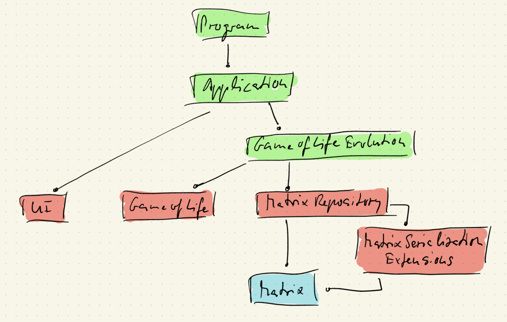

---

<!-- Page 436 of 493 -->

Musterlösung: 07-TestbarkeitsteigernmitSurrogaten 427
Die Benutzerschnittstelle ist davon getrennt und wird auf der darüber
liegendenEbeneinApplicationintegriert.Dortlässtsiesichauchnoch
ersetzen, falls Not am Mann ist. Aber das ist eher die Ausnahme wie
hier in der Übung. Vor allem trennt Application das schwer Testbare -
die Benutzerschnittstelle - vom vergleichsweise leicht Testbaren, das auch
sehr testwürdig ist.
Doch selbst wenn das Gesamtergebnis sehr ordentlich ist, kann die Frage
gestelltwerden:WardasVorgehenoptimal?Eswarnämlichnichtwirklich
test-first. Hätte das auch anders sein können? Hätte Application nicht
sofortmiteinemTestaufgesetztwerdenkönnen,umdannvonaußennach
innen die Refaktorisierung voranzutreiben?
Dafür hätten die Interfaces IUI und IMatrixRepository schon gleich
im ersten Schritt bekannt sein müssen. Ohne sie hätten Surrogate nicht
definiert und konfiguriert werden können.
Die Interfaces sind jedoch erst durch die Refaktorisierung “im Inneren”
entstanden. Deshalb war der Plan gerechtfertigt, auch wenn der Test am
Ende stand.
Dass ein Plan nur eine grobe Leitplanke sein sollte und nicht alles
vorhersehen kann, hat sich auch in dieser Aufgabe wieder gezeigt. Zwar

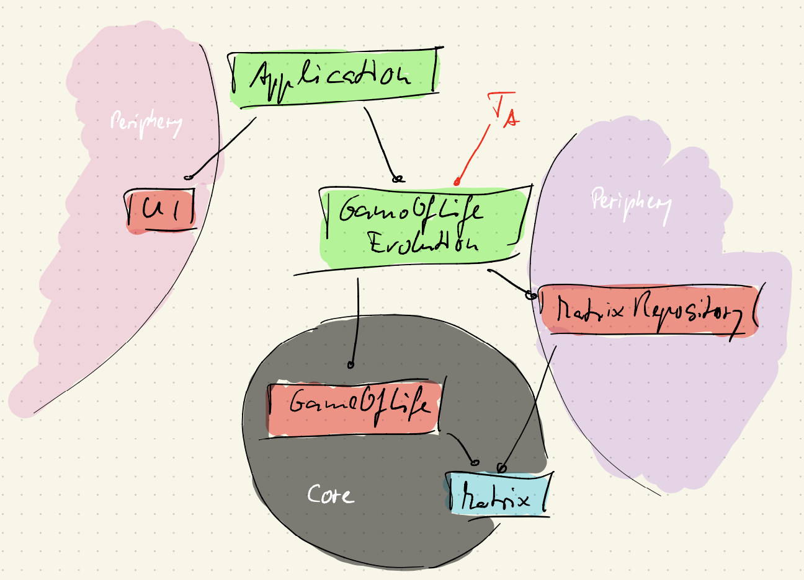

---

<!-- Page 437 of 493 -->

Musterlösung: 07-TestbarkeitsteigernmitSurrogaten 428
bin ich nicht davon abgewichen, doch es sind während der Umsetzungen
Details aufgetaucht, an die ich im Plan nicht gedacht hatte. Das kannst du
nicht vermeiden, wenn du dich nicht durchs Planen lähmen lassen willst.
Doch auch die unerwarteten Fragen waren ja leicht zu beantworten auf
der Basis von Prinzipien wie SRP und IOSP.
Zusammenfassung
Beide Aufgaben haben gerade gezogen, was von vornherein schon hät-
te gerade und ordentlich sein sollen. Dass Peripherie-Belange nicht in
eigenen Instanz-Klassen gekapselt sind, darf eigentlich nicht sein. Die
Erfahrung zeigt, dass diese Belange sehr wahrscheinlich in Tests durch
Surrogate ersetzt oder zumindest konfiguriert werden sollen.
In der Codierung solche fehlende Ordnung in Form mangelnder Modula-
risierung nachzuziehen, ist eigentlich zu spät. Wieder zeigt sich, dass ein
Entwurf vorher sinnvoll gewesen wäre.
Aber nimm trotzdem aus dieser Übung zumindest eine Grundidee für die
fundamentale Strukturierung von Software mit:
• Die Peripherie geteilt in Benutzerschnittstelle und Ressourcenzu-
griff verdient immer, in eigene Instanz-Klassen gekapselt zu wer-
den. Ihre Instanzen kannst du im Grunde von Anfang an auch
injizieren. Deshalb brauchst du auch eine Applikationsklasse als
oberstes Injiektionsziel. Ob die Klassen auch Interfaces bekommen
odernurkonfigurierbarübereinenKonstruktorseinmüssen,kannst
du später überlegen. Interfaces nachzurüsten ist nicht so schwer
wie statische Klassen in Instanz-Klassen zu verwandeln und zu
injizieren.
• Integration findet dann in zwei Schritten statt:
– Auf der unteren Ebene bindet ein Use Case oder Messa-
ge Handler die Domäne und die Ressourcenzugriffe zusam-
men. Beim Game-of-Life ist das GameOfLifeEvolution.
Der Message Handler gehört noch nicht selbst zur Domäne,
auch wenn er vielleicht so aussehen mag. Die Domäne ist
wirklichvonderPeripherieunabhängig.DerMessageHandler
jedoch weiß noch, dass es eine Peripherie gibt.

---

<!-- Page 438 of 493 -->

Musterlösung: 07-TestbarkeitsteigernmitSurrogaten 429
– Oberhalb des Message Handlers komponiert eine Applica-
tion aus der Benutzerschnittstelle und dem Message Hand-
ling die Gesamtanwendung.
ObdieDomäneeinfunctionalcore istodernicht,istnichtsowichtig.Aber
du kannst darauf ein Auge haben und dich darum bemühen für größere
Testbarkeit.

---

<!-- Page 439 of 493 -->

Musterlösung: 08 -
Experimentell codieren in
der Komplexität
Analyse
• Texte bestehen aus Worten. Worte sind zusammenhängende Folgen
von non-whitespace Zeichen. Zu einem Wort gehört für dieses
Szenario auch ein folgendes Komma wie bei Nacht,.
– Whitespace wird komplett ignoriert und nicht im umgebro-
chenen Text erhalten.
• Leerzeilen scheinen irrelevant. Es gibt keine Absätze in den umzu-
brechenden Texten.
• Worte, die länger als eine Zeile sind, werden einfach “zerbrochen”
in Teile, die maximal so lang sind, wie die gewünschte Zeilenlänge.
Nach einem Umbruch kann man nicht mehr erkennen, dass ein
Wort “zerbrochen” wurde, z.B. wurde im ersten Umbruch aus
Schneeflöcklein ein neues “Wortpaar” Schneeflö und ck-
lein.EinerneuterUmbrucheinesumgebrochenenTextesistdamit
nicht möglich.
• Im umgebrochenen Text sind die Worte in einer Zeile nur durch ein
Leerzeichen getrennt.
Planung
Zerlegung in Teilprobleme
• Der Text muss in Worte zerlegt werden, die dann zu neuen Zeilen
zusammengesetzt werden (trivial bis einfach): string[] InWor-
teZerlegen(string text)

---

<!-- Page 440 of 493 -->

Musterlösung: 08-ExperimentellcodiereninderKomplexität 431
– Der Text kann auch erstmal in Zeilen zerlegt werden, bevor
die wiederum in Worte zerlegt werden (beides ist dann trivi-
al): string[] InZeilenZerlegen(string text und
string[] InWorteZerlegen(string[] zeilen)
• Worte zu neuen Zeilen zusammensetzen (komplex): string[]
ZeilenZusammensetzen(string[] worte, int maxZeilen-
länge)
• ZeilenzumErgebnistextzusammenzusetzen(trivial):string Zei-
lenVerschweißen(string[] zeilen)
• Aus TODO2 folgt auch noch (komplex): string[] LangeWorte-
Zerschneiden(string[] worte, int maxZeilenlänge)
Inkrementelle Testfälle für die komplexen
Probleme
Lange Worte zerschneiden
Hier fällt auf, dass zunächst jedes Wort für sich behandelt werden kann.
Die Verarbeitung des einen Wortes hat keinen Einfluss auf die eines ande-
ren. Es gibt “innerhalb” des Problems also noch ein weniger komplexes
Teilproblem: string[] LangesWortZerschneiden(string wort,
int maxZeilenlänge).
Variationsdimensionen: a) Menge der Worte, b) Menge der Schnitte in
einem Wort. Inkrementelle Testfälle könnten darauf basierend diese sein:
• Ein Wort, das nicht zu lang ist (a)
• Ein Wort, das einmal durchschnitten werden muss (b)
• Ein Wort, das mehrfach durchschnitten werden muss (b)
• Mehrere Worte (a), die zerschnitten werden müssen (oder auch
nicht) (b)
Worte zu neuen Zeilen zusammensetzen
Zu diesem Zeitpunkt sollte es keine zu langen Worte mehr geben. Alle
Worte, die bei dieser Funktion anliegen, passen zumindest vollständig in
eine ansonsten noch leere Zeile.

---

<!-- Page 441 of 493 -->

Musterlösung: 08-ExperimentellcodiereninderKomplexität 432
Auch hier fällt auf, dass in der Zusammensetzung aller Zeilen aus allen
WorteeinwenigerkomplexesProblemeingeschachteltist:DieZusammen-
setzung einer Zeile aus einer Menge von Worten, wobei am Ende Worte
übrigbleiben mögen:
(string Zeile, string[] RestlicheWorte) EineZeileAusWor-
tenZusammensetzen(string[] worte, int maxZeilenlänge)
Variationsdimensionen: a) Menge der Worte, b) Notwendigkeit zum Zei-
lenumbruch. Inkrementelle Testfälle könnten darauf basierend diese sein:
• Ein Wort (a)
• Zwei Worte, die in eine Zeile passen (a)
• Mehrere Worte, die nicht alle in eine Zeile passen (a)
• Zwei Worte auf zwei Zeilen (b)
• Mehrere Worte (a), die zu mehreren Zeilen führen (b)
Codierung
Die Planung hat einen Überblick geliefert, was alles zu tun ist. Das
meiste ist trivial, aber zwei Teilprobleme sind dann doch komplex. Die
Reihenfolge der Abarbeitung ist prinzipiell egal. Du kannst dich den
Schwierigkeitsberghoch-oderrunterarbeiten.Hiersollenaberdieschwie-
rigeren Probleme den Anfang machen, damit die vom Tisch sind. Aber
zuallererst natürlich der Akzeptanztest.
Akzeptanztests
Die Akzeptanztestszenarios sind in den Anforderungen vorgegeben. Als
Heimat für die zu entwickelnde Funktion wird die Produktionscode-
Klasse Textumbruch angenommen:

---

<!-- Page 442 of 493 -->

Musterlösung: 08-ExperimentellcodiereninderKomplexität 433
1 [Fact]
2 public void Akzeptanztest1() {
3 var result = Textumbruch.Umbrechen(@"Es blaut die Nacht,
4 die Sternlein blinken,
5 Schneeflöcklein leis hernieder sinken.", 9);
6 result.Should().Be(@"Es blaut
7 die
8 Nacht,
9 die
10 Sternlein
11 blinken,
12 Schneeflö
13 cklein
14 leis
15 hernieder
16 sinken.");
17 }
18
19 [Fact]
20 public void Akzeptanztest2() {
21 var result = Textumbruch.Umbrechen(@"Es blaut die Nacht,
22 die Sternlein blinken,
23 Schneeflöcklein leis hernieder sinken.", 14);
24 result.Should().Be(@"Es blaut die
25 Nacht, die
26 Sternlein
27 blinken,
28 Schneeflöcklei
29 n leis
30 hernieder
31 sinken.");
32 }
Die Methode Umbrechen() kann statisch bleiben. Sie braucht keinen
Zustand, darin findet kein Ressourcenzugriff statt. In einem größeren
Zusammenhang würde sie zum functional core gehören.
Nach diesen roten Tests als Ziellinie kommt Umbrechen() auf die Seite.
Damit ist jetzt erstmal nichts zu tun. Die weitere Implementation findet
nicht “durch den Flaschenhals” statt, sondern außerhalb auf Werkbänken
oder zumindest daran vorbei.
TDDaiymi - Lange Worte zerschneiden
In der Planung sind einige inkrementelle Testfälle für dieses Teilproblem
zusammengekommen. Ob du die komplett vor Start der Codierung auf-
schreibstoderauchnurfindest,istnichtzentral.AllerdingshatesVorteile,
wenn du dir erstmal solche Gedanken machst. Damit schwingst du dich
auf einen Lösungsansatz ein. Indem du über Variationsdimensionen für
inkrementelle Tests nachdenkst, analysierst du das Problem: kannst du
darin Alternativen sehen oder ist es eher geprägt von Wiederholungen?
Mit einem guten Gefühl für die Testfälle startest du dann in die Imple-
mentation. Verzage aber nicht, wenn sich unterwegs neue Erkenntnisse

---

<!-- Page 443 of 493 -->

Musterlösung: 08-ExperimentellcodiereninderKomplexität 434
ergeben und du deinen Testfallplan verändert werden musst. Das kann
immer passieren. Der Plan ist nicht wichtiger als die Erkenntnis.
Ein Plan ist nicht zum Einhalten da! Ein Plan ist da, um dich fokussieren
zu helfen. In der Planung bist du in einem anderen mentalen Modus als in
der Umsetzung. In der Planung bist du kreativer, weitblickender als in der
Umsetzung. In der Planung sollst du andere Entscheidungen treffen als in
der Umsetzung.
Wenn du von der Planung in die Umsetzung wechselst, dann kannst du
den Weitblick abschalten. Das entlastet dich für den Blick auf den Code
vor dir. Vor allem darum geht es bei der Planung.
Wenn du während der Umsetzung jedoch auf etwas stößt, das planrele-
vant ist, dann macht das nichts. Weiche dann vom Plan ab. Das Ziel steht
dir ja immer noch in Form des Akzeptanztests vor Augen.
Inkrement 1
1 [Fact]
2 public void Test1() {
3 var input = "abc";
4 var maxZeilenlänge = 3;
5
6 var result = new List<string>();
7
8 result.Should().BeEquivalentTo(new[] {"abc"});
9 }
Hier gibt es zwei Parameter für die Lösung. Beide werden auf die Ein-
gangswerte gesetzt. Das Resultat wird “irgendwie” initialisiert, damit
der Compiler zufrieden ist. Am Ende steht die Überprüfung auf das
gewünschte Resultat. Derzeit kann der Test nur rot sein.
“Erlösung” bringt ein wenig Logik, die sich “zielorientiert” mit dem
Input beschäftigt. Das bedeutet, die Parameter werden beide sinnvoll
benutzt. Die Nutzung von “Lösungsattrappen” wie z.B. var result =
new[]{"abc"} bringt dich einfach nicht voran. Erspare sie dir, auch
wenn du sie immer mal wieder in der Literatur siehst.

---

<!-- Page 444 of 493 -->

Musterlösung: 08-ExperimentellcodiereninderKomplexität 435
1 [Fact]
2 public void Test1() {
3 var input = "abc";
4 var maxZeilenlänge = 3;
5
6 var result = new List<string>();
7 if (input.Length <= maxZeilenlänge) result.Add(input);
8
9 result.Should().BeEquivalentTo(new[] {"abc"});
10 }
Inkrement 2
EsgehtinderVariationsdimension“MengederSchnitte”weiter.Jetztwird
einer nötig.
1 [Fact]
2 public void Test2() {
3 var input = "abcd";
4 var maxZeilenlänge = 3;
5
6 var result = new List<string>();
7 if (input.Length <= maxZeilenlänge) result.Add(input);
8
9 result.Should().BeEquivalentTo(new[] {"abc", "d"});
10 }
Die Lösung dafür sieht interessant aus:
1 [Fact]
2 public void Test2() {
3 var input = "abcd";
4 var maxZeilenlänge = 3;
5
6 var result = new List<string>();
7 if (input.Length <= maxZeilenlänge)
8 result.Add(input);
9 else {
10 var head = input.Substring(0, maxZeilenlänge);
11 result.Add(head);
12
13 var tail = input.Substring(maxZeilenlänge);
14 result.Add(tail);
15 }
16
17 result.Should().BeEquivalentTo(new[] {"abc", "d"});
18 }
Hier ist nicht einfach etwas wiederholt, wie in bisherigen TDDaiymi
Beispielen. Stattdessen wird der alternative Pfad des if ausgefleischt.
Darin findet der eine derzeit nötige Schnitt durch das Wort statt und die
Wortteile werden registriert.
Inkrement 3
Kopieren von Test2() und anpassen der Testdaten:

---

<!-- Page 445 of 493 -->

Musterlösung: 08-ExperimentellcodiereninderKomplexität 436
1 [Fact]
2 public void Test3() {
3 var input = "abcdefg";
4 var maxZeilenlänge = 3;
5
6 var result = new List<string>();
7 if (input.Length <= maxZeilenlänge)
8 result.Add(input);
9 else {
10 var head = input.Substring(0, maxZeilenlänge);
11 result.Add(head);
12
13 var tail = input.Substring(maxZeilenlänge);
14 result.Add(tail);
15 }
16
17 result.Should().BeEquivalentTo(new[] {"abc", "def", "g"});
18 }
Bei zwei Schnitten wird es nun noch interessanter:
1 [Fact]
2 public void Test3() {
3 var input = "abcdefg";
4 var maxZeilenlänge = 3;
5
6 var result = new List<string>();
7 if (input.Length <= maxZeilenlänge)
8 result.Add(input);
9 else {
10 var head = input.Substring(0, maxZeilenlänge);
11 result.Add(head);
12
13 input = input.Substring(maxZeilenlänge);
14 if (input.Length <= maxZeilenlänge)
15 result.Add(input);
16 else {
17 head = input.Substring(0, maxZeilenlänge);
18 result.Add(head);
19
20 var tail = input.Substring(maxZeilenlänge);
21 result.Add(tail);
22 }
23 }
24
25 result.Should().BeEquivalentTo(new[] {"abc", "def", "g"});
26 }
Jetzt wiederholt sich das Muster in der Tiefe. Eine weitere Schachtelung
tritt hinzu für den Fall, dass der tail immer noch zu lang ist. Auf der
ersten Ebene wird das Restwort allerdings noch nicht tail zugewiesen,
sondern überschreibt input, um zu betonen, dass dasselbe wie vorher
noch einmal zu tun ist. Der Rest des zu langen Wortes wird behandelt,
wie das zu lange Wort vorher als Ganzes.
Refaktorisierung
Immer wenn ein Teil so behandelt werden soll wie ein Ganzes, kannst du
schauen, ob sich eine rekursive Lösung anbietet. So auch hier: Ein Wort

---

<!-- Page 446 of 493 -->

Musterlösung: 08-ExperimentellcodiereninderKomplexität 437
wird entweder als Ganzes akzeptiert oder es wird zerschnitten, wobei
der vordere Teil akzeptiert wird - und der Rest als neues Wort derselben
Prüfung unterworfen wird.
1 [Fact]
2 public void Test3() {
3 var input = "abcdefg";
4 var maxZeilenlänge = 3;
5
6 var result = EinWortZerschneiden(input, maxZeilenlänge, new List<string>());
7
8 result.Should().BeEquivalentTo(new[] {"abc", "def", "g"});
9 }
10
11
12 private static string[] EinWortZerschneiden(string wort, int maxZeilenlänge,
13 List<string> wortTeile) {
14 if (wort == "") return wortTeile.ToArray();
15
16 if (wort.Length <= maxZeilenlänge) {
17 wortTeile.Add(input);
18 wort = "";
19 }
20 else {
21 var head = wort.Substring(0, maxZeilenlänge);
22 wortTeile.Add(head);
23 wort = wort.Substring(maxZeilenlänge);
24 }
25
26 return EinWortZerschneiden(wort, maxZeilenlänge, wortTeile);
27 }
Diese Funktion kann zur Überprüfung auch noch in vorherigen Tests
nachgerüstet werden.
Inkrement 4
Funktioniert die Lösung eigentlich auch, wenn nur ein Schnitt nötig ist,
aber das zweite Worte genau die gewünschte Zeilenlänge hat? Das ist
ein Sonderfall, auf den die bisherige Nutzung von Substring() nicht
vorbereitet ist. Wüsstest du aus dem Kopf, ob der Fall schon abgedeckt
ist? Statt zu spekulieren, ist bei solchen Fragestellungen ein weiterer Test
besser:

---

<!-- Page 447 of 493 -->

Musterlösung: 08-ExperimentellcodiereninderKomplexität 438
1 [Fact]
2 public void Test4() {
3 var input = "abcdef";
4 var maxZeilenlänge = 3;
5
6 var result = EinWortZerschneiden(input, maxZeilenlänge, new List<string>());
7
8 result.Should().BeEquivalentTo(new[] {"abc", "def"});
9 }
Der Test stellt zwar eine Abweichung vom Plan dar. Doch das macht ja
nichts, wie ich oben versucht habe zu erklären. Wenn während der Codie-
rung neue Erkenntnisse oder Fragen auftauchen, dann ist es wichtiger, die
vernünftig abzuhandeln, als am Plan festzukleben.
Der Grund können neue Blickwinkel auf das Problem sein oder - wie
hier - technische Überlegungen, da erst jetzt 100% klar ist, wie die Lösung
funktioniert.
Zum Glück deckt der bisherige Code auch diesen Sonderfall ab.
Inkrement 5
Jetzt weiter im Plan. Hier wechselt die Variationsdimension. Es geht nicht
mehr um die Schnitte, sondern die Wörter:
1 [Fact]
2 public void Test5() {
3 var input = new[] { "abc", "klmnopq", "stuv"};
4 var maxZeilenlänge = 3;
5
6 var result = EinWortZerschneiden(input[0], maxZeilenlänge, new List<string>());
7
8 result.Should().BeEquivalentTo(new[] {"abc", "klm", "nop", "q", "stu", "v"});
9 }
DafüristLogikumdieRekursionherumnötig.JedesWortistmitihrgleich
zu behandeln:

---

<!-- Page 448 of 493 -->

Musterlösung: 08-ExperimentellcodiereninderKomplexität 439
1 [Fact]
2 public void Test5() {
3 var input = new[] { "abc", "klmnopq", "stuv"};
4 var maxZeilenlänge = 3;
5
6 var result = new List<string>();
7 foreach (var wort in input)
8 result.AddRange(EinWortZerschneiden(wort, maxZeilenlänge, new List<string>()));
9
10 result.Should().BeEquivalentTo(new[] {"abc", "klm", "nop", "q", "stu", "v"});
11 }
Die resultierenden Wortteile stehen in der Ergebnisliste am Ende neben-
einander. Ihre Ursprungsworte haben sich aufgelöst. Deshalb die Nutzung
von AddRange() auf der Liste.
Refaktorisierung I
InC#gibtesfürsolcheArtdesMappingeineAbkürzung:SelectMany()
1 [Fact]
2 public void Test5() {
3 var input = new[] { "abc", "klmnopq", "stuv"};
4 var maxZeilenlänge = 3;
5
6 var result = input.SelectMany(wort => EinWortZerschneiden(wort, maxZeilenlänge,
7 new List<string>()));
8
9 result.Should().BeEquivalentTo(new[] {"abc", "klm", "nop", "q", "stu", "v"});
10 }
Solche Abkürzungen einzuschlagen ist sinnvoll, weil damit das Fehlerrisi-
ko sinkt. Die Zahl der “beweglichen Teile” nimmt ab: Es ist keine eigene
DatenstrukturmehrzudeklarierenundkorrektzufüllenundeineSchleife
ist auch nicht mehr nötig.
Es lohnt sich, diese Abstraktionen zu verinnerlichen, wenn sie deine
Programmiersprache bietet. Sie stammen aus der Funktionalen Program-
mierung und sind vielleicht erstmal ungewohnt, auch wenn Map-Reduce
Ansätze und Fluent Interfaces schon sehr alt sind. Nicht alle Entwickler
springen mit einem Hurra! auf, wenn du soetwas machst - doch am Ende
lohnt sich eine Umgewöhnung. Angemessen eingesetzt machen solche
Features deinen Code viel lesbarer und reduzieren das Fehlerrisiko.
Refaktorisierung II
DasAusgangsproblemfürdieseTDDaiymiRundeistdamitgelöst.Esfehlt
nur noch die Extraktion der Logik in die Zielfunktion:

---

<!-- Page 449 of 493 -->

Musterlösung: 08-ExperimentellcodiereninderKomplexität 440
1 [Fact]
2 public void Test5() {
3 var input = new[] { "abc", "klmnopq", "stuv"};
4 var maxZeilenlänge = 3;
5
6 var result = LangeWorteZerschneiden(input, maxZeilenlänge);
7
8 result.Should().BeEquivalentTo(new[] {"abc", "klm", "nop", "q", "stu", "v"});
9 }
10
11
12 private static IEnumerable<string> LangeWorteZerschneiden(string[] worte, int maxZeilen\
13 länge)
14 => worte.SelectMany(wort => EinWortZerschneiden(wort, maxZeilenlänge,
15 new List<string>()));
Und die wird dann zusammen mit der rekursiven Funktion in den Pro-
duktionscode verpflanzt. Alle Tests für die Funktion können nun als
Gerüsttests gelöscht werden.
TDDaiymi - Zeilen zusammensetzen
Als zweites Problem von komplexer Natur wurde der Zusammenbau
von Zeilen aus den Worten identifiziert. Vielleicht erscheint dir das gar
nicht so schwierig und du magst recht haben. Die Einschätzung des
Schwierigkeitsgrades ist eine sehr subjektive Angelegenheit. Aber besser,
dabeivertutmansichzugunstenhöhererSchwierigkeit.Besser,dunimmst
Komplexität an und merkst unterwegs, dass es doch trivial ist, als anders
herum. Deshalb soll auch dieses Problem zur Übung des TDDaiymi
Vorgehens als komplex betrachtet und schrittweise “in der Sandkiste”
angegangen werden.
Inkrement 1
Die Entwicklung der Lösung beginnt wieder bei der “inneren” Funktion,
die während der Planung identifiziert wurde. Zunächst ist nur eine Zeile
aus einer Menge noch zur Verfügung stehender Worte zusammenzuset-
zen.

---

<!-- Page 450 of 493 -->

Musterlösung: 08-ExperimentellcodiereninderKomplexität 441
1 [Fact]
2 public void Test1() {
3 var input = new[] {"abc"};
4 var maxZeilenlänge = 7;
5
6 var zeile = "";
7 var restlicheWorte = new string[0];
8
9 zeile.Should().Be("abc");
10 restlicheWorte.Should().BeEmpty();
11 }
Die Lösung bezieht wieder den Input mit ein; lediglich die max. Zeilenlän-
ge wird noch außen vor gelassen. Für den ersten Test mag es verzeihlich
sein; aber eigentlich ist es nicht konsequent. Die Zeilenlänge könnte dann
auch als Parameter weggelassen werden.
1 [Fact]
2 public void Test1() {
3 var input = new[] {"abc"};
4 var maxZeilenlänge = 7;
5
6 var zeile = input[0];
7 var restlicheWorte = input.Skip(1).ToArray();
8
9 zeile.Should().Be("abc");
10 restlicheWorte.Should().BeEmpty();
11 }
AberdierestlichenWortewerdenschonkorrektbestimmt,auchwennhier
eine leere Liste als Konstante ihren Dienst getan hätte.
Zur Erinnerung: Eine Prüfung der einzelnen Worte auf Zeilenlänge ist
nicht nötig, weil zu lange Worte vorher schon zerschnitten worden sein
sollen. Auch mit dem ersten zeile = input[0] kann die Zeile nicht
“überlaufen”.
Inkrement 2

---

<!-- Page 451 of 493 -->

Musterlösung: 08-ExperimentellcodiereninderKomplexität 442
1 [Fact]
2 public void Test2() {
3 var input = new[] {"abc", "de"};
4 var maxZeilenlänge = 7;
5
6 var zeile = input[0];
7 var restlicheWorte = input.Skip(1).ToArray();
8
9 zeile.Should().Be("abc de");
10 restlicheWorte.Should().BeEmpty();
11 }
Auch hier noch keine Berücksichtigung des max. Zeilenlänge. Das zweite
Wort wird pauschal an die bisherige Zeile mit dem ersten Wort angefügt:
1 [Fact]
2 public void Test2() {
3 var input = new[] {"abc", "de"};
4 var maxZeilenlänge = 7;
5
6 var zeile = input[0];
7 var restlicheWorte = input.Skip(1).ToArray();
8
9 zeile += " " + restlicheWorte[0];
10 restlicheWorte = restlicheWorte.Skip(1).ToArray();
11
12 zeile.Should().Be("abc de");
13 restlicheWorte.Should().BeEmpty();
14 }
Die max. Zeilenlänge kannst du als Erinnerung ansehen, dass noch ein
Problem seiner Lösung harrt. Zum Glück zeigen moderne IDEs ungenutzt
Bezeichner an, so dass du das nicht vergessen kannst.
Die IDE erinnert dich, dass ein Parameter noch ungenutzt ist und deshalb ein Teil des
Problemsnochangegangenwerdenmuss.
Inkrement 3

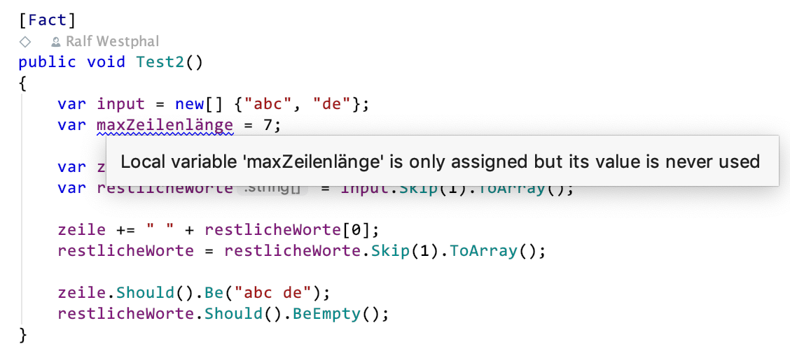

---

<!-- Page 452 of 493 -->

Musterlösung: 08-ExperimentellcodiereninderKomplexität 443
1 [Fact]
2 public void Test3() {
3 var input = new[] {"abc", "de", "fgh"};
4 var maxZeilenlänge = 7;
5
6 var zeile = input[0];
7 var restlicheWorte = input.Skip(1).ToArray();
8
9 zeile += " " + restlicheWorte[0];
10 restlicheWorte = restlicheWorte.Skip(1).ToArray();
11
12 zeile.Should().Be("abc de");
13 restlicheWorte.Should().BeEquivalentTo(new[] {"fgh"});
14 }
Jetzt endlich kommt die max. Zeilenlänge zum Einsatz. Um festzustellen,
dasseinWortnichtmehrineineZeilepasst,mussderenwachsendeLänge
gegen den Maximalwert geprüft werden.
1 [Fact]
2 public void Test3() {
3 var input = new[] {"abc", "de", "fgh"};
4 var maxZeilenlänge = 7;
5
6 var zeile = input[0];
7 var restlicheWorte = input.Skip(1).ToArray();
8
9 zeile += " " + restlicheWorte[0];
10 restlicheWorte = restlicheWorte.Skip(1).ToArray();
11
12 if (zeile.Length + 1 + restlicheWorte[0].Length <= maxZeilenlänge) {
13 zeile += " " + restlicheWorte[0];
14 restlicheWorte = restlicheWorte.Skip(1).ToArray();
15 }
16
17 zeile.Should().Be("abc de");
18 restlicheWorte.Should().BeEquivalentTo(new[] {"fgh"});
19 }
Refaktorisierung I
Die deutlich sichtbaren Dopplungen geben natürlich Anlass zur Refakto-
risierung. Eine Schleife schafft Abhilfe:
1 [Fact]
2 public void Test3() {
3 var worte = new[] {"abc", "de", "fgh"};
4 var maxZeilenlänge = 7;
5
6 var zeile = "";
7 while (worte.Length > 0) {
8 if (zeile.Length + 1 + worte[0].Length > maxZeilenlänge) break;
9 zeile += (zeile.Length > 0 ? " " : "") + worte[0];
10 worte = worte.Skip(1).ToArray();
11 }
12
13 zeile.Should().Be("abc de");
14 worte.Should().BeEquivalentTo(new[] {"fgh"});
15 }

---

<!-- Page 453 of 493 -->

Musterlösung: 08-ExperimentellcodiereninderKomplexität 444
Die Funktion Skip() ist dabei eine große Hilfe. Mit ihr kann vermieden
werden, einen Index über die Wortliste zu führen. Das macht den Code
leichtverständlich-wennauchwahrscheinlichwenigerperformant.Doch
die Performance sollte hier noch nicht im Vordergrund stehen. Zuerst die
Funktionalität herstellen, dann die nötige Effizienz nachziehen, wenn du
erlebt hast, dass du das Problem überhaupt lösen kannst.
Refaktorisierung II
Aber es gibt eine weitere Dopplung. Siehst du sie? Dieselbe Verantwort-
lichkeit - also eine Entscheidung des Auftraggebers - ist in mehreren
Zeilen der Logik zu finden.
Es ist die Entscheidung, dass Worte im Zieltext durch genau ein Leerzei-
chen getrennt sein sollen. Diese Entscheidung steht in zeile.Length +
1 + worte[0].Length und ebenso in (zeile.Length > 0 ? " "
: ""). Das ist unschön und sollte zusammengelegt werden:
1 [Fact]
2 public void Test3() {
3 var worte = new[] {"abc", "de", "fgh"};
4 var maxZeilenlänge = 7;
5
6 var zeile = "";
7 while (worte.Length > 0) {
8 var neueZeile = zeile + (zeile.Length > 0 ? " " : "") + worte[0];
9 if (neueZeile.Length > maxZeilenlänge) break;
10
11 zeile = neueZeile;
12 worte = worte.Skip(1).ToArray();
13 }
14
15 zeile.Should().Be("abc de");
16 worte.Should().BeEquivalentTo(new[] {"fgh"});
17 }
Die Lösung besteht darin, eine neue Zeile zunächst nur vorläufig zusam-
menzusetzen. Deren Länge kann dann einfach gegen das Soll geprüft
werden. Ist sie zu lang geworden, ist die Arbeit schon vorher getan
gewesen. Ansonsten wird die vorläufige zur eigentlichen Zeile.
Dadurch scheint Arbeit gelegentlich zuviel getan. Aber das macht nichts.
Die Performance wird das nicht sehr beeinträchtigen. Auf die Verständ-
lichkeit des Codes jedoch hat es einen guten Einfluss. Das ist wichtig!
Refaktorisierung III
Damit ist die “innere” Funktion abgeschlossen und kann extrahiert wer-
den:

---

<!-- Page 454 of 493 -->

Musterlösung: 08-ExperimentellcodiereninderKomplexität 445
1 [Fact]
2 public void Test3() {
3 var worte = new[] {"abc", "de", "fgh"};
4 var maxZeilenlänge = 7;
5
6 var result = EineZeileAusWortenZusammensetzen(worte, maxZeilenlänge);
7
8 result.Zeile.Should().Be("abc de");
9 result.RestlicheWorte.Should().BeEquivalentTo(new[] {"fgh"});
10 }
11
12
13 static (string Zeile, string[] RestlicheWorte) EineZeileAusWortenZusammensetzen(string[\
14 ] worte, int maxZeilenlänge) {
15 var zeile = "";
16 while (worte.Length > 0) {
17 var neueZeile = zeile + (zeile.Length > 0 ? " " : "") + worte[0];
18 if (neueZeile.Length > maxZeilenlänge) break;
19
20 zeile = neueZeile;
21 worte = worte.Skip(1).ToArray();
22 }
23 return (zeile, worte);
24 }
Inkrement 4
Jetzt geht es an die Logik für die Zielfunktion: Worte sollen auf mehrere
Zeilen verteilt werden:
1 [Fact]
2 public void Test4() {
3 var worte = new[] {"abc", "defg"};
4 var maxZeilenlänge = 7;
5
6 var result = new string[0];
7 var restlicheWorte = new string[0];
8
9 result.Should().BeEquivalentTo(new[] {"abc", "defg"});
10 restlicheWorte.Should().BeEmpty();
11 }
Die Lösung ist einfach, da die zweite Zeile wie die erste behandelt wird -
nur eben mit den nach der ersten übriggebliebenen Worten:
1 [Fact]
2 public void Test4() {
3 var worte = new[] {"abc", "defg"};
4 var maxZeilenlänge = 7;
5
6 var ersteZeile = EineZeileAusWortenZusammensetzen(worte, maxZeilenlänge);
7 var zweiteZeile = EineZeileAusWortenZusammensetzen(ersteZeile.RestlicheWorte, maxZeil\
8 enlänge);
9
10 var result = new[] {ersteZeile.Zeile, zweiteZeile.Zeile};
11 var restlicheWorte = zweiteZeile.RestlicheWorte;
12
13 result.Should().BeEquivalentTo(new[] {"abc", "defg"});
14 restlicheWorte.Should().BeEmpty();
15 }

---

<!-- Page 455 of 493 -->

Musterlösung: 08-ExperimentellcodiereninderKomplexität 446
Inkrement 5
Dieser Testschritt ist vielleicht überflüssig, weil die abschließende Lösung
nun doch schon so nahe scheint. Aber lieber etwas langsamer gehen, als
auf den letzten Metern stolpern. Also noch ein Test für Worte auf mehr
als zwei Zeilen:
1 [Fact]
2 public void Test5() {
3 var worte = new[] {"abc", "defg", "h", "ij", "k", "lm"};
4 var maxZeilenlänge = 7;
5
6 var ersteZeile = EineZeileAusWortenZusammensetzen(worte, maxZeilenlänge);
7 var zweiteZeile = EineZeileAusWortenZusammensetzen(ersteZeile.RestlicheWorte,
8 maxZeilenlänge);
9
10 var result = new[] {ersteZeile.Zeile, zweiteZeile.Zeile};
11 var restlicheWorte = zweiteZeile.RestlicheWorte;
12
13 result.Should().BeEquivalentTo(new[] {"abc", "defg h", "ij k lm"});
14 restlicheWorte.Should().BeEmpty();
15 }
Die Schleife ist für dich hier sicher keine Überraschung. Der Sprung über
eine weitere Wiederholung und dann eine Refaktorisierung ist nicht zu
groß.
1 [Fact]
2 public void Test5() {
3 var worte = new[] {"abc", "defg", "h", "ij", "k", "lm"};
4 var maxZeilenlänge = 7;
5
6 var result = new List<string>();
7 while (worte.Length > 0) {
8 var zeile = EineZeileAusWortenZusammensetzen(worte, maxZeilenlänge);
9 result.Add(zeile.Text);
10 worte = zeile.RestlicheWorte;
11 }
12
13 result.Should().BeEquivalentTo(new[] {"abc", "defg h", "ij k lm"});
14 worte.Should().BeEmpty();
15 }
Refaktorisierung I
Eine Refaktorisierung ist aber dennoch nötig. Nicht nur kann jetzt die
Zielfunktion extrahiert werden. Es ist auch wieder ein Muster sichtbar,
das eine Rekursion nahelegt: Mit einem Teil wird dasselbe wie mit dem
Ganzen getan. Die restlichen Worte werden zu einer weiteren Zeile
zusammengesetzt wie die vorherigen Worte.

---

<!-- Page 456 of 493 -->

Musterlösung: 08-ExperimentellcodiereninderKomplexität 447
1 [Fact]
2 public void Test5() {
3 var worte = new[] {"abc", "defg", "h", "ij", "k", "lm"};
4 var maxZeilenlänge = 7;
5
6 var result = ZeilenZusammensetzen(worte, maxZeilenlänge);
7
8 result.Should().BeEquivalentTo(new[] {"abc", "defg h", "ij k lm"});
9 }
10
11
12 static string[] ZeilenZusammensetzen(string[] worte, int maxZeilenlänge)
13 => ZeilenZusammensetzen(worte, maxZeilenlänge, new string[0]);
14
15
16 static string[] ZeilenZusammensetzen(string[] worte, int maxZeilenlänge,
17 IEnumerable<string> zeilen) {
18 if (worte.Length == 0) return zeilen.ToArray();
19
20 var zeile = EineZeileAusWortenZusammensetzen(worte, maxZeilenlänge);
21
22 return ZeilenZusammensetzen(zeile.RestlicheWorte, maxZeilenlänge,
23 zeilen.Concat(new[]{zeile.Text}));
24 }
Diese Methoden können dann auch in den Produktionscode verpflanzt
werden. Ihre Tests verschwinden, wie Gerüsttests das zu tun pflegen,
wenn sie ihre Schuldigkeit getan haben.
Triviale Probleme lösen
Die trivialen Probleme werden immer noch test-first angegangen. Aber
die Logik entsteht ohne weiteren Prozess “aus dem Stehgreif”. Ob für jede
wirklich “im Alltag” ein Test nötig wäre, sei dahingestellt. Hier sollen sie
mindesten aus didaktischen Gründen nicht fehlen.
Die Funktionen mit ihrer Logik werden sofort im Produktionscode aufge-
setzt.
Zeilen verschweißen

---

<!-- Page 457 of 493 -->

Musterlösung: 08-ExperimentellcodiereninderKomplexität 448
1 [Fact]
2 public void Zeilen_verschweissen() {
3 Textumbruch.ZeilenVerschweissen(new[] {"a", "b", "c"}).Should().Be(@"a
4 b
5 c");
6 }
7 public static string ZeilenVerschweissen(string[] zeilen)
8 => string.Join(Environment.NewLine, zeilen)
Text in Worte zerlegen
1 [Fact]
2 public void In_Worte_zerlegen() {
3 Textumbruch.InWorteZerlegen(@" a! bb
4 ccc, dddd
5 eeeee ").Should().BeEquivalentTo(new[]{"a!", "bb", "ccc,", "dddd", "eeeee"});
6 }
7
8
9 public static string[] InWorteZerlegen(string text)
10 => text.Split(new[] {' ', '\\t', '\\n', '\\r'},
11 StringSplitOptions.RemoveEmptyEntries);
Hier wieder eine Abweichung vom Plan. In der Codierung zeigt sich, dass
die Zerlegung in Zeilen und Worte “in einem Rutsch” eine Leichtigkeit
ist. Zwei Funktionen dafür zu haben, lohnt sich nicht. Whitespace ist
Whitespace.
Integration
Was bleibt ist die Integration der Bausteine zu einer Gesamtlösung. Alles
liegt bereit in der Klasse im Produktionscode, weil es entweder dort
entwickelt oder nach TDDaiymi dorthin verpflanzt wurde.
1 public class Textumbruch
2 {
3 public static string Umbrechen(string text, int maxZeilenlänge) {
4 var worte = InWorteZerlegen(text);
5 worte = LangeWorteZerschneiden(worte, maxZeilenlänge);
6 var zeilen = ZeilenZusammensetzen(worte, maxZeilenlänge);
7 return ZeilenVerschweissen(zeilen);
8 }
9 ...
Die Integration ist trivial und liefert sofort grüne Akzeptanztests. Nicht
weniger war nach so guter Vorarbeit zu erwarten, oder?
Die Methode Umbrechen() ist sehr gut verständlich. Sie zeigt die Ver-
arbeitungsschritte im Überblick, die durchlaufen werden, um einen Text
umzubrechen.

---

<!-- Page 458 of 493 -->

Musterlösung: 08-ExperimentellcodiereninderKomplexität 449
Refaktorisierung
Aber auch die Ordnung in Umbrechen() kann noch optimiert werden.
Der Parameter maxZeilenlänge, der in zwei aufeinander folgenden
Funktionsaufrufen vorkommt, legt nahe, dass diese beiden Methoden eine
höhere Kohäsion haben, als mit den anderen.
1 public static string Umbrechen(string text, int maxZeilenlänge) {
2 var worte = InWorteZerlegen(text);
3 var zeilen = Layouten(maxZeilenlänge, worte);
4 return ZeilenVerschweissen(zeilen);
5 }
6
7 private static string[] Layouten(int maxZeilenlänge, string[] worte) {
8 worte = LangeWorteZerschneiden(worte, maxZeilenlänge);
9 return ZeilenZusammensetzen(worte, maxZeilenlänge);
10 }
Durch Extraktion einer Funktion, die beide zusammenfasst, kann Umbre-
chen() noch knapper beschreiben, wie die Texttransformation funktio-
niert.
DieBenennungvonVariablenundFunktionenistimmerwiedereinPunkt
für viele Diskussionen. Sprechend sollen sie sein. Am besten auf die
Fachlichkeit bezogen sollen sie sein. Und nicht zu lang sollen sie sein. Die
ersten beiden Kriterien sind erfüllt. Beim letzten könnte man aber noch
nachbessern, z.B.
1 public static string Umbrechen(string text, int maxZeilenlänge) {
2 var worte = Zerlegen(text);
3 var zeilen = Layouten(maxZeilenlänge, worte);
4 return Verschweissen(zeilen);
5 }
6
7 private static string[] Layouten(int maxZeilenlänge, string[] worte) {
8 worte = Zerschneiden(worte, maxZeilenlänge);
9 return Zusammensetzen(worte, maxZeilenlänge);
10 }
Zusammen mit den Parameternamen und den Ergebnisvariablen ist im-
mer noch oder sogar besser verständlich, was hier passiert. So machen
temporäre Variablennamen Sinn, die sonst oft in Codebasen mittels ge-
schachtelter Funktionsaufrufen vermieden werden.
Der Code kann jetzt von oben nach unten gelesen werden. Und jeder
Funktionsaufruf ist eine Transformation von rechts nach links, z.B. “Text
wird zerlegt in Worte.” oder “Worte werden zusammengesetzt zu Zeilen.”

---

<!-- Page 459 of 493 -->

Musterlösung: 08-ExperimentellcodiereninderKomplexität 450
Besser wäre es, auch die Zeilen wie gewohnt von links nach rechts zu
lesen. Doch wenn sich das nicht immer einrichten lässt durch Mittel der
Funktionalen Programmierung oder Fluent Interfaces, dann kann eine
Regelmäßigkeit wie oben mit guten Namen sehr helfen.
Refaktorisierung in Module
Der Produktionscode hat einen Umfang von ca. 70 Zeilen und liegt
in 9 Funktionen vor. Das ist nicht wirklich viel und wenn doch nur
alle Klassen in deinem Projektcode so klein wären, wäre die Welt eine
bessere. Doch zumindest aus didaktischen Gründen solltest du damit
nicht zufrieden sein. In der einen Klasse Textumbruch sind noch einige
Verantwortlichkeiten vereint, die besser getrennt wären - um dann auch
mit Modultests längerfristig abgedeckt werden zu können.
Hilfe für Zerlegung und Zusammenbau
Ein erstes Thema, das für eine Extraktion in ein anderes Modul naheliegt,
ist der Umgang mit den Input- und Output-Datentypen. Warum gibt
es eine statische Methode InWorteZerlegen() und nicht eine Klasse
Text, die einen Text zerlegt in Worte zugänglich macht?
Wenn du sehr auf Objektorientierung gepolt bist, dann könntest du eine
Klasse Text tatsächlich anlegen und dorthin die Zerlegung verschieben.
InC#gibtesabernocheineandereMöglichkeit,“essoaussehenzulassen”,
alsgäbeeseinendirektZugriffaufWorte,wenneinstringvorliegt:eine
Extension Method.
1 static class StringExtensions
2 {
3 public static string[] Worte(this string text)
4 => text.Split(new[] {' ', '\\t', '\\n', '\\r'},
5 StringSplitOptions.RemoveEmptyEntries);
6
7 public static string ToText(this string[] zeilen)
8 => string.Join(Environment.NewLine, zeilen);
9 }
Dasselbe wurde hier mit dem Verschweißen der Zeilen zu einem Text
gemacht, so dass das Umbrechen nun knapper so aussieht:

---

<!-- Page 460 of 493 -->

Musterlösung: 08-ExperimentellcodiereninderKomplexität 451
1 public static string Umbrechen(string text, int maxZeilenlänge) {
2 var zeilen = Layouten(text.Worte(), maxZeilenlänge);
3 return zeilen.ToText();
4 }
Worte zerschneiden
Die Klasse StringExtensions aggregiert Transformationen, die auf
den Input-/Output-Daten des Gesamtproblems arbeiten. Damit wird die
Logik abgekoppelt von den konkreten Typen, mit denen die Daten ein-
/ausfließen.
Dass Worte dann nicht einfach verarbeitet werden zu Zeilen, sondern
weiter “vorbereitet” werden müssen, ist eine andere Verantwortlichkeit,
die es lohnt zu extrahieren. Sie gehört mehr zum Domänenkern des
Problems.
Das Mittel der Extraktion ist jedoch dasselbe: eine Extension Method, um
einen eigenen Typ zu sparen, es aber dennoch so aussehen zu lassen, als
gäbe es ihn.
1 static class WortExtensions
2 {
3 public static string[] Normalisieren(this string[] worte, int maxWortlänge)
4 => worte.SelectMany(wort => EinWortZerschneiden(wort, maxWortlänge,
5 new List<string>()))
6 .ToArray();
7
8 private static string[] EinWortZerschneiden(string wort, int maxZeilenlänge,
9 List<string> wortTeile) {
10 if (wort == "") return wortTeile.ToArray();
11
12 if (wort.Length <= maxZeilenlänge) {
13 wortTeile.Add(wort);
14 wort = "";
15 }
16 else {
17 var head = wort.Substring(0, maxZeilenlänge);
18 wortTeile.Add(head);
19 wort = wort.Substring(maxZeilenlänge);
20 }
21
22 return EinWortZerschneiden(wort, maxZeilenlänge, wortTeile);
23 }
24 }
Dadurch wird das Layouten noch etwas flüssiger lesbar:

---

<!-- Page 461 of 493 -->

Musterlösung: 08-ExperimentellcodiereninderKomplexität 452
1 private static string[] Layouten(string[] worte, int maxZeilenlänge) {
2 worte = worte.Normalisieren(maxZeilenlänge);
3 return ZeilenZusammensetzen(worte, maxZeilenlänge);
4 }
Oder, falls du es magst, es könnte auch so aussehen. Der geschachtelte
Aufruf von Normalisieren() stört die Lesbarkeit nicht so sehr, weil er
einem Feldzugriff ähnelt.
1 private static string[] Layouten(string[] worte, int maxZeilenlänge)
2 => ZeilenZusammensetzen(worte.Normalisiert(maxZeilenlänge),
3 maxZeilenlänge);
Achte hier auf den Unterschied in der Benennung der Funktion zur Nor-
malisierung: Wenn sie eher “in einem Fluss” als Aktivität eingesetzt wird,
wird ein Verb im Imperativ oder Infinitiv benutzt, Normalisieren().
Soll sie jedoch eher wie ein Feldzugriff aussehen, wird sie mit einem
Substantiv bzw. Adjektiv benannt, Normalisiert().
Was jetzt noch in Textumbruch verbleibt, gehört zum Kern der Domäne.
Das ist der Zusammenbau der Zeilen aus Worten. Diese Verantwortlich-
keit herauszuziehen und Textumbruch auf reine Integration zu konzen-
trieren, scheint allerdings nicht mehr nötig.
Da die anderen Verantwortlichkeiten rausgezogen und mit Modultests
abgedeckt ist, habe ich Vertrauen, dass sie ihren Dienst innerhalb Text-
umbruch tun. Wenn bei den Akzeptanztests ein Fehler auftritt, dann weil
in der Domäne etwas schief geht. Aber zur Not kann die auch wieder
mit Gerüsttests versehen werden; testbar ist sie ja mit ihren kleinen
Funktionen.
Reduziert von ca. 70 Zeilen auf nur noch ca. 40 Zeilen hat Textumbruch
eine handliche Größe gewonnen. Der Code ist übersichtlich, weil er mit
einem Blick in der IDE erfasst werden kann. 40 Zeilen passen komplett
auf den Bildschirm:

---

<!-- Page 462 of 493 -->

Musterlösung: 08-ExperimentellcodiereninderKomplexität 453
BeiübersichtlichemCodekannallesmiteinemBlickerfasstwerden.
Reflexion
Das Gesamtproblem des Textumbruchs war kompliziert und konnte in
komplementäre Teilprobleme zerlegt werden. Unter den entstehenden
Operationenhabensichzweialskomplexerwiesen,fürdievonvornherein
eine angemessene Herangehensweise gewählt werden konnte.
Komplexe Probleme im hiesigen Sinn sind “algorithmisch”, d.h. sie sind
gekennzeichnet durch mehrere, gar geschachtelte Kontrollstrukturen. So-
lange du hingegen noch klare “Prozessschritte” siehst, liegt ein “nur”
kompliziertes Problem vor, das mit einer Hierarchie von Transformati-
onssequenzen gelöst werden kann. Kniffliche Fallunterscheidungen und
Schleifen werden dabei nach unten im Zerlegungsbaum in die Operatio-
nen gedrückt.
Dabei kann sich - wie hier mindestens aus didaktischen Gründen sugge-
riert - in einzelnen Operationen “soviel Restproblem sammeln”, dass sie
als komplex mit besonderer Vorsicht behandelt werden sollten.

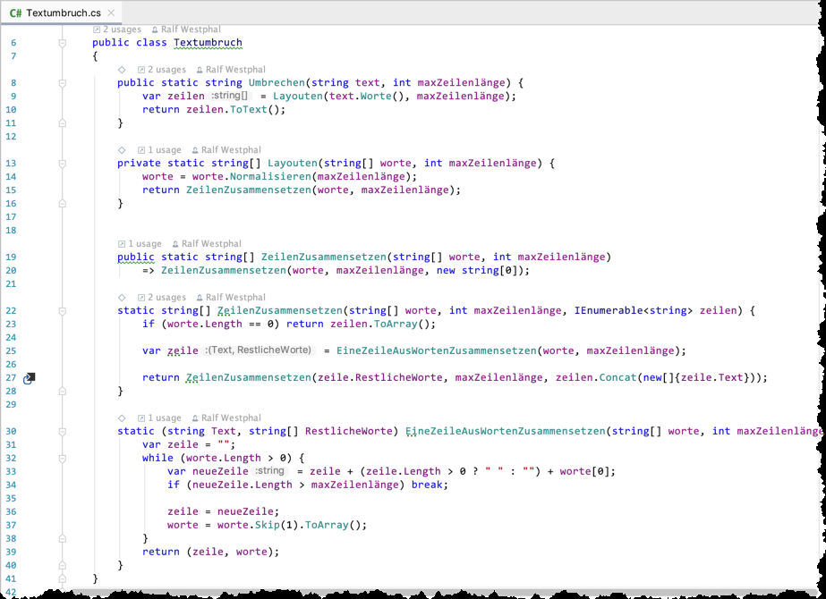

---

<!-- Page 463 of 493 -->

Musterlösung: 08-ExperimentellcodiereninderKomplexität 454
Die Lösung der Probleme mit TDDaiymi im Testcode legt für dich das
Problem auf eine Werkbank, wo du es von allen Seiten betrachten kannst.
Kein Rauschen durch anderen Produktionscode drumherum. Nichts, was
du dort “kaputtspielen” könntest. Und wenn die Lösung, die du dort
schrittweise “züchtest”, auf andere Logik im Produktionscode zurück-
greifen möchte, dann überprüfst du gleichzeitig, ob der schon genügend
feingranular in Funktionen und Module zerlegt ist.
TDDaiymi verlangsamt deinen Fortschritt in gewisser Weise. Es gibt
einen Overhead dadurch, dass du zur Refaktorisierung und schließlichen
Verpflanzunggezwungenbist. DieserPreisistjedoch geringimVerhältnis
zum Gewinn, den dir das Vorgehen bietet. Mit TDDaiymi hebst du
“Flaschenschiff-Programmierung” nochmal auf ein neues Level.
In der materiellen Welt werden Bauteile durchaus dort repariert, wo sie
während der Produktion eingebaut wurden. Software jedoch geht nicht
kaputt. Und wir reden hier nicht über Reparatur, sondern Entwicklung.
Hergestellt werden Bauteile in der materiellen Welt nicht innerhalb des
Gesamtsystems, in dem sie zum Einsatz kommen. Vielmehr werden sie
separathergestellt-undspäterzueinemGanzenzusammengefügt.Esgibt
also klar getrennte zwei Phasen.
Durch diese Phasen ist diese Musterlösung ebenfalls gelaufen: Zuerst
wurden die “Bauteile” hergestellt mit unterschiedlichen Ansätzen. Dann
wurden sie zum Ganzen integriert.
Herstellung und Integration und dann schließlich sogar Refaktorisierung
sind ganz unterschiedliche Phasen in der Produktion nicht nur von
Software. Dass Programmierung Entwicklung ist und nicht industrielle
Serienfertigung, macht dabei keinen Unterschied. Eine saubere Trennung
der Phasen ist deshalb sogar noch wichtiger, weil für jede ein anderes
Mindset hilfreich ist.
• Entwicklung von Bauteilen erfordert ein grundsätzlich kühnes Her-
angehen. Das ist der zentrale kreative Prozess in der Programmie-
rung.
• Die Integration von Bauteilen ist demgegenüber trivial und quasi
mechanisch. Sorgfalt ist schon nötig, aber kein “Erfindergeist”.
• Refaktorisierung schließlich braucht einen ganz anderen Blickwin-
kel. Nun geht es um die Zukunft. Ist das, was entwickelt und

---

<!-- Page 464 of 493 -->

Musterlösung: 08-ExperimentellcodiereninderKomplexität 455
integriert wurde und durch Akzeptanztests “bewiesen” die funk-
tionalen Anforderungen erfüllt, auch wirklich zukunftsfähig? Ist es
genügend testbar und wandelbar? Ist der Code übersichtlich, lesbar,
easytoreasonabout?Undfallsnicht,wiekannerbesserstrukturiert
werden? Hier braucht es nicht Kühnheit, sondern Akribie. Beispiel
dafür sind die finalen Refaktorisierungen im obigen Beispiel. Die
sind für die Erfüllung der Verhaltensanforderungen nicht wichtig.
Dennoch wurden sie vorgenommen, weil es nicht nur um heute
geht, sondern auch um morgen. Es geht nicht nur um den Autor
vonCode,sondernvielwichtigerumdieLeservonCode.Nocheine
Integration einzuziehen, um den Code verständlicher zu machen;
Funktionen in Module zu aggregieren, um den Code testbarer zu
machen. Das sind Maßnahmen zur Steigerung der Ordnung, die
sich langfristig auszahlen.
In gewisser Weise spiegelt das auch cTDD mit den Phasen green und
refactor wider.DieIntegrationfehltdortjedoch,weilsieimplizitistdurch
das “pear programming”. Bei komplizierten Problemen läufst du damit
jedoch den Problemberg “durch den Flaschenhals” ganz hoch.
Dazu stellt cTDD allerdings noch die Testperspektive:
• Ein test-first Herangehen braucht den Willen zum Blick von außen,
ohne sich schon um die Implementation zu kümmern. Das ist nicht
einfach, aber wichtig. Denn nur durch diese Zurückhaltung kommt
es erstens überhaupt zu den nötigen Tests und zweitens zu einer
“Oberfläche”derLösung,dietestfreundlichist.DieModularisierung
wird befördert.
Zurückhaltung als Tugend
Softwareentwicklung soll zügig Kundenwünsche mit Code erfüllen. Weil
das aber nicht nur heute, sondern auf unbestimmte Zeit auch in der
Zukunft eines Projektes oder Produktes so sein soll, braucht es eine
überraschende Haltung: Zurückhaltung.
Esgehtnichtdarum,nurschnellausderHüftemitCodeaufAnforderungs-
ziele zu schießen. Solche Kunststücke sind im Chaos vielleicht hilfreich,
um schnell grundlegende Klarheiten herzustellen.

---

<!-- Page 465 of 493 -->

Musterlösung: 08-ExperimentellcodiereninderKomplexität 456
Nein, es geht darum, besonnen diesseits des Chaos vorzugehen. Die
erste Zurückhaltung stellt dabei das test-first Vorgehen dar. Statt schon
Produktionscodezuschreiben,wirderstmaleinReife-Rahmengeschaffen,
in den er sich einfügen muss.
DiezweiteZurückhaltungstelltdiekomplementäreZerlegungdar-oder
noch deutlicher ein der Codierung vorgelagerter Entwurf -, indem dem
TestcodenichtsofortProduktionscodegegenübergestelltwird.Stattdessen
wird eine Struktur geschaffen, auf die sich Logik verteilen soll, um sie in
kleinen Happen entwickeln zu können, ohne überwältigend zu wirken.
Die dritte Zurückhaltung stellt TDDaiymi dar. Je kniffliger das Problem,
desto zurückhaltender solltest du sein, Produktionscode anzufassen. Mit
TDDaiymi hältst du dich bewusst fern davon. Erst wenn du sicher bist,
dass du es hinbekommen hast, veränderst du den Produktionscode.
Und schließlich besteht die vierte Zurückhaltung darin, dass du nach er-
folgreicher Produktionscodeänderung nicht sofort zum nächsten Problem
springst, um dort ein Feuer zu löschen. Du hältst dich davon zurück,
indem du das, was du gerade produziert hast aufräumst und ordentlich
zurücklässt. Das ist die Aufgabe der Refaktorisierung.
Die Restaurantküche wird am Tagesende nicht umsonst blitzblank hin-
terlassen; der nächste Tag kann dann ohne Behinderung beginnen. Oder
möchtest du erst Abwaschen, bevor du kochen kannst? Genauso nach
einer chirurgischen Operation: am Ende kommen alle Instrumente aus
dem Körper - deshalb wird gezählt - und dann in die Sterilisation. Für
die nächste Operation sollen sie sofort bereit sein.

---

<!-- Page 466 of 493 -->

Musterlösung: 09 - Test-first
refaktorisieren
Abgrenzung des System to Refactor
(S2R)
Zweck des Systems ist die byteweise Ausgabe von Dateiinhalten in
einem für Menschen lesbaren Format. Bytes werden in Blöcken zu je 16
zusammengefasst, die in derselben Bildschirmzeile sowohl als Hexadezi-
malzahlen wie ASCII-Zeichen dargestellt werden.
• Der Entry Point ins System ist die Methode Main(). Sie wird über
die Kommandozeile mit Parametern vom Benutzer aufgerufen.
• Abhängigkeiten vom System zur Umwelt gibt es in zwei Richtun-
gen:
– File I/O: Das System liest die zu verarbeitenden Daten aus
einer Datei.
– Console: Das System zeigt dem Benutzer formatierten Datei-
inhalt auf der Console an.
• Das zu refaktorisierende System hat eine sehr einfache Struktur:
eineKlassemiteinerMethode.InnerhalbdesSystemsgibtesmithin
keine Beziehungen.
Characterization Test
Das Testnetz unterhalb der Refaktorisierung sollte soviel Logik wie mög-
lich abdecken. Das bedeutet umgekehrt: Nur so wenig Logik wie nötig
sollte ausgeblendet werden.
Die Logik, die einen Test wirklich schwierig machen würde, ist die zur
Ausgabe auf der Console. Mit möglichst mechanischen Schritten muss

---

<!-- Page 467 of 493 -->

Musterlösung: 09-Test-firstrefaktorisieren 458
ich die ohne Tests zunächst freistellen und die Abhängigkeit dynamisch
machen.
Als Schnittstelle bietet sich dafür an, wie der Console-API benutzt wird.
S2R Entry Point testbar machen
Angesichts der Abhängigkeit, die ersetzt werden muss, ist der Entry Point
alsstatischeMethodenichtguttestbar.FlexiblerwirddasTesten,wenndie
Logik über eine nicht statische Methode zugänglich gemacht wird. Wie
schon in anderen Beispielen kann das einfach über eine Klasse geschehen,
die die ganze Anwendung repräsentiert: Application.
1 class MainClass
2 {
3 public static void Main (string[] args) {
4 var app = new Application();
5 app.Run(args);
6 }
7 }
In Run() befindet sich zunächst 1:1 nur das, was bisher in Main() stand.
Main() ist damit wieder auf den Belang Konstruktion fokussiert.
Console kapseln
DieKonsolennutzungziehtsichdurchdasS2R.UmohneTestkeineFehler
zu machen, sollte jeder Aufruf des API möglichst ohne Veränderung
übersetzt werden in einen Adapter-Aufruf, der später zu einem Surrogat
führt.
Adapter-Klasse einführen
Die Adapter-Klasse ist eigentlich nur eine 1:1 Kapsel um die Standardklas-
se Console herum. In zweierlei Hinsicht weicht sie jedoch ab:
• Wo die Standardklasse statische Methoden hat, bietet der Adapter
Instanzmethoden. Nur so ist eine dynamische Bindung möglich.
• Der Adapter fasst die zweimal auftauchende Kombination einer
AusgabeaufdemError-StreamunddenanschließendenProgramm-
abbruch zusammen in einer neuen Methode Abort(). Sowohl
WriteLine() wie Exit() lassen sich ja sonst kaum testen.

---

<!-- Page 468 of 493 -->

Musterlösung: 09-Test-firstrefaktorisieren 459
1 class ConsoleProvider {
2 public void Abort(int errorCode, string errorMessage) {
3 Console.Error.WriteLine(errorMessage);
4 Environment.Exit(errorCode);
5 }
6
7
8 public void WriteLine(string format, params object[] args)
9 => Console.WriteLine(format, args);
10
11 public void Write(string format, params object[] args)
12 => Console.Write(format, args);
13 }
In der Application-Klasse genügt es zunächst, eine Instanz des Adap-
ters zu erzeugen und an den Nutzungsstellen von Console zu benutzen.
Abgesehen von den neuen Abort() aufrufen kann diese Veränderung im
Grunde mit der Textersetzungsfunktion des Editors in der IDE geschehen.
1 class Application
2 {
3 private readonly ConsoleProvider _console = new ConsoleProvider();
4
5
6 public void Run(string[] args)
7 {
8 if (args.Length != 1)
9 _console.Abort(1, "Usage: hexdump <dateiname>");
10
11 if (!File.Exists(args[0]))
12 _console.Abort(2, $"No such file: {args[0]}");
13 ...
Adapter injizieren
Der nächste Schritt legt die Grundlage für eine Dynamisierung der Bin-
dunganeinenAdapter:dieApplikationgibtdieKontrolleüberdieInstanz
auf und lässt sie sich injizieren (IoC).
1 class Application
2 {
3 private readonly ConsoleProvider _console;
4
5 public Application(ConsoleProvider console) {
6 _console = console;
7 }
8 ...
Das übernimmt Main() als Anwendungskonstrukeur:

---

<!-- Page 469 of 493 -->

Musterlösung: 09-Test-firstrefaktorisieren 460
1 public static void Main (string[] args) {
2 var app = new Application(new ConsoleProvider());
3 app.Run(args);
4 }
Interface für Adapter-Klasse
AnschließendwirddieAbhängigkeitderApplicationzueinemkonkre-
ten Provider durch eine Abhängigkeit zu einem abstrakten ersetzt (DIP).
1 internal interface IConsoleProvider
2 {
3 void Abort(int errorCode, string errorMessage);
4 void WriteLine(string format, params object[] args);
5 void Write(string format, params object[] args);
6 }
7
8 class ConsoleProvider : IConsoleProvider { ... }
9
10
11 class Application
12 {
13 private readonly IConsoleProvider _console;
14
15 public Application(IConsoleProvider console) {
16 _console = console;
17 }
18 ...
Jetzt ist alles bereit für einen Test mit Surrogat.
Characterization Test aufsetzen
Für den Test gibt es kein Beispiel “von den Altvorderen”, die den Ancient
Code entwickelt haben. Dem Programm ist daher einfach “zu glauben”,
was es für einen beliebigen Input produziert - und das dann als Erwar-
tungswert im Test zu überprüfen.
Goldmaster generieren
Als Input für den Test wird eine kurze Datei gewählt:

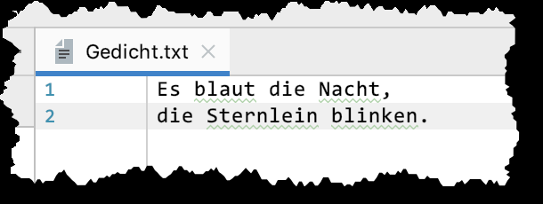

---

<!-- Page 470 of 493 -->

Musterlösung: 09-Test-firstrefaktorisieren 461
Durch Starten der Anwendung von Hand wird dazu das Ergebnis produ-
ziert:
MiteinerUmleitungderStandardausgabemittels> gedicht_goldmas-
ter.txt lässt sich das sogar direkt in eine Goldmaster-Datei schreiben:
Test mit Surrogat
Im Test kann nun zunächst der manuelle Ablauf nachgestellt werden:
1 [Fact]
2 public void Characterization_test() {
3 var sut = new Application(new ConsoleProvider());
4 sut.Run(new[]{"gedicht.txt"});
5 }
Die Ausgabe erfolgt weiterhin über die Console. Doch die wird nun
ersetztdurcheinSurrogat,mitdemdieÜberprüfungderAusgabemöglich
ist.

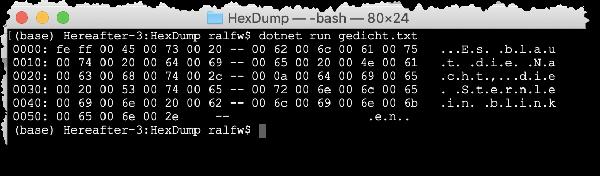

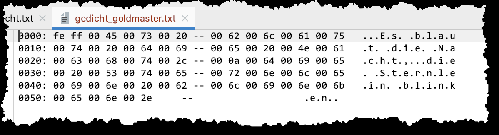

---

<!-- Page 471 of 493 -->

Musterlösung: 09-Test-firstrefaktorisieren 462
1 class ConsoleSurrogat : IConsoleProvider
2 {
3 public string Text;
4 public int ErrorCode;
5
6 public void Abort(int errorCode, string errorMessage) {
7 Text = errorMessage;
8 ErrorCode = errorCode;
9 }
10
11 public void WriteLine(string format, params object[] args)
12 => Text += string.Format(format, args) + Environment.NewLine;
13
14 public void Write(string format, params object[] args)
15 => Text += string.Format(format, args);
16 }
Der Häppchenweise ausgebene Text wird im Surrogat zu einem Block
zusammengesetzt, der am Ende mit dem Goldmaster verglichen werden
kann:
1 [Fact]
2 public void Characterization_test() {
3 var surrogat = new ConsoleSurrogat();
4 var sut = new Application(surrogat);
5
6 sut.Run(new[]{"gedicht.txt"});
7
8 var goldmaster = File.ReadAllText("gedicht_goldmaster.txt");
9 surrogat.Text.Should().Be(goldmaster);
10 }
Ist dieser Test nicht grün… kann es daran liegen, dass es noch Fehler bei
der Umstellung auf den Adapter gegeben hat. Zu dem Zeitpunkt gab es
noch keine Tests, so dass auch keine Sicherheit herrscht, ob das fehlerfrei
geklappt hat.
Der Surrogatcode selbst ist trivial. Dennoch könnte eine Unstimmigkeit
evtl. im Zusammenhang mit dem Gebrauch von Zeilenenden gegenüber
dem Goldmaster entstehen.
Insgesamt jedoch sollte der Characterization Test recht geradlinig erfolg-
reich gemacht werden können.
Verantwortlichkeiten identifizieren
Die gesamte Logik ist in einer Funktion versammelt. Das macht es
einerseits einfach, weil keine Zusammenhänge zwischen mehreren Logik-
Teilennachvollzogenwerdenmüssen.(Diegeradeeingeführtefunktionale
Abhängigkeit zum ConsoleProvider ist unwesentlich.)

---

<!-- Page 472 of 493 -->

Musterlösung: 09-Test-firstrefaktorisieren 463
Andererseits ist damit eben auch “alles auf einem Haufen” und ohne
herausgehobene Bedeutungen. Jede Verantwortlichkeit muss der Logik
einzeln abgerungen werden.
Eine Interpretation der Logik kann dann so aussehen:
Wieder liegen Verantwortlichkeiten auf zwei Ebenen. Grob unterscheide
ich
• die Analyse der Kommandozeilenparameter (1) und
• die eigentliche Ausgabe des HexDump (2).

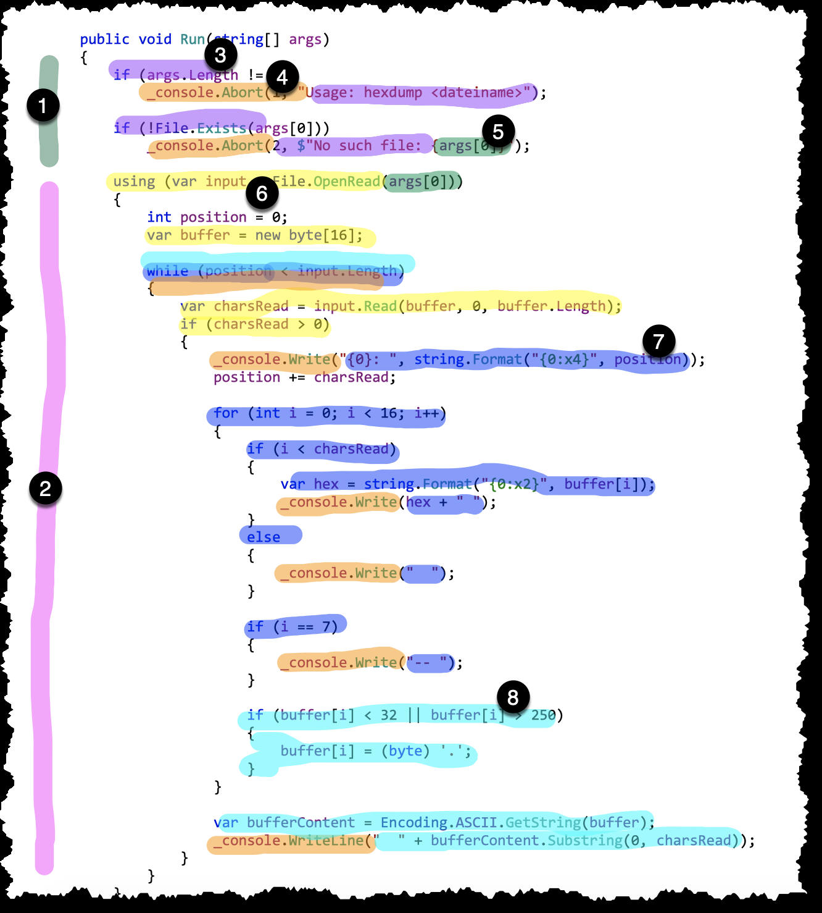

---

<!-- Page 473 of 493 -->

Musterlösung: 09-Test-firstrefaktorisieren 464
Innerhalb dieser Verantwortlichkeiten jedoch verstecken sich weitere. Die
Kommandozeilenanalyse enthält…
• eine Validation (3),
• Fehlerausgabe (4) und
• Zugriff auf Kommandozeilenparameter (5)
Zwei APIs sind daran beteiligt:
• die Konsolenausgabe und
• ein Zugriff aufs Dateisystem.
Das ist eine erhebliche Verquickung, die aufgelöst werden sollte!
Auf der anderen Seite die große Verantwortlichkeit zur Ausgabe des
Dateiinhalts als HexDump. Auch darin sind weitere Verantwortlichkeiten
enthalten:
• es wird auf die Kommandozeile zugegriffen (5),
• der Dateiinhalt wird gelesen (6),
• die Bytes werden hexademzimal formatiert (7),
• formatierte Bytes werden auf der Konsole ausgegeben (4) und
• und Bytes werden nach ASCII konvertiert.
All das findet abwechselnd in einer Schleife statt, die deshalb mit mehre-
ren Farben gekennzeichnet ist.
Markant für Ancient Code - oder allgemeiner: schwer verständlichen
Code - sind solche Schleifen, in denen Code vermischt ist, der verschie-
denen Verantwortlichkeiten dient. Wenn darin noch weitere Schleifen
oderFallunterscheidungeneingeschachteltsind,dieebenfallsMischungen
darstellen, wird es schnell sehr unübersichtlich.
Vergleiche damit den Ausgangszustand der obfuscate() Methode im
Erklärungstext von Kapitel 9 in Test-first Codierung¹²⁴. Darin waren auch
mehrere Verantwortlichkeiten zusammengefasst, doch deren Schleifen
standen in einer Sequenz, die es dann recht leicht gemacht hat, sie zu
extrahieren. Das ist beim HexDump-Code anders.
¹²⁴https://leanpub.com/test-first-codierung

---

<!-- Page 474 of 493 -->

Musterlösung: 09-Test-firstrefaktorisieren 465
Entwurf der neuen Codestruktur
Die sehr algorithmische Struktur der Logik, in der die Verantwortlichkei-
ten - insb. auch mit Ressourcenzugriff - so verquickt sind, bedarf einer
Vorüberlegung, wie eine Zielstruktur aussehen könnte. Außer den groben
Verantwortlichkeitsblöcken lassen sich keine so einfach in Funktionen
auslagern. Run() könnte so aussehen:
1 void Run(string[] args) {
2 Dump(GetFilename(args));
3 }
AberdaswärevielleichteinezustarkeVereinfachung,weildabeinichtdie
Validation mit einem möglichen Fehlschlag zu sehen wäre, was zu einem
deutlich anderen Programmverlauf führen würde.
ZugriffaufKommandozeilenparameter(5)undihreValidation(3)gehören
enger zusammen als die Reaktion auf einen dabei festgestellten “Fehler”
(4). Die Verantwortlichkeit (1) mit nur einer Funktion zu repräsentieren,
scheint deshalb nicht passend.
Die Schnittstelle zwischen (3+5, Parsen) und (4, Programmabbruch) bzw.
dem HexDump sind Daten: im Erfolgsfall ein Dateiname, ansonsten
Fehlercode und -meldung. Das sollte klar ersichtlich sein auf der obersten
Ebene innerhalb von Run().
Innerhalb der Herstellung des HexDump ist auf jeden Fall zunächst eine
Entzerrung von Dateizugriff und Formatierung und Ausgabe wichtig. Der
ständige Wechsel steht einer Refaktorisierung im Wege.
Gegen eine Sequenzialisierung spricht nichts. Die Verantwortlichkeiten
können konsequent nacheinander erfüllt werden:
1. Dateiinhalt in Byte-Blöcken lesen. buffer steht im Code für diese
Blöcke, wird allerdings immer wieder überschrieben. Das muss
nicht so sein.
2. Byte-Blöcke umwandeln in HexDump-Blöcke, die einen Teil der
Formatierung übernehmen.
3. HexDump-Blöcke engültig in Konsolenblöcke formatieren.
4. Konsolenblöcke ausgeben.

---

<!-- Page 475 of 493 -->

Musterlösung: 09-Test-firstrefaktorisieren 466
Eine solche Entzerrung ist nicht so einfach - aber zum Glück findet sie
schon über dem Sicherheitsnetz eines Tests statt.
Funktionen extrahieren
Kommandozeilenanalyse
Die Behandlung der Kommandozeile ist mit ein paar Handgriffen extra-
hiert:
1 void Parse_commandline(string[] args,
2 Action<string> onValid,
3 Action<int, string> onInvalid) {
4 if (args.Length != 1) onInvalid(1, "Usage: hexdump <dateiname>");
5
6 var filename = args[0];
7 if (!File.Exists(args[0])) onInvalid(2, $"No such file: {filename}");
8
9 onValid(filename);
10 }
Auch wenn hier noch der Ressourcenzugriff aufs Dateisystem inkludiert
ist, ist der Fokus eng und die Logik recht einfach testbar ohne Surrogat.
Die Entscheidungen zur Validität der Kommandozeile sind in der Ope-
ration gekapselt. Nach außen wird das Ergebnis über Continuations
verkündet, um keine Dark Logik am Aufrufort zu benötigen:
1 public void Run(string[] args) {
2 Parse_commandline(args,
3 onValid: HexDump,
4 onInvalid: _console.Abort);
5 }
Die Verständlichkeit ist hoch, weil sowohl der unterschiedliche Fluss der
Verhaltenserzeugung sichtbar ist, als auch der pauschale Programmab-
bruch bei Invalidität.
NachHexDump()istunverändertdieLogikgewandert(2),diebishernach
der Kommandozeilenanalyse in Run() stand.
HexDump I - Entzerrung der Logik
Die Extraktion der HexDump-Logik erfolgt nun in zwei Schritten. Im
ersten wird die Logik innerhalb von HexDump() nur entflochten.

---

<!-- Page 476 of 493 -->

Musterlösung: 09-Test-firstrefaktorisieren 467
Blöcke aus Datei lesen
Das Lesen des Dateiinhalts (6) ist schon recht kompakt am Anfang von
HexDump() platziert (siehe die gelben Blöcke in der Abbildung oben). Ei-
neFreistellungmiteigenerSchleifeistdeshalbnichtsoschwer-allerdings
mussmiteinerDatenstruktur,diedieBlöckesammelt,etwasaufgepolstert
werden.
Den nächsten Block zuerst in einen buffer zu lesen und dann in den
finalen block zu kopieren, könnte auch noch optimiert werden. Doch
in dieser Phase geht es nicht darum, optimale Logik zu produzieren,
sondern zu entzerren. Wenn dabei “Spähne fallen”, können diese später
zusammengekehrt werden.
1 private void HexDump(string filename) {
2 // Dateiinhalt lesen (6)
3 var blocks = new List<byte[]>();
4 using (var input = File.OpenRead(filename)) {
5 var buffer = new byte[16];
6
7 var position = 0;
8 while (position < input.Length) {
9 var charsRead = input.Read(buffer, 0, buffer.Length);
10 position += charsRead;
11 if (charsRead == 0) break;
12
13 var block = new byte[charsRead];
14 Array.Copy(buffer, block, block.Length);
15 blocks.Add(block);
16 }
17 }
18
19 // ...der Rest...
20 var address = 0;
21 foreach(var block in blocks) {
22 _console.Write("{0}: ", string.Format("{0:x4}", address));
23 address += block.Length;
24
25 for (int i = 0; i < 16; i++) {
26 if (i < block.Length) {
27 var hex = string.Format("{0:x2}", block[i]);
28 _console.Write(hex + " ");
29 }
30 else
31 _console.Write(" ");
32
33 if (i == 7)
34 _console.Write("-- ");
35
36 if (i < block.Length && (block[i] < 32 || block[i] > 250))
37 block[i] = (byte) '.';
38 }
39
40 var bufferContent = Encoding.ASCII.GetString(block);
41 _console.WriteLine(" " + bufferContent.Substring(0, block.Length));
42 }
43 }
Die restlichen Verantwortlichkeiten brauchen nun ihre eigene Schleife.
Die ist mit foreach schnell geschrieben - führt jedoch zu einem Fehler:

---

<!-- Page 477 of 493 -->

Musterlösung: 09-Test-firstrefaktorisieren 468
Vorher waren die Blöcke alle gleich lang, weil immer derselbe buffer
benutzt wurde, nun ist der letzte womöglich kürzer. Das führt zu einem
Problem bei der ASCII-Formatierung, das mit einem i< block.Length
im letzten if kompensiert werden muss.
Auch darf die 16 als Obergrenze in der for-Schleife nicht leichtfertig
durch block.Length ersetzt werden. Dann wäre zwar die Überprüfung
von i nicht mehr nötig, doch die Formatierung “verzöge sich”, so dass die
Ausgabe anders aussähe als der Goldmaster.
Zusammenstellung der HexDump-Blöcke
Die Kommunikation zwischen der nun konzentrierten Dateizugriffslogik
und dem Rest findet im Moment über einen primitiven Datentyp statt,
ein Byte-Array. Wenn dieser in einen eigenen gekapselt wird, dann bietet
er Ansatzpunkte für Logik. Das ist ein Schritt hinaus aus einer primitive
obsession.
1 struct Block
2 {
3 private readonly byte[] _bytes;
4
5 public Block (byte[] bytes, long address) {
6 _bytes = bytes;
7 Address = address;
8 }
9
10
11 public long Address { get; }
12
13 public int Length => _bytes.Length;
14
15 public string[] Hex => _bytes.Select(b => $"{b:x2}").ToArray();
16
17 public string ASCII {
18 get {
19 var normalized = _bytes.Select(Normalize).ToArray();
20 return Encoding.ASCII.GetString(normalized);
21
22 byte Normalize(byte b) {
23 if (b < 32 || b > 250) return (byte)'.';
24 return b;
25 }
26 }
27 }
28 }
Der Block ist die zentrale Domänendatenstruktur. Eigentlich ist er ein
Byte-ArraymitzusätzlicherFunktionalität.Deshalbisterhieralsstruct
ausgelegt und nicht als Klasse. In C# bedeutet das, Blöcke werden nicht
als Objekte behandelt und auf dem Heap abgelegt, sondern als Wertdaten-
typen auf dem Stack oder in anderen Datenstrukturen, wie das auch z.B.

---

<!-- Page 478 of 493 -->

Musterlösung: 09-Test-firstrefaktorisieren 469
mit int- Daten geschieht. Aber das ist nur ein Detail, das zeigen soll, wie
du flexibel mit den Mitteln deiner Programmiersprache arbeiten kannst.
Die Logik in Block betrifft zwar zwei Verantwortlichkeiten - die Kon-
vertierung von Bytes nach Hexadezimal (7) und nach ASCII (8) -, doch
die sind in zwei Properties klar getrennt und lassen sich unter dem
Oberbegriff “Konvertierung” gut in der Klasse zusammenfassen.
HexDumpschrumpftmitdieserExtraktionvonLogikschoneingutesStück
in der zweiten Phase:
1 private void HexDump(string filename) {
2 var blocks = new List<Block>();
3 using (var input = File.OpenRead(filename)) {
4 var buffer = new byte[16];
5
6 var position = 0;
7 while (position < input.Length) {
8 var charsRead = input.Read(buffer, 0, buffer.Length);
9 if (charsRead == 0) break;
10
11 var blockBytes = new byte[charsRead];
12 Array.Copy(buffer, blockBytes, blockBytes.Length);
13 blocks.Add(new Block(blockBytes, position));
14
15 position += charsRead;
16 }
17 }
18
19 foreach(var block in blocks) {
20 _console.Write($"{block.Address:x4}: ");
21
22 for (int i = 0; i < 16; i++) {
23 if (i < block.Length)
24 _console.Write(block.Hex[i] + " ");
25 else
26 _console.Write(" ");
27
28 if (i == 7)
29 _console.Write("-- ");
30 }
31
32 _console.WriteLine(" " + block.ASCII);
33 }
34 }
Im Diff zeigt sich, wo überall dafür Eingriffe vorgenommen wurden:
• BeimDateizugriffwurdederBlockeingeführt(42/43,52ff)unddie
Positionsberechnung umgestellt.
• Im Rest wurde vor allem nach Block hinein extrahiert, um an
der Extraktionsstelle stattdessen Zugriffe auf Block-Properties
einzusetzen (insb. 58-65).

---

<!-- Page 479 of 493 -->

Musterlösung: 09-Test-firstrefaktorisieren 470
Ausgabe formatieren
Es bleibt die Trennung der Formatierung von der eigentlichen Ausgabe.
Beides findet miteinander verzahnt in der zweiten Schleife statt:

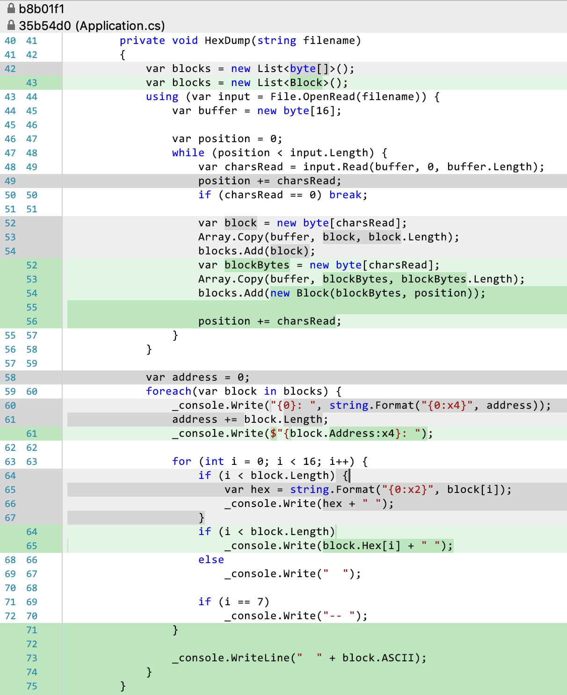

---

<!-- Page 480 of 493 -->

Musterlösung: 09-Test-firstrefaktorisieren 471
Was hier “parallel” abläuft, muss sequenzialisiert werden. Prozess statt
Algorithmus.
Die Lösung kann so einfach aussehen wie hier:
1 var formattedLines = blocks.Select(b => new BlockLine(b));
2
3 foreach(var l in formattedLines)
4 _console.WriteLine(l.ToString());
Indem die Formatierung ausgelagert wird in eine Datenklasse, die einen
Block kapselt und transformiert, ist die Application von der Logik
befreit und muss sich nur darum kümmern, dass aus jedem Block eine
BlockLine wird.
1 class BlockLine {
2 private readonly Block _block;
3
4 public BlockLine(Block block) { _block = block; }
5
6
7 public override string ToString() {
8 var line = $"{_block.Address:x4}: ";
9 for (int i = 0; i < 16; i++) {
10 if (i < _block.Length)
11 line += _block.Hex[i] + " ";
12 else
13 line += " ";
14
15 if (i == 7)
16 line += "-- ";
17 }
18 line += " " + _block.ASCII;
19 return line;
20 }
21 }
Block ist dabei eine Domänendatenklasse; sie ist unabhängig von Res-
sourcenaufrufen und auch sonstigen “Umwelteinflüssen”.

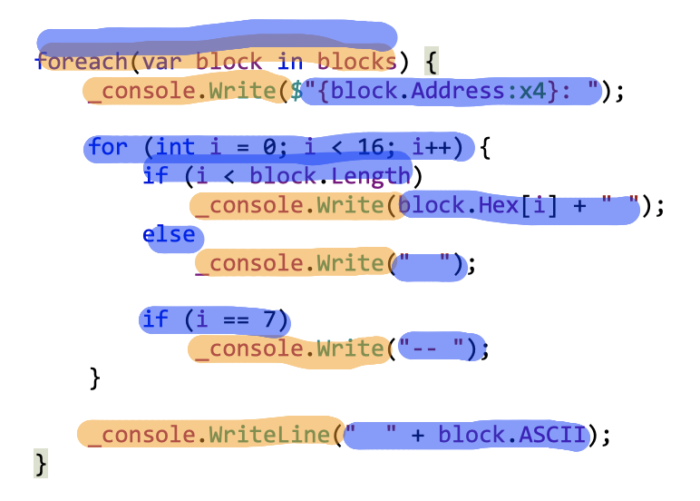

---

<!-- Page 481 of 493 -->

Musterlösung: 09-Test-firstrefaktorisieren 472
BlockLine hingegen neigt schon der Benutzerschnittstelle zu, weil die
Formatierung sehr konkret auf eine bestimmte Darstellungstechnologie
ausgerichtet ist. Würde zur Ausgabe eine HTML-Seite oder ein grafisches
UI gewählt, würde das Einfluss auf BlockLine haben.
Weil BlockLine keine Domänendatenklasse ist, liefert der Dateizugriff
keine Objekte dieser Klasse zurück. Er würde sich damit an die andere
Seite der Peripherie binden.
HexDump II - Refactor to IOSP
Auch wenn schon einige Logik in eigene Funktionen in weitere Klassen
ausgelagert wurde, bleibt in HexDump() noch mehr als genug für eine
Extraktion.
1 private void HexDump(string filename) {
2 var blocks = Load(filename);
3 var formattedLines = Format(blocks);
4 Display(formattedLines);
5 }
6
7 private static IEnumerable<Block> Load(string filename) {
8 using var input = File.OpenRead(filename);
9
10 var buffer = new byte[16];
11 var position = 0;
12 while (position < input.Length) {
13 var charsRead = input.Read(buffer, 0, buffer.Length);
14 if (charsRead == 0) break;
15
16 var blockBytes = new byte[charsRead];
17 Array.Copy(buffer, blockBytes, blockBytes.Length);
18 yield return new Block(blockBytes, position);
19
20 position += charsRead;
21 }
22 }
23
24 private static IEnumerable<BlockLine> Format(IEnumerable<Block> blocks)
25 => blocks.Select(b => new BlockLine(b));
26
27 private void Display(IEnumerable<BlockLine> formattedLines) {
28 foreach (var l in formattedLines)
29 _console.WriteLine(l.ToString());
30 }
Die Funktion Load() fällt dabei im Vergleich noch etwas umfänglich aus,
letztlich sind ca. 15 Zeilen Logik aber erstmal kein Problem und müssen
nicht dringend weiter refaktorisiert werden. Module für die Funktionen
zu finden, ist wichtiger.

---

<!-- Page 482 of 493 -->

Musterlösung: 09-Test-firstrefaktorisieren 473
Refactor to Modules
Application enthält jetzt einige Funktionen, aber nicht wirklich viele.
Es gibt zwei Integrationen - Run() und HexDump() -, der Rest sind
Operationen.
Die Klasse ist damit überschaubar. Ein “Mengendruck” für weitere Modu-
larisierung existiert nicht sehr spürbar. Inhaltlich jedoch geht es noch ein
wenig durcheinander. Es sind sehr unterschiedliche Verantwortlichkeiten
in Application vereint, die dadurch nicht gut separat testbar sind. Nur
Run() ist ein öffentliches Angebot der Klasse.
• Leicht erkennbar istDisplay() als Funktion, die zur Konsolenaus-
gabe gehört.
• Load() als größte Operation inklusive Ressourcenzugriff passt
auch nicht wirklich zur Applikation, deren Charakter Integration
ist. Ein eigener Provider liegt nahe.
• Auch die Verarbeitung der Kommandozeile mutet fehl am Plat-
ze in Application an. Die Kommandozeile gehört im Grunde
zur Benutzerschnittstelle; der Zugriff ist ein Ressourcenzugriff mit
eigenem API, auch wenn der trivial über ein String-Array läuft.
Im besondere Fall hier steckt in der Kommandozeilenanalyse aber
sogar noch mehr: ein Zugriff aufs Dateisystem. Auch hier liegt also
doch ein eigener Provider nahe.
• Was bleibt wären HexDump() und Format(). Als Integration und
sehr schlanke Operation könnten beide in Application verblei-
ben.AndererseitsstehenbeidefürdieDomäne,dieansonstendurch

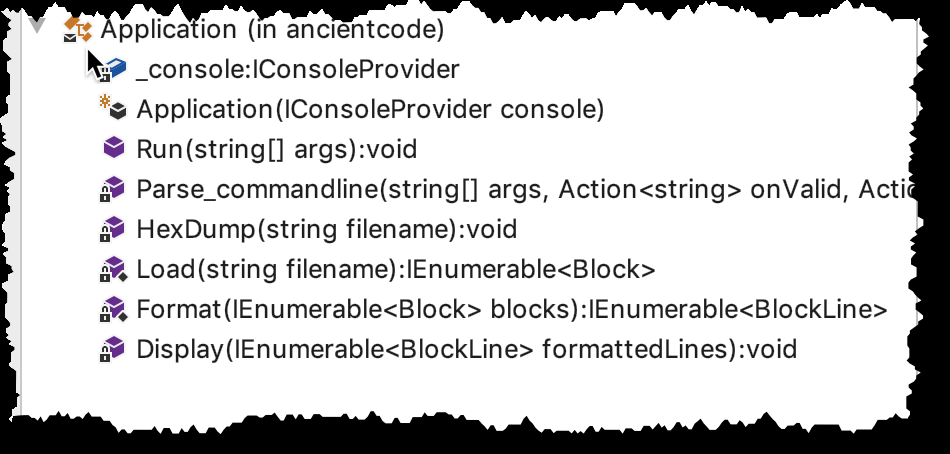

---

<!-- Page 483 of 493 -->

Musterlösung: 09-Test-firstrefaktorisieren 474
Datenklassen repräsentiert ist. Um die Domäne en bloc bei Bedarf
testbar zu machen, wäre es gut, auch sie auszulagern.
Diese Refaktorisierungen sind nicht schwierig, aber hier und da ziehen sie
etwas nach sich, das über die Extraktion in eine Klasse hinausgeht.
Der FileProvider zum Laden der Datei in Form von Blöcken besteht
aus nur einer Funktion, die 1:1 übernommen werden kann - allerdings
sollte die nun nicht länger statisch sein. Provider sind Kandidaten für
KonfigurationodergarDIP/IoC.Deshalblohntessich,sievonvornherein
als Instanzklassen auszulegen - selbst wenn erstmal keine weitere Flexibi-
lisierung gewünscht ist. Die Erfahrungswerte sprechen einfach zu sehr
dafür.
1 class FileProvider {
2 public IEnumerable<Block> Load(string filename) {
3 using var input = File.OpenRead(filename);
4
5 var buffer = new byte[16];
6 var position = 0;
7 while (position < input.Length) {
8 var charsRead = input.Read(buffer, 0, buffer.Length);
9 if (charsRead == 0) break;
10
11 var blockBytes = new byte[charsRead];
12 Array.Copy(buffer, blockBytes, blockBytes.Length);
13 yield return new Block(blockBytes, position);
14
15 position += charsRead;
16 }
17 }
18 }
Die Display() Funktion verringert die Oberfläche des ConsoleProvi-
der. Das zieht eine Anpassung des Interface nach sich.
1 class ConsoleProvider : IConsoleProvider
2 {
3 public void Abort(int errorCode, string errorMessage) {
4 Console.Error.WriteLine(errorMessage);
5 Environment.Exit(errorCode);
6 }
7
8 public void Display(IEnumerable<BlockLine> formattedLines) {
9 foreach (var l in formattedLines)
10 Console.WriteLine(l.ToString());
11 }
12 }
Für die Kommandozeilenanalyse lohnt sich als Peripherieklasse wieder
eine Instanzklasse. Hier beweist sich, wie gut die Entscheidung war, die
Ausgabe von Fehlermeldungen herauszurefaktorisieren: es besteht keine
Abhängigkeit zum ConsoleProvider. Das macht Tests dieser Klasse
einfacher, falls sie mal nötig werden sollten.

---

<!-- Page 484 of 493 -->

Musterlösung: 09-Test-firstrefaktorisieren 475
1 class CommandlinePortal
2 {
3 public void Parse(string[] args,
4 Action<string> onValid,
5 Action<int, string> onInvalid) {
6 if (args.Length != 1) onInvalid(1, "Usage: hexdump <dateiname>");
7
8 var filename = args[0];
9 if (!File.Exists(args[0])) onInvalid(2, $"No such file: {filename}");
10
11 onValid(filename);
12 }
13 }
Bei der Domänenklasse schließlich ergeben sich entgegen der ersten
Idee ein paar Änderungen. Interessanterweise ist sie abhängig vom Fi-
leProvider, der injiziert werden soll, und muss insofern auch eine
Instanzklasse sein. Andererseits wurde die Konsolenausgabe nicht mit
übernommen. Die in ihr “zu verstecken”, wäre ein Widerspruch gehen
das SLA gewesen, wie sich in Run() zeigen wird.
1 class HexDump {
2 private readonly FileProvider _file;
3
4 public HexDump(FileProvider file) { _file = file; }
5
6 public IEnumerable<BlockLine> Dump(string filename)
7 => _file.Load(filename)
8 .Select(block => new BlockLine(block));
9 }
Ohne die Konsolenausgabe bestand dann auch keine Notwendigkeit mehr,
die Integration ganz sauber aufrecht zu erhalten. Format() wurde auf-
gegeben, um den ganzen “Domänenprozess” in zwei Zeilen in Dump()
zusammenzufassen. Weitere Domänenlogik steckt in den Datenklassen
Block und BlockLine.
Für Application ergibt sich im Ergebnis eine drastische Reduktion.
Run() als Integration ist die einzig verbleibende Methode. Aber warum
nicht? Der Charakter von Application ist Integration - und zwar die
von Benutzerschnittstelle und Domäne.
Deshalb auch die konsequente Ansprache der Konsole nur in Applica-
tion in beiden Prozessästen (onValid und onInvalid).

---

<!-- Page 485 of 493 -->

Musterlösung: 09-Test-firstrefaktorisieren 476
1 class Application {
2 private readonly IConsoleProvider _console;
3 private readonly CommandlinePortal _cli;
4 private readonly HexDump _hexDump;
5
6 public Application(IConsoleProvider console) {
7 _console = console;
8 _cli = new CommandlinePortal();
9 _hexDump = new HexDump(new FileProvider());
10 }
11
12
13 public void Run(string[] args) {
14 _cli.Parse(args,
15 onValid: blocks => {
16 var formattedBlocks = _hexDump.Dump(blocks);
17 _console.Display(formattedBlocks);
18 },
19 onInvalid: _console.Abort);
20 }
21 }
Indem _console in beiden Ästen sichtbar ist, ist das Abstraktionsniveau
ausgeglichen.Konsolenausgabeistnirgendwo“inderTiefeversteckt”.Der
ganze Verarbeitungsprozess ist in Run() auf einen Blick zu sehen.
JetztbleibtnurnochdieFokussierungvonApplication.Bisheristdarin
noch Integration und Konstruktion vermischt. Nach SoC sollten diese
Belange getrennt werden. Durch Injektion der Instanzen…
1 class Application {
2 private readonly IConsoleProvider _console;
3 private readonly CommandlinePortal _cli;
4 private readonly HexDump _hexDump;
5
6 public Application(CommandlinePortal cli, HexDump hexDump,
7 IConsoleProvider console) {
8 _cli = cli;
9 _hexDump = hexDump;
10 _console = console;
11 }
12 ...
…muss Application nun auch nichts mehr von einem Dateizugriff
wissen. Der ist ein Detail von HexDump.
Und Main() tut, wofür es gedacht ist: es baut die Programmstruktur auf
und startet die Verarbeitung.

---

<!-- Page 486 of 493 -->

Musterlösung: 09-Test-firstrefaktorisieren 477
1 public static void Main (string[] args) {
2 var app = new Application(
3 new CommandlinePortal(),
4 new HexDump(
5 new FileProvider()),
6 new ConsoleProvider());
7 app.Run(args);
8 }
Damit ist der Ancient Code Monolith, der aus nur einer Klasse mit einer
Funktion bestand, aufgebrochen:
Bonus Verbesserungen
Die eigentlichen TODOs der Übungsaufgabe sind erledigt. Doch der Code
weist noch zumindest zwei Unschönheiten auf, die ich beseitigen will.
Auflösung einer logischen Abhängigkeit
Als die gesamte Logik noch in einer Methode stand, ist es vielleicht nicht
so auffällig gewesen, doch es gibt logische Abhängigkeiten zwischen zwei

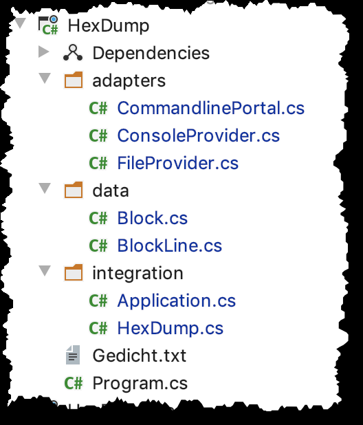

---

<!-- Page 487 of 493 -->

Musterlösung: 09-Test-firstrefaktorisieren 478
Verantwortlichkeiten. Die Beschaffung der Byte-Blöcke und ihre Forma-
tierung hängen zusammen. Ausdruck hat das immer schon gefunden in
der Wiederholung der Blockgröße von 16 Bytes.
Nach der Refaktorisierung findet sich diese Konstante sowohl im Fi-
leProvider wie in BlockLine. Das widerspricht dem Don’t Repeat
Yourself (DRY) Prinzip.
Der Blockbeschaffung ist die Größe des Blocks einerlei. Die 16 ist nur
relevant für die konkrete Form der Darstellung auf der Konsole. Insofern
wäre die Frage legitim, ob die Blockbeschaffung sich überhaupt um
diese Größe kümmern sollte. Oder sollte aus der Blockbeschaffung eine
Bytebeschaffung werden und Blöcke erst später in der Domäne zu bilden?
Das wäre nochmal ein massiver Eingriff in den Lösungsansatz und die
Struktur des Programms. Ob sich das lohnt?
Ein kleinerer Eingriff wäre die Vermeidung der mehrfachen Konstante
durch Konfiguration und Verallgemeinerung:
• Die Blockbeschaffung mit einer Blockgröße parametrisieren
• Die Blockformatierung mit einer Blockgröße parametrisieren
• DieBlockformatierungverallgemeinern,sodasssiemitunterschied-
lichen Blockgrößen funktioniert. Das betrifft die derzeitige Kon-
stante 7, mit der die hexadezimalen Werte in zwei Hälften geteilt
werden.
Die Parametrisierung kann in beiden Fällen über den Konstruktor stattfin-
den:
1 class FileProvider {
2 public IEnumerable<Block> Load(string filename, int blockSize) {
3 using var input = File.OpenRead(filename);
4
5 var buffer = new byte[blockSize];
6 ...
7
8
9 class BlockLine {
10 private readonly Block _block;
11 private readonly int _blockSize;
12
13 public BlockLine(Block block, int blockSize) {
14 _block = block;
15 _blockSize = blockSize;
16 }
17
18 public override string ToString() {
19 var line = $"{_block.Address:x4}: ";
20 for (int i = 0; i < _blockSize; i++) {
21 if (i < _block.Length)

---

<!-- Page 488 of 493 -->

Musterlösung: 09-Test-firstrefaktorisieren 479
22 line += _block.Hex[i] + " ";
23 else
24 line += " ";
25
26 if (i == _blockSize / 2 - 1)
27 line += "-- ";
28 }
29 line += " " + _block.ASCII;
30 return line;
31 }
32 }
Beim Laden der Blöcke fühlt sie das jedoch natürlicher an als bei der Da-
tenstruktur. Konsequenter wäre es wahrscheinlich, den Block mit einer
Soll- und einer Ist-Länge auszustatten. Dann wäre nur die Beschaffung
mit der Blocklänge zu parametrisieren.
Die Verallgemeinerung des Einschubs von -- zwischen die Hälften eines
BlocksfunktioniertindergezeigtenWeise.“Schön”istaberetwasanderes.
Für einen ersten Schritt in die richtige Richtung soll es aber genügen.
Die Parametrisierung erfolgt in HexDump, wo sowohl die Beschaffung
aufgerufen wird, wie die BlockLine-Objekte gebaut werden.
1 class HexDump {
2 private readonly FileProvider _file;
3 private readonly int _blockSize;
4
5 public HexDump(FileProvider file, int blockSize) {
6 _file = file;
7 _blockSize = blockSize;
8 }
9
10
11 public IEnumerable<BlockLine> Dump(string filename)
12 => _file.Load(filename, _blockSize)
13 .Select(block => new BlockLine(block, _blockSize));
14 }
Aber auch HexDump entscheidet nicht über die Blockgröße, sondern
die Benutzerschnittstelle. Die könnte in Application beim Aufruf von
Dump() nach der gewünschten Blockgröße gefragt werden - oder die
Blockgröße wird einmal bei der Konstruktion festgelegt:

---

<!-- Page 489 of 493 -->

Musterlösung: 09-Test-firstrefaktorisieren 480
1 public static void Main (string[] args) {
2 var app = new Application(
3 new CommandlinePortal(),
4 new integration.HexDump(
5 new FileProvider(),
6 ConsoleProvider.BLOCK_SIZE),
7 new ConsoleProvider());
8 app.Run(args);
9 }
Damit ist die Blockgröße nur noch an einer Stelle im Programm fi-
xiert, in ConsoleProvider. Allerdings ist sie relevant bis hinunter
zum Ressourcenzugriff. Ob das optimal ist? Und ob es eine gute Sache
ist, zwei Verantwortlichkeiten damit zu parametrisieren, statt nur die
Blockbeschaffung? Darüber könnte weiter nachgedacht werden - aber
zur Säuberung von Code gehört auch, einen Punkt zu finden, an dem
man aufhört. Denn bedingt durch die Relativität und Subjektivität von
Ordnung läuft man sonst Gefahr, sich in einer “refactoring paralysis” zu
verfangen: Man kommt nicht weiter, weil man immer noch ein wenig
Unordnung sieht, die erst aufgeräumt werden muss.
Und es gibt noch einen zweiten Grund, warum du aufpassen musst, nicht
in Refaktorisierung bis zur Perfektion zu versinken: Bei der Refaktorisie-
rung kannst du ein Gefühl von Kontrolle entwickeln, dass dir bei der
nächsten neuen Anforderung fehlt. Die Unsicherheit, was zu tun ist für
ein neues Feature, kann viel größer sein, als die, während du Ordnung
schaffst. Refaktorisieren kann mithin dem Prokrastinieren dienen, denn
Kontrolle ist verführerisch. Also aufgepasst!
Deshalb verfolge ich hier weitere Optimierungen in Bezug auf die Block-
größe nicht.
Fehlerkorrektur in der Ausgabe
Vielleicht ist dir schon beim Characterization Test aufgefallen, dass die
Ausgabe eigentlich fehlerhaft ist:
EssollenzwarnichtmehrBytesinhexadezimalerFormangezeigtwerden,
als da sind, aber deshalb sollen die ASCII-Zeichen der vorhandenen Bytes

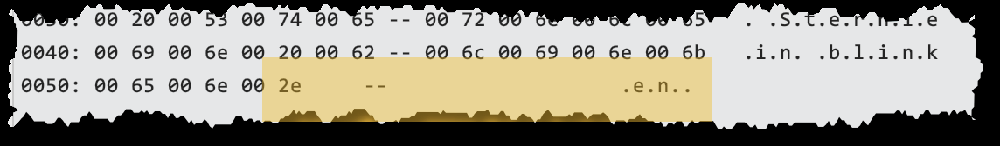

---

<!-- Page 490 of 493 -->

Musterlösung: 09-Test-firstrefaktorisieren 481
nicht in der letzten Zeile verrutschen gegenüber denen vorheriger. Das
Verhalten der aktuellen Logik ist für einen edge case also nicht korrekt.
Im ersten Zuge der Ordnung konnte darauf allerdings nicht eingegangen
werden. Refaktorisierung bedeutet, die Struktur zu verändern, ohne die
Funktionalität anzutasten. Das gilt auch, wenn die Funktionalität inkor-
rekt hergestellt wurde. (Im schlimmsten Fall haben sich Anwender sogar
aufeineInkorrektheiteingestellt,Workaroundsgefundenundwürdenmit
einer Korrektur zunächst sogar verwirrt/behindert.)
Um die Inkorrektheit nun jedoch abschließend doch zu beheben, ist
natürlich ein test-first Vorgehen angezeigt. Wo ist dafür der Ansatzpunkt
für einen Modultest? Reicht es, den Akzeptanztest (aka Characterization
Test) auf eine korrekte Erwartung umzustellen?
Diese Umstellung muss früher oder später ohnehin erfolgen. Mit ihr kann
also begonnen werden. Das geschieht durch Anpassung des Goldmasters:
Der Characterization Tests ist dann rot.
Nun könnte schon mit der Korrektur begonnen werden - doch die zu
verändernde Logik liegt “tief verborgen” im Funktionsbaum. An ihr
“herumzuschrauben” und nur den Characterization Test als Prüfinstanz
zu haben, scheint mir weit weg. Ein Gerüsttest oder Modultest dichter
dran, würde wenn schon nicht in diesem Fall ein schnelleres, so doch
wahrscheinlich ein spezifischeres Feedback geben, falls etwas während
der Korrektur verrutschten sollte.
Die Formatierung findet in BlockLine statt. Darauf kann ein Modultest
leicht angesetzt werden. Zunächst lohnt es sich allerdings, den Fehler
zu reproduzieren, d.h. in diesem Fall einen grünen Test zu schreiben
mit letztlich inkorrekter Erwartung. Der kann auf der letzten Zeile im
ursprünglichen Goldmaster basieren. Die lautet:
1 0050: 00 65 00 6e 00 2e -- .e.n..

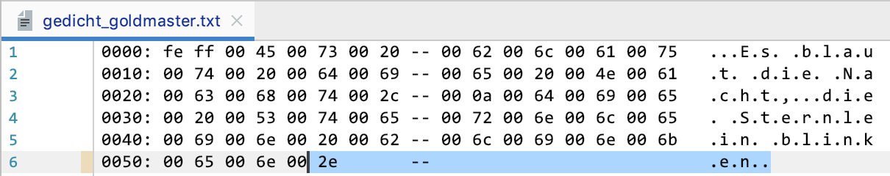

---

<!-- Page 491 of 493 -->

Musterlösung: 09-Test-firstrefaktorisieren 482
Im Test kann das vereinfacht werden, weil es nicht auf die Übersetzung
der Bytes nach Hex/ASCII ankommt, sondern auf ihre Positionierung:
1 [Fact]
2 public void Fehlerreproduktion() {
3 var sut = new BlockLine(new Block(new byte[]{1,2,3,4,5,6},1), 16);
4 sut.ToString().Should().Be("0001: 01 02 03 04 05 06 -- ......");
5 }
Dieser Test soll in Zukunft rot werden; ist also ein Gerüsttest. Ein anderer
hingegen muss grün werden:
1 [Fact]
2 public void Korrekte_Formatierung() {
3 var sut = new BlockLine(new Block(new byte[]{1,2,3,4,5,6},1), 16);
4 sut.ToString().Should().Be("0001: 01 02 03 04 05 06 -- \
5 ......");
6 }
Jetzt kann die Korrektur der Logik versucht werden.
Das Problem liegt nicht in der Formatierung der Block-Adresse und nicht
beidenASCII-Zeichen,sondernlediglichbeiderhexadezimalenFormatie-
rung zwischen beidem. Die dafür zuständige Logik könnte zunächst noch
weiter in BlockLine herauspräpariert werden:
1 public override string ToString()
2 => $"{_block.Address:x4}: {ToHex()} {_block.ASCII}";
3
4 string ToHex() {
5 var line = "";
6 for (int i = 0; i < _blockSize; i++) {
7 if (i < _block.Length)
8 line += _block.Hex[i] + " ";
9 else
10 line += " ";
11
12 if (i == _blockSize / 2 - 1)
13 line += "-- ";
14 }
15 return line;
16 }
Mit der Funktion für die Hex-Bytes lässt sich die grobe Zeilenstrukturie-
rung schon sehr hübsch in einer Zeile fokussieren. ToHex() greift dabei
wie ToString() auf die globalen Daten im Objekt zu. Ein Gerüsttest
könnte nun noch spezifischer darauf angesetzt werden. Doch der Modul-
test soll genügen. Allerdings ist es angenehm, dass das “Operationsfeld”
für den Bug Fix mit ToHex() nun kleiner ist.

---

<!-- Page 492 of 493 -->

Musterlösung: 09-Test-firstrefaktorisieren 483
Bei genauerem Hinsehen wird schnell klar, dass das Problem in einer
Ungleichbehandlung von vorhandenen Bytes und abwesenden in Bezug
auf die Blockgröße liegt. Abwesende werden zwar durch Leerzeichen
ersetzt, doch es wird ihnen kein trennendes Leerzeichen nachgestellt.
Nach Korrektur und etwas Komprimierung sieht die Logik z.B. so aus:
1 string ToHex() {
2 var line = "";
3 for (int i = 0; i < _blockSize; i++) {
4 line += (i < _block.Length ? _block.Hex[i] : " ") + " ";
5 line += (i == _blockSize / 2 - 1) ? "-- " : "";
6 }
7 return line;
8 }
Für die Tests bedeutet das:
• Der Modultest für den korrekten Fall ist jetzt grün.
• Der Modultest für den früheren inkorrekten Fall ist jetzt rot - und
wird gelöscht.
• DerCharakterizationTestistjetztauchwiedergrün.DasProgramm
funktioniert nun so, wie es schon immer hätte funktionieren sollen.
Zusammenfassung
Die Domäne für diesen Ancient Code war klarer, greifbarer als bei der
Obfuskation. Dennoch war die Herausforderung für die Refaktorisierung
etwas größer, weil das Verhalten weniger in einem Prozess als vielmehr
“algorithmisch” in geschachtelten Kontrollstrukturen, also in der Tiefe
hergestellt wurde.
Mit einem systematischen Vorgehen, war die Aufgabe aber gut zu meis-
tern:

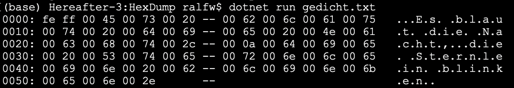

---

<!-- Page 493 of 493 -->

Musterlösung: 09-Test-firstrefaktorisieren 484
1. Abgrenzen:DasS2Rgenaubestimmen,Abhängigkeitenidentifizie-
ren und Ansatzpunkte für Charakterization Tests finden.
2. Testen: Das S2R unter Test setzen, bevor irgendwelche Verände-
rungen vorgenommen werden. Die Refaktorisierung dafür minimal
halten.
3. Konzentrieren: Weil die Logik in ihren Verantwortlichkeiten sehr
verwoben war, mussten die zuerst entzerrt und für sich in einer
Sequenz von Prozessschritten konzentriert werden.
4. Extrahieren: Die erkennbaren Prozessschritte konnten leicht nach
IOSP in eigene Funktionen ausgelagert werden.
5. Modularisieren: Die vielen kleinen, fokussierten Funktionen konn-
ten schließlich auf Module verteilt bzw. in neue herausgezogen
werden.
Bemerkenswert ist an dieser Lösung, dass sich zweimal Datenklassen als
natürliche Sammlungspunkte für Logik ergeben haben. Das hat jeden An-
schein von primitive obsession verwischt und macht auch aus Perspektive
der Objektorientierung Freude.