<!-- Page 1 of 27 -->

Problems for Developer and PO
Montag, 9. Dezember 2024 17:53
Goals of Software Development
• Provide more valuefor customer
• All requirements are describing the whole value
• Customer expects
○ Quality
○ Correct behavior
○ Quick changes
• Customer expects not
○ Maintainable code
○ Testable code
○ Only implicitly
Are User Stories / Use Cases good enough for requirements analysis?
• How do User Story Maps or Use Cases organize requirements?
• How to verify correctness?
○ Acceptance Tests?
○ But how clear can you describe them if you don´t know the code yet that fulfills the criteria?
○ Refer to UI?
• Do increments refer to code?
○ Related to testability?
• Problemfor developer and also PO:
○ Whenis increment correct?
○ Potential of misunderstandingsand presumptions
○ May lead to unexpected iterations
• Can requirements be divided recursively into smaller pieces?
○ Maybe to some extent yes
○ But is there relation to code?
• User Stories / Use cases of course still useful, but
○ focusis on POand Product Manager
○ Less focus on developer
○ They do not touch/ reach the codelevel close enough
• To solvethis gap of clearness developer needs "a plan"
○ of initially excludinga requirementsarea
○ or only building a prototype
•
Slicing Page 1

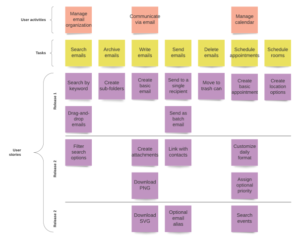

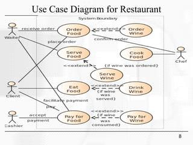

---

<!-- Page 2 of 27 -->

Slicing - Goals of Requirements Analysis
Dienstag, 16. Juli 2024 15:56
• Understanding
• Requirements unclear
○ Huge
○ Complex
○ Confusing
• Divide and Conquer
○ Typically known in code (Modularization, Separation of Concerns)
○ Use it also in requirements
• But divide into what?
○ Scopes?
○ Features?
• Why divide? Why divide code?
○ Clarity -> Modularization
○ Correctness
○ => Testability
• Slicing may help as a systematic approach to spot unclarity
○ Slicing defines clear hierarchy to go through
○ From rough to fine contexts / scopes
○ Scopes on all analysis levels (high and low ones)
○ Each scope and level has a representation in code
When do you know the analysis is finished?
• Tuple:
○ Function signature of Entry Point: input, name, output
○ Test cases per Entry Point function
○ This tuple is your goal
• Nice to have: Causal chain
○ What steps are necessary to transform the input to the desired output
• „A function with signature <signature> to satisfy the test <test case> by implementing <causal
chain>.
• Do not leave PO before you know the tuple
○ Avoids response waiting times and avoids unnecessary local pre optimizations
• If not clear even for PO -> reduce scope or implement prototype
○ Prototype: can be code or other type of analysis e.g. on paper
• At end of discussion it should be clear:
○ Which function should I implement?
○ Trigger function with Input and Output data: triggered by user
○ Test cases for each function signature
From <https://www.dotnetpro.de/planung/architektur/strukturiert-zerlegen-2911848.html>
Slicing Page 2

---

<!-- Page 3 of 27 -->

Hierarchy Levels
Dienstag, 16. Juli 2024 16:28
From <https://www.dotnetpro.de/planung/clean-code/stier-hoernern-packen-2915202.html>
Hierarchy Levels
• L1 -System:Das gesamte Softwaresystem in seiner Umwelt im Überblick.
• L2 -Context:Das Softwaresystem, zerlegt in große thematische Bereiche. z. B. Amazon: Kunden, Lagerhaltung, Einkauf
• L3 -App:Ein Context, zerlegt in unterschiedliche, eigenständige Zugänge für Anwenderrollen. z. B. App für User, App für Admins
• L4 -Worker:Eine App, zerlegt in grobe selbstständige Einheiten mit eigenen Schnittstellen für Mensch oder Software. z. B. verschiedene
Betriebssystemprozesse für Client und Server
• L5 -Perspective:Ein Worker, betrachtet durch unterschiedliche Brillen eines Benutzers. z. B. Amazon: Meine Bestellungen, Shop, Warenkorb
• L6 -Dialog:Eine Perspective, zerlegt in thematisch fokussierte, deutlich unterscheidbare „Fenster“ mit ihren Übergängen beziehungsweise Verbindungen.
• L7-Interaction:Die in einem Dialog triggerbaren Funktionen der Software mit ihren Ausgangspunkten und möglicherweise verschiedenen Endpunkten.
• L8 -Entry Point:Die „Triggerfunktion“ hinter einer Interaktion mit konkreten Beschreibung der Nachrichten an/von eine(r) „Triggerfunktion“ (Request,
Response) und des für sie relevanten Zustands beziehungsweise ihrer Seiteneffekte.
• L9 -CQSKlassifizierung eines Entry Points gemäß Command-Query-Separation-Prinzip beziehungsweise Aufspaltung der „Triggerfunktion“ in mehrere
Funktionen, die CQS-konform sind.
• L10 -Feature:Die Anforderungen an eine „Triggerfunktion“ in feinere Inkremente zerlegen, ausgehend von ihren Nachrichten und ihrem Zustand.
• You may have different structure but there are two fix points
• System
• Entry Point
• Some levels (e.g. System) are rarely in focus, some are often (e.g. Interactions)
Slicing
• Top down analysis, top down slices (implementations), from outside to inside
• Thinslices ->
• Quick iterations / implementations
• Quick customer feedback
• A Slice = One Feature of an Entry Point
Suggestion for a mapping of Slicing hierarchy for developer relevant structures:
Slicing Page 3

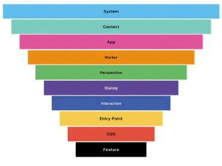

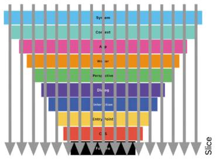

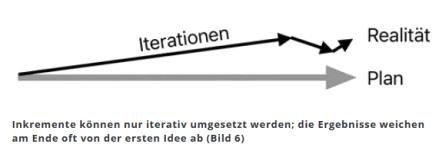

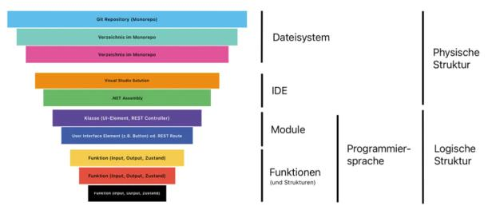

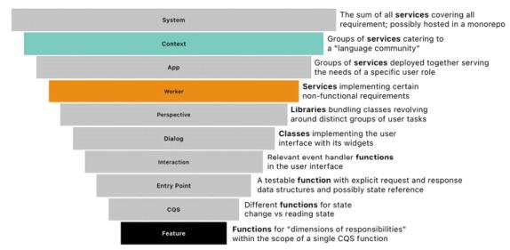

---

<!-- Page 4 of 27 -->

System
• Environment <-> Software communication
• User Roles (types of users, can also be other systems)
• Portals
• Resources (file system, database, other systems,…)
• Providers
•
• Request and Response
•
Checklist
• All user rolesknown?
• All states (internal/external) / resourcesknown? Easily overseen e.g. time, random numbers generator
• Do we know the domainnow?
• Which technologies(frontend, …)?
• Teamknow-howabout the technology?
• Interactionsbetween system and users/environment?
• Function signature, which state is required and how to be used by function
• Test cases
• Which trigger function should I implement?
• Non-functionalrequirements (performance, security…)?
• Datastructures?
Still Unclear how to get to Entry Point?
• Think from bottom to top
• Entry point unclear?
• What about next level interactions?
• Interactions unclear?
• What about next level dialogs and their connections?
• Dialogs unclear?
• What about perspectives of users and how they see the system and their interaction?
• Level clear?
• YES -> Go DOWN
• NO -> Go UP
Slicing Page 4

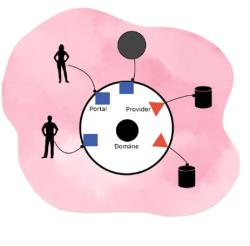

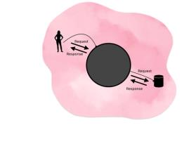

---

<!-- Page 5 of 27 -->

Interactions (Level 7)
Dienstag, 23. Juli 2024 16:36
Users want Interactions
Do not leave PO until Interactions are clear
Basic code structure of processing interactions
• Collect request input data via UI technology in Portal (Adapter)
• Process = Trigger function = Entry Point
• Project response output data via UI technology in Portal (Adapter)
Event handler calls Trigger function
• Event handler / Command (WPF) are part of UI technology (within Portal as Adapter)
Slicing Page 5

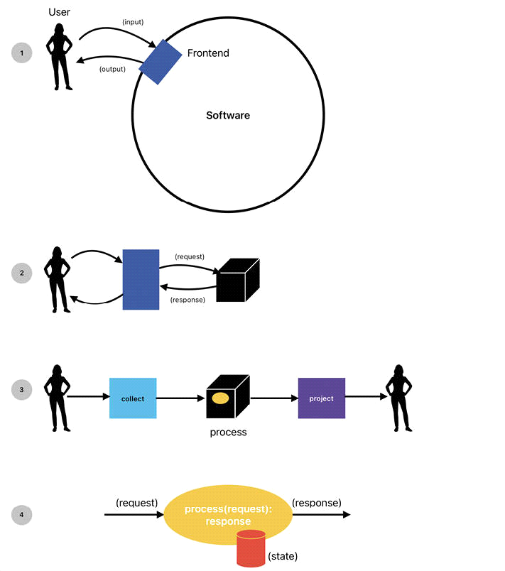

---

<!-- Page 6 of 27 -->

• Interactions can be hard to identify. Dozens/Hundreds of interactions possible in complex
systems. Customer cannot answer it in the first place.
• Interaction is the answer to: What should happen when?
Hier sind typische Fragen, mit deren Hilfe Sie das Gespräch leiten können:
○ „Welche Buttons möchtest du klicken können?“
○ „Welche Menüpunkte brauchst du?“
○ „Sollen Tastendrücke bei Eingabe der Daten das Verhalten auslösen?“
○ „Wann und wie soll Verhalten X eigentlich ausgelöst
werden?“
○ „Kommt es zu Verhalten Y durch einen ‚Reiz‘ des Anwenders oder automatisch?“
• The more requirements the less a PO can say in early analysis phase. Thus we have hierarchy
levels above interactions
• Sometimes not so important if interaction is triggered by button or menu.
• More important to distinguish behavior X from Y
• State in frontend? Trigger function returns all data or only new data?
○ Another trigger function could do it differently
○ -> UI Technology must be clear
From <https://www.dotnetpro.de/planung/clean-code/messer-richtig-ansetzen-2918866.html>
Slicing Page 6

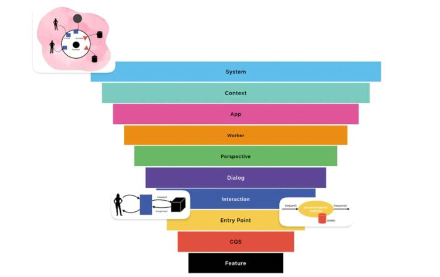

---

<!-- Page 7 of 27 -->

Entry Points (Level 8)
Freitag, 13. September 2024 17:11
• What is the difference between Trigger function and Entry Point
○ Same function on different levels of hierarchy
▪ Left: Interaction Level Right: Entry Point Level
○ Trigger function during PO discussion on Interaction Level
▪ Focus on user interaction
▪ For understanding that there is such a function with its request/response data in
general (e.g. HTTP Endpoint / Api Controller)
○ Entry Point more concrete, where the real behavior is implemented (in the backend)
▪ Focus on technical implementation
▪ Request/Input data
▪ Response data
▪ May produce state/side effect
○ State within frontend or black box?
▪ Signature depends on it
▪ Depends on where and how you can test more code more easily?
▪ If state handling in frontend requires more effort than do it in black box (backend).
If trivial in frontend where code does not requiring to be tested then do it in
frontend
▪ Example: Create Todo List
□ list_create(name: string):List[]
 No state handling in Frontend required
□ list_create(name: string):List
 Frontend needs to hold state to show all lists
○ When not considering the environment (e.g. UI technology) and it´s interactions with
the core (black box) of the software system, that could be a problematic pre
optimization.
▪ It is ok that the UI/UX paradigm is considered in the black box but of course the UI
Framework functionality must be encapsulated within Portal
▪ Must be a conscious decision between efficiency and flexibility (to be able to
change UI technology)
Example
○ Trigger functions:
Slicing Page 7

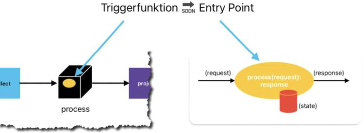

---

<!-- Page 8 of 27 -->

○
○ Entry points:
○
○ Either test each entry point separately or test with scenario test, e.g.:
○
Scenario tests just cover basic workflow (end to end) but not all conditions and logic of
the code
Slicing Page 8

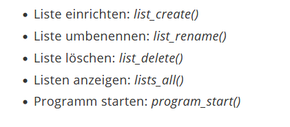

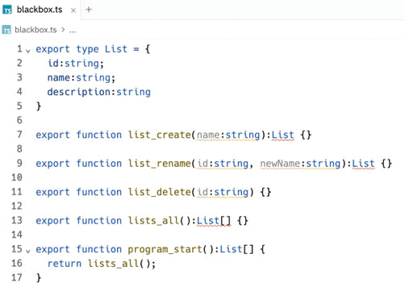

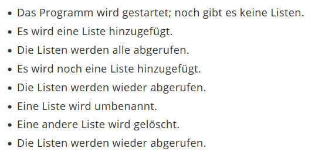

---

<!-- Page 9 of 27 -->

○
• In simple cases you have a few simple interactions and you can go breadth-first
• or concentrate on single interaction (depth-first)
• It depends how breadth you can work
• Important to have at least one entry point to complete and then proceed with next
Slicing Page 9

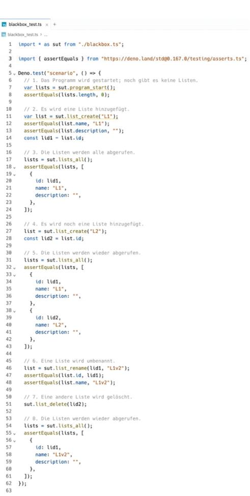

---

<!-- Page 10 of 27 -->

Command Query Separation - CQS (Level 9)
Montag, 21. Oktober 2024 17:21
CQS means Slicing on method level
• Separation of Command and Query
• Command
○ Changestate
○ No return value except metadata like ID of new dataset or count of changed/deleted
datasets
○ Can be seen like a POSTin web
• Query
○ Just read/ return values
○ No state change
○ GETin web
• Advantages
○ Separate testabilityof these different approaches and the separate handlingof data
○ Technological separation of these modes; for example:
▪ Commandsmay require locks
▪ but Queriesdo not
○ Reusability in different contexts due to more fine-grained functions.
• From this perspective, entry points are often unclear. They offer potential for refinement by
narrowing the scope to focus on command versus query.
Example
• Command
○ list_delete
• Query
○ program_start
○ lists_all
• Mixed
○ list_create
○ list_rename
○ Method names seemto be commandsbut they return data
○ Important to recognizethis and make a conscious decisionto split or not to split e. g.
when
▪ the data to be returned is “generated” naturallyduring command execution and
data is not too much
▪ performanceis critical
Refactored list_rename:
Slicing Page 10

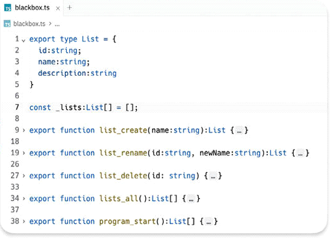

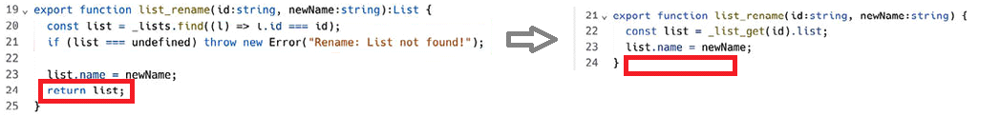

---

<!-- Page 11 of 27 -->

UI drives the Slicing
Mittwoch, 23. Oktober 2024 23:31
• Problem in requirements analysis: Hundreds of Entry points possible
○ PO cannot give the Entry points, even Interactions are not all known
• Hierarchy of Scopes
Slicing hierarchy orthogonal to User Stories / Use Cases
Slicing Page 11

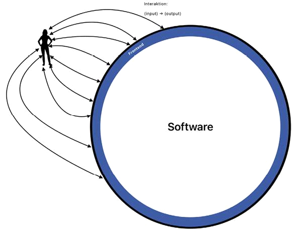

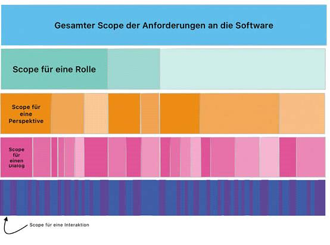

---

<!-- Page 12 of 27 -->

Slicing hierarchy orthogonal to User Stories / Use Cases
○ User Stories / Use cases
▪ Focus on user perspectives
▪ Rough descriptions of user interactions / software behavior
○ Slicing
▪ Focus on developer and technical implementation
▪ Detailed breakdown of requirements
▪ Provides concrete technical artifacts / structure elements like Entry Points, CQS Functions
○ User Stories / Use Cases define scopes that have many slices in slicing hierarchy
▪ Developer has no starting point for design and coding
○ Developer needs to slice to find Entry points to have a starting point for design and coding
Applications
• First look at roles that user of system has
• For each role separate app or all in one app?
One size fits all
Slicing Page 12

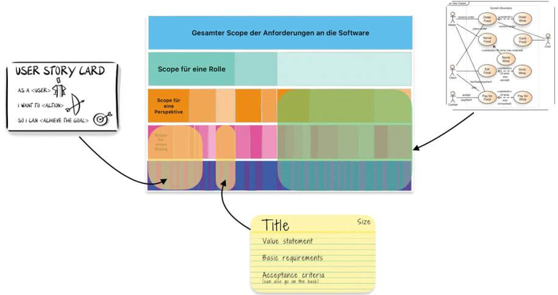

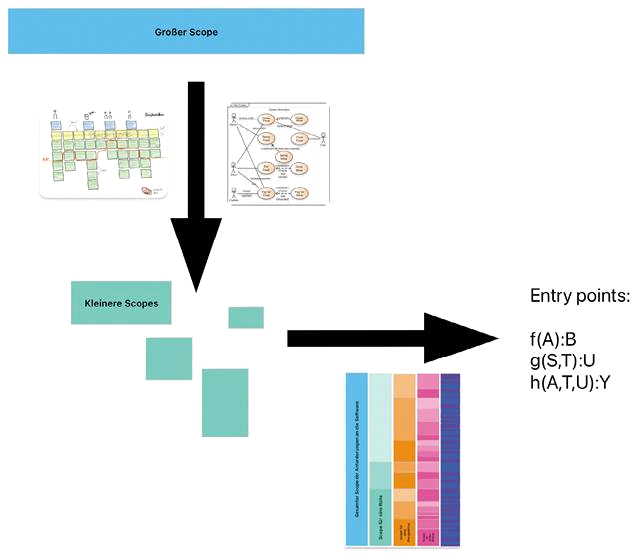

---

<!-- Page 13 of 27 -->

○ One size fits all
○ Outlook: Mail, Calendar, Contacts, Tasks
○ Best of breed
○ E.g. Smartphone apps with focus on one thing
○ Separate Desktop Apps / Icon
○ Mix of UI technologies (web, desktop) or plattforms possible
○ Best possible user experience
○ Loosely coupled requirements / implementation
○ Parallel work can be easier
○ Different Release Cycles
○ Disadvantage of effort for connecting apps but can be seen as advantage for loose coupling
○ Resources connect apps. Either resource required anyway or extra because of the need to connect apps:
Slicing Page 13

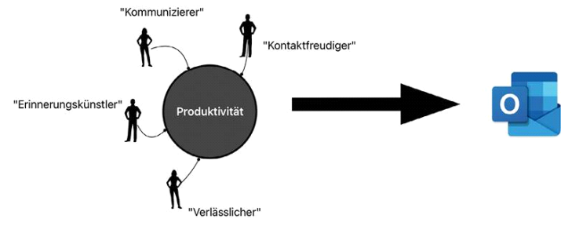

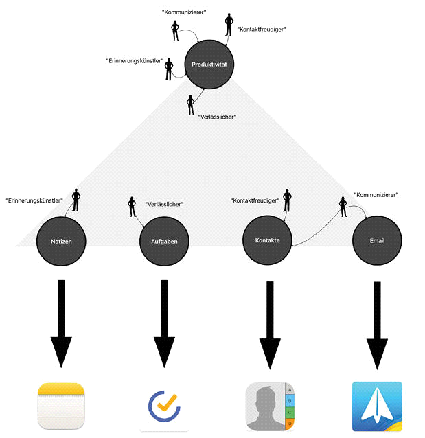

---

<!-- Page 14 of 27 -->

○ Less interactions than in one size fits all software:
Perspectives
○ What if even Applications do not show interactions?
○ A user role can have different perspectives within an application
○ Do not look to frontend as a monolith
○ Divide frontend into more smaller pieces by perspective
○ E.g. Menu with different parts
Microsoft Word
Slicing Page 14

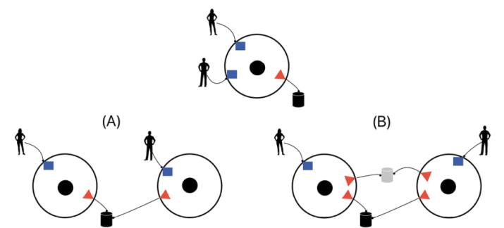

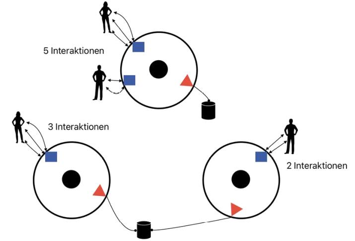

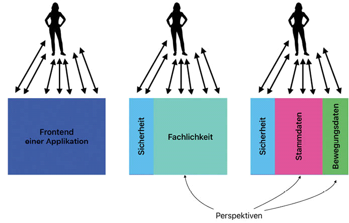

---

<!-- Page 15 of 27 -->

○ Microsoft Word
▪ Write Text
▪ Create Smart Art / Diagrams
▪ Etc.
○ Slicing is not about the HOW (UX / Visualization),
○ it´s about the WHAT and finding
○ interactions / trigger functions that the user wants to do
Dialogs
○ Below Perspectives
○ One Perspective contains 1 or N dialogs
○ Example: Billing system with the following Perspectives and Dialogs
○ Each Perspective helps to identify the Dialogs
○ UI/UX Expert helps for defining Dialogs/UI
○ Which Dialogs exist
○ How do they depend on each other
○ How can user navigate from one to another one
○ Each transition is an Interaction
Slicing Page 15

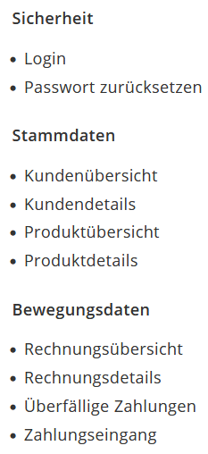

---

<!-- Page 16 of 27 -->

○ Unidirectional
○ Rechungsübersicht -> Überfällige Zahlungen
○ User can go back but without triggering new behavior, just close dialog
○ Forward and Backward
○ Login -> Rechnungsübersicht
○ Maybe back to Login-Dialog for logout
○ Sometimes Dialog just occurs
○ Login Dialog during start
○ Sometimes no switch
○ Login Dialog -> Reset Password
○ Bidirectional
○ Customer overview <-> Customer details
○ Way back not optional
○ Data may have changed and saved
○ Post-It notes may help to move and get a feeling for the best navigation between Dialogs
○ Could also be a Shell UI (navigation bar e.g. like in smartphone apps)
Slicing Page 16

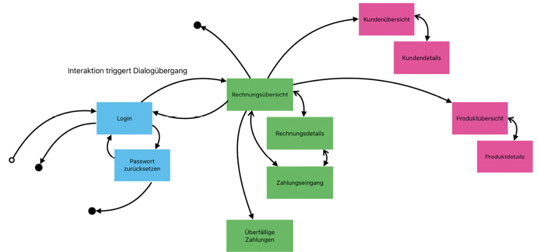

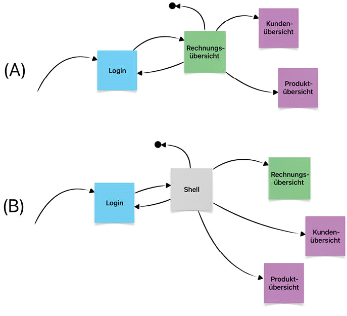

---

<!-- Page 17 of 27 -->

○ When you work with User Stories and Use Cases you need to discuss Perspectives and Dialogs with PO
Interactions
○ When you have identified the software´s dialogs or a subset of them that are sufficient for one increment then you
know the first potential interactions
○ Those who have transitions between the dialogs
Next step zoom into dialogs
○ How does the dialog look like?
○ What should happen when within the dialog? E.g. in Invoice Overview
○ Create new invoice
○ Display existing invoice
○ Filter
○ Delete
○ How is the recording of input structured for each interaction?
○ How is the presentation of the output structured for each interaction?
○ How exactly should the interaction be triggered? Click, Keyboard etc.
○ => Layout questions => support from UI/UX expert
○ What Entry Points to call from interactions?
○ Depends on UI technology, e.g. grid control supports filtering then no Entry Point necessary
○ Dialogs overview: Use simple sketch for big picture without details of dialogs and interactions
○
○ Pick and sketch one dialog, e.g. Invoice overview
○
Some interactions just taken from previous sketch "Dialogs overview" (1) and (2)
Slicing Page 17

|  |
| --- |
|  |

|  |
| --- |
|  |
|  |

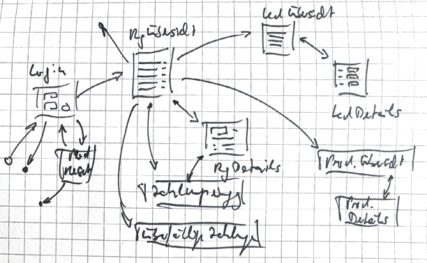

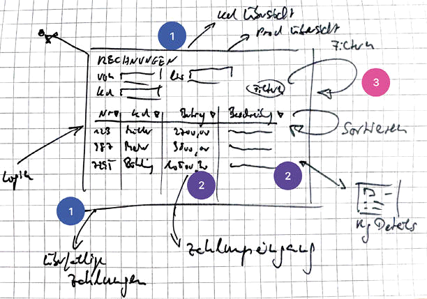

---

<!-- Page 18 of 27 -->

○ Some interactions just taken from previous sketch "Dialogs overview" (1) and (2)
○ Some arrows are starting from different points
○ Edge: transition to other dialog (1)
○ Within: interaction of specific element (2)
○ Some interactions are new, not visible in previous "Dialog overview" e.g. Filter (3)
Entry Points
○ From previous Dialogs and it´s interactions you know the data and how to display it
○ Now possible to define the interface / Entry Point signature
○ Name of action / Entry Point function(1)
▪ Filter
○ Parameters of function (2)
▪ from, to, date
○ Return value (3)
▪ InvoicePO[]
▪ PO = Projection Object = DTO between Frontend and Domain
Recap
○ Start on System level
○ Try to find user interactions
○ Typically not all interactions are visible here
○ Go to next levels and divide previous level into smaller parts / scopes
○ Each part of each level is part of an increment / slice
○ Each increment adds value for customer
○ No level is a must
○ but at least go to System level to see environment
○ Go to the level where you need clarity
○ Try first on interaction level
○ If unclear, see if you can split into Applications, or look for Perspectives in frontend
○ At the end you should have a result of
○ Dialogs with their interactions
○ Entry Point functions with tests
○ These should also be the result of PO discussions in case you have User Stories / Use Cases
Slicing Page 18

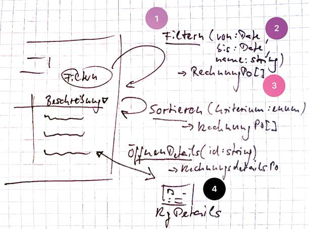

---

<!-- Page 19 of 27 -->

Context and Worker (Level 2/4)
Sonntag, 8. Dezember 2024 13:46
Rough Slices of the Requirements in Big Software Systems
• Context and Worker useful in big software systems
Context
• Example:
• All Apps known?
• Some may obvious: Web Shop, Prime Video Desktop App
• Even with a rough overview not all apps known:
Slicing Page 19

---

<!-- Page 20 of 27 -->

• You cannot see all user roles and resources at this high level
• Need to divide System into Contexts
○ Bounded Contexts in DDD
•
• How to find Contexts?
○ On App level: you look for single user roles
○ On Context level: Look for groups of user roles
○ Roles with common (domain) language belong together
• But problem
○ e.g. the word "Product" is not the same for Customer as for the Warehouse team
○ Exclusion is needed otherwise you get
▪ One size fits all domain
▪ One big data model: not flexible
▪ Changes are difficult and may produce conflict for other roles
Slicing Page 20

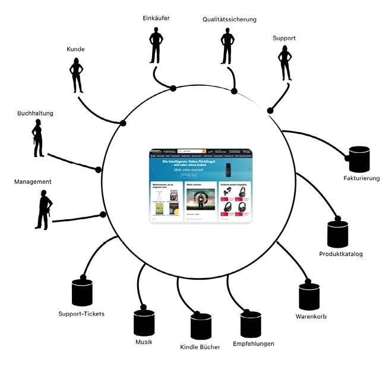

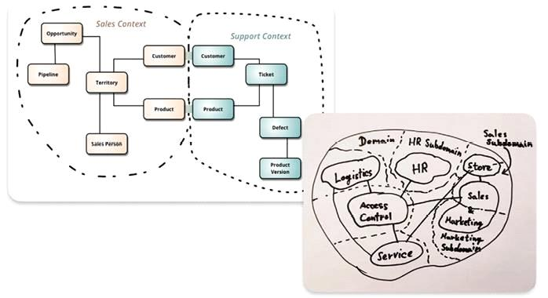

---

<!-- Page 21 of 27 -->

• Context helps to separate with own
○ Domain / language
○ Resources
○ Data models / Persistence
• Each Context is an own subsystem
Slicing Page 21

---

<!-- Page 22 of 27 -->

•
• Now "Product" exists in each Context
• DRY principle is broken here by intention otherwise
○ Creates dependencies
○ Inflexible
○ Unstable
• Eventual Consistency
○ Is the price to pay for independency, flexibility, clearness
○ No ACID transactions from one context to another
• Contracts between Contexts
○ Platform neutral
○ Maybe different programming languages
• Introduction of Contexts depend on size of the software system
• Be sensible when terms are unclear and not unique for you
○ -> Context required
○ -> Search for different domain languages
Worker
• On each Slicing Level you try to find the next smaller parts of elements of current level
• Context (domain languages) -> Apps (single roles) -> ?
○ e.g. Different Apps for warehouse workers and dispatchers
Slicing Page 22

---

<!-- Page 23 of 27 -->

○
•
• Typically App is monolith
○ One process of OS
○ Simple
○ But code with high coupling if not modularized very well
• But not all kind of requirements possible with one process
○ Security
○ Scalability
○ Robust
• One App can consist of two processes
○ e.g. Client and Server
• Process = Worker
○ Service
○ Microservice
• Requires effort for thinking of communication architecture
• Complex
○ Testing
○ Deployment
○ Operation
○ Expensive
• Only required for non-functional requirements
• Must be sure you need it
• History
○ 40 years: Monolith
○ 30 years: Client / Server
○ 20 years: service oriented (multiple servers)
○ 10 years: Micro services (docker)
○ Recent years: Modulith (component oriented monolith)
Slicing Page 23

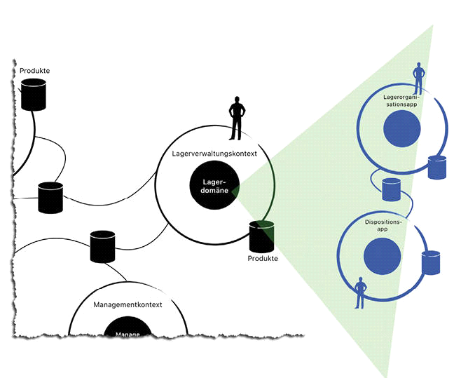

---

<!-- Page 24 of 27 -->

Slicing Page 24

---

<!-- Page 25 of 27 -->

Find Increments within Interactions - Features (Level 10)
Mittwoch, 11. Dezember 2024 17:39
• Slicing helps to
○ Break down requirements in small increments
○ Enable quick feedback
○ Agile software development
• Addresses the questions
○ "whether or not" increment has to be realized
○ Quality of the increment
Existential Increments
• Focus whether increment exists or not
• Entry Points (Functions with signature and test cases)
○ as concrete starting points
○ Lowest level of breakdown of existential increments
• Identification of Entry Points is complete when their existence, signatures and test cases clear
• Goal: Find out quickly if requirements heading in rightdirection
• Breadth first
○ System
○ Context
○ App
○ Worker
• Depth
○ At some point pick one branch to go into depth within Worker
○ Perspectives
○ Dialogs
○ Interactions
○ Entry Points
○ CQS
Qualitative Increments
• Describing various stagesof behavior of Entry Point implementation
• Relation to quality
• Two dimensions
○ Tangible quality: Directly perceivable by customer/PO e.g. Data persistence in task management example
○ Intangible quality: Internal code quality (testability, modularization)
Slicing Page 25

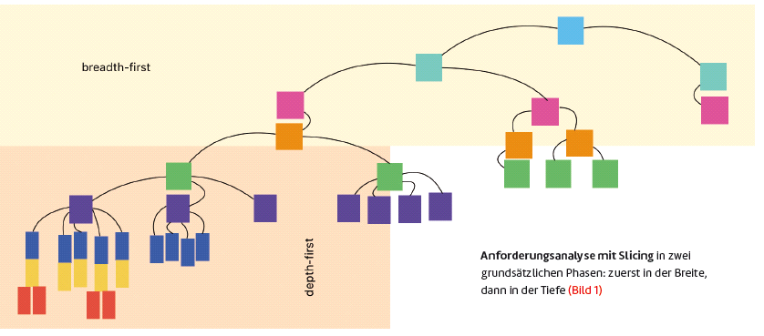

---

<!-- Page 26 of 27 -->

• The speed of implementation can be influencedby adjusting the number, external, and internal qualityof the increments.
• It is recommended to initiallyimplement few existentialincrements with lowerexternal and internal quality and then gradually
improvethem.
• Value incrementsare deliverableand generate added value for the customer.
• Insight increments
○ serve internal knowledge gain and help determine if development is on the right track.
○ should be strategically placed at the beginning to learn quickly and avoid costly detours.
Slicing Page 26

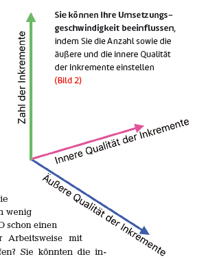

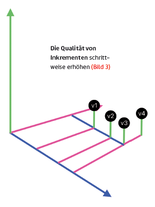

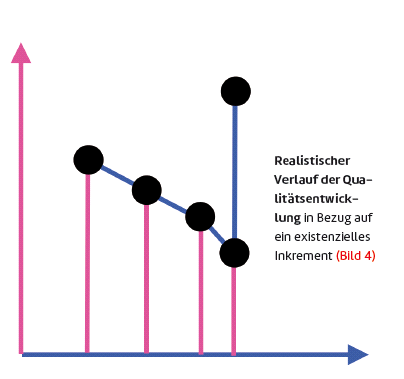

---

<!-- Page 27 of 27 -->

16-Hour Rule and Features
• Not more recommended to implement an increment to enable quick feedback.
• Featuresare increments within an EPand representimplemented decisionswithin the scope of an EP
• They should be encapsulated in functions and labeled with an identifier.
• The development of a value incrementis seen as the completion of a path of insight increments
Single Responsibility Principle (SRP)
• The SRP serves as a guideline for analysis and design.
• Each customer decision should be made explicit and represented in a separate unit of code (function, class, module).
• The SRP helps identify features and structure the code so that it can easily adapt to changes.
Slicing Page 27

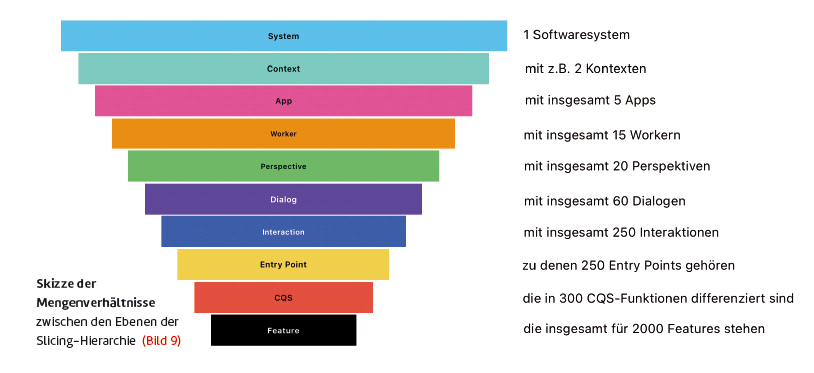

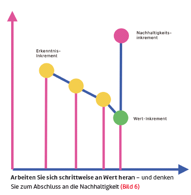
